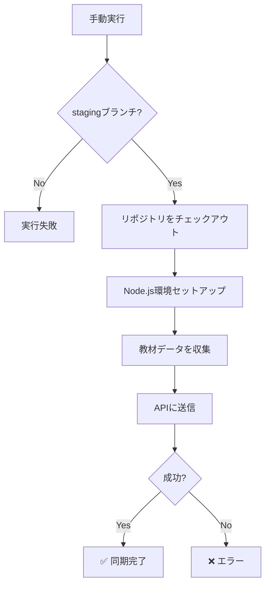
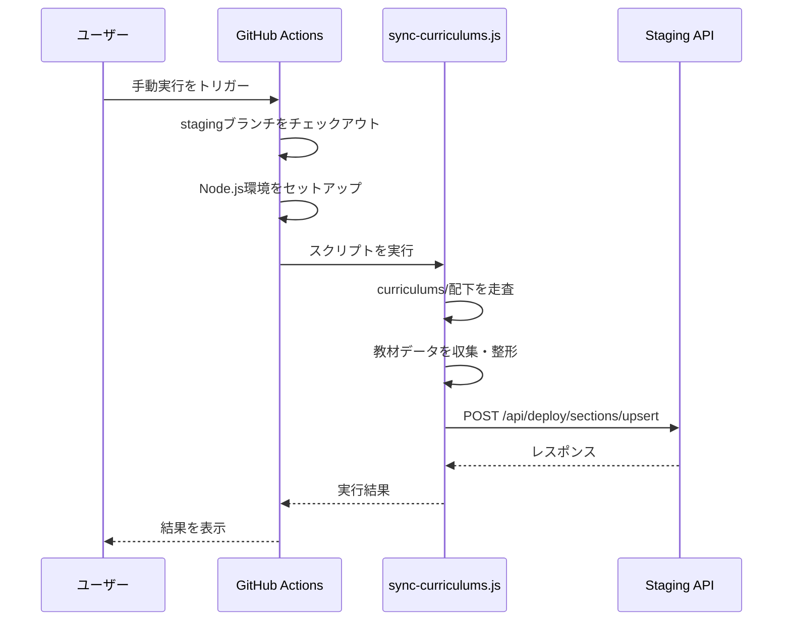
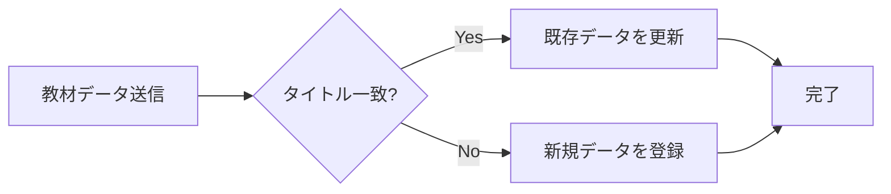
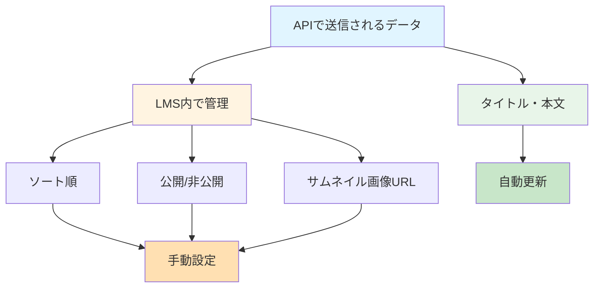

# GitHub Actions ワークフロー

このディレクトリには、カリキュラムをStaging環境および本番環境に同期するためのGitHub Actionsワークフローとスクリプトが含まれています。

## 📋 目次

- [ワークフロー概要](#ワークフロー概要)
- [実行方法](#実行方法)
- [前提条件](#前提条件)
- [教材の構造](#教材の構造)
- [画像リンクのS3置換](#画像リンクのs3置換)
- [API仕様](#api仕様)
- [トラブルシューティング](#トラブルシューティング)

## ワークフロー概要

### sync-curriculums-staging.yml

`staging`ブランチ内の教材コンテンツをStaging環境に登録・更新するワークフローです。

### sync-curriculums-production.yml

`main`ブランチ内の教材コンテンツを本番環境に登録・更新するワークフローです。



**重要な注意点：**

- ⚠️ **手動実行のみ**：誤爆を防ぐため、現在は`workflow_dispatch`（手動実行）のみをサポートしています
- 🔒 **ブランチ制限**：
  - Staging環境：`staging`ブランチでのみ実行可能
  - 本番環境：`main`ブランチでのみ実行可能
- 📝 **将来の拡張**：pushによる自動化も検討中ですが、安全性を優先して一旦保留しています

### replace-image-links-staging.yml

教材Markdown内の **`src=""`（空）の img タグ** を検出し、`alt` 属性の値をファイル名として `image/` ディレクトリから画像をS3にアップロードし、`src` をS3の公開URLに置換するワークフローです。置換後は変更をコミットしてPRを自動作成します。

- ⚠️ **手動実行のみ**：`workflow_dispatch` で実行
- 📂 **対象**：`staging` ブランチの `curriculums/` 配下の `.md` ファイル
- 🔗 **PR**：変更がある場合のみ、`staging` 向けのPRが自動作成されます

### replace-image-links-main.yml

上記と同じ画像リンク置換処理を **`main`** ブランチ向けに実行するワークフローです。

- ⚠️ **手動実行のみ**：`workflow_dispatch` で実行
- 📂 **対象**：`main` ブランチの `curriculums/` 配下の `.md` ファイル
- 🔗 **PR**：変更がある場合のみ、`main` 向けのPR用ブランチが push されます

## 実行方法

### 1. GitHub上での手動実行

#### Staging環境への同期

1. GitHubリポジトリの「Actions」タブを開く
2. 左サイドバーから「**教材をStaging環境に登録・更新**」を選択
3. 「Run workflow」ボタンをクリック
4. ブランチを`staging`に設定（デフォルトで選択されているはず）
5. 「Run workflow」をクリックして実行

#### 本番環境への同期

1. GitHubリポジトリの「Actions」タブを開く
2. 左サイドバーから「**教材を本番環境に登録・更新**」を選択
3. 「Run workflow」ボタンをクリック
4. ブランチを`main`に設定（デフォルトで選択されているはず）
5. 「Run workflow」をクリックして実行

### 2. 実行フロー



## 前提条件

### 必要なGitHub Secrets

以下のシークレットがリポジトリに設定されている必要があります：

#### Staging環境用

| Secret名               | 説明                         | 必須 |
| ---------------------- | ---------------------------- | ---- |
| `STAGING_API_URL`      | Staging環境のAPIベースURL    | ✅   |
| `STAGING_API_KEY`      | API認証用のBearerトークン    | ✅   |
| `STAGING_WORKSPACE_ID` | ワークスペースID（ULID形式） | ✅   |

#### 本番環境用

| Secret名                  | 説明                         | 必須 |
| ------------------------- | ---------------------------- | ---- |
| `PRODUCTION_API_URL`      | 本番環境のAPIベースURL       | ✅   |
| `PRODUCTION_API_KEY`      | API認証用のBearerトークン    | ✅   |
| `PRODUCTION_WORKSPACE_ID` | ワークスペースID（ULID形式） | ✅   |

### シークレットの設定方法

1. リポジトリの「Settings」→「Secrets and variables」→「Actions」を開く
2. 「New repository secret」をクリック
3. 上記のSecret名と値を設定

## 教材の構造

教材は3階層のディレクトリ構造で管理されています。

### ディレクトリ構造

```
curriculums/
├── {チュートリアルのタイトル}/
│   ├── {チャプターのタイトル}/
│   │   ├── {セクションのタイトル}.md  ← セクションの本文（Markdown）
│   │   ├── {セクションのタイトル}.md
│   │   └── ...
│   ├── {チャプターのタイトル}/
│   │   └── ...
│   └── ...
├── {チュートリアルのタイトル}/
│   └── ...
└── ...
```

### 命名規則

- **チュートリアル**: `curriculums/`直下のディレクトリ名
- **チャプター**: チュートリアルディレクトリ内のサブディレクトリ名
- **セクション**: チャプターディレクトリ内の`.md`ファイル名（拡張子を除く）

**例：**

```
curriculums/
└── react-basics/                    ← チュートリアル: "react-basics"
    └── getting-started/             ← チャプター: "getting-started"
        └── introduction.md          ← セクション: "introduction"
```

この場合、セクションの本文は`introduction.md`のMarkdownコンテンツになります。

## 画像リンクのS3置換

「**画像リンクをS3 URLに置換（staging）**」および「**画像リンクをS3 URLに置換（main）**」ワークフローは、教材Markdown内の画像参照をGitHub依存からS3の公開URLに置き換えるために使用します。

### 対象となる img タグ

- `src=""` または `src=''` の **空の src** を持つ img タグのみが対象です
- 各タグには **`alt` 属性が必須** です。`alt` の値が `image/` 配下のファイル名として扱われます
- 1ファイル内に複数の対象 img タグがある場合、**すべて** 変換されます

### 必要な設定

#### GitHub Secrets（画像置換ワークフロー用）

| Secret名               | 説明                    | 必須 |
| ---------------------- | ----------------------- | ---- |
| `AWS_ACCESS_KEY_ID`    | AWS認証用アクセスキーID | ✅   |
| `AWS_SECRET_ACCESS_KEY`| AWS認証用シークレット   | ✅   |

#### GitHub Variables（リポジトリ変数）

| Variable名           | 説明                     | 必須 |
| -------------------- | ------------------------ | ---- |
| `AWS_REGION`         | S3バケットのリージョン   | ✅   |
| `S3_BUCKET`          | 画像をアップロードするS3バケット名 | ✅   |
| `S3_PUBLIC_BASE_URL` | 画像の公開URLのベース（例: `https://xxx.cloudfront.net`） | ✅   |

### 実行手順

1. GitHubリポジトリの「Actions」タブを開く
2. **staging 用**：左サイドバーから「**画像リンクをS3 URLに置換（staging）**」を選択し、「Run workflow」で実行（ブランチは `staging`）
3. **main 用**：左サイドバーから「**画像リンクをS3 URLに置換（main）**」を選択し、「Run workflow」で実行（ブランチは `main`）
4. 変更がある場合、`chore/replace-image-links-*` ブランチが作成され、それぞれ `staging` 向け・`main` 向けのPRを手動で作成できます

### ディレクトリ・ファイルの前提

- 画像ファイルはリポジトリ直下の **`image/`** ディレクトリに配置します
- Markdown内の `alt` の値（例: `screenshot.png`）と、`image/screenshot.png` のファイル名が一致している必要があります

## API仕様

### 教材登録・更新API（LMS）

このAPIに教材の内容を送信すると、Staging環境（または本番環境）の教材コンテンツを更新できます。

#### エンドポイント

```
POST {API_URL}/api/deploy/sections/upsert
```

#### リクエスト形式

```json
{
  "workspaceId": "ワークスペースID（ULID形式）",
  "curriculums": [
    {
      "title": "チュートリアルのタイトル",
      "chapters": [
        {
          "title": "チャプターのタイトル",
          "sections": [
            {
              "title": "セクションのタイトル",
              "text": "Markdown形式の本文"
            }
          ]
        }
      ]
    }
  ]
}
```

#### 認証

`Authorization: Bearer {API_KEY}` ヘッダーで認証を行います。

#### 更新判定ロジック

**タイトルベースの判定：**

- どの教材を登録・更新するかは**タイトルで判定**されます
- タイトルが一致する既存の教材があれば更新、なければ新規登録されます



#### LMS内で管理する項目

以下の項目は**API経由では更新されず**、LMS管理画面内で操作する必要があります：

| 項目                  | 説明                           | 更新時の動作                                                                                           |
| --------------------- | ------------------------------ | ------------------------------------------------------------------------------------------------------ |
| **ソート順**          | 教材の表示順序                 | 更新時：既存の並び順はリセットされない<br>新規時：デフォルト順序で登録                                 |
| **公開/非公開**       | 教材の公開状態                 | 更新時：既存の公開状態はリセットされない<br>新規時：デフォルト状態で登録                               |
| **サムネイル画像URL** | チュートリアルのサムネイル画像 | デフォルト：空文字列で登録<br>⚠️ 公開時はLMS内で必須入力項目になるため、画像なしで公開されることはない |



## トラブルシューティング

### よくあるエラーと対処法

#### 1. `API_URL is not set`

**原因：** GitHub Secretsに環境変数が設定されていない（スクリプト内では`API_URL`として読み込まれます）

**対処法：**

- Staging環境の場合：`STAGING_API_URL`が設定されているか確認
- 本番環境の場合：`PRODUCTION_API_URL`が設定されているか確認
- リポジトリのSettings → Secrets and variables → Actionsで確認
- 必要に応じてシークレットを追加

#### 2. `API_KEY is not set`

**原因：** GitHub Secretsに環境変数が設定されていない（スクリプト内では`API_KEY`として読み込まれます）

**対処法：**

- Staging環境の場合：`STAGING_API_KEY`が設定されているか確認
- 本番環境の場合：`PRODUCTION_API_KEY`が設定されているか確認
- リポジトリのSettings → Secrets and variables → Actionsで確認
- 必要に応じてシークレットを追加

#### 3. `WORKSPACE_ID is not set`

**原因：** GitHub Secretsに環境変数が設定されていない（スクリプト内では`WORKSPACE_ID`として読み込まれます）

**対処法：**

- Staging環境の場合：`STAGING_WORKSPACE_ID`が設定されているか確認
- 本番環境の場合：`PRODUCTION_WORKSPACE_ID`が設定されているか確認
- リポジトリのSettings → Secrets and variables → Actionsで確認
- 必要に応じてシークレットを追加

#### 4. `API request failed` (HTTPステータスコードが200以外)

**原因：** APIリクエストが失敗した

**対処法：**

- ワークフローのログでレスポンスボディを確認
- APIのエラーメッセージを参照
- API URLやAPI Keyが正しいか確認

#### 5. 指定されたブランチ以外で実行できない

**原因：** ワークフローは特定のブランチでのみ実行可能

**対処法：**

- Staging環境の場合：`staging`ブランチに切り替えてから実行、または`staging`ブランチにマージしてから実行
- 本番環境の場合：`main`ブランチに切り替えてから実行、または`main`ブランチにマージしてから実行

#### 6. 教材が正しく更新されない

**原因：** タイトルが一致していない可能性

**対処法：**

- ディレクトリ名やファイル名のタイトルが正確か確認
- タイトルに特殊文字や空白が含まれていないか確認
- LMS側で既存の教材タイトルと一致しているか確認

#### 7. 画像リンク置換で「S3_BUCKET, S3_PUBLIC_BASE_URL, AWS_REGION が必要です」

**原因：** 画像置換ワークフロー用のリポジトリ変数（Variables）が未設定

**対処法：** Settings → Secrets and variables → Actions の **Variables** タブで `AWS_REGION`・`S3_BUCKET`・`S3_PUBLIC_BASE_URL` を設定する。AWS認証には **Secrets** の `AWS_ACCESS_KEY_ID` と `AWS_SECRET_ACCESS_KEY` が必要。

#### 8. 画像リンク置換で「alt属性なし」または「画像ファイルが見つかりません」

**原因：** 対象の img タグに `alt` が無い、または `alt` の値と同名のファイルが `image/` に無い

**対処法：** 該当Markdown内の img タグに `alt="ファイル名"` を付け、リポジトリ直下の `image/` にそのファイル名の画像を配置する。

### ログの確認方法

1. GitHubリポジトリの「Actions」タブを開く
2. 実行したワークフローをクリック
3. 「**教材データを収集してAPIに送信**」ステップを展開
4. ログを確認：
   - `Collected: X curriculums, Y chapters, Z sections` - 収集された教材数
   - `API URL: ...` - 使用されたAPI URL
   - `HTTP Status Code: ...` - APIレスポンスのステータスコード
   - `Response Body: ...` - APIレスポンスの詳細

## スクリプトの汎用性

`sync-curriculums.js` スクリプトは環境に依存しない汎用的な実装になっています。Staging環境だけでなく、本番環境でも同じスクリプトを使用できます。

### 環境変数のマッピング

スクリプトは以下の環境変数を読み込みます：

- `API_URL` - APIのベースURL
- `API_KEY` - API認証用のBearerトークン
- `WORKSPACE_ID` - ワークスペースID（ULID形式）

ワークフローファイルでは、これらの環境変数に適切なシークレットをマッピングします：

**Staging環境の場合：**

```yaml
env:
  API_URL: ${{ secrets.STAGING_API_URL }}
  API_KEY: ${{ secrets.STAGING_API_KEY }}
  WORKSPACE_ID: ${{ secrets.STAGING_WORKSPACE_ID }}
```

**本番環境の場合（例）：**

```yaml
env:
  API_URL: ${{ secrets.PRODUCTION_API_URL }}
  API_KEY: ${{ secrets.PRODUCTION_API_KEY }}
  WORKSPACE_ID: ${{ secrets.PRODUCTION_WORKSPACE_ID }}
```

## 関連ファイル

| 種別     | ファイル | 説明 |
| -------- | -------- | ----- |
| ワークフロー | `.github/workflows/sync-curriculums-staging.yml` | 教材をStaging環境に登録・更新 |
| ワークフロー | `.github/workflows/replace-image-links-staging.yml` | 教材内の画像リンクをS3 URLに置換（staging） |
| ワークフロー | `.github/workflows/replace-image-links-main.yml` | 教材内の画像リンクをS3 URLに置換（main） |
| スクリプト | `.github/scripts/sync-curriculums.js` | 教材データ収集・API送信 |
| スクリプト | `.github/scripts/replace-image-links.js` | 空 src の img タグ検出・S3アップロード・置換 |
