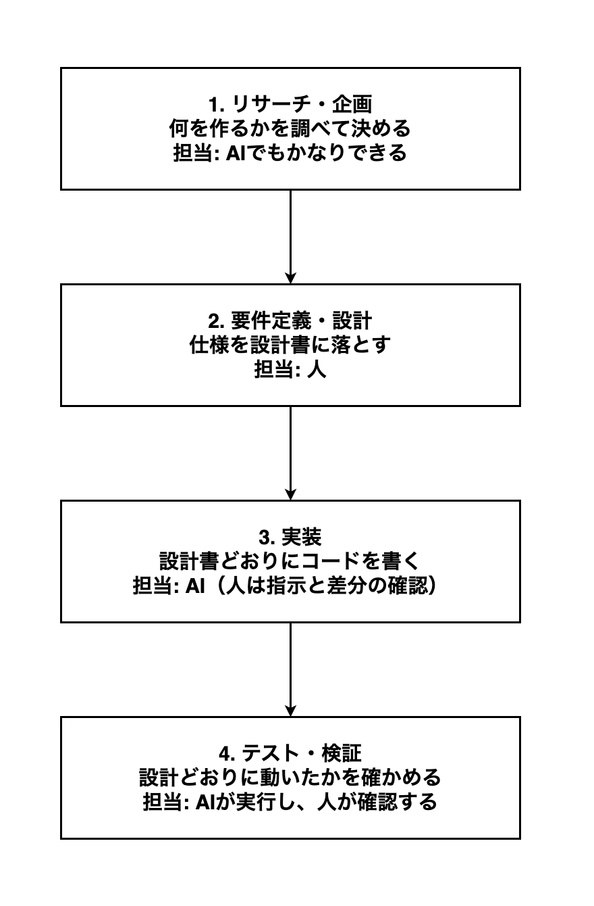

# 13-1-1: 設計とは何か

## 🎯 このセクションで学ぶこと

- 開発の4つの工程のどこに設計があり、どこを人が担い続けるのかを説明できるようになる。
- 設計書が完成したと言える基準を、自分の言葉で言えるようになる。
- 設計を飛ばして作り始めたときに起きるやり直しを、具体例で説明できるようになる。

---

## 導入：作るものは、いつも決まっていた

Tutorial 12までで、皆さんはLaravelでアプリを作り、ログイン機能を付け、APIを公開し、テストも書いてきました。それが書けたのは、作るものが毎回決まっていたからです。9-4-9「Eloquent ORM - ハンズオン演習」では、始める前に「投稿の一覧が表示できる」から「公開日時が表示できる」までの要件が5行渡され、`posts`テーブルのカラム構成の表と完成画面の画像も付いていました。何ができたら終わりなのかが、始める前から決まっていたのです。

いま「社内で使う、備品の貸出アプリを作ってください」とだけ言われたとします。コードを書く力はもう十分にありますが、それでも手は止まります。画面はいくつ必要か。テーブルには何を持たせるか。何ができあがったら「完成しました」と言えるのか。止まる理由は、書き方を知らないことではありません。**作るものが決まっていない**ことです。

この「作るものを決めて、書き残す」作業が設計です。Tutorial 13では、1行もコードを書きません。そのかわり、これまで教材の側が用意していた要件やカラム構成の表を、自分の手で作れるようになります。

---

## 開発の4つの工程と、設計の居場所

1-1-6「AIの活用法」で、SE（設計する人）とプログラマー（実装する人）という分業が、AIを率いる一人のエンジニアへ統合されつつある、という話をしました。Tutorial 13は、そのうちの設計する側を自分のものにするためのTutorialです。

ソフトウェアを作る仕事は、大きく4つの工程に分かれます。

**開発の4つの工程と、それぞれの担当**

Tutorial 13が扱うのは、2番の要件定義・設計です。

要件定義（作るものの条件を洗い出して、これで作ると確定させる作業）と設計は、現場では地続きです。どこまでが要件定義で、どこからが設計なのかという線引きは、会社によっても案件によっても変わります。そのためこの教材では、2つをひと続きの工程として扱います。ただし、要件定義そのものは皆さんの担当にしません。「社員が備品を借りて、返せるようにしたい」という**何が欲しいか**は、依頼する人の側から文章で渡されます。これが仕様です。皆さんの担当はその先で、渡された仕様を、画面はいくつ必要で、どんなデータを持ち、どの順で処理が流れるのかという**どう作るか**に翻訳し、図と表と文章に書き起こします。

1番のリサーチ・企画は扱いません。図に「AIでもかなりできる」と書いたのは、世の中や似たサービスを調べて案を並べるところまでの話です。1-1-6で確認したとおり、出発点は「誰の、どんな困りごとを解決するのか」という人間側の意図であり、並んだ案のどれを選ぶのかを決めるのも人です。この教材では、その選んだ結果が仕様として渡されるところから始めます。デザイン（画面の色や装飾の仕上げ）も同じく、与えられるものとして進めます。「仕様」は誰かから受け取る側の言葉、「設計書」は自分が作る側の言葉、と覚えておいてください。

3番の実装をAIに任せられるようになったからこそ、2番の精度が結果を左右します。指示のもとになる設計が曖昧なら、AIは曖昧なまま高速に作ります。4番のテスト・検証で動かすのはAIでも、これでよしと判断するのは人です。判断できるのは、何が正しいかを2番で決めた人だけです。

もっとも、すべてを同じ深さで身につける必要はありません。求められる深さは、対象によって3段階に分かれます。

| 到達度 | 意味 | 主な対象 |
|:-------|:-----|:---------|
| 設計できる | 白紙から自分の手で作れる | 設計書一式（機能・画面・API・データ・振る舞い・構造・テスト）と、その図 |
| 書ける・読める | 自力で実装でき、AIが書いたコードを読んで直せる | PHPの文法・SQL・Laravelの中心部分（MVC・Eloquent・認証と認可・バリデーション）・Git |
| 任せて検証できる | AIに書かせて、正しいかを確かめられればよい | 決まりきったCRUD処理の量産、CSSの細部、テストコードの記述 |

Tutorial 12までで積み上げてきたのが、真ん中の「書ける・読める」です。一番下の「任せて検証できる」に降ろせる作業は、これから増えていきます。一番上の「設計できる」だけは、他へ渡せません。ここを白紙から作れるようにするのが、Tutorial 13です。

---

## 🔑 設計とは「実装に入れる状態」を作ること

設計という言葉は日常でも使いますが、この教材では意味を1つに絞ります。設計とは、受け取った仕様から、実装に必要な決めごとを**すべて決めて、書き残す作業**です。

「書き残す」までが設計です。頭の中で決まっているだけでは、他の人にもAIにも伝わりません。図や表や文章の形にしたものを、設計書と呼びます。

どこまで決めて書けば設計が終わったと言えるのか、基準は1つだけです。設計書のゴールは「**それを見たら、人でもAIでもすぐ実装に入れる状態**」です。

「すぐ実装に入れる」とは、読んだ人が「たぶんこうだろう」と推測しなくてよい、ということです。推測の余地が残っていれば、その分だけ、できあがるものは書いた人の想像とずれます。

判定の仕方は簡単です。実装する人から質問が来たときに、答えを設計書の中から指して示せるかどうかを見ます。質問が来ること自体は困りごとではありません。答えが設計書にあるなら、その設計は完成しています。答えがどこにも書かれていない質問が来たら、そこが設計の穴です。

この判定は、相手がAIでも変わりません。Chapter 8では、自分で作った設計書一式をAIに読ませて、答えられない質問が残っていないかを確かめます。

決めるべきことは、1種類ではありません。誰が何をできるのか、どの画面で何を入力して次にどこへ進むのか。画面とサーバーはどんなデータをやり取りし、それをどんなテーブルに保存するのか。処理はどの順番で流れ、途中で想定外のことが起きたらどうなるのか。コードをどんな部品に分け、完成したかどうかを何で確かめるのか。これらを1つずつ図と表にしていくのが、Chapter 2から先の内容です。

> 💡 **TIP**: 導入で触れた9-4-9の`posts`テーブルのカラム構成の表も、設計書の一部です。データ設計の成果物である、テーブル定義書にあたります。皆さんはこれまで、設計書を渡されて読む側にいました。Tutorial 13で、書く側に回ります。

---

## 🔑 設計しないと何が起きるか

導入で挙げた備品の貸出アプリで見てみます。仕様書には「社員が備品を借りて、返す」とだけ書かれていて、この一文からいきなり作り始めたとします。

作り始めてすぐ、決まっていないことにぶつかります。

- 同じ備品を、2人が同時に借りられるのか。それとも、1点につき1人だけか。
- 返却期限を過ぎた貸出があることを、誰が、どうやって知るのか。
- 総務の担当者は、他の社員の貸出記録を取り消せるのか。

どれも、決めなければ手が動きません。ですから作る人は、その場で「たぶんこうだろう」と埋めて進みます。AIに実装を頼んだ場合も同じで、しかもAIは、いちいち確認せずにもっともらしく埋めてしまうことがあります。

やっかいなのは、埋めたことに誰も気づかないまま進む点です。依頼した総務の人は「備品は1点しかないのだから、借りられるのは1人に決まっている」と思っていて、仕様書に書くまでもない当たり前のことだと考えています。作る側は貸出の記録を保存するつもりで、同じ備品に何件でも貸出が登録できるように作ります。どちらも自分の中では筋が通っているので、動かして見せるまで、ずれが表に出てきません。

そうして埋めた前提が、依頼した人の想定と違っていたとき、作り直しが起きます。この作り直しを**手戻り**と呼びます。手戻りが重いのは、気づくのが遅いほど、直す範囲が広がるからです。「同じ備品を2人が同時に借りられるか」を、気づいた時点ごとに比べてみます。

| 気づいた時点 | やり直しの範囲 |
|:-------------|:---------------|
| 設計中 | 図と表の該当箇所を直す。コードはまだ1行も書いていない |
| 実装中 | マイグレーションを追加し、モデル・コントローラー・画面を直す。書いたテストも直す |
| 動かして依頼者に見せたあと | 上のすべてに加えて、すでに保存されたデータの移し替えも必要になる |

3つ目の「総務の担当者は取り消せるのか」だと、範囲は横にも広がります。総務の人が見ているときだけ取り消しボタンを出す画面の出し分け、Tutorial 10のChapter 3「権限の管理」で学んだ認可（そのユーザーがその操作をしてよいかを判定する仕組み）の処理、そもそも誰が総務の担当者なのかを見分けるための列が社員のテーブルにあるか。この3か所をまとめて直すことになります。設計の段階なら、「総務の担当者は、他の社員の貸出記録を取り消せる」と1行書き留めておくだけで済んだ話です。

実装をAIに任せられる時代ほど、設計の曖昧さは高くつきます。1日かけて手で書いていた画面が数分ででき上がるなら、間違った前提のまま作られる量も、その速さで増えるからです。

---

## Tutorial 13の進め方

どの設計書も、次の3段で身につけます。

1. **読む**: 完成した実例を見て、そこから何が読み取れるかを確かめます。
2. **手元のアプリで描く**: 配布するスターターアプリのコードを、図に起こします。
3. **お題で描く**: 章末の設計演習で、初めて見る仕様から白紙で作ります。

2段目で使うスターターアプリは、13-1-3で自分のGitHubに用意します。投稿を一覧・編集・削除できるだけの小さなアプリなので、画面もテーブルも図1枚に収まります。Tutorial 14と15でも、同じアプリを使い続けます。

そして、Tutorial 13の間は、設計書をAIに作らせません。設計は、手を動かして覚える種類のものだからです。図を1枚描くと、決めていないことがその場で分かります。頭の中では決まっているつもりでも、線を引く先が無いところで手が止まり、そこが決め忘れです。1-1-6のフェーズ表で、Tutorial 13にだけ特別ルールが置かれているのは、この学習のしかたのためです。

記法や言葉をAIに聞くのは構いません。「この関係はどの記号で描きますか」「レッスンは英語で何と言いますか」といった質問は、どんどんしてください。自分で作るのは成果物のほうです。AIに設計させる進め方は、Tutorial 14で扱います。

---

## ✨ まとめ

- 設計とは、受け取った仕様から、実装に必要な決めごとをすべて決めて、書き残す作業です。書き残したものが設計書です。
- 設計書のゴールは「それを見たら、人でもAIでもすぐ実装に入れる状態」です。答えを設計書の中から指して示せない質問が来たら、そこが設計の穴です。
- 開発の4工程のうち、人が最後まで手放せないのが要件定義・設計です。実装はAIが担い、テスト・検証はAIが実行して人が確認します。
- 設計を飛ばして作り始めると手戻りが起きます。気づくのが遅いほど直す範囲は広がり、実装が速くなるほど、間違った前提で作られる量も増えます。
- Tutorial 13の設計書は、自分の手で描きます。1枚描くと、決めていないことがその場で分かるからです。記法や言葉をAIに質問するのは構いません。

---
