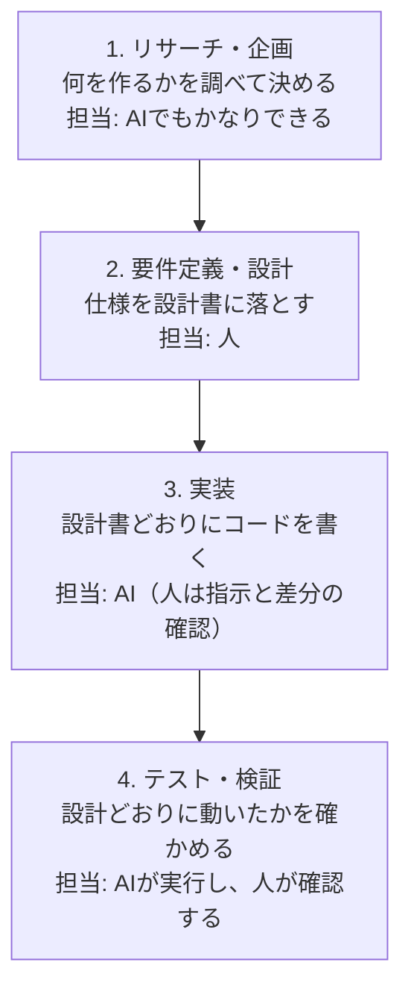

# 13-1-1: 設計とは何か

## 🎯 このセクションで学ぶこと

- 開発の流れのどこに設計があり、どの工程を人が担い続けるのかを説明できるようになる。
- 設計書の完成条件を、自分の言葉で言えるようになる。
- 設計を飛ばして作り始めると、どんなやり直しが起きるのかを具体例で説明できるようになる。

---

## 導入：作るものは、いつも決まっていた

Tutorial 12までで、皆さんはかなりの量のコードを書いてきました。Laravelでブログシステムを作り、ログイン機能を付け、APIを公開し、テストも書きました。ここで一度、なぜそれが書けたのかを振り返ってみてください。

たとえば9-4-9「Eloquent ORM - ハンズオン演習」では、演習を始める前に次の5行が渡されていました。

- 投稿の一覧が表示できる
- 新しい投稿を作成できる
- 投稿を編集できる
- 投稿を削除できる
- 公開日時が表示できる

これに加えて、`posts`テーブルのカラム構成の表と、完成画面のスクリーンショットも用意されていました。だから、手が動いたのです。何を作れば終わりなのかが、始める前から決まっていました。

では、次のように言われたらどうでしょうか。

> 社内で使う、備品の貸出アプリを作ってください。

コードを書く力は、もう十分にあります。それでも、おそらく手は止まります。画面はいくつ必要でしょうか。テーブルは何を作ればよいでしょうか。何ができあがったら「完成しました」と言えるのでしょうか。止まる理由は、書き方を知らないからではありません。**作るものが決まっていない**からです。

この「作るものを決めて、書き残す」作業が設計です。Tutorial 13では、1行もコードを書きません。そのかわり、これまで教材の側が用意してくれていた要件やカラム構成の表を、自分の手で作れるようになります。

---

## 概念の説明

### 🔑 分業の時代から、一人で設計と実装を回す時代へ

1-1-6「AIの活用法」で、SE（設計する人）とプログラマー（実装する人）という分業が、「AIを率いる一人のエンジニア」へ統合されつつある、という話をしました。Tutorial 13は、そのうちの設計する側を、自分のものにするためのTutorialです。

では、設計は開発全体のどのあたりにある仕事なのでしょうか。ソフトウェアを作る仕事は、大きく4つの工程に分かれます。

**開発の4つの工程と、それぞれの担当**

このうち、Tutorial 13が扱うのは2番の要件定義・設計です。ここが、この教材が中心に据える工程になります。

要件定義（作るものの条件を洗い出して、これで作ると確定させる作業）と設計は、現場では地続きの工程です。どこまでが要件定義で、どこからが設計なのかという線引きは、会社によっても案件によっても変わります。ですからこの教材では、この2つを切り離さず、ひと続きの工程としてまとめて扱います。以降、単に「設計」と書いているときは、この要件定義から設計までのひとまとまりを指していると考えてください。

1番のリサーチ・企画は扱いません。図に「AIでもかなりできる」と書いたのは、世の中や似たサービスを調べ、案をいくつも並べるところまでの話です。1-1-6で確認したとおり、設計の出発点は「誰の、どんな困りごとを解決するのか」という人間側の意図であり、並んだ案のどれを選ぶのかを決めるのは、あくまで人です。この教材では、その選ぶところはすでに決まったものとして受け取ります。デザインを含む要件・仕様は**与えられるもの**として進めます。皆さんが担うのは、仕様を受け取ってから、動くものを検証して届けるまでです。「仕様」は誰かから受け取る側の言葉、「設計書」は自分が作る側の言葉、と覚えておいてください。

3番の実装をAIに任せられるようになったからこそ、2番の精度が結果を左右します。指示のもとになる設計が曖昧なら、AIは曖昧なまま高速に作ります。4番のテスト・検証で、動かすのはAIでも、これでよしと判断するのは人です。判断できるのは、何が正しいかを2番で決めた人だけです。

「一人で回す」と聞くと、すべてを同じ深さで身につけなければならないのか、と不安になるかもしれません。そうではありません。求められる深さは、対象によって3段階に分かれます。

| 到達度 | 意味 | 主な対象 |
|:-------|:-----|:---------|
| 設計できる | 白紙から自分の手で作れる | 設計書一式（機能・画面・API・データ・振る舞い・構造・テスト）と、その図 |
| 書ける・読める | 自力で実装でき、AIが書いたコードを読んで直せる | PHPの文法・SQL・Laravelの中心部分（MVC・Eloquent・認証と認可・バリデーション）・Git |
| 任せて検証できる | AIに書かせて、正しいかを確かめられればよい | 決まりきったCRUD処理の量産、CSSの細部、テストコードの記述 |

Tutorial 12までで積み上げてきたのが、真ん中の「書ける・読める」です。一番下の「任せて検証できる」に降ろせる作業は、これから増えていきます。しかし一番上の「設計できる」だけは、他へ渡せません。ここが、Tutorial 13で白紙から作れるようにする部分です。

### 🔑 設計とは「実装に入れる状態」を作ること

設計という言葉は日常でも使いますが、この教材では意味を1つに絞ります。設計とは、受け取った仕様から、実装に必要な決めごとを**すべて決めて、書き残す作業**です。

「書き残す」までが設計です。頭の中で決まっているだけでは、他の人にもAIにも伝わりません。書き残したもの、つまり図や表や文章の形になったものを設計書と呼びます。

では、どこまで決めて書けば、設計は終わったと言えるのでしょうか。基準は1つだけです。設計書のゴールは「**それを見たら、人でもAIでもすぐ実装に入れる状態**」です。

「すぐ実装に入れる」とは、読んだ人が「たぶんこうだろう」と推測しなくてよい、ということです。推測が入る余地が残っていれば、その分だけ、できあがるものは書いた人の想像とずれます。

判定の仕方は簡単です。実装する人から質問が来たときに、答えを設計書の中から指して示せるかどうかを見ます。質問が来ること自体は、悪いことではありません。答えが設計書に書いてあるなら、その設計は完成しています。答えがどこにも書かれていない質問が来たら、そこが設計の穴です。

この判定は、相手がAIでも変わりません。Tutorial 13の最後の章（Chapter 8）では、自分で作った設計書一式をAIに読ませて、答えられない質問が残っていないかを実際に確かめます。

決めるべきことは、1種類ではありません。誰が何をできるのか。どの画面で何を入力し、次にどこへ進むのか。画面とサーバーは、どんなデータをやり取りするのか。そのデータを、どんなテーブルに保存するのか。処理はどの順番で流れ、途中で想定外のことが起きたらどうなるのか。コードをどんな部品に分けるのか。そして、完成したかどうかを何で確かめるのか。これらを1つずつ図と表にしていくのが、Chapter 2から先の内容です。

> 💡 **TIP**: 導入で触れた9-4-9の`posts`テーブルのカラム構成の表も、実は設計書の一部です。テーブル定義書と呼ばれる、データ設計の成果物にあたります。皆さんはこれまで、設計書を渡されて読む側にいました。Tutorial 13で、書く側に回ります。

### 🔑 設計しないと何が起きるか

設計を飛ばすと何が困るのかを、導入で挙げた備品の貸出アプリで具体的に見てみましょう。仕様書には「社員が備品を借りて、返す」とだけ書かれていたとします。この一文から、いきなり作り始めたとしましょう。

作り始めてすぐ、決まっていないことにぶつかります。

- 同じ備品を、2人が同時に借りられるのでしょうか。それとも、1点につき1人だけでしょうか。
- 返却期限を過ぎた貸出があることを、誰が、どうやって知るのでしょうか。
- 総務の担当者は、他の社員の貸出記録を取り消せるのでしょうか。

どれも、決めなければ手が動きません。ですから作る人は、その場で「たぶんこうだろう」と埋めて進みます。AIに実装を頼んだ場合も同じで、しかもAIは、いちいち確認せずにもっともらしく埋めてしまうことがあります。

やっかいなのは、埋めたことに誰も気づかないまま進む点です。1つ目の質問を例にすると、依頼した総務の人は「備品は1点しかないのだから、借りられるのは1人に決まっている」と思っています。わざわざ仕様書に書くまでもない、当たり前のことだからです。一方、作る側は貸出の記録を保存するだけのつもりで、同じ備品に何件でも貸出が登録できるように作ります。どちらも自分の中では筋が通っているので、動かして見せるまで、ずれていることが表に出てきません。

3つ目の質問も、放っておけば同じ道をたどります。作る人は、まず思い浮かべやすい画面から手を付けます。社員が自分の借りた備品を返却として記録し、間違えたら自分で取り消す画面です。そこに、総務の担当者だけができる操作という発想は出てきません。一方で総務の人は、社員が返却の記録を忘れたときや、別の備品を間違えて登録したときに、自分が代わりに直せるものだと考えています。備品の管理を任されているのは自分だからです。どちらの考え方も自然なので、これもやはり、動かして見せるまで表に出てきません。

そうして埋めた前提が、依頼した人の想定と違っていたとき、作り直しが起きます。この作り直しを**手戻り**と呼びます。手戻りが重いのは、気づくのが遅いほど、直す範囲が広がるからです。「同じ備品を2人が同時に借りられるか」を例に、気づいた時点ごとに比べてみます。

| 気づいた時点 | やり直しの範囲 |
|:-------------|:---------------|
| 設計中 | 図と表の該当箇所を直す。コードはまだ1行も書いていない |
| 実装中 | マイグレーションを追加し、モデル・コントローラー・画面を直す。書いたテストも直す |
| 動かして依頼者に見せたあと | 上のすべてに加えて、すでに保存されたデータの移し替えも必要になる |

同じ1つの決めごとなのに、設計中なら表の1行を書き換えるだけで済み、あとになるほど触るファイルが増えていきます。Tutorial 9でマイグレーションを追加し、モデルと画面を直した経験を思い出せば、この差の重さは想像がつくはずです。

範囲の広がり方がもっとはっきり出るのが、3つ目の「総務の担当者は、他の社員の貸出記録を取り消せるのか」です。誰がどの操作をしてよいかという決めごとは、1か所には収まりません。画面には、総務の人が見ているときだけ取り消しのボタンを出す、という出し分けが必要になります。サーバー側には、Tutorial 10のChapter 3「権限の管理」で学んだ認可（そのユーザーがその操作をしてよいかを判定する仕組み）の処理を、貸出記録を扱う経路すべてに入れる必要があります。そもそも、誰が総務の担当者なのかを見分けるための列が、社員のテーブルに足りていないかもしれません。さらに「その取り消しは誰がやったのか」を記録に残すかどうかまで話が伸びれば、テーブルの設計そのものをやり直すことになります。設計の段階なら、「総務の担当者は、他の社員の貸出記録を取り消せる」と決めて、1行書き留めておくだけで済んだ話です。

そして、実装が速くなるほど、設計の曖昧さは高くつきます。1日かけて手で書いていた画面が数分ででき上がるなら、間違った前提のまま作られる量も、その速さで増えるからです。AIに任せられる時代に設計の価値が上がるのは、このためです。

1-1-2「エンジニアに必要な3つの力」で、良いコードとは「人間（チームの仲間）が読んで理解しやすいコード」でもある、と学びました。設計書は、それがさらに徹底された成果物です。読み手に伝わらなければ、価値はゼロになります。自分にしか分からないメモは、設計書ではありません。

---

## 💡 Tutorial 13の学び方

設計が何をする作業なのかが見えたところで、この先の進め方を2つだけ確認しておきます。どちらも、Tutorial 13を通してずっと効いてくる約束事です。

> 💡 **TIP**: Tutorial 13では、どの設計書も次の3段階で身につけます。まず**読む**（完成した実例を見て、読み取れることを確かめる）、次に**自分のコードで描く**（Tutorial 9・10で自分が作ったアプリを図に起こす）、最後に**お題で描く**（章末の演習で、初めて見る仕様から白紙で作る）。2段目の題材が、自分でコードを書いて動かしたアプリなのがポイントです。図の1つ1つが「あの画面のことだ」と結びつくので、記号の意味が腹に落ちます。

> ⚠️ **注意**: Tutorial 13の間は、設計書をAIに作らせません。1-1-6のフェーズ表で、Tutorial 13だけに特別ルールが置かれていたのはこのためです。記法や考え方についてAIに質問するのは構いませんが、図そのものを描かせるのはTutorial 14まで待ってください。設計は、AIの成果物を評価する側の仕事です。自分の手で描いたことがない図の良し悪しは、判断できません。描くための道具は、13-1-3で用意します。

---

## ✨ まとめ

- 設計とは、受け取った仕様から、実装に必要な決めごとをすべて決めて、書き残す作業です。書き残したものが設計書です。
- 設計書のゴールは「それを見たら、人でもAIでもすぐ実装に入れる状態」です。実装する人やAIからの質問に、設計書の中を指して答えられれば完成、答えがどこにも書かれていなければ、そこが設計の穴です。
- 開発の4工程のうち、実装はAIが担い、テスト・検証はAIが実行して人が確認します。人が最後まで手放せないのが、要件定義・設計です。
- 設計を飛ばして作り始めると手戻りが起きます。気づくのが遅いほど直す範囲は広がり、実装が速くなるほど、間違った前提で作られる量も増えます。
- Tutorial 13では、読む、自分が書いたアプリで描く、初見のお題で描く、の順で設計書を作れるようになります。

次のセクション（13-1-2）では、設計の地図を広げます。ひとくちに設計と言っても、決めることは何層にも分かれていて、その全部をこの教材で扱うわけではありません。どの層を学び、どの層は名前だけ知っておけばよいのかをはっきりさせてから、Chapter 2の機能設計へ進みましょう。

---
