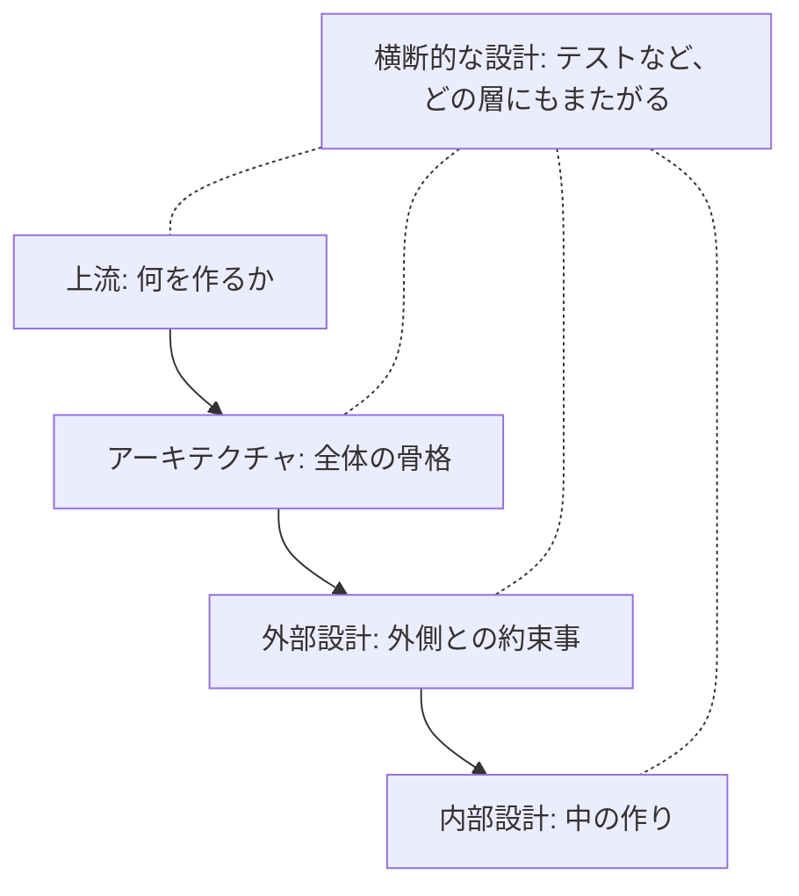

# 13-1-2: 設計の地図

## 🎯 このセクションで学ぶこと

- 設計が5つの層に分かれていることを知り、それぞれの層が「何を決める層なのか」を説明できるようになる。
- この教材で学ぶ範囲（外部設計・内部設計・テスト設計）と、扱わない範囲を区別できるようになる。
- 章がこの順番で並んでいる理由を理解し、これからの学習の見通しを持てるようになる。

---

## 導入：同じ「設計」でも、決めることは違う

前のセクション（13-1-1）で、設計とは「受け取った仕様から、実装に必要な決めごとをすべて決めて、書き残す作業」だと学びました。では、その「実装に必要な決めごと」とは、具体的に何を決めることなのでしょうか。

次に挙げるのは、どれも現場で「設計」と呼ばれている決めごとです。

- 事務所でやっている仕事のうち、どこまでをシステムに任せて、どこから先は今までどおり人がやるのか。
- アプリを動かすサーバーをどこに置き、利用者が10倍に増えたときに耐えられるのか。
- 一覧画面から詳細画面へは、どのボタンで移動するのか。入力を間違えたとき、画面に何と表示するのか。
- 投稿を保存する処理は、どのクラスのどのメソッドが担当するのか。
- できあがったものが仕様どおりかを、どんな順番で、何を使って確かめるのか。

同じ「設計」という言葉でも、決める中身はまるで違います。決める人も、決めるタイミングも違います。1番目は開発が始まる前に発注者側と話して決めることですし、4番目はコードを書く直前に決めることです。

この違いを知らないまま「設計を学ぼう」と本を開くと、サーバーの構成図の話とクラスの分け方の話が交互に出てきて、自分が今どこの話を読んでいるのか分からなくなります。そこで、先に地図を1枚持っておきます。この地図は暗記するためのものではありません。Tutorial 13の8つの章を進むあいだ、「今は地図のどこにいるのか」を確認するために使います。

---

## 設計の5つの層

設計で決めることは、大きく5つの層に分けられます。

| 層 | 何を決める層か | 決めごとの例 |
|:---|:---------------|:-------------|
| 上流 | 何を作るか | システムに任せる範囲の線引き |
| アーキテクチャ | 全体の骨格 | 動かす場所、壊れたときの備え、かかる費用 |
| 外部設計 | 外側との約束事 | 画面、API、権限、エラーメッセージ |
| 内部設計 | 中の作り | クラス、テーブル、状態、例外、命名 |
| 横断的な設計 | どの層にもまたがること | テスト、リリースの手順 |

上の4つの層は、上から下へ進むほど、決めることが具体的になります。上の層の決定が、下の層の前提になるからです。「会員だけが投稿できる」と外部設計で決まって初めて、内部設計で「投稿を保存する前にログイン状態を確かめる処理をどこに置くか」を決められます。

**設計の5つの層**

図の実線の矢印が、いま説明した前提の向きです。横断的な設計だけは、特定の層に属しません。どの層にもまたがるので、図では点線で4つの層すべてにつないでいます。

それぞれの層が何を決める層なのか、順に見ていきます。

### 上流：何を作るかを決める

上流には、業務設計・サービス設計・UX設計・情報設計・ドメイン設計といった仕事が含まれます。名前は違いますが、共通しているのは「システム化する範囲の線引き」を決めることです。

図書館を例にします。「本の貸出をシステムにする」と一言で言っても、決めることは山ほどあります。貸出の記録はシステムが持つとして、返却が遅れた人への督促は、システムがメールを送るのでしょうか、それとも今までどおり職員が電話をかけるのでしょうか。予約は何日先まで受け付けるのでしょうか。こうした「そもそも何を作るのか」が決まって初めて、作るものの輪郭が現れます。

上流の設計をする人は、システムのことより先に、その仕事のことを深く知っている必要があります。図書館の設計をするなら図書館の運営を、病院の設計をするなら診療の流れを理解していなければ、線を引く場所を間違えます。

### アーキテクチャ：全体の骨格を決める

アーキテクチャで決めるのは、方式（システム全体をどんな仕組みで組み立てるか）・インフラ・ネットワーク・セキュリティ・可用性（止まらずに動き続ける度合い）・性能・コスト・運用・移行（古い仕組みから新しい仕組みへデータや利用者を移すこと）といった項目です。ひとことでまとめると「作った後、どう生き延びるか」を決める層です。

たとえば、1日に100人が使うアプリと、10万人が使うアプリでは、置き方も備え方も変わります。サーバーが1台壊れたときに何分で復旧させるのか、毎月いくらまでなら費用をかけてよいのか、数年後に別のサービスへ引っ越すことになったらどうするのか。どれも、コードの1行1行とは別の次元の決めごとです。

Tutorial 6で、Dockerを使って「アプリを動かす環境」を用意しました。あれは、アーキテクチャで決めたことを実際に組み立てる作業の、いちばん入口にあたる部分です。

### 外部設計：外側との約束事を決める

外部設計で決めるのは、画面やUI、API、データの大まかな形、認証・認可、権限、エラーメッセージです。共通しているのは、どれも🔑 **システムの外側から見えるもの**だという点です。利用者が触るもの、他のシステムがつなぎに来るもの、と言い換えてもかまいません。

この層の決めごとには、他の層にない特徴があります。一度公開すると、簡単には変えられないのです。

Tutorial 11で作ったAPIを思い出してください。URLの形や、返すJSONの項目名を後から変えると、そのAPIを使っている側のプログラムはいっせいに動かなくなります。画面も同じです。利用者が操作を覚えたあとでボタンの位置や言葉を変えると、問い合わせが増えます。だからこの層は、5つの中でいちばん慎重に決めます。

### 内部設計：中の作りを決める

内部設計で決めるのは、モジュール（機能のまとまりごとに分けた部品）やクラスの分け方、テーブル、状態遷移、トランザクション、例外、命名です。外から見た振る舞いが同じでも、中の作り方は何通りもあります。

Tutorial 9で学んだMVCで考えてみます。投稿を保存する処理を、コントローラーに全部書いても動きます。モデル側に寄せても動きます。画面から見れば、どちらも「保存できた」で同じです。違いが出るのは、あとから機能を足すときです。保存のときにメール通知も送りたくなったとき、処理が1か所にまとまっていれば直す場所は1か所ですが、あちこちに散らばっていれば探し回ることになります。

内部設計は、「動くコード」と「変更できるコード」を分ける層です。動くだけなら設計しなくても書けますが、半年後に自分か誰かが直せる形にするには、設計が要ります。

### 横断的な設計：どの層にもまたがるもの

テスト設計・CI/CD（コードの変更を自動で検査し、自動で反映する仕組み）・デプロイやリリースの段取り・組織設計が、この層に入ります。どれも開発全体にかかる決めごとで、画面やテーブルのようにシステムの1か所を指させる性質のものではありません。

たとえばテスト設計は、外部設計で決めた画面の動きも、内部設計で決めたクラスの振る舞いも、どちらも確かめる対象にします。特定の層の下に置けないので、地図でも4つの層すべてに点線でつないだ形にしています。

### ここ数年で加わった領域

5つの層に加えて、この2年ほどで新しく生まれた領域があります。コンテキスト設計、エージェント設計、人間の介在点設計といった名前で呼ばれるものです。AIに実装を任せる進め方が広まったことで、「AIにどこまでの情報を渡すか」「作業のどこで人が確認して承認するか」も、あらかじめ決めておく対象になりました。

これらは設計の延長にある新しい層で、Tutorial 14で扱います。今は名前だけ聞いておいてください。

---

## この教材で学ぶ範囲

5つの層のうち、Tutorial 13で学ぶのは外部設計と内部設計、そして横断的な設計のうちのテスト設計です。Chapter 2からChapter 8までが、それぞれどの層に対応するのかを一覧にします。

| 層 | 対応する章 | その章で作る主な設計書 |
|:---|:-----------|:-----------------------|
| 外部設計 | Chapter 2「機能設計」 | 機能一覧・確認事項リスト／ユースケース図・ユースケース記述 |
| 外部設計 | Chapter 3「外部設計Ⅰ 画面設計」 | 画面一覧・画面遷移図／ワイヤーフレーム・画面項目定義／入力チェック表・メッセージ一覧 |
| 外部設計 | Chapter 4「外部設計Ⅱ APIと権限」 | API設計書／権限マトリクス |
| 外部設計と内部設計の橋 | Chapter 5「データ設計」 | 概念モデル／ER図／テーブル定義書・CRUD表 |
| 内部設計 | Chapter 6「内部設計Ⅰ 振る舞いの設計」 | シーケンス図／状態遷移図・遷移表／例外一覧 |
| 内部設計 | Chapter 7「内部設計Ⅱ 構造の設計」 | クラス図／既習アプリの構造図 |
| 横断的な設計 | Chapter 8「テスト設計と総合演習」 | テスト設計書／設計書一式 |

右の列に並んでいるものが、これから自分の手で作れるようになる設計書です。名前を見て「これは何だろう」と思うものばかりだと思いますが、今は分からなくて大丈夫です。それぞれの章で、読み方から順に学びます。

Chapter 5のデータ設計だけ、層の欄が「外部設計と内部設計の橋」になっています。データの設計は、途中で層をまたぐからです。「この図書館アプリには、本と利用者と貸出という3種類の情報がある」という大まかな整理は外側との約束事なので外部設計に入り、「booksテーブルに何というカラムを持たせるか」という具体になると内部設計に入ります。実際の仕事では2つを切り離さず、続けて決めていきます。そのため、この教材でもChapter 5として一気通貫で扱います。

> 💡 **TIP**: この一覧の中で、ER図だけはすでに一度学んでいます。8-1-5「データベース設計の基礎」で、正規化の考え方と、ER図が何を表しているかを読み取る練習をしました。Chapter 5は、そこで身につけた読む力を土台にして、今度は自分で描けるところまで進みます。まったくの初見の図ばかりではない、と思っておいてください。

---

## この教材で学ばない範囲と、その理由

地図の残りの部分、つまり上流とアーキテクチャ、それに横断的な設計のうちテスト以外は、この教材では扱いません。理由を正直に書いておきます。

| 学ばないもの | 扱わない理由 |
|:-------------|:-------------|
| 上流（業務設計・サービス設計・UX設計・情報設計・ドメイン設計） | 13-1-1で確認したとおり、要件や仕様は与えられるものとして扱うためです。線引きそのものは、この教材では決める対象になりません |
| アーキテクチャ（方式・インフラ・ネットワーク・セキュリティ・可用性・性能・コスト・運用・移行） | 「作った後どう生き延びるか」を決める領域で、この教材の範囲の外にあります。名前と役割だけ紹介します |
| バッチ処理・イベントの設計（外部設計の中） | Web画面とAPIを中心に学ぶため、対象から外しています |
| ログ設計・キャッシュ設計（内部設計の中） | 対象から外しています。ログの出し方そのものは、10-4-3「ログの活用」ですでに学びました |
| CI/CD・デプロイやリリースの段取り・組織設計（横断的な設計の中） | 対象から外しています |

> ⚠️ **注意**: 「学ばない」は「不要」という意味ではありません。ここに挙げたものは、どれも実際の開発では誰かが必ず決めています。皆さんが仕事に入れば、上流を担当する人やインフラを担当する人と、同じ会議に出ることになります。そのとき「今の議論はアーキテクチャの話だから、自分が決める外部設計とは別の層だ」と切り分けられること、それが今の段階でこの地図を持つ意味です。層の名前と役割を知っているだけで、会話に乗れます。

---

## なぜこの順番で学ぶのか

Chapter 2からChapter 8までの並びには、理由が2つあります。

1つ目は、外側から内側へ向かう順番になっていることです。先ほど見たとおり、外部設計で決めることは一度公開すると変えづらく、内部設計で決めることは後からでも直せます。変えづらいものを先に固め、直しやすいものを後に回すほうが、やり直しが少なくて済みます。画面とAPIの形が決まっていないのにクラスの分け方から考え始めると、画面の仕様が1つ変わっただけで、考えたことが丸ごと無駄になります。

2つ目は、この順番が実際の仕事で設計書を書く順番でもあることです。機能を洗い出し、画面とAPIを決め、データの形を決め、処理の流れを決め、コードの構造を決め、最後にテストを設計する。現場でもこの順に手を動かします。教材の章立てをそのまま仕事の進め方として持ち出せるように、並びを揃えてあります。

もう1つ、節の単位にも決まりがあります。1つの節で1つの設計書を作ります。節を終えるたびに、描けるものが1つずつ増えていく形です。Chapter 8まで進んだとき、手元には仕様書1本から作った設計書の一式が残ります。

> 💡 **TIP**: この地図を今すぐ覚える必要はありません。層の名前が5つあったこと、そのうち真ん中の2つとテストを学ぶこと、この2点だけ持ち帰れば十分です。各章の入口で「ここは外部設計の話です」と現在地を示しますので、そのつど地図を思い出してもらえれば、全体の中の位置は自然につかめます。

---

## ✨ まとめ

- 設計で決めることは、上流・アーキテクチャ・外部設計・内部設計・横断的な設計の5つの層に分けられます。同じ「設計」という言葉でも、層が違えば決める中身も決める人も違います。
- 外部設計は外側との約束事（画面・API・権限・エラーメッセージ）を決める層で、一度公開すると変えづらいため、いちばん慎重に決めます。内部設計は中の作り（クラス・テーブル・状態・例外・命名）を決める層で、「動くコード」と「変更できるコード」を分けます。
- この教材で学ぶのは、外部設計（Chapter 2〜5）、内部設計（Chapter 5〜7）、横断的な設計のうちテスト設計（Chapter 8）です。データ設計は外部と内部をまたぐため、Chapter 5でまとめて扱います。
- 上流とアーキテクチャは扱いません。仕様は与えられるものとして進めるためであり、これらが不要だからではありません。層の名前と役割だけは覚えておいてください。
- 章は、変えづらい外側から直しやすい内側へ、という順に並んでいます。これは実際の仕事で設計書を書く順番でもあります。

地図が手に入ったので、次は道具の番です。次のセクション（13-1-3）では、設計書に使う図にはどんな種類があるのかを一覧で確認し、その図を描くためのツールの使い方を学びます。あわせて、これからChapter 2からChapter 8で作る設計書を保存していく置き場所も用意します。ここまでが準備で、Chapter 2からは実際に手を動かして設計書を作り始めます。

---
