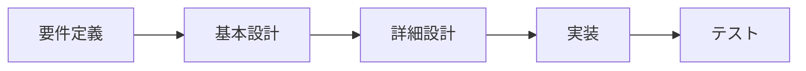

# 13-1-2: 設計の地図

## 🎯 このセクションで学ぶこと

- 設計が基本設計と詳細設計に分かれていることを知り、それぞれが何を決める工程なのかを説明できるようになる。
- この教材で学ぶ範囲（基本設計・詳細設計・テスト設計）と、扱わない範囲を区別できるようになる。
- 章がこの順番で並んでいる理由を理解し、これからの学習の見通しを持てるようになる。

---

## 導入：同じ「設計」でも、決めることは違う

前のセクション（13-1-1）で、設計とは「受け取った仕様から、実装に必要な決めごとをすべて決めて、書き残す作業」だと学びました。では、その「実装に必要な決めごと」とは、具体的に何を決めることなのでしょうか。

次に挙げるのは、どれも現場で「設計」と呼ばれている決めごとです。

- 事務所でやっている仕事のうち、どこまでをシステムに任せて、どこから先は今までどおり人がやるのか。
- アプリを動かすサーバーをどこに置き、利用者が10倍に増えたときに耐えられるのか。
- 一覧画面から詳細画面へは、どのボタンで移動するのか。入力を間違えたとき、画面に何と表示するのか。
- 投稿を保存する処理は、どのクラスのどのメソッドが担当するのか。
- できあがったものが仕様どおりかを、どんな順番で、何を使って確かめるのか。

同じ「設計」という言葉でも、決める中身はまるで違います。決める人も、決めるタイミングも違います。1番目は開発が始まる前に発注者側と話して決めることですし、4番目はコードを書く直前に決めることです。

この違いを知らないまま設計の本を開くと、サーバーの構成図の話とクラスの分け方の話が交互に出てきて、自分が今どこの話を読んでいるのか分からなくなります。そこで先に、設計という仕事がどんな工程に分かれているのかの地図を、1枚持っておきます。暗記するためのものではありません。Tutorial 13の8つの章を進むあいだ、今は地図のどこにいるのかを確かめるために使います。

---

## 設計の工程：基本設計と詳細設計

13-1-1で、ソフトウェアを作る仕事は「1. リサーチ・企画」「2. 要件定義・設計」「3. 実装」「4. テスト・検証」の4つの工程に分かれる、と確認しました。このうち2番の箱を開けると、中はさらに細かい工程に分かれています。

**要件定義から実装・テストまでの工程**

左の3つ、要件定義と基本設計と詳細設計が、2番の箱の中身にあたります。いちばん左の要件定義は、作るものの条件を洗い出して、これで作ると確定させる工程です。13-1-1で確認したとおり、この教材では、その結果として書かれた仕様を受け取るところから始めます。皆さんが自分の手を動かすのは、真ん中の基本設計と詳細設計です。

矢印の向きは、そのまま前提の向きでもあります。右へ進むほど決めることは具体的になり、前の工程の決定が次の工程の前提になります。「会員だけが投稿できる」と基本設計で決まって初めて、詳細設計で「投稿を保存する前にログイン状態を確かめる処理をどこに置くか」を決められます。

### 基本設計（外部設計）：外側との約束事を決める

基本設計で決めるのは、画面、API、扱うデータの大まかな形、誰が何をしてよいかという権限、エラーメッセージです。共通しているのは、どれも🔑 **システムの外側から見えるもの**だという点です。利用者が触るもの、他のシステムがつなぎに来るもの、と言い換えてもかまいません。外側から見えるものを決める工程なので、**外部設計**とも呼ばれます。

ここでの決めごとには、他の工程にない特徴があります。一度公開すると、簡単には変えられないのです。Tutorial 11で作ったAPIを思い出してください。URLの形や、返すJSONの項目名を後から変えると、そのAPIを使っている側のプログラムはいっせいに動かなくなります。画面も同じで、利用者が操作を覚えたあとでボタンの位置や言葉を変えると、問い合わせが増えます。基本設計をいちばん慎重に決めるのは、このためです。

### 詳細設計（内部設計）：中の作りを決める

詳細設計で決めるのは、モジュール（機能のまとまりごとに分けた部品）やクラスの分け方、テーブル、状態の移り変わり、例外の扱い、命名です。中の作りを決める工程なので、**内部設計**とも呼ばれます。外から見た振る舞いが同じでも、中の作り方は何通りもあります。

Tutorial 9で学んだMVCで考えてみます。投稿を保存する処理を、コントローラーに全部書いても動きます。モデル側に寄せても動きます。画面から見れば、どちらも「保存できた」で同じです。違いが出るのは、あとから機能を足すときです。保存のときにメール通知も送りたくなったとき、処理が1か所にまとまっていれば直す場所は1か所ですが、あちこちに散らばっていれば探し回ることになります。

詳細設計は、「動くコード」と「変更できるコード」を分ける工程です。動くだけなら設計しなくても書けますが、半年後に自分か誰かが直せる形にするには、設計が要ります。

> 💡 **TIP**: 工程の呼び方は、1つに定まっていません。この教材では基本設計・詳細設計を使いますが、本や求人票では別の名前で書かれていることがあります。
>
> | この教材の呼び方 | 現場での別の呼び方 | IPAの正式な呼び方 |
> |:--|:--|:--|
> | 基本設計 | 外部設計 | ソフトウェア方式設計 |
> | 詳細設計 | 内部設計 | ソフトウェア詳細設計 |
>
> 右の列は、IPA（情報処理推進機構。情報処理技術者試験を実施している公的な機関）が示す正式な工程名です。対応はおおよそのもので、会社や現場ごとに呼び方は揺れます。名前が違っても、決めている中身は同じです。初めて見る呼び方に出会ったら、この表に当てはめて読み替えてください。

---

## この教材で学ぶ範囲

Tutorial 13で学ぶのは、基本設計と詳細設計、そして最後にテスト設計です。Chapter 2からChapter 8までが、それぞれどの工程にあたるのかを一覧にします。

| 工程 | 章 | その章で作る主な設計書 |
|:-----|:---|:-----------------------|
| 基本設計 | Chapter 2「機能設計」 | 機能一覧・確認事項リスト／ユースケース図・ユースケース記述 |
| 基本設計 | Chapter 3「画面設計」 | 画面一覧・画面遷移図／ワイヤーフレーム・画面項目定義／入力チェック表・メッセージ一覧 |
| 基本設計 | Chapter 4「APIと権限の設計」 | API設計書／権限マトリクス |
| 基本設計と詳細設計の橋 | Chapter 5「データ設計」 | 概念モデル／ER図／テーブル定義書・CRUD表 |
| 詳細設計 | Chapter 6「振る舞いの設計」 | シーケンス図／状態遷移図・遷移表／例外一覧 |
| 詳細設計 | Chapter 7「構造の設計」 | クラス図／既習アプリの構造図 |
| テスト設計 | Chapter 8「テスト設計と総合演習」 | テスト設計書／設計書一式 |

右の列に並んでいるのが、これから自分の手で作れるようになる設計書です。名前を見て「これは何だろう」と思うものばかりだと思いますが、今は分からなくて大丈夫です。それぞれの章で、読み方から順に学びます。

並んでいるのは、図だけではありません。図として描くもの、表として書くもの、文章で書くものが混ざっています。このうち図と表は、どれをどの章で描くのかを次の13-1-3で改めて一覧にしますので、ここでは数を数えず、章を進むたびに作れるものが増えていく様子だけ眺めておいてください。

2つだけ、名前から中身が想像しにくいものを先に補っておきます。Chapter 3の**ワイヤーフレーム**は、画面のどこに何を置くかを、線と枠だけで表した画面の下書きです。Chapter 7の**既習アプリの構造図**は、Tutorial 9・10のハンズオンで自分が作ったアプリを題材に、そのファイルやクラスがどんなまとまりに分かれて置かれているのかを表した図です。

Chapter 5のデータ設計だけ、工程の欄が「基本設計と詳細設計の橋」になっています。データの設計は、途中で工程をまたぐからです。「この図書館アプリには、本と利用者と貸出という3種類の情報がある」という概念の整理は、外側との約束事にあたるので基本設計側に入ります。「booksテーブルに何というカラムを持たせるか」という具体の形になると、詳細設計側です。実際の仕事では2つを切り離さず、続けて決めていきます。そのため、この教材でもChapter 5として一気通貫で扱います。

> 💡 **TIP**: この一覧の中で、ER図だけはすでに一度学んでいます。8-1-5「データベース設計の基礎」で、正規化の考え方と、ER図が何を表しているかを読み取る練習をしました。Chapter 5は、そこで身につけた読む力を土台にして、今度は自分で描けるところまで進みます。まったくの初見の図ばかりではない、と思っておいてください。

> 💡 **TIP**: テスト設計をChapter 8にまとめたのは、学びやすさのためです。実務では、基本設計ができたらそれを確かめるテストを、詳細設計ができたらそれを確かめるテストを、というように、各設計と対にして作るのが一般的です（工程の並びをV字に折って対応づけることから、V字モデルと呼ばれます）。この教材では、まず設計を一通り学んでから、Chapter 8でテストの設計をまとめて扱います。

---

## この教材で扱わない範囲と、その理由

設計と名の付く仕事のうち、この教材が扱わないものも挙げておきます。何を学ばないのかがはっきりしているほうが、地図としては役に立ちます。

| 扱わないもの | 扱わない理由 |
|:-------------|:-------------|
| 企画・要件定義（上流工程と呼ばれます。業務設計・サービス設計・UX設計・情報設計などが含まれます） | 13-1-1で確認したとおり、要件や仕様は与えられるものとして扱うためです。どこまでをシステムに任せるかという線引きそのものは、この教材では決める対象になりません |
| アーキテクチャ（方式設計とも呼ばれます。インフラ・ネットワーク・セキュリティなど、全体の骨格と、その品質をどう実現するか） | 「作った後どう生き延びるか」を決める領域で、この教材の範囲の外にあります。名前と役割だけ紹介します |
| 帳票設計・外部システム連携・バッチ処理 | Web画面とAPIを中心に学ぶため、対象から外しています |
| ログ設計・キャッシュ設計 | 対象から外しています。ログの出し方そのものは、10-4-3「ログの活用」ですでに学びました |
| CI/CD・デプロイやリリースの段取り | 対象から外しています |

> 💡 **TIP**: 表に出てきた言葉のうち、名前だけでは中身が分かりにくいものを説明しておきます。帳票は、請求書や納品書のように、決まった書式で印刷したりPDFにしたりする書類です。バッチ処理は、毎晩0時に集計する、といったように、決まったタイミングでまとめて動かす処理を指します。キャッシュは、一度使ったデータを取り出しやすい場所に置いておき、次から速く返す仕組みです。CI/CDは、コードの変更を自動で検査し、自動で反映する仕組みです。どれも、名前を見たときに「そういうものがあった」と思い出せれば十分です。

このうちアーキテクチャには、すでに一度だけ触れています。Tutorial 6で、Dockerを使って「アプリを動かす環境」を用意しました。あれは、アーキテクチャで決めたことを実際に組み立てる作業の、いちばん入口にあたる部分です。

> 💡 **TIP**: 止まらずに動き続けること（可用性）、待たされずに使えること（性能）、外から守られていること（セキュリティ）、動かし続けられること（運用）、古い仕組みから移せること（移行）。これらは本来、開発を始める前に、どの水準まで満たすのかを発注者と合意しておく決めごとで、**非機能要件**と呼ばれます。機能そのものではないけれど、満たしていなければ使い物にならない条件、という意味です。アーキテクチャは、合意したその水準を、どんな仕組みで実現するかを決める仕事にあたります。

> ⚠️ **注意**: 「学ばない」は「不要」という意味ではありません。ここに挙げたものは、どれも実際の開発では誰かが必ず決めています。皆さんが仕事に入れば、要件定義を担当する人やインフラを担当する人と、同じ会議に出ることになります。そのとき「今の議論はアーキテクチャの話で、自分が決める基本設計とは別だ」と切り分けられること、それが今の段階でこの地図を持つ意味です。

ここまでに挙げた工程とは別に、この2年ほどで新しく生まれた領域もあります。コンテキスト設計、エージェント設計、人間の介在点設計といった名前で呼ばれるものです。AIに実装を任せる進め方が広まったことで、「AIにどこまでの情報を渡すか」「作業のどこで人が確認して承認するか」も、あらかじめ決めておく対象になりました。これらはTutorial 14で扱いますので、今は名前だけ聞いておいてください。

---

## なぜこの順番で学ぶのか

Chapter 2からChapter 8までの並びには、理由が2つあります。

1つ目は、外側から内側へ向かう順番になっていることです。基本設計で決めることは一度公開すると変えづらく、詳細設計で決めることは後からでも直せます。変えづらいものを先に固めるほうが、やり直しが少なくて済みます。画面とAPIの形が決まっていないのにクラスの分け方から考え始めると、画面の仕様が1つ変わっただけで、考えたことが丸ごと無駄になります。

2つ目は、この順番が実際の仕事で設計書を書く順番でもあることです。機能を洗い出し、画面とAPIを決め、データの形を決め、処理の流れを決め、コードの構造を決め、最後にテストを設計する。現場でもこの順に手を動かします。教材の章立てをそのまま仕事の進め方として持ち出せるように、並びを揃えてあります。

節の単位にも決まりがあります。1つの節で1つの設計書を作ります。節を終えるたびに、描けるものが1つずつ増えていく形です。Chapter 8まで進んだとき、手元には仕様書1本から作った設計書の一式が残ります。このもとになる仕様書は、演習の中で渡されます。13-1-1で確認したとおり「仕様」は受け取る側の言葉なので、自分で書き起こす必要はありません。各章の入口では、そこがどの工程の話なのかを示しますので、そのつどこの地図を思い出してください。

---

## ✨ まとめ

- 設計は、外側との約束事を決める基本設計と、中の作りを決める詳細設計に分かれます。要件定義から始まり、実装とテストへ続く一連の工程の、真ん中にある2つです。
- 基本設計で決める画面・API・権限・エラーメッセージは、一度公開すると変えづらいので、いちばん慎重に決めます。詳細設計で決めるクラス・テーブル・状態・例外は、「動くコード」と「変更できるコード」を分けます。
- この教材で学ぶのは、基本設計（Chapter 2〜5）、詳細設計（Chapter 5〜7）、テスト設計（Chapter 8）です。データ設計は2つの工程をまたぐため、Chapter 5でまとめて扱います。
- 企画・要件定義とアーキテクチャは扱いません。仕様は与えられるものとして進めるためであり、これらが不要だからではありません。名前と役割だけは覚えておいてください。
- 章は、変えづらい外側から直しやすい内側へ、という順に並んでいます。これは実際の仕事で設計書を書く順番でもあります。

地図が手に入ったので、次は道具の番です。次のセクション（13-1-3）では、設計書に使う図にはどんな種類があるのかを一覧で確認し、その図を描くためのツールの使い方を学びます。あわせて、これからChapter 2からChapter 8で作る設計書を保存していく置き場所も用意します。ここまでが準備で、Chapter 2からは実際に手を動かして設計書を作り始めます。

---
