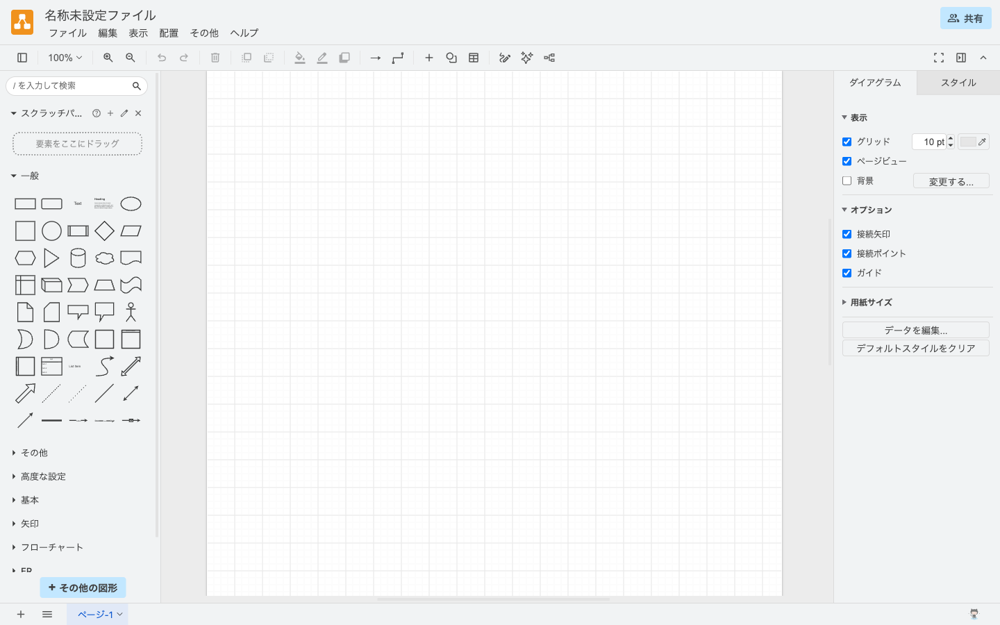
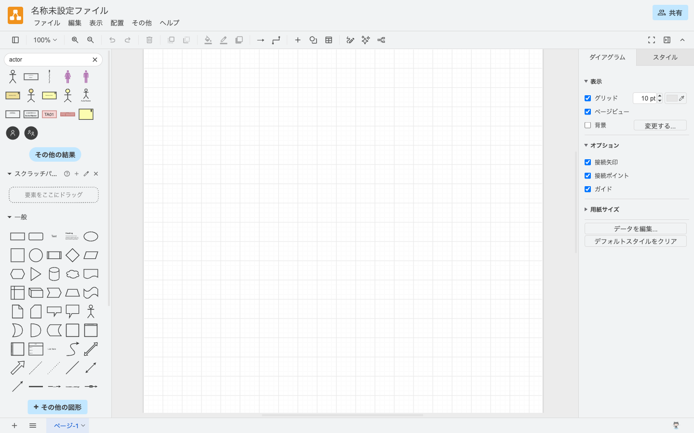
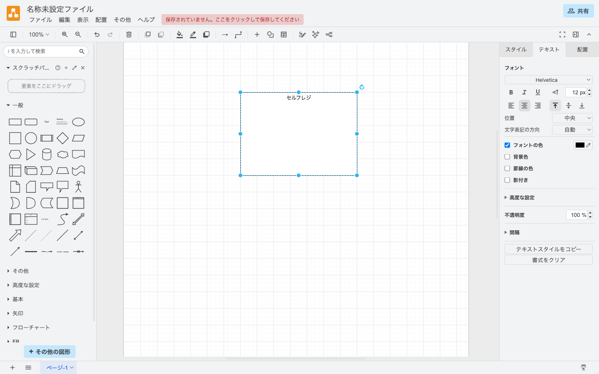
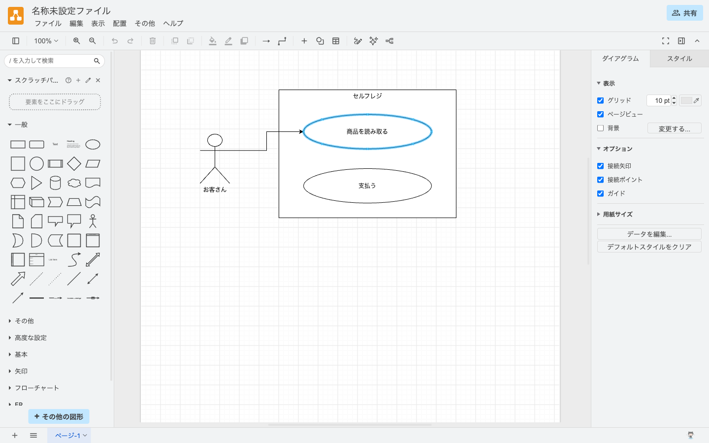
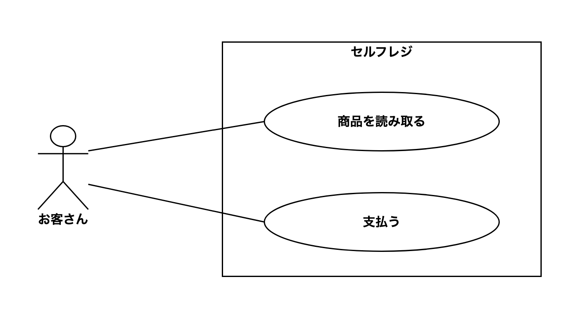

# 13-1-3: UMLと作図の約束事

## 🎯 このセクションで学ぶこと

- UML（ソフトウェアの設計図の、世界共通の描き方）とは何かを知り、この教材で作る図と表の全体像をつかむ。
- draw.ioで図形を置き、文字を入れ、線でつなぎ、保存と画像の書き出しまでできるようになる。
- 題材のアプリを自分のGitHubに用意し、設計書の置き場所を作って最初の1図を保存できるようになる。

---

## 導入：同じことを伝える図でも、描く人によって変わる

「誰がこのシステムで何をできるか」を1枚にまとめるだけでも、ある人は使う人を丸で描き、別の人は名前を四角で囲みます。線の矢印が「その人が使う機能」を指すのか「データが流れる向き」なのかも、描いた人にしか分かりません。読む側は、中身に入る前に描き方の意図を推測することになります。

記号の形と意味をあらかじめ決めておけば、この推測が要りません。そのために作られた共通の描き方がUMLです。

---

## UMLと、この教材で作る図

UMLは、プログラムの設計図の統一表記法です。図の種類ごとに、どんな形の記号をどんな意味で使うのかが決まっています。皆さんが描く図も、自分だけが分かる図ではなく、他の人が読める図を目指します。

### この教材で作る9つの図と表

設計書に使う図は、UMLの図だけではありません。決まった描き方を新しく覚えるのは、次の9つです。

| 成果物 | 何を決めるためのものか | 学ぶ章 |
|:-------|:---------------------|:---------------|
| ユースケース図 | 誰が、このシステムで何をできるか | Chapter 2 |
| シーケンス図 | 1つの処理が、どこからどこへ、どの順で流れるか | Chapter 6 |
| 状態遷移図 | 1件のデータの状態が、何をきっかけに移り変わるか | Chapter 6 |
| クラス図 | プログラムをどんなまとまりに分け、互いにどうつなぐか | Chapter 7 |
| 画面遷移図 | どの画面から、どの操作で、どの画面へ移るか | Chapter 3 |
| ワイヤーフレーム | 1つの画面に、どの項目をどう並べるか | Chapter 3 |
| ER図 | どんなデータを、どんな関係で持つか | Chapter 5 |
| 権限マトリクス | どの役割の人が、どの機能を使えるか | Chapter 4 |
| CRUD表 | どの機能が、どのデータを作り・読み・書き換え・消すか | Chapter 5 |

上の4つがUMLの図、続く3つはUMLに含まれない図で、最後の2つは図ではなく表として作ります。どれもWeb開発の現場で定番の設計書です。機能一覧やテーブル定義書のように、表や文章で書く設計書はこのほかにも各章で作りますが、それらの書き方はそのつど説明します。ER図だけは、8-1-5「データベース設計の基礎」で読み方を学びました。Tutorial 13では、そのER図も含めて7つの図をすべて自分の手で描きます。

<details>
<summary>💡 名前だけ知っておく図（今は覚えなくてOK）</summary>

現場の設計書や技術記事では、この教材で描かない図に出会うこともあります。名前と用途だけ挙げておきます。

- **オブジェクト図**: ある瞬間のデータの中身。クラス図の補助です。
- **パッケージ図**: まとまりどうしの依存関係。規模が大きくなると出番が来ます。
- **コミュニケーション図**: シーケンス図と同じやり取りを、誰と誰がつながっているかの側から表します。
- **配置図**: プログラムがどのハードウェアの上で動き、どう通信するか。
- **アクティビティ図**: 作業の流れを、分岐や並行処理も含めて表します。

</details>

どの章でも共通する決めごとを、先に2つ決めておきます。道具はdraw.ioに揃えること、作ったものは1つのリポジトリの `docs/` フォルダに残すことです。

---

## ⚙️ 道具はdraw.ioに揃える

作図にはdraw.ioを使います。2026年8月時点で、アカウント登録なしにブラウザだけで無料で使えます。図形を選んで置くだけで描けて、この教材で作る図はすべてこの1つでまかなえます。

ブラウザで `https://app.diagrams.net/` を開くと、ログインを求められずに編集画面が出ます。

**draw.ioを開いた直後の画面**



覚えるのは、どこに何があるかだけです。

| 場所 | 何があるか |
|:-----|:-----------|
| 上部 | メニューバー（ファイル／編集／表示／配置／その他／ヘルプ）。保存と書き出しは「ファイル」の中 |
| 左 | 図形パネル。最上部が図形の検索ボックスで、その下に「一般」などの図形の一覧 |
| 中央 | 方眼のキャンバス。ここに図を描く |
| 右 | 書式パネル。図形を選ぶと「スタイル」「テキスト」「配置」の3つのタブが出る |

キャンバスに置く図形を、この教材ではシェイプと呼びます（日本語の画面では「図形」と表示されます）。実際の操作は、このあとの🏃で1つずつ試します。

> 💡 **TIP**: 表示が英語で開いた場合は、メニューバーの「その他」→「言語」で日本語に変えられます。draw.ioは表示テーマによってボタンの位置が変わるので、教材の画像と細部が違っても、メニューの名前をたどれば同じ操作にたどり着けます（2026年8月時点）。

---

## ⚙️ 題材のアプリと、設計書の置き場所を用意する

13-1-1で触れたスターターアプリを、ここで自分のGitHubに用意します。Chapter 2から先で読む題材になり、作った設計書もこのリポジトリに保存していきます。

**手順1: テンプレートから自分のリポジトリを作る**

ブラウザで `https://github.com/coachtech-material/laravel-post-starter` を開きます。緑色の「Use this template」ボタンから「Create a new repository」を選び、次のように設定して「Create repository」を押します。

- Owner: 自分のアカウント
- Repository name: `post-app-practice`
- Public / Private: `Public`（練習用なので、公開で問題ありません）

「Use this template」は、他の人のリポジトリの中身をそのままコピーして、自分のリポジトリを作る機能です。できあがるのは自分のリポジトリなので、この先は自由に書き換えてpushできます。

**手順2: 手元にcloneする**

作ったリポジトリのページで緑色の「Code」ボタンを押し、4-4-2「ローカルとリモートの接続」で学んだとおり、**SSHのタブに切り替えてから**URLをコピーします。`git@github.com:あなたのユーザー名/post-app-practice.git` という形式です。

> ⚠️ **注意**: 「Code」ボタンを押した直後はHTTPSのタブが選ばれています。そのURLでcloneすると、pushのたびにユーザー名やパスワードを聞かれます。Tutorial 10やTutorial 11のハンズオンで使った `https://` のURLは、他の人が用意したスターターキットを取ってくるだけで、pushしない場面のものでした。今回は自分のリポジトリへpushするので、SSHを使います。

置き場所は、Tutorial 10・11のハンズオンでも使った `~/laravel-practice` の下に固定します。

```bash
# 練習用のフォルダを用意して、そこへ移動する
mkdir -p ~/laravel-practice
cd ~/laravel-practice

# URLの部分は、自分がコピーしたものに置き換える
git clone git@github.com:あなたのユーザー名/post-app-practice.git
cd post-app-practice
```

> ⚠️ **注意**: Windowsの方は、ここからのコマンドをWSL（Ubuntu）のターミナルで実行してください。6-2-1で学んだとおり、作業フォルダはWSL側のホームに置きます。`~/laravel-practice` は、WSLの中に作られます。

**手順3: 設計書の置き場所を作る**

clone したフォルダには、Laravelのアプリ一式が入っています。ここに `docs/` を作り、設計書はそちらへ入れます。アプリのコードと自分の設計書が混ざらないようにするためです。章ごとにフォルダを切るので、Chapter 1の成果物は `docs/13-1/` に入ります。

```bash
# post-app-practice フォルダの中で実行する
mkdir -p docs/13-1
```

> 💡 **TIP**: Gitは、中にファイルが1つも無いフォルダを記録できません。`docs/13-1/` は、このあとの🏃で図のファイルを入れてから記録します。

**手順4: VS Codeで開く**

6-2-6で学んだ `code .` で、`post-app-practice` をVS Codeで開いておきます。

```bash
# post-app-practice フォルダの中で実行する
code .
```

左側のエクスプローラーに `app`・`database`・`docs`・`routes` などが並びます。Windowsの方は、左下に「WSL: Ubuntu」と出ていることを確認してください。

> 💡 **TIP**: このアプリをブラウザで動かす準備（Dockerの起動やパッケージのインストール）は、Tutorial 14の最初に整えます。Tutorial 13では、VS Codeでコードを読むだけです。

---

## 🏃 最初の1図を描いてみよう

道具に慣れるために、簡単な図を1枚描きます。題材はスーパーやコンビニのセルフレジで、使う部品は次のとおりです。

- 棒人間が1つ: 「お客さん」
- 四角が1つ: 「セルフレジ」（この中に楕円を並べます）
- 楕円が2つ: 「商品を読み取る」「支払う」
- 線が2本: 棒人間と、2つの楕円をそれぞれつなぐ

> ⚠️ **注意**: この棒人間・四角・楕円・線が設計の上で持つ意味は、Chapter 2で学びます。ここでの目的は、シェイプを思ったとおりに置き、線でつなぎ、保存と書き出しができることです。

### Step 1: 棒人間と四角を置く

`https://app.diagrams.net/` を開き、左上の検索ボックスに `actor` と入力してEnterを押します。検索結果の先頭に棒人間が出てきます。

**検索ボックスに actor と入力したところ**



出てきたシェイプは、クリックするか、キャンバスへドラッグすると置けます。棒人間をキャンバスの左側に置いてください。

次に「一般」パレットの先頭にある四角形を、その右側に置きます（検索するなら `rectangle` です）。あとで中に楕円を2つ入れるので、大きめにします。

### Step 2: 文字を入れて、四角の名前を上へ寄せる

置いたシェイプをダブルクリックすると、文字を入力できます。棒人間に「お客さん」、四角に「セルフレジ」と入力してください。

入れた文字は、既定でシェイプの中央に出ます。このままだと「セルフレジ」の文字が、次のStepで置く楕円と重なります。次の手順で枠の上部へ寄せます（2026年8月時点）。

1. 四角を1回クリックして選びます。右の書式パネルのタブが3つに変わります。
2. 「テキスト」タブを開きます。フォントの指定欄の下に、文字の位置を決めるボタンが6つ並びます。左の3つが横方向、右の3つが縦方向（上・中央・下）です。
3. 縦方向の「上」を押します。文字が枠の上部へ移動します。

**四角の文字を枠の上部へ移動したところ**



### Step 3: 楕円を2つ置いて、線でつなぐ

検索ボックスに `ellipse` と入力して楕円を出し、四角の中に上下に並べて2つ置きます。上の楕円に「商品を読み取る」、下の楕円に「支払う」と入力します。

つないでいきます。棒人間の縁にカーソルを合わせると、青い矢印と×印が出ます。そこからドラッグして、「商品を読み取る」の楕円の上で離すと、2つが線で結ばれます。同じ手順で、棒人間と「支払う」もつなぎます。

> ⚠️ **注意**: 引いた線の端に矢印が付くことがありますが、付いたままで構いません。線の向きに意味があるかどうかは、それぞれの図を学ぶ章で説明します。

### Step 4: .drawioファイルとして保存する

メニューバーの「ファイル」から「保存」を選びます（⌘+S、Windowsでは Ctrl+S）。ダイアログ（設定画面）が開きます。

**保存のダイアログ**



3つの欄を、次のように決めます。

| 欄 | 決めること |
|:-----|:-----------|
| 名前を付けて保存 | ファイル名。`self-checkout.drawio` と入力します。あとで中身が分かる英数字の名前にするのが、この先の決まりです |
| タイプ | ファイルの形式。既定の `XMLファイル (.drawio)` のままにします |
| 場所 | 保存先。**デバイス**（自分のPC）に変えます。画像のように「Google ドライブ」が選ばれていることがあります |

「保存」を押すと、そのままダウンロードフォルダへ保存されるか、保存先のフォルダを選ぶ画面が開くかのどちらかです（2026年8月時点）。選ぶ画面が開いた場合もダウンロードフォルダを選び、あとで `docs/13-1/` へ移します。

できる `.drawio` ファイルが図の本体で、開き直せば続きから編集できます。

### Step 5: PNG画像に書き出す

`.drawio` ファイルは、draw.ioで開かないと中身を見られません。GitHub上でそのまま図を確認できるように、画像も書き出します。

メニューバーの「ファイル」から「形式を指定してエクスポート」→「PNG...」と選びます。

**ファイルメニューからPNGの書き出しを選んだところ**


「イメージ」というダイアログが開きます。ズームやサイズなどの項目は既定のまま「エクスポート」を押すと、PNGファイルがダウンロードフォルダに入ります。ファイル名が `self-checkout.png` になっていなければ、その名前に変えてください。

### Step 6: docs/13-1へ移して、記録する

ダウンロードフォルダに入った2つのファイルを、`docs/13-1/` へ移します。

**Macの方**は、ダウンロードフォルダも `post-app-practice` も同じMacの中にあるので、Finderでドラッグするか、`mv` で移せます。

```bash
# ダウンロードした2つのファイルを docs/13-1/ へ移す
mv ~/Downloads/self-checkout.drawio ~/Downloads/self-checkout.png ~/laravel-practice/post-app-practice/docs/13-1/
```

**Windowsの方**は、ファイルが2つの場所にまたがります。draw.ioはWindows側のブラウザで動くので保存先はWindows側のダウンロードフォルダで、`post-app-practice` はWSLの中にあります。WSL側へ渡す操作が1回だけ必要で、おすすめはVS Codeへのドラッグ＆ドロップです。

1. 手順4で開いたVS Code（左下が「WSL: Ubuntu」のもの）を表示します。
2. Windowsのエクスプローラーで、ダウンロードフォルダを開きます。
3. 2つのファイルを、VS Codeの左側のエクスプローラーにある `docs/13-1` フォルダの上へドラッグ＆ドロップします。

VS Codeのエクスプローラーにファイル名が並べば、WSL側の `~/laravel-practice/post-app-practice/docs/13-1/` にコピーされています。WSLのターミナルからは、Windows側のダウンロードフォルダが `/mnt/c/Users/（Windowsのユーザー名）/Downloads` として見えるので、`cp` でコピーしても構いません。

> 💡 **TIP**: 6-2-1で「作業フォルダは `/mnt/c` の下に置かない」と学びました。あれは置き場所の話で、Windows側にあるファイルを読み取ってコピーするのは問題ありません。

移し終えたら、Tutorial 4とTutorial 12で学んだ流れで、コミットとpushまで済ませます。この形が、Chapter 2から先の各節でも成果物を保存する手順になります。

```bash
# post-app-practice フォルダの中で実行する
git add docs/13-1
git commit -m "13-1: draw.ioの練習図を追加"
git push origin main
```

> 💡 **TIP**: Tutorial 12では、イシューを立ててブランチを切り、プルリクエストを出す流れを学びました。`post-app-practice` は一人で使う練習用のリポジトリなので、ブランチを切らずに `main` へ直接コミットして構いません。

pushしたら、GitHubの `post-app-practice` を開きます。`docs/13-1/` に2つのファイルが並び、`self-checkout.png` をクリックして図が表示されれば完了です。

<details>
<summary>📖 描き終えたら開く（答え合わせ）</summary>

**セルフレジの練習図の例**



次の観点で、自分の画面と見比べます。

- [ ] 棒人間1つ・四角1つ・楕円2つ・線2本が、すべてキャンバスに置かれている
- [ ] 4つのシェイプすべてに文字が入っている
- [ ] 「セルフレジ」の文字が四角の上部にあり、楕円と重なっていない
- [ ] 2つの楕円が、四角の中にある
- [ ] 棒人間から2本の線が、それぞれの楕円につながっている
- [ ] `docs/13-1/` に `.drawio` とPNGの2つがあり、GitHub上でPNGが表示される

図の見た目に唯一の正解はありません。シェイプの大きさ、置いた位置、線の長さ、文字の書体、線の端の矢印の有無が教材の画像と違っても、上の観点を満たしていれば合格です。

ただし、片方のファイルしか残していない場合は、もう片方も作ってください。`.drawio` は直すため、PNGは見せるためのファイルです。

</details>

---

## 💡 よくある間違い・つまずきポイント

**保存した `.drawio` ファイルが見つからない**

保存のダイアログの「場所」で「デバイス」以外を選ぶと、自分のPCにファイルは作られません。「ファイル」から「名前を付けて保存...」を選び、「場所」を「デバイス」にして保存し直すと、ダウンロードフォルダに現れます。Windowsの方が探すのは、Windows側のダウンロードフォルダです（WSLの中には作られません）。

**シェイプに文字が入らない**

1回クリックしただけでは、シェイプが選ばれるだけです。ダブルクリックしてください。

**`git push` で認証を聞かれる・拒否される**

`Username for 'https://github.com'` と聞かれたときは、手順2でHTTPSのURLをcloneしています。`git remote -v` で表示されるURLが `https://` で始まっていたら、4-4-2の手順でSSHのURLに切り替えてください。`Permission denied (publickey)` と出るときは、SSHの鍵がGitHubに登録されていない状態です。こちらも4-4-2に戻って、鍵の登録を確認してください。

---

## ✨ まとめ

- UMLは、プログラムの設計図の統一表記法です。記号の形と意味が決まっているので、読む人は図の読み方から考えずに済みます。
- この教材で作るのは、UMLの図4つ（ユースケース図・シーケンス図・状態遷移図・クラス図）、UMLに含まれない図3つ（画面遷移図・ワイヤーフレーム・ER図）、表2つ（権限マトリクス・CRUD表）です。
- 道具はdraw.ioに揃えます。検索ボックスからシェイプを出し、ダブルクリックで文字を入れ、シェイプの縁から線を引きます。
- 図は `.drawio` とPNGの2つを残します。`.drawio` は直すため、PNGはGitHub上で見せるためです。
- 成果物は `post-app-practice` の `docs/` に、章ごとのフォルダを切って残します。この先の各節も、`git add docs/...` からpushまでで保存します。

---
