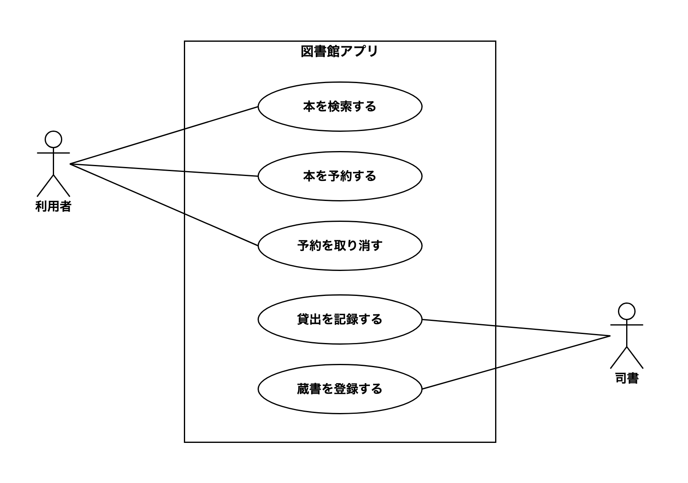
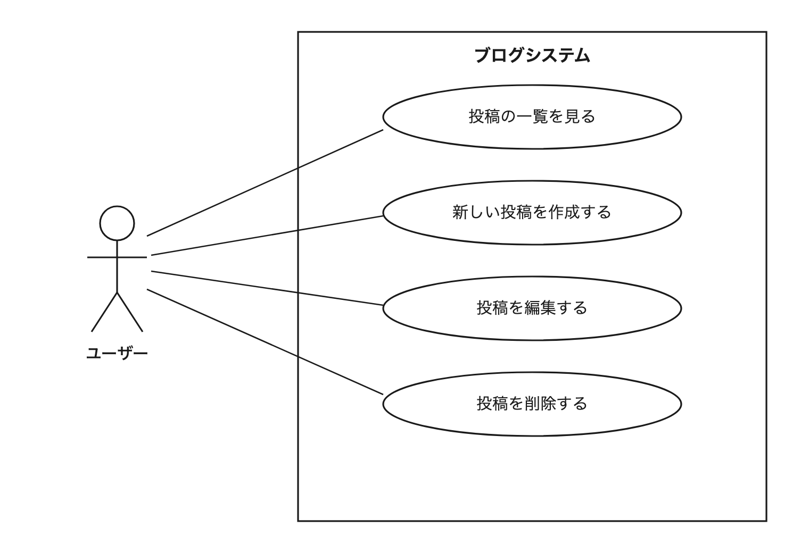

# 13-2-2: ユースケース図とユースケース記述

## 🎯 このセクションで学ぶこと

- ユースケース図の4つの記号を使って、「誰が・何をできるか」を1枚の図に表せるようになる。
- ユースケース記述のテンプレートで、1つの機能の流れ・条件・分岐を文章で固定できるようになる。
- あとから誰でも確認できる形で、受け入れ条件を書けるようになる。

---

## 導入：機能一覧だけでは、まだ作れない

前のセクション（13-2-1）で、仕様書から機能一覧を作り、曖昧な点を確認事項リストに書き出せるようになりました。このセクションでは、その機能一覧を「見た人がすぐ実装に入れる設計書」へ育てていきます。

題材は、前のセクションで読んだ「図書館アプリ」をそのまま使います。仕様書から作った機能一覧は、次のとおりでした。

| ID | 機能 | 主な利用者 |
|:---|:-----|:-----------|
| F-01 | 本の検索 | 利用者 |
| F-02 | 本の予約 | 利用者 |
| F-03 | 予約の取り消し | 利用者 |
| F-04 | 貸出の記録 | 司書 |
| F-05 | 蔵書の登録 | 司書 |

さて、この一覧を渡されて「F-02の本の予約を作ってください」と言われたら、すぐに実装へ入れるでしょうか。コードを書き始める前に、決めなければならないことが残っています。

- 予約は、どの画面から始まりますか。
- どんな本でも予約できますか。それとも、貸出中の本だけですか。
- 同じ本を2回予約しようとしたら、どうなるべきですか。
- 予約が終わったあと、利用者の画面には何が表示されますか。

機能一覧は「何を作るか」の目次としては優秀ですが、機能の名前だけでは、こうした質問に答えられません。答えが決まらないまま、開発する人がそれぞれ「たぶんこうだろう」で作ると、できあがったものはバラバラになります。実装が終わったあとで、発注者（開発を依頼した人）から「予約の取り消しは、利用者が自分でできる想定でした」と言われて、作り直すことになります。13-1-1で学んだ手戻りです。機能の設計が曖昧なままだと、これが何度でも発生します。

そこで、機能一覧の次に作る設計書が2つあります。

- **ユースケース図**: 誰が・何をできるかを、1枚の図で見渡せるようにしたもの。
- **ユースケース記述**: 1つの機能について、操作の流れ・条件・分岐を文章で固定したもの。

ここで言うユースケースとは、「利用者が本を予約する」のように、**使う人の目的から見た、システムの使い方のひとまとまり**を指します。

> 💡 **TIP**: 「ユースケース」という言葉は、Tutorial 12のハンズオンでも「📋 ユースケース」という見出しで登場しました。あちらは「この演習は、こういう場面を想定しています」という日常語（使い方の場面）としての使い方です。設計用語のユースケースも「誰かがシステムを使う場面」を指す点は同じで、それを決まった描き方・書き方で設計書にしたものだと考えてください。

---

## ユースケース図の読み方

描き方より先に、完成した図を読んでみましょう。先ほどの機能一覧から起こした、図書館アプリのユースケース図です。

**図書館アプリのユースケース図**



初めて見る図でも、おおよその意味は取れるのではないでしょうか。左右の棒人間が「利用者」と「司書」、真ん中の大きな四角が「図書館アプリ」、四角の中の楕円がこのアプリでできること、線が「誰がどれを使えるか」です。

この図から読み取れることを、順に確認します。

まず、🔑 **誰が・何をできるか**が一目で分かります。利用者は「本を検索する」「本を予約する」「予約を取り消す」の3つと線でつながり、司書は「貸出を記録する」「蔵書を登録する」の2つとつながっています。機能一覧のF-01〜F-05と見比べると、5つの機能がそのまま5つの楕円になっていることも確認できます。

次に、🔑 **線の有無が権限を表す**ことが分かります。「蔵書を登録する」と利用者の間に、線はありません。「利用者は蔵書を登録できない」という決めごとが、線を引かないという形で図に現れています。表の中の1行では見落としやすい権限の決めごとが、図にすると「線がない」という見た目で確認できます。

最後に、🔑 **どこまでを作るのか**という範囲が、大きな四角の枠で示されます。この枠をシステム境界と呼びます。たとえば「本を購入して蔵書を増やす」という仕事は図書館に実在しますが、枠の中にはありません。本の発注や購入の機能はこのアプリでは作らない、作るのは枠の内側だけ、という宣言です。

### 使う記号は4つだけ

いま読んだ図に登場した記号は、次の4つがすべてです。

| 見た目 | 名前 | 意味 |
|:-------|:-----|:-----|
| 棒人間 | アクター | システムを使う人や外部システム |
| 楕円 | ユースケース | アクターがシステムでできること。「〜を予約する」「〜を見る」のように動詞で終える |
| 大きな四角 | システム境界 | 今回作るシステムの範囲。上部に名前を書き、楕円を中に並べる |
| 実線 | 関連 | どのアクターが、どのユースケースを使えるか |

アクターは人とは限りません。たとえば決済サービスのような外部システムも、このシステムとやり取りする相手であればアクターとして描きます。

<details>
<summary>💡 こんな記号もある（今は覚えなくてOK）</summary>

UMLのユースケース図には、ほかにも include（複数のユースケースに共通する処理をくくり出す）、extend（特定の場合だけ追加される処理を表す）、汎化（アクターやユースケースの親子関係を表す）といった記号があります。現場の設計書で見かけたら「そういう記号もあった」と思い出せれば十分で、この教材の演習では使いません。まずは上の4つだけで、伝わる図を描けるようになりましょう。

</details>

---

## ユースケース図の描き方

読めるようになったところで、描く手順です。コツは、次の順で「決めてから、描く」ことです。

**手順1: アクターを洗い出す**

最初に決めるのは、機能ではなく「誰が使うのか」です。機能一覧の「主な利用者」列を縦に見ていくと、図書館アプリでは利用者と司書の2人が見つかります。これが、図の外側に立つ棒人間になります。

**手順2: ユースケースを洗い出して、IDを振る**

機能一覧の各行を、「〜する」という動詞の形に直します。機能一覧では「本の検索」と名詞で書きましたが、ユースケースはアクターの動作なので「本を検索する」と書きます。このとき、ユースケースにも通し番号のIDを振っておきます。

| 機能一覧 | ユースケース |
|:---------|:-------------|
| F-01 本の検索 | UC-01 本を検索する |
| F-02 本の予約 | UC-02 本を予約する |
| F-03 予約の取り消し | UC-03 予約を取り消す |
| F-04 貸出の記録 | UC-04 貸出を記録する |
| F-05 蔵書の登録 | UC-05 蔵書を登録する |

IDを振っておくと、このあと書くユースケース記述と突き合わせたり、チームの会話で「UC-03の仕様なんですが」と一言で対象を特定したりできます。

ここで注意したいのが、楕円の粒度（どこまで細かく分けるか）です。ユースケースは「アクターがシステムで達成したい目的」の単位で切ります。「検索ボタンを押す」のような操作の単位まで割ると、楕円が何十個にも増えて、誰が何をできるかがかえって見えなくなります。操作の手順は、このあと学ぶユースケース記述の基本フローに書く内容です。

**手順3: システム境界を描き、ユースケースを中に並べる**

大きな四角を描き、上部にシステム名（図書館アプリ）を書きます。手順2で洗い出した楕円を四角の中に並べ、アクターは四角の外に置きます。

**手順4: アクターとユースケースを線で結ぶ**

誰がどれを使えるかを、仕様書に戻って確認しながら線を引きます。ここで「予約の取り消しは、司書もできるのだろうか」と線を引くか迷ったら、それは仕様の曖昧な点を見つけたサインです。13-2-1で学んだとおり、勝手に決めずに「利用者本人だけが取り消せる想定で描いています。司書による取り消しは必要ですか」と、仮説を添えて確認事項リストに書き出しましょう。

---

## ユースケース記述の読み方

ユースケース図で、誰が何をできるかは決まりました。しかし、導入で挙げた4つの質問には、まだ1つも答えられていません。図をいくら眺めても、楕円の中身までは分かりません。

そこで、楕円を1つ取り出して、その中身を文章で固定するのがユースケース記述です。これも、まず完成した実例から読んでみましょう。UC-02「本を予約する」の記述です。

#### UC-02: 本を予約する

- **アクター**: 利用者
- **事前条件**: 利用者としてログインしている。対象の本が貸出中である
- **基本フロー**:
  1. 利用者が本の詳細画面で「予約する」ボタンを押す
  2. システムが予約内容の確認画面を表示する
  3. 利用者が「確定する」ボタンを押す
  4. システムが予約を登録し、完了メッセージを表示する
- **代替フロー**:
  - 3a. すでに同じ本を予約している場合：システムはエラーメッセージを表示し、予約を登録しない
- **事後条件**: 予約が1件登録され、「予約一覧」画面に表示される
- **受け入れ条件**:
  - [ ] 貸出中の本の詳細画面に「予約する」ボタンが表示される
  - [ ] 予約を確定すると、予約一覧に対象の本が表示される
  - [ ] 同じ本をもう一度予約しようとすると、エラーメッセージが表示され、予約は登録されない

導入で答えられなかった質問と、突き合わせてみてください。

| 導入の質問 | 記述のどこに答えがあるか |
|:-----------|:-------------------------|
| 予約はどの画面から始まる？ | 基本フロー1。本の詳細画面から始まる |
| どんな本でも予約できる？ | 事前条件。貸出中の本だけが対象 |
| 同じ本を2回予約したら？ | 代替フロー3a。登録されず、その旨が表示される |
| 終わったあと何が見える？ | 事後条件。予約一覧画面に表示される |

図では見えなかった流れ・条件・分岐が、すべて言葉で決まっています。この記述を渡された開発者は、「たぶんこうだろう」と推測せずに実装へ入れます。設計書のゴールは「それを見たら、人でもAIでもすぐ実装に入れる状態」です。ユースケース記述は、機能1つ分をその状態まで持っていくための設計書です。

> 💡 **TIP**: 事前条件の「ログインしている」も、事後条件の「予約一覧」画面も、機能一覧F-01〜F-05のどこにもないことに気づいたでしょうか。これは、記述を書いたことで見つかった機能一覧の漏れです。ログインのような前提の機能は、目玉ではないぶん一覧から漏れやすいのです。見つけた漏れは、13-2-1で学んだとおり「会員登録・ログインと予約一覧も必要という理解で合っていますか」と確認事項リストに書き出しましょう。確認が取れたら一覧に行を足し、図にも楕円が増えます。記述を書く作業は、こうして仕様の穴を見つける道具にもなります。

最後の受け入れ条件だけ、少し役割が違います。これは「この機能ができたと言ってよいか」を、あとから確認するためのチェックリストです。この教材の後半でAIに実装を任せるようになると、出てきた成果物を受け取ってよいか確かめる（検収する）ときの基準として、このチェックリストをそのまま使います。書き方のコツは、このあとの「ユースケース記述の書き方」で扱います。

---

## ユースケース記述の書き方

ユースケース記述は、次のテンプレートで書きます。Markdownでそのまま書ける形なので、自分の設計書を書くときはコピーして使ってください。

```markdown
#### UC-01: {動詞で終わるユースケース名}

- **アクター**: {主となるアクター}
- **事前条件**: {開始前に成り立っていること。無ければ「なし」}
- **基本フロー**:
  1. {アクター}が〜する
  2. システムが〜する
- **代替フロー**:
  - {分岐元ステップ番号}a. {分岐条件}：{そのときのシステムの振る舞い}
- **事後条件**: {終了後に成り立っていること}
- **受け入れ条件**:
  - [ ] 〜すると、〜になる
```

各項目に書くことは、次のとおりです。

| 項目 | 書くこと |
|:-----|:---------|
| アクター | このユースケースを使う、主となるアクター |
| 事前条件 | 始まる前に成り立っていること。無ければ「なし」と書く |
| 基本フロー | うまくいく場合の流れを、番号付きで1動作ずつ |
| 代替フロー | 基本フローから分岐する場合の振る舞い。「3a」は「基本フローの3から分かれる、1つ目の分岐」という意味。無ければ「なし」と書く |
| 事後条件 | 終わったあとに成り立っていること |
| 受け入れ条件 | 「〜すると、〜になる」の形で2〜4件のチェックリスト |

テンプレートを埋めるときのコツを3つ紹介します。

**主語は「アクター」か「システム」だけにする**

基本フローの各行は、「利用者が〜する」か「システムが〜する」のどちらかで書きます。主語をこの2つに絞ると、誰がやるのか曖昧な行を書けなくなります。「予約が登録される」と主語を省いて書くと、利用者の操作なのかシステムの自動処理なのか、読む人によって解釈が割れます。「システムが予約を登録する」なら、一通りにしか読めません。

**システムの中身は書かない**

「システムがreservationsテーブルにデータを追加する」のような実装の詳細は書きません。アクターから見える振る舞い、つまり何が表示され、何が登録されるかまでに留めます。どう実装するかは、この記述を受け取った開発者が決めることです。

**受け入れ条件は、確認できる形で書く**

「正しく予約できる」「使いやすい画面になっている」は、人によって判定が変わるため、受け入れ条件になりません。「同じ本をもう一度予約しようとすると、エラーメッセージが表示される」なら、誰が操作しても判定が一致します。書いたら「これは操作して確かめられるか」と自分に問い直してみてください。

> ⚠️ **注意**: ユースケース名は「予約する」「見る」のような動詞の言い切りで終え、図・記述・仕様書で同じ言葉を使ってください。仕様書が「予約」と呼ぶものを記述で「取り置き」と書くと、同じものかどうかの確認だけで会話が1往復増えます。

---

## 🏃 描いてみよう

> 🔥 この演習では、図をAIに描かせずに、自分の手で描きましょう。記法や考え方についてAIに質問するのは構いませんが、成果物を生成させるのはTutorial 14までお預けです。まず自分の手と頭で描けるようになった人だけが、AIの描いた設計を正しく評価できるようになります。

図書館アプリは「読む」練習でした。今度は、あなたが実際に作ったことのあるアプリを、図と記述に起こしてみましょう。題材は、9-4-9「Eloquent ORM - ハンズオン演習」で作ったブログシステム（eloquent-app-practice）です。あのときの要件は、次の5つでした。

- 投稿の一覧が表示できる
- 新しい投稿を作成できる
- 投稿を編集できる
- 投稿を削除できる
- 公開日時が表示できる

自分でコードを書いて動かしたアプリなので、図の1つ1つが「あの画面のことだ」と結びつくはずです。4つのStepで進めます。

### Step 1: アクターを洗い出す

このアプリを使うのは誰でしょうか。9-4-9のブログシステムに、ログイン機能はあったでしょうか。

ありませんでした。誰がアクセスしても、一覧を見ることも、投稿の作成・編集・削除もできます。役割の区別が存在しないので、アクターは「ユーザー」の1人だけです。アクターが1人しかいない図は、おかしな図ではありません。「アクターは複数いるはずだ」と思い込んで、存在しない管理者を描き足さないようにしましょう。

> 💡 **TIP**: もしこのアプリに、Tutorial 10のChapter 1「Laravelにおける認証」で学んだログイン機能を足すと、アクターは「訪問者」と「ログイン済みユーザー」に分かれ、線のつなぎ方も変わります（たとえば、投稿の作成・編集・削除はログイン済みユーザーだけ）。ログインの有無は、アクターの数を変えるのです。

### Step 2: ユースケースを洗い出す

要件を「〜する」の形に直します。ここで1つ考えてほしいのが、「公開日時が表示できる」の扱いです。これは、ユースケースになるでしょうか。

ユーザーの目的で考えてみてください。「公開日時を表示すること」だけを目的にこのアプリを開く人はいません。ユーザーの目的は「投稿の一覧を見る」ことで、公開日時はその一覧画面に表示される項目の1つです。実際、9-4-9で作った一覧画面でも、公開日時はタイトルの隣に並ぶ1列でした。したがって、この要件は「投稿の一覧を見る」の中身に含め、独立したユースケースにはしません。

要件の行数とユースケースの数は、一致するとは限りません。要件は「実現してほしいことのリスト」、ユースケースは「アクターの目的のひとまとまり」で、粒度が違うからです。

なお、今回は要件が5行と短いので、機能一覧の表を作る工程は省いて、要件から直接ユースケースを洗い出します。UCの番号は機能一覧と対応させる必要はなく、UC-01から数え直して振ります（仕様→機能一覧→ユースケースの通しの流れは、次のセクションの演習で実践します）。

結果、ユースケースは次の4本になります。

- UC-01: 投稿の一覧を見る
- UC-02: 新しい投稿を作成する
- UC-03: 投稿を編集する
- UC-04: 投稿を削除する

### Step 3: draw.ioで図に起こす

13-1-3で使い方を学んだdraw.ioで、図に起こします。使うシェイプは、Actor（棒人間）、Ellipse（楕円）、四角形、直線の4種類です。システム境界の名前は「ブログシステム」とします。操作に迷ったら、13-1-3を見返しましょう。

できあがった図が、教材の図と線の太さや字体、楕円の並び順で違っていても問題ありません。draw.ioで引いた線の端に矢印が付くことがありますが、関連は向きを持たない線なので、矢印が付いたままでも構いません。記号の使い方と、誰がどれにつながっているかという対応関係が合っていれば正解です。

### Step 4: 記述を1本書く

UC-02「新しい投稿を作成する」のユースケース記述を、テンプレートを写して書きます。埋めながら、次の点を考えてみてください。

- 事前条件はあるでしょうか。Step 1で確認したことを思い出してください。
- 基本フローは、9-4-9で自分が操作した画面の流れです。一覧画面のどのボタンから始まり、最後にどの画面へ戻ったでしょうか。
- 受け入れ条件は、「〜すると、〜になる」の形で2〜3件書きます。

書き終えたら、design-practiceリポジトリの、13-2-1で作った`13-2/`フォルダに、図の.drawioファイル、書き出した画像、記述のMarkdownファイル（例: `usecase.drawio`・`usecase.png`・`uc-02.md`）の3点を保存します。画像の書き出し方は、13-1-3で学んだ手順のとおりです。保存したら、Tutorial 12で学んだ流れでコミットとpushまで済ませておきましょう。この成果物は、あとの学習でも見返して使います。

<details>
<summary>📖 描き終えたら開く（答え合わせ）</summary>

**ブログシステムのユースケース図（解答例）**



次の観点で、自分の図と見比べてください。

- [ ] アクターは「ユーザー」の1人になっている
- [ ] 楕円は4つで、どれも動詞で終わっている（画面や項目の名前になっていない）
- [ ] 「公開日時が表示できる」を独立した楕円にしていない
- [ ] システム境界「ブログシステム」の中に楕円があり、アクターは外にいる
- [ ] ユーザーから4つの楕円すべてに線が引かれている

**UC-02: 新しい投稿を作成する（記述の解答例）**

```markdown
#### UC-02: 新しい投稿を作成する

- **アクター**: ユーザー
- **事前条件**: なし
- **基本フロー**:
  1. ユーザーが投稿一覧画面で「新規作成」を押す
  2. システムが投稿フォームを表示する
  3. ユーザーがタイトルと本文を入力して送信する
  4. システムが投稿を保存し、一覧画面に戻す
- **代替フロー**: なし
- **事後条件**: 投稿が1件保存され、投稿一覧に表示される
- **受け入れ条件**:
  - [ ] 投稿一覧画面で「新規作成」を押すと、投稿フォームが表示される
  - [ ] タイトルと本文を入力して送信すると、投稿一覧に新しい投稿が表示される
```

設計に唯一の正解はありません。文言が一字一句同じである必要もありません。上の観点とテンプレートの項目を満たしていれば合格です。そのうえで、判断が分かれやすい2点だけ補足します。

- **事前条件を「なし」とした理由**: このアプリにはログイン機能がないため、「ログインしている」という条件が要りません。条件が無いときに空欄のままにせず「なし」と書くのは、「検討した結果、無い」と「書き忘れた」を区別するためです。
- **代替フローを「なし」とした理由**: 9-4-9の要件には、入力エラーなどの分岐が書かれていないためです。もし「タイトルが未入力なら保存しない」という要件が加われば、ここに「3a. タイトルが未入力の場合：システムはエラーメッセージを表示し、保存しない」という行が増えます。

</details>

---

## 💡 よくある間違いと現場での使われ方

最後に、初めて描く人がつまずきやすいポイントと、この2つの設計書が現場でどう使われているかを紹介します。

**間違い1: 楕円が「アクターの目的」以外になっている**

「データベースに投稿を保存する」（システムの内部処理）や、「投稿フォーム画面」「送信ボタンを押す」（画面や操作）を楕円にしてしまう間違いです。楕円に書くのは、アクターから見た「達成したいこと」だけです。「新しい投稿を作成する」という目的の楕円が1つあれば、保存もフォーム画面もボタンも、そのユースケース記述の基本フローの中に現れます。

**間違い2: 図・記述・仕様書で言葉がずれる**

図では「投稿を作成する」、記述では「記事を追加する」のように言葉がずれると、読む人は「これは同じもの？別のもの？」と疑いながら読むことになります。自分なりに名前を付け直したくなっても、仕様書の言葉に揃えるのが原則です。

現場では、この2つの設計書は役割分担して使われます。ユースケース図が活躍するのは、発注者との認識合わせです。仕様書の文章を読み合わせるより、図を1枚見せて「利用者ができるのはこの3つで合っていますか」と確認するほうが速く、漏れも見つかりやすいからです。一方、ユースケース記述は、実務ではすべてのユースケースに書くとは限りません。「本を検索する」のような流れの素直なものは図と機能一覧で済ませ、予約や決済のように条件・分岐が絡むもの、認識がずれたときの作り直しが大きいものから優先して書きます。本教材の演習では、練習のため指定された分を必ず書きます。また、書いた受け入れ条件は、この先の章で学ぶテスト設計の観点の種にもなります。

---

## ✨ まとめ

- ユースケース図は、アクター・ユースケース・システム境界・関連の4つの記号で、「誰が・何をできるか」と「どこまで作るか」を1枚で表す設計書です。
- 線の有無は権限を表します。線を引くか迷ったら仕様の曖昧な点なので、仮説を添えて確認事項リストに書き出します。
- ユースケース記述は、楕円1つの中身（流れ・条件・分岐・終わったあとの状態）を決まった項目で文章にした設計書です。基本フローの主語は「アクター」と「システム」に限定します。
- 受け入れ条件は「〜すると、〜になる」という確認できる形で2〜4件書きます。教材の後半で、AIに実装を任せたときの検収基準になります。
- 要件の粒度とユースケースの粒度は別物です。楕円は「アクターの目的」の単位で切り、操作の手順は基本フローに書きます。

次のセクション（13-2-3）は、この章の設計演習です。初めて見る仕様から、機能一覧とユースケース図を白紙から作ります。図書館アプリで「読み」、ブログシステムで「描いた」流れを、今度は最初から通しで実践しましょう。

---
