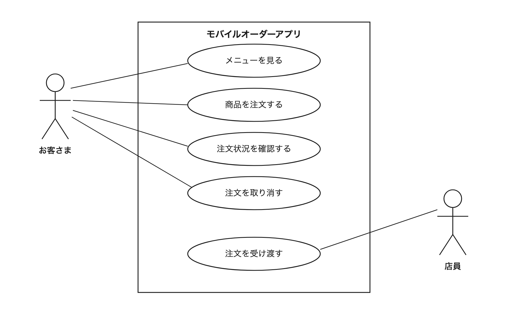

# 13-2-3: 機能設計 - 設計演習

## 📌 この演習について

今回渡されるのは、初めて見る仕様書1枚だけです。決まっていないことを見つけても、答えを確かめられるコードはありません。

ここで作る設計書は、Chapter 6の終わりまで使い続けます。決めた機能とユースケースの上に、画面・API・データ・振る舞いを積み上げていくので、行の数も名前も自分で決めた形のまま持ち回ります。

---

## 🎯 演習課題

### 📋 与えられる仕様

題材は、カフェのモバイルオーダーアプリです。駅前で小さなカフェを営む店長から、次の相談が届いたとします。

> **カフェのモバイルオーダーアプリのご相談**
>
> 駅前で小さなカフェを営んでいます。お昼どきになるとレジの前に列ができてしまい、待ちきれずに帰ってしまうお客さまもいます。そこで、お客さまがスマートフォンから先に注文と支払いを済ませておいて、できあがったころに店頭で受け取るだけ、という形にできないかと考えました。そのためのアプリを作ってもらえないでしょうか。
>
> お客さまには、まずその日のドリンクとフードの一覧を見ていただきたいです。商品の名前と値段と、短い説明が並んでいれば十分です。飲みたいものが決まったら、商品と個数を選んで、そのままアプリの中で支払いまで済ませられるようにしてください。
>
> 注文したあとは、その注文がお店に届いているかどうかを、アプリで確認できるようにしてください。列に並ばずに注文するぶん、「ちゃんと注文できたのだろうか」と不安になるお客さまが多いと思うのです。それから、注文したあとで急に来られなくなることもありますので、注文の取り消しもできるとよいと思います。
>
> 私たち店員の側の話もさせてください。カウンターの中にタブレットを1台置いて、入った注文をそこで見られるようにしたいです。商品ができてお客さまにお渡ししたら、その場で「渡しました」と記録できると助かります。今は紙の伝票を手で仕分けていて、渡し忘れが起きることがあります。
>
> なお、ポイントカードやクーポンは今のところ考えていません。ゆくゆくは「できあがりました」というお知らせも出したいのですが、まずは注文して受け取れるところまでで大丈夫です。

### ✏️ 作成する成果物

この仕様書から、次の成果物を作ります。

1. 機能一覧と、今回作らないものの表。機能一覧は `ID`・`機能`・`主な利用者` の3列のMarkdown表で、1つの目的で1行になるよう粒度を揃えます。そのすぐ下に、`作らないもの`・`理由` の2列の表を続けます。
2. 確認事項リスト。`ID`・`確認したいこと（こちらの想定つき）`・`関係する機能`・`状態` の4列のMarkdown表で、3行以上書きます。
3. ユースケース図。draw.ioで描き、`.drawio` ファイルとPNG画像の2つを残します。
4. ユースケース記述。13-2-2のテンプレートで2本書きます。1本は、主となるアクターがお客さまのもののうち、支払いを扱うものを選びます（支払いを独立したユースケースにした場合は、そのユースケースです）。もう1本は、主となるアクターが店員のものです。

13-2-2の「🏃 描いてみよう」で書いた記述は1本でした。今回2本書くのは、主となるアクターが違うものを並べると、アクターが変われば流れの主語も変わることが見えてくるからです。洗い出したユースケース全部の記述は書きません。13-2-2で確認したとおり、条件や分岐が絡むもの、認識がずれたときの作り直しが大きいものから書きます。

成果物は、13-2-1で作った `docs/13-2/` フォルダに保存します。ファイル名の先頭には、13-2-1と同じ付け方で `cafe-` を付けます。保存とコミットの手順は、実践のStep 6にまとめてあります。

### ✅ セルフチェック

- [ ] 仕様に書かれた機能が、機能一覧のどこかに1行として現れている
- [ ] 今回は作らないと書かれていたものを、機能一覧に入れていない
- [ ] 作らないものの表のどの行にも、なぜ作らないのかの理由が書かれている
- [ ] 仕様に書かれていない機能を、親切心で足していない
- [ ] アクターが漏れなく洗い出せていて、機能一覧の「主な利用者」列と対応している
- [ ] 楕円がすべて動詞で終わっている（画面名や項目名になっていない）
- [ ] 誰がどれを使えるかが、線の有無で表されている
- [ ] 決めきれなかった点を、勝手に決めずに想定を添えて確認事項リストへ書き出している
- [ ] ユースケース記述に空欄がなく、無い項目には「なし」と書けている
- [ ] 受け入れ条件が「〜すると、〜になる」の形で、操作して確かめられる
- [ ] 用語が仕様書と一致している（言い換えていない）
- [ ] **この設計書を初めて見た人が、質問せずに実装へ進めそうか**

> 💡 **合格基準**: 設計書のゴールは「それを見たら、人でもAIでもすぐ実装に入れる状態」です。答えられない質問が残っていそうなら、そこが設計の穴です。

> 🚀 **ここから先は、自分の力で作ってみましょう！**

---

## 💡 ヒント

手が止まったときの戻り先は決まっています。機能一覧と確認事項リストの作り方は13-2-1、図の4つの記号とユースケース記述のテンプレートは13-2-2、draw.ioの操作は13-1-3です。

そのうえで、詰まりやすい3か所には、決まった対処があります。

- **機能を拾いきれない**: 依頼した人の文章から「〜してください」「〜したいです」「〜と助かります」「〜できるとよいと思います」と書かれている箇所を探します。
- **仕様書に無いものを足したくなる**: 足しません。お気に入り登録やレビューのように「あったほうが便利では」と思いついたものは、機能一覧に入れずに確認事項リストへ書きます。
- **決めきれない**: 手を止めません。「〜という想定で進めています。〜は必要ですか」と自分の想定を添えて確認事項リストに1行書き、その想定のまま先へ進みます。

---

## 🏃 実践

### 🧠 先輩エンジニアの思考プロセス

先輩エンジニアは、仕様書を次の順で設計書に落とし込みます。

| Step | やること | 説明 |
|:-----|:---------|:-----|
| 1 | 仕様を読んで、使う人と作らないものに印を付ける | 最初に決めるのは機能ではなく、誰が使うかと、今回は作らないもの。ここがぶれると、この先が全部ぶれる |
| 2 | 機能一覧を作る | 依頼した人の文章から動きを拾い、1つの目的で1行に揃えてIDを振る。文章の段落数と機能の数は一致しない |
| 3 | 決めきれなかったことを確認事項リストに書き出す | 迷ったまま進まない。想定を添えて書けば、確認を待たずに先へ進める |
| 4 | 機能一覧からアクターとユースケースを起こす | 「主な利用者」列がアクター、機能名を動詞に直したものがユースケース |
| 5 | システム境界を描き、線を引く | 線を引くか迷ったら、Step 3へ戻すサイン |
| 6 | 条件と分岐が絡むものから、ユースケース記述を書く | 全部は書かない。書きながら見つかった漏れも、また Step 3へ |

### 📝 ステップバイステップで描く

#### Step 1: 仕様を読んで、使う人と作らないものに印を付ける

仕様書をもう一度読み、登場する人に印を付けます。相談の文章は依頼した人の視点で書かれているので、「私たち」と書かれている側も、このアプリを使う人です。

続けて、「今のところ考えていません」「まずは〜までで大丈夫です」と書かれている箇所を探し、今回は作らないものとして書き出します。

#### Step 2: 機能一覧を作る

課題で指定した3列で表を作ります。機能の名前は「注文の取り消し」のような名詞の形に揃え、`F-01` から順にIDを振ります。

ここで、段落と機能を1対1で対応させないように気をつけてください。1つの段落から2つの機能が出てくることも、2つの段落に散らばった記述が1つの機能にまとまることもあります。仕様書を書いた人は、機能の数を意識して段落を分けているわけではありません。

表ができたら、そのすぐ下に `作らないもの`・`理由` の2列の表を続けます。Step 1で印を付けたものを行にして、理由の列を空けないようにします。

#### Step 3: 決めきれなかったことを確認事項リストに書き出す

課題で指定した4列で表を作り、`Q-01` から順にIDを振ります。「関係する機能」の列に機能一覧のIDを書いておくと、返事が来たときに、どの行を直せばよいかがすぐ分かります。状態はすべて「未確認」になります。

Step 2で少しでも手が止まった場所は、ここに書き出す候補です。「この列に何を書けばいいのか決まらない」と感じたこと自体が、仕様書に答えが無いという証拠です。

表を作るだけでは手が止まらなかったところにも、決まっていないことは隠れています。実際に使う場面を、頭の中で一度通してみてください。お客さまが注文してから受け取るまで、店員が注文を受けてから渡すまでを順にたどると、仕様書が答えていない場面が出てきます。

#### Step 4: 機能一覧からアクターとユースケースを起こす

機能一覧の「主な利用者」列を縦に見て、アクターを決めます。次に、各行の機能名を「〜する」の形に直し、`UC-01` から番号を振ります。

いきなり図に入らず、機能一覧とユースケースの対応表を先に作っておくと迷いません。13-2-2の手順2で作ったのと同じ、2列の表です。これは図を描くための下書きなので、ファイルとして保存しなくて構いません。

#### Step 5: システム境界を描き、線を引く

draw.ioで図に起こします。使うシェイプは、Actor（棒人間）、Ellipse（楕円）、四角形、直線の4つです（13-1-3）。システム境界の名前は「モバイルオーダーアプリ」とします。

楕円を四角の中に並べたら、アクターと楕円を線でつなぎます。誰がどれを使えるかは、思い出しで済ませずに仕様書へ戻って確かめてください。線を引くか迷ったら、Step 3の表に1行足してから先へ進みます。

線の太さ・字体・楕円の並び順や、線の端に付く矢印は、13-2-2と同じく問いません。記号の使い方と対応関係が合っていれば正解です。

#### Step 6: 条件と分岐が絡むものから、ユースケース記述を書く

課題で指定した2本を書きます。残りは流れが素直なので、図と機能一覧で足ります。

13-2-2のテンプレートをコピーして、項目を上から埋めます。無い項目は空欄にせず「なし」と書きます。

書き終えたら、`docs/13-2/` フォルダに次の6つのファイルを保存します。

```text
docs/13-2/
├── cafe-feature-list.md   # 機能一覧と、今回作らないものの表
├── cafe-questions.md      # 確認事項リスト
├── cafe-usecase.drawio    # ユースケース図（編集用）
├── cafe-usecase.png       # ユースケース図（表示用）
├── cafe-uc-02.md          # ユースケース記述（お客さま側）
└── cafe-uc-05.md          # ユースケース記述（店員側）
```

記述のファイル名の番号は、自分が振ったIDに合わせてください。保存できたら、コミットとpushまで済ませます。

```bash
# post-app-practice フォルダの中で実行する
git add docs/13-2
git commit -m "13-2: カフェのモバイルオーダーアプリの設計書を追加"
git push
```

---

## 📖 模範解答

<details>
<summary>📖 作り終えたら開く（模範解答）</summary>

**機能一覧（解答例）**

| ID | 機能 | 主な利用者 |
|:---|:-----|:-----------|
| F-01 | メニューの閲覧 | お客さま |
| F-02 | 商品の注文 | お客さま |
| F-03 | 注文状況の確認 | お客さま |
| F-04 | 注文の取り消し | お客さま |
| F-05 | 注文の受け渡し | 店員 |

**今回作らないもの（解答例）**

| 作らないもの | 理由 |
|:-------------|:-----|
| ポイントカード・クーポン | 今のところ考えていないと書かれていて、依頼の時点で対象外と決まっているため |
| できあがりのお知らせ | まずは注文して受け取れるところまででよいと、依頼の時点で範囲が区切られているため |

この表に移して残しておくと、どこまで作るのかの線がどこにあるかを、機能一覧と一緒に依頼した人へ見せられます。

**確認事項リスト（解答例）**

| ID | 確認したいこと（こちらの想定つき） | 関係する機能 | 状態 |
|:---|:-----------------------------------|:-------------|:-----|
| Q-01 | 注文の取り消しは、お客さまご自身が、店員が商品を作り始める前まで行える想定です。それより後の取り消しや、店員が代わりに取り消すことは必要ですか | F-04 | 未確認 |
| Q-02 | 店員の方であれば、どなたでもすべての注文を確認して受け渡しできる想定です。店長とアルバイトの方で、扱える範囲を分ける必要はありますか | F-05 | 未確認 |
| Q-03 | その日に売り切れた商品は、メニューには表示したうえで注文できないようにする想定ですが、それで問題ないですか | F-01・F-02 | 未確認 |
| Q-04 | お客さまは会員登録をせずに注文でき、注文のあとに表示される注文番号で状況を確認する想定ですが、それで問題ないですか | F-02・F-03 | 未確認 |
| Q-05 | 1回の注文で複数の商品をまとめて選べる想定で、選んだ商品をいったんカートにためてから支払いに進む形を考えていますが、それで問題ないですか | F-02 | 未確認 |
| Q-06 | 店頭での受け渡しは、お客さまに注文番号をお伝えいただき、店員がその番号で注文を探す想定ですが、それで問題ないですか | F-05 | 未確認 |

6行と同じである必要はありません。3行以上書けていて、どの行にも自分の想定が添えられていれば十分です。

**機能一覧とユースケースの対応（解答例）**

| 機能一覧 | ユースケース |
|:---------|:-------------|
| F-01 メニューの閲覧 | UC-01 メニューを見る |
| F-02 商品の注文 | UC-02 商品を注文する |
| F-03 注文状況の確認 | UC-03 注文状況を確認する |
| F-04 注文の取り消し | UC-04 注文を取り消す |
| F-05 注文の受け渡し | UC-05 注文を受け渡す |

**モバイルオーダーアプリのユースケース図（解答例）**



店員とUC-04「注文を取り消す」の間に、線を引いていません。店員が代わりに取り消せるかどうかが仕様書に書かれておらず、Q-01として未確認のままだからです。線を引かないという形は「取り消せない」という決定を表すので、確認の返事で「店員も取り消せます」となれば、ここに線が1本増えます。

**UC-02: 商品を注文する（記述の解答例）**

```markdown
#### UC-02: 商品を注文する

- **アクター**: お客さま
- **事前条件**: なし
- **基本フロー**:
  1. お客さまがメニュー画面で商品と個数を選び、「カートに入れる」を押す
  2. システムが注文内容と合計金額を表示する
  3. お客さまが「支払いに進む」を押す
  4. システムが支払いの画面を表示する
  5. お客さまが支払いの手続きを行う
  6. システムが注文を登録し、注文番号を表示する
- **代替フロー**:
  - 5a. 支払いが完了しなかった場合：システムはエラーメッセージを表示し、注文を登録しない
- **事後条件**: 注文が1件登録され、発行された注文番号で注文状況を確認できる
- **受け入れ条件**:
  - [ ] メニュー画面で商品と個数を選ぶと、注文内容と合計金額が表示される
  - [ ] 支払いが完了すると、注文番号が表示される
  - [ ] 支払いが完了しないまま終わると、エラーメッセージが表示され、注文は登録されない
```

**UC-05: 注文を受け渡す（記述の解答例）**

```markdown
#### UC-05: 注文を受け渡す

- **アクター**: 店員
- **事前条件**: 受け取り前の注文が1件以上ある
- **基本フロー**:
  1. 店員が注文一覧画面を開く
  2. システムが受け取り前の注文を、注文番号とともに一覧で表示する
  3. 店員がお客さまから伝えられた注文番号の注文を選ぶ
  4. システムが注文の商品と個数を表示する
  5. 店員が商品を渡し、「受け渡し済みにする」を押す
  6. システムが受け渡し済みとして記録し、受け取り前の一覧から外す
- **代替フロー**:
  - 3a. 伝えられた注文番号が一覧にない場合：システムは該当する注文がない旨を表示する
- **事後条件**: 対象の注文が受け渡し済みとして記録され、受け取り前の一覧に表示されなくなる
- **受け入れ条件**:
  - [ ] 注文一覧画面に、受け取り前の注文が注文番号とともに表示される
  - [ ] 注文番号で注文を選ぶと、その注文の商品と個数が表示される
  - [ ] 「受け渡し済みにする」を押すと、その注文が受け取り前の一覧から消える
```

UC-02の事前条件を「なし」にしたのは、会員登録をせずに注文できる想定にしたからです。想定が変われば、ここは「会員として登録が済んでいる」に変わります。「カートに入れる」と「お客さまから伝えられた注文番号」も仕様書には無い決めごとなので、Q-05・Q-06として確認に出したうえで記述に書いています。

**迷いやすいところ**

**「メニューを見る」を独立したユースケースにするか**

模範では独立させました。「今日は何があるのかな」とメニューだけ見て、その日は注文せずに閉じるお客さまが実際にいて、それ自体がお客さまの目的として成り立つからです。物差しは、それ1つを目的にアプリを開く人がいるかどうかです。注文の途中で必ず通る画面だからと考えてUC-02の基本フローに含めた場合も、その理由を説明できるなら誤りではありません。

同じ物差しで、支払いはUC-02の中に含め、店員側もUC-05の1本にまとめました。どちらも、それだけを目的にアプリを開くことがないからです。分けた結果、楕円が「一覧画面を開く」「行をタップする」のような操作の単位まで細かくなっていたら、それは分けすぎです。

</details>

---

## 🚀 まとめ

- 仕様書から設計書までの道のりは、使う人と作らないものに印を付ける、機能一覧を作る、決めきれないことを確認事項リストに書き出す、アクターとユースケースを起こす、図に描く、記述を書く、の順で進みます。
- 段落の数と機能の数は一致しません。
- 決めきれない点にぶつかったら、自分で決めるのでも、手を止めるのでもなく、想定を添えて確認事項リストに書きます。返事を待つあいだも、その想定の上で設計は進みます。
- 図で線を引かないことは「使えない」という決定を表すので、未確認のまま線を引かずに残した箇所が、確認の返事が来たときに直す場所になります。
- ユースケース記述は、条件や分岐が絡むものから書きます。

ここで作った機能一覧とユースケース図が決めたのは、「誰が、何をできるか」までです。お客さまが最初に開く画面から注文を終えるまで、どんな画面をどうつなぐのかは、Chapter 3で決めます。カフェのモバイルオーダーアプリは、Chapter 6の章末演習まで続けて題材に使います。

---
