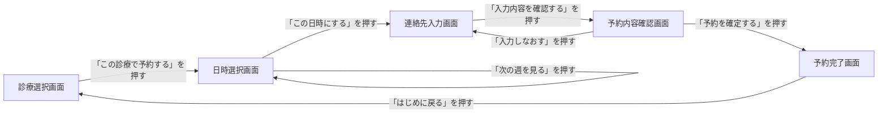
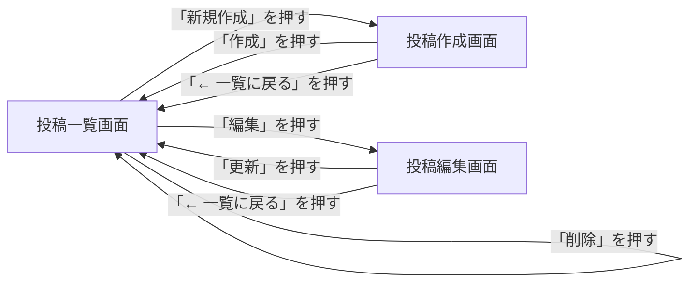

# 13-3-1: 画面一覧と画面遷移図

## 🎯 このセクションで学ぶこと

- ユースケースの流れから画面が何枚必要かを数え、名前を付けて画面一覧に並べられるようになる。
- どの画面から、どの操作で、どの画面へ移るのかを画面遷移図に描けるようになる。
- 図に引いた矢印の向きが何を表しているのかを、説明できるようになる。

---

## 導入：画面の枚数が決まらないと、作る量も決まらない

Chapter 2で作った機能一覧とユースケース図は、「誰が、何をできるか」までを決めた設計書でした。13-1-2の一覧のとおり、このChapter 3「画面設計」も基本設計です。ここで決めるのは、その「できること」を何枚の画面で見せ、画面どうしをどうつなぐのかです。

画面を決めずに実装へ入ると、まず作る量が見積もれません。Web開発では、画面1枚ごとに表示用のファイルと、それを返す処理が要ります。画面が5枚なのか8枚なのかで、かかる日数は変わります。数えられないものは、いつ終わるかも答えられません。

画面のつながりも、人によって変わります。13-2-2で読んだ図書館アプリのユースケース記述には「システムが予約内容の確認画面を表示する」という行がありました。その確認画面が一覧のどれなのか、確定したあとどこへ戻るのかまでは書かれていません。3人で分担すれば、3通りの行き先ができあがります。

どちらも防ぐために、Chapter 3の最初に2つの設計書を作ります。

- **画面一覧**（そのシステムに何という画面があるかを並べた表）: 作る画面を、数えられる形に並べたもの。
- **画面遷移図**: どの画面から、どの操作で、どの画面へ移るのかを1枚で表した図。

---

## 画面一覧の読み方

題材は、歯科医院の予約アプリです。次の相談を受けたとします。

> 歯科医院で受付をしています。予約のお電話が診療中にも鳴ってしまい、お待たせすることが多いので、患者さんがスマートフォンからご自分で予約を取れるようにしたいです。
>
> 受けたい診療（定期健診、むし歯の治療など）を選んでいただき、空いている日時から1つ選んで、お名前と連絡先を入れて予約が終わる、という流れを考えています。日時は1週間ぶんずつお見せして、その週に空きがなければ次の週も見られるようにしてください。予約が終わったら、その場で予約した日時をご確認いただけると安心だと思います。

この相談から起こした画面一覧が、次の表です。

| ID | 画面名 | 役割 | 主な利用者 |
|:---|:-------|:-----|:-----------|
| SC-01 | 診療選択画面 | 受けたい診療を一覧で見せ、1つ選ぶ（最初に開く画面） | 患者 |
| SC-02 | 日時選択画面 | 空いている日時を1週間ぶん見せ、1つ選ぶ | 患者 |
| SC-03 | 連絡先入力画面 | お名前と連絡先を入力する | 患者 |
| SC-04 | 予約内容確認画面 | 選んだ診療・日時・連絡先を並べて見せ、予約を確定する | 患者 |
| SC-05 | 予約完了画面 | 予約できたことと、予約した日時を知らせる | 患者 |

この表を読むと、作る画面が5枚だと🔑 **数えられます**。機能一覧で作るものの数を数えたのと同じで、画面一覧は「表示する側の作業がいくつあるか」を数えられる形にした表です。

どの行にも役割が書かれているので、名前だけでは分からない中身も伝わります。「日時選択画面」という名前だけでは、1週間ぶんなのか1か月ぶんなのかが分かりません。役割の欄まで読めば、そこが決まっていることを確かめられます。

SC-01の役割には「最初に開く画面」と書き添えてあります。患者がこのアプリを開いたとき、最初に見えるのはこの画面です。ここが決まっていないと、次に描く画面遷移図の出発点も決まりません。

> 💡 **TIP**: 表の列は `ID`・`画面名`・`役割`・`主な利用者` の4列で固定します。「この画面はどの機能に対応するのか」を書き足したくなりますが、列は増やしません。機能一覧との突き合わせは、このあとのセルフチェックの観点で行います。

---

## 画面一覧の書き方

手順は4つです。

**手順1: ユースケースをたどって、切れ目を探す**

画面は、思いついた順に数えません。13-2-2で書いたユースケース記述の基本フローを、1行ずつ上からたどります。そして「システムが〜を表示する」と書かれている行で、**画面に並んでいるものが別のものに置き換わるか**を見ます。置き換わるなら別の画面、並んでいるものはそのままで中に入る値だけが変わるなら同じ画面です。

記述を書いていないユースケースもあります。13-2-2で確認したとおり、記述は条件や分岐が絡むものから書くので、全部はそろっていません。記述が無いものは、頭の中で操作の流れを通してみてください。

歯科医院の予約アプリなら、診療を選んだあとに映るのは日時の一覧です。診療名の並びが消えて、日付と時刻の並びに変わります。並んでいるものが別のものに置き換わるので、別の画面です。一方、日時選択画面で「次の週を見る」を押したときは、日付と時刻という同じものが並んだまま、その値が別の週のものに変わるだけです。並んでいるものは置き換わっていないので、同じ画面のままです。

**手順2: 画面に名前を付ける**

名前は🔑 **「〜画面」で終える**形に揃えます。そして、仕様書とユースケース記述に出てくる言葉をそのまま使います。相談の文章が「診療」と呼んでいるものを「メニュー」と言い換えると、あとで表を突き合わせるときに、同じものかどうかの確認が1往復増えます。

避けたいのは「トップ」「ホーム」のような、何が映るのか分からない名前です。また、機能名をそのまま持ってくるのもやめます。「予約する画面」では、日時を選ぶところなのか、連絡先を入れるところなのかが分かりません。🔑 **その画面に何が映るか**で名前を付けます。

**手順3: IDを振り、役割と主な利用者を書く**

上から `SC-01`、`SC-02` と番号を振ります。SCはscreen（画面）の頭文字で、番号は2桁のゼロ埋めです。機能一覧の `F-01` と同じで、あとから画面が増えたときは末尾に足し、番号を振り直しません。

役割の欄には、その画面が何のためにあるかを1文で書きます。ここが書けない画面は、まだ役割が決まっていないか、隣の画面と役割が重なっています。

主な利用者の欄は、機能一覧と同じ言葉づかいで書きます。歯科医院の予約アプリは患者だけが使うので、5行すべてが「患者」になります。利用者が1種類しかいない一覧は、おかしな一覧ではありません。

**手順4: 最初に開く画面を決める**

利用者がアプリを開いたときに最初に見える画面を1つ選び、役割の欄に「最初に開く画面」と書き添えます。利用者の種類が複数いる場合は、それぞれに1つずつ決めます。

仕様書がログインに触れていないうちは、ログイン画面を置かずに進めます（誰がどこまで使えるかはChapter 4で決めます）。

> ⚠️ **注意**: 画面ごとのURLやHTTPメソッドは、ここでは決めません。それはChapter 4「APIと権限の設計」で扱います。ここで決めるのは、画面の名前と役割と、次に描くつながりだけです。

---

## 画面遷移図の読み方

画面一覧は、画面を縦に並べただけの表です。どれとどれがつながっているかは、まだどこにも書かれていません。それを1枚で表すのが画面遷移図です。歯科医院の予約アプリの画面遷移図を見てください。



四角が画面1枚で、中に画面名が入っています。矢印が画面の移動で、矢印に添えた文字が、その移動のきっかけになった操作です。

ここで大事なのが、🔑 **矢印の向きに意味がある**ことです。13-1-3では、引いた線の端に矢印が付いても付いたままで構わない、向きに意味があるかどうかは図を学ぶ章で説明する、と保留にしていました。ユースケース図の線は、誰がどれを使えるかを表すだけで、向きを持たない線でした。画面遷移図の矢印には向きがあり、根元が**移る前**の画面、先端が**移った後**の画面を表します。

向きがあるおかげで、この図からは「予約内容確認画面から連絡先入力画面へは戻れるが、予約完了画面から連絡先入力画面へは戻れない」ことまで読み取れます。矢印を向きのない線で描いてしまうと、この違いが消えます。

日時選択画面から出て、日時選択画面に戻ってくる矢印にも注目してください。「次の週を見る」を押しても、見えているのは同じ日時選択画面です。🔑 **画面が変わらない操作**も、こうして矢印を1本引いて残します。押しても何も起きないのか、それとも同じ画面のまま中身が変わるのかが、図の上で区別できるからです。

最後に、この図には行き止まりがありません。どの四角からも、次へ進む矢印か前へ戻る矢印が出ています。矢印が1本も出ていない画面が見つかったら、そこは決め忘れです。

---

## 画面遷移図の描き方

使う記号は3つだけです。

| 記号 | 表すもの |
|:-----|:---------|
| 四角 | 画面1枚。中に画面名を書く |
| 矢印 | 画面が移ること。根元が移る前、先端が移った後 |
| 矢印に添えた文字 | 移るきっかけになった操作（押したボタン名やリンク名） |

四角の中に書くのは画面名だけで、`SC-01` などのIDは書きません。図がIDだらけになると、名前で意味をつかめなくなるからです。IDは表と本文で使います。ユースケース図の楕円にIDを書かなかったのと同じ扱いです。

矢印に添える文字は、実物のボタンやリンクの文字をそのまま書きます。「確定」と書かれたボタンを「送信」と書き換えると、実装する人が画面のどこを押す話なのか分からなくなります。

**描く手順**

1. 画面一覧の行数ぶん、四角を置いて画面名を入れます。最初に開く画面を、いちばん左（または上）に置きます。開始を表す黒丸のような記号は使いません。
2. ユースケース記述の基本フローを上からたどり、画面が移るところで矢印を引きます。
3. 引いた矢印に、きっかけになった操作の文字を入れます。
4. すべての四角を見て、出ていく矢印が1本も無い画面がないかを確かめます。

**draw.ioでの操作**

四角の置き方と文字の入れ方は13-1-3のとおりです。この図で新しく使うのは、次の3つです（2026年8月時点）。

- **矢印を引く**: 移る**元**の画面の縁にカーソルを合わせ、出てきた青い矢印からドラッグして、移る**先**の画面の上で離します。多くの場合、線の先端に矢印が付きます。付いていれば、それがそのまま移る向きになります。13-1-3では線の端の矢印を気にしなくてよいと書きましたが、ここからは向きが意味を持ちます。引いたあとに、矢印が付いているか、向きが合っているかを必ず確かめてください。違っていたら、その線をクリックして選び、`Delete` キーを押して消してから引き直します（メニューの「編集」から「削除」を選んでも同じです）。
- **同じ画面へ戻る矢印を引く**: 同じ手順で、ドラッグしたあと**同じ四角の上で離します**。うまく引けないときは、13-1-3で見た「一般」パレットの直線を1本置いて、両端を同じ四角の縁に合わせても構いません。その操作で画面が変わらないことが読み取れれば、線の形は問いません。
- **矢印に文字を入れる**: 引いた矢印をダブルクリックすると、線の上に文字を入力できます。図形に文字を入れるときと同じ操作です。

---

## 🏃 描いてみよう

> 🔥 この演習では、設計書をAIに作らせずに、自分の手で書きましょう。記法や考え方についてAIに質問するのは構いませんが、成果物を生成させるのはTutorial 14までお預けです。まず自分の手と頭で書けるようになった人だけが、AIの作った設計を正しく評価できるようになります。

歯科医院の予約アプリは「読む」練習でした。今度は、自分が作ったアプリで画面一覧と画面遷移図を作ります。題材は、13-2-2でユースケース図に起こしたのと同じ、9-4-9「Eloquent ORM - ハンズオン演習」で作ったブログシステム（`eloquent-app-practice`）です。あのとき洗い出したユースケースは、次の4本でした。

- UC-01: 投稿の一覧を見る
- UC-02: 新しい投稿を作成する
- UC-03: 投稿を編集する
- UC-04: 投稿を削除する

画面の枚数と行き先は、思い出しではなく9-4-9のコードで確かめられます。ルーティングを見てください。

```php
// routes/web.php（9-4-9 の追加部分のうち、ルート定義だけを抜粋）
Route::get('/posts', [PostController::class, 'index']);
Route::get('/posts/create', [PostController::class, 'create']);
Route::post('/posts', [PostController::class, 'store']);
Route::get('/posts/{id}/edit', [PostController::class, 'edit']);
Route::put('/posts/{id}', [PostController::class, 'update']);
Route::delete('/posts/{id}', [PostController::class, 'delete']);
```

6行ありますが、画面が6枚あるわけではありません。`view()` を返して画面を映しているのは `index`・`create`・`edit` の3つで、残りの3つは保存したり消したりしてから別の画面へ送り出す処理です。送り出した先は、コントローラーを見れば分かります。

```php
// app/Http/Controllers/PostController.php（9-4-9 の一部を抜粋）
    public function store(Request $request)
    {
        Post::create([
            'title' => $request->title,
            'content' => $request->content,
            'published_at' => now(),
        ]);
        return redirect('/posts');
    }
```

`update` と `delete` も、同じように `redirect('/posts')` で終わっています。

### Step 1: 画面一覧を作る

「画面一覧の書き方」の手順1から4のとおりに進めます。ただし、13-2-2で書いた記述はUC-02「新しい投稿を作成する」の1本だけです。今回は手順1のユースケース記述の代わりに、上のルーティングとコントローラーのコードをたどってください。

列は `ID`・`画面名`・`役割`・`主な利用者` の4列です。画面名は、9-4-9の各画面の見出し（`<h1>` に書かれている文字）を手がかりにすると付けやすくなります。

### Step 2: 画面遷移図を描く

draw.ioで、四角と矢印を使って描きます。矢印に添える文字は、9-4-9のBladeに実際に書かれているボタンとリンクの文字をそのまま使ってください。一覧画面には「新規作成」「編集」「削除」、作成画面には「作成」と「← 一覧に戻る」、編集画面には「更新」と「← 一覧に戻る」があります。

削除を押したときの行き先で、手が止まるかもしれません。専用の画面が無いからといって、矢印を省かないでください。「画面遷移図の読み方」で見た、同じ画面へ戻る矢印の出番です。

### Step 3: design-practiceに保存する

Chapter 3用のフォルダを作ります。

```bash
# design-practiceフォルダへ移動する
cd ~/design-practice

# Chapter 3用のフォルダを作る
mkdir 13-3
```

このフォルダには、この先のセクションの成果物も一緒に入ります。13-2-1と同じく、ファイル名の先頭にはどのアプリのものか分かる短い言葉を付けます。今回はブログシステムなので `blog-` です。

- **画面一覧**: VS Codeで `13-3/blog-screen-list.md` を新しく作り、Step 1の表を書きます。
- **画面遷移図**: draw.ioで `blog-screen-flow.drawio` の名前で保存し、PNGも `blog-screen-flow.png` の名前で書き出します。書き出した2つのファイルは、13-1-3の「書き出したファイルをdesign-practiceへ移す」のとおりに `13-3/` へ移します。

コミットの前に、`13-3/` に3つのファイルが揃っているかを確かめてください。移し忘れたままpushすると、GitHubで図が見られません。

```bash
# design-practice フォルダの中で実行する
git add 13-3
git commit -m "13-3: ブログシステムの画面一覧と画面遷移図を追加"
git push origin main
```

<details>
<summary>📖 描き終えたら開く（答え合わせ）</summary>

**画面一覧（解答例）**

| ID | 画面名 | 役割 | 主な利用者 |
|:---|:-------|:-----|:-----------|
| SC-01 | 投稿一覧画面 | 投稿を一覧で見せる。作成・編集・削除の入口になる（最初に開く画面） | ユーザー |
| SC-02 | 投稿作成画面 | 新しい投稿のタイトルと内容を入力する | ユーザー |
| SC-03 | 投稿編集画面 | すでにある投稿のタイトルと内容を書き換える | ユーザー |

**ブログシステムの画面遷移図（解答例）**

draw.ioで描いた自分の図とは、四角と矢印の並びだけを見比べてください。



次の観点で、自分の成果物と見比べてください。

- [ ] 画面が3枚になっている（`redirect` で終わる処理を、画面として数えていない）
- [ ] 画面名がすべて「〜画面」で終わっている
- [ ] どの行にも役割が書かれていて、投稿一覧画面に「最初に開く画面」と書かれている
- [ ] IDが `SC-01` から順に振られていて、図の四角の中には書かれていない
- [ ] 矢印の向きが、移る前の画面から移った後の画面へ向いている（同じ画面へ戻る線だけは、矢印が無くても構いません）
- [ ] すべての矢印に、押したボタンやリンクの文字が添えられている
- [ ] 「削除」の矢印が、投稿一覧画面から投稿一覧画面へ戻る矢印になっている
- [ ] 出ていく矢印が1本も無い画面がない

設計に唯一の正解はありません。四角の置き方や矢印の曲がり方が解答例と違っていても、上の観点を満たしていれば合格です。そのうえで、判断が分かれやすい3点を補足します。

- **「作成」と「← 一覧に戻る」を2本の矢印に分けた理由**: どちらも投稿一覧画面へ戻るので、1本にまとめたくなります。しかし、行き先が同じでもきっかけが違うと、その先の設計が変わります。「作成」は入力した内容を保存してから戻る移動で、「← 一覧に戻る」は保存せずに戻る移動です。1本にまとめると、この違いが図から消えます。
- **「削除」を同じ画面へ戻る矢印にした理由**: 削除には専用の画面がなく、押したあとに見えるのも同じ投稿一覧画面だからです。画面が増えない操作でも矢印を1本引いておくと、「本当に削除しますかと確認する画面を挟むかどうか」を、あとで決めそこねません。
- **投稿一覧画面を最初に開く画面にした理由**: 投稿作成画面も投稿編集画面も、投稿一覧画面からしか開けないためです。入口を探すときは、ほかの画面を通らずに開ける画面がどれかを見ます。9-4-9で最初に開いたURLは `/posts` で、そこに映るのが投稿一覧画面でした。

</details>

---

## 💡 よくある間違いと現場での使われ方

**間違い1: 処理を画面として数える**

「投稿を保存する」「投稿を削除する」を四角にしてしまう間違いです。四角にするのは、利用者の目に映るものだけです。保存や削除は矢印の途中で起きていることなので、矢印に添える操作の文字として現れます。

**間違い2: 戻る矢印を描き忘れる**

作っている本人は流れを頭に入れているので、自分では気づけません。描く手順の4で必ず確かめてください。

**間違い3: 画面名と機能名を混ぜる**

13-2-1で「機能一覧に画面名を書かない」と学びました。その逆も同じで、画面一覧に機能名を持ち込みません。

現場では、この2つの設計書は依頼者との打ち合わせで最初に見せるものになります。画面一覧は「作る画面はこれで全部ですか」という数の合意に、画面遷移図は「この流れで操作していただく形でよいですか」という道順の合意に使います。

---

## ✨ まとめ

- 画面一覧は、作る画面を数えられる形に並べた表です。`ID`・`画面名`・`役割`・`主な利用者` の4列で作り、IDは `SC-01` から順に振ります。
- 画面の切れ目は、ユースケース記述の基本フローをたどって、画面に並んでいるものが別のものに置き換わるところで見つけます。名前は「〜画面」で終え、仕様書の言葉をそのまま使います。
- 最初に開く画面は、役割の欄に「最初に開く画面」と書いて示します。ここが決まらないと、画面遷移図の出発点が決まりません。
- 画面遷移図は、四角・矢印・矢印に添えた文字の3つで描きます。矢印の向きは、根元が移る前の画面、先端が移った後の画面を表します。ユースケース図の線と違い、向きに意味があります。
- 画面が変わらない操作も、同じ画面へ戻る矢印として1本残します。出ていく矢印が1本も無い画面は、決め忘れです。

次のセクション（13-3-2）では、この一覧に並べた画面を1枚取り出して、その中に何をどう並べるのかを決めます。四角の中身がまだ空っぽなので、そこを埋めていく作業です。

---
