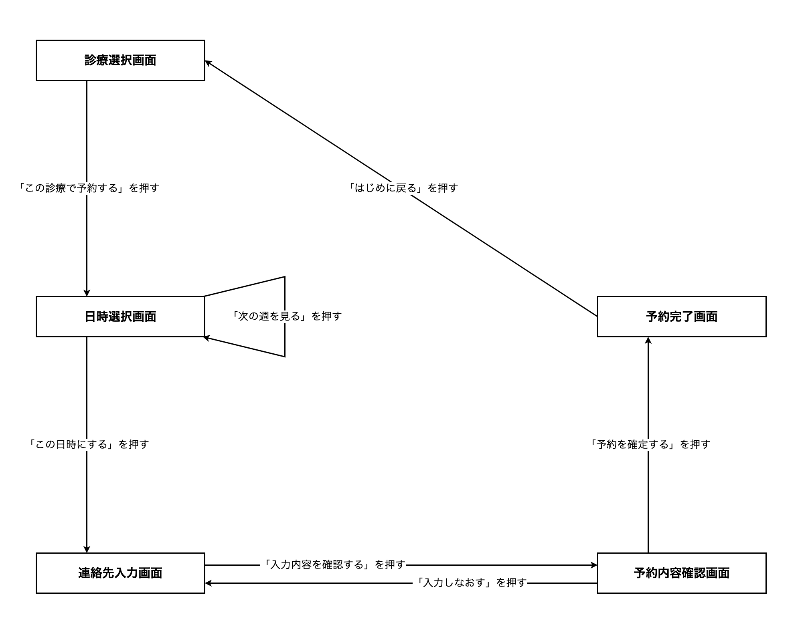
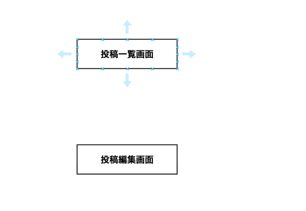
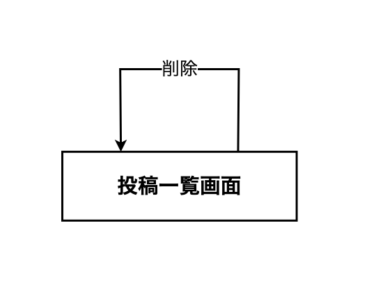
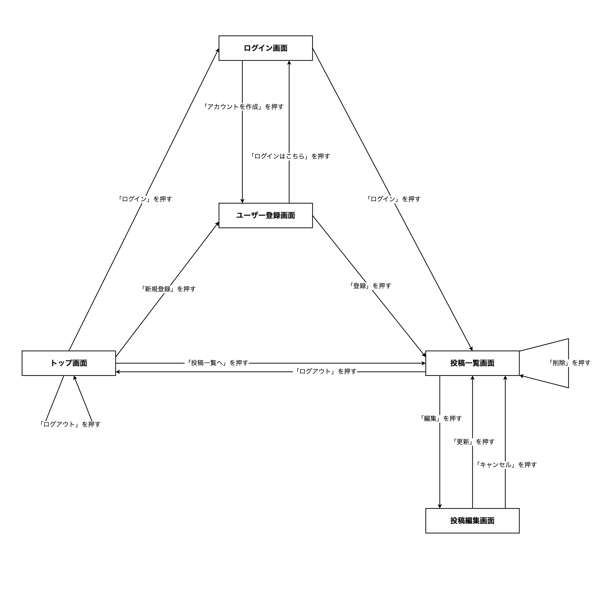

# 13-3-2: 画面遷移図

## 🎯 このセクションで学ぶこと

- 画面のつながりを、四角と矢印で1枚の図に描けるようになる。
- 矢印の向きが何を表しているかを説明できるようになる。
- 出ていく矢印が1本も無い画面を見つけられるようになる。

---

## 導入：つながりは、書かなければ人によって変わる

予約が終わったあと、利用者は次にどこへ行くのか。画面一覧を見ても、そこに答えはありません。画面が縦に並んでいるだけで、どれとどれがつながっているかは書かれていないからです。

書かれていないところは、作る人が埋めます。予約のあとに最初の画面へ戻るのか、予約の内容をもう一度見せるのかは、手を動かす人がその場で決めてしまいます。3人で分担すれば、3通りの行き先ができあがります。しかも、こうしたずれは画面を全部作り終えてから見つかります。1枚のファイルを直して済む話ではなく、つながりを引き直す作業になります。

画面遷移図は、そのつながりを1枚で表した図です。

---

## 画面遷移図の読み方

13-3-1で画面一覧を作った、歯科医院の予約アプリの画面遷移図です。

**歯科医院の予約アプリの画面遷移図**



四角が画面1枚で、中に画面名が入っています。矢印が画面の移動で、矢印に添えた文字が、その移動のきっかけになった操作です。

ここで大事なのが、🔑 **矢印の向きに意味がある**ことです。13-1-3では、引いた線の端に矢印が付いても付いたままで構わない、向きに意味があるかどうかは図を学ぶ章で説明する、と保留にしていました。ユースケース図の線は、誰がどれを使えるかを表すだけで、向きを持たない線でした。画面遷移図の矢印には向きがあり、根元が**移る前**の画面、先端が**移った後**の画面を表します。

向きがあるおかげで、この図からは「予約内容確認画面から連絡先入力画面へは戻れるが、予約完了画面から連絡先入力画面へは戻れない」ことまで読み取れます。向きのない線で描いてしまうと、この違いが消えます。

日時選択画面から出て、日時選択画面に戻ってくる矢印にも注目してください。「次の週を見る」を押しても、見えているのは同じ日時選択画面です。🔑 **画面が変わらない操作**も、こうして矢印を1本引いて残します。押しても何も起きないのか、それとも同じ画面のまま中身が変わるのかが、図の上で区別できるからです。

最後に、四角を1つずつ見てください。どの四角からも、次へ進む矢印か前へ戻る矢印が出ています。🔑 **出ていく矢印が1本も無い画面は、決め忘れ**です。利用者はその画面まで進めるのに、そこから先へ行く方法が決まっていません。実装した人は「戻るボタンでも付けておくか」と自分で埋めるか、何も付けずに終わらせます。図を描いて四角を指さして数えるだけで、この抜けはその場で見つかります。

---

## 画面遷移図の描き方

使う記号は次のとおりです。

| 記号 | 表すもの |
|:-----|:---------|
| 四角 | 画面1枚。中に画面名を書く |
| 矢印 | 画面が移ること。根元が移る前、先端が移った後 |
| 矢印に添えた文字 | 移るきっかけになった操作（押したボタン名やリンク名） |

四角の中に書くのは画面名だけで、`SC-01` などのIDは書きません。図がIDだらけになると、名前で意味をつかめなくなります。IDは表と本文で使います。ユースケース図の楕円にIDを書かなかったのと同じ扱いです。

矢印に添える文字は、実物のボタンやリンクの文字をそのまま書きます。「確定」と書かれたボタンを「送信」と書き換えると、実装する人が画面のどこを押す話なのか分からなくなります。

**描く手順**

1. 画面一覧の行数ぶん、四角を置いて画面名を入れます。最初に開く画面を、いちばん左（または上）に置きます。開始を表す黒丸のような記号は使いません。
2. ユースケース記述の基本フローを上からたどり、画面が移るところで矢印を引きます。
3. 引いた矢印に、きっかけになった操作の文字を入れます。
4. すべての四角を指さして、出ていく矢印があるかを確かめます。

**draw.ioでの操作**

四角の置き方と文字の入れ方は13-1-3のとおりです。この図では、次の操作を新しく使います（2026年8月時点）。

1つ目は、矢印を引く操作です。移る**元**の画面の縁にカーソルを合わせると、青い矢印と×印が出ます。その青い矢印からドラッグして、移る**先**の画面の上で離します。

**移る元の四角から、移る先の四角へドラッグする**



多くの場合、線の先端に矢印が付きます。付いていれば、それがそのまま移る向きになります。13-1-3では線の端の矢印を気にしなくてよいと書きましたが、ここからは向きが意味を持ちます。引いたあとに、矢印が付いているか、向きが合っているかを必ず確かめてください。逆向きに引いてしまったら、その線をクリックして選び、`Delete` キーを押して消してから引き直します。

2つ目は、同じ画面へ戻る矢印を引く操作です。同じようにドラッグして、**同じ四角の上で離します**。線がぐるりと回って、元の四角に戻る形になります。

**同じ四角の上で離すと、輪の形の矢印になる**



3つ目は、矢印に文字を入れる操作です。引いた矢印をダブルクリックすると、線の上に文字を入力できます。図形に文字を入れるときと同じ操作です。

---

## 🏃 描いてみよう

13-3-1で画面一覧を作った投稿アプリ（`post-app-practice`）の画面遷移図を描きます。

矢印を引くには、画面ごとに押せるところと、その行き先が要ります。押せるところは、`resources/views` の中のBladeファイルにある `<a>`（リンク）と `<button>`（ボタン）です。行き先のうち、Bladeを読むだけでは分からないものが3つあるので、先に出しておきます。

**ログインと新規登録が成功したあとの行き先**

```php
// config/fortify.php（抜粋）
    'home' => '/posts',
```

Fortifyの設定ファイルにある、この1行で決まっています。`/posts` は投稿一覧画面です。

**更新と削除が終わったあとの行き先**

```php
// app/Http/Controllers/PostController.php（抜粋）
    public function update(Request $request, Post $post)
    {
        // ... 入力チェックと書き換え ...

        return redirect()->route('posts.index');
    }
```

`destroy` も同じ `redirect()->route('posts.index')` で終わっています。`posts.index` は投稿一覧画面のルート名です。

**ログアウトしたあとの行き先**

こちらは、このリポジトリのどこにも書かれていません。ログイン周りの処理を受け持っているFortifyが、`/` に戻すよう決めています。つまりトップ画面です。

### Step 1: 押せるところを拾う

5つのBladeファイルを開き、`<a>` と `<button>` を探して、書かれている文字を書き出します。CSSの部分は読まなくて構いません。

`welcome.blade.php` は、`@auth` と `@else` で押せるところが入れ替わります。どちらの側にも押せるところがあるので、両方拾ってください。

### Step 2: 画面遷移図を描く

draw.ioで、四角5つを置いてから矢印を引きます。四角に入れる名前は、13-3-1で自分が付けた画面名を使ってください。

押したあとに同じ画面が映る操作が、このアプリには出てきます。専用の画面が無いからといって矢印を省かず、読み方で見た形で1本引いてください。

### Step 3: 保存してコミットする

draw.ioで `post-screen-flow.drawio` の名前で保存し、PNGも `post-screen-flow.png` の名前で書き出します。書き出した2つのファイルは、13-1-3のとおりに `docs/13-3/` へ移します。

移し忘れたままpushすると、GitHubで図が見られません。コミットの前に、`docs/13-3/` に3つのファイル（13-3-1の画面一覧と、今回の2つ）がそろっているかを確かめてください。

```bash
# アプリのフォルダで実行する
git add docs/13-3
git commit -m "13-3: 投稿アプリの画面遷移図を追加"
git push origin main
```

<details>
<summary>📖 描き終えたら開く（答え合わせ）</summary>

**投稿アプリの画面遷移図（解答例）**



矢印は13本です。押せるところを、画面ごとに並べると次のようになります。

| 画面 | 押せるところ | 行き先 |
|:-----|:-------------|:-------|
| トップ画面（ログイン前） | 「ログイン」・「新規登録」 | ログイン画面・ユーザー登録画面 |
| トップ画面（ログイン後） | 「投稿一覧へ」・「ログアウト」 | 投稿一覧画面・トップ画面 |
| ログイン画面 | 「ログイン」・「アカウントを作成」 | 投稿一覧画面・ユーザー登録画面 |
| ユーザー登録画面 | 「登録」・「ログインはこちら」 | 投稿一覧画面・ログイン画面 |
| 投稿一覧画面 | 「編集」・「削除」・「ログアウト」 | 投稿編集画面・投稿一覧画面・トップ画面 |
| 投稿編集画面 | 「更新」・「キャンセル」 | 投稿一覧画面・投稿一覧画面 |

次の観点で、自分の成果物と見比べてください。

- [ ] 四角が5つで、13-3-1の画面一覧と同じ画面名が入っている
- [ ] 矢印の向きが、移る前の画面から移った後の画面へ向いている
- [ ] すべての矢印に、押したボタンやリンクの文字が添えられている
- [ ] 「削除」と、トップ画面の「ログアウト」が、同じ画面へ戻る矢印になっている
- [ ] 「更新」と「キャンセル」が、2本の矢印に分かれている
- [ ] 出ていく矢印が1本も無い画面がない

設計に唯一の正解はありません。四角の置き方や矢印の曲がり方が解答例と違っていても、上の観点を満たしていれば合格です。そのうえで、判断が分かれやすい3点を補足します。

- **「更新」と「キャンセル」を2本の矢印に分けた理由**: どちらも投稿一覧画面へ移るので、1本にまとめたくなります。しかし、行き先が同じでもきっかけが違うと、その先の設計が変わります。「更新」は書き換えを保存してから移る操作で、「キャンセル」は保存せずに移る操作です。1本にまとめると、この違いが図から消えます。
- **トップ画面の「ログアウト」を、同じ画面へ戻る矢印にした理由**: ログアウトの行き先が `/` なので、押す前も押した後もトップ画面です。映る中身は入れ替わりますが、画面は同じです。13-3-1でトップ画面を1行にまとめた判断と、この矢印はつながっています。2行に分けた方は、ログイン後のトップ画面からログイン前のトップ画面へ向かう矢印になります。
- **「削除」を、同じ画面へ戻る矢印にした理由**: 削除には専用の画面がなく、押したあとに映るのも同じ投稿一覧画面だからです。画面が増えない操作でも矢印を1本引いておくと、「本当に削除しますかと確認する画面を挟むかどうか」を、あとで決めそこねません。

</details>

---

## 💡 よくある間違いと現場での使われ方

**よくある間違い: 処理を四角にする**

「投稿を保存する」「投稿を削除する」を四角にしてしまう間違いです。四角にするのは、利用者の目に映るものだけです。保存や削除は矢印の途中で起きていることなので、矢印に添える操作の文字として現れます。ルート定義を上から数えて四角を置くと、この間違いが起きます。投稿アプリのルートは5本ありますが、画面は5枚ではありません。

現場では、画面遷移図は依頼者との打ち合わせで「この流れで操作していただく形でよいですか」という**道順の合意**に使います。文章で「予約後は最初の画面に戻ります」と書いても読み飛ばされますが、矢印が1本足りない図は、依頼者でも指さして気づけます。

---

## ✨ まとめ

- 画面遷移図は、四角・矢印・矢印に添えた文字の3つで描きます。四角の中には画面名だけを書き、IDは書きません。
- 矢印には向きがあり、根元と先端で、移る前と移った後を区別します。ユースケース図の線と違い、向きが意味を持ちます。
- 画面が変わらない操作も、同じ画面へ戻る矢印として1本残します。何も起きないのか、中身だけが変わるのかを区別するためです。
- 出ていく矢印が1本も無い画面は、そこから先が決まっていない印です。四角を指さして数えれば見つかります。
- 行き先が同じでも、きっかけが違う移動は別の矢印にします。保存して移るのか、保存せずに移るのかは、その先の設計が変わります。

---
