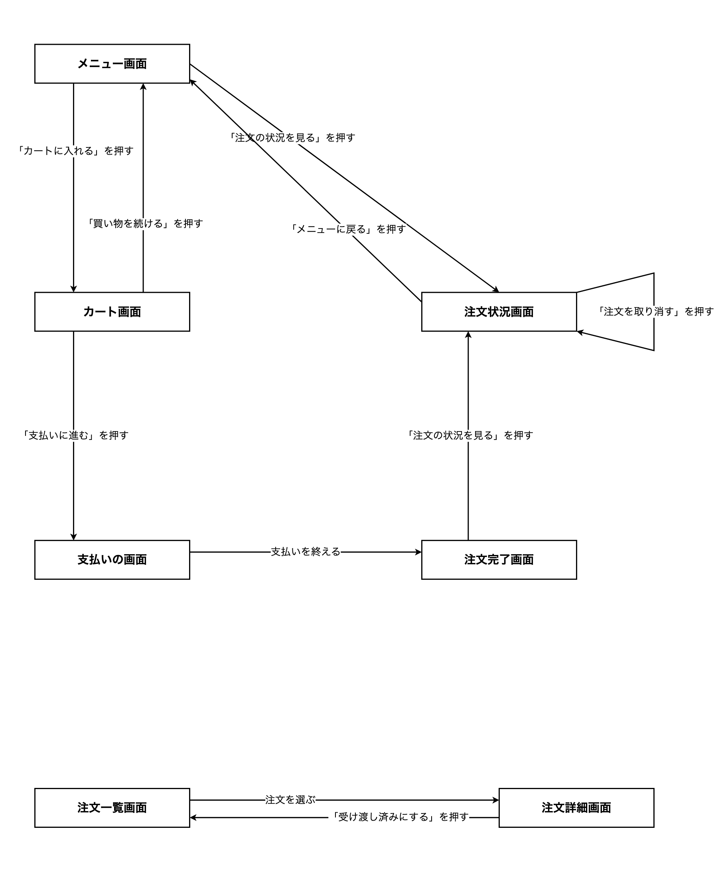
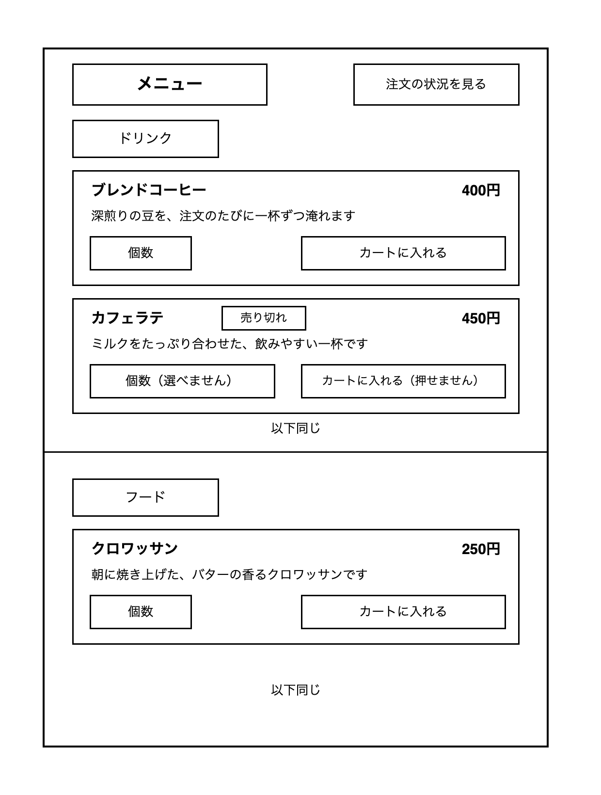

# 13-3-5: 画面設計 - 設計演習

## 📌 この演習について

Chapter 3で作り方を学んだ設計書を、カフェのモバイルオーダーアプリで白紙から作ります。13-2-3で「誰が、何をできるか」までは決まりました。それを何枚の画面で見せ、どうつなぎ、何を入力してもらうのかを、ここで決めます。

13-2-3の成果物が手元にない方は、`answers/13-2/` の中身を `docs/13-2/` にコピーしてから始めてください。

---

## 🎯 演習課題

### 📋 与えられる仕様

新しい仕様は渡されません。使うのは、13-2-3で受け取ったカフェのモバイルオーダーアプリの仕様書と、そこで自分が作った機能一覧・確認事項リスト・ユースケース図・ユースケース記述です。手元に無い方は、13-2-3の模範解答を土台にして構いません。ただし、自分の解答と模範解答のどちらを土台にするかを最初に決めて、最後までそちらで通してください。途中で混ぜると、機能とユースケースの数が合わなくなります。

画面を考えるときに何度も戻ることになる箇所だけ、仕様書から引いておきます。

> お客さまには、まずその日のドリンクとフードの一覧を見ていただきたいです。商品の名前と値段と、短い説明が並んでいれば十分です。飲みたいものが決まったら、商品と個数を選んで、そのままアプリの中で支払いまで済ませられるようにしてください。

> 私たち店員の側の話もさせてください。カウンターの中にタブレットを1台置いて、入った注文をそこで見られるようにしたいです。商品ができてお客さまにお渡ししたら、その場で「渡しました」と記録できると助かります。今は紙の伝票を手で仕分けていて、渡し忘れが起きることがあります。

支払いについて、1つだけ前提を足します。この演習では、**支払いそのものは外部の決済サービスに任せる**前提で進めます。皆さんが設計するのは、支払いを依頼して、その結果を受け取るところまでです。どのサービスを使うか、どうつなぐかは、この教材では扱いません。外部の決済サービスは、13-2-2で学んだとおり本来はアクターとして図に描く相手ですが、つなぎ方まで扱わないので、Chapter 2で描いたユースケース図はそのままにします。

13-2-3で書き出した確認事項（模範解答ではQ-01からQ-06）は、**未確認のまま**です。返事を待たずに、そこに書いた自分の想定の上で設計を進めてください。新しく決めきれない点が出てきたら、自分のリストの最後の番号の続きから書き足します（模範解答を土台にした方は `Q-07` からです）。新しいファイルは作らず、13-2-3で作った確認事項リストに行を足してください。

### ✏️ 作成する成果物

保存先は、13-3-1で作った `docs/13-3/` フォルダです。ファイル名の先頭は `cafe-` を付けます。

1. 画面一覧。`ID`・`画面名`・`役割`・`主な利用者` の4列のMarkdown表で、IDは `SC-01` から振ります。
2. 画面遷移図。draw.ioで描き、`.drawio` ファイルとPNG画像の2つを残します。
3. ワイヤーフレーム。**メニュー画面の1枚だけ**を描き、`.drawio` ファイルとPNG画像の2つを残します。
4. 画面項目定義。ワイヤーフレームを描いたメニュー画面の分だけ、`項目名`・`種類`・`必須`・`内容` の4列で作ります。
5. 入力チェック表。ワイヤーフレームを描いていない画面も含めて、利用者が値を入れるところがある画面ぶんを作ります。`画面`・`項目`・`必須`・`文字数・桁数`・`形式・値の範囲`・`ほかの項目との関係` の6列で作り、表の下に、自分で決めた数字の理由を1〜2行添えます。
6. メッセージ一覧。`画面`・`出る場面`・`区分`・`メッセージ` の4列で作ります。

ワイヤーフレームを1枚に絞るのは、練習として同じ作業を繰り返さないためです。実際の仕事では、画面一覧に並べた全部の画面ぶんを作ります。

### ✅ セルフチェック

- [ ] 13-2-3で作った機能一覧のすべての機能が、どれかの画面に現れている
- [ ] 画面一覧のどの行にも、その画面が何のためにあるのかが書かれている
- [ ] 最初に開く画面がどれか分かるようになっている
- [ ] 画面名が「〜画面」でそろっていて、仕様書と自分のユースケース記述に出てくる言葉を使っている（模範解答を土台にしたなら、仕様書の「お客さま」「店員」「商品」「個数」「注文」と、記述の「注文番号」「合計金額」）
- [ ] 商品を注文するユースケースの基本フローの各行が、画面遷移図のどの矢印に当たるかを指させる
- [ ] 矢印に、その移動のきっかけになった操作が書かれている
- [ ] お客さまが使う画面と、店員が使う画面が分かれている
- [ ] 出ていく矢印が1本も無い画面がない
- [ ] ワイヤーフレームに、その画面で見せる項目と入力する項目の両方が置かれている
- [ ] 画面項目定義のすべての行に種類が書かれていて、入力と選択の行には必須か任意かも書かれている
- [ ] 画面一覧のすべての画面について、利用者が値を入れるところがあるかを確かめ、あった入力欄すべてを入力チェック表に載せている
- [ ] 入力チェック表で自分が決めた数字に、そう決めた理由が添えられている
- [ ] メッセージ一覧のどの行も、どの画面のどんな場面で出るかが分かる
- [ ] 決めきれなかった点を、勝手に決めずに確認事項リストの続きの番号へ書き足している
- [ ] **この設計書を初めて見た人が、質問せずに実装へ進めそうか**

> 💡 **合格基準**: 設計書のゴールは「それを見たら、人でもAIでもすぐ実装に入れる状態」です。答えられない質問が残っていそうなら、そこが設計の穴です。

> 🚀 **ここから先は、自分の力で作ってみましょう！**

---

## 💡 ヒント

手が止まったときの戻り先は決まっています。画面の数え方は13-3-1、画面遷移図は13-3-2、ワイヤーフレームと画面項目定義は13-3-3、入力チェック表とメッセージ一覧は13-3-4、draw.ioの操作は13-1-3です。

支払いの画面に何を置くかで手が止まったら、それは正しい止まり方です。外部の決済サービスに任せる前提だけでは、この画面に入力欄が要るかどうかまでは決まりません。決めずに、想定を添えて確認事項リストへ回してください。

---

## 🏃 実践

### 🧠 先輩エンジニアの思考プロセス

先輩エンジニアは、機能設計の成果物を次の順で画面へ落とし込みます：

| Step | やること | 説明 |
|:-----|:---------|:-----|
| 1 | ユースケースを1本ずつたどり、画面が変わるところに印を付ける | 手元にあるのはChapter 2の成果物だけ。画面はそこから起こすしかない |
| 2 | 画面に名前を付けて、画面一覧に並べる | 名前が決まらないと、図の四角にも表の行にも書けない |
| 3 | 最初に開く画面を決める | 入口が決まらないと、図がどこからも始まらない |
| 4 | 画面遷移図を描く | 画面が出そろってから引く。描きながら画面を足すと、一覧と図がずれる |
| 5 | 1枚を選んで、ワイヤーフレームと画面項目定義を作る | 画面の役割が決まってからでないと、中に何を置くかは決められない |
| 6 | 入力欄について、受け付ける範囲と出す文言を決める | どこに入力欄があるかが決まってはじめて、受け付ける範囲を決められる |

### 📝 ステップバイステップで描く

#### Step 1: ユースケースをたどって、画面の切れ目に印を付ける

13-2-3で洗い出したユースケースを、自分の一覧から順に見ていきます（模範解答では5本でした）。商品を注文するものと、注文を受け渡すものは記述まで書いてあるので、基本フローをそのままたどれます。記述を書いていないユースケースは、頭の中で操作の流れを通してみてください。

メニューを見るユースケースは、注文を始める画面と同じ1枚で足りるかもしれません。注文状況を確認するものと、注文を取り消すものは、同じ画面で済むのか、分けるのかを考えます。

#### Step 2: 画面に名前を付けて、画面一覧に並べる

`ID`・`画面名`・`役割`・`主な利用者` の4列で表を作り、`SC-01` から順にIDを振ります。主な利用者の欄は「お客さま」と「店員」の2つになります。

お客さまの画面と店員の画面は、続けて並べずに、利用者ごとにまとめて並べると読みやすくなります。

#### Step 3: 最初に開く画面を決める

利用者が2種類いるので、それぞれに1つずつ決めます。お客さまがアプリを開いたときに最初に見える画面と、店員がタブレットで最初に見る画面です。役割の欄に「最初に開く画面」と書き添えます。

#### Step 4: 画面遷移図を描く

draw.ioで、四角と矢印を使って描きます。矢印に添える文字は、13-2-3のユースケース記述に出てくる操作の言葉をそのまま使ってください。模範解答なら、「カートに入れる」「支払いに進む」「受け渡し済みにする」の3つが記述の中で決まっています。

記述に出てこない矢印のほうが多くなります。それらは、自分がその画面に置くつもりのボタンやリンクの文字を、ここで決めて書きます。押すものが無い移動（支払いが終わって次の画面へ移る、など）は、ボタン名の代わりに「支払いを終える」のように、きっかけになった出来事を書きます。

#### Step 5: メニュー画面のワイヤーフレームと画面項目定義を作る

メニュー画面には、その日のドリンクとフードが並びます。商品ごとに何を見せるのかは、仕様書に3つ書かれています。同じ形の行が繰り返す部分なので、13-3-3で学んだとおり、2〜3行だけ描いて「以下同じ」と書きます。

売り切れの商品をどう見せるかも、ここで形にします。売り切れの扱いについて13-2-3で自分が書いた想定を、そのまま図と表に落とし込んでください（模範解答では、Q-03の「メニューには表示したうえで注文できないようにする」という想定がこれに当たります）。想定を書いていなければ、ここで1行決めて確認事項リストに足してから進めます。押せないことや選べないことは、色や点線ではなく、四角の中に「売り切れ」「押せません」「選べません」と文字で書いて表します。データとしてどう持つかはChapter 5で決めるので、ここでは見せ方だけを決めます。

#### Step 6: 入力チェック表とメッセージ一覧を作り、保存する

画面項目定義の入力と選択の行を引き継いで、入力チェック表を作ります。ワイヤーフレームを描いていない画面は、画面一覧を上から1行ずつ見て、「この画面で利用者が値を入れるところはあるか」を確かめてください。あるものだけ、その画面名と項目を1行にします。たとえば会員登録をしない想定に沿うなら、注文の状況を確かめる画面では、お客さまに注文番号を打ち込んでもらうことになります。店員の側でも、お客さまから伝えられた注文番号で注文を探す想定（模範解答ではQ-06）なら、注文の一覧に番号を打ち込む欄が要ります。模範解答では、これを入れて3行になりました。

メッセージ一覧には、13-2-3で書いた代替フローが効いてきます。模範解答なら、UC-02の「支払いが完了しなかった場合」と、UC-05の「伝えられた注文番号が一覧にない場合」の2つです。記述に書いた分岐は、そのまま画面に出す文言になります。

決めきれなかったことを確認事項リストに書き足したら、`docs/13-3/` に8つのファイルを保存します。

```text
docs/13-3/
├── cafe-screen-list.md      # 画面一覧
├── cafe-screen-flow.drawio  # 画面遷移図（編集用）
├── cafe-screen-flow.png     # 画面遷移図（表示用）
├── cafe-wireframe.drawio    # ワイヤーフレーム（編集用）
├── cafe-wireframe.png       # ワイヤーフレーム（表示用）
├── cafe-screen-items.md     # 画面項目定義
├── cafe-input-check.md      # 入力チェック表
└── cafe-messages.md         # メッセージ一覧
```

確認事項リストは `docs/13-2/cafe-questions.md` を書き足すので、コミットには両方のフォルダを含めます。

```bash
# アプリのフォルダで実行する
git add docs/13-2 docs/13-3
git commit -m "13-3: カフェのモバイルオーダーアプリの画面設計を追加"
git push origin main
```

---

## 📖 模範解答

<details>
<summary>📖 作り終えたら開く（模範解答）</summary>

**画面一覧（解答例）**

| ID | 画面名 | 役割 | 主な利用者 |
|:---|:-------|:-----|:-----------|
| SC-01 | メニュー画面 | その日のドリンクとフードを一覧で見せ、商品と個数を選ぶ（最初に開く画面） | お客さま |
| SC-02 | カート画面 | 選んだ商品と個数、合計金額を確かめる | お客さま |
| SC-03 | 支払いの画面 | 外部の決済サービスに支払いを依頼し、その結果を受け取る | お客さま |
| SC-04 | 注文完了画面 | 注文を受け付けたことと、注文番号を知らせる | お客さま |
| SC-05 | 注文状況画面 | 注文番号で、注文がお店に届いているかを確かめ、取り消す | お客さま |
| SC-06 | 注文一覧画面 | 受け取り前の注文を、注文番号とともに一覧で見る（最初に開く画面） | 店員 |
| SC-07 | 注文詳細画面 | 選んだ注文の商品と個数を見て、受け渡し済みにする | 店員 |

**画面遷移図（解答例）**



お客さま側の5枚と、店員側の2枚は、線でつながっていません。同じアプリの中に、行き来しない2つのかたまりがある形です。お客さまはご自分のスマートフォン、店員はカウンターの中のタブレットと、使う端末が別だからです。つながっていない図を見て「描き忘れではないか」と考えたなら、その見方は正しいので、つながらない理由を設計書に1文書いておきます。

支払いの画面から注文完了画面へ移る矢印には、押すもののボタンの文字が書けません。支払いの手続きは外部の決済サービスに任せるので、こちら側で文字を決められないからです。Step 4のとおり、代わりにきっかけになった出来事を書いてあります。

**メニュー画面のワイヤーフレーム（解答例）**

売り切れの商品の「個数」と「カートに入れる」の四角の中に、選べないことと押せないことを文字で書いてあります。Step 5のとおり、線と文字はほかの行と同じままです。



**メニュー画面の画面項目定義（解答例）**

| 項目名 | 種類 | 必須 | 内容 |
|:-------|:-----|:-----|:-----|
| 画面見出し | 表示 | - | 「メニュー」 |
| 区分の見出し | 表示 | - | 「ドリンク」「フード」 |
| 商品名 | 表示 | - | その日に出す商品の名前 |
| 値段 | 表示 | - | その商品の値段 |
| 短い説明 | 表示 | - | その商品の短い説明 |
| 売り切れの表示 | 表示 | - | 売り切れの商品にだけ「売り切れ」と出す |
| 個数 | 選択 | 必須 | 注文する個数。売り切れの商品では選べない |
| カートに入れるボタン | ボタン | - | 押すとカート画面へ移る。売り切れの商品では押せない |
| 注文の状況を見るリンク | リンク | - | 押すと注文状況画面へ移る |

**入力チェック表（解答例）**

| 画面 | 項目 | 必須 | 文字数・桁数 | 形式・値の範囲 | ほかの項目との関係 |
|:-----|:-----|:-----|:-------------|:---------------|:-------------------|
| メニュー画面 | 個数 | 必須 | - | 1以上の整数。1つの商品あたり10個まで | - |
| 注文状況画面 | 注文番号 | 必須 | 6桁 | 半角数字のみ | - |
| 注文一覧画面 | 注文番号 | 任意 | 6桁 | 半角数字のみ | - |

3行しかありません。このアプリで値を入れてもらう場面が、個数を選ぶところと、注文番号を打つところしかないためです。行が少ないこと自体は問題ではありません。支払いの画面については、このあとの確認事項リストに足したQ-07のとおり未確認のまま残しています。

**決めた理由（解答例）**

> 個数の上限10個は、1人のお客さまが店頭で受け取れる量として決めました。注文番号の6桁は、1日の注文が多くても数百件と見込んだうえで、口頭で伝えやすい長さにしています。どちらも仕様書には書かれていない決めごとなので、確認事項リストにも出しておきます。

**メッセージ一覧（解答例）**

| 画面 | 出る場面 | 区分 | メッセージ |
|:-----|:---------|:-----|:-----------|
| メニュー画面 | 個数を選ばずに「カートに入れる」を押した | エラー | 個数を選んでください |
| メニュー画面 | 売り切れの商品をカートに入れようとした | エラー | この商品は売り切れです |
| 支払いの画面 | 支払いが完了しなかった | エラー | 支払いが完了しませんでした。もう一度お試しください |
| 注文完了画面 | 注文が登録された | 完了 | ご注文を承りました |
| 注文状況画面 | 入力された注文番号の注文が見つからない | エラー | ご入力の注文番号の注文が見つかりません |
| 注文一覧画面 | 伝えられた注文番号が一覧にない | エラー | 該当する注文がありません |

3行目はUC-02の代替フロー5a、6行目はUC-05の代替フロー3aと対応しています。記述を書くときに分岐を1つ書き落としていれば、ここで文言が1つ足りなくなり、画面のどこかに「何も起きない」場面が残ります。

個数の上限10個には、対応する文言がありません。個数は候補から選ぶ形にしたので、11個以上はそもそも選べないからです。画面の作りだけで守られる決めごとに当たります。

2行目の売り切れの文言は、同じ理屈で消えそうに見えますが、残しています。売り切れの商品では「カートに入れる」を押せない作りにしましたが、メニュー画面を開いてから押すまでの間に売り切れることがあるからです。押せないはずの操作でも、受け取る側で気づいたときに出す文言は決めておきます。

**確認事項リストへの追記（解答例）**

| ID | 確認したいこと（こちらの想定つき） | 関係する機能 | 状態 |
|:---|:-----------------------------------|:-------------|:-----|
| Q-07 | 支払いは外部の決済サービスにお任せし、このアプリの画面ではカード番号などを入力していただかない想定です。アプリの画面で入力していただく必要はありますか | F-02 | 未確認 |
| Q-08 | 1つの商品あたりの個数は10個までとする想定ですが、それ以上のご注文をお受けする必要はありますか | F-02 | 未確認 |
| Q-09 | 注文番号は6桁の数字とする想定ですが、桁数のご希望はありますか | F-02・F-03・F-05 | 未確認 |

**迷いやすいところ**

**注文状況画面の入口を2か所にした理由**

会員登録をせずに注文し、注文番号で状況を確認する、という想定を置きました。会員がいないので、注文の履歴を並べる画面は作れません。注文番号を入力して開く形になるため、入口をメニュー画面と注文完了画面の2か所に置いてあります。

ここは**想定への返事しだいで、画面一覧そのものが変わる**ところです。会員登録をする前提になれば、ログイン画面と注文履歴画面が増え、この2か所の入口も要らなくなります。画面の枚数は、こういう1つの想定で動きます。

</details>

---

## 🚀 まとめ

- 画面は、ユースケースの流れをたどって数えます。手元にChapter 2の成果物しか無いところから始めるので、そこから起こすしかありません。
- 画面名は、仕様書と自分のユースケース記述にすでに出てくる言葉をそのまま使います。模範解答を土台にしたなら、メニュー画面・支払いの画面・注文一覧画面の3つが、記述の中で決まっていました。
- 使う人が2種類いるアプリでは、画面遷移図が2つのかたまりに分かれることがあります。つながらない理由を1文添えておけば、描き忘れと区別できます。
- ユースケース記述に書いた代替フローのうち、入力に関するものは、そのままメッセージ一覧の行になります。設計書どうしがつながっていることを、ここで確かめられます。
- 画面設計まで進むと、Chapter 2では見えなかった決めごとが新しく出てきます。それも想定を添えて確認事項リストへ送ります。

確認事項リストには、返事を待っている行が9つ並んだままです。誰がどの画面を開いてよいかは、13-4-2で権限マトリクスとして表にします。

---
