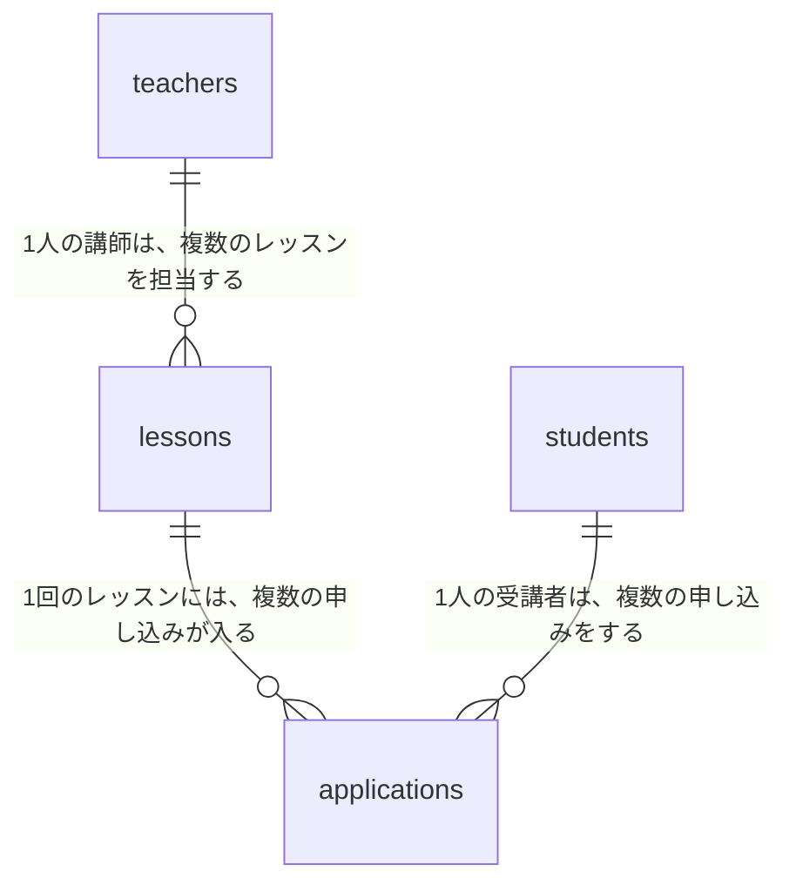
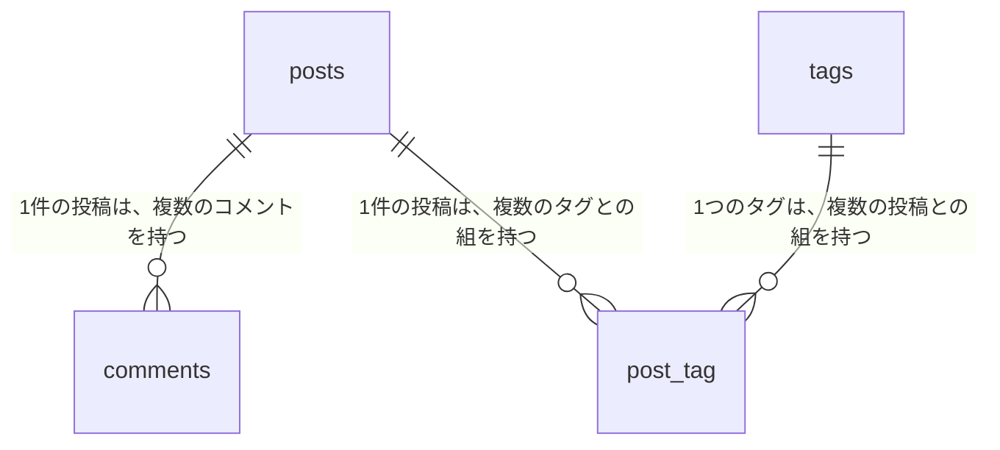

# 13-5-2: ER図と正規化

## 🎯 このセクションで学ぶこと

- 13-5-1で作った概念モデルをER図に起こし、draw.ioで自分の手で描けるようになる。
- 描いた設計が第3正規形になっているかを、3つの問いで点検できるようになる。
- あえて重複を持たせる判断があることを知り、その理由を書き残せるようになる。

---

## 導入：表を上下に往復しないと、つながりが追えない

13-5-1で作った関係の一覧は、つながりを1行ずつ言葉にした表でした。行が3本のうちは読めますが、エンティティが増えて行が8本、10本になると、「レッスンにつながっているのはどれとどれか」を知るために、表を上から下まで何度も往復することになります。同じ内容を1枚に置き直して、目で追えるようにしたのがER図です。

ER図は、この教材で唯一、すでに一度学んでいる図です。8-1-5「データベース設計の基礎」で読み方を学び、8-1-6「データベースの基礎 - ハンズオン演習」では、正規化されていない注文管理テーブルを分割して、紙にER図を描きました。13-1-2で予告したとおり、Chapter 5はそこで身につけた読む力を土台にして、今度は自分で描けるところまで進みます。

このセクションで、もう1つ向きが変わります。8-1-5と8-1-6は、**すでにある表を、あとから正規化する**練習でした。今回は逆で、13-5-1で作った概念モデルを素直に図にすると、たいていの場合は最初から第3正規形になっています。あとから直すのではなく、🔑 **自分の設計が正規形になっているかを、自分で点検する**のがこのセクションの向きです。

そして、このセクションが13-5-1と13-5-3の橋になります。ここで初めて、日本語の「レッスン」が英語の `lessons` に変わります。名前の付け方そのものは13-5-3で扱うので、ここでは英語の名前を使うことだけ覚えておいてください。

---

## ER図の読み方

13-5-1で読んだ料理教室の受講管理アプリの続きです。あの2つの表を、そのままER図にすると次のようになります。



四角が1つのテーブルで、中に英語のテーブル名が入っています。四角は4つあり、13-5-1のエンティティ一覧の4行と1対1で対応しています。🔑 **エンティティ一覧の行は、すべて四角として図に現れます**。図に出ていない行があれば、どちらかを書いたあとに、もう片方を直し忘れています。

線は、テーブルどうしの関係です。線に添えた文は、13-5-1の関係の一覧の「読み方」の欄に書いたものと同じです。表の3行が、そのまま3本の線になっています。線の端が枝分かれしている側が「多」、1本のままの側が「1」です。

線に**向きが無い**ことにも気づいてください。13-3-1で描いた画面遷移図では、矢印の根元が移る前の画面、先端が移った後の画面という意味を持っていました。ER図の線は、そういう向きを持ちません。どちらが1でどちらが多いかを表しているだけです。

もう1つ、この図から読み取れることがあります。**外部キーをどちらのテーブルに持たせるか**です。`lessons` は `teachers` に対して「多」の側なので、どのレッスンがどの講師のものかを覚えておくのは `lessons` の側です。線の「多」の側が、相手を指す列を持ちます。実際にその列を書き出すのは、次の13-5-3です。

> 💡 **TIP**: 8-1-5では、顧客・注文・注文明細・商品の4つからなるER図を読みました。あの図は四角の中にカラムまで並んでいましたが、この章の図にはテーブル名しかありません。なお、1件の注文の中に複数の商品が入るというあの形は、買い物を扱うシステムでくり返し出てきます。この先の演習でよく似た図になっても、写したわけではありません。

---

## ER図の描き方

使う記号は3つだけです。

| 記号 | 表すもの |
|:-----|:---------|
| 四角 | テーブル1つ。中に英語のテーブル名を書く |
| 線 | テーブルどうしの関係 |
| 線に添えた文字 | どちらの端が1件で、どちらが複数件か |

四角の中に書くのは、テーブル名だけです。カラム名も型も書きません。13-3-1で画面遷移図の四角にIDを書かなかったのと同じで、図に情報を詰めるほど、見たいものが見えなくなります。この図はつながり方を見るためのもので、カラムを書き出すのは13-5-3のテーブル定義書です。

**描く手順**

1. エンティティ一覧の行数ぶん、四角を置きます。中には英語のテーブル名を入れます。日本語のエンティティ名を英語にして複数形にしたものですが、付け方は13-5-3で決めるので、ここでは手を止めずに置いてください。英単語が出てこないときは、辞書や翻訳ツールで調べて構いません。AIに「レッスンは英語で何と言いますか」と聞くのも、言葉についての質問なので問題ありません（AIに作らせてはいけないのは、成果物そのものです）。9-5-5の `posts`・`comments`・`tags` のように、これまでに見たテーブル名をまねるのも近道です。
2. 関係の一覧の行数ぶん、線を引きます。**「1」の側の四角を左（または上）に置く**と、図と表の並びが揃って読みやすくなります。
3. 引いた線に、13-5-1の関係の一覧の「読み方」の欄の1文を、そのまま書き入れます。この1文には、両端の四角が何なのかと、1件なのか複数件なのかが両方入っているので、文字を線の真ん中に置いても、どちらの端が1件かが読み取れます。文が長くて図が読みにくいときは、「1回のレッスンに、複数の申し込み」のように短くしても構いません。ただし、`1対多` とだけ書くのは避けてください。それでは、どちらの四角が1件の側なのかが図から消えます。多対多の行の線は、次の手順で引き直します。
4. 多対多の行があれば、その2つの四角の間に、つなぎ役の四角を1つ置きます。そして、両側へ1対多の線を2本引き直します。8-3-3で学んだとおり、多対多の関係は2つの1対多に分けて表します。線に書く文も、つなぎ役を相手にした形に書き直します。

引き直した2本に、もとの1文をそのまま分けて書くことはできません。もとの1文は、2つの四角が直接つながっている前提で書かれているからです。13-5-1で見た、1回のレッスンを複数の講師で担当する場合なら、つなぎ役を挟んだ2本には「1人の講師は、複数のレッスンとの組を持つ」「1回のレッスンは、複数の講師との組を持つ」と書きます。「〜との組」という言い方で、線の相手がつなぎ役であることが読み取れます。

手順4でつなぎ役として置いた四角も、テーブル1つとして数えます。13-5-1のエンティティ一覧には行がありませんが、図には四角として現れます。多対多の行1つにつき、四角が1つ、線が1本増えます。

**draw.ioでの操作**

新しく覚える操作はありません。四角を置いて文字を入れるのと、四角どうしを線でつなぐのは13-1-3、その線に文字を入れるのは13-3-1で学んだとおりです。引いた線の端に矢印が付くことがありますが、ER図の線は向きを持たないので、付いたままで構いません。

ただし、教材に載せた図と、皆さんがdraw.ioで描く図は、見た目が少し違います。教材の図は線の端が枝分かれした形になっていて、これはIE記法という書き方の決まりです。draw.ioで同じ形を出すには設定を変える必要があるので、この教材では**線に文字で書く**形にします。線の端の記号ではなく文字で読ませるのは、8-1-6で紙に描いたときと同じです。

---

## 並べた属性を点検する

点検にかけるのは、図ではなく、13-5-1で並べた属性です。エンティティごとに、属性を上から見ていきます。かけるのは図を描き終えたあとで構いませんが、エンティティを分けている最中に気づいたときは、その場でかけてください。

点検の前に、主キーについて1つ決めておきます。この教材では、どのテーブルにも1件ずつ区別するための `id` を1本だけ置きます（表に書き出すのは13-5-3です）。主キーが1列だけなら、下の2つ目の問いに引っかかることはありません。2つ目が効いてくるのは、注文IDと商品IDの組のように、2つの列の組で1件を区別しているときだけです。

問いは3つです。

| 問い | 通らなかったときの直し方 |
|:-----|:-------------------------|
| 1つのマスに2つ以上の値を入れようとしていないか | 値の数だけ行が増えるように、エンティティを分ける |
| 主キーの一部だけで決まる属性が混ざっていないか | その一部で決まるものを、別のエンティティへ出す |
| 主キー以外の属性で決まる属性が混ざっていないか | 決めているほうの属性ごと、別のエンティティへ出す |

3つの問いは、8-1-5で学んだ第1正規形・第2正規形・第3正規形に、上から順に対応しています。正規形の中身は8-1-5のとおりなので、ここでは点検の道具として使うだけです。

料理教室の「申し込み」を、次のように書いていたとします。

| エンティティ | 主な属性 |
|:-------------|:---------|
| 申し込み | 申し込んだ日時・支払いが済んでいるか・レッスンの題名・講師の名前 |

3つ目の問いで落ちます。「レッスンの題名」は、その申し込みがどのレッスンのものかが決まれば決まります。「講師の名前」も、レッスンをたどればその先で決まります。どちらも、申し込みそのものが決めている属性ではありません。8-1-5で見た、社員から所属部署をたどって部署名にたどり着く形と同じです。

そのまま作ると、レッスンの題名を書き換えたときに、そのレッスンへの申し込み全部を書き換えることになります。1件でも直し忘れれば、同じレッスンの題名が2通り残ります。直し方は、この2つの属性を申し込みから外すことです。外しても、`applications` から `lessons` へ線がつながっているので、題名も講師の名前もたどれます。

### あえて重複を持たせる判断

正規化は目的ではなく、道具です。あえて崩したほうがよい場面があります。

料理教室の相談には出てきませんでしたが、あとから「申し込みの一覧に、そのときお支払いいただいた金額も出したい」と言われたとします。レッスンに受講料の属性を足せば、金額はたどれます。ところが、来月から受講料を上げると、**先月ぶんの申し込みの金額まで変わってしまいます**。過去にいくら受け取ったのかが、記録として残りません。

そこで、申し込みのほうにも「支払った金額」を持たせます。レッスンと申し込みの2か所に同じ数字が並ぶので、重複をなくすという正規化の考え方からは外れる形です。それでもこちらを選ぶのは、🔑 **申し込んだ時点の金額を、動かないものとして残す**ためです。

この判断をしたときは、必ず理由を書き残してください。理由が書かれていないと、あとから設計書を読んだ人が「正規化のし忘れだ」と考えて、親切心で外してしまいます。外された瞬間に、過去の金額は動き始めます。

---

## 🏃 描いてみよう

> 🔥 この演習では、設計書をAIに作らせずに、自分の手で書きましょう。記法や考え方についてAIに質問するのは構いませんが、成果物を生成させるのはTutorial 14までお預けです。まず自分の手と頭で書けるようになった人だけが、AIの作った設計を正しく評価できるようになります。

13-5-1で作ったブログシステムの概念モデルを、ER図に起こします。題材は同じ、9-5-5「リレーション - ハンズオン演習」で作ったブログシステム（`relation-app-practice`）です。

### Step 1: 英語のテーブル名を確かめる

このアプリのテーブル名は、自分で書いたマイグレーションの中にあります。`~/laravel-practice/9-5-5_hands-on/relation-app-practice/` をVS Codeで開き、`database/migrations/` に並んでいるファイルの `Schema::create()` の1つ目の引数を見てください。パソコンに残っていない方は、9-5-5でpushした `relation-app-practice` リポジトリをGitHubのページで開けば、同じファイルを読めます。今回もコードを読むだけなので、Dockerは起動しなくて構いません。

同じファイルで、`foreignId()` と書かれている行も見ておいてください。どのテーブルが、どのテーブルを指す列を持っているかが分かります。

### Step 2: ER図を描く

「ER図の描き方」の手順1から4のとおりに進めます。13-5-1で作った関係の一覧に多対多の行が1つあるので、手順4を使うことになります。

### Step 3: 3つの問いで点検する

「並べた属性を点検する」の3つの問いを、13-5-1で書いた属性にかけます。2つ目の問いは、主キーを `id` の1列にするので当てはまりません。1つ目と3つ目を確かめてください。このアプリでは、直すところは見つからないはずです。**直すところが無いことを確かめるのも点検です**。

### Step 4: design-practiceに保存する

draw.ioで `blogtag-er.drawio` の名前で保存し、PNGも `blogtag-er.png` の名前で書き出します。書き出した2つのファイルは、13-1-3の「書き出したファイルをdesign-practiceへ移す」のとおりに `13-5/` へ移します。

```bash
# design-practice フォルダの中で実行する
git add 13-5
git commit -m "13-5: ブログシステムのER図を追加"
git push origin main
```

<details>
<summary>📖 描き終えたら開く（答え合わせ）</summary>

**ブログシステムのER図（解答例）**

draw.ioで描いた自分の図とは、四角の数と線のつながり方だけを見比べてください。



テーブル名とつながりの根拠は、自分で書いたマイグレーションです。

```php
// database/migrations/xxxx_create_comments_table.php（9-5-5 の模範解答）
public function up(): void
{
    Schema::create('comments', function (Blueprint $table) {
        $table->id();
        $table->foreignId('post_id')->constrained()->onDelete('cascade');
        $table->text('body');
        $table->timestamps();
    });
}
```

```php
// database/migrations/xxxx_create_post_tag_table.php（9-5-5 の模範解答）
public function up(): void
{
    Schema::create('post_tag', function (Blueprint $table) {
        $table->id();
        $table->foreignId('post_id')->constrained()->onDelete('cascade');
        $table->foreignId('tag_id')->constrained()->onDelete('cascade');
    });
}
```

関係の向きは、モデルにも書いてあります。

```php
// app/Models/Post.php（9-5-5 の模範解答から2つのメソッドを抜粋）
    public function comments()
    {
        return $this->hasMany(Comment::class);
    }

    public function tags()
    {
        return $this->belongsToMany(Tag::class);
    }
```

次の観点で、自分の成果物と見比べてください。

- [ ] 四角が4つで、テーブル名が `posts`・`comments`・`tags`・`post_tag` になっている
- [ ] 線が3本で、`posts` と `tags` の間に直接の線が引かれていない
- [ ] どの線にも、どちらの端が1件でどちらが複数件かが、文字で読み取れる
- [ ] 四角の中に、テーブル名以外のもの（カラム名や型）を書いていない
- [ ] 13-5-1のエンティティ一覧の3行が、すべて図の四角として現れている
- [ ] 点検の問い（このアプリでは1つ目と3つ目）をかけて、直すところが無いことを確かめた
- [ ] `13-5/` に `.drawio` とPNGの2つがあり、GitHub上でPNGが表示される

設計に唯一の正解はありません。四角の置き方や線の曲がり方が解答例と違っていても、上の観点を満たしていれば合格です。そのうえで、判断が分かれやすい4点を補足します。

- **多対多を、四角3つと線2本で描いた理由**: `posts` と `tags` の間に線を1本引いて「多対多」と書く描き方もあります。この教材では、つなぎ役の四角を残します。13-5-3で作るテーブル定義書に `post_tag` の行が要ることを、図から読み取れるようにするためです。図に出ていないテーブルは、定義書を書くときに落ちます。
- **つなぎ役のテーブル名が `post_tag` である理由**: 実物がその名前だからです。名前の付け方は、13-5-3でまとめて扱います。
- **主キーと外部キーを図に書かなかった理由**: どちらのテーブルが外部キーを持つかは、線の「多」の側という形で、すでに図に出ているからです。
- **主キーを `id` にそろえる理由**: 8-1-6で紙にER図を描いたときは、`customer_id`・`order_id` のように、テーブル名を含んだ名前を主キーにしました。どちらの書き方も現場にありますが、この教材では、9-5-5をはじめとするLaravelのアプリに合わせて `id` で通します。8-1-6の形で描いていた方も、間違いではありません。

</details>

---

## 💡 よくある間違いと現場での使われ方

**間違い1: 多対多の線を、そのまま残す**

手順4のつなぎ役の四角を置かずに、「多対多」と書いた線1本のままで終える間違いです（つなぎ役を残す理由は🏃の答え合わせのとおりです）。

**間違い2: エンティティ一覧に無いテーブルを、図で増やす**

描きながら「このテーブルもあったほうがよさそうだ」と思いついて足してしまう間違いです。足すのなら、13-5-1のエンティティ一覧にも行を足します。図と表のどちらか片方だけを動かすと、次に開いたときにどちらが新しいのか分からなくなります。

**間違い3: 点検を飛ばす**

図が描けた時点で終わりにしてしまう間違いです。ここで見つかる直しは、エンティティの分け方に戻る大きめの直しになりますが、テーブルを作ってデータを入れたあとで直すよりは、はるかに軽く済みます。

現場では、ER図は実装が始まったあとも開かれ続ける設計書です。新しく入った人が「このシステムはどんなデータを持っているのか」を知るのに、いちばん早いのがこの1枚だからです。テーブルが増えたら図も直す、という運用が守られているかどうかで、設計書が生きているかどうかが分かります。

---

## ✨ まとめ

- ER図は、13-5-1で作った関係の一覧を1枚に置き直した図です。四角の数はエンティティ一覧の行数と、線の数は関係の一覧の行数と一致します。
- 使う記号は、四角・線・線に添えた文字の3つだけです。四角の中に書くのはテーブル名だけで、カラムも型も書きません。線は向きを持たず、どちらが1でどちらが多いかだけを表します。
- 多対多は、つなぎ役の四角を1つ置いて、2本の1対多に分けて描きます。行1つにつき四角と線が1つずつ増え、この四角はエンティティ一覧に行がなくてもテーブルとしては必要です。
- 図が描けたら、13-5-1で並べた属性を3つの問いで点検します。8-1-5の第1正規形から第3正規形に対応する問いで、通らなかったところは、エンティティの分け方に戻って直します。点検して直すところが無いことを確かめるのも、点検のうちです。この観点は、13-5-4のセルフチェックでもう一度使います。
- あえて重複を持たせる判断もあります。申し込んだ時点の金額のように、あとから動いてほしくないものは、正規化の考え方を崩してでも持ちます。崩したときは、崩した理由を必ず書き残します。

次のセクション（13-5-3）では、この図の四角の中身を埋めます。カラムの名前・型・決まりごとを決めたテーブル定義書と、その設計に漏れがないかを機能と突き合わせて確かめるCRUD表の2つを作ります。

---
