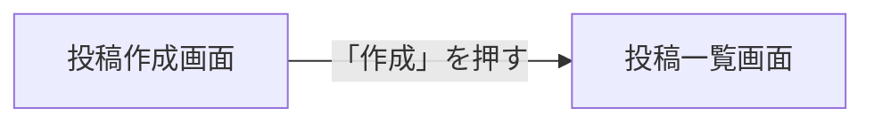
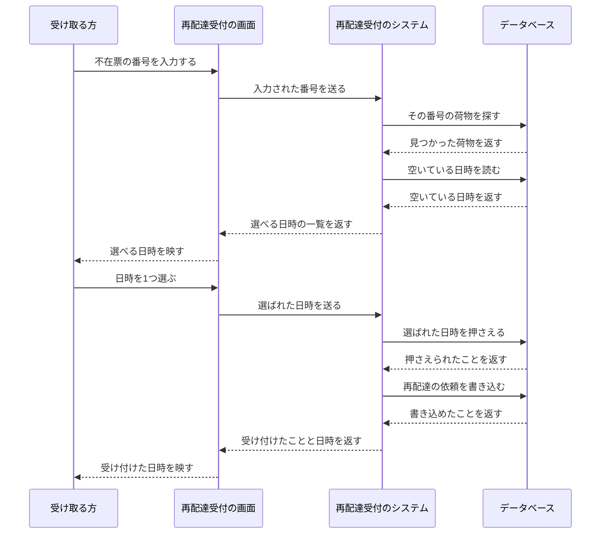
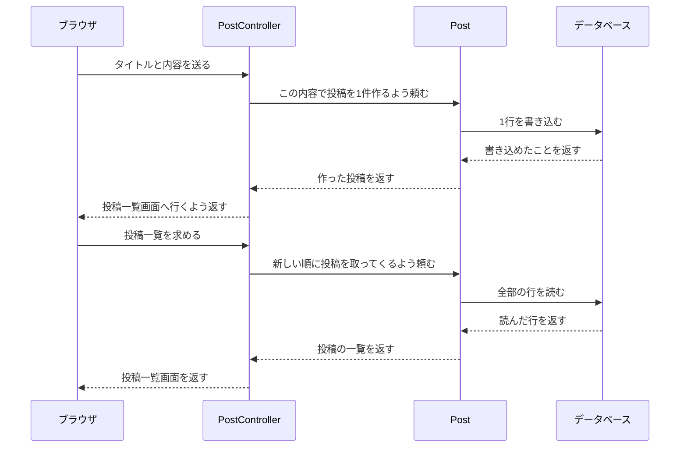

# 13-6-1: シーケンス図 - 処理の流れを描く

## 🎯 このセクションで学ぶこと

- 1つの操作が始まってから終わるまでのやり取りを、登場するものごとのたて線に分けてシーケンス図に描けるようになる。
- 図に登場させるものの細かさを、その図を誰に見せるのかで選べるようになる。
- 画面遷移図の矢印1本の中で、何段階のやり取りが起きているのかを説明できるようになる。

---

## 導入：設計書がそろっても、まだ何も動いていない

Chapter 5までで、ずいぶん多くのことが決まりました。どんな画面があり（Chapter 3）、その裏側にどんな入口があり、誰がそれを使ってよく（Chapter 4）、何をどんな形で覚えておくのか（Chapter 5）。ここまでの設計書を机の上に並べてみると、あることに気づきます。どれも、そこに何があるかを表した図と表です。

注文が1件登録されるまでに、何がどの順で起きるのか。登録されたその1件が、そのあとどう移り変わるのか。うまくいかなかったときに何をするのか。この3つは、ここまでの設計書のどこにも書かれていません。それを決めるのがChapter 6です。章の名前にある**振る舞い**は、何がどの順で起きて、どう移り変わるか、という意味です。13-1-2の一覧のとおり、このChapter 6「振る舞いの設計」は詳細設計です。

3つの決めごとは、3つのセクションに分かれています。順番はこのセクション、移り変わりは13-6-2、うまくいかなかったときは13-6-3です。最初に扱う「順番」が、いちばん見落とされます。13-3-1で描いたブログシステムの画面遷移図に、こんな矢印が1本ありました。



答え合わせでは、この矢印を「← 一覧に戻る」と分けた理由を、こう書きました。「作成」は入力した内容を保存してから戻る移動で、「← 一覧に戻る」は保存せずに戻る移動です。この「保存してから戻る」の**してから**が、まだどこにも書かれていません。1本の矢印に見えているところで、実際には何度もやり取りが起きています。そこを開いて見せる図が、シーケンス図です。

---

## シーケンス図の読み方

題材は、宅配便の再配達受付です。次の相談を受けたとします。

> 宅配便の配達をしています。ご不在のお宅にはポストへ不在票を入れているのですが、再配達のご連絡はいまも電話が中心で、夕方は電話が鳴りっぱなしになります。不在票に書いた番号をスマートフォンから入力していただいて、空いている日時から選んで再配達をお申し込みいただける形にできないでしょうか。
>
> 番号の打ち間違いはよくありますし、ご希望の日時がすでに埋まっていることもあります。そういうときにどうなるのかも、あわせて考えていただけると助かります。

この相談から、番号を入力して再配達を申し込むまでの流れを1枚にしたのが、次の図です。



いちばん上に四角が4つ並んでいます。この流れに登場するもの、という意味です。四角から下へ伸びているたて線を、**ライフライン**（登場するものから下へ伸ばすたて線）と呼びます。ライフラインの上が先、下が後です。左右に走っているのがやり取りで、線に添えた文字が、何を頼んだか（何を返したか）を表します。

この図から読み取れることを見ていきます。

上から下へ読むと、**順番が1本道で決まっています**。画面遷移図も四角と矢印でできていましたが、あちらは「どこからどこへ行けるか」の地図で、どの順に通るかまでは決まっていませんでした。シーケンス図は1回ぶんの流れを、起きた順に上から並べたものです。同じ矢印を使っていても、読み方が違います。向きの意味も変わり、根元が送る側、先端が受け取る側になります。頼む線なら、先端が頼まれる側です。

**どの矢印にも、必ず相手がいます**。「システムが番号を確かめる」と1行で書いてしまうと、どこへ確かめに行ったのかが文章から消えます。データベースのライフラインへ矢印が向かってはじめて、そこへ問い合わせることが決まります。🔑 **この図が効くのは、登場するものが3つ以上あるとき**です。2つしか出てこない流れなら、文章で書いても迷いません。

**返りの矢印は、次の行の材料になっています**。5本目の「空いている日時を読む」は、4本目でデータベースから荷物が返ってきたから出せる矢印です。返りを描かないと、次の矢印が何をもとに出ているのかが読めなくなります。

---

## シーケンス図の描き方

使う記号は4つだけです。

| 記号 | 表すもの |
|:-----|:---------|
| いちばん上の四角 | 登場するもの1つ。中に名前を書く |
| 四角から下へ伸びるたて線 | ライフライン。上が先、下が後 |
| 左右の線 | やり取り。根元が送る側、先端が受け取る側（頼む線なら先端が頼まれる側、返す線なら先端が頼んだ側） |
| 線に添えた文字 | 何を頼んだか（何を返したか） |

これ以上は増やしません。UMLのシーケンス図には、処理が動いている間を表す細長い四角や、条件で分かれるところを囲む枠もありますが、この教材では使いません。うまくいかなかったときの分岐は、13-6-3で表の側が引き受けます。

**登場させるものは、誰に見せる図かで選ぶ**

四角に何を並べるかは、記法では決まりません。ここが、この図でいちばん設計らしい判断です。

上の宅配便の図には、受け取る方・画面・システム・データベースが並んでいました。依頼者に見せて「この流れで合っていますか」と確かめるための図なので、依頼者が読める言葉で並べています。一方、自分たちが実装の順番を決めるための図なら、同じ流れでもブラウザ・コントローラー・モデル・データベースのように、プログラムのまとまりで並べます。どちらが正しいということではなく、🔑 **その図を誰に見せるかで選びます**。13-2-2で、ユースケース図の楕円をどこまで細かく分けるかを考えたのと同じ種類の判断です。

決めたら、1枚の図の中では混ぜません。「受け取る方」と「PostController」が同じ図に並ぶと、読む人はどの高さで読めばよいのか分からなくなります。

**ライフラインは4本まで**

5本以上に増えたら、粒度が細かすぎるか、1枚の図に2つの流れが混ざっています。後者なら、図を2枚に分けます。

**描く手順**

1. 描く流れを1つ選びます。「〜を押してから、〜が映るまで」と、始まりと終わりを口に出して言える範囲にします。
2. その流れに登場するものを並べ、いちばん上に四角を置いて、下へライフラインを伸ばします。左から、操作する人・画面・処理・データの順に置くと読みやすくなります。
3. やり取りを上から順に引きます。頼む矢印を引いたら、その返りも引きます。
4. それぞれの線に、何を頼んだか（何を返したか）を日本語の1文で書きます。ボタンの文字ではなく、起きていることを書きます。
5. 上から読み直して、1つの矢印が前の行の結果を使っているかを確かめます。どこから来たか分からない値が出てきたら、矢印が1本足りません。

手順4で書く文は、動詞で終える形にそろえます。「投稿を1件保存する」「保存できたことを返す」のように書けば、実装する人はその1行ぶんの処理を書けます。

**draw.ioでの操作**

この図で使うのは、四角・線・文字の3つだけです。どれも13-1-3と13-3-1で使ったものです（2026年8月時点）。

- **ライフラインを引く**: 13-1-3で見た「一般」パレットの線を1本置きます。置いた線をクリックすると両端に点が出るので、その点をドラッグして向きと長さを決めます。四角の下端の少し下から、まっすぐ下へ伸ばしてください。長さは最初に決めきらなくて構いません。やり取りの線が何本になるかは、上から並べてみるまで分からないからです。足りなくなったら、下端の点をドラッグして継ぎ足します。**四角と線は、つながっていなくて構いません**。うまく置けないときは、いちばん下にもう1つ四角を置いて、13-1-3で習った「線でつなぐ」やり方（図形の縁に出る青い矢印からドラッグする）で上の四角と結んでも構いません。下の四角は空のままにしておきます。この置き方だと四角は8つになりますが、下の4つは線を支えるためのものなので、数には入れません。
- **やり取りの線を引く**: 同じ「一般」パレットの線をもう1本置き、同じように両端の点をドラッグして、ライフラインとライフラインの間に横向きに渡します。線の端は、ライフラインにぴったり付けなくて構いません。どのライフラインから出て、どのライフラインへ入るのかが目で追えれば十分です。
- **線に文字を入れる**: 置いた線をダブルクリックすると、線の上に文字を入力できます。13-3-1で矢印に操作の文字を入れたときと同じです。
- **上から順に並べる**: やり取りの線は、起きた順に上から、同じくらいの間隔を空けて置きます。間隔を広めに取っておくと、あとから間に1本足したくなったときに、下の線を1本ずつ下へずらすだけで済みます。

> ⚠️ **注意**: このセクションに載せた図では、ライフラインが点線に、返りの線が破線になっています。draw.ioでは実線のままで構いません。やり取りの線に矢印を付けられるなら、その線を受け取る側へ向けて付けてください。頼む線なら頼まれる側へ、返す線なら頼んだ側へ向きます。付けられないときは、線に書いた文字（「〜する」なら頼む側から、「〜を返す」なら返す側から）が向きの代わりになります。

---

## 🏃 描いてみよう

> 🔥 この演習では、設計書をAIに作らせずに、自分の手で書きましょう。記法や考え方についてAIに質問するのは構いませんが、成果物を生成させるのはTutorial 14までお預けです。まず自分の手と頭で書けるようになった人だけが、AIの作った設計を正しく評価できるようになります。

宅配便の再配達受付は「読む」練習でした。今度は、自分が作ったアプリで描きます。題材は、13-2-2でユースケース図に、13-3-1で画面一覧と画面遷移図に起こしたのと同じ、9-4-9「Eloquent ORM - ハンズオン演習」で作ったブログシステム（`eloquent-app-practice`）です。

描くのは1本だけです。導入で見た**投稿作成画面で「作成」を押してから、投稿一覧画面が映るまで**。あの矢印1本の中身を開きます。

登場させるものは、次の4つにします。今回の図は自分たちが実装の順番を決めるためのものなので、プログラムのまとまりで並べます。

- `ブラウザ`
- `PostController`
- `Post`
- `データベース`

10-2-3「HTTPライフサイクルの詳細解説」で読んだ、ブラウザから送られたものがどこを通ってブラウザへ返るまでの流れを、登場するものごとにたて線を立てて描き直すのが、この図です。

材料は、9-4-9で自分が書いたコードです。まず、この2行のルートが動きます。

```php
// routes/web.php（9-4-9 の追加部分から2行を、この図で動く順に並べたもの）
Route::post('/posts', [PostController::class, 'store']);
Route::get('/posts', [PostController::class, 'index']);
```

呼ばれるコントローラーは、この2つです。

```php
// app/Http/Controllers/PostController.php（9-4-9 の模範解答から2つのメソッドを抜粋）
    public function store(Request $request)
    {
        Post::create([
            'title' => $request->title,
            'content' => $request->content,
            'published_at' => now(),
        ]);
        return redirect('/posts');
    }

    public function index()
    {
        $posts = Post::latest()->get();
        return view('posts.index', ['posts' => $posts]);
    }
```

`Post::create()` と `Post::latest()->get()` が、モデルからデータベースへ向かう矢印になります。

もう1行、`store()` の最後の `return redirect('/posts')` にも目を留めてください。9-1-6「リクエストとレスポンスの基礎」で読んだとおり、リダイレクトもレスポンスの一種です。ただし、ここで返しているのは投稿一覧画面そのものではなく、「その画面へ行き直してください」という指示です。受け取ったブラウザは、そのとおりにもう一度リクエストを送ります。🔑 **1回の操作でも、ブラウザとの往復が2回になる**のはこのためで、`index()` が動くのは2回目のリクエストが届いてからです。

### Step 1: やり取りを上から並べる

「描く手順」の1から5のとおりに進めます。手が止まりやすいのは `return redirect('/posts')` のあとです。上で確かめたとおり、ここでブラウザからのリクエストがもう一度起きます。そこから下に何が続くのかを決めてから、描き始めてください。

### Step 2: draw.ioで描く

四角4つとライフライン4本を置き、やり取りの線を上から順に引きます。線には、何を頼んだか（何を返したか）を日本語で書きます。`POST /posts` のようなURLは、書いても書かなくても構いません。書くなら、日本語の文に添える形にします。

### Step 3: design-practiceに保存する

Chapter 6用のフォルダを作ります。

```bash
# design-practiceフォルダへ移動する
cd ~/design-practice

# Chapter 6用のフォルダを作る
mkdir 13-6
```

このフォルダにも、この先のセクションの成果物が一緒に入ります。ファイル名の先頭には、13-2から13-5と同じく、どのアプリのものか分かる短い言葉を付けます。今回はブログシステムなので `blog-` です。

draw.ioで `blog-sequence.drawio` の名前で保存し、PNGも `blog-sequence.png` の名前で書き出します。書き出した2つのファイルは、13-1-3の「書き出したファイルをdesign-practiceへ移す」のとおりに `13-6/` へ移します。

```bash
# design-practice フォルダの中で実行する
git add 13-6
git commit -m "13-6: ブログシステムのシーケンス図を追加"
git push origin main
```

<details>
<summary>📖 描き終えたら開く（答え合わせ）</summary>

**ブログシステムのシーケンス図（解答例）**

draw.ioで描いた自分の図とは、四角の並びと、線の本数と順番だけを見比べてください。



次の観点で、自分の成果物と見比べてください。

- [ ] ライフラインが4本で、それぞれが何を表しているかを説明できる
- [ ] ブラウザからの矢印が2本ある（画面遷移図では1本の矢印だった）
- [ ] すべての線に、何を頼んだか（何を返したか）が日本語で書かれている
- [ ] 頼む矢印に対して、返りの線が引かれている
- [ ] どの線も、矢印の向きか線に書いた文字で、どちらからどちらへのやり取りかが読み取れる
- [ ] 上から読んだときに、どこから来たか分からない値が出てこない
- [ ] `PostController` の中だけで終わる処理を、線にしていない

設計に唯一の正解はありません。四角の間隔や線の長さが解答例と違っていても、上の観点を満たしていれば合格です。そのうえで、判断が分かれやすい3点を補足します。

- **1本の矢印だったところが、往復2回になっている理由**: リダイレクトを受け取ったブラウザが、もう一度 `GET /posts` を送るからです。13-3-1の画面遷移図が間違っていたわけではありません。あの図は行き先だけを表す図で、途中に何回のやり取りがあるかまでは表しません。1本の矢印の下に何段階が隠れているのかは、こちらの図ではじめて見えます。
- **`Post` と `データベース` を分けた理由**: `Post::create()` の1行には、投稿の形を決める仕事と、実際に書き込む仕事の2つが入っています。分けて描くと、どちらで失敗しうるのかが見えます。1本にまとめる描き方もありますが、その場合はデータベースへ問い合わせていること自体が図から消えます。
- **`now()` の1行を線にしなかった理由**: 図に描くのは、ライフラインをまたぐやり取りだけです。`PostController` や `Post` の中で完結する計算は、線になりません。描かないと決めたことを1文残しておくのが設計書の役目で、13-2-2で線を引かないことが決定を表すと学んだのと同じ考え方です。

</details>

---

## 💡 よくある間違いと現場での使われ方

**間違い1: 起きたことを、上から並べただけで終わる**

「番号を確かめる」「日時を押さえる」「依頼を登録する」と縦に並べても、それは箇条書きです。ライフラインを立てて、どこからどこへの矢印なのかを決めてはじめて、誰の仕事なのかが決まります。

**間違い2: プログラムの1行ずつを線にする**

`if` で分かれたところや、変数に入れたところまで線にすると、線が何十本にもなります。

**間違い3: 返りを省く**

頼む矢印だけを引くと、図としては短くなります。ただ、13-6-3で「この返事が返ってこなかったらどうするか」を洗い出すときに、洗い出す先が消えます。

現場では、シーケンス図は2つの場面でよく使われます。1つは、外の会社の仕組みとつなぐときです。どちらがどこまで、どの順で処理するのかを1枚で合意できます。もう1つは、動かなくなった処理を追いかけるときです。図があれば、どの矢印まで届いていたのかを見て、調べる場所を絞れます。

---

## ✨ まとめ

- シーケンス図は、1つの操作が始まってから終わるまでのやり取りを、起きた順に上から並べた図です。画面遷移図が行き先の地図だったのに対して、こちらは1回ぶんの道順です。
- 使う記号は、四角・ライフライン・左右の線・線に添えた文字の4つだけです。矢印の向きは、根元が送る側、先端が受け取る側を表します（頼む線なら先端が頼まれる側、返す線ならその逆です）。
- 図に登場させるものは、その図を誰に見せるかで選びます。依頼者に見せるなら業務の言葉で、実装の順番を決めるならプログラムのまとまりで並べ、1枚の中では混ぜません。この選び方は成果物として形に残らず、ライフラインを何本立てるかという形で図に現れます。カフェのモバイルオーダーアプリで実際に選ぶのは、13-6-4の演習です。
- ライフラインは4本までに抑えます。5本以上になったら、1枚に2つの流れが混ざっていないかを疑います。
- 画面遷移図の矢印1本の中では、何度もやり取りが起きています。ブログシステムの「作成」の矢印は、開いてみると2往復ぶんの流れでした。

次のセクション（13-6-2）では、この流れの結果として生まれた1件のデータが、そのあとどう移り変わるのかを決めます。投稿を1件作るところまでは描けましたが、作られた投稿がどんな段階を通っていくのかは、まだどこにも書かれていません。

---
