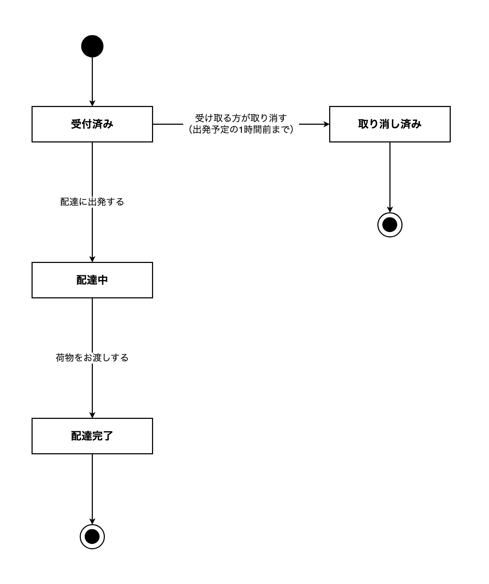
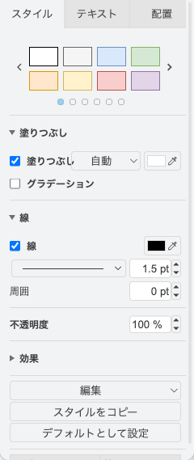
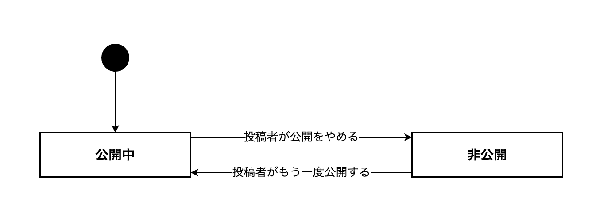

# 13-6-2: 状態遷移設計 - ステータスの一生を描く

## 🎯 このセクションで学ぶこと

- 1件のデータが取りうる状態を洗い出し、どこからどこへ移れるのかを状態遷移図に描けるようになる。
- 同じ内容を遷移表に書き出し、図と表がずれていないかを確かめられるようになる。
- 状態を1つ増やすと、ほかの設計書に何が増えるのかを言えるようになる。

---

## 導入：値を並べただけでは、順番が決まらない

データの多くは、生まれてから役目を終えるまでの間に、いくつかの段階を通ります。この「今どの段階にあるか」を**状態**（そのデータが今どの段階にあるか）と呼びます。注文なら、支払いを待っている段階、受け取りを待っている段階、渡し終わった段階、といった具合です。

状態を持たせること自体は、すでに何度もやってきました。8-2-7 では `status ENUM('未着手', '進行中', '完了')` という列をSQLで定義しました。取りうる値が3つ並んでいるところまでは決まっています。

決まっていないのは、🔑 **どの値からどの値へ移れるのか**です。未着手から直接完了へ飛べるのか。完了から未着手へ戻せるのか。決めていなければ、実装する人がその場で決めます。片方の画面では戻せて、別の画面では戻せない、という作りにもなります。

そこで作るのが、次の2つです。

- **状態遷移図**: 状態と、その間の移り変わりを1枚で表した図。
- **遷移表**（どの状態のときに何が起きると、どの状態へ移るかを表にしたもの）: 同じ内容を、行として数えられる形にした表。

---

## 状態遷移図と遷移表の読み方

題材は、13-6-1 と同じ宅配便の再配達受付です。13-6-1 で描いた流れが1回終わると、再配達の依頼が1件できます。その1件の一生を描いたのが、次の図です。

**宅配便の再配達依頼の状態遷移図**



四角が状態で、中に状態の名前が入っています。矢印が移り変わりで、根元が移る前、先端が移った後です。矢印に添えた文字は**イベント**（状態が移り変わるきっかけになる出来事）で、その移り変わりを引き起こした出来事を書きます。黒く塗った丸が始まり、丸で囲まれた印が終わりです。

同じ内容を表にしたのが、次の遷移表です。

| 今の状態 | 起きること | 次の状態 | 条件 |
|:---------|:-----------|:---------|:-----|
| （依頼がまだ無い） | 再配達の申し込みを受け付ける | 受付済み | - |
| 受付済み | 配達に出発する | 配達中 | - |
| 受付済み | 受け取る方が取り消す | 取り消し済み | 出発予定の1時間前まで |
| 配達中 | 荷物をお渡しする | 配達完了 | - |

🔑 **図の矢印1本が、表の1行**になっています。図の矢印は全部で6本ありますが、終わりの印へ向かう2本は、出来事があって移るわけではないので、表には行を作りません。残る4本（始まりから出ている1本を含みます）が、表の4行にあたります。数が合わないときは、どちらかに書き落としがあります。

図と表の両方を作るのは、見えるものが違うからです。図を見ると、行き止まりや、どこからも入ってこられない状態がひと目で分かります。表を見ると、1行ずつが独立した決めごととして数えられて、条件を書き込めます。

読み取れることを見ていきます。

**どの状態にも、入ってくる矢印があります**。`配達中` にも `取り消し済み` にも、そこへ向かう矢印が1本以上あります。1本も無い状態が見つかったら、それは決して起きない状態です。名前だけ用意して、そこへ入れる方法を決め忘れています。

**ほかの状態へ出ていく矢印が無いのは、終わりの状態だけです**。`配達完了` と `取り消し済み` から、ほかの状態へ向かう矢印は出ていません（終わりの印へ向かう線は、状態が移り変わる矢印には数えません）。この2つは終わりなので、それで正しい形です。それ以外に出ていく矢印の無い状態があれば、そこに入ったら二度と動かせないデータになります。

**引かなかった矢印にも、意味があります**。`配達中` から `受付済み` へ戻る矢印は、この図にはありません。これは「一度出発したら、日時は変えられない」という決定です。仕様書は、そこまで書いてくれません。13-2-2 でユースケース図の線について学んだとおり、線を引かないことが決定を表します。

表のいちばん右の欄も見てください。条件が書かれている行が1行だけあり、図では同じ条件が、その矢印の文字に括弧で添えられています。「受け取る方が取り消す」という出来事は、出発の直前にも起こりえます。ボタンは押せてしまうからです。押されても移り変わらない場合があることを決めているのが、この欄です。`配達中` になったあとの取り消しについては、そもそも矢印が引かれていないので、状態の並びのほうで決まっています。

---

## 状態遷移図の描き方

使う記号は次のとおりです。

| 記号 | 表すもの |
|:-----|:---------|
| 四角 | 状態1つ。中に状態の名前を書く |
| 矢印 | 状態が移り変わること。根元が移る前、先端が移った後 |
| 矢印に添えた文字 | イベント。条件があれば続けて書く |
| 黒く塗った小さな丸 | 始まり。最初の状態へ向かう矢印を1本だけ出す |
| 黒く塗った丸を丸で囲んだもの | 終わり。ここから出ていく矢印は無い |

始まりと終わりの印は、13-3-2 の画面遷移図では使いませんでした。状態遷移図では使います。データには必ず生まれる瞬間があり、多くの場合は終わりもあるからです。終わりの印は、いくつ置いても構いません。上の図では、`配達完了` と `取り消し済み` にそれぞれ1つ置いています。

記号はこれ以上増やしません。状態の中にさらに状態を入れる書き方や、2つの状態を同時に持つ書き方もありますが、この教材では扱いません。

**1枚の図で扱うのは、1種類のデータの状態だけ**です。注文の状態と商品の状態を1枚に混ぜると、どの矢印がどちらの話なのかが読めなくなります。

**描く手順**

1. どのデータの状態を描くのかを1つ決めます。
2. そのデータが取りうる状態を洗い出し、名前を付けます。名前は日本語の名詞で、「〜前」「〜中」「〜済み」のように、今どの段階かが分かる形にそろえます。すでに決まっている言葉があれば、それをそのまま使います。
3. 始まりの印を置き、最初の状態へ矢印を1本引きます。データが生まれたときにどの状態から始まるのかは、必ず1つに決まります。
4. 状態を2つずつ組にして、移れるかどうかを問います。移れると決めた組だけ、矢印を引きます。
5. 引いた矢印に、イベントを書きます。誰が何をしたか、または何が起きたかを、日本語の1文で書きます。そのイベントが起きても移り変わらない場合があるなら、条件を括弧で続けて書きます。始まりの印から出る1本には書きません。この1本にあたる出来事は、遷移表を書くときに決めます。
6. そこへ入ったら二度と動かない状態があれば、終わりの印を付けます。どの状態からも出ていく矢印がある設計なら、終わりの印は付きません。
7. 「読み方」で見た3つの見方で点検します。入ってくる矢印が無い状態、出ていく矢印が無い状態、引かないと決めた矢印の3つです。

**状態を1つ増やすと、機能が1つ増える**

手順2で、状態はいくらでも思いつきます。ただ、状態を1つ足すと、そこへ移すきっかけになるイベントが最低1つ要ります。イベントが要るということは、それを起こす人と、その操作をする画面と、受け取る入口が要るということです。🔑 **状態を足すかどうかは、機能を足すかどうかと同じ話**です。

だから手順2では、思いついた状態を1つずつ、「この状態に入ったことを、誰がどうやって記録するのか」と問い直します。答えられない状態は、まだ作れません。

**draw.ioでの操作**

四角を置く・文字を入れる・矢印を引く・矢印に文字を入れるは、13-1-3 と 13-3-2 で使ったものだけで足ります。新しいのは、始まりと終わりの印です（2026年8月時点）。

- **始まりの印**: 「一般」パレットの楕円を1つ置き、幅と高さを同じくらいにして小さな丸にします。置いた丸の**縁**をクリックすると、画面の右の書式パネルが「スタイル」に変わります。「塗りつぶし」の右にある色の四角をクリックし、開いた一覧から黒を選ぶと、丸が黒く塗られます。
- **終わりの印**: 塗らない丸を1つ置き、その中に黒く塗った小さい丸を重ねます。2つの丸の中心をそろえると、二重丸になります。

図形を選んだときの書式パネル。**「塗りつぶし」の色**をここで変えます



---

## 遷移表の書き方

列は `今の状態`・`起きること`・`次の状態`・`条件` の4つで固定します。

書くときの決めごとは次のとおりです。

- 「今の状態」と「次の状態」には、状態遷移図に書いた状態の名前を**そのまま**写します。図で「受け取り前」と書いたものを、表で「未受取」と書き直すと、2枚が別の設計書になります。データが生まれる行の「今の状態」だけは、まだ状態がないので「（依頼がまだ無い）」のように書きます。
- 「起きること」には、矢印に書いたイベントをそのまま写します。図の矢印に条件まで続けて書いてある場合は、イベントの部分だけを写し、条件は右端の欄に分けます。データが生まれる行の「起きること」だけは、写す元の文字が無いので、ここで新しく決めます。
- 「条件」は、そのイベントが起きても移り変わらない場合がある行にだけ書きます。無い行は `-` と書き、空欄にしません。13-2-2 で「無ければ『なし』と書く」と学んだのと同じで、検討したうえで無いのか、書き忘れたのかを区別するためです。
- 終わりの状態から出ていく行は作りません。終わりであることは、図の側の印が表します。

**条件に書けるのは、システムが判断できることだけ**

宅配便の表には「出発予定の1時間前まで」と書きました。依頼には日時が入っているので、システムは今が1時間前より後かどうかを自分で判断できます。

判断できないことは、条件になりません。「担当者が納得していれば」と書いても、システムには納得したかどうかが分かりません。人の頭の中にあることを条件にするなら、まずそれを記録する操作を作り、状態か項目として持つところから決めます。

書き終えたら、読み方で見たとおり、図の矢印の本数と表の行数を数え合わせます。

---

## 🏃 描いてみよう

宅配便の再配達受付は、読む練習でした。今度は、手元の投稿アプリで描きます。

このアプリの投稿には、状態がありません。ログインすれば全部の投稿が一覧に並び、自分の投稿だけ編集と削除ができます。そこへ、次の要望が来たとします。

> 一覧に出したくない投稿を、いったん引っ込められるようにしてほしい。あとでまた出せるようにもしてほしい。これから登録される投稿を、最初から一覧に出すのかどうかも、あわせて決めておいてほしい。

この要望を受けて、投稿に状態を持たせるとどうなるかを設計します。コードは書きません。図と表と、そのために増える設計書の一覧までを作ります。

材料は3つあります。1つ目は、`posts` テーブルの定義です。

```php
// database/migrations/2024_01_01_000001_create_posts_table.php
Schema::create('posts', function (Blueprint $table) {
    $table->id();
    $table->foreignId('user_id')->constrained()->cascadeOnDelete();
    $table->foreignId('category_id')->constrained();
    $table->string('title');
    $table->text('content');
    $table->timestamps();
});
```

状態を持つ列はありません。8-2-7 で見た `status` のような列が、このテーブルには1つもない状態です。

2つ目は、一覧を読んでいるところです。

```php
// app/Http/Controllers/PostController.php
    public function index()
    {
        $posts = Post::with(['user', 'category'])->latest()->get();

        return view('posts.index', compact('posts'));
    }
```

`get()` の前に、絞り込みの条件が1つも付いていません。いま一覧に並ぶのは、全部の投稿です。

3つ目は、削除しているところです。

```php
// app/Http/Controllers/PostController.php
    public function destroy(Post $post)
    {
        $this->authorize('delete', $post);

        $post->delete();

        return redirect()->route('posts.index');
    }
```

`$post->delete()` は、その行そのものを消します（9-4-6「データの更新と削除」）。9-4-7 で学んだソフトデリート（消したことにして行は残す仕組み）は、このアプリでは使っていません。

### Step 1: 状態の名前を決めて、状態遷移図を描く

投稿が取りうる状態を洗い出します。人に見せている段階と、見せていない段階の2つは必ず要ります。名前は、いまアプリの中で使われている言葉が無いので、自分で決めてください。

そのうえで、「状態遷移図の描き方」の手順3から6のとおりに描きます。描きながら、次を決めてください。

- 投稿が登録されたとき、どちらの状態から始まるか。いま一覧に並んでいる4件は、どれも見える状態です。始まりの矢印をどちらへ引くかで、その振る舞いを変えるかどうかが決まります。
- 2つの状態の間を、行きだけにするか、往復できるようにするか。
- 削除された投稿を、状態として置くかどうか。決める前に、材料の3つ目をもう一度読んでください。

### Step 2: 遷移表を書く

`今の状態`・`起きること`・`次の状態`・`条件` の4列で書き、図の矢印の本数と行数が合っているかを確かめます。

### Step 3: 増える設計書を書き出す

ここが、このセクションでいちばん大事な作業です。図に描いた状態を実際に持たせるなら、ほかの設計書に何が増えるかを書き出します。

書き出す先を探すために、次の4つを自分に問いかけてください。

- この状態は、どこに記録されるか
- 状態を移すのは、誰の、どの操作か
- その操作のボタンは、どの画面に付くか
- 見せていない投稿は、誰の一覧に出るか

答えを `足すもの` と `どの設計書に増えるか` の2列の表にします。表の行数が、この要望を受けるために動く設計書の枚数です。

### Step 4: リポジトリに保存する

13-6-1 で作った `docs/13-6/` に保存します。ファイル名の先頭は、13-6-1 と同じ `post-` です。

- **状態遷移図**: draw.ioで `post-state.drawio` として保存し、PNGも `post-state.png` として書き出します。
- **遷移表と、増える設計書の表**: VS Codeで `docs/13-6/post-state-table.md` を新しく作り、Step 2 と Step 3 で書いたものを入れます。

```bash
# アプリのフォルダの中で実行する
git add docs/13-6
git commit -m "13-6: 投稿の状態遷移図と遷移表を追加"
git push origin main
```

<details>
<summary>📖 描き終えたら開く（答え合わせ）</summary>

**投稿の状態遷移図（解答例）**



**遷移表（解答例）**

| 今の状態 | 起きること | 次の状態 | 条件 |
|:---------|:-----------|:---------|:-----|
| （投稿がまだ無い） | 投稿が登録される | 公開中 | - |
| 公開中 | 投稿者が公開をやめる | 非公開 | - |
| 非公開 | 投稿者がもう一度公開する | 公開中 | - |

状態は2つ、図の矢印は3本、表は3行です。終わりの印は付いていません。

1行目の「起きること」を「投稿が登録される」という言い方にしたのは、このアプリに投稿を作る画面がまだ無いからです。いま並んでいる4件は、練習用に入れたデータです。投稿を作る機能を足す日に、この行の「起きること」が「投稿者が投稿を作る」に決まります。

**増える設計書（解答例）**

| 足すもの | どの設計書に増えるか |
|:---------|:---------------------|
| 投稿の状態を持つ列（取りうる値は「公開中」「非公開」） | テーブル定義書（13-5-3）の `posts` に1行 |
| 「投稿の公開をやめる」「投稿をもう一度公開する」の2つの機能 | 機能一覧（13-2-1）に2行 |
| その2つの操作のボタン | ボタンを置く画面のワイヤーフレームと画面項目定義（13-3-3） |
| 非公開の投稿を投稿者だけに見せるという決まり | 権限マトリクス（13-4-2）に1行 |
| 一覧を読むときの絞り込みの条件 | API設計書（13-4-1）の投稿一覧の欄 |

状態を1つ持たせるだけで、設計書が5枚動きます。これが「状態を足すかどうかは、機能を足すかどうかと同じ話」の中身です。

次の観点で、自分の成果物と見比べてください。

- [ ] 状態の名前が名詞で、動詞になっていない
- [ ] 始まりの印から、どちらか一方の状態へ矢印が1本出ている
- [ ] どの状態にも、そこへ向かう矢印が1本以上ある
- [ ] 引かないと決めた矢印について、なぜ引かないのかを説明できる
- [ ] 遷移表の行数と、図の矢印の本数が合っている
- [ ] 条件の欄に、`-` を含めて何かが書かれている（空欄がない）
- [ ] 増える設計書の表に、テーブル・機能一覧・画面・権限の4つが出てきている

**迷いやすいところ**

- **最初の状態を「公開中」にした理由**: いま一覧に並んでいる投稿は、どれも見える状態です。その振る舞いを変えないと決めたので、始まりの矢印は `公開中` へ引きました。`非公開` から始める設計にすると、投稿を登録する操作に「まだ公開しない」という選び分けが要り、機能が1つ増えます。どちらが正しいということではなく、選んだほうが図に残っていることが大事です。
- **「下書き」を別の状態にしなかった理由**: 一度も公開していない投稿と、公開してから引っ込めた投稿を、別の名前で区別する設計もあり得ます。ただ、どちらも「投稿者だけに見える」という扱いなので、分けても新しい操作は増えません。分けるなら、分けたことで変わる振る舞いを1つ言えるようにしてください。言えないなら、状態は1つで足ります。
- **「削除済み」を状態にしなかった理由**: `$post->delete()` は行そのものを消すので、削除された投稿はどこにも残りません。状態遷移図が扱うのは、行が残っているあいだの移り変わりです。行を残す設計にするなら、9-4-7 のソフトデリートを使い、`削除済み` を状態として置いたうえで、終わりの印を付けます。

</details>

---

## 💡 よくある間違いと現場での使われ方

**間違い1: 状態の名前が、操作の名前になっている**

「公開する」「取り消す」と四角に書いてしまう間違いです。四角に入るのは、そのデータが今どうなっているかを表す言葉で、動詞は矢印の側に書きます。名前が動詞になっていたら、四角と矢印の中身が入れ替わっています。

**間違い2: 外れたときを、状態として並べる**

「エラー」「失敗」という四角を作ってしまう間違いです。外れたときにどうするかは、13-6-3 で例外一覧として決めます。状態として持つのは、そのあと誰かがその状態のデータを扱う場合だけです。

**間違い3: 図と表の片方だけを書き換える**

矢印を1本足したり消したりしたときに、図だけを直して表を置いたままにすると、2枚が別のことを言い出します。読む人は、どちらが新しいのかを判断できません。直したら、そのつど矢印の本数と行数を数え直してください。

現場では、状態遷移図は問い合わせが来たときに最初に開く設計書になります。「このデータがこの状態のまま止まっている」という連絡に対して、そこへ入る矢印とそこから出る矢印を見れば、どこまで進んでいたのかを絞れるからです。なお、この教材では詳細設計としてChapter 6に置いていますが、現場によっては基本設計の段階でこの図を作ることもあります。工程の区切り方は会社ごとに違うので、置かれている場所が違っても慌てないでください。

---

## ✨ まとめ

- 取りうる値を並べることと、その値がどの順で移り変わるかを決めることは、別の作業です。値だけ並べて渡すと、移り変わりは実装する人がその場で決めます。
- 状態遷移図は、四角・矢印・矢印に添えた文字・始まりと終わりの印で描きます。矢印の向きは、根元が移る前、先端が移った後を表します。
- 遷移表は `今の状態`・`起きること`・`次の状態`・`条件` の4列で書きます。図の矢印1本が表の1行になり、数が合わなければどちらかに書き落としがあります。
- 状態を1つ増やすことは、機能を1つ増やすことです。投稿に状態を2つ持たせるだけで、テーブル定義書・機能一覧・画面・権限マトリクス・API設計書の5枚が動きました。
- 引かなかった矢印と、条件の欄が、この設計書のいちばん価値のあるところです。移れないと決めたことは、図と表を見なければ誰にも分かりません。

---
