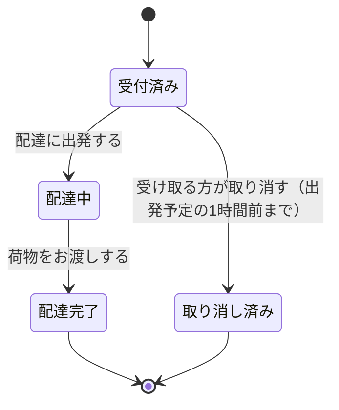
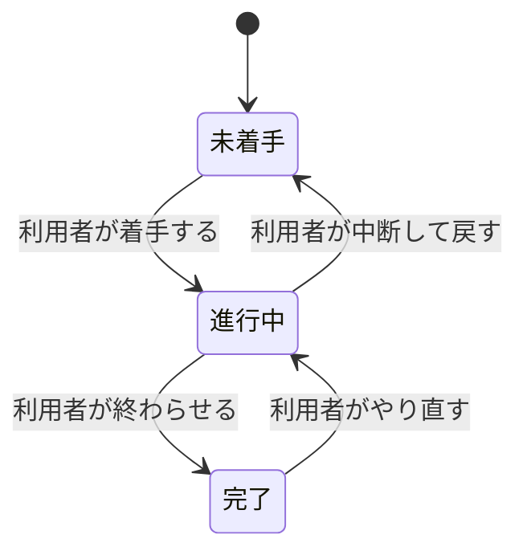

# 13-6-2: 状態遷移設計 - ステータスの一生を描く

## 🎯 このセクションで学ぶこと

- 1件のデータが取りうる状態を洗い出し、どこからどこへ移れるのかを状態遷移図に描けるようになる。
- 同じ内容を遷移表に書き出し、図と表がずれていないかを確かめられるようになる。
- 移れないと決めた組み合わせを、図と表の上で示せるようになる。

---

## 導入：列を用意しただけでは、何も決まっていない

13-6-1で描いたのは、1回ぶんの流れでした。ブログシステムなら、「作成」を押してから投稿一覧が映るまで。その流れが終わった結果、投稿が1件できています。このセクションで扱うのは、できあがったその1件が、そのあとどうなるかです。

データの多くは、生まれてから役目を終えるまでの間に、いくつかの段階を通ります。この「今どの段階にあるか」を**状態**（そのデータが今どの段階にあるか）と呼びます。注文なら、支払いを待っている段階、受け取りを待っている段階、渡し終わった段階、といった具合です。

状態を持たせること自体は、すでに何度もやってきました。8-2-7では `status ENUM('未着手', '進行中', '完了')` という列をSQLで定義しましたし、11-2-1の `tasks` テーブルにも同じ名前の列がありました。ただ、どちらも取りうる値は最初から与えられていて、🔑 **どの値からどの値へ移れるのか**は決めていません。未着手から直接完了へ飛べるのか。完了から未着手へ戻せるのか。決めていなければ、実装する人がその場で決めます。

Chapter 5からも、同じ形の宿題が届いています。13-5-4で作ったテーブル定義書の `orders` には `status` という列があり、説明の欄にはこう書いてありました。「受け取りの状態。取りうる値はChapter 6で決めます」。決め方をこのセクションで学び、カフェの注文に当てはめて実際に値を決めるのは、13-6-4の演習です。作るものは2つあります。

- **状態遷移図**: 状態と、その間の移り変わりを1枚で表した図。
- **遷移表**（どの状態のときに何が起きると、どの状態へ移るかを表にしたもの）: 同じ内容を、行として数えられる形にした表。

---

## 状態遷移図と遷移表の読み方

題材は、13-6-1と同じ宅配便の再配達受付です。13-6-1で描いた流れが1回終わると、再配達の依頼が1件できます。その1件の一生を描いたのが、次の図です。



四角が状態で、中に状態の名前が入っています。矢印が移り変わりで、根元が移る前、先端が移った後です。矢印に添えた文字は**イベント**（状態が移り変わるきっかけになる出来事）で、その移り変わりを引き起こした出来事を書きます。黒く塗った丸が始まり、丸で囲まれた印が終わりです。

同じ内容を表にしたのが、次の遷移表です。

| 今の状態 | 起きること | 次の状態 | 条件 |
|:---------|:-----------|:---------|:-----|
| （依頼がまだ無い） | 再配達の申し込みを受け付ける | 受付済み | - |
| 受付済み | 配達に出発する | 配達中 | - |
| 受付済み | 受け取る方が取り消す | 取り消し済み | 出発予定の1時間前まで |
| 配達中 | 荷物をお渡しする | 配達完了 | - |

🔑 **図の矢印1本が、表の1行**になっています。図の矢印は全部で6本ありますが、終わりの印へ向かう2本は、出来事があって移るわけではないので、表には行を作りません。残る4本（始まりから出ている1本を含みます）が、表の4行にあたります。数が合わないときは、どちらかに書き落としがあります。

図と表の両方を作るのは、見えるものが違うからです。図を見ると、行き止まりや、どこからも入ってこられない状態がひと目で分かります。表を見ると、1行ずつが独立した決めごととして数えられて、条件の書き込みができます。

読み取れることを見ていきます。

**どの状態にも、入ってくる矢印があります**。`配達中` にも `取り消し済み` にも、そこへ向かう矢印が1本以上あります。1本も無い状態が見つかったら、それは決して起きない状態です。名前だけ用意して、そこへ入れる方法を決め忘れています。

**ほかの状態へ出ていく矢印が無いのは、終わりの状態だけです**。`配達完了` と `取り消し済み` から、ほかの状態へ向かう矢印は出ていません（終わりの印へ向かう線は、状態が移り変わる矢印には数えません）。この2つは終わりなので、それで正しい形です。それ以外に出ていく矢印の無い状態があれば、そこに入ったら二度と動かせないデータになります。

**引かなかった矢印にも、意味があります**。`配達中` から `受付済み` へ戻る矢印は、この図にはありません。これは「一度出発したら、日時は変えられない」という決定です。仕様書は、そこまで書いてくれません。13-2-2でユースケース図の線について学んだとおり、線を引かないことが決定を表します。

表のいちばん右の欄も見てください。条件が書かれている行が1行だけあり、図では同じ条件が、その矢印の文字に括弧で添えられています。「受け取る方が取り消す」という出来事は、出発の直前にも起こりえます。ボタンは押せてしまうからです。押されても移り変わらない場合があることを決めているのが、この欄です。`配達中` になったあとの取り消しについては、そもそも矢印が引かれていないので、状態の並びのほうで決まっています。

---

## 状態遷移図の描き方

使う記号は5つです。

| 記号 | 表すもの |
|:-----|:---------|
| 四角 | 状態1つ。中に状態の名前を書く |
| 矢印 | 状態が移り変わること。根元が移る前、先端が移った後 |
| 矢印に添えた文字 | イベント。条件があれば続けて書く |
| 黒く塗った小さな丸 | 始まり。最初の状態へ向かう矢印を1本だけ出す |
| 黒く塗った丸を丸で囲んだもの | 終わり。ここから出ていく矢印は無い |

始まりと終わりの印は、13-3-1で「開始を表す黒丸のような記号は使いません」と断った、あの記号です。画面遷移図では使いませんでしたが、状態遷移図では使います。データには必ず生まれる瞬間があり、多くの場合は終わりもあるからです。

記号はこれ以上増やしません。状態の中にさらに状態を入れる書き方や、2つの状態を同時に持つ書き方もありますが、この教材では扱いません。

**1枚の図で扱うのは、1種類のデータの状態だけ**です。注文の状態と商品の状態を1枚に混ぜると、どの矢印がどちらの話なのかが読めなくなります。

**描く手順**

1. どのデータの状態を描くのかを1つ決めます。
2. そのデータが取りうる状態を洗い出し、名前を付けます。名前は日本語の名詞で、「〜前」「〜中」「〜済み」のように、今どの段階かが分かる形にそろえます。すでに決まっている言葉があれば、それをそのまま使います。
3. 始まりの印を置き、最初の状態へ矢印を1本引きます。データが生まれたときにどの状態から始まるのかは、必ず1つに決まります。
4. 状態を2つずつ組にして、移れるかどうかを問います。移れると決めた組だけ、矢印を引きます。
5. 引いた矢印に、イベントを書きます。誰が何をしたか、または何が起きたかを、日本語の1文で書きます。そのイベントが起きても移り変わらない場合があるなら、条件を括弧で続けて書きます。始まりの印から出る1本には書きません。この1本にあたる出来事は、遷移表を書くときに決めます。
6. そこへ入ったら二度と動かない状態があれば、終わりの印を付けます。どの状態からも出ていく矢印がある設計なら、終わりの印は付きません。
7. 「読み方」で見た3つの見方で点検します。入ってくる矢印が無い状態、出ていく矢印が無い状態、引かないと決めた矢印の3つです。

**状態を1つ増やすと、機能が1つ増える**

手順2で、状態はいくらでも思いつきます。ただ、状態を1つ足すと、そこへ移すきっかけになるイベントが最低1つ要ります。イベントが要るということは、それを起こす人と、その操作をする画面と、受け取る入口が要るということです。🔑 **状態を足すかどうかは、機能を足すかどうかと同じ話**です。

だから手順2では、思いついた状態を1つずつ、「この状態に入ったことを、誰がどうやって記録するのか」と問い直します。答えられない状態は、まだ作れません。

> 💡 **TIP**: 飲食店の注文であれば、「調理中」「受け取り可能」といった状態を置くこともあります。この2つを足すと、遷移表は何行増えるでしょうか。そして、誰のどんな操作が新しく要るでしょうか。紙に書き出してみてください。状態の数と、作る量のつながりが見えてきます。

**draw.ioでの操作**

四角を置く・文字を入れる・矢印を引く・矢印に文字を入れるは、13-1-3と13-3-1で使ったものだけで足ります。

始まりと終わりの印は、小さな四角か楕円を置いて、中に「開始」「終了」と文字を書いてください。図形を黒く塗りつぶす操作は、この教材では使いません（2026年8月時点）。13-5-2で、ER図の線の端の記号を文字で読ませる形にしたのと同じです。読み取れれば、形は問いません。

---

## 遷移表の書き方

列は `今の状態`・`起きること`・`次の状態`・`条件` の4つで固定します。

書くときの決めごとは4つです。

- 「今の状態」と「次の状態」には、状態遷移図に書いた状態の名前を**そのまま**写します。図で「受け取り前」と書いたものを、表で「未受取」と書き直すと、2枚が別の設計書になります。データが生まれる行の「今の状態」だけは、まだ状態がないので「（依頼がまだ無い）」のように書きます。
- 「起きること」には、矢印に書いたイベントをそのまま写します。図の矢印に条件まで続けて書いてある場合は、イベントの部分だけを写し、条件は右端の欄に分けます。データが生まれる行の「起きること」だけは、写す元の文字が無いので、ここで新しく決めます。
- 「条件」は、そのイベントが起きても移り変わらない場合がある行にだけ書きます。無い行は `-` と書き、空欄にしません。13-2-2で「無ければ『なし』と書く」と学んだのと同じで、検討したうえで無いのか、書き忘れたのかを区別するためです。
- 終わりの状態から出ていく行は作りません。終わりであることは、図の側の印が表します。

**条件に書けるのは、システムが判断できることだけ**

宅配便の表には「出発予定の1時間前まで」と書きました。依頼には日時が入っているので、システムは今が1時間前より後かどうかを自分で判断できます。

判断できないことは、条件になりません。たとえば「担当者が納得していれば」と書いても、システムには納得したかどうかが分かりません。人の頭の中にあることを条件にするなら、まずそれを記録する操作を作り、状態か項目として持つところから決めます。

書き終えたら、読み方で見たとおり、図の矢印の本数と表の行数を数え合わせます。

---

## 🏃 描いてみよう

> 🔥 この演習では、設計書をAIに作らせずに、自分の手で書きましょう。記法や考え方についてAIに質問するのは構いませんが、成果物を生成させるのはTutorial 14までお預けです。まず自分の手と頭で書けるようになった人だけが、AIの作った設計を正しく評価できるようになります。

宅配便の再配達受付は「読む」練習でした。今度は、自分が作ったアプリで描きます。題材は、13-4-1でAPI設計書を書いたのと同じ、11-2-8「ハンズオン - タスク管理APIのCRUD実装」で作ったタスク管理API（`task-crud-practice`）です。あのとき書いた設計書には、状態がどう移り変わるのかは1行も書きませんでした。

材料は、11-2-8のスターターキットに入っていたテーブルの定義と、自分で書いたコントローラーです。まず、状態を持つ列があります。

```php
// database/migrations/xxxx_create_tasks_table.php（11-2-1 のマイグレーションから抜粋）
Schema::create('tasks', function (Blueprint $table) {
    $table->id();
    $table->foreignId('user_id')->constrained()->cascadeOnDelete();
    $table->string('title');
    $table->text('description')->nullable();
    $table->enum('status', ['pending', 'in_progress', 'completed'])->default('pending');
    $table->date('due_date')->nullable();
    $table->timestamps();
});
```

日本語の呼び名は、11-2-2「API Resourcesの活用」で読んだリソースクラスの中にあります。11-2-8では使わなかったファイルなので、手元のコードに同じものが無くても構いません。

```php
// app/Http/Resources/TaskResource.php（11-2-2 から抜粋）
    private function getStatusLabel()
    {
        $labels = [
            'pending' => '未着手',
            'in_progress' => '進行中',
            'completed' => '完了',
        ];
```

登録するときと、書き換えるときのコードは次のとおりです。

```php
// app/Http/Controllers/TaskController.php（11-2-8 の模範解答。store の一部）
        $task = Task::create([
            'user_id' => 1,
            'title' => $validated['title'],
            'description' => $validated['description'] ?? null,
            'status' => 'pending',
        ]);
```

```php
// app/Http/Controllers/TaskController.php（11-2-8 の模範解答。update の一部）
        $validated = $request->validate([
            'title' => 'required|string|max:255',
            'description' => 'nullable|string',
            'status' => 'required|in:pending,in_progress,completed',
        ]);
```

### Step 1: 状態の名前を決めて、状態遷移図を描く

`status` に入る3つの値に、日本語の名前を付けます。11-2-2のラベルがそのまま使えます。

そのうえで、「状態遷移図の描き方」の手順3から6のとおりに描きます。**移れると決めた矢印だけ**を引いてください。3つの状態の間には、順に並べる以外の引き方もあります。どれを引いてどれを引かないかが、ここで決めることです。終わりの印が付くかどうかも、自分が引いた矢印しだいで決まります。

### Step 2: 遷移表を書く

`今の状態`・`起きること`・`次の状態`・`条件` の4列で書き、図の矢印の本数と行数が合っているかを確かめます。

### Step 3: 自分のコードと突き合わせる

上の `update` の `status` の行を、もう一度読んでください。この1行が確かめているのは、送られてきた値が3つのうちのどれかであることだけです。あなたが図で引かなかった矢印の書き換えを、このコードは受け付けるでしょうか。確かめた結果を、遷移表の下に1文か2文で書き添えてください。

受け付けてしまうとしたら、それは実装の不備ではありません。移り変わりを設計として決めていなかった、ということです。

### Step 4: design-practiceに保存する

13-6-1で作った `13-6/` フォルダに保存します。ファイル名の先頭は、タスク管理APIなので `task-` です。

- **状態遷移図**: draw.ioで `task-state.drawio` として保存し、PNGも `task-state.png` として書き出します。書き出した2つのファイルは、13-1-3の「書き出したファイルをdesign-practiceへ移す」のとおりに `13-6/` へ移します。
- **遷移表**: VS Codeで `13-6/task-state-table.md` を新しく作り、Step 2とStep 3で書いたものを入れます。

```bash
# design-practice フォルダの中で実行する
git add 13-6
git commit -m "13-6: タスク管理APIの状態遷移図と遷移表を追加"
git push origin main
```

<details>
<summary>📖 描き終えたら開く（答え合わせ）</summary>

**タスク管理APIの状態遷移図（解答例）**



**遷移表（解答例）**

| 今の状態 | 起きること | 次の状態 | 条件 |
|:---------|:-----------|:---------|:-----|
| （タスクがまだ無い） | 利用者がタスクを登録する | 未着手 | - |
| 未着手 | 利用者が着手する | 進行中 | - |
| 進行中 | 利用者が終わらせる | 完了 | - |
| 進行中 | 利用者が中断して戻す | 未着手 | - |
| 完了 | 利用者がやり直す | 進行中 | - |

**コードと突き合わせた結果（解答例）**

> `update` の入力チェックは、送られてきた `status` が3つのうちのどれかであることしか確かめていない。未着手から完了へ飛ばす書き換えも、このコードは受け付ける。図ではその矢印を引かなかったので、図のとおりに動かすなら、今の状態を見て弾く処理が要る。

次の観点で、自分の成果物と見比べてください。

- [ ] 状態が3つで、名前が11-2-2のラベルと同じ日本語になっている
- [ ] 始まりの印から `未着手` へ矢印が1本出ている
- [ ] どの状態にも、そこへ向かう矢印が1本以上ある
- [ ] 引かないと決めた矢印について、なぜ引かないのかを説明できる
- [ ] 遷移表の行数と、図の矢印の本数が合っている
- [ ] 条件の欄に、`-` を含めて何かが書かれている（空欄がない）
- [ ] 自分のコードが図のとおりに動くかを確かめて、結果を書き添えている

設計に唯一の正解はありません。矢印の引き方が解答例と違っていても、上の観点を満たしていれば合格です。そのうえで、判断が分かれやすい3点を補足します。

- **未着手から完了へ直接移る矢印を引かなかった理由**: 引く設計もあり得ます。数分で終わる小さなタスクなら、着手と完了はほぼ同時に起きるからです。大事なのはどちらを選ぶかより、選んだことが図に残っていることです。引かないと決めたなら、実装でそれを弾くかどうかまで決まります。
- **完了からやり直す矢印を引いた理由**: 一度終わらせたタスクでも、やり残しに気づいたら進行中へ戻せるほうがよい、と設計として決めました。今の `update` はその書き換えを受け付けるので、コードを直す必要もありません。反対に、戻せない設計にすると決めたのなら、図から矢印を消したうえで、コードも直す、という順になります。図とコードのどちらかを黙って残すのがいちばんよくありません。
- **`完了` に終わりの印を付けなかった理由**: やり直せる設計にしたので、終わりではないからです。終わりの印は「ここへ入ったら二度と動かない」ことを表します。

</details>

---

## 💡 よくある間違いと現場での使われ方

**間違い1: 状態の名前が、操作の名前になっている**

「着手する」「完了する」と四角に書いてしまう間違いです。四角に入るのは、そのデータが今どうなっているかを表す言葉で、動詞は矢印の側に書きます。名前が動詞になっていたら、四角と矢印の中身が入れ替わっています。

**間違い2: うまくいかなかったときを、状態として並べる**

「エラー」「失敗」という四角を作ってしまう間違いです。うまくいかなかったときにどうするかは、13-6-3で例外一覧として決めます。状態として持つのは、そのあと誰かがその状態のデータを扱う場合だけです。

**間違い3: 図と表の片方だけを書き換える**

矢印を1本足したり消したりしたときに、図だけを直して表を置いたままにすると、2枚が別のことを言い出します。読む人は、どちらが新しいのかを判断できません。直したら、そのつど矢印の本数と行数を数え直してください。

現場では、状態遷移図は問い合わせが来たときに最初に開く設計書になります。「このデータがこの状態のまま止まっている」という連絡に対して、そこへ入る矢印とそこから出る矢印を見れば、どこまで進んでいたのかを絞れるからです。なお、この教材では詳細設計としてChapter 6に置いていますが、現場によっては基本設計の段階でこの図を作ることもあります。工程の区切り方は会社ごとに違うので、置かれている場所が違っても慌てないでください。

---

## ✨ まとめ

- 状態を持つ列を用意することと、その値がどの順で移り変わるかを決めることは、別の作業です。列だけ用意して渡すと、移り変わりは実装する人がその場で決めることになります。
- 状態遷移図は、四角・矢印・矢印に添えた文字・始まりと終わりの印で描きます。矢印の向きは、根元が移る前、先端が移った後を表します。
- 遷移表は `今の状態`・`起きること`・`次の状態`・`条件` の4列で書きます。図の矢印1本が表の1行になり、数が合わなければどちらかに書き落としがあります。
- 状態を1つ増やすことは、機能を1つ増やすことです。その状態に入ったことを誰がどうやって記録するのかに答えられない状態は、まだ作れません。
- 引かなかった矢印と、条件の欄が、この設計書のいちばん価値のあるところです。移れないと決めたことは、図と表を見なければ誰にも分かりません。

次のセクション（13-6-3）では、ここまで描いてきた「うまくいったとき」の外側を扱います。頼んだ返事が返ってこなかったら。押したときに、相手がもう別の状態になっていたら。そのときに何をするのかを、先に決めます。

---
