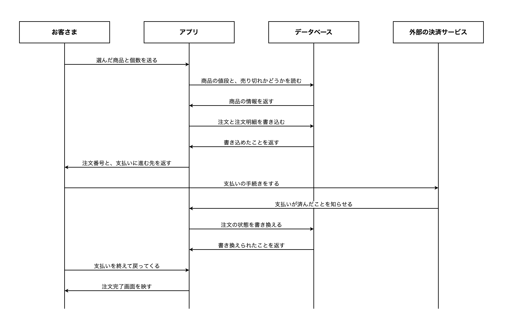
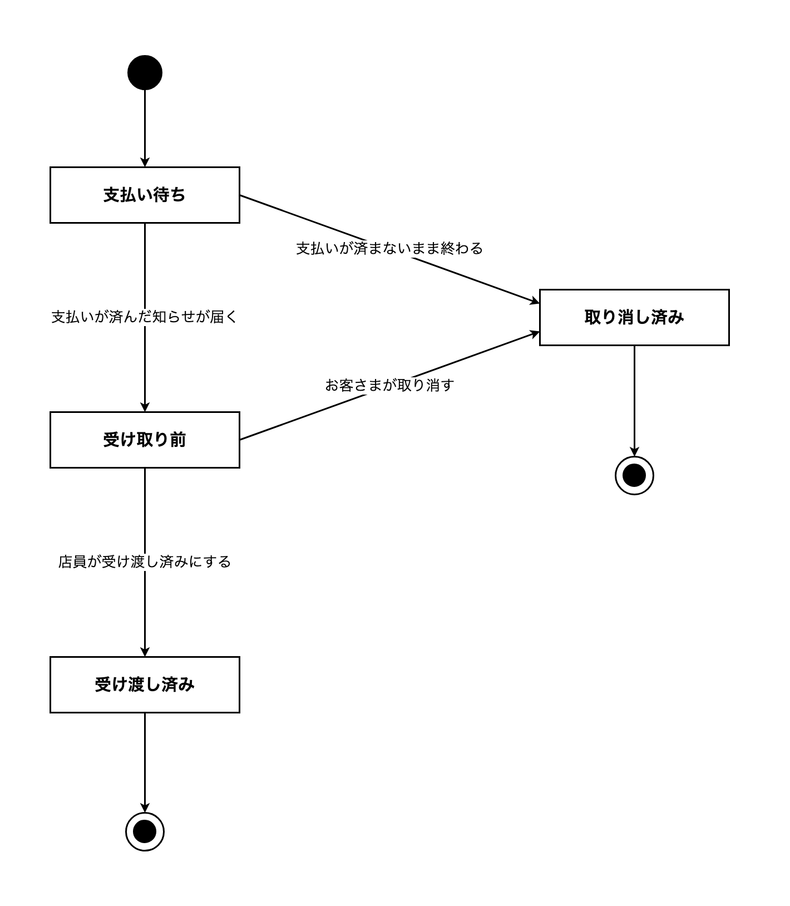

# 13-6-4: 振る舞いの設計 - 設計演習

## 📌 この演習について

13-2-3 で受け取ったカフェのモバイルオーダーアプリの続きとして、振る舞いの設計書を白紙から作ります。

Chapter 5 までに決めたのは、どんな画面があり、その裏側にどんな入口があり、誰がそれを使ってよく、何をどんな形で覚えておくかです。どれも、そこに何があるかを表した図と表でした。注文が1件登録されるまでに何がどの順で起きるのか、登録されたその1件がそのあとどう移り変わるのか、外れたときに何をするのか。この3つは、ここまでの設計書のどこにも書かれていません。

Chapter 5までの成果物が手元にない方は、`answers/13-5/` の中身を `docs/13-5/` にコピーしてから始めてください。

---

## 🎯 演習課題

### 📋 与えられる仕様

新しい仕様は渡されません。使うのは、これまでに自分が作ったものです。

1. 13-2-3 で受け取ったカフェのモバイルオーダーアプリの仕様書。
2. 13-2-3 で作った機能一覧・確認事項リスト・ユースケース図・ユースケース記述。
3. 13-3-5 で作った画面一覧・画面遷移図・ワイヤーフレーム・画面項目定義・入力チェック表・メッセージ一覧。
4. 13-4-3 で作ったAPI設計書・権限マトリクス。
5. 13-5-5 で作った概念モデル・ER図・テーブル定義書・CRUD表。

手元に無い方は、13-2-3 から 13-5-5 までの模範解答を土台にして構いません。ただし、自分の解答と模範解答のどちらを土台にするかを最初に決めて、最後までそちらで通してください。途中で混ぜると、画面・エンドポイント・テーブルの数が合わなくなります。

このあとに出てくるQ番号・画面のID・APIのIDは、すべて模範解答のものです。自分の解答で進める方は、同じ内容を書いた自分の行や、自分の画面一覧・API設計書の番号に読み替えてください。

流れと状態を考えるときに何度も戻ることになる箇所を、仕様書から引いておきます。

> お客さまには、まずその日のドリンクとフードの一覧を見ていただきたいです。商品の名前と値段と、短い説明が並んでいれば十分です。飲みたいものが決まったら、商品と個数を選んで、そのままアプリの中で支払いまで済ませられるようにしてください。

> 注文したあとは、その注文がお店に届いているかどうかを、アプリで確認できるようにしてください。列に並ばずに注文するぶん、「ちゃんと注文できたのだろうか」と不安になるお客さまが多いと思うのです。それから、注文したあとで急に来られなくなることもありますので、注文の取り消しもできるとよいと思います。

支払いについては、13-3-5・13-4-3 で置いた前提をそのまま引き継ぎます。支払いそのものは外部の決済サービスに任せ、皆さんが設計するのは、支払いを依頼して結果を受け取るところまでです。

**順番を1つだけ、先に確かめておいてください**。13-4-3 のAPI設計書では、注文を登録してから、支払いに進むための行き先を返す形にしました。13-2-3 で書いたUC-02の基本フローは、支払いをしてから注文を登録する順でしたが、この演習ではAPI設計書のほうに合わせます。シーケンス図は、🔑 **注文を登録してから支払いへ引き渡す順**で描いてください。

注文の状態については、宿題が2つ届いています。13-4-3 では「受け取り前」「受け渡し済み」の2つで足りるのかをChapter 6で決めると書き、13-5-5 のテーブル定義書では `orders` の状態を表す列に、取りうる値をChapter 6で決めると書きました。この2つを、この演習で引き取ります。決めた値の一覧は遷移表が持つので、13-5-5 のテーブル定義書は書き換えません。

13-2-3 から 13-5-5 までで書き出した確認事項は、**未確認のまま**です。返事を待たずに、そこに書いた自分の想定の上で設計を進めてください。新しく決めきれない点が出てきたら、自分のリストの最後の番号の続きから書き足します（模範解答を土台にした方は `Q-14` からです）。新しいファイルは作らず、13-2-3 で作った確認事項リストに行を足してください。

### ✏️ 作成する成果物

次の5つを作ります。保存先は、13-6-1 で作った `docs/13-6/` です。ファイル名の先頭は `cafe-` を付けます。

1. シーケンス図。**1本だけ**描きます。描く範囲は、お客さまが「支払いに進む」を押してから、支払いを終えて注文完了画面が映るまでです（SC-02 カート画面からSC-04 注文完了画面まで）。13-4-3 で決めたAPI-02が動くのは、この範囲の前半だけで、支払いの手続きとその結果を受け取るところは、API-02の外になります。draw.ioで描き、`.drawio` ファイルとPNG画像の2つを残します。
2. 状態遷移図。注文1件の状態を描きます。こちらも `.drawio` とPNG画像の2つです。
3. 遷移表。`今の状態`・`起きること`・`次の状態`・`条件` の4列で作ります。
4. 例外一覧。`起きること`・`どこで気づくか`・`そのときの処置`・`利用者への知らせ` の4列で作ります。
5. 確認事項リストへの追記（`docs/13-2/cafe-questions.md`）。

シーケンス図を1本に絞るのは、13-3-5 でワイヤーフレームを1枚に絞ったのと同じ理由です。全部の機能ぶんを描いても、同じ形の図が並ぶだけで、決まることが増えません。1本選ぶなら、登場するものがいちばん多い流れを選びます。

この1本には、外部の決済サービスが登場します。13-3-5 で、本来はアクターとして描く相手だけれども今回はユースケース図をそのままにする、と保留にした相手です。ここで初めて図の上に出てきます。

### ✅ セルフチェック

- [ ] シーケンス図のライフラインが4本以内で、それぞれが何を表しているかを説明できる
- [ ] シーケンス図の矢印に、何を頼んだか（何を返したか）が日本語で書かれている
- [ ] シーケンス図の並びが、13-4-3 で決めたAPIの動く順と合っている
- [ ] 外部の決済サービスとのやり取りが、どこからどこまでかを指させる
- [ ] 状態遷移図のすべての状態に、そこへ向かう矢印が1本以上ある
- [ ] 出ていく矢印が無い状態が、終わりの状態だけになっている
- [ ] 13-2-3 で決まっている「受け取り前」「受け渡し済み」が、状態の名前として使われている
- [ ] 状態を増やしたなら、その状態へ移すのが誰の、どの操作なのかを説明できる
- [ ] 遷移表のすべての行が、状態遷移図の矢印1本ずつと対応している（数が合っている）
- [ ] 注文を取り消せるのがどの状態までかが、状態遷移図の矢印の引き方で決まっている
- [ ] 例外一覧のすべての行に、そのときシステムが何をするかが書かれている
- [ ] まとめて成功・まとめて失敗させる範囲がどこまでかを、指させる
- [ ] 外部の決済サービスへの依頼を、その範囲の内と外のどちらに置いたかを説明できる
- [ ] 例外一覧に、13-3-5 で決めた文言をそのまま写した行がない
- [ ] 例外一覧に、13-4-3 で決めたステータスコードを書いた行がない
- [ ] 決めきれなかった点を、勝手に決めずに確認事項リストの続きの番号へ書き足している
- [ ] **この設計書を初めて見た人が、質問せずに実装へ進めそうか**

> 💡 **合格基準**: 設計書のゴールは「それを見たら、人でもAIでもすぐ実装に入れる状態」です。答えられない質問が残っていそうなら、そこが設計の穴です。

> 🚀 **ここから先は、自分の力で作ってみましょう！**

---

## 💡 ヒント

手が止まったときの戻り先は決まっています。シーケンス図の描き方は 13-6-1、状態遷移図と遷移表は 13-6-2、洗い出しの3つの問いと処置の3つの型は 13-6-3、draw.ioの操作は 13-1-3 です。

注文の状態がいくつ要るかで手が止まったら、それは正しい止まり方です。13-2-3 で決まっているのは2つだけですが、13-4-3 で Q-10 として送った「支払いが済んだことを受け取れないまま終わった注文」は、その2つのどちらでもありません。

---

## 🏃 実践

### 🧠 先輩エンジニアの思考プロセス

先輩エンジニアは、ここまでの設計書を次の順で振る舞いに落とし込みます。

| Step | やること | 説明 |
|:-----|:---------|:-----|
| 1 | 描く流れを1つ選び、登場するものを並べる | 範囲は課題のとおり（SC-02からSC-04まで） |
| 2 | やり取りを上から順に並べて、シーケンス図を描く | 13-4-3 で決めたAPIの動く順に合わせる。返りの矢印も引く |
| 3 | 注文が取りうる状態を洗い出して、名前を付ける | すでに決まっている言葉を使う。増やすときは、それを使う機能があるかを確かめる |
| 4 | 状態遷移図を描いて、遷移表と突き合わせる | 図の矢印1本が、表の1行になる。数が合わなければどちらかが漏れている |
| 5 | シーケンス図と状態遷移図に、3つの問いを当てる | 返ってこないことは。頼んだとおりにならないことは。相手が違う状態になっていることは |
| 6 | 洗い出したものに処置を決めて、例外一覧を書く | 3つの型のどれにもならないものは、確認事項リストへ |

### 📝 ステップバイステップで作る

#### Step 1: 描く流れを選んで、登場するものを並べる

この図は依頼者にも見せるものなので、13-6-1 で確認したとおり、業務の言葉で並べます。お客さまと、アプリと、13-5-5 で決めたデータの置き場所と、支払いを任せる相手の4つです。ライフラインは4本に収まります。

#### Step 2: シーケンス図を描く

上から順にやり取りを並べます。手がかりは、13-4-3 で書いたAPIの詳細です。「送るもの」と「返すもの」に書いたものが、そのまま矢印に添える文字になります。

ここで手が止まるとしたら、支払いが済んだことをアプリがどうやって知るのか、のところです。13-4-3 で Q-10 として送った論点が、図の上では矢印1本の向きとして現れます。決めきれないと感じたら、想定を1つ置いて描き、その想定を確認事項リストで確かめる形にします。

「支払いに進む」を押した時点で、値段はどこから来るのかも考えてください。カート画面に映っていた値段をそのまま信じるのか、書き込む前にもう一度読み直すのか。読み直すなら、読みに行く矢印と返ってくる矢印で、2本増えます。

#### Step 3: 注文が取りうる状態を洗い出す

13-2-3 で決まっているのは「受け取り前」と「受け渡し済み」の2つです。この2つで、注文が生まれてから役目を終えるまでを表せるかを確かめます。

Step 2 で描いた図をもう一度見てください。注文を書き込んだ時点では、まだ支払いは済んでいません。その注文を「受け取り前」と呼ぶかどうか、店員のタブレットの注文一覧画面（13-3-5 で作った画面）に並べてよいかどうかを、ここで決めます。

取り消した注文の置き場所も要ります。13-5-5 のCRUD表では、注文の取り消しを `U` としました。行を消さずに残すと決めたので、残った行が取り消されたものだと分かる名前が要ります。

状態を足すときは、13-6-2 で確認したとおり、その状態に入ったことを誰がどうやって記録するのかを先に確かめてください。

#### Step 4: 状態遷移図を描いて、遷移表と突き合わせる

draw.ioで、四角と矢印で描きます。始まりと終わりの印は、13-6-2 の「draw.ioでの操作」のとおりに置きます。

描けたら遷移表を書き、矢印の本数と行数を数えます。ここで、取り消せる期限をどう表すかを決めることになります。13-2-3 の Q-01 で自分が書いた想定を、いま持っている状態の名前で表せるかどうかが、この演習でいちばん考えるところです。表せないと分かったら、想定のほうを書き直して、書き直したことを確認事項リストへ送ってください。

#### Step 5: 3つの問いを当てる

Step 2 の図の矢印を1本ずつたどり、返ってこない場合と、頼んだとおりにならない場合を探します。値段を読みに行く矢印、書き込む矢印、支払いの手続きへ向かう矢印、それぞれで外れ方が違います。

そのあと、Step 4 の図と突き合わせます。店員が一覧を開いてから「受け渡し済みにする」を押すまでの間に、その注文がどうなっている可能性があるかを考えてください。13-4-3 のエラーレスポンス一覧で、すでに同じ形の話を書いています。

描いた1本の図の外にも、注文の状況を確かめる操作や、取り消しの操作があります。そちらにも同じ3つの問いを当ててください。

#### Step 6: 例外一覧を書いて、保存する

洗い出した1つずつに、処置を決めます。3つの型のどれかを書き、戻す範囲が特別な行には、どこまで戻すのかを書き添えてください。

外部の決済サービスへの依頼を、まとめて失敗させる範囲の内と外のどちらに置くかを、ここで決めます。13-6-3 で確認した目安が、そのまま使えます。

書き終えたら、`docs/13-6/` に6つのファイルを保存します。

```text
docs/13-6/
├── cafe-sequence.drawio    # シーケンス図（編集用）
├── cafe-sequence.png       # シーケンス図（表示用）
├── cafe-state.drawio       # 状態遷移図（編集用）
├── cafe-state.png          # 状態遷移図（表示用）
├── cafe-state-table.md     # 遷移表
└── cafe-exceptions.md      # 例外一覧
```

13-6-1 から 13-6-3 で保存した `post-` のファイルは、同じフォルダにそのまま置いておきます（上のツリーでは省きました）。

確認事項リストは `docs/13-2/cafe-questions.md` に書き足すので、コミットには両方のフォルダを含めます。

```bash
# アプリのフォルダの中で実行する
git add docs/13-2 docs/13-6
git commit -m "13-6: カフェのモバイルオーダーアプリの振る舞いの設計を追加"
git push origin main
```

---

## 📖 模範解答

<details>
<summary>📖 作り終えたら開く（模範解答）</summary>

**注文を登録するシーケンス図（解答例）**

自分の図とは、ライフラインの並びと、矢印の本数と順番だけを見比べてください。



2本目と3本目で、商品をもう一度読み直しています。カート画面に映っていた値段は、お客さまの手元にあるものなので、そのまま信じて書き込むと、値段が変わっていたときに気づけません。売り切れも同じです。

7本目と8本目の2本だけ、頼みと返りの組になっていません。支払いの手続きは、お客さまが外部の決済サービスへ直接進んで行うので、アプリからの依頼はありません。7本目に返りを引いていないのは、手続きの中身がこちらの設計の外で進むからです。8本目は、その結果が決済サービスから届く新しいやり取りで、こちらが頼んだ返事ではありません。「頼む矢印を引いたら、その返りも引く」が当てはまらないのは、この2本だけです。なお、8本目を受ける入口をAPIとして持つかどうかは、Q-10 の返事しだいで、持つと決まればAPI設計書にエンドポイントが1本増えます。

最後の2本は、支払いを終えたお客さまがアプリへ戻ってくるところです。画面遷移図で、支払いの画面から注文完了画面へ引いた矢印1本が、ここでは2本のやり取りとして開かれています。

**注文の状態遷移図（解答例）**



**遷移表（解答例）**

| 今の状態 | 起きること | 次の状態 | 条件 |
|:---------|:-----------|:---------|:-----|
| （注文がまだ無い） | お客さまが「支払いに進む」を押す | 支払い待ち | - |
| 支払い待ち | 支払いが済んだ知らせが届く | 受け取り前 | - |
| 支払い待ち | 支払いが済まないまま終わる | 取り消し済み | - |
| 受け取り前 | お客さまが取り消す | 取り消し済み | - |
| 受け取り前 | 店員が受け渡し済みにする | 受け渡し済み | - |

状態は4つです。矢印は全部で7本ありますが、終わりの印へ向かう2本は表に行を作らないので、残る5本（始まりから出ている1本を含みます）が表の5行にあたります。`orders` の状態を表す列に入る値は、この4つになります。

条件の欄は、5行とも `-` です。取り消しの操作は、受け渡しが済んだあとにも届きます。ただ、そのときの状態は「受け渡し済み」なので、「お客さまが取り消す」の行には当てはまりません。取り消せるのが受け取り前までだという決定は、受け渡し済みから取り消し済みへの矢印を引かなかったことが表しています。これが、Q-01 への答えになっています。

「店員が受け渡し済みにする」の主語が店員だけで、「お客さまが取り消す」の主語がお客さまだけになっているところにも注目してください。ユースケース図で店員とUC-04「注文を取り消す」の間に線を引かなかったことが、ここでは矢印の主語として現れます。

**例外一覧（解答例）**

| 起きること | どこで気づくか | そのときの処置 | 利用者への知らせ |
|:-----------|:---------------|:---------------|:-----------------|
| 選ばれた商品が、すでに売り切れている | 商品の値段と売り切れを読むとき | やめて元に戻す（注文も注文明細も書き込まない） | その商品が売り切れたことと、選び直していただきたいこと |
| 注文明細を書き込む途中で失敗した | 注文を登録するとき | やめて元に戻す（先に書き込んだ注文も消す） | 注文を受け付けられなかったことと、もう一度お試しいただきたいこと |
| 支払いが済んだ知らせが、いつまでも届かない | 支払いの結果を待つとき | 待って、3回まで決済サービスへ支払いの結果を確かめ直す。それでも確かめられなければ取り消し済みにする | 支払いが確かめられなかったことと、お心当たりのある場合はお問い合わせいただきたいこと |
| お客さまが入力した注文番号の注文が見つからない | 注文の状況を確かめるとき | やめて元に戻す | 見つからないことと、注文番号をお確かめいただきたいこと |
| 受け渡し済みにしようとした注文が、すでに取り消されている | 受け渡し済みにするとき | やめて元に戻す | その注文が取り消されていること |
| 受け取り前でなくなった注文を、取り消そうとした | 取り消すとき | やめて元に戻す | すでに取り消せない状態であること |

1行目と4行目は、エラーレスポンス一覧にも同じ異常が並んでいます。同じことを2枚に書いているように見えますが、決めていることが違います。あちらが決めたのは返すステータスコードと中身で、この表が決めたのは書き込みをどこまで戻すかです。両方に同じ異常が並んでいて構いません。

5行目と6行目は、どちらも、画面を見てから押すまでの間に注文の状態が変わっている場合です。

**確認事項リストへの追記（解答例）**

| ID | 確認したいこと（こちらの想定つき） | 関係する機能 | 状態 |
|:---|:-----------------------------------|:-------------|:-----|
| Q-14 | ご注文の取り消しは、まだお渡ししていないあいだであればお受けする想定です。店員が商品を作り始めたあとはお受けできないようにする必要はありますか | F-04・F-05 | 未確認 |
| Q-15 | 支払いが済んだお知らせが届かないご注文は、5分ほど間を空けて3回まで決済サービスへ確かめ直し、それでも確かめられなければ取り消し扱いにする想定です。この待ち時間と回数でよろしいでしょうか | F-02 | 未確認 |

**迷いやすいところ**

**取り消せる期限を「受け取り前のあいだ」にした理由**

課題では、「店員が商品を作り始める前まで取り消せる」という想定を立てていました。ところが、この設計には「作り始めた」ことを表す状態がありません。作り始めたかどうかをアプリが見分けるには、店員が「作り始めました」と記録する操作と、それを受ける入口と、そのための状態が要ります。仕様書には、店員が注文を見て渡す話しか書かれていません。

条件の欄に「店員が作り始める前まで」と書いてしまうのも、うまくいきません。**条件に書けるのは、システムが判断できることだけ**です。作り始めたかどうかは、いまの設計ではどこにも記録されていないので、システムには判断できません。

そこで、想定のほうを「まだお渡ししていないあいだは取り消せる」に書き直し、書き直したことを Q-14 として確認に出しました。

</details>

---

## 🚀 まとめ

- シーケンス図は1本に絞りました。1本描けば、どこで外れうるかを洗い出す材料になります。
- 図に登場させるものは、見せる相手で選びます。この演習の図は依頼者にも見せるものなので、お客さま・アプリ・データベース・外部の決済サービスという業務の言葉で並べました。
- 「調理中」を足すかどうかは、機能を足すかどうかの相談になるので、こちらでは決めずに確認へ送りました。
- 決まっていた2つの状態だけでは、注文の一生を表せませんでした。前後に1つずつ足して4つになり、注文の状態を表す列に入る値がここで決まりました。
- 取り消せる期限のように、想定と設計が食い違ったときは、想定のほうを書き直して確認へ送ります。決めきれないことに自分の想定を添えて確認に出すやり方は、Chapter 2からここまでの5回の演習で、どれも同じでした。

これでChapter 6は終わりです。決めたのは動きだけなので、この動きをどんなまとまりのプログラムに分けて作るのかは、Chapter 7 で決めます。

---
