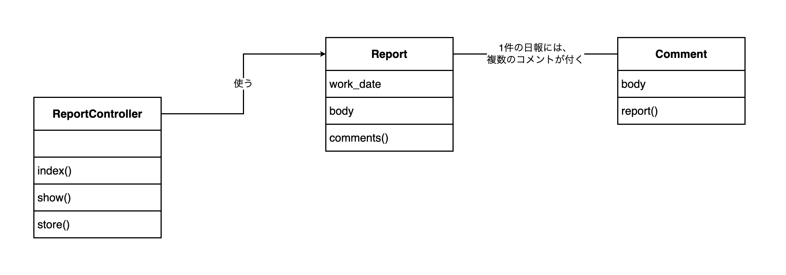
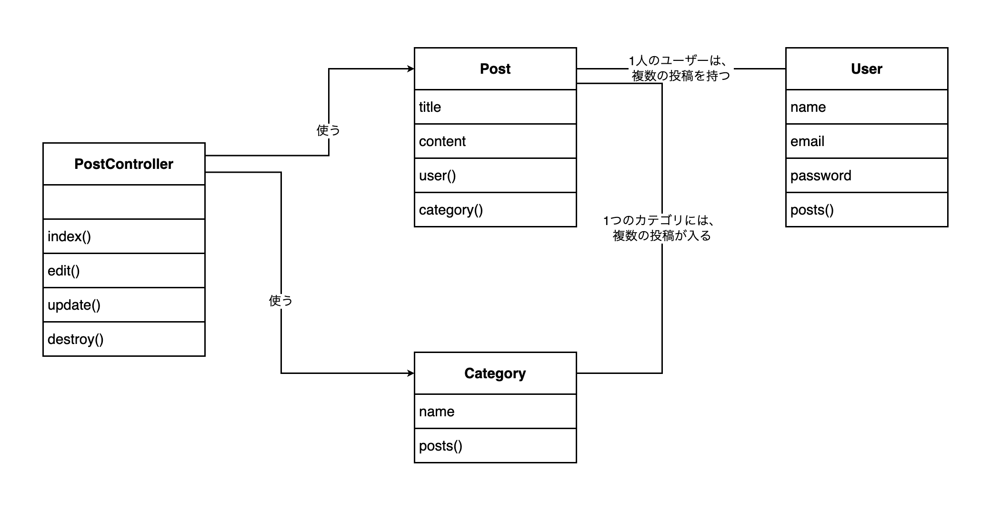
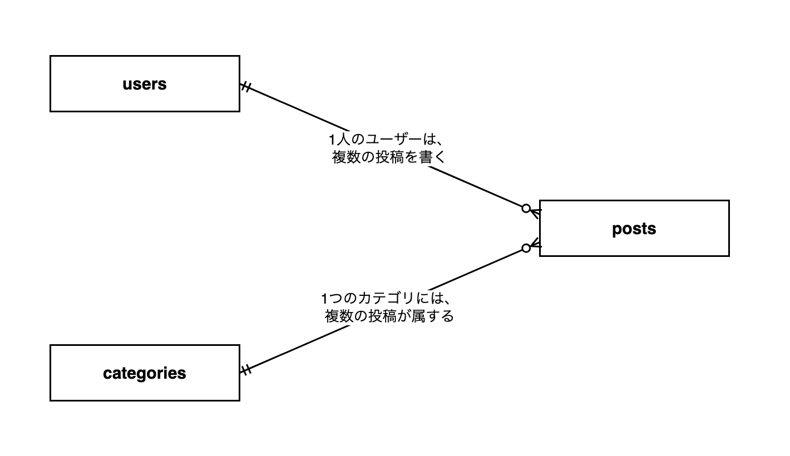

# 13-7-1: クラス図 - 構造を描く

## 🎯 このセクションで学ぶこと

- コードの中にあるクラスと、そのつながりを、1枚のクラス図に描けるようになる。
- クラス図に書くものと書かないものを、決まりに沿って選べるようになる。
- 同じアプリのER図とクラス図を並べて、2枚が別のことを表していると説明できるようになる。

---

## 導入：どのファイルを開けばよいのかが分からなくなる

投稿を書き換える処理は、1つのファイルに全部書いても、いくつかのファイルに分けても、画面から見れば同じように動きます。分け方を決めていなければ、実装する人がその場で決めます。1人で最後まで書き切るあいだは、それで通ります。

困るのは半年後です。「投稿のカテゴリを選べる範囲を変えたい」と言われたときに、どのファイルを開けばよいのかが、書いた本人にも分からなくなります。

クラスの書き方そのものは、7-3「オブジェクト指向の入門」で学びました。1つずつのクラスの中身は、ファイルを開けば読めます。ファイルを開いて回らないと分からないのは、どのクラスがどのクラスを知っているのかというつながりのほうです。そのつながりを1枚に置いたのが、クラス図です。

---

## クラス図の読み方

題材は、社内の日報アプリです。担当者が1日の終わりに日報を書き、1件の日報にコメントが何件でも付きます。

**日報アプリのクラス図**



四角が3つあり、四角1つがクラス1つです。`Report` が日報、`Comment` がコメント、`ReportController` が画面からの求めを受け取る係にあたります。

名前が英語なのは、実物のコードのクラス名をそのまま写しているからです。クラス図は、書いたコードの構造をそのまま写す図です。名前を日本語に直すと、図とファイルを突き合わせられなくなります。

### 四角の中身

四角は3つの段に分かれています。上がクラス名、真ん中がそのクラスの持つデータ、下がそのクラスのできることです。`Report` は日付と本文を持ち、コメントを取り出せます。名前だけが書かれた四角と違って、ファイルを開かなくても中身が分かります。

`ReportController` の真ん中の段は空です。データを持たず、できることだけを持つクラスだからです。空の段も「持っているデータが無い」という情報なので、段そのものは残します。

### 線が無いところ

`ReportController` と `Comment` のあいだには、線がありません。コメントを直接さわらない作りだ、ということです。13-2-2 でユースケース図を読んだときと同じで、線を引かないことも1つの決定です。

### 2種類の線

`Report` と `Comment` を結ぶ線には、矢印が付いていません。どちらも相手を知っている間柄だからです。`ReportController` から `Report` へ伸びる線には矢印が付いていて、`ReportController` が `Report` を使うという片方向の関係を表します。13-5-2 で見たER図の線は、向きを持ちませんでした。クラス図には、向きを持つ線もあります。

線に添えた文は、いくつといくつが対応するかを表します。「1件の日報には、複数のコメントが付く」と書いてあるので、日報1件にコメントが何件でも付く、と読みます。

---

## クラス図の描き方

この教材で使う記号は、次のとおりです。

| 記号 | 表すもの |
|:-----|:---------|
| 3つの段に分けた四角 | クラス1つ。上の段にクラス名、真ん中の段に属性、下の段に操作 |
| 矢印の無い線（関連） | 2つのクラスが、互いに相手を知っていること |
| 線に添えた文 | いくつといくつが対応するか（多重度） |
| 矢印の付いた線（使う関係） | 片方がもう片方を使っていること。根元が使う側、先端が使われる側 |

真ん中の段に書くものを**属性**（そのクラスが持つデータ）、下の段に書くものを**操作**（そのクラスができること）と呼びます。7-3-2「プロパティとメソッド」で学んだプロパティが属性、メソッドが操作にあたります。クラス図では、この2つの呼び方で通します。

> 💡 **TIP**: 正式なUMLでは、多重度を線の両端に `1` や `*` と書きます。この教材では、13-5-2 のER図と同じように、線に文を添える形で通します。ほかの資料で `1` と `*` を見かけたら、`*` が「複数」だと読み替えてください。

### 図に書かないもの

| 書かないもの | 扱い |
|:-------------|:-----|
| 属性の型 | 13-5-3 で作ったテーブル定義書が持っています。同じことを2か所に書きません |
| 操作の型 | 何を受け取って何を返すかは、コードを開けば分かります |
| `public` などの区別を表す記号 | この教材では使いません |
| `extends` の相手 | 引き継ぐ相手はLaravelが用意したクラスで、自分たちが決めた分け方ではありません |
| `id`・`created_at`・`updated_at` | Laravelが用意する列です。全部の四角に同じ3行が並ぶと、そのクラスに固有の情報が読みにくくなります |
| 相手を指す列（`user_id` のような列） | 線が同じことを表します |

`extends` について補足します。`app/Models/` のモデルは、`class Post extends Model` のように、`extends` に続けて別のクラスの名前が書かれています。9-4-1「Eloquent ORMとは」で読んだとおり、`extends` は親のクラスの機能を引き継ぐ書き方です。引き継ぐ相手はモデルによって違いますが、どれもLaravel側のクラスなので、図には描きません。

### 描く手順

1. 図に出すクラスを決めます。出すのは、🔑 **そのアプリの決めごとが書かれているクラス**です。`app/Models/`・`app/Http/Controllers/`・`app/Policies/` に置かれているクラスがこれにあたります。Laravelやログインのしくみが用意した部品は出しません。
2. クラスごとに四角を置き、上の段にクラス名を英語のまま書きます。
3. 真ん中の段に属性を書きます。手がかりは `$fillable` に並んでいる列です。そこから、上の表で書かないと決めたものを除きます。
4. 下の段に操作を書きます。そのクラスに書かれているメソッドを、末尾に `()` を付けて書きます。
5. 互いを知っているクラスどうしを、矢印の無い線で結びます。線には「1件の日報には、複数のコメントが付く」の形で1文を添えます。
6. 片方がもう片方を使っているだけの関係は、矢印の付いた線で結び、線に「使う」と書きます。

手順5と手順6の見分け方は、相手をたどるメソッドが両方のクラスにあるかどうかです。両方にあれば矢印の無い線、片方だけなら矢印の付いた線になります。

### draw.io での操作

新しく覚える操作はありません。四角を置いて文字を入れるのと、四角どうしを線でつなぐのは 13-1-3、線に文字を入れるのと矢印を引くのは 13-3-2 で学んだとおりです。

3つの段に分けた四角は、**四角を縦に並べて**作ります。いちばん上にクラス名、その下に属性、いちばん下に操作を置きます。辺をぴったり付けても、少し離しても構いません。左の端がそろっていれば、1つのクラスとして読めます。

いちばん上の四角をドラッグしてみて、下の四角も一緒に動いたら、下の四角が上の四角の中に入っています。その場合は、下の四角をいったん離れた場所へドラッグしてから、置き直してください。

1つの四角に複数行の文字を入れる操作は学んでいないので、属性が2つあるクラスは、属性の段を四角2つで作ります。日報アプリの `Report` なら、属性が2つ・操作が1つなので、四角は縦に4つ並びます。書くものが無い段も、四角を1つ置いて、中を空のまま残します。

線を引くのは、縦に並べた四角のうち、いちばん上のクラス名の四角からです。属性や操作の四角からは引きません。

---

## 🏃 描いてみよう

題材は、13-1-3 で自分のリポジトリにした投稿アプリ（`post-app-practice`）です。13-5-2 でER図を描き、13-5-3 でテーブル定義書を作ったのと、同じアプリです。今度は、そのデータを扱っているコードの側を図にします。

`app/` の中には、`PostPolicy` を含めて5つのクラスがあります。この節で描くのは、そのうち `PostPolicy` を除いた4つです。`PostPolicy` は 13-4-2 で権限マトリクスに書いた決めごとを、そのままクラスにしたものです。どこへどうつなぐかはコントローラーの1行を読み解く必要があるので、13-7-3 の演習でまとめて扱います。

### Step 1: 図に出すクラスを選ぶ

`~/laravel-practice/post-app-practice/` をVS Codeで開き、`app/Models/`・`app/Http/Controllers/`・`app/Policies/` の3つのフォルダを見てください。コードを読むだけなので、Dockerは起動しなくて構いません。

`app/Http/Controllers/` には、`PostController.php` のほかに `Controller.php` も並んでいます。こちらはクラスの中身が1行だけで、どのLaravelアプリにも同じものが置かれています。`PostController` はこのクラスを `extends` していますが、描き方で決めたとおり、`extends` の相手は図に描きません。

`app/Models/` の `User.php` は、図に出します。ログインのしくみが使うクラスですが、このアプリの `$fillable` とリレーションが書かれていて、投稿とのつながりを持っているからです。

### Step 2: 属性と操作を書き出す

選んだクラスのファイルを1つずつ開き、`$fillable` に並んでいる列と、そのクラスに書かれているメソッドを書き出します。書き出したあとに、手順3と手順4で書かないと決めたものが混ざっていないか、もう一度見てください。

`Post` の `$fillable` には4つの列が並んでいます。そのうち2つは、図に書かない側です。

### Step 3: 四角を並べて、線を引く

draw.ioで四角を縦に並べ、書き出したものを入れていきます。段の数はクラスによって変わります。たとえば `User` は属性が3つなので、属性の段が四角3つになります。並べ終えたら、手順5と手順6のとおりに線を引きます。

つながりの手がかりは、Step 2で書き出したメソッドです。相手のクラス名が出てくるメソッドを持っているなら、そのクラスは相手を知っています。`PostController` の側は、メソッドの中で相手のクラス名を書いているかどうかを見てください。

### Step 4: 13-5-2 で描いたER図と見比べる

13-5-2 の 🏃 で描いて `docs/13-5/` に保存したER図を開き、いま描いた図の隣に並べてください。同じアプリを表した2枚なのに、違うところが3つあります。四角の中身・四角になっているもの・線が表しているもののそれぞれに目を向けて、何が違うのかを書き出してから、答え合わせを開きます。

### Step 5: docs/13-7/ に保存する

draw.ioで `post-class.drawio` の名前で保存し、PNGも `post-class.png` の名前で書き出します。書き出した2つのファイルは、13-1-3 のとおりに `docs/13-7/` へ移します。ファイル名の先頭に付けた `post-` は、13-5 で使ったものと同じで、この投稿アプリを指します。

```bash
# アプリのフォルダの中で実行する
mkdir -p docs/13-7
git add docs/13-7
git commit -m "13-7: 投稿アプリのクラス図を追加"
git push origin main
```

<details>
<summary>📖 描き終えたら開く（答え合わせ）</summary>

**投稿アプリのクラス図（解答例）**



四角の中身の根拠は、`app/Models/` の3つのファイルです。

```php
// app/Models/Post.php（抜粋）
class Post extends Model
{
    protected $fillable = [
        'user_id',
        'category_id',
        'title',
        'content',
    ];

    public function user(): BelongsTo
    {
        return $this->belongsTo(User::class);
    }

    public function category(): BelongsTo
    {
        return $this->belongsTo(Category::class);
    }
}
```

`$fillable` は4つですが、属性に書いたのは `title` と `content` の2つです。`user_id` と `category_id` は相手を指す列で、線が同じことを表しています。操作は `user()` と `category()` の2つです。

```php
// app/Models/User.php（抜粋）
class User extends Authenticatable
{
    protected $fillable = [
        'name',
        'email',
        'password',
    ];

    public function posts(): HasMany
    {
        return $this->hasMany(Post::class);
    }
}
```

```php
// app/Models/Category.php（抜粋）
class Category extends Model
{
    protected $fillable = [
        'name',
    ];

    public function posts(): HasMany
    {
        return $this->hasMany(Post::class);
    }
}
```

`PostController` の属性の段は空で、操作にはメソッドの名前が並びます。

```php
// app/Http/Controllers/PostController.php（抜粋）
class PostController extends Controller
{
    public function index()
    {
        $posts = Post::with(['user', 'category'])->latest()->get();

        return view('posts.index', compact('posts'));
    }

    public function edit(Post $post)
    {
        // ...
        $categories = Category::orderBy('id')->get();
        // ...
    }

    public function update(Request $request, Post $post)
    {
        // ...
    }

    public function destroy(Post $post)
    {
        // ...
    }
}
```

`PostController` から `Post` へ線を引く根拠は `Post::with(...)` の行、`Category` へ線を引く根拠は `Category::orderBy('id')` の行です。逆向きの線がないのは、`Post` も `Category` も、自分をどのコントローラーが呼ぶのかを知らないからです。

**13-5-2 の答え合わせに載っていたER図**



2枚を並べると、ER図の四角は3つ、クラス図の四角は4つです。違いは3つあります。

**違い1: できることが書いてある**。`Post` は `user()` と `category()` を持っています。ER図の `posts` に、そんな欄はどこにもありません。ER図が表すのは、覚えておくものの形だけです。

**違い2: 四角になるものが違う**。ER図には無かった `PostController` が、クラス図には現れています。データを1件も覚えないのでテーブルにはなりませんが、`app/Http/Controllers/` にファイルがあるのでクラスにはなります。🔑 **ER図はデータの置き場所、クラス図はプログラムのまとまり**を数えます。

**違い3: 線が表しているものが違う**。ER図の線は、13-5-2 で確かめたとおり、「多」の側の `posts` が相手を指す列（`user_id`・`category_id`）を持つことを表していました。クラス図の線は、`Post` の `user()` と `User` の `posts()` で、互いに相手をたどれることを表しています。さらにクラス図には、ER図に無かった向きのある線があります。

次の観点で、自分の成果物と見比べてください。

- [ ] クラスが4つで、`User`・`Post`・`Category`・`PostController` になっている
- [ ] どのクラスも、上からクラス名・属性・操作の3つの段に分かれていて、書くものが無い段は空のまま残してある
- [ ] クラス名・属性名・操作名が、コードの名前とそのまま同じになっている
- [ ] 属性に `id`・`created_at`・`updated_at`・`user_id`・`category_id` と、型を書いていない
- [ ] `extends` の相手と `Controller.php` を図に描いていない
- [ ] `User` と `Post`、`Category` と `Post` のあいだに矢印の無い線があり、いくつといくつが対応するかを読み取れる
- [ ] `PostController` から `Post` と `Category` へ矢印の付いた線が出ていて、「使う」と書いてある
- [ ] `docs/13-7/` に `.drawio` とPNGの2つがあり、GitHub上でPNGが表示される

設計に唯一の正解はありません。四角の置き方や線の曲がり方が解答例と違っていても、上の観点を満たしていれば合格です。そのうえで、判断が分かれやすい3点を補足します。

- **`user_id` を属性に書かなかった理由**: 違い3で見たとおり、どのユーザーの投稿かは線がすでに表しています。書いた図を間違いにはしませんが、書くならどちらか一方に決めて、図の中でそろえてください。
- **Laravelが用意する列を書かなかった理由**: `id` と `created_at`・`updated_at` は、どのモデルにもある列です。13-5-3 のテーブル定義書には、この3列も書きました。🔑 **設計書ごとに、書く粒度が違ってよい**という例です。
- **ビューとルートを入れなかった理由**: `resources/views/posts/index.blade.php` も `routes/web.php` も、クラスではありません。クラス図に出るのはクラスだけなので、`PostController` は入り、この2つは入りません。この2つを含めた置き場所のまとまりは、13-7-2 で別の図として扱います。

</details>

---

## 💡 よくある間違いと現場での使われ方

**間違い1: 名前だけの四角を並べる**

クラス名だけを書いて、属性と操作を空のままにすると、ER図とほとんど同じ図になります。書くものが本当に無いクラスは空のままで構いませんが、`$fillable` にもメソッドにも中身があるのに空なら、書き写しが済んでいないだけです。

**間違い2: 四角だけ並べて、線を引かない**

クラスを並べ終えたところで手を止めてしまう間違いです。1つずつのクラスの中身は、ファイルを開けば分かります。ファイルを開いて回らないと分からないのはつながりのほうで、そこがクラス図のいちばんの値打ちです。

**間違い3: 図が1枚で全部を表そうとする**

現場では、すべてのクラスを図にはしません。作りが込み入っているところを1枚か2枚描いて、残りはコードを読みます。新しく入った人が「このアプリはどんなまとまりでできているのか」を知るのに、いちばん早いのがこの1枚だからです。クラスを足したら図も直す、という運用が守られているかどうかで、設計書が生きているかどうかが分かります。

---

## ✨ まとめ

- クラス図に出すのは、そのアプリの決めごとが書かれているクラスです。Laravelやログインのしくみが用意した部品と、`extends` の相手は出しません。
- 四角は3つの段に分け、上からクラス名・属性・操作を書きます。書くものが無い段は、空のまま残します。
- 矢印の無い線は互いを知っている関係、矢印の付いた線は片方向の使う関係です。見分け方は、相手をたどるメソッドが両方のクラスにあるかどうかです。
- 多重度は、線に添えた1文で表します。
- ER図とクラス図の違いは、成果物として別に作るものではなく、同じアプリを描いた2枚の図そのものに現れます。テーブルにならないクラスがあり、線の意味も違います。
- draw.ioでは、四角を縦に並べて1つのクラスにします。線を引くのは、いちばん上のクラス名の四角からです。

---
