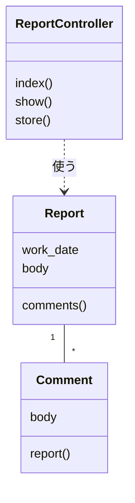
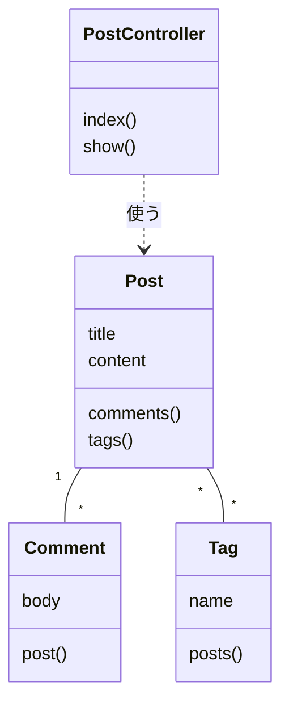
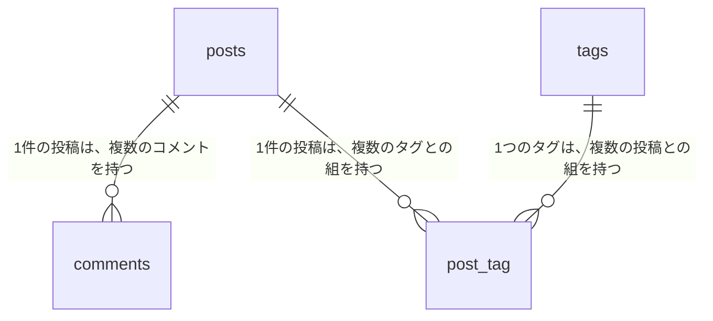

# 13-7-1: クラス図 - 構造を描く

## 🎯 このセクションで学ぶこと

- 自分が書いたコードのクラスと、そのつながりを、1枚のクラス図に描けるようになる。
- クラス図に書くものと書かないものを、決まりに沿って選べるようになる。
- 同じアプリのER図とクラス図を見比べて、2枚の違いを説明できるようになる。

---

## 導入：動きは決まりましたが、分け方はまだ決まっていません

Chapter 6で、何がどの順で起きて、注文がどう移り変わり、外れたときに何をするのかまで決まりました。それでも、まだ決めていないことがあります。その動きを作るプログラムを、どんなまとまりに分けて置くのかです。13-1-2の一覧のとおり、Chapter 6に続いて、このChapter 7「構造の設計」も詳細設計です。

同じ動きをするプログラムでも、分け方は何通りもあります。注文を書き込む処理を1つのファイルに全部書いても、いくつかのファイルに分けても、画面から見れば同じように動きます。分け方を決めていなければ、実装する人がその場で決めることになります。1人で最後まで書き切るあいだは、それで困りません。困るのは半年後です。「取り消しの決まりを変えたい」と言われたときに、どのファイルを開けばよいのかが、書いた本人にも分からなくなります。

クラスの書き方そのものは、7-3「オブジェクト指向の入門」で学びました。ただ、7-3-4で書いた `User` クラスは1つきりで、つながる相手がいませんでした。クラスが3つ4つと増えると、どのクラスがどのクラスを知っているのかは、ファイルを開いて回らないと分かりません。それを1枚に置いたのがクラス図です。

13-6-1でシーケンス図を描いたとき、9-4-9のブログシステムのたて線に `PostController` と `Post` という名前を立てました。あれはクラスの名前です。この章では、こうしたクラスそのものを、四角として描きます。

---

## クラス図の読み方

題材は、社内の日報アプリです。担当者が1日の終わりに日報を書きます。日報1件に、コメントは何件でも付きます。

このアプリのクラス図が、次の1枚です。



四角が3つあり、1つがクラス1つです。`Report` が日報、`Comment` がコメント、`ReportController` が画面からの求めを受け取る係にあたります。

名前が英語なのは、実物のコードのクラス名をそのまま写しているからです。Chapter 6で読んだ宅配便の再配達受付の図には、日本語の名前が並んでいました。あちらは業務の流れを表す図で、依頼者にも見せるものだったからです。クラス図は、書いたコードの構造をそのまま写す図なので、名前も実物のままにします。日本語に直すと、図とファイルを突き合わせられなくなります。

読み取れることが3つあります。

**1つ目は、そのクラスが何を持っていて、何ができるかです**。四角は3つの段に分かれていて、上がクラス名、真ん中がそのクラスの持つデータ、下がそのクラスのできることです。`Report` は日付と本文を持ち、コメントを取り出すことができます。名前だけが書かれた四角と違い、ファイルを開かなくても中身が分かります。

`ReportController` には、真ん中の段に書くものがありません。データを持たず、できることだけを持つクラスだからです。空の段も「持っているデータが無い」という情報なので、段そのものは残します。

**2つ目は、どのクラスがどのクラスを知っているかです**。`ReportController` と `Comment` のあいだには、線がありません。コメントを直接さわらない作りだ、ということです。13-2-2で、ユースケース図で線を引かないことが決定を表すと確認しました。ここでも同じで、線が無いことが1つの決定です。

**3つ目は、線に2種類あることです**。`Report` と `Comment` を結ぶ線には、矢印が付いていません。どちらも相手を知っている間柄だからです。`ReportController` から `Report` へ伸びる線には矢印が付いていて、`ReportController` が `Report` を使うという、片方向の関係を表します。13-5-2で、ER図の線は向きを持たないと確認しました。クラス図には、向きを持つ線もあります。なお、教材に載せたこの図では、使う関係の線が点線になっています。図の書き出し方の都合なので、皆さんの図では実線のままで構いません。

線に添えた `1` と `*` は、いくつといくつが対応するかを表します。`Report` の側が `1`、`Comment` の側が `*` なので、日報1件にコメントが何件でも付く、と読みます。

---

## クラス図の描き方

使う記号は4つです。

| 記号 | 表すもの |
|:-----|:---------|
| 3つの段に分けた四角 | クラス1つ。上の段にクラス名、真ん中の段に属性、下の段に操作 |
| 四角どうしを結ぶ線（関連） | 2つのクラスが、互いに相手を知っていること |
| 線に添えた文字 | 多重度 |
| 矢印の付いた線（使う関係） | 片方がもう片方を使っていること。根元が使う側、先端が使われる側 |

真ん中の段に書くものを**属性**（そのクラスが持つデータ）、下の段に書くものを**操作**（そのクラスができること）と呼びます。7-3-2「プロパティとメソッド」で学んだプロパティが属性、メソッドが操作にあたります。クラス図では、この2つの呼び方で通します。

線に添える**多重度**（いくつといくつが対応するか）は、8-1-5でER図を読んだときの「1対多」と同じことを表しています。

**図に書かないもの**

| 書かないもの | 扱い |
|:-------------|:-----|
| 属性の型 | 13-5-3で作ったテーブル定義書が持っています。同じことを2か所に書きません |
| 操作の型 | この教材では書きません。何を受け取って何を返すかは、コードを開けば分かります |
| `public` などの区別を表す記号 | この教材では使いません |
| `extends` の相手 | 図に描きません |

4つ目に補足します。`app/Models/` にあるモデルは、`class Post extends Model` のように、`extends` に続けて別のクラスの名前が書かれています。9-1-5「コントローラーの基礎」と9-4-1「Eloquent ORMとは」で読んだとおり、`extends` は親のクラスの機能を引き継ぐ書き方です。引き継ぐ相手はLaravelが用意しているクラスで、自分たちが決めたことではありません。そのため、この `extends` から後ろはクラス図に描きません。相手の名前はモデルによって違いますが、どれであっても同じです。

**描く手順**

1. 図に出すクラスを決めます。出すのは、🔑 **自分でファイルを作ったクラスだけ**です。Laravelが用意しているクラスは出しません。スターターキットを使ったアプリでは、誰が作ったかではなく、そのアプリで使われているかどうかで選びます。これは13-7-3で扱います。
2. クラスごとに四角を置き、上の段にクラス名を英語のまま書きます。
3. 真ん中の段に属性を書きます。書くのは、自分で決めた列だけです。`id` と `created_at`・`updated_at` はLaravelが用意する列なので書きません。相手を指す列（`post_id` のような列）も書きません。線が同じことを表すからです。
4. 下の段に操作を書きます。書くのは、自分で書いたメソッドだけです。末尾に `()` を付けます。
5. 互いを知っているクラスどうしを、線で結びます。線には、13-5-2でER図に書いたのと同じ形の1文を書きます（「1件の投稿は、複数のコメントを持つ」）。どちらから見ても複数になるときは、両方向を1文にします（「1件の投稿は、複数のタグを持ち、1つのタグは、複数の投稿に付く」）。
6. 片方がもう片方を使っているだけの関係も線で結び、その線には「使う」と書きます。

**draw.ioでの操作**

新しく覚える操作はありません。四角を置いて文字を入れるのと、四角どうしを線でつなぐのは13-1-3、線に文字を入れるのは13-3-1で学んだとおりです。

3つの段に分けた四角は、**四角を縦に並べて**作ります。いちばん上にクラス名、その下に属性、いちばん下に操作を置きます。辺をぴったり付けても、少し離しても構いません。左の端がそろっていれば、1つのクラスとして読めます。いちばん上の四角をドラッグしてみて、下の四角も一緒に動いたら、下の四角が上の四角の中に入っています。その場合は、下の四角をいったん離れた場所へドラッグしてから、置き直してください。

1つの四角に複数行の文字を入れる操作は学んでいないので、属性が2つあるときは、属性の段を四角2つで作ります。上の日報アプリの `Report` なら、属性が2つ・操作が1つなので、四角は縦に4つ並びます。書くものが無い段も、四角を1つ置いて、中を空のまま残します。

縦に並べた四角のうち、線を引くのはいちばん上のクラス名の四角からです。属性や操作の四角からは引きません。

教材に載せた図で線の端にある `*` は、「複数」を表す記号です。draw.ioで線の端に文字を置く操作は学んでいないので、多重度は手順5のとおり、線の真ん中に文で書いてください。

線の端に矢印が付くかどうかは、13-1-3で確認したとおり、draw.ioの既定のままで構いません。矢印を消す操作は学んでいないので、関連と使う関係は、線の形ではなく線に書いた文字で読み分けます。使う関係の線は、13-3-1で矢印を引いたときと同じく、使う側の四角からドラッグすると、先端が相手を指します。

---

## 🏃 描いてみよう

> 🔥 この演習では、設計書をAIに作らせずに、自分の手で書きましょう。記法や考え方についてAIに質問するのは構いませんが、成果物を生成させるのはTutorial 14までお預けです。まず自分の手と頭で書けるようになった人だけが、AIの作った設計を正しく評価できるようになります。

題材は、9-5-5「リレーション - ハンズオン演習」で作ったブログシステム（`relation-app-practice`）です。13-6-1でシーケンス図を描いたのは9-4-9のブログシステム（`eloquent-app-practice`）でしたが、今回開くのは、コメントとタグまである9-5-5の別のリポジトリです。13-5-1から13-5-3で、概念モデル・ER図・テーブル定義書・CRUD表を作ったのと、まったく同じアプリです。あのとき描いたER図の隣に置く図を、今度は描きます。なお、章末の演習でもカフェのモバイルオーダーアプリは使いません（理由は13-7-3で説明します）。

### Step 1: 自分で作ったクラスのファイルを数える

`~/laravel-practice/9-5-5_hands-on/relation-app-practice/` をVS Codeで開き、`app/Models/` と `app/Http/Controllers/` の中を見てください。パソコンに残っていない方は、9-5-5でpushした `relation-app-practice` リポジトリをGitHubのページで開けば、同じファイルを読めます。コードを読むだけなので、Dockerは起動しなくて構いません。

`app/Http/Controllers/` には、Laravelが最初から置いている `Controller.php` も並んでいます。`app/Models/` の中の `User.php` も、Laravelが最初から置いているファイルです。`PostController` はこの `Controller` を `extends` していますが、描き方で決めたとおり、`extends` の相手は図に描きません。手順1のとおり、自分で作ったファイルだけを数えてください。

### Step 2: 属性と操作を書き出す

数えたファイルを1つずつ開き、`$fillable` に並んでいる列と、自分で書いたメソッドを書き出します。手順3と手順4で書かないと決めたものが混ざっていないか、書き出したあとにもう一度見てください。

### Step 3: 四角を並べて、線を引く

draw.ioで四角を縦に並べ、書き出したものを入れていきます。属性が2つあるクラスは、属性の段が四角2つになります。並べ終えたら、手順5・6のとおりに線を引きます。

つながりの手がかりは、Step 2で書き出したメソッドです。相手のクラス名が出てくるメソッドを持っているなら、そのクラスは相手を知っています。

### Step 4: 13-5-2で描いたER図と見比べる

`13-5/` に保存した `blogtag-er.png` を開いて、いま描いた図の隣に並べてください。同じアプリを表した2枚なのに、違うところが3つあります。四角の中身・四角になっているもの・線が表しているもののそれぞれに目を向けて、何が違うのかを書き出してから、答え合わせを開きます。

### Step 5: design-practiceに保存する

Chapter 7用のフォルダを作ります。

```bash
# design-practiceフォルダへ移動する
cd ~/design-practice

# Chapter 7用のフォルダを作る
mkdir 13-7
```

ファイル名の先頭に付ける短い言葉は、13-5で使った `blogtag-` をそのまま使います。9-5-5のブログシステムを指す言葉で、章のフォルダが違うので `13-5/` のファイルとぶつかりません。

draw.ioで `blogtag-class.drawio` の名前で保存し、PNGも `blogtag-class.png` の名前で書き出します。書き出した2つのファイルは、13-1-3の「書き出したファイルをdesign-practiceへ移す」のとおりに `13-7/` へ移します。

```bash
# design-practice フォルダの中で実行する
git add 13-7
git commit -m "13-7: ブログシステムのクラス図を追加"
git push origin main
```

<details>
<summary>📖 描き終えたら開く（答え合わせ）</summary>

**ブログシステムのクラス図（解答例）**

draw.ioで描いた自分の図とは、クラスの数と、中に書いたものと、線のつながり方だけを見比べてください。



四角の中身の根拠は、自分で書いたモデルです。

```php
// app/Models/Post.php（9-5-5 の模範解答）
class Post extends Model
{
    protected $fillable = [
        'title',
        'content',
    ];

    public function comments()
    {
        return $this->hasMany(Comment::class);
    }

    public function tags()
    {
        return $this->belongsToMany(Tag::class);
    }
}
```

```php
// app/Models/Comment.php（9-5-5 の模範解答）
class Comment extends Model
{
    protected $fillable = [
        'post_id',
        'body',
    ];

    public function post()
    {
        return $this->belongsTo(Post::class);
    }
}
```

`PostController` は、自分で書いたメソッドが2つです。

```php
// app/Http/Controllers/PostController.php（9-5-5 の模範解答から抜粋）
class PostController extends Controller
{
    public function index(Request $request)
    {
        // ...
    }

    public function show($id)
    {
        // ...
    }
}
```

**13-5-2で描いたER図**

見比べる相手は、13-5-2の答え合わせに載せたこの図です。



2枚を並べると、四角はどちらも4つです。ただ、違いが3つあります。

**違い1: 四角の中に、できることが書いてあります**。`Post` は `comments()` と `tags()` を持っています。ER図の `posts` に、そんな欄はどこにもありません。ER図が表すのは、覚えておくものの形だけです。Chapter 6で描いた処理の流れは、ここではクラスの中の操作として現れます。

**違い2: 四角になるものが違います**。ER図にあった `post_tag` が、クラス図から消えています。9-5-5で作ったモデルのファイルは `Post.php`・`Comment.php`・`Tag.php` の3つだけで、`PostTag.php` はどこにもありません。`post_tag` はデータの置き場所として必要なテーブルで、`belongsToMany` が裏で引き受けているため、プログラムのまとまりとしては存在しないからです。代わりに、ER図には無かった `PostController` が現れています。データを1件も覚えないのでテーブルにはなりませんが、自分で作ったファイルなのでクラスにはなります。🔑 **ER図はデータの置き場所、クラス図はプログラムのまとまり**を数えます。

**違い3: 線が表しているものが違います**。ER図の線は、13-5-2で確かめたとおり、「多」の側の `comments` が相手を指す列（`post_id`）を持つことを表していました。クラス図の線は、`Comment` の `post()` と `Post` の `comments()` で、互いに相手をたどれることを表しています。同じつながりでも、覚えておく形の側から表すか、プログラムのたどり方の側から表すかが違います。

次の観点で、自分の成果物と見比べてください。

- [ ] クラスが4つで、`Post`・`Comment`・`Tag`・`PostController` になっている
- [ ] どのクラスも、上からクラス名・属性・操作の3つの段に分かれていて、書くものが無い段は空のまま残してある
- [ ] クラス名・属性名・操作名が、自分のコードの名前とそのまま同じになっている
- [ ] 属性に `id`・`created_at`・`updated_at`・`post_id` を書いていない
- [ ] `extends Model` を図に描いていない
- [ ] `Post` と `Comment`、`Post` と `Tag` のあいだに線があり、いくつといくつが対応するかを文字で読み取れる
- [ ] `PostController` と `Post` のあいだに線があり、その線に「使う」と書いてある
- [ ] `13-7/` に `.drawio` とPNGの2つがあり、GitHub上でPNGが表示される

設計に唯一の正解はありません。四角の置き方や線の曲がり方が解答例と違っていても、上の観点を満たしていれば合格です。そのうえで、判断が分かれやすい3点を補足します。

- **`post_id` を属性に書かなかった理由**: 違い3で見たとおり、どの投稿のコメントかは線がすでに表しています。書いた方を間違いにはしませんが、書くならどちらか一方に決めて、図の中でそろえてください。
- **Laravelが用意する列を書かなかった理由**: `id` と `created_at`・`updated_at` は、どのモデルにもある列だからです。全部の四角に同じ3行が並ぶと、そのクラスに固有の情報が読み取りにくくなります。13-5-3のテーブル定義書には、この3列も書きました。🔑 **設計書ごとに、書く粒度が違ってよい**という例です。
- **ビューとルートを入れなかった理由**: `resources/views/posts/index.blade.php` も `routes/web.php` も、クラスではないからです。クラス図に出るのはクラスだけなので、`PostController` は入り、この2つは入りません。ビューとルートを含めた置き場所のまとまりは、次の13-7-2で別の図として扱います。

</details>

---

## 💡 よくある間違いと現場での使われ方

**間違い1: 名前だけの四角を並べる**

クラス名だけを書いて、属性と操作を空のままにすると、ER図とほとんど同じ図になります。書くものが本当に無いクラスは空のままで構いませんが、`$fillable` にもメソッドにも中身があるのに空なら、書き写しが済んでいないだけです。

**間違い2: Laravelが用意しているクラスまで描く**

`Controller.php` や `Model` まで四角にしてしまう間違いです。図は大きくなりますが、自分たちが決めたことは1つも増えません。手順1のとおり、自分でファイルを作ったクラスだけを出します。

**間違い3: 四角だけ並べて、線を引かない**

クラスを並べ終えたところで手を止めてしまう間違いです。1つずつのクラスの中身は、ファイルを開けば分かります。ファイルを開いて回らないと分からないのはつながりのほうで、そこがクラス図のいちばんの値打ちです。

現場では、すべてのクラスを図にはしません。作りが込み入っているところを1枚か2枚描いて、残りはコードを読みます。新しく入った人が「このアプリはどんなまとまりでできているのか」を知るのに、いちばん早いのがこの1枚だからです。クラスを足したら図も直す、という運用が守られているかどうかで、設計書が生きているかどうかが分かります。

---

## ✨ まとめ

- クラス図は、自分で作ったクラスと、そのつながりを1枚に置いた図です。図に出すのは、自分でファイルを作ったクラスだけです。
- 使う記号は、3つの段に分けた四角、互いを知っていることを表す線、線に添えた多重度、片方向の関係を表す矢印の付いた線です。
- 属性に書くのは自分で決めた列だけ、操作に書くのは自分で書いたメソッドだけです。型・`id`・`created_at`・`updated_at`・相手を指す列・`extends` の相手は書きません。
- ER図とクラス図は、できることが書いてあるかどうか、四角になるものが何か、線が何を表しているかが違いました。この違いは、成果物として別に作るものではなく、描いた図そのものに現れます。13-7-3では、モデルとコントローラーとポリシーがそろったアプリで、何をクラスとして描き、何を描かないかを同じ決まりで選び、クラス図をもう1枚描きます。
- draw.ioでは、四角を縦に並べて1つのクラスにします。多重度は線に文字で書き、関連と使う関係は線に書いた文字で読み分けます。

次のセクション（13-7-2）では、この図に出てこなかったファイルを含めて、どこに何を置くのかを決めます。

---
