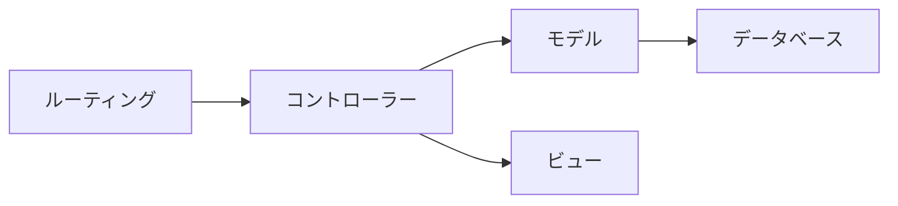
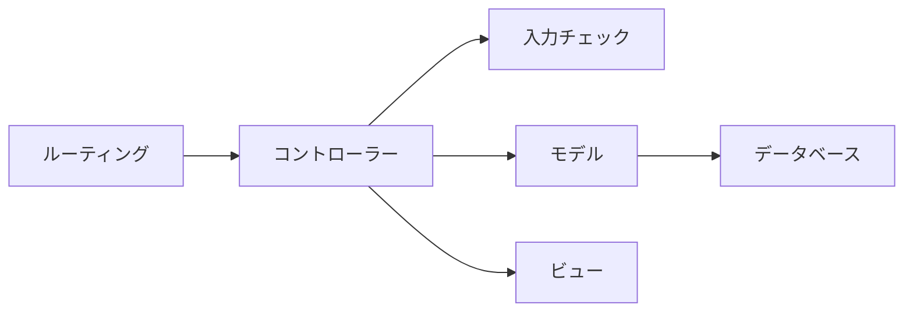

# 13-7-2: モジュール設計とLaravelのMVC

## 🎯 このセクションで学ぶこと

- ファイルやクラスがどんなまとまりに分かれて置かれているかを、構造図に描けるようになる。
- 「動くコード」と「変更できるコード」の違いを、どこに何を置くかの判断として説明できるようになる。
- MVCの3つに収まらない決めごとが出てきたときに、置き場所を1つ増やすかどうかを判断できるようになる。

---

## 導入：置き場所を決めていないと、同じ決めごとが散らばります

13-7-1の🏃でブログシステムのクラス図を描いたとき、図に出てこなかったファイルがあります。`routes/web.php` と `resources/views/posts/index.blade.php` です。どちらもクラスではないので、クラス図には出ません。それでも、アプリを作るときには必ず書きます。

13-1-2で、詳細設計ではモジュールやクラスの分け方を決めると確認しました。クラスの分け方は13-7-1で扱ったので、この節で扱うのはもう片方、モジュールの分け方です。ファイルやクラスを、どんなまとまりに分けて、どこに置くのかを決める作業を、モジュール設計と呼びます。そして、決めた結果を1枚にしたものを、この教材では**構造図**（ファイルやクラスが、どんなまとまりに分かれて置かれているかを表した図）と呼びます。13-1-2で、Chapter 7では自分が作ったアプリの構造図も作ると予告していたものです。

置き場所の答えを3つ用意してくれているのが、9-1-3「MVCアーキテクチャを理解しよう」で学んだMVCです。モデル・ビュー・コントローラーの3つに、ルーティングを加えた4つの置き場所は、Laravelを使うかぎり最初から決まっています。困るのは、この4つのどれにも収まらない決めごとが出てきたときです。そのときに置き場所を1つ増やすかどうかは、自分たちで決めます。

### 「動くコード」と「変更できるコード」

13-1-2で、詳細設計は「動くコード」と「変更できるコード」を分ける工程だ、と書きました。ここが、その中身です。

動くコードは、1つのファイルに全部書いても作れます。ルーティングのファイルの中に処理を書いても、コントローラーの中にSQLを書いても、画面は出ます。

変更できるコードは、🔑 **変わるきっかけが同じものどうしが、1か所に集まっている**コードです。入力チェックの決まりは、依頼者から「電話番号はハイフンが無くても受け付けたい」と言われたときに変わります。画面の並びは、見た目の相談で変わります。この2つは変わるきっかけが別なので、置き場所も別にします。

似た話を9-6-4「フォームリクエスト」でも見ました。ただ、あちらは太ってきたコントローラーを、書いたあとで分ける話でした。ここで扱うのは、書く前に決めておくほうです。決めていなければ、実装した人がその場で判断して置きます。1人で作るなら通りますが、3人が別々に判断すると、同じ種類の決めごとが3か所に散ります。

設計として決めるのは、2つだけです。どんなまとまりを置くか（まとまりの名前と、そこに置くものの種類）と、まとまりどうしの使う向きです。

> 💡 **TIP**: この節は、Tutorial 13の中でいちばん実装に近づきます。線引きを先に引いておきます。
>
> | 設計として決めること | 実装として決めること |
> |:---------------------|:---------------------|
> | どんなまとまりを置くか。まとまりの名前と、そこに置くものの種類 | クラスやメソッドの書き方（7-3） |
> | まとまりどうしの、使う向き | フォームリクエストの作り方と `rules()` の書き方（9-6-4） |
> | MVCの3つに収まらない決めごとに、置き場所を1つ増やすかどうかと、その理由 | クラスやメソッドの名前の付け方（この先のTutorial 16） |
>
> 右の列は、この節では決めません。

---

## 構造図の読み方

13-7-1でクラス図に描いた、社内の日報アプリの続きです。同じアプリでも、見たいものが違えば別の図になります。クラス図は「どんなクラスがあるか」の図でした。次の1枚は「それがどこに置いてあるか」の図です。



四角の中はまとまりの名前だけです。そのまとまりに何を置くのかは、図の脇に表で添えます。

| まとまり | 実物の場所 | 置くもの |
|:---------|:-----------|:---------|
| ルーティング | `routes/web.php` | どのURLが、どのコントローラーの何を呼ぶか |
| コントローラー | `app/Http/Controllers/` | 受け取った内容をどう扱い、どの画面を返すか |
| モデル | `app/Models/` | データの読み書き |
| ビュー | `resources/views/` | 画面に並べるもの |
| データベース | `reports` テーブル・`comments` テーブル | 覚えておく中身 |

読み取れることが3つあります。

**1つ目は、矢印が一方通行になっていることです**。ルーティングからコントローラーへ、コントローラーからモデルとビューへ、モデルからデータベースへ。逆向きの矢印は1本もありません。もし逆向きが要るなら、まとまりの分け方が合っていません。たとえばモデルからコントローラーへの矢印を引きたくなったとしたら、モデルの中に画面へ返す判断が混ざっているということです。

**2つ目は、この図に順番が書かれていないことです**。13-6-1で描いたシーケンス図は、上から下へ読む順番の図でした。この図の矢印は「使う」であって「次に行く」ではありません。同じ四角と線でも、読み方が違います。実際にどの順で処理が通るのかは、10-2-3「HTTPライフサイクルの詳細解説」で学んだとおりで、この図はそれを表していません。

**3つ目は、まとまりの中に何を置くかまで決まっていることです**。「コントローラー」という四角があるだけでは、まだ足りません。そこに何を置いて、何を置かないかまで決めて、はじめて実装する人が迷わずに済みます。上の表の右の列が、その決定です。

---

## 構造図の描き方

使う記号は3つです。

| 記号 | 表すもの |
|:-----|:---------|
| 四角 | まとまり1つ。中にまとまりの名前を書く |
| まとまりの四角のすぐ下に置いた四角 | そのまとまりに置く、実物のファイルの場所 |
| 矢印 | 使う向き。根元が使う側、先端が使われる側 |

draw.ioで新しく覚える操作はありません。四角を置いて文字を入れるのは13-1-3、向きのある矢印を引くのは13-3-1で学んだとおりです。

実物のファイルの場所は、まとまりの四角のすぐ下に、もう1つ四角を置いて書きます。13-7-1でクラス図の段を作ったのと同じやり方です。教材に載せた図では、この場所を図の脇の表で示しましたが、皆さんの図では、表を作らずに四角へ書いてください。読み方で見た表の「置くもの」の列は、図には書きません。ファイルの場所を書いた四角が、その代わりを果たします。そこを開けば、何が置いてあるかが分かるからです。図に書き添える文は、まとまりを1つ増やしたときの理由だけです（手順5）。

**まとまりは6つまで**に収めます。それ以上に増えたときは、分け方が細かすぎます。「一覧を出すところ」「1件を出すところ」のように処理ごとに四角を作り始めたら、それは置き場所ではなく処理を並べています。

**置き場所を決める3つの問い**

まとまりを決めるときは、次の3つを当てます。

| # | 問い | 通らなかったときにすること |
|:--|:-----|:---------------------------|
| 1 | この決めごとは、どんなときに変えたくなるか | 変えたくなるきっかけが同じものを、同じまとまりへ集める |
| 2 | 同じ決めごとが、2か所以上に書かれていないか | どちらか1か所に決めて、もう片方はそこを見に行く形にする |
| 3 | 矢印が一方通行になっているか | 行って戻る矢印が要るなら、分け方が合っていない。分け直す |

**描く手順**

1. 実物のファイルを見て、まとまりを洗い出します。フォルダの分かれ方が、そのまま手がかりになります。
2. まとまりごとに四角を置き、名前を書きます。名前は9-1-3で学んだ呼び方（ルーティング・コントローラー・モデル・ビュー）をそのまま使い、それに収まらないものだけ日本語で足します。
3. 四角の下に、実物のファイルの場所を書きます。データベースだけは置いてあるファイルがないので、代わりにテーブル名を書きます。
4. 使う向きに矢印を引きます。引き終えたら、3つ目の問いを当てて、逆向きの矢印が無いことを確かめます。
5. まとまりを1つ増やしたときは、増やした理由を、図の下に置いた四角の中に1〜2文で書きます。

---

## 🏃 描いてみよう

> 🔥 この演習では、設計書をAIに作らせずに、自分の手で書きましょう。記法や考え方についてAIに質問するのは構いませんが、成果物を生成させるのはTutorial 14までお預けです。まず自分の手と頭で書けるようになった人だけが、AIの作った設計を正しく評価できるようになります。

題材は、9-6-5「バリデーション - ハンズオン演習」で作ったユーザー登録フォーム（`validation-app-practice`）です。13-3-3で入力チェック表とメッセージ一覧を書いたのと、まったく同じアプリです。あのとき決めた入力チェックの決まりが、このアプリのどこに置いてあったかを見ます。

### Step 1: 実物のファイルを見て、まとまりを洗い出す

`~/laravel-practice/9-6-5_hands-on/validation-app-practice/` をVS Codeで開き、このアプリを動かしているファイルを探してください。パソコンに残っていない方は、9-6-5でpushした `validation-app-practice` リポジトリをGitHubのページで開けば、同じファイルを読めます。コードを読むだけなので、Dockerは起動しなくて構いません。

探すのは、自分で書いたファイルだけではありません。構造図は置き場所の図なので、Laravelが最初から用意しているファイルも、そこに置いてあるなら数に入れます。13-7-1のクラス図で「自分でファイルを作ったクラスだけ」と決めたのとは、そこが違います。

見るのは、`routes/`・`app/Http/Controllers/`・`app/Http/Requests/`・`app/Models/`・`resources/views/` の5つです。それぞれに何が入っているかを見て、まとまりを洗い出します。データベースを足すと、まとまりは6つになります。

`app/Http/Requests/` が空だった方は、入力チェックを `UserController` の中に書いています。その場合のまとまりは5つで、それも正しい読み取りです。以降のステップは、自分が数えた数のまま進めてください。

入力チェックの決まりがどこに書かれているかに、いちばん注目してください。

### Step 2: 四角と矢印で描く

洗い出したまとまりを四角にして、そのすぐ下に置いた四角へ、実物のファイルの場所を書きます。そのあと、使う向きに矢印を引きます。

矢印の手がかりは、ファイルの中に相手の名前が出てくるかどうかです。`routes/web.php` に `UserController` と書いてあれば、ルーティングからコントローラーへの矢印になります。`UserController` を開くと、`store()` の受け取り口・`User::create()` の行・`return view(...)` の行に、別のまとまりを指す名前が出てきます。ここが、コントローラーから伸びる矢印の根拠です（受け取り口が `Request` のままだった方は、入力チェックへの矢印はありません）。モデルからデータベースへの矢印だけは、コードの1行ではなく、モデルがテーブルを読み書きする役目そのものが根拠です。

引き終えたら、3つ目の問いを当てます。**逆向きの矢印が1本も無いこと**を確かめてください。

### Step 3: 入力チェックの置き場所の理由を書き添える

入力チェックを別のまとまりにした方は、なぜコントローラーと別にしたのかを、図の下の四角に1〜2文で書きます。コントローラーの中に入力チェックを書いていた方は、その決めごとをコントローラーに置いたままにした理由を書きます。

書けないときは、9-6-4を読み返す前に、自分の `UserController.php` をもう一度見てください。`store()` が受け取っているものが、置き場所の答えです。理由の言い方は、この節の最初で見た「変わるきっかけが同じものどうしが、1か所に集まっている」をそのまま使えます。

### Step 4: design-practiceに保存する

draw.ioで `signup-structure.drawio` の名前で保存し、PNGも `signup-structure.png` の名前で書き出します。書き出した2つのファイルは、13-7-1で作った `13-7/` へ移します。接頭辞の `signup-` は、13-3で使ったものと同じです。

```bash
# design-practice フォルダの中で実行する
git add 13-7
git commit -m "13-7: ユーザー登録フォームの構造図を追加"
git push origin main
```

<details>
<summary>📖 描き終えたら開く（答え合わせ）</summary>

**ユーザー登録フォームの構造図（解答例）**

draw.ioで描いた自分の図とは、四角の数と、矢印の向きだけを見比べてください。数えるのは、まとまりの名前を書いた四角だけです。その下に置いた、場所を書いた四角は数えません。



| まとまり | 実物の場所 | 置くもの |
|:---------|:-----------|:---------|
| ルーティング | `routes/web.php` | どのURLが、どのコントローラーの何を呼ぶか |
| コントローラー | `app/Http/Controllers/UserController.php` | 受け取った内容をどう扱い、どの画面を返すか |
| 入力チェック | `app/Http/Requests/StoreUserRequest.php` | どんな値まで受け付けるか。受け付けないときの文言 |
| モデル | `app/Models/User.php` | データの読み書き |
| ビュー | `resources/views/register.blade.php`・`register_success.blade.php` | 画面に並べるもの |
| データベース | `users` テーブル | 覚えておく中身 |

この表の「置くもの」の列は、解答例を読むためのものです。皆さんの図には書きません。

まとまりの分かれ方は、実物のファイルを見れば読み取れます。

```php
// app/Http/Controllers/UserController.php（9-6-5 の模範解答）
class UserController extends Controller
{
    public function create()
    {
        return view('register');
    }

    public function store(StoreUserRequest $request)
    {
        User::create($request->validated());

        return view('register_success');
    }
}
```

`store()` の受け取り口が `Request` ではなく `StoreUserRequest` になっています。入力チェックの決まりは、このコントローラーの中には1行も書かれていません。別のファイルに置いてあります。

```php
// app/Http/Requests/StoreUserRequest.php（9-6-5 の模範解答から抜粋）
class StoreUserRequest extends FormRequest
{
    public function rules()
    {
        return [
            'name' => 'required|max:50',
            'email' => 'required|email|unique:users',
            'password' => 'required|min:8|confirmed',
        ];
    }
    // ...
}
```

次の観点で、自分の成果物と見比べてください。

- [ ] まとまりが6つ（コントローラーの中に入力チェックを書いていた場合は5つ）で、入力チェックの置き場所が自分のコードのとおりになっている
- [ ] それぞれのまとまりの四角の下に、実物のファイルの場所が書いてある
- [ ] 矢印が5本（まとまりが5つなら4本）で、逆向きの矢印が1本も無い
- [ ] 四角の中に、処理の順番や、URLを書いていない
- [ ] 入力チェックの置き場所をそう決めた理由が、図の下に書いてある
- [ ] `13-7/` に `.drawio` とPNGの2つがあり、GitHub上でPNGが表示される

設計に唯一の正解はありません。四角の置き方や矢印の曲がり方が解答例と違っていても、上の観点を満たしていれば合格です。そのうえで、判断が分かれやすい3点を補足します。

- **入力チェックを独立したまとまりにした理由**: 実物が `app/Http/Requests/` という別のフォルダに置いてあるからです。🔑 **まとまりの分け方は、フォルダの分かれ方に現れます**。もし `UserController` の中に `validate()` を書いていたら、この四角は無く、入力チェックの決まりはコントローラーのまとまりに入ります。どちらで描いても、自分のコードのとおりに描けていれば合格です。
- **コントローラーから入力チェックへ矢印を向けた理由**: 実際に処理が通る順番では、入力チェックのほうがコントローラーより先に動きます。それでも矢印がこの向きなのは、この図が使う向きを表しているからです。`store()` の受け取り口に `StoreUserRequest` と書いてあるので、コントローラーは入力チェックのファイルを知っています。逆に、入力チェックのファイルはコントローラーのことを知りません。
- **ビューとデータベースを別の四角にした理由**: 変わるきっかけが、ほかのまとまりと違うからです。1つ目の問いを当てた結果です。

</details>

---

## 💡 よくある間違いと現場での使われ方

**間違い1: 処理の順番の図として描く**

矢印を「次に行く」の意味で引いてしまう間違いです。順番を描きたいときに使うのは、13-6-1で学んだシーケンス図です。

**間違い2: 四角の中に、置くものを詰め込む**

まとまりの名前だけでなく、ファイル名も置くものも四角の中に書いてしまう間違いです。図はすぐに読めなくなります。13-5-2のER図で、四角の中にテーブル名だけを書いたのと同じ考え方です。

**間違い3: まとまりを増やしっぱなしにする**

「ここは別にしたほうがよさそうだ」と思うたびに四角を足してしまう間違いです。まとまりが増えるほど、実装する人は「これはどっちに置くのか」と迷います。増やすなら、増やした理由を書きます。書けないなら、増やす必要はありません。

現場では、この図は新しく入った人に最初に見せる1枚になります。「入力チェックはここに置く決まりです」と図の上で指させるからです。決まりが図の上にあると、レビューのときにも「その処理はこの四角の担当ではありません」と言えます。決まりが誰かの頭の中にしか無いと、同じ指摘を毎回口で説明することになります。

---

## ✨ まとめ

- 構造図は、ファイルやクラスがどんなまとまりに分かれて置かれているかを1枚にした図です。四角の中はまとまりの名前だけにして、実物のファイルの場所は、すぐ下に置いた四角に書きます。
- 変わるきっかけが同じものどうしを1か所に集めるという判断が、そのままどこに何を置くかの決定になります。この判断は成果物として別に作るものではなく、まとまりの分け方と、図に書き添えた理由に現れます。
- 使う記号は、四角・その下に置いた四角・矢印の3つです。矢印は使う向きで、処理の順番ではありません。
- まとまりを決めるときは3つの問いを当てます。どんなときに変えたくなるか、同じ決めごとが2か所に無いか、矢印が一方通行か。まとまりは6つまでに収めます。
- MVCは置き場所の答えを3つ用意してくれますが、それで足りるかどうかは自分たちで決めます。9-6-5のユーザー登録フォームでは、モデル・ビュー・コントローラーとルーティングのほかに、入力チェックの置き場所が要りました。増やしたときは、増やした理由を書き添えます。

次のセクション（13-7-3）は、Chapter 7の設計演習です。10-3-5「認可機能 - ハンズオン演習」で作った投稿管理と認可のアプリを、クラス図に起こします。13-7-1では出てこなかったポリシーが、そこではクラスの1つとして現れます。

---
