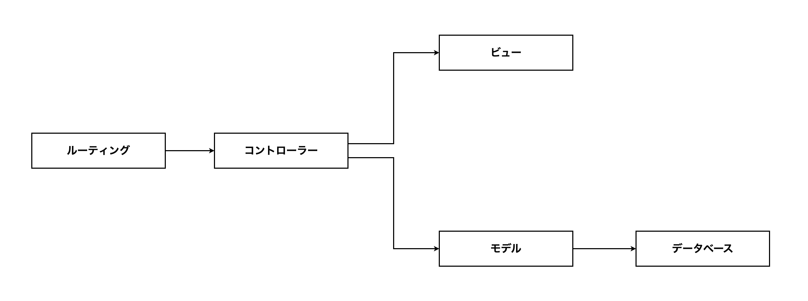
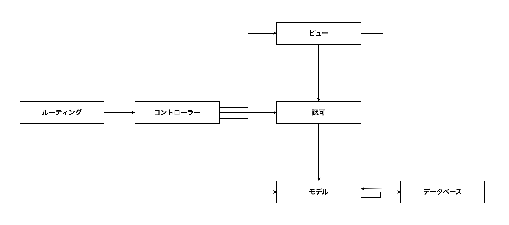

# 13-7-2: モジュール設計とLaravelのMVC

## 🎯 このセクションで学ぶこと

- ファイルやクラスがどんなまとまりに分かれて置かれているかを、構造図に描けるようになる。
- 変わるきっかけが同じものを1か所に集めるという判断を、置き場所の決定として説明できるようになる。
- MVCの3つに収まらない決めごとが出てきたときに、置き場所を1つ増やすかどうかを判断できるようになる。

---

## 導入：同じ決めごとが3か所に散る

「タイトルは255文字まで」「自分の投稿だけ編集してよい」といった決めごとは、置き場所を決めていないと、実装した人がその場で判断して置きます。1人で作るあいだは通ります。3人が別々に判断すると、同じ種類の決めごとが3か所に散ります。あとから条件が変わったときに、2か所だけ直して1か所を直し忘れます。

置き場所の答えを用意してくれているのが、9-1-3「MVCアーキテクチャを理解しよう」で学んだMVCです。モデル・ビュー・コントローラーにルーティングを加えた4つは、Laravelを使うかぎり最初から決まっています。困るのは、この4つのどれにも収まらない決めごとが出てきたときです。そのときに置き場所を1つ増やすかどうかは、自分たちで決めます。

ファイルやクラスを、どんなまとまりに分けて、どこに置くのかを決める作業を、**モジュール設計**と呼びます。決めた結果を1枚にしたものを、この教材では**構造図**（ファイルやクラスが、どんなまとまりに分かれて置かれているかを表した図）と呼びます。

### 「動くコード」と「変更できるコード」

13-1-2 で、詳細設計は「動くコード」と「変更できるコード」を分ける工程だと書きました。ここが、その中身です。

動くコードは、1つのファイルに全部書いても作れます。ルーティングのファイルの中に処理を書いても、コントローラーの中にSQLを書いても、画面は出ます。

変更できるコードは、🔑 **変わるきっかけが同じものどうしが、1か所に集まっている**コードです。入力チェックの決まりは、依頼者から「タイトルをもっと長く書きたい」と言われたときに変わります。画面の並びは、見た目の相談で変わります。この2つは変わるきっかけが別なので、置き場所も別にします。

似た話を 9-6-4「フォームリクエスト」でも見ました。あちらは、太ってきたコントローラーを書いたあとで分ける話でした。ここで扱うのは、書く前に決めておくほうです。

> 💡 **TIP**: この節は、Tutorial 13の中でいちばん実装に近づきます。線引きを先に引いておきます。
>
> | 設計として決めること | 実装として決めること |
> |:---------------------|:---------------------|
> | どんなまとまりを置くか。まとまりの名前と、そこに置くものの種類 | クラスやメソッドの書き方（7-3） |
> | まとまりどうしの、使う向き | フォームリクエストの作り方と `rules()` の書き方（9-6-4） |
> | MVCの3つに収まらない決めごとに、置き場所を1つ増やすかどうかと、その理由 | クラスやメソッドの名前の付け方（Tutorial 16） |
>
> 右の列は、この節では決めません。

---

## 構造図の読み方

13-7-1 でクラス図に描いた、社内の日報アプリの続きです。同じアプリでも、見たいものが違えば別の図になります。クラス図は「どんなクラスがあるか」の図でした。次の1枚は「それがどこに置いてあるか」の図です。

**日報アプリの構造図**



四角の中は、まとまりの名前だけです。そのまとまりが実物のどこにあり、何を置くのかは、図と一緒に表で持ちます。

| まとまり | 実物の場所 | 置くもの |
|:---------|:-----------|:---------|
| ルーティング | `routes/web.php` | どのURLが、どのコントローラーの何を呼ぶか |
| コントローラー | `app/Http/Controllers/` | 受け取った内容をどう扱い、どの画面を返すか |
| モデル | `app/Models/` | データの読み書き |
| ビュー | `resources/views/` | 画面に並べるもの |
| データベース | `reports` テーブル・`comments` テーブル | 覚えておく中身 |

### 矢印が一方通行になっている

ルーティングからコントローラーへ、コントローラーからモデルとビューへ、モデルからデータベースへ。逆向きの矢印は1本もありません。逆向きが要るなら、まとまりの分け方が合っていません。モデルからコントローラーへの矢印を引きたくなったとしたら、モデルの中に画面へ返す判断が混ざっているということです。

### 順番の図ではない

13-6-1 で描いたシーケンス図は、上から下へ読む順番の図でした。この図の矢印は「使う」の意味で、「次に行く」ではありません。同じ四角と線でも、読み方が違います。実際にどの順で処理が通るのかは 10-2-3「HTTPライフサイクルの詳細解説」で学んだとおりで、この図はそれを表していません。

### 何を置くかまで決まっている

「コントローラー」という四角があるだけでは、まだ足りません。そこに何を置いて、何を置かないかまで決めて、はじめて実装する人が迷わずに済みます。上の表の右の列が、その決定です。

---

## 構造図の書き方

使う記号は、次のとおりです。

| 記号 | 表すもの |
|:-----|:---------|
| 四角 | まとまり1つ。中にまとまりの名前を書く |
| 矢印 | 使う向き。根元が使う側、先端が使われる側 |

**まとまりは6つまで**に収めます。それ以上に増えたときは、分け方が細かすぎます。「一覧を出すところ」「1件を出すところ」のように処理ごとに四角を作り始めたら、それは置き場所の分け方ではありません。処理を並べているだけです。

### 置き場所を決める3つの問い

まとまりを決めるときは、次を当てます。

| # | 問い | 通らなかったときにすること |
|:--|:-----|:---------------------------|
| 1 | この決めごとは、どんなときに変えたくなるか | 変えたくなるきっかけが同じものを、同じまとまりへ集める |
| 2 | 同じ決めごとが、2か所以上に書かれていないか | どちらか1か所に決めて、もう片方はそこを見に行く形にする |
| 3 | 矢印が一方通行になっているか | 行って戻る矢印が要るなら、分け方が合っていない。分け直す |

### 書く手順

1. 実物のファイルを見て、まとまりを洗い出します。フォルダの分かれ方が、そのまま手がかりになります。
2. まとまりごとに四角を置き、名前を書きます。名前は 9-1-3 で学んだ呼び方（ルーティング・コントローラー・モデル・ビュー）をそのまま使い、それに収まらないものだけ日本語で足します。
3. 使う向きに矢印を引きます。矢印を引くかどうかの手がかりは、そのまとまりのファイルを開いたときに、相手のまとまりに置いてあるものを呼び出している行があるかどうかです。
4. 引き終えたら3つ目の問いを当てて、逆向きの矢印が無いことを確かめます。
5. まとまり・実物の場所・置くものの3列の表を、Markdownで書きます。
6. まとまりを1つ増やしたときは、増やした理由を表の下に1〜2文で書きます。

### draw.io での操作

新しく覚える操作はありません。四角を置いて文字を入れるのは 13-1-3、向きのある矢印を引くのは 13-3-2 で学んだとおりです。

---

## 🏃 描いてみよう

題材は、13-7-1 と同じ投稿アプリ（`post-app-practice`）です。13-7-1 では、このアプリのクラスとつながりを図にしました。今度は、クラスではないファイルも含めて、どこに何が置いてあるのかを図にします。

探すのは、自分で書いたファイルだけではありません。構造図は置き場所の図なので、`routes/` や `resources/views/` に置いてあるものも数に入れます。13-7-1 のクラス図で「そのアプリの決めごとが書かれているクラス」に絞ったのとは、そこが違います。ログインのしくみが用意したファイル（`app/Actions/Fortify/`・`app/Http/Middleware/`・`resources/views/auth/`）は、この図では扱いません。

### Step 1: 実物のファイルを見て、まとまりを洗い出す

`~/laravel-practice/post-app-practice/` をVS Codeで開き、次の5つを見てください。コードを読むだけなので、Dockerは起動しなくて構いません。

- `routes/web.php`
- `app/Http/Controllers/`
- `app/Policies/`
- `app/Models/`
- `resources/views/posts/`

データベースを足すと、まとまりの数が決まります。`app/Http/Requests/` というフォルダがあるかどうかも、あわせて見てください。9-6-4 で学んだフォームリクエストの置き場所です。このアプリにそのフォルダは無いので、入力チェックの決まりはどこかほかの場所に書かれています。どこに書かれているかを、`PostController.php` の中から探してください。

### Step 2: ビューの中も読む

`resources/views/posts/index.blade.php` を開いてください。ここに、ほかのまとまりを呼び出している行が2種類あります。

1つは `@can(...)` で始まる行です。10-3 で学んだとおり、この行は「この人にこれをしてよいか」を判断させています。もう1つは、投稿者名とカテゴリ名を出している `{{ ... }}` の行です。どちらも、ビューがどのまとまりを使っているかの手がかりになります。

### Step 3: 四角と矢印で描く

洗い出したまとまりを四角にして、使う向きに矢印を引きます。矢印の手がかりは、ファイルの中に相手のまとまりを呼び出している行があるかどうかです。`routes/web.php` に `PostController` と書いてあれば、ルーティングからコントローラーへの矢印になります。

モデルからデータベースへの矢印だけは、根拠がコードの1行ではありません。モデルがテーブルを読み書きする役目そのものが根拠になります。

引き終えたら、3つ目の問いを当てます。**逆向きの矢印が1本も無いこと**を確かめてください。

### Step 4: 表を書いて、増やした理由を添える

まとまり・実物の場所・置くものの3列の表を、`post-structure.md` に書きます。

このアプリには、MVCの3つとルーティングに収まらないまとまりが1つあります。それを増やした理由を、表の下に1〜2文で書いてください。理由の言い方は、この節の最初で見た「変わるきっかけが同じものどうしが、1か所に集まっている」をそのまま使えます。

### Step 5: docs/13-7/ に保存する

draw.ioで `post-structure.drawio` の名前で保存し、PNGも `post-structure.png` の名前で書き出します。書き出した2つのファイルと `post-structure.md` を、`docs/13-7/` に置きます。

```bash
# アプリのフォルダの中で実行する
git add docs/13-7
git commit -m "13-7: 投稿アプリの構造図を追加"
git push origin main
```

<details>
<summary>📖 描き終えたら開く（答え合わせ）</summary>

**投稿アプリの構造図（解答例）**



まとまりと、それぞれの実物の場所は、次のとおりです。

| まとまり | 実物の場所 | 置くもの |
|:---------|:-----------|:---------|
| ルーティング | `routes/web.php` | どのURLが、どのコントローラーの何を呼ぶか。ログインが要るかどうか |
| コントローラー | `app/Http/Controllers/PostController.php` | 受け取った内容をどう扱い、どの画面を返すか。どんな値まで受け付けるか |
| 認可 | `app/Policies/PostPolicy.php` | 誰がその投稿を編集・削除してよいか |
| モデル | `app/Models/User.php`・`Post.php`・`Category.php` | データの読み書きと、テーブルどうしのつながり |
| ビュー | `resources/views/posts/index.blade.php`・`edit.blade.php` | 画面に並べるもの |
| データベース | `users`・`categories`・`posts` テーブル | 覚えておく中身 |

矢印は8本で、それぞれに根拠になる行があります。

| 矢印 | 根拠になるコード |
|:-----|:-----------------|
| ルーティング → コントローラー | `Route::get('/posts', [PostController::class, 'index'])` |
| コントローラー → 認可 | `$this->authorize('update', $post);` |
| コントローラー → モデル | `Post::with(['user', 'category'])->latest()->get();` |
| コントローラー → ビュー | `return view('posts.index', compact('posts'));` |
| ビュー → 認可 | `@can('update', $post)` |
| ビュー → モデル | `{{ $post->user->name }}` |
| 認可 → モデル | `public function update(User $user, Post $post)` |
| モデル → データベース | モデルがテーブルを読み書きする役目そのもの |

入力チェックの決まりは、コントローラーの中にあります。

```php
// app/Http/Controllers/PostController.php（抜粋）
public function update(Request $request, Post $post)
{
    $this->authorize('update', $post);

    $validated = $request->validate([
        'title' => 'required|string|max:255',
        'content' => 'required|string',
        'category_id' => 'required|exists:categories,id',
    ]);

    $post->update($validated);

    return redirect()->route('posts.index');
}
```

`$request->validate(...)` が `update()` の中に直接書かれていて、`app/Http/Requests/` のフォルダはありません。入力チェックの置き場所は、コントローラーのまとまりの中です。

誰が編集してよいかの決まりは、別のフォルダにあります。

```php
// app/Policies/PostPolicy.php
class PostPolicy
{
    public function update(User $user, Post $post): bool
    {
        return $user->id === $post->user_id;
    }

    public function delete(User $user, Post $post): bool
    {
        return $user->id === $post->user_id;
    }
}
```

次の観点で、自分の成果物と見比べてください。

- [ ] まとまりが6つで、ルーティング・コントローラー・認可・モデル・ビュー・データベースになっている
- [ ] 矢印が8本で、1本ずつ根拠になるコードの行を言える
- [ ] 逆向きの矢印が1本も無い
- [ ] 四角の中に、処理の順番やURLを書いていない
- [ ] 表に、まとまり・実物の場所・置くものの3列がそろっている
- [ ] 認可のまとまりを増やした理由が、表の下に書いてある
- [ ] `docs/13-7/` に `post-structure.drawio`・`post-structure.png`・`post-structure.md` の3つがあり、GitHub上でPNGが表示される

設計に唯一の正解はありません。四角の置き方や矢印の曲がり方が解答例と違っていても、上の観点を満たしていれば合格です。そのうえで、判断が分かれやすい4点を補足します。

**認可を独立したまとまりにした理由**

実物が `app/Policies/` という別のフォルダに置かれているからです。🔑 **まとまりの分け方は、フォルダの分かれ方に現れます**。MVCの3つとルーティングでは足りず、置き場所を1つ増やした例がこれです。増やした理由は、1つ目の問いで説明できます。「自分の投稿だけ編集してよい」という決まりが変わるきっかけは、画面の見た目の相談でもデータの持ち方の相談でもなく、権限の相談です。変わるきっかけが違うので、置き場所も別にします。

**入力チェックをコントローラーに含めた理由**

`$request->validate(...)` が `update()` の中に書かれていて、それ以外の場所には書かれていないからです。同じ決めごとが2か所に無いので、2つ目の問いは通ります。9-6-4 のフォームリクエストに移せば、まとまりは7つになります。いまのコードは移していないので、移していない形のまま描きます。

**ビューからモデルへ矢印を引いた理由**

9-1-3 で見た処理の流れの図には、この線がありませんでした。それでも `index.blade.php` には `{{ $post->user->name }}` と `{{ auth()->user()->name }}` の行があり、ビューがモデルをたどって値を取り出しています。図は、覚えた流れではなく実物のコードに合わせます。

**ビューからルーティングへ矢印を引かなかった理由**

ビューのファイルには、`route('posts.destroy', $post)` や `route('posts.index')` のように、`route(...)` でルート名からURLの文字列を組み立てている行がいくつかあります。`index.blade.php` にも `edit.blade.php` にもあり、`route('logout')` のように `routes/web.php` に書かれていないルートを指しているものもあります。どれも、ブラウザが次に送る宛先を書いているだけで、いま動いている処理を上へ戻す呼び出しではありません。ここに矢印を引くと、ルーティングとビューのあいだで行って戻る形になり、3つ目の問いが通らなくなります。

> 💡 **TIP**: `$this->authorize('update', $post)` の行に、`PostPolicy` という名前は出てきません。Laravelは `Post` モデルの名前から `PostPolicy` を自分で見つけます。このアプリの `app/Providers/AuthServiceProvider.php` を開くと `$policies` の中身が空なのは、そのためです。矢印の先が名前で書かれていないぶん、この線は 13-7-3 の演習でも迷いやすいところになります。

</details>

---

## 💡 よくある間違いと現場での使われ方

**間違い1: 処理の順番の図として描く**

矢印を「次に行く」の意味で引いてしまう間違いです。順番を描きたいときに使うのは、13-6-1 で学んだシーケンス図です。

**間違い2: 四角の中に、置くものを詰め込む**

まとまりの名前だけでなく、ファイル名も置くものも四角の中に書いてしまう間違いです。図はすぐに読めなくなります。13-5-2 のER図で、四角の中にテーブル名だけを書いたのと同じ考え方です。

**間違い3: まとまりを増やしっぱなしにする**

「ここは別にしたほうがよさそうだ」と思うたびに四角を足してしまう間違いです。まとまりが増えるほど、実装する人は「これはどっちに置くのか」と迷います。増やすなら、増やした理由を書きます。書けないなら、増やす必要はありません。

現場では、この図は新しく入った人に最初に見せる1枚になります。「編集してよい人の決まりはここに置きます」と、図の上で指させるからです。決まりが図の上にあると、レビューのときにも「その処理はこの四角の担当ではありません」と言えます。決まりが誰かの頭の中にしか無いと、同じ指摘を毎回口で説明することになります。

---

## ✨ まとめ

- 構造図は、ファイルやクラスがどんなまとまりに分かれて置かれているかを1枚にした図です。四角の中はまとまりの名前だけにして、実物の場所と置くものは3列の表で持ちます。
- 変わるきっかけが同じものどうしを1か所に集めるという判断が、そのままどこに何を置くかの決定になります。この判断は、まとまりの分け方と、増やしたときに書き添えた理由に現れます。
- 矢印は使う向きで、処理の順番ではありません。矢印を引く根拠は、相手のまとまりを呼び出している行です。
- まとまりを決めるときは3つの問いを当てます。どんなときに変えたくなるか、同じ決めごとが2か所に無いか、矢印が一方通行か。まとまりは6つまでに収めます。
- MVCは置き場所の答えを3つ用意してくれますが、それで足りるかどうかは自分たちで決めます。投稿アプリでは、モデル・ビュー・コントローラーとルーティングのほかに、認可の置き場所が要りました。
- 入力チェックのように、増やさずにコントローラーへ含めたままの決めごともあります。実物のコードのとおりに描くのが、この図の正しさです。

---
