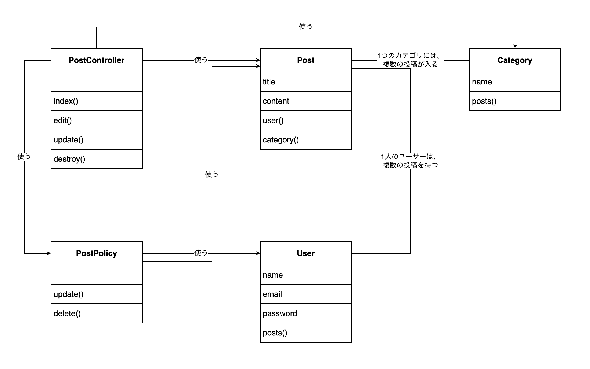

# 13-7-3: 構造の設計 - 設計演習

## 📌 この演習について

クラス図を白紙から描いて、13-7-1 で外しておいた `PostPolicy` まで入れた1枚に仕上げます。今回は、どのフォルダを開くかも指定しません。`app/` の中から、図に出すクラスを自分で選ぶところから始めます。

この演習だけは、カフェのモバイルオーダーアプリを使いません。クラス図は、そのプログラムがどんなクラスに分かれているかを写す図です。カフェのアプリはまだ1行も書いていないので、想像で描くことになります。そこで、この章だけは、手元で動く投稿アプリを題材にします。

---

## 🎯 演習課題

### 📋 与えられる仕様

題材は、13-1-3 で自分のリポジトリにした投稿アプリ（`post-app-practice`）です。このアプリの決まりは、次の5行です。

```text
- ログインした人だけが投稿一覧を開ける
- 投稿は、タイトル・本文・カテゴリを持つ
- 自分の投稿だけ編集できる
- 自分の投稿だけ削除できる
- 他人の投稿には、編集と削除のボタンが出ない
```

ここまでの演習と違って、新しい仕様書は渡されません。残りは、自分のリポジトリのコードから読み取ります。

図に出すクラスの決め方は、13-7-1 の手順1のとおりです。そのアプリの決めごとが書かれているクラスを出します。`app/` の中には、上の5行と関係のないクラスもたくさん置かれています。そこから選び出すところが、この演習のいちばんの山です。

そのぶん、これまでの演習と1つ違うところがあります。決めきれないことを確認事項リストへ送る作業が、今回はありません。相談相手がいないからではありません。🔑 **書き終えたコードには、決まっていないことが残っていない**からです。この演習でやるのは、決まっているものを正しく写すことです。

### ✏️ 作成する成果物

クラス図を1枚だけ作ります。保存先は、13-7-1 で作った `docs/13-7/` です。13-7-1 の `post-class` と区別するため、ポリシーまで入れたこちらは `post-class-policy` にします。

| # | 成果物 | ファイル名 |
|:--|:-------|:-----------|
| 1 | クラス図 | `post-class-policy.drawio`・`post-class-policy.png` |

### ✅ セルフチェック

最後の1つ前の項目だけは、ここまでの章で作ったものが残っているかの点検です。

- [ ] このアプリの決めごとが書かれているクラスが、5つとも図に現れている
- [ ] どのクラスも、四角が上からクラス名・属性・操作の順に並んでいて、書くものが無い段は空の四角を残してある
- [ ] クラス名・属性名・操作名が、コードの名前とそのまま同じになっている
- [ ] 属性に、`id`・`created_at`・`updated_at` と、相手を指す列と、型を書いていない
- [ ] `extends` の相手と、`app/` の中のそれ以外のクラスを図に描いていない
- [ ] 互いを知っているクラスのあいだに矢印の無い線があり、いくつといくつが対応するかが読み取れる
- [ ] 片方がもう片方を使っているだけの関係の線に、「使う」と書いてある
- [ ] 線が1本も引かれていないクラスが無い
- [ ] 図を見た人が、どのファイルを開けばどの決めごとが書いてあるかを指させる
- [ ] Chapter 2からChapter 6までのカフェの設計書が、`docs/` の各章のフォルダに揃っている
- [ ] **この設計書を初めて見た人が、質問せずに実装へ進めそうか**

> 💡 **合格基準**: 設計書のゴールは「それを見たら、人でもAIでもすぐ実装に入れる状態」です。答えられない質問が残っていそうなら、そこが設計の穴です。

> 🚀 **ここから先は、自分の力で作ってみましょう！**

---

## 💡 ヒント

手が止まったときの戻り先は決まっています。記号の意味と描く手順は 13-7-1、draw.ioの操作は 13-1-3 と 13-3-2 です。

図に出すクラスを選ぶところで迷ったら、そのファイルを開いて、上の5行のどれかがそこに書かれているかを見てください。書かれていないなら、図に出しません。

ポリシーをどう描くかで迷ったら、それは正しい迷い方です。10-3 で学んだとおり、ポリシーはLaravelの決まった呼ばれ方をする特別なクラスですが、ファイルとしては `app/Policies/PostPolicy.php` という1つのクラスです。特別扱いせず、ほかの4つと同じように四角にしてください。

---

## 🏃 実践

### 🧠 先輩エンジニアの思考プロセス

先輩エンジニアは、書き終えたコードを次の順でクラス図に落とし込みます。

| Step | やること | 説明 |
|:-----|:---------|:-----|
| 1 | 決めごとを持つクラスを選ぶ | ファイル1つが四角1つ。関係のないファイルは、開いて確かめてから外す |
| 2 | 四角ごとに、属性と操作を書き出す | そのクラスが持っている列と、そのクラスに書かれているメソッド |
| 3 | 互いを知っているクラスを線で結ぶ | 相手をたどるメソッドが両方にあるかどうかで決める。外部キーでは決めない |
| 4 | 片方向だけの関係に、矢印の付いた線を引く | 引数で受け取っているもの、呼び出しているものが手がかり |
| 5 | 線が1本もない四角が残っていないかを確かめる | 引き忘れなのか、コードの上でもどこからも使われていないのかを見分ける |

### 📝 ステップバイステップで描く

#### Step 1: 図に出すクラスを選ぶ

`~/laravel-practice/post-app-practice/` をVS Codeで開き、`app/` の中を見てください。コードを読むだけなので、Dockerは起動しなくて構いません。

フォルダが7つ並んでいます。`Actions/`・`Console/`・`Exceptions/`・`Http/`・`Models/`・`Policies/`・`Providers/` です。この中から、与えられた5行のどれかが書かれているファイルを探します。

外すファイルにも、開いて確かめてから外してください。名前だけで判断すると、`Providers/` のように「関係しそうに見えるのに何も書いていない」ファイルを見落とします。

#### Step 2: 四角ごとに、属性と操作を書き出す

選んだファイルを1つずつ開き、`$fillable` に並んでいる列と、そのクラスに書かれているメソッドを書き出します。13-7-1 で4つのクラス分は書き出しているので、増えるのは1つです。

そのクラスがデータを持たない場合は、属性の段を空のまま残します。

#### Step 3: 互いを知っているクラスを線で結ぶ

矢印の無い線で結ぶ相手は、モデルどうしです。手がかりは、Step 2で書き出したメソッドです。相手をたどるメソッドが両方のクラスにあれば、互いを知っている間柄です。

引いた線には、いくつといくつが対応するかを文で書きます。手がかりは、入っているデータの件数ではありません。シーダーが入れている投稿4件は試すためのデータで、持てる件数を決めた作りではないからです。`Post` が相手を指す列を1つ持ち、相手の側からは自分の投稿をまとめてたどれる形になっているかを見てください。上限を決めた作りになっていなければ、多重度は「複数」です。

#### Step 4: 片方向だけの関係に、矢印の付いた線を引く

1つ目の手がかりは、`$this->authorize('update', $post)` の行です。この1行で、コントローラーは誰かに判断を頼んでいます。頼んだ相手が、線の先です。

2つ目は、`update(User $user, Post $post)` の受け取り口です。引数で受け取っているものは、そのクラスが知っている相手です。

#### Step 5: 確かめて、保存する

線が1本も引かれていない四角が残っていたら、引き忘れなのか、コードの上でも本当にどこからも使われていないのかを確かめてください。

draw.ioで `post-class-policy.drawio` の名前で保存し、PNGも `post-class-policy.png` の名前で書き出します。書き出した2つのファイルを `docs/13-7/` に置きます。

```bash
# アプリのフォルダの中で実行する
git add docs/13-7
git commit -m "13-7: ポリシーまで入れた投稿アプリのクラス図を追加"
git push origin main
```

---

## 📖 模範解答

<details>
<summary>📖 作り終えたら開く（模範解答）</summary>

**投稿アプリのクラス図（解答例）**



図に出したのは、次の5つです。

| クラス | ファイル | 持っている決めごと |
|:-------|:---------|:-------------------|
| `User` | `app/Models/User.php` | 投稿者が持つ項目と、自分の投稿のたどり方 |
| `Post` | `app/Models/Post.php` | 投稿が持つ項目と、投稿者・カテゴリのたどり方 |
| `Category` | `app/Models/Category.php` | カテゴリが持つ項目と、そのカテゴリの投稿のたどり方 |
| `PostController` | `app/Http/Controllers/PostController.php` | 一覧・編集画面・更新・削除で何をするか |
| `PostPolicy` | `app/Policies/PostPolicy.php` | 誰がその投稿を編集・削除してよいか |

増えた1つは `PostPolicy` です。属性の段は空で、操作は2つです。

`Controller.php` を出していないのは、`PostController` が `extends` している相手だからです（`extends` の相手は描かない、と概念の節で決めました）。`AuthServiceProvider.php` は、名前のうえでは認可に関係しそうですが、開いてみると `$policies` は空で `boot()` にも何も書かれていません。このアプリの決めごとを1つも持たないので出しません。`app/Actions/Fortify/` のクラスも、与えられた5行のどれにも書かれていないので出しません。

```php
// app/Policies/PostPolicy.php
class PostPolicy
{
    public function update(User $user, Post $post): bool
    {
        return $user->id === $post->user_id;
    }

    public function delete(User $user, Post $post): bool
    {
        return $user->id === $post->user_id;
    }
}
```

矢印の付いた線は5本になりました。根拠は、`PostController` の中の3行と、`PostPolicy` の受け取り口です。

```php
// app/Http/Controllers/PostController.php（抜粋）
public function index()
{
    $posts = Post::with(['user', 'category'])->latest()->get();

    return view('posts.index', compact('posts'));
}

public function edit(Post $post)
{
    $this->authorize('update', $post);

    $categories = Category::orderBy('id')->get();

    return view('posts.edit', compact('post', 'categories'));
}

public function destroy(Post $post)
{
    $this->authorize('delete', $post);

    $post->delete();

    return redirect()->route('posts.index');
}
```

| 矢印の付いた線 | 根拠になるコード |
|:---------------|:-----------------|
| `PostController` → `Post` | `Post::with(['user', 'category'])` |
| `PostController` → `Category` | `Category::orderBy('id')` |
| `PostController` → `PostPolicy` | `$this->authorize('update', $post)` |
| `PostPolicy` → `User` | `update(User $user, Post $post)` の第1引数 |
| `PostPolicy` → `Post` | `update(User $user, Post $post)` の第2引数 |

次の観点で、自分の成果物と見比べてください。

- [ ] クラスが5つで、`User`・`Post`・`Category`・`PostController`・`PostPolicy` になっている
- [ ] `PostController` と `PostPolicy` の属性の段が、空のまま残してある
- [ ] `User` と `Post`、`Category` と `Post` のあいだの矢印の無い線に、いくつといくつが対応するかが書いてある
- [ ] `PostController` から3本、`PostPolicy` から2本、矢印の付いた線が出ていて、その5本に「使う」と書いてある
- [ ] `User` と `Post` を結ぶ線には「使う」と書いていない
- [ ] `Controller.php` と `AuthServiceProvider.php` を図に描いていない
- [ ] `docs/13-7/` に `.drawio` とPNGの2つがあり、GitHub上でPNGが表示される

**迷いやすいところ**

**コントローラーからポリシーへ線を引いた理由**

手がかりは `$this->authorize('update', $post)` の行です。この行に `PostPolicy` という名前は出てきません。Laravelが `Post` モデルの名前から `PostPolicy` を自分で見つけます。`AuthServiceProvider.php` の `$policies` の中身が空なのは、そのためです。名前が書かれていないので見落としやすい線ですが、コントローラーが判断を頼んでいることは、この行がある以上たしかです。

逆向きの線が無いのは、ポリシーが、自分をどのコントローラーから呼ばれるのかを知らないからです。呼ぶ側を書かずに済むぶん、ほかの場所からも同じ判断を頼めます。実際に `resources/views/posts/index.blade.php` の `@can('update', $post)` も、同じポリシーに判断を頼んでいます。ビューはクラスではないので、この図には出てきません。

</details>

---

## 🚀 まとめ

- ポリシーのような特別な呼ばれ方をするクラスも、図の上ではクラス1つです。ファイル1つをクラス1つとして描きます。
- 図に出すクラスを選ぶときは、外すファイルも開いて確かめます。名前だけで判断すると、中身が空のファイルを図に入れてしまいます。
- 使う関係の線を引く手がかりは、引数で受け取っているものと、呼び出しているものです。呼び出す行に相手のクラス名が書かれていないこともあります。
- 同じアプリを扱った設計書でも、数え方の単位は違います。権限マトリクスの行とクラス図の操作の数が合わないことは、食い違いではありません。

ここで、`docs/` の中身を確かめておきます。Chapter 2からChapter 6までの演習で、カフェのモバイルオーダーアプリの設計書がひととおり揃いました。

| 章 | フォルダ | 作った設計書 |
|:---|:---------|:-------------|
| Chapter 2 | `docs/13-2/` | 機能一覧・確認事項リスト・ユースケース図・ユースケース記述 |
| Chapter 3 | `docs/13-3/` | 画面一覧・画面遷移図・ワイヤーフレーム・画面項目定義・入力チェック表・メッセージ一覧 |
| Chapter 4 | `docs/13-4/` | API設計書・権限マトリクス |
| Chapter 5 | `docs/13-5/` | 概念モデル・ER図・テーブル定義書・CRUD表 |
| Chapter 6 | `docs/13-6/` | シーケンス図・状態遷移図・遷移表・例外一覧 |

このうち、クラス図だけがカフェにはありません。まだコードを書いていないからです。実際の仕事でも、詳細設計のクラスの分け方は、使う言語とフレームワークが決まってから詰めます。ここまでに作った設計書は、Tutorial 16で実際にアプリを作るときの土台になります。

---
