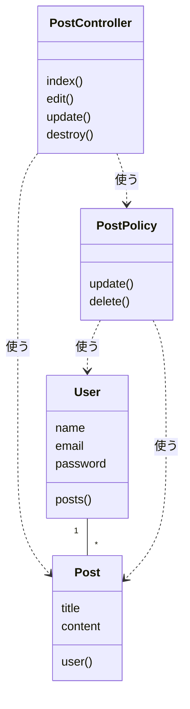

# 13-7-3: 構造の設計 - 設計演習

## 📌 この演習について

Chapter 7では、クラス図の描き方（13-7-1）と、構造図の描き方（13-7-2）を学びました。今回は、モデルもコントローラーもポリシーもそろったアプリを1つ選んで、クラス図を白紙から起こします。

この演習だけは、カフェのモバイルオーダーアプリを使いません。クラス図は、そのプログラムがどんなクラスに分かれているかを写す図です。カフェのアプリは、まだ1行もコードを書いていません。書いていないコードのクラス図は、想像で描くことになります。そこで、この章だけは、自分がすでに書いたコードを題材にします。

> 🔥 この演習では、設計書をAIに作らせずに、自分の手で書きましょう。記法や考え方についてAIに質問するのは構いませんが、成果物を生成させるのはTutorial 14までお預けです。まず自分の手と頭で書けるようになった人だけが、AIの作った設計を正しく評価できるようになります。

---

## 🎯 演習課題

### 📋 与えられる仕様

題材は、10-3-5「認可機能 - ハンズオン演習」で作った投稿管理と認可のアプリ（`authorization-app-practice`）です。13-4-2で権限マトリクスを書いたのと、同じアプリです。あのとき決めたのは「誰が何をしてよいか」でした。今回決めるのは「どんなクラスに分かれ、互いにどうつながっているか」です。

要件は次の4行でした。

```text
- 自分の投稿のみ編集できる
- 自分の投稿のみ削除できる
- 他人の投稿には編集・削除ボタンが表示されない
- 他人の投稿を直接URL指定で編集・削除しようとすると403エラーになる
```

このアプリのスターターキットには、次のものが入っていました。

| 項目 | 説明 |
|:-----|:-----|
| 認証機能 | Fortify（ログイン・登録・ログアウト） |
| Postモデル | user_idカラム、Userとのリレーション |
| PostController | index, edit, update, destroy（認可は未実装） |
| シーダー | 2ユーザー（usera, userb）・各2投稿（計4投稿） |
| Blade | welcome, auth/login, auth/register, posts/index, posts/edit |

このスターターキットに、自分でポリシーを書き足し、コントローラーに `$this->authorize()` の行を足しました。次の2つが、そのコードです。

```php
// app/Policies/PostPolicy.php（10-3-5 の模範解答）
class PostPolicy
{
    public function update(User $user, Post $post): bool
    {
        return $user->id === $post->user_id;
    }

    public function delete(User $user, Post $post): bool
    {
        return $user->id === $post->user_id;
    }
}
```

```php
// app/Http/Controllers/PostController.php（10-3-5 の模範解答から抜粋）
public function edit(Post $post)
{
    $this->authorize('update', $post);

    return view('posts.edit', compact('post'));
}

public function update(Request $request, Post $post)
{
    $this->authorize('update', $post);

    $validated = $request->validate([
        'title' => 'required|string|max:255',
        'content' => 'required|string',
    ]);

    $post->update($validated);

    return redirect()->route('posts.index');
}

public function destroy(Post $post)
{
    $this->authorize('delete', $post);

    $post->delete();

    return redirect()->route('posts.index');
}
```

残りは、自分のリポジトリのコードから読み取ります。ここまでの演習と違って、新しい仕様書は渡されません。

図に出すのは、🔑 **このアプリが使っているクラス**です。自分で書き足した `PostPolicy` だけでなく、スターターキットに入っていた `Post` と `PostController`、そして `User` も出します。`User` は、上に引用した `PostPolicy` が引数で受け取っている相手なので、このアプリの中で確かに使われています。出さないのは、`app/Http/Controllers/Controller.php` です。`PostController` はこのクラスを `extends` していますが、13-7-1で決めたとおり、`extends` の相手は図に描きません。どのLaravelアプリにも同じ中身で置かれていて、このアプリの決めごとを何も持たないクラスでもあります。

13-7-1では「自分でファイルを作ったクラスだけ」と決めました。あのブログシステムは、図に出したいクラスがどれも自分で作ったものでした。スターターキットを使うこのアプリでは、誰が作ったかではなく、このアプリで使われているかどうかで決めます。属性と操作も同じです。そのクラスに書かれているものは、スターターキットが用意したものでも写します。

探す範囲は、`app/` の中の4つのフォルダです（どのフォルダを開くかは、あとの実践のStep 1で示します）。ログインのしくみ（Fortify）が用意している部品は、`app/` の中に置かれているものもありますが、この4つのフォルダの外なので図に出しません。

そのぶん、これまでの演習と1つ違うところがあります。決めきれないことを確認事項リストへ送る作業が、今回はありません。送り先の相談相手がいないからではなく、🔑 **書き終えたコードには、決まっていないことが残っていない**からです。この演習は、決める演習ではなく、決まっているものを正しく写す演習です。

### ✏️ 作成する成果物

クラス図を1枚だけ作ります。保存先は、13-7-1で作った `13-7/` フォルダです。ファイル名の先頭は `authz-` を付けます（13-4で権限マトリクスに使ったのと同じ言葉です）。

| # | 成果物 | ファイル名 |
|:--|:-------|:-----------|
| 1 | クラス図 | `authz-class.drawio`・`authz-class.png` |

成果物は1枚ですが、13-7-1の🏃で描いた図より、使う関係の線が増えます。

### ✅ セルフチェック

カフェの設計書についての項目だけは、今回の成果物ではなく、ここまでの章で作ったものが残っているかの点検です。

- [ ] このアプリが使っているクラスが、すべて図に現れている
- [ ] どのクラスも、上からクラス名・属性・操作の3つの段に分かれていて、書くものが無い段は空のまま残してある
- [ ] クラス名・属性名・操作名が、自分のコードの名前とそのまま同じになっている
- [ ] 属性に、`id`・`created_at`・`updated_at` と、相手を指す列と、型を書いていない
- [ ] `extends` の相手を図に描いていない
- [ ] 互いを知っているクラスの間に線が引かれていて、いくつといくつが対応するかが読み取れる
- [ ] 片方がもう片方を使っているだけの関係の線に、「使う」と書いてある
- [ ] 線が1本も引かれていないクラスが無い
- [ ] 図を見た人が、どのファイルを開けばどの決めごとが書いてあるかを指させる
- [ ] Chapter 2からChapter 6までのカフェの設計書が、design-practiceの各章のフォルダに揃っている
- [ ] **この設計書を初めて見た人が、質問せずに実装へ進めそうか**

> 💡 **合格基準**: 設計書のゴールは「それを見たら、人でもAIでもすぐ実装に入れる状態」です。答えられない質問が残っていそうなら、そこが設計の穴です。

> 🚀 **ここから先は、自分の力で作ってみましょう！**

---

## 💡 ヒント

手が止まったときの戻り先は決まっています。記号の意味と描く手順は13-7-1、draw.ioの操作は13-1-3と13-3-1です。

図に出すクラスを選ぶところで迷ったら、「与えられる仕様」の最後に書いた決め方に戻ってください。

ポリシーをどう描くかで迷ったら、それは正しい迷い方です。10-3で学んだとおり、ポリシーはLaravelの決まった呼ばれ方をする特別なクラスですが、ファイルとしては `app/Policies/PostPolicy.php` という1つのクラスです。特別扱いせず、ほかの3つと同じように四角にしてください。

---

## 🏃 実践

### 🧠 先輩エンジニアの思考プロセス

先輩エンジニアは、書き終えたコードを次の順でクラス図に落とし込みます：

| Step | やること | 説明 |
|:-----|:---------|:-----|
| 1 | このアプリが使っているクラスを数える | ファイルが1つあれば、四角が1つ |
| 2 | 四角ごとに、属性と操作を書き出す | そのクラスが持っている列と、そのクラスに書かれているメソッド |
| 3 | 互いを知っているクラスを線で結ぶ | 外部キーではなく、クラスが相手を知っているかどうかで決める |
| 4 | 片方向だけの関係の線に、「使う」と書く | 引数で受け取っているもの、呼び出しているものが手がかり |
| 5 | 線が1本もない四角が残っていないかを確かめる | 引き忘れなのか、コードの上でもどこからも使われていないのかを見分ける |

### 📝 ステップバイステップで作る

#### Step 1: このアプリが使っているクラスを数える

自分のリポジトリ（`~/laravel-practice/10-3-5_hands-on/authorization-app-practice/`）をVS Codeで開いてください。パソコンに残っていない方は、10-3-5でpushした `authorization-app-practice` リポジトリをGitHubのページで開けば、同じファイルを読めます。ここもコードを読むだけなので、Dockerは起動しなくて構いません。

開くのは4つのフォルダです。`app/Models/`・`app/Http/Controllers/`・`app/Policies/`、そして念のため `app/Http/Requests/` も見てください。4つ目のフォルダが無いか、あっても中が空なら、このアプリには入力チェックの置き場所が作られていないということです。それも1つの読み取りです。

#### Step 2: 四角ごとに、属性と操作を書き出す

`app/Models/User.php` と `app/Models/Post.php` を開き、`$fillable` に並んでいる列を書き出します。この2つのファイルの中身は10-3-5の本文には載っていないので、自分のリポジトリで確かめてください。

`Post` の属性は、上に引用した `PostController` の `update()` の中からも読み取れます。入力チェックが書き換えを受け付けている項目が、そのままこのモデルの持ちものです。

操作は、そのクラスに書かれているメソッドです。`PostController` と `PostPolicy` のメソッドは、上の引用とスターターキットの表から数えられます。モデルどうしのつながりをたどるメソッドも、ここに入ります。13-7-1の🏃で、`comments()` や `tags()` を操作の段に書いたのと同じです。

#### Step 3: 互いを知っているクラスを線で結ぶ

線を引く相手は、モデルどうしです。手がかりは、スターターキットの表の「Postモデル｜user_idカラム、Userとのリレーション」という1行と、自分のリポジトリのモデルに書かれているメソッドです。

引いた線には、いくつといくつが対応するかを文で書きます。手がかりは、入っているデータの件数ではなくコードです。シーダーが入れている「各2投稿」は試すためのデータで、持てる件数を決めた作りではありません。`Post` が `user_id` を1つ持ち、`User` の側からは自分の投稿をまとめてたどれる形になっているかを見てください。上限を決めた作りになっていなければ、多重度は「複数」です。

#### Step 4: 片方向だけの関係の線に、「使う」と書く

手がかりは2つです。

1つ目は、`$this->authorize('update', $post)` の行です。この1行で、コントローラーは誰かに判断を頼んでいます。頼んだ相手が、線の先です。

2つ目は、`update(User $user, Post $post)` の受け取り口です。引数で受け取っているものは、そのクラスが知っている相手です。

#### Step 5: 確かめて、保存する

線が1本も引かれていない四角が残っていたら、引き忘れなのか、コードの上でも本当にどこからも使われていないのかを確かめてください。

draw.ioで `authz-class.drawio` の名前で保存し、PNGも `authz-class.png` の名前で書き出します。書き出した2つのファイルは、`13-7/` へ移します。

```bash
# design-practice フォルダの中で実行する
git add 13-7
git commit -m "13-7: 投稿管理と認可のクラス図を追加"
git push origin main
```

---

## 📖 模範解答

> 💡 **模範解答について**: 設計に「唯一の正解」はありません。ここに示すのは一つの妥当な解です。自分の設計と見比べて、「違い」ではなく「その違いが問題を起こすか」を考えてみましょう。

<details>
<summary>📖 作り終えたら開く（模範解答）</summary>

**投稿管理と認可のクラス図（解答例）**

draw.ioで描いた自分の図とは、クラスの数と、中に書いたものと、線のつながり方だけを見比べてください。



2つのモデルの中身は、次のようになっています。

```php
// app/Models/User.php（10-3-5 のスターターキットから抜粋）
class User extends Authenticatable
{
    protected $fillable = [
        'name',
        'email',
        'password',
    ];

    // ...

    public function posts(): HasMany
    {
        return $this->hasMany(Post::class);
    }
}
```

```php
// app/Models/Post.php（10-3-5 のスターターキットから抜粋）
class Post extends Model
{
    protected $fillable = [
        'user_id',
        'title',
        'content',
    ];

    public function user(): BelongsTo
    {
        return $this->belongsTo(User::class);
    }
}
```

自分のリポジトリの2つのファイルが上と少し違っていても、手元のとおりに書けていれば合格です。自分の `User.php` に `posts()` が無かった方は、`User` の操作の段が空になり、`User` と `Post` を結ぶ線は、向きのない線ではなく `Post` から `User` への「使う」になります。それも合格です。

次の観点で、自分の成果物と見比べてください。

- [ ] クラスが4つで、`User`・`Post`・`PostController`・`PostPolicy` になっている
- [ ] `Post` の操作に `user()`、`User` の操作に `posts()` が書いてある
- [ ] `PostController` と `PostPolicy` の真ん中の段が、空のまま残してある
- [ ] `User` と `Post` のあいだの線に、いくつといくつが対応するかが書いてある
- [ ] `PostController` から2本、`PostPolicy` から2本、線が出ていて、その4本に「使う」と書いてある
- [ ] `User` と `Post` を結ぶ線には「使う」と書かず、いくつといくつが対応するかだけを書いている
- [ ] 属性に `user_id` を書いていない（書く場合は、この演習の模範解答とセルフチェックが書かない側にそろえているため、図の中で書き方をそろえてください）
- [ ] `13-7/` に `.drawio` とPNGの2つがあり、GitHub上でPNGが表示される

模範と違っていても、セルフチェックの観点を満たしていれば合格です。そのうえで、判断が分かれやすい5点を補足します。

**`PostPolicy` を独立したクラスとして描いた理由**

実物が `app/Policies/PostPolicy.php` という1つのファイルだからです。`PostController` の中に `if` で書く作りもあり得ますが、そうすると同じ判断が編集と削除の2か所に散り、あとから条件が変わったときに片方を直し忘れます。13-4-2で権限マトリクスの△に添えた条件が、このクラス1つに集まっています。

**コントローラーからポリシーへ線を引いた理由**

Step 4で見たとおり、`$this->authorize('update', $post)` の1行が根拠です。逆向きの線が無いのは、ポリシーが、自分をどのコントローラーが呼ぶのかを知らないからです。呼ぶ側を書かずに済むぶん、ほかの場所からも同じ判断を頼めます。

**ポリシーから2本の線を引いた理由**

Step 4の2つ目の手がかり、`update(User $user, Post $post)` の受け取り口です。

線が多すぎると感じたら、1本にまとめても構いません。まとめるなら、線に「投稿と、その投稿を作った人を使う」と書いて、何を使っているのかが図から読み取れるようにしてください。まとめるかどうかの分かれ目は、線の本数ではなく、読む人が使っている相手を言えるかどうかです。

**`User` と `Post` を線で結んだ理由**

どちらも相手を知っているからです。`Post` の `user()` で投稿から書いた人へ、`User` の `posts()` で人から自分の投稿へ、どちらの向きにもたどれます。互いを知っている間柄は、向きのない線で結びます。片方向の「使う」とは区別します。

**操作が4つで、権限マトリクスの行が3つな理由**

`PostController` の操作は `index()`・`edit()`・`update()`・`destroy()` の4つですが、13-4-2で書いた権限マトリクスの行は3つでした。`edit()` は編集の画面を出す操作、`update()` は書き換える操作で、権限の上では「投稿の編集」という1つの決めごとだからです。10-3-5でも、`edit` と `update` の両方に同じ `update` を渡しています。

🔑 **設計書ごとに、数え方の単位が違ってよい**という例です。13-7-1でも、テーブル定義書には書いた `id` と `created_at`・`updated_at` を、クラス図には書きませんでした。どの設計書が何を決めているのかが分かっていれば、単位が違っていても食い違いにはなりません。

ビュー（`posts/index.blade.php`・`posts/edit.blade.php`）とルート（`routes/web.php`）は、図に入れません。13-7-1で確認したとおり、クラス図に出るのはクラスだけです。この2つを含めた置き場所のまとまりは、13-7-2で描いた構造図が引き受けます。入れてしまった方は、外してください。

</details>

---

## 🚀 まとめ

- ポリシーのような特別な呼ばれ方をするクラスも、図の上ではクラス1つです。特別扱いせず、ファイル1つをクラス1つとして描きます。
- 使う関係の線を引く手がかりは、引数で受け取っているものと、呼び出しているものです。逆向きの線が要らないことも、あわせて確かめます。
- 同じアプリを扱った設計書でも、数え方の単位は違います。権限マトリクスの行とクラス図の操作の数が合わないことは、食い違いではありません。

ここで、design-practiceの中身を確かめておきます。Chapter 2からChapter 6までの演習で、カフェのモバイルオーダーアプリの設計書がひととおり揃いました。

| 章 | フォルダ | 作った設計書 |
|:---|:---------|:-------------|
| Chapter 2 | `13-2/` | 機能一覧・確認事項リスト・ユースケース図・ユースケース記述 |
| Chapter 3 | `13-3/` | 画面一覧・画面遷移図・ワイヤーフレーム・画面項目定義・入力チェック表・メッセージ一覧 |
| Chapter 4 | `13-4/` | API設計書・権限マトリクス |
| Chapter 5 | `13-5/` | 概念モデル・ER図・テーブル定義書・CRUD表 |
| Chapter 6 | `13-6/` | シーケンス図・状態遷移図・遷移表・例外一覧 |

このうち、クラス図だけがカフェにはありません。まだコードを書いていないからです。実際の仕事でも、詳細設計のクラスの分け方は、使う言語とフレームワークが決まってから詰めます。ここまでに作った設計書は、この先のTutorial 16で実際にアプリを作るときの土台になります。

これでChapter 7は終わりです。次のChapter 8では、作ったものが仕様どおりかを何で確かめるのかを設計します。そのあと、最後に新しいお題を1本受け取って、ここまでに学んだ設計書を一式まとめて作ります。

---
