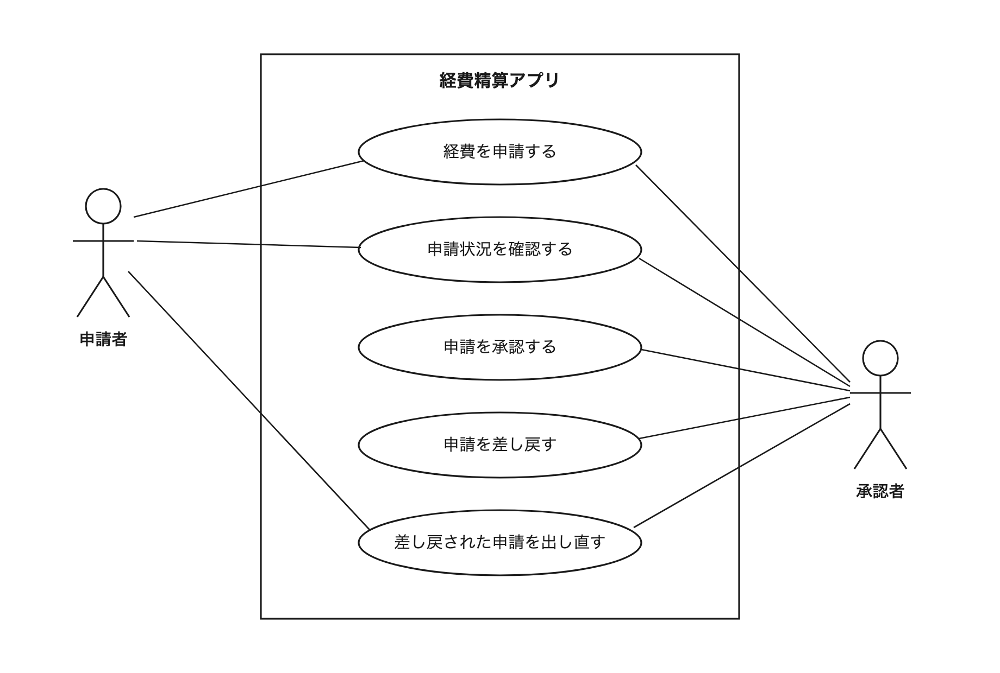
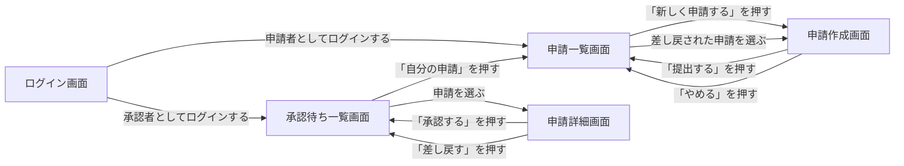
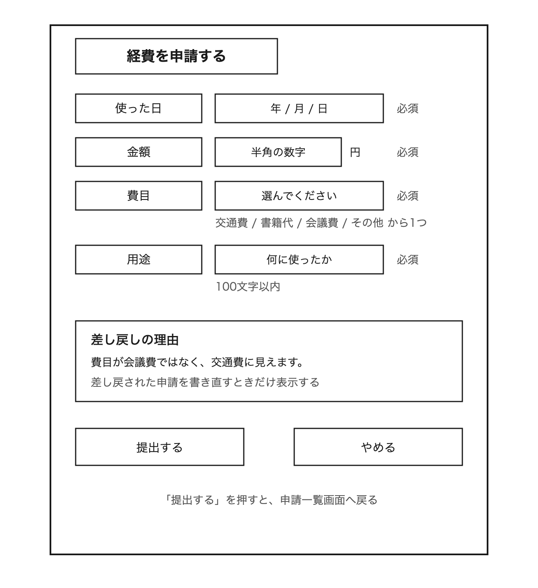
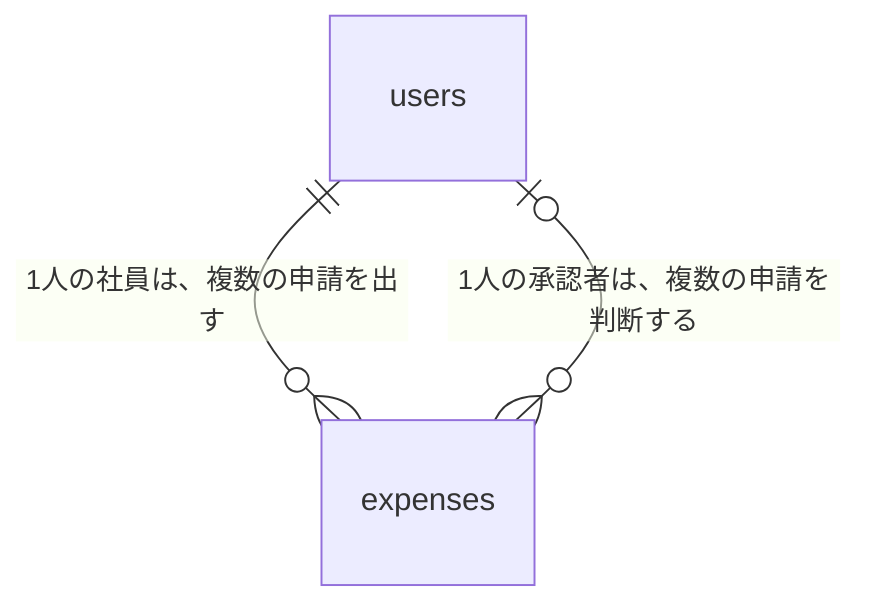
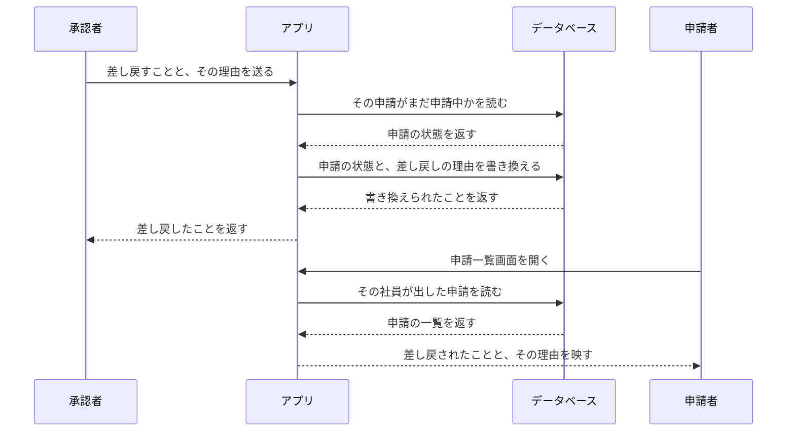
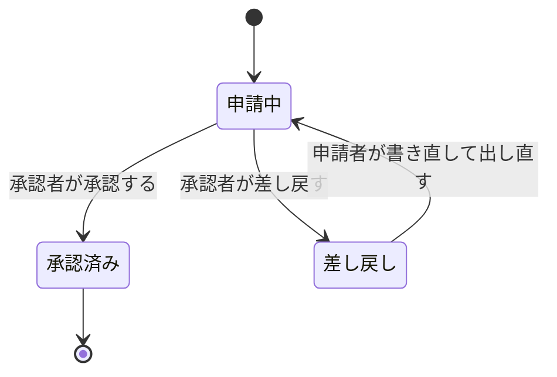

# 13-8-2: 総合演習 - 仕様から設計書一式を作る

## 📌 この演習について

これまでの演習とは、始まり方が違います。Chapter 3からChapter 6までの演習は「新しい仕様は渡されません」で始まり、前の章で作った設計書を引き継いで積み上げてきました。今回は新しい仕様書が1枚渡されるところから始まり、前の章の成果物は1つも使いません。13-2-3も新しい仕様書から始まりましたが、あのとき作ったのは機能設計の4種類だけでした。今回は、そこから最後まで通します。

> 🔥 この演習では、設計書をAIに作らせずに、自分の手で書きましょう。記法や考え方についてAIに質問するのは構いませんが、成果物を生成させるのはTutorial 14までお預けです。まず自分の手と頭で書けるようになった人だけが、AIの作った設計を正しく評価できるようになります。

---

## 🎯 演習課題

### 📋 与えられる仕様

題材は、社内の経費精算アプリです。ある会社の総務を担当している方から、次の相談が届いたとします。

> **経費精算アプリのご相談**
>
> 社員が40人ほどの会社で、総務を担当しています。社員が仕事で立て替えた費用は、いまは紙の申請書に書いて上長に渡し、上長がはんこを押してから私のところへ回ってきます。ところが、この紙が途中で止まってしまうことが多いのです。上長の机に何日も置かれたままだったり、差し戻すときは口頭で伝えるだけなので、何を直せばよいのかが本人に伝わらなかったりします。
>
> そこで、このやり取りをアプリでできるようにしたいと考えました。
>
> 社員には、立て替えた日付と、金額と、何に使ったのかと、費目を選んで申請してもらいます。費目は、交通費・書籍代・会議費・その他の4つです。1件あたりの金額は、社内の決まりで5万円までとしています。それを超えるものは、いまも別の書類で回していますので、このアプリでは受け付けないようにしてください。
>
> 上長には、自分のところに出ている申請の一覧を見て、承認するか、差し戻すかを決めていただきます。差し戻すときは、どこを直してほしいのかを必ず書いていただきたいです。差し戻された社員は、書き直してもう一度出せるようにしてください。
>
> 社員が、自分の出した申請がいまどうなっているのかを確認できると、問い合わせが減って助かります。
>
> なお、領収書の写真を貼り付ける機能は、ゆくゆくは欲しいのですが、まずは無しで大丈夫です。振込の手続きや会計ソフトへの取り込みは、これまでどおり私が手で行いますので、このアプリでは考えなくて結構です。

相談の文章には「上長」という言葉が出てきますが、設計書の中でのロール名は**申請者**と**承認者**の2つでそろえてください。相談の文章に出てくるのは会社の役職の呼び方で、アプリの上で何ができるかを表す言葉ではないからです。

この仕様書には、決まっていないことがいくつも残っています。13-2-1で学んだとおり、自分で決めてしまわずに、想定を添えて確認事項リストへ送ってください。

**確認事項リストは `Q-01` から新しく作ります。** Chapter 3からChapter 6までの演習では、カフェの確認事項リストに続きの番号を足してきました。今回は別のアプリなので、新しいファイルを作り、`Q-01` から振り直します。カフェの `13-2/cafe-questions.md` には1行も足しません。

IDの振り方は、これまでの章で決めたとおりです。どれも2桁のゼロ埋めで `01` から振り、あとから増えたものは末尾に足して、番号は振り直しません。

### ✏️ 作成する成果物

作るものは20あります。上から18が設計書で、残りの2つは、確かめた記録と、提出のためのものです。保存先は、13-8-1で作った `13-8/` フォルダです。ファイル名の先頭には `expense-` を付けます。

| # | 成果物 | ファイル名 | 作り方を学んだ節 |
|:--|:-------|:-----------|:-----------------|
| 1 | 機能一覧と、今回作らないものの表 | `expense-feature-list.md` | 13-2-1 |
| 2 | 確認事項リスト | `expense-questions.md` | 13-2-1 |
| 3 | ユースケース図 | `expense-usecase.drawio`・`expense-usecase.png` | 13-2-2 |
| 4 | ユースケース記述（1本） | `expense-uc-03.md` | 13-2-2 |
| 5 | 画面一覧 | `expense-screen-list.md` | 13-3-1 |
| 6 | 画面遷移図 | `expense-screen-flow.drawio`・`expense-screen-flow.png` | 13-3-1 |
| 7 | ワイヤーフレーム（1枚） | `expense-wireframe.drawio`・`expense-wireframe.png` | 13-3-2 |
| 8 | 画面項目定義（1画面ぶん） | `expense-screen-items.md` | 13-3-2 |
| 9 | 入力チェック表 | `expense-input-check.md` | 13-3-3 |
| 10 | API設計書 | `expense-api.md` | 13-4-1 |
| 11 | 権限マトリクス | `expense-permission-matrix.md` | 13-4-2 |
| 12 | ER図 | `expense-er.drawio`・`expense-er.png` | 13-5-2 |
| 13 | テーブル定義書 | `expense-table.md` | 13-5-3 |
| 14 | CRUD表 | `expense-crud.md` | 13-5-3 |
| 15 | シーケンス図（1本） | `expense-sequence.drawio`・`expense-sequence.png` | 13-6-1 |
| 16 | 状態遷移図と遷移表 | `expense-state.drawio`・`expense-state.png`・`expense-state-table.md` | 13-6-2 |
| 17 | 例外一覧 | `expense-exceptions.md` | 13-6-3 |
| 18 | テスト設計書 | `expense-test.md` | 13-8-1 |
| 19 | AIに読ませて確かめた記録 | `expense-ai-check.md` | この節 |
| 20 | 提出用の1枚 | `README.md` | この節 |

1本・1枚に絞ったものは、どれを選ぶかだけ決めておきます。ユースケース記述は、承認するか差し戻すかで流れが分かれる承認者側（ファイル名の番号は、自分が振ったIDに合わせます）。ワイヤーフレームと画面項目定義は、申請を書く画面です。同じ形のものを並べても決まることが増えないのは、13-3-4・13-6-4と同じ理由です。

API設計書は、エンドポイント一覧・詳細2本・エラーレスポンス一覧を、この順で1つのファイルにまとめます。13-4-3と同じ形です。テスト設計書も、観点表とテストケース2本を1つのファイルにまとめてください。13-8-1では2つのファイルに分けましたが、あれは2つの成果物を別々に作る練習だったからで、実際の仕事では1つの設計書としてまとめます。

19番目と20番目は、実践の最後の2つのStepで作ります。

> ⚠️ **注意**: `README.md` にだけ `expense-` を付けません。このファイルは、フォルダそのものの案内だからです。ファイル名の先頭に題材の言葉を付ける決まりの、唯一の例外になります。

**この演習で作らないもの**

機能一覧の下に「今回作らないもの」の表を続けるのと同じ考え方です。

| 作らないもの | 理由 |
|:-------------|:-----|
| メッセージ一覧（13-3-3） | 文言そのものは入力チェック表の行から起こせて、この演習で新しく判断することがないため |
| 概念モデル（13-5-1） | ER図が同じ情報を、より詳しい形で持つため。実際の仕事では、ER図を描く前の下書きとして作ります |
| クラス図（13-7-1）・構造図（13-7-2） | 13-7-3で確かめたとおり、クラス図はすでにあるコードを写す図だからです。このアプリは、まだ1行もコードを書いていません |

### ✅ セルフチェック

- [ ] 機能一覧の1行ずつについて、対応するユースケース図の楕円・画面一覧の画面・API設計書のエンドポイント・CRUD表の行を、順に指でたどれる
- [ ] 仕様書に書かれていない機能を、親切心で足していない
- [ ] 用語が仕様書と一致している（ロール名の申請者・承認者を除いて、言い換えていない）
- [ ] 最初に開く画面を除いて、画面一覧のすべての画面に、そこへ入る道が画面遷移図に描かれている
- [ ] ログイン画面を除いて、入力欄のある画面のすべての項目が、入力チェック表のどこかに現れている
- [ ] 自分で決めた数字と、仕様書に書かれていた数字を、区別して説明できる
- [ ] エンドポイント一覧のすべての行が、どの画面から呼ばれるのかを指せる
- [ ] 権限マトリクスのすべての△に、条件が書かれている
- [ ] ER図の四角の数と、テーブル定義書の表の数が合っている
- [ ] CRUD表を縦に読んで、`C` が1つもない列があれば、その理由を説明できる
- [ ] 遷移表のすべての行が、状態遷移図の矢印1本ずつと対応している（数が合っている）
- [ ] 出ていく矢印が無い状態が、終わりの状態だけになっている
- [ ] 例外一覧のすべての行に、そのときシステムが何をするかが書かれている
- [ ] 例外一覧に、画面の文言やステータスコードを書いていない
- [ ] テスト観点表のすべての行に、元になった設計書が書けている
- [ ] 境界値の行が、受け付ける側と受け付けない側の2行1組になっている
- [ ] 決めきれなかった点を、勝手に決めずに確認事項リストへ書き出している
- [ ] 確認事項リストの番号が `Q-01` から始まっている（カフェの続きになっていない）
- [ ] AIから来た質問を、実践のStep 8にある3つの判定のどれかに仕分けて記録に残している
- [ ] **この設計書を初めて見た人が、質問せずに実装へ進めそうか**

> 💡 **合格基準**: 設計書のゴールは「それを見たら、人でもAIでもすぐ実装に入れる状態」です。答えられない質問が残っていそうなら、そこが設計の穴です。

> 🚀 **ここから先は、自分の力で作ってみましょう！**

---

## 💡 ヒント

手が止まったときの戻り先は、上の成果物の表の「作り方を学んだ節」の欄です。draw.ioの操作は13-1-3と13-3-1にあります。

この演習で新しく描く図の種類はありません。どれもChapter 2からChapter 6までで描いたことのあるものです。

全部を一度に作ろうとすると手が止まります。成果物の表の順番で1つずつ仕上げてください。前の1つが次の1つの材料になるように並んでいます。

誰が誰の承認者なのかで手が止まったら、それは正しい止まり方です。仕様書には「自分のところに出ている申請」とだけ書かれていて、その対応がどう決まるのかは書かれていません。ここで自分の想定を1つ置き、確認事項リストへ送ってから先へ進んでください。

---

## 🏃 実践

### 🧠 先輩エンジニアの思考プロセス

先輩エンジニアは、1枚の仕様書を次の順で設計書一式に落とし込みます：

| Step | やること |
|:-----|:---------|
| 1 | 仕様を読んで、使う人と作らないものに印を付ける |
| 2 | 機能一覧・確認事項リスト・ユースケース図と記述を作る |
| 3 | 画面を数えて、遷移図・ワイヤーフレーム・項目定義・入力チェック表を作る |
| 4 | 画面をたどってエンドポイントを起こし、権限マトリクスを作る |
| 5 | 覚えておくものを洗い出して、ER図・テーブル定義書・CRUD表を作る |
| 6 | 流れと状態と外れ方を決める |
| 7 | 設計書からテスト観点表とテストケースを起こす |
| 8 | AIに読ませて、答えられない質問が残っていないかを確かめる |
| 9 | 提出用の1枚を書いて、pushする |

### 📝 ステップバイステップで作る

各Stepでは、作り方を教え直しません。戻り先の節と、この題材で気をつける点だけを書きます。

#### Step 1: 仕様を読んで、使う人と作らないものに印を付ける

仕様書に登場する人に印を付けます。この相談は総務の方が書いていますが、総務の方自身は、このアプリの上で何もしません。振込の手続きと会計ソフトへの取り込みは、これまでどおり手で行うと書かれているからです。依頼した人が、そのままアクターになるとは限りません。

続けて、「まずは無しで大丈夫です」「このアプリでは考えなくて結構です」と書かれている箇所を探し、今回は作らないものとして書き出します。

#### Step 2: 機能一覧・確認事項リスト・ユースケース図と記述を作る

13-2-1と13-2-2のとおりに進めます。機能は5つ前後に収まるはずです。

ユースケース記述の分岐は、代替フローに書きます。差し戻すときに理由が必須であることは、この記述の中で決まります。

仕様書に書かれていないことは、この時点でいくつも見つかっているはずです。自分の想定を添えて、確認事項リストへ書き出してください。

#### Step 3: 画面を数えて、遷移図・ワイヤーフレーム・項目定義・入力チェック表を作る

このアプリには**ログイン画面が要ります**。13-3-1では、仕様書がログインに触れていないうちはログイン画面を置かずに進める、と決めました。この仕様書もログインには触れていませんが、誰が出した申請で、誰あての申請なのかが決まらなければ、承認も差し戻しもできません。ここは置く判断をします。

ただし、ログインそのものの決めごとは書きません。13-4-2で確認したとおり、どうやってログインしてもらうのかという方式は、この教材では決めないからです。ログイン画面は画面一覧と画面遷移図に置くだけにして、機能一覧にもエンドポイント一覧にもログインの行を作らず、入力チェック表もこの画面の項目は対象外にします。

画面遷移図には、差し戻された申請を書き直して出し直す道を描いてください。申請者と承認者で、ログインしたあとに開く画面が分かれることにも気をつけてください。承認者も自分の経費を立て替えるので、承認者側の画面から申請者側の画面へ渡る道が要るかどうかも考えてみてください。

入力チェック表では、金額の上限が仕様書に書かれている唯一の数字です。それ以外の文字数は自分で決めることになるので、13-3-3のとおり、表の下に決めた理由を1行か2行添えてください。

#### Step 4: 画面をたどってエンドポイントを起こし、権限マトリクスを作る

13-4-1の手順1のとおり、画面遷移図の四角を1つずつたどります。

一覧を取ってくる入口では、申請者が開く一覧と承認者が開く一覧で中身が変わることに注意してください。

権限マトリクスの列は、13-4-2の手順1のとおりに洗い出します。ログインしていない相手の列をどう扱ったかは、表の下に1行残してください。△が出てくる行では、条件を必ず書きます。「自分の」という言葉が入る条件が、いくつも出てくるはずです。

#### Step 5: 覚えておくものを洗い出して、ER図・テーブル定義書・CRUD表を作る

テーブルは2つに収まります。社員の情報を持つテーブルは、Laravelが最初から用意しているものと同じ名前になりますが、この演習では自分で設計書に書き出してください。承認者として扱うかどうかを、どこに持たせるかを決める必要があるからです。

ER図を描くとき、社員のテーブルと申請のテーブルの間に引く線が1本で足りるかを考えてみてください。申請には、出した人と、判断した人の2人が関わります。

CRUD表を縦に読むと、`C` が1つも無い列が出てきます。13-5-3で確認したとおり、それは間違いではなく、決めていないことが見つかった合図です。勝手に機能を足さず、確認事項リストへ送ってください。

#### Step 6: 流れと状態と外れ方を決める

シーケンス図には、承認者が「差し戻す」を押してから、申請者がそれに気づくまでを描いてください。ここで考えることになるのは、差し戻したことが申請者に伝わるのはいつか、です。その答えが、図の後半の形になって現れます。

状態は3つです。仕様書に出てくる言葉を数えると、申請を出したあと、承認されたあと、差し戻されたあとの3つが読み取れます。矢印のうち1本は、前の状態へ戻る向きになります。そこから出てくる問いには仕様書に答えが無いので、確認事項リストへ送ってください。

例外一覧は、13-6-3の3つの問いを、シーケンス図の矢印と状態遷移図に当てて洗い出します。文言もステータスコードも書きません。

#### Step 7: 設計書からテスト観点表とテストケースを起こす

13-8-1の6つの手順どおりに進めます。受け入れ条件、入力チェック表、例外一覧、権限マトリクス、遷移表の順にたどると、10行を超える観点表になります。手順1で使える受け入れ条件は、書いたユースケース記述1本ぶんしかありません。ほかの機能の正常系は、手順5の遷移表の行から起こします。状態遷移図に引かなかった矢印を拾うのも、この手順5です。

テストケースは代表2本を書き下ろします。

#### Step 8: AIに読ませて、答えられない質問が残っていないかを確かめる

13-1-1で置いた合格基準を、人に見てもらう前に、AIを相手に確かめます。

ここでAIに頼むのは、できあがった設計書を読んで質問を出してもらうことだけです。設計書を作らせるわけではないので、この演習の冒頭に置いたお願いの範囲に収まります。使うのは、ブラウザで使える対話型のAIサービスです。1-1-6「AIの活用法」で触れたChatGPT・Claude・Geminiなど、どれでも構いません。無料のプランで足ります。

渡し方は3つです。

1. Markdownで作った設計書は、中身をそのまま貼り付けます。
2. 図は `.drawio` のままでは読めないので、書き出したPNG画像を添えます。画像を受け付けられないサービスを使っている場合は、図の中身を文章にして書き写しても構いません（状態遷移図なら遷移表を、画面遷移図なら「どの画面から、どの操作で、どの画面へ移るか」の一覧を貼り付けます）。
3. **一度に全部を渡します。** 分けて渡すと、設計書どうしの食い違いに気づけません。1回のメッセージに入りきらないときは、「まだ続きがあります」と書き添えて何回かに分けて貼り、全部を貼り終えてから次のお願いを送れば、一度に渡したのと同じことになります。

そのうえで、次のように頼みます。

```text
これは、社内の経費精算アプリの設計書一式です。あなたはこの設計書だけを読んで実装する担当者です。

読んだうえで、次の2つを答えてください。

1. この設計書のどこにも答えが書かれていないために、実装に入る前に確認したいことを、
   重要な順に5つまで挙げてください。
2. 設計書どうしで食い違っているところがあれば、どの設計書とどの設計書が、
   どう食い違っているかを挙げてください。

設計書を書き直したり、書き足したりする提案はしないでください。質問と、食い違いの指摘だけをしてください。
```

> 💡 このお願いで大事なのは、最後の1行です。書き直しまで頼むと、自分が決めていないことをAIが決めてしまいます。決めるのは、まだ自分の仕事です。文言をそのまま覚える必要はありません。

返ってきた質問は、1つずつ次の3つに仕分けます。

| AIから来た質問 | 自分の判定 | やること |
|:---------------|:-----------|:---------|
| 答えが設計書のどこかにある | 読み落とし、または書き方が伝わっていない | どこに書いてあるかを指せるか確かめる。指せるのに伝わっていないなら、書き方を直す |
| 答えが無く、自分で決められる | 設計の穴 | その場で決めて、該当する設計書に書き足す |
| 答えが無く、依頼者に聞くしかない | 決めきれないこと | 想定を添えて、確認事項リストに足す |

> 💡 **出力例について**: AIの応答は毎回変わります。以下はあくまで一例です。文言が違っても、チェックリストの項目を満たしていれば問題ありません。

```text
あなた: （設計書一式を貼り付けたうえで、上のお願いを送る）
AI: 1. 誰が誰の承認者にあたるのかが、テーブル定義書からは読み取れません。
      expenses に承認者を指す列はありますが、申請がどの承認者に届くのかを決める情報が
      どこにもありません。
    2. 権限マトリクスでは承認者も F-01 を使えることになっていますが、
      ユースケース図では承認者から「経費を申請する」へ線が引かれていません。
```

1つ目は、同じことを確認事項リストに書いてあれば、そこを指せます。2つ目のような設計書どうしの食い違いは、どちらかを直します。

質問が1つも出てこなかったら、渡し方を疑ってください。全部の設計書を渡せていない可能性が高いです。

やり取りは `13-8/expense-ai-check.md` に残します。`AIから来た質問`・`判定`・`やったこと` の3列の表で、上位5つぶんだけで構いません。**短い覚え書きで十分です。** あとから自分と、見てくれる人が、何を確かめたのかをたどれれば足ります。

#### Step 9: 提出用の1枚を書いて、pushする

`13-8/README.md` を1枚書きます。中身は3つだけです。

1. このフォルダが何の設計書一式なのか（1行か2行）。
2. ファイルの一覧と、それぞれが何の設計書か。
3. Step 8で出た質問のうち、確認事項リストへ送ったものが何件あるか。

`13-8/` には、13-8-1で作ったユーザー作成機能のテスト設計書も入っています。案内するのは経費精算アプリの一式で、`usertest-` で始まる2枚は最後に1行添えておけば十分です。

書けたら、コミットしてpushします。

```bash
# design-practice フォルダの中で実行する
git add 13-8
git commit -m "13-8: 経費精算アプリの設計書一式を追加"
git push origin main
```

pushしたら、GitHubで `design-practice` の `13-8/` を開き、そのページのURLをコーチに伝えて、設計レビューを依頼してください。依頼のしかたは、学習サイトの案内に従ってください。PNG画像がGitHub上で表示されることも、このときに確かめておきます。

---

## 📖 模範解答

> 💡 **模範解答について**: 設計に「唯一の正解」はありません。ここに示すのは一つの妥当な解です。自分の設計と見比べて、「違い」ではなく「その違いが問題を起こすか」を考えてみましょう。

<details>
<summary>📖 作り終えたら開く（模範解答）</summary>

**機能一覧（解答例）**

| ID | 機能 | 主な利用者 |
|:---|:-----|:-----------|
| F-01 | 経費申請の提出 | 申請者 |
| F-02 | 申請状況の確認 | 申請者 |
| F-03 | 申請内容の確認と承認 | 承認者 |
| F-04 | 申請の差し戻し | 承認者 |
| F-05 | 差し戻された申請の修正と再提出 | 申請者 |

**今回作らないもの（解答例）**

| 作らないもの | 理由 |
|:-------------|:-----|
| 領収書の写真の添付 | まずは無しで大丈夫だと書かれていて、依頼の時点で範囲が区切られているため |
| 振込の手続きと会計ソフトへの取り込み | これまでどおり手で行うと書かれていて、依頼の時点で対象外と決まっているため |

**確認事項リスト（解答例）**

| ID | 確認したいこと（こちらの想定つき） | 関係する機能 | 状態 |
|:---|:-----------------------------------|:-------------|:-----|
| Q-01 | 申請は、申請した社員の承認者おひとりに届く想定です。どなたがどなたの承認者にあたるのかは、あらかじめご登録いただく形でよろしいでしょうか | F-01・F-03 | 未確認 |
| Q-02 | 承認者ご自身が立て替えられた場合は、そのさらに上の方が承認する想定です。この扱いでよろしいでしょうか | F-01・F-03 | 未確認 |
| Q-03 | いったん承認した申請は、取り消せない想定です。取り消しが必要になる場面はありますか | F-03 | 未確認 |
| Q-04 | 差し戻したまま出し直されない申請は、そのまま残しておく想定です。一定の期間が過ぎたら締める必要はありますか | F-04・F-05 | 未確認 |
| Q-05 | 5万円は税込の金額として扱う想定ですが、それで問題ないですか | F-01 | 未確認 |
| Q-06 | 立て替えた日は、申請する日より前であればいつでも受け付ける想定です。何か月前までといった決まりはありますか | F-01 | 未確認 |
| Q-07 | 1回の申請で出せるのは1件ぶんの想定です。まとめて何件も出したいという場面はありますか | F-01 | 未確認 |
| Q-08 | 社員の登録は、総務のご担当者が別の手段でまとめて行う想定で、このアプリでは登録の画面を作りません。この形でよろしいでしょうか | F-01 | 未確認 |
| Q-09 | 差し戻された申請は、何度でも書き直して出し直せる想定です。差し戻せる回数に上限を設ける必要はありますか | F-04・F-05 | 未確認 |

9行と同じである必要はありません。仕様書に答えの無いところを見つけて、自分の想定を添えて書けていれば十分です。

**ユースケース（解答例）**

| 機能一覧 | ユースケース |
|:---------|:-------------|
| F-01 経費申請の提出 | UC-01 経費を申請する |
| F-02 申請状況の確認 | UC-02 申請状況を確認する |
| F-03 申請内容の確認と承認 | UC-03 申請を承認する |
| F-04 申請の差し戻し | UC-04 申請を差し戻す |
| F-05 差し戻された申請の修正と再提出 | UC-05 差し戻された申請を出し直す |

**経費精算アプリのユースケース図（解答例）**



承認者からも、UC-01・UC-02・UC-05へ線が引かれています。承認者も経費を立て替えるからです。ここに線を引かないと、このあとの権限マトリクスでF-01を「できる」とした行と食い違います。🔑 **同じ人が2つのロールを持ちうる**という、カフェには無かった形です。カフェではお客さまと店員が決して兼ねませんでした。

**UC-03: 申請を承認する（記述の解答例）**

```markdown
#### UC-03: 申請を承認する

- **アクター**: 承認者
- **事前条件**: 自分あてに出ている、申請中の申請が1件以上ある
- **基本フロー**:
  1. 承認者が承認待ち一覧画面を開く
  2. システムが、自分あてに出ている申請中の申請を一覧で表示する
  3. 承認者が申請を1件選ぶ
  4. システムが、その申請の使った日・金額・費目・用途を表示する
  5. 承認者が「承認する」を押す
  6. システムが申請を承認済みとして記録し、承認待ちの一覧から外す
- **代替フロー**:
  - 5a. 承認者が差し戻しの理由を書いて「差し戻す」を押した場合：システムは申請を差し戻しとして記録し、承認待ちの一覧から外す
  - 5b. 差し戻しの理由が空のまま「差し戻す」を押した場合：システムは理由の入力を求め、申請の状態を変えない
- **事後条件**: 対象の申請が承認済みまたは差し戻しとして記録され、承認待ちの一覧に表示されなくなる
- **受け入れ条件**:
  - [ ] 承認待ち一覧画面で申請を選ぶと、その申請の使った日・金額・費目・用途が表示される
  - [ ] 「承認する」を押すと、その申請が承認待ちの一覧から消える
  - [ ] 理由を書いて「差し戻す」を押すと、その申請が承認待ちの一覧から消え、申請者の申請一覧に理由が表示される
```

**画面一覧（解答例）**

| ID | 画面名 | 役割 | 主な利用者 |
|:---|:-------|:-----|:-----------|
| SC-01 | ログイン画面 | メールアドレスとパスワードでログインする（最初に開く画面） | 申請者・承認者 |
| SC-02 | 申請一覧画面 | 自分が出した申請を、状態とともに一覧で見せる | 申請者 |
| SC-03 | 申請作成画面 | 立て替えた費用の中身を入力して提出する | 申請者 |
| SC-04 | 承認待ち一覧画面 | 自分あてに出ている申請中の申請を一覧で見せる | 承認者 |
| SC-05 | 申請詳細画面 | 申請1件の中身を見せ、承認または差し戻しを行う | 承認者 |

SC-02とSC-03の主な利用者を申請者だけにしたのは、承認者がこの2枚を開くときは、申請者として使っているからです。画面一覧の「主な利用者」の欄には、その画面をいちばん使う立場を書きます。誰がその画面を開いてよいかは、権限マトリクスが決めます。

**画面遷移図（解答例）**



行き先が同じでも、押す場所と目的が違えば矢印は分けて引きます。申請一覧画面から申請作成画面への2本（新規と書き直し）と、その逆向きの2本（提出とやめる）が、それにあたります。

承認待ち一覧画面から申請一覧画面へ向かう矢印は、承認者が自分の経費を申請するときに通る道です。この1本が無いと、F-01を承認者も○にしておきながら、承認者が申請作成画面にたどり着けない設計になります。

**申請作成画面のワイヤーフレーム（解答例）**



**画面項目定義（SC-03 申請作成画面。解答例）**

| 項目名 | 種類 | 必須 | 内容 |
|:-------|:-----|:-----|:-----|
| 画面見出し | 表示 | - | 「経費を申請する」 |
| 使った日 | 入力（1行） | 必須 | 立て替えた日 |
| 金額 | 入力（1行） | 必須 | 立て替えた金額（円） |
| 費目 | 選択 | 必須 | 「交通費」「書籍代」「会議費」「その他」のいずれか1つ |
| 用途 | 入力（1行） | 必須 | 何に使ったか |
| 差し戻しの理由 | 表示 | - | 差し戻された申請を書き直すときだけ表示する |
| 提出するボタン | ボタン | - | 押すと申請一覧画面へ移る |
| やめるボタン | ボタン | - | 押すと申請一覧画面へ戻る |

**入力チェック表（解答例）**

| 画面 | 項目 | 必須 | 文字数・桁数 | 形式・値の範囲 | ほかの項目との関係 |
|:-----|:-----|:-----|:-------------|:---------------|:-------------------|
| SC-03 申請作成画面 | 使った日 | 必須 | - | 日付。申請する日より後の日付は受け付けない | - |
| SC-03 申請作成画面 | 金額 | 必須 | 1桁以上5桁以内 | 半角の数字。1以上50000以下 | - |
| SC-03 申請作成画面 | 費目 | 必須 | - | 「交通費」「書籍代」「会議費」「その他」のいずれか1つ | - |
| SC-03 申請作成画面 | 用途 | 必須 | 100文字以内 | - | - |
| SC-05 申請詳細画面 | 差し戻しの理由 | 任意 | 200文字以内 | - | 「差し戻す」を押すときは必須。「承認する」を押すときは書かない |

> 金額の50000円は、仕様書に書かれている社内の決まりをそのまま写しました。用途の100文字と差し戻しの理由の200文字は、こちらで決めた数字です。どちらも一覧の1行に収めて読めるようにするための長さで、仕様書には根拠がありません。

**API設計書（解答例）**

| ID | メソッド | エンドポイント | 何をするか | 認証 |
|:---|:---------|:---------------|:-----------|:-----|
| API-01 | POST | /api/expenses | 経費の申請を1件提出する | 必要 |
| API-02 | GET | /api/expenses | 申請の一覧を取得する | 必要 |
| API-03 | GET | /api/expenses/{申請の番号} | 申請1件を取得する | 必要 |
| API-04 | PUT | /api/expenses/{申請の番号} | 申請1件を書き換える | 必要 |

```markdown
#### API-01: 経費の申請を1件提出する

- **メソッドとエンドポイント**: POST /api/expenses
- **認証**: 必要
- **送るもの**: 本文で、使った日と、金額と、費目と、用途
- **返すもの（うまくいったとき）**: 201。登録した申請1件（申請の番号・使った日・金額・費目・用途・申請の状態）
- **返すもの（うまくいかなかったとき）**: 401（ログインしていないとき）／422（送ったものに不備があるとき）
```

```markdown
#### API-04: 申請1件を書き換える

- **メソッドとエンドポイント**: PUT /api/expenses/{申請の番号}
- **認証**: 必要
- **送るもの**: URLに申請の番号。本文で、申請者が出し直すときは書き直した中身（使った日・金額・費目・用途）、承認者が判断するときは承認か差し戻しかと、差し戻しの理由
- **返すもの（うまくいったとき）**: 200。書き換えたあとの申請1件（申請の番号・使った日・金額・費目・用途・申請の状態・差し戻しの理由）
- **返すもの（うまくいかなかったとき）**: 401（ログインしていないとき）／403（自分に関わりのない申請のとき）／404（その申請が見つからないとき）／422（送ったものに不備があるとき、または申請中でない申請を判断しようとしたとき）
```

**エラーレスポンス一覧（解答例）**

| 起きること | ステータスコード | 返すもの |
|:-----------|:-----------------|:---------|
| ログインしていない | 401 | ログインが必要である旨の文言 |
| 自分に関わりのない申請を見ようとした・書き換えようとした | 403 | 権限が無い旨の文言 |
| 指定した番号の申請が見つからない | 404 | 見つからない旨の文言 |
| 送ったものに不備がある（提出・書き換え） | 422 | 不備のあった項目と、その理由の文言 |
| 申請中でない申請を、承認または差し戻そうとした | 422 | すでに判断が済んでいる旨の文言 |

API-02は、呼ぶ人の立場で返るものが変わります。申請者が呼べば自分が出した申請、承認者が呼べば自分あてに出ている申請中の申請です。13-4-2で見た学習塾の出欠管理アプリと、まったく同じ形です。ログインの入口がこの4本に無いのは、Step 3で断ったとおりです。

**権限マトリクス（解答例）**

| 機能 | 申請者 | 承認者 |
|:-----|:-------|:-------|
| F-01 経費申請の提出 | ○ | ○ |
| F-02 申請状況の確認 | △ | △ |
| F-03 申請内容の確認と承認 | × | △ |
| F-04 申請の差し戻し | × | △ |
| F-05 差し戻された申請の修正と再提出 | △ | △ |

△の条件は次のとおりです。

- F-02（申請者・承認者とも）: 自分が出した申請だけ。承認者は、これに加えて自分あてに出ている申請も見られる
- F-03・F-04（承認者）: 自分あてに出ている、申請中の申請だけ。自分が出した申請は対象外
- F-05（申請者・承認者とも）: 自分が出した、差し戻された申請だけ

ログインしていない相手の列は、まず立てて埋めたところ、API設計書の4本とも「認証：必要」でマスが全部×になったので落としました。その決定は、API設計書の「認証」の欄が持っています。

F-01が両方○になっているところが、この表の見どころです。ユースケース図で承認者からUC-01へも線を引いたことが、この行に現れています。

**ER図（解答例）**



線を1本にまとめると、この申請を誰が判断したのかがどこにも残りません。2本目は、申請中のあいだはまだ相手が決まっておらず、承認か差し戻しの判断が済んだときに、どの社員を指すのかを表しています。

**テーブル定義書（解答例）**

**users（社員）**

| カラム名 | データ型 | 制約 | 説明 |
|:---------|:---------|:-----|:-----|
| id | BIGINT | PRIMARY KEY, AUTO_INCREMENT | 社員を1人ずつ区別する番号 |
| name | VARCHAR(50) | NOT NULL | 社員の名前 |
| email | VARCHAR(255) | NOT NULL, UNIQUE | ログインに使うメールアドレス |
| password | VARCHAR(255) | NOT NULL | ログインに使うパスワード |
| is_approver | BOOLEAN | NOT NULL, DEFAULT false | 承認者として扱うかどうか |
| created_at | TIMESTAMP | - | 登録した日時 |
| updated_at | TIMESTAMP | - | 最後に書き換えた日時 |

**expenses（経費の申請）**

| カラム名 | データ型 | 制約 | 説明 |
|:---------|:---------|:-----|:-----|
| id | BIGINT | PRIMARY KEY, AUTO_INCREMENT | 申請を1件ずつ区別する番号 |
| user_id | BIGINT | NOT NULL, FOREIGN KEY | 申請を出した社員 |
| spent_on | DATE | NOT NULL | 立て替えた日 |
| amount | INT | NOT NULL | 金額（円） |
| category | ENUM('transport', 'book', 'meeting', 'other') | NOT NULL | 費目 |
| purpose | VARCHAR(100) | NOT NULL | 何に使ったか |
| status | VARCHAR(20) | NOT NULL | 申請の状態。取りうる値は遷移表のとおり |
| reject_reason | VARCHAR(200) | - | 差し戻したときの理由 |
| approver_id | BIGINT | FOREIGN KEY | 承認または差し戻しをした社員 |
| decided_at | DATETIME | - | 承認または差し戻しをした日時 |
| created_at | TIMESTAMP | - | 登録した日時 |
| updated_at | TIMESTAMP | - | 最後に書き換えた日時 |

`name` の50文字は、社員を登録する画面が無いために入力チェック表に行が無く、この表で決めた数字です。外部キーの列名を2つとも `user_id` にはできないので、片方は立場が分かる名前にしました。13-5-3で決めた「相手のテーブル名を単数形にして `_id` を付ける」形を、同じテーブルを2度指すときだけ崩しています。`status` を `VARCHAR` にしたのは、この表を書いた時点では状態の一覧がまだ決まっていなかったからです。13-5-3の手順4のとおり、このあと状態を決めてから `ENUM` に直した方も合格です。

**CRUD表（解答例）**

| 機能 | 社員 | 経費の申請 |
|:-----|:-----|:-----------|
| F-01 経費申請の提出 | R | C |
| F-02 申請状況の確認 | R | R |
| F-03 申請内容の確認と承認 | R | R・U |
| F-04 申請の差し戻し | R | R・U |
| F-05 差し戻された申請の修正と再提出 | R | R・U |

縦に読むと、2つのことが見えます。1つ目は、社員の列に `C` が1つも無いことです。社員を登録する機能が、この設計のどこにもありません。仕様書にも書かれていないので、勝手に足さずにQ-08として確認に出しました。2つ目は、表全体に `D` が1つも無いことです。申請は消さずに、状態で表すと決めたからです。誰がいつ判断したのかを、あとから見せる必要があるためで、13-5-4でカフェの取り消しを `U` にしたのと同じ判断になります。

**差し戻しのシーケンス図（解答例）**



2本目と3本目で、申請の状態を読み直しています。承認者が一覧を開いてから「差し戻す」を押すまでの間に、その申請が別の誰かの手で申請中でなくなっている場合があるからです。13-6-3の問い3への備えが、この2本にあたります。

**申請の状態遷移図（解答例）**



**遷移表（解答例）**

| 今の状態 | 起きること | 次の状態 | 条件 |
|:---------|:-----------|:---------|:-----|
| （申請がまだ無い） | 申請者が提出する | 申請中 | - |
| 申請中 | 承認者が承認する | 承認済み | - |
| 申請中 | 承認者が差し戻す | 差し戻し | 差し戻しの理由が書かれていること |
| 差し戻し | 申請者が書き直して出し直す | 申請中 | 出し直せるのは、その申請を出した本人だけ |

矢印は5本ありますが、終わりの印へ向かう1本は表に行を作らないので、残る4本が表の4行にあたります。始まりの印から出る矢印に文字を書いていないのは13-6-2のとおりで、その出来事は遷移表の1行目が持っています。`expenses` の `status` に入る値は、図にある3つの状態です。

🔑 **「差し戻し」から「申請中」へ戻る矢印**が、この設計の山場です。カフェの4つの状態は一方通行でしたが、ここでは同じ申請が何度でも申請中になりえます。そこから「差し戻されたまま出し直されない申請はどうなるのか」「何回まで差し戻せるのか」という問いが出てきます。どちらも仕様書に書かれていないので、Q-04とQ-09として確認に出しました。Q-09が確認事項リストの末尾にあるのは、この図を描いていて気づいたからです。あとから足したものは末尾に置き、番号は振り直しません。

ほかの状態へ出ていく矢印が無いのは「承認済み」だけなので、13-6-2で確認した点検を満たしています。

**例外一覧（解答例）**

| 起きること | どこで気づくか | そのときの処置 | 利用者への知らせ |
|:-----------|:---------------|:---------------|:-----------------|
| 差し戻そうとしたのに、理由が書かれていない | 差し戻しを受け取るとき | やめて元に戻す | 理由を書いていただきたいこと |
| 一覧を開いてから押すまでの間に、その申請が申請中でなくなっていた | 申請の状態を読むとき | やめて元に戻す | すでに判断が済んでいること |
| 自分が出した申請を、自分で承認しようとした | 申請を出した社員を読むとき | やめて元に戻す | ご自身の申請は承認できないこと |
| 申請を書き換えている途中で、書き込みに失敗した | 申請を書き換えるとき | やめて元に戻す（書きかけの中身は残さない） | 受け付けられなかったことと、もう一度お試しいただきたいこと |

**テスト設計書（解答例）**

| ID | 何を確かめるか | 区分 | 元になった設計書 |
|:---|:---------------|:-----|:-----------------|
| TC-01 | 承認待ち一覧画面で申請を選ぶと、その申請の中身が表示される | 正常系 | UC-03の受け入れ条件 |
| TC-02 | 必要な項目をすべて入れて提出すると、申請が1件登録され、状態が申請中になる | 正常系 | 遷移表の1行目 |
| TC-03 | 承認者が承認すると、状態が承認済みになる | 正常系 | 遷移表の2行目・UC-03の受け入れ条件 |
| TC-04 | 承認者が理由を書いて差し戻すと、状態が差し戻しになり、理由が申請者に見える | 正常系 | 遷移表の3行目・UC-03の受け入れ条件 |
| TC-05 | 差し戻された申請を書き直して出し直すと、状態が申請中に戻る | 正常系 | 遷移表の4行目 |
| TC-06 | 金額が50000なら、受け付けられる | 境界値 | 入力チェック表の金額の行 |
| TC-07 | 金額が50001だと、受け付けられない | 境界値 | 入力チェック表の金額の行 |
| TC-08 | 用途が100文字なら、受け付けられる | 境界値 | 入力チェック表の用途の行 |
| TC-09 | 用途が101文字だと、受け付けられない | 境界値 | 入力チェック表の用途の行 |
| TC-10 | 使った日に申請する日より後の日付を入れると、受け付けられない | 異常系 | 入力チェック表の使った日の行 |
| TC-11 | 理由を書かずに差し戻そうとすると、差し戻されない | 異常系 | 例外一覧の1行目 |
| TC-12 | 自分が出した申請を自分で承認しようとすると、承認されない | 異常系 | 例外一覧の3行目・権限マトリクスのF-03の△ |
| TC-13 | 申請者は、ほかの社員が出した申請を見られない | 異常系 | 権限マトリクスのF-02の△ |
| TC-14 | 承認済みの申請を差し戻そうとすると、差し戻されない | 異常系 | 状態遷移図に矢印が無いこと |

この表に並べたのは、13-8-1の手順どおりにたどって出てくる観点のうちの14行です。費目を選ばずに提出したときの異常系、差し戻しの理由の200文字の境界値、権限マトリクスの△を1つずつ条件の内と外に分けた行も、同じ手順から出てきます。全部を並べると20行を超えますが、多いぶんには問題ありません。足りないほうが困ります。

TC-14の「元になった設計書」が、この演習でいちばん効く行です。承認済みから差し戻しへの矢印を引かなかったこと自体が「そうはできない」という決定なので、そうなっていることを確かめる行が要ります（13-8-1の手順5）。

```markdown
#### TC-07: 金額が50001だと受け付けられない

- **区分**: 境界値
- **前提**: 申請者としてログインしている
- **手順**:
  1. SC-03 申請作成画面を開く
  2. 使った日・費目・用途を正しく入れる
  3. 金額に50001を入れて「提出する」を押す
- **期待する結果**: 受け付けられず、金額が上限を超えていることが画面に表示される。申請は1件も増えない
- **元になった設計書**: 入力チェック表の金額の行
```

```markdown
#### TC-12: 自分が出した申請を自分で承認しようとすると承認されない

- **区分**: 異常系
- **前提**: 承認者としてログインしている。その承認者自身が出した、申請中の申請が1件ある
- **手順**:
  1. その申請の申請詳細画面を、URLを直接指定して開く
  2. 「承認する」を押す
- **期待する結果**: 承認されず、自分の申請は承認できないことが画面に表示される。その申請の状態は申請中のまま変わらない
- **元になった設計書**: 例外一覧の3行目・権限マトリクスのF-03の△
```

TC-08とTC-09を1行にまとめて「用途が100文字なら受け付けられ、101文字だと受け付けられない」と書いた方もいると思います。2行に分けておくと、通らなかったときにどちらの側が壊れているのかが、その場で分かります。

**判断が分かれるポイント**

模範と違っていても、セルフチェックの観点を満たしていれば合格です。そのうえで、迷いやすい3点を補足します。

**承認者かどうかだけを持たせた理由**

誰が誰の承認者にあたるのかは仕様書に書かれていません。そこで `users` に置いたのは `is_approver` の1列だけにして、社員どうしの対応は持たせませんでした。決まっていないものをテーブル定義書に書くと、決まったことに見えてしまうからです。この点はQ-01として確認に出しました。返事しだいで、`users` に列が1つ増えるか、社員どうしの対応を持つテーブルが1つ増えます。

**承認と差し戻しを、API-04の1本にまとめた理由**

どちらも申請1件を書き換える操作だからです。承認の記録を1件ずつ作る形にする案もあり、そちらにすると差し戻しの履歴が何度でも残せます。いまの設計では、2回目の差し戻しの理由が1回目を上書きします。何回まで差し戻せるのかが決まっていないので、履歴を残す形は選びませんでした。Q-09の返事によっては、ここを作り直します。まとめる形にした場合は、送るものが立場で変わるので、API-04の「送るもの」の欄にその分かれ方を必ず書いてください。

**申請者へ伝わるところまで描いた理由**

「差し戻す」を押したところで図を切ると、申請者がそれをどうやって知るのかが決まりません。図の後半が別のやり取りになっているのは、🔑 **申請者が自分から見に来て初めて伝わる**という決定を表しています。カフェで「できあがりのお知らせ」を作らなかったのと同じ形です。お知らせを出す決定になれば、ここにやり取りが1本増え、機能一覧にも行が1つ増えます。

</details>

---

## 🚀 まとめ

- 1枚の仕様書から設計書一式を作る順番は、機能、画面、入口と権限、データ、振る舞い、テストです。章の並びが、そのまま作る順番でした。
- 前の設計書が、次の設計書の材料になります。画面遷移図の四角がエンドポイントの材料に、機能一覧とテーブルがCRUD表の材料に、受け入れ条件と入力チェック表と例外一覧がテスト観点表の材料になりました。
- 設計書どうしの数を突き合わせると、穴が見つかります。矢印の本数と表の行数、四角の数と表の数、機能の数と行の数を数えるのが、いちばん速い点検です。
- 決めきれないことは、勝手に決めずに確認事項リストへ送りました。決まっていないものを設計書に書くと、決まったことに見えてしまいます。
- 設計書は、人に見てもらう前にAIに読ませて確かめられます。答えが設計書のどこかにある質問は読み方の問題、答えが無い質問は設計の穴です。

これでTutorial 13は終わりです。1行もコードを書かないまま、白紙から設計書一式を作れるところまで来ました。13-1-1で置いた合格基準「それを見たら、人でもAIでもすぐ実装に入れる状態」を、この演習では実際に試して確かめています。今日確かめたのはAIが迷わずに済むかどうかで、次のTutorial 14では、ここで作ったような設計書を実際にAIへ渡して実装させます。

---
