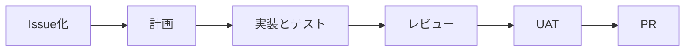

# 14-1-1: AIを率いて開発するとは

## 🎯 このセクションで学ぶこと

- Tutorial 14で、何を自分が決めて、何をAIがやるのかを言えるようになる。
- Claude Codeが、ブラウザで使うAIサービスと何が違うのかを言えるようになる。
- 1つの機能ができあがるまでの流れを、6つの段階で追えるようになる。

---

## 導入

Tutorial 13では、設計図を1枚ずつ自分の手で描きました。Tutorial 14からは、そこで決めたことを渡して、コードのほうをAIに書かせます。道具を入れる前に、誰が何をやるのか、1つの機能がどんな順番でできあがるのかを先に置いておきます。この地図が無いと、出てきたものを受け取ってよいのかどうかが、毎回分からなくなります。

---

## ここから先、コードは基本AIが書く

1-1-6「AIの活用法」に、学習の進み具合に合わせてAIとの関係を「先生 → 相棒 → 部下」と変えていく、という話がありました。その表の最後の行、フェーズ4（Tutorial 14以降）にはこう書いてあります。「設計をもとにAIに実装を任せ、自分はレビューと検証で品質に責任を持つ」。ここがそのフェーズ4です。

任せる側に回ると、自分の仕事の中身が入れ替わります。

| 誰が | やること |
|:--|:--|
| あなた | 何を作るのかを決める。どうなったら完成かを決める。どこは変えないかを決める。できたものを受け取るかどうかを判定する |
| AI | 作り方を決める。コードを書く。テストを書いて回す。ブランチを切る、コミットする、GitHubにイシューやプルリクエストを出す |

決めるのはあなたですが、決める前の整理まで一人でやる必要はありません。何を作りたいのかが自分でも言葉になっていない段階で、AIに質問させて引き出す形は、Chapter 2で扱います。

もう1つ変わるのが、1回に出てくる量です。1機能まるごと作らせると、同じ時間で出てくるものの大きさが変わります。手で書いても間に合う量しか出さないなら、道具を入れ替えた意味はほとんどありません。この量を一度浴びておくのが14-1-4です。

---

## Claude Codeとは何か

Tutorial 13までAIに質問するとき使ったのは、ブラウザで開く対話型のサービスでした。読んで答えてもらうだけなら、それで足ります。

Claude Codeは役割が違います。自分のリポジトリのファイルを**直接読み書きし、コマンドも実行できる**道具です。コードを画面に貼り付けて、返ってきたものを自分でファイルに写す、という往復が要りません。設計書を渡して実装させるには、この直接さが必要です。この教材が道具をClaude Code 1つに絞るのは、これが理由です。

Claude Codeを使うにはProプランの契約が要ります（2026年8月時点）。無料のプランには含まれていません。受講料とは別に、月々の支払いが発生します。アカウントと契約の準備は、14-1-2で案内します。

---

## 開発の進み方

Tutorial 14では、1つの機能を次の順番で作ります。

ブランチを切ることとマージは、この6つの段のあいだに挟まるGitの手順なので、段には数えていません。

| 段階 | やること |
|:--|:--|
| Issue化 | 作るものをイシュー（作業の票）として立て、目的と完成の条件を書く |
| 計画 | どう作るかを決める。計画をどんな形で持つかは、Chapter 3で選びます |
| 実装とテスト | コードとテストを書き、テストが通るまで直す |
| レビュー | 書かれたコードと、書き換わった箇所の差分を読む |
| UAT | 受け入れテスト。使う人の側の操作で、頼んだとおりに動くかを確かめる |
| PR | プルリクエストを出し、確かめた証拠を本文に残してマージする |

先頭のIssue化は、12-2-1「イシュー駆動開発とは」でやったものと同じです。違うのは票を立てるところもAIに任せる点で、その頼み方はChapter 3で扱います。

各章はこの図を順に進みます。Chapter 2がIssue化の中身（意図と受け入れ条件）を固めるところ、Chapter 3が起票から計画・実装とテストまで、Chapter 4がレビューからPRまでで、Chapter 5はこの6段をもう1周します。

---

## Tutorial 14でやること

手を動かすものは、次のとおりです。

1. 使い捨てのフォルダで、小さなWebアプリを1本まるごと作らせます（14-1-4）。量とスピードを見るためだけのもので、できたものは捨てます
2. Tutorial 13で設計図を描いた投稿アプリ（`post-app-practice`。画面には「つぶやき投稿アプリ」と出ています）に、**リプライ機能**を足します。Chapter 2からChapter 4まで、この1機能を上の6段で通します
3. 同じアプリに、**ポストを作る機能**を足します（Chapter 5）。今度は最初から最後まで一人で回します

Tutorial 14を終えたときの状態は、1つの機能をイシューからプルリクエストまでAIに任せて回し、できたものを自分で判定して受け取れる、というところです。

---

## ✨ まとめ

- あなたが決めるのは、作るもの・完成の条件・変えない範囲・受け取るかどうかの4つ。作り方とコードとテストはAIに任せる。
- 何を作りたいかを一人で固めてから渡す必要はない。整理はAIとの対話でやる。
- Claude Codeは、リポジトリのファイルを直接読み書きしてコマンドも実行する道具。使うにはProプランが要る（2026年8月時点）。
- 1つの機能は Issue化 → 計画 → 実装とテスト → レビュー → UAT → PR の順で進む。ブランチとマージは、その間に挟まるGitの手順。
- Chapter 2〜4でリプライ機能を1周し、Chapter 5でポスト作成機能を一人で1周する。

---
