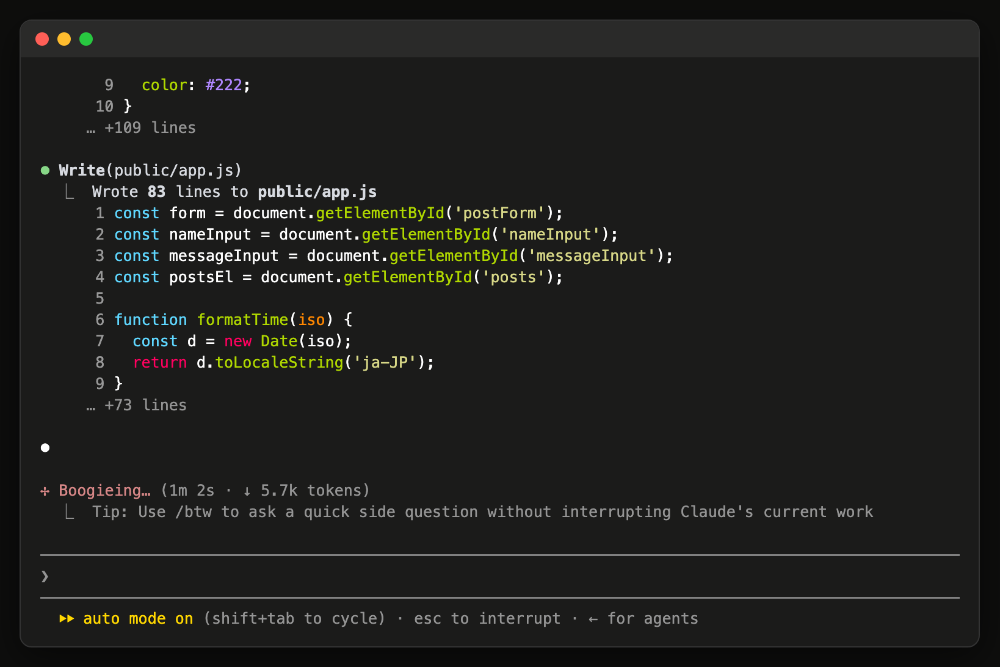
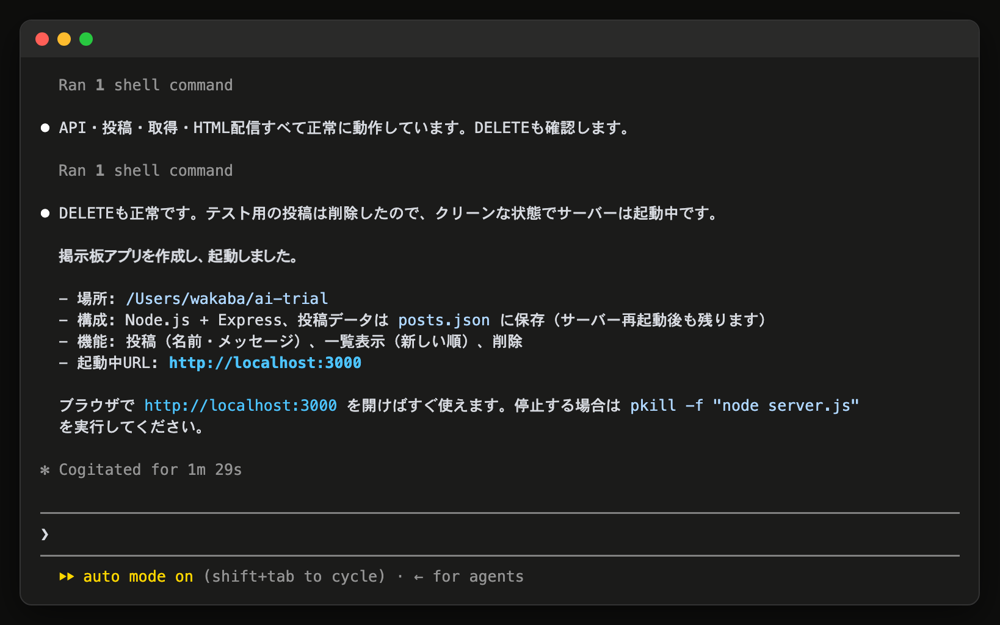
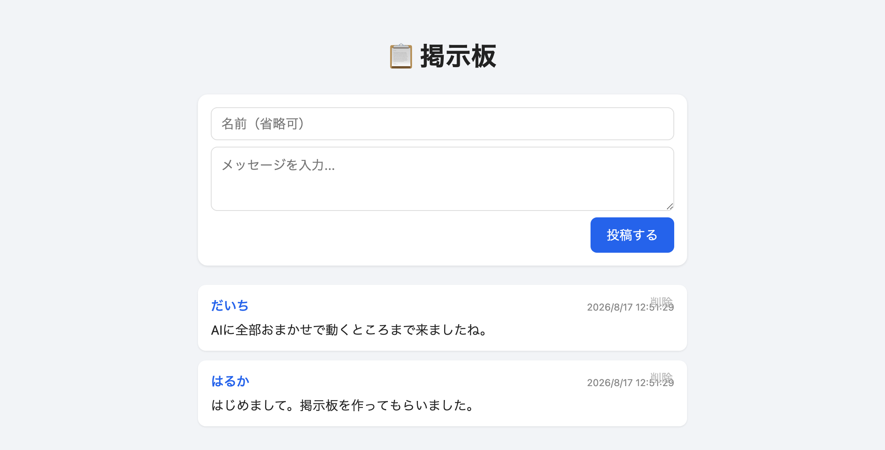

# 14-1-4: アプリをまるごと作らせて見る

## 🎯 このセクションで学ぶこと

- 1つの依頼から、どれくらいの量のコードがどれくらいの速さで出てくるのかを、自分の目で見る。
- 出てきたものを動かして、受け取ってよいかどうかを判定できるか試す。
- この先の演習で、いまあるアプリに足していく形をとる理由が分かる。

---

## 導入

Tutorial 12まで、ログインやCRUDを1画面ずつ手で作ってきました。あの規模のアプリが1つの依頼から丸ごと出てくると、量とスピードの感覚が変わります。ここは説明を読んで分かるところではないので、1回だけ実際に走らせて眺めます。

作るものは使い捨てです。この節でできたものは、この先の章では使いません。

---

## 🏃 使い捨てのフォルダで1本作らせる

### Step 1: フォルダを作って起動する

投稿アプリのフォルダの**外**に、新しく空のフォルダを作ります。投稿アプリの中に作ると、関係のないファイルがGitの記録に混ざります。

```bash
# ホームの下に、使い捨てのフォルダを作って移動する
mkdir ~/ai-trial
cd ~/ai-trial
claude
```

初めて開くフォルダなので、このフォルダで作業してよいかを聞かれます。自分で作ったフォルダなので、`1. Yes, I trust this folder` を選んで `Enter` を押します（2026年8月時点）。

### Step 2: 依頼を1本投げて、待つ

送るのは、この1行です。

```text
掲示板アプリを作って動かして。
```

何で作るか、どこにファイルを置くか、どんな画面にするか、データをどう保存するかは書いていません。全部AIが決めます。

送ったら、5分ほど待ちます。画面には、フォルダを作る、ファイルを書く、コマンドを実行する、といった作業が順に流れていきます。読めなくても構いません。ここで見るのは中身よりも量です。

途中で承認を求められたら、内容を読んで許可して構いません。Step 1でフォルダを確かめたときと同じ形で、選択肢が番号付きで並びます。許可する側を選んで `Enter` を押してください。

**依頼が走っている画面**



> 💡 **出力例について**: AIの応答は毎回変わります。以下はあくまで一例です。文言が違っても、チェックリストの項目を満たしていれば問題ありません。

```text
あなた: 掲示板アプリを作って動かして。
Claude Code: （使う技術を自分で決め、フォルダとファイルを作り、
              アプリを起動して、開くアドレスと使い方を報告してくる）
```

**完走したときの報告**



選ぶ技術は毎回変わります。同じ依頼を2回投げても、違う作りのものが出てくることがあります。

### Step 3: 動かして眺める

報告に書かれたアドレスをブラウザで開きます。書き込みを1件送って、一覧に出ることを確かめてください。ほかにどんな操作ができるようになっているかも、ひととおり触ってみます。

**できたアプリをブラウザで開いた画面**



動きます。5分前には空だったフォルダに、動くアプリが1本あります。

ここで、受け取るかどうかを決めてみてください。この画面のこの作りで、注文どおりにできていると言えるかどうかです。おそらく決められません。話題ごとにスレッドを分けるべきだったのか、書き込みに名前を付けさせるのか、本文が空のまま送れてよいのか、書いたものを誰が消せるのか。どれも自分が決めていないので、出てきたものが合っているかどうかを判定できません。

量が出せることと、出てきたものを受け取れることは別です。受け取るには、**何が欲しかったのかを自分が言える**必要があります。それをAIに渡せる形にしていくのが、Chapter 2からの内容です。

### Step 4: 動かしたアプリを止める

AIが起動したアプリは、そのままにしておくと動き続けて、ポート（6-2-4で見た、通信の窓口になる番号）を掴んだままになります。止め方が分からなければ、そのまま「さっき起動したアプリを止めて」と頼めます。止まったら `/exit` でClaude Codeを閉じてください。

このアプリは、この先の章では使いません。次のセクションからは投稿アプリのほうで作業するので、フォルダを戻しておきます。

```bash
# 投稿アプリのフォルダへ戻る
cd ~/laravel-practice/post-app-practice
```

ここまでで、次を確かめてください。

- [ ] ブラウザで開いて、書き込みを1件送れた
- [ ] 出てきたものを受け取ってよいかどうかを、自分が判定できなかった（何を決めていなかったから判定できないのかも挙げられる）
- [ ] AIが起動したアプリが止まっている
- [ ] `post-app-practice` で `git status` を打っても、変更されたファイルが1つも出てこない

---

## 本筋は、いまあるアプリに足していくこと

Tutorial 14でこの先やるのは、空のフォルダから作らせることではありません。Tutorial 13から使っている投稿アプリに、機能を1つずつ足していきます。

実務でいちばん多いのがこの形だからです。仕事で触るコードは、たいてい誰かが先に書いたものです。動いているものを止めずに、その隣に足す。すでにある決まりごとに合わせる。この2つは、空のフォルダからでは練習になりません。何を書いても、壊す相手がいないからです。

ただし、大きさは違います。仕事で触るコードはファイルが何百とあり、自分が書いていない部分のほうが多く、止めれば誰かが困るものも動いています。Tutorial 14で使う投稿アプリは、それに比べれば小さなアプリです。小さくしてあるのは、覚えるものをClaude Codeの回し方のほうへ寄せるためです。規模が変わっても、いまあるものに足すときの進め方は変わりません。

投稿アプリには、タイムラインも編集も削除も、権限の判定もすでにあります。そこにリプライ機能を足す、という形で先へ進みます。

---

## ✨ まとめ

- 1つの依頼から、動くアプリが数分で1本出てくる。量とスピードは、任せてよい範囲を狭めても上がらない。
- 出てきたものを受け取れるかどうかは、量とは別の話。何が欲しかったのかを自分が言えないと、判定できない。
- Tutorial 14の本筋は、すでにあるアプリに足していく形。動いているものを壊さずに足す練習は、空のフォルダではできない。
- 題材の投稿アプリは、実務で触るコードより小さい。進め方は規模が変わっても同じ。

---
