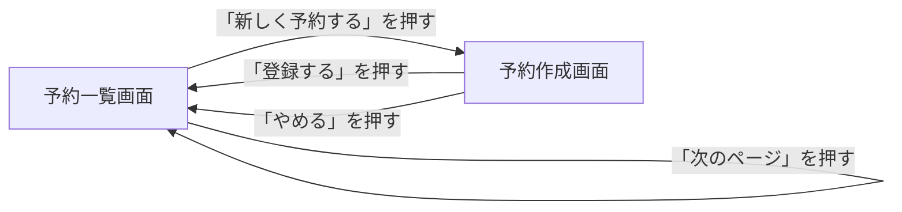
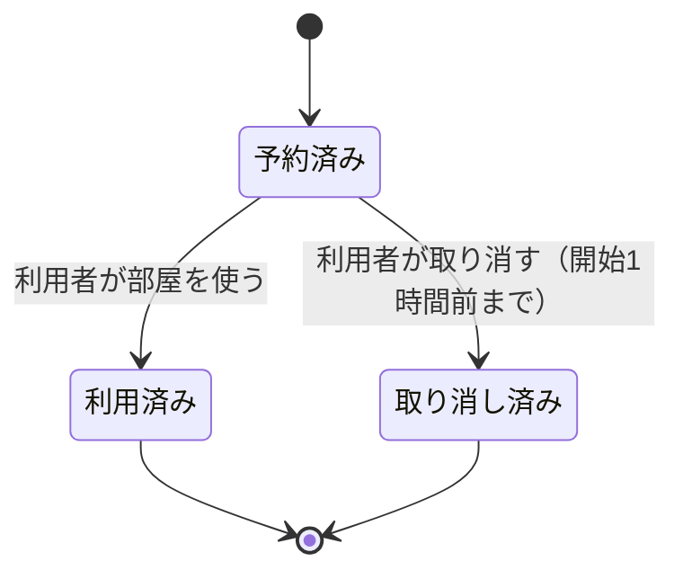
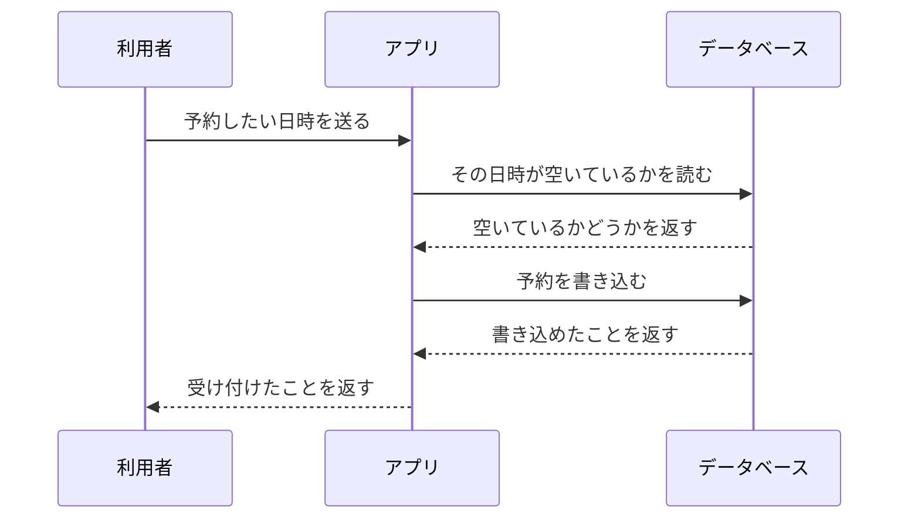
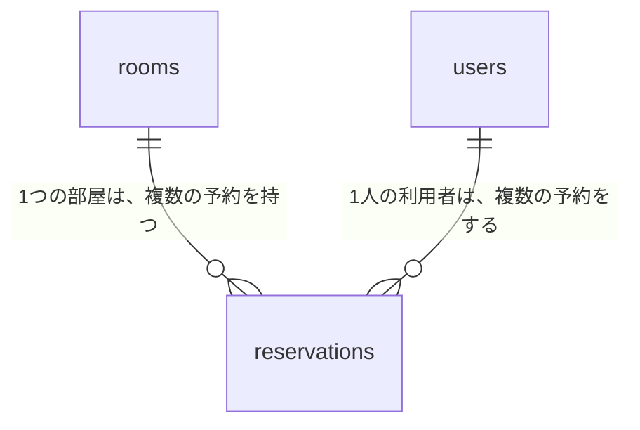
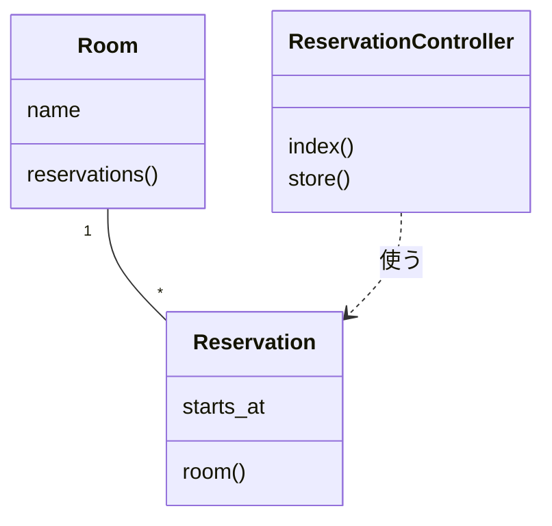
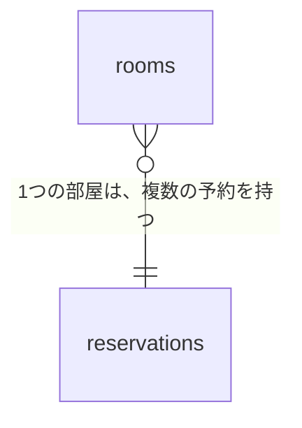
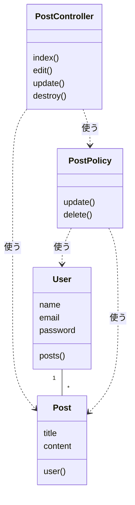
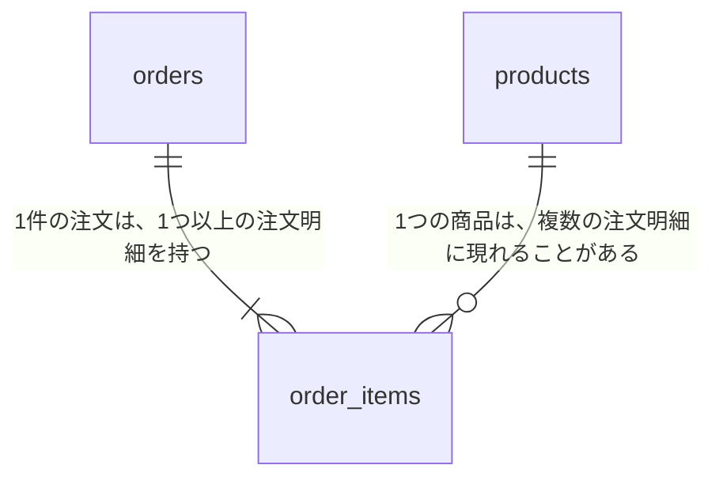

# 14-2-3: 設計書をテキストにする - Mermaid入門

## 🎯 このセクションで学ぶこと

- Tutorial 13で描いた図を、テキストで書けるようになる。
- AIに図を起こさせ、それが元の図と合っているかを自分で確かめられるようになる。
- テキストにできない図の扱いが分かるようになる。

---

## 導入：図をテキストで書く

8-1-5「データベース設計の基礎」で、テーブルどうしのつながりを表したER図を読みました。あの図は、**Mermaid**という書き方で作られています。テキストで書くと図になる、という道具です。Tutorial 13の教材で見てきた画面遷移図やシーケンス図も、同じ書き方で作られていました。

Tutorial 13では、図はdraw.ioで手で描き、`.drawio` とPNGの2つを保存してきました。この形には弱点があります。AIに渡せるのは画像としてだけで、AIが1本の矢印を足したり、言葉を直したりはできません。図の中身を差分で見比べることもできません。

テキストならどちらもできます。AIが読めますし、書けますし、書き換えたところが差分に出ます。図についても、14-1-1で引き直した線がそのまま当てはまります。

draw.ioで苦労したところも、いくつか消えます。13-6-1のシーケンス図では、ライフラインを手で引き、線が足りなくなったら継ぎ足していました。Mermaidでは、登場するものを並べるだけで縦の線が引かれます。13-7-1のクラス図では、1つの四角に複数行の文字を入れる操作を学んでいないので、属性が2つあるときは、属性の段を四角2つで作っていました。Mermaidでは、1つのまとまりの中に何行でも書けます。

---

## Mermaidの読み方

Mermaidは、Markdownのコードブロックの中に書きます。言語の指定を `mermaid` にすると、その中身が図として表示されます。

書くときの決まりは2つだけです。**1行目に図の種類を書く**こと、**2行目からは、四角や矢印を1行に1つずつ書く**ことです。

画面遷移図から見てみます。題材は会議室の予約アプリです。

**書いたもの**

```text
flowchart LR
    A[予約一覧画面] -->|「新しく予約する」を押す| B[予約作成画面]
    B -->|「登録する」を押す| A
    B -->|「やめる」を押す| A
    A -->|「次のページ」を押す| A
```

**表示される図**



`A` と `B` は、その画面を指すための短い名前です。2回目からはこの名前だけで呼べます。4行目の `A -->|...| A` のように、自分自身へ戻る矢印も、同じ書き方で引けます。

13-3-1「画面一覧と画面遷移図」でdraw.ioに描いたものと、次のように対応しています。

| draw.ioで描いたもの | Mermaidの書き方 |
|:--|:--|
| 四角（中に画面名） | `A[予約一覧画面]` |
| 矢印（根元が移る前、先端が移った後） | `A --> B` |
| 矢印に添えた文字 | `A -->\|「登録する」を押す\| B` |
| 最初の画面を左（または上）に置く | 1行目の `flowchart LR`（左から右）／`flowchart TD`（上から下） |

---

## 残り4つの図の書き方

Tutorial 13で描いた7つの図のうち、Mermaidで書けるのは5つです。画面遷移図は見たので、残り4つを、書き方の易しい順に並べます。

### 状態遷移図

**書いたもの**

```text
stateDiagram-v2
    [*] --> 予約済み
    予約済み --> 利用済み: 利用者が部屋を使う
    予約済み --> 取り消し済み: 利用者が取り消す（開始1時間前まで）
    利用済み --> [*]
    取り消し済み --> [*]
```

**表示される図**



| draw.ioで描いたもの | Mermaidの書き方 |
|:--|:--|
| 四角（中に状態の名前） | 状態の名前をそのまま書く（`予約済み`） |
| 始まりの印・終わりの印 | `[*]`。始まりは矢印の根元に、終わりは先端に置く |
| 矢印 | `-->` |
| 矢印に添えた文字（イベントと条件） | `: ` のうしろに書く |

13-6-2でdraw.ioに描いたときは、始まりと終わりの印を「開始」「終了」と書いた図形で代用していました。Mermaidには `[*]` という決まった書き方があります。

### シーケンス図

**書いたもの**

```text
sequenceDiagram
    participant U as 利用者
    participant A as アプリ
    participant D as データベース

    U->>A: 予約したい日時を送る
    A->>D: その日時が空いているかを読む
    D-->>A: 空いているかどうかを返す
    A->>D: 予約を書き込む
    D-->>A: 書き込めたことを返す
    A-->>U: 受け付けたことを返す
```

**表示される図**



| draw.ioで描いたもの | Mermaidの書き方 |
|:--|:--|
| いちばん上の四角（登場するもの） | `participant U as 利用者` |
| 下へ伸びるライフライン | 自分で引かなくても、`participant` を書けば引かれる |
| 頼む線 | `->>` |
| 返す線 | `-->>`（点線で表示されます） |
| 線に添えた文字 | `: ` のうしろに書く |

`participant` を書いた順に、左から並びます。並び順を変えたいときは、この行の順番を入れ替えます。

### ER図

5つの中で、Tutorial 13との差がいちばん大きいのがER図です。

**書いたもの**

```text
erDiagram
    rooms ||--o{ reservations : "1つの部屋は、複数の予約を持つ"
    users ||--o{ reservations : "1人の利用者は、複数の予約をする"
```

**表示される図**



13-5-2「ER図と正規化」では、どちらが1件でどちらが複数件かを、線の脇に文字で書きました。Mermaidでは、線そのものの形で表します。

| 書き方 | 意味 | Tutorial 13で文にしていた例 |
|:--|:--|:--|
| `\|\|--o{` | 左が1件、右が0件以上 | 1つの部屋は、複数の予約を持つ |
| `\|\|--\|{` | 左が1件、右が1件以上 | 1件の注文は、1つ以上の注文明細を持つ |

記号の読み方そのものは、8-1-5で表を見ています。`|` が1件、`o` が0件でもよい、`{` が複数件です。

ER図で気をつけることが2つあります。

1つ目は、**関係の行から `: "ラベル"` を省けない**ことです。`rooms ||--o{ reservations` だけで終わると、図が表示されずにエラーになります。日本語や空白を含むラベルは、`" "` で囲む必要もあります。

2つ目は、**四角の中に書くのはテーブル名だけ**にすることです。8-1-5で読んだER図には、四角の中にカラムと型まで書かれていました。ここでは13-5-2で決めたとおり、テーブル名だけにします。カラムは、このあと14-2-4でテーブル定義書に書きます。

### クラス図

**書いたもの**

```text
classDiagram
    Room "1" -- "*" Reservation
    ReservationController ..> Reservation : 使う
    class Room {
        name
        reservations()
    }
    class Reservation {
        starts_at
        room()
    }
    class ReservationController {
        index()
        store()
    }
```

**表示される図**



| draw.ioで描いたもの | Mermaidの書き方 |
|:--|:--|
| 3つの段に分けた四角 | `class Room { }` の中に書く。`()` の付かない行が属性、付く行が操作 |
| 互いを知っている線（関連） | `--` |
| 線に添えた多重度 | `"1"` と `"*"`（`*` は複数件） |
| 使う関係（矢印の付いた線） | `..>`。根元が使う側、先端が使われる側 |
| 使う関係に添えた文字 | `: 使う` |

クラスの中身だけは、1行に1つずつという決まりから外れます。`{` と `}` で囲んだまとまりの中に、属性と操作を何行でも並べます。

ラベルは日本語のまま書きますが、クラス図のクラス名・属性名・操作名と、ER図のテーブル名だけは英語です。どちらも、実物のコードやテーブルに付いている名前だからです。

---

## 描けても、合っているとは限らない

ここがこのセクションの山場です。

Mermaidは、書き方さえ合っていれば図を表示します。**設計として正しいかどうかは、見ていません。** 次の1行を見てください。

**書いたもの**

```text
erDiagram
    rooms }o--|| reservations : "1つの部屋は、複数の予約を持つ"
```

**表示される図**



記号は「部屋が複数件、予約が1件」と言っているのに、ラベルは逆のことを書いています。それでも、図はきれいに表示されます。画面遷移図で矢印の向きを逆にしても、シーケンス図で頼む線と返す線を入れ替えても、同じことが起きます。

ですから、確かめる作業は2段階になります。

| 段階 | 何を確かめるか | 誰が確かめるか |
|:--|:--|:--|
| 1段階目 | 図として表示されるか | 機械が教えてくれる。表示されないときは、図の代わりにエラーの文言が出る |
| 2段階目 | 元の図と同じことを言っているか | **人が読むしかない** |

2段階目で見るのは、どの図種にも共通する次の観点です。

- [ ] 元の図に無いものが増えていない（AIは親切に足すことがあります）
- [ ] 元の図にあったものが消えていない（とくに自分自身へ戻る矢印、中間テーブル、空の段）
- [ ] 言葉が言い換えられていない（「登録する」が「保存する」になっていないか）

図種ごとに見るところは、次のとおりです。

| 図種 | 人が確かめること |
|:--|:--|
| 画面遷移図 | 四角の数が同じか／矢印の向きが元と同じか／矢印の文字が一字一句同じか／自分自身へ戻る矢印が消えていないか |
| 状態遷移図 | 状態の数が同じか／始まりの印から出る矢印が1本だけか／矢印の本数が遷移表の行数と合っているか |
| シーケンス図 | 登場するものの並び順が同じか／線の本数が同じか／頼む線と返す線が入れ替わっていないか |
| ER図 | 四角の数が同じか／`\|\|` と `o{` の向きがラベルの文と合っているか（いちばん多い間違いです）／中間テーブルが消えていないか／カラムが勝手に足されていないか |
| クラス図 | クラスの数が同じか／属性と操作の行が元と同じか（`id` や `created_at` が勝手に足されていないか）／多重度の `"1"` と `"*"` が元の文と合っているか／`--` と `..>` が入れ替わっていないか |

---

## 図が出るか確かめる

1段階目の確認は、VS Codeでできます。13-2-1でMarkdownの表が正しく書けたかを確かめたときと、同じプレビューです。Mermaidの図も、ここに表示されます。**拡張機能を入れる必要はありません。** 新しめのVS Codeには、Mermaidを図にする機能が最初から入っています（2026年8月時点）。

`.md` ファイルを開いた状態で `Ctrl+Shift+V`（Macは `Cmd+Shift+V`）を押すか、エディタ右上のプレビューのボタンを押してください。書き方が間違っていると、図の代わりにエラーの文言が表示されます。`Parse error on line 2:` のように何行目が悪いのかが書かれていることが多いので、その行をAIに伝えて直させます。行番号が見当たらないときは、そのMermaidのコードをそのまま貼って、出たエラーの文言と一緒に渡してください。

図もエラーも出ない場合は、VS Codeが古い可能性があります。「ヘルプ」→「バージョン情報」（Macは「Code」→「Visual Studio Code について」）で確認し、古ければ更新してください（2026年8月時点）。更新しても表示されないときは、GitHubへpushして、GitHub上のファイルで確かめてください。13-1-3でPNGの表示を確かめたときと同じやり方です。

---

## Mermaidで書けない2つの図

残る2つ、ユースケース図とワイヤーフレームには、Mermaidの決まった書き方がありません。無理にフローチャートで似せると、Tutorial 13で描いた図とは別物になってしまいます。この2つは画像のまま残し、AIへは14-2-1で学んだ「画像を渡す」やり方で渡します。

ユースケース図には、もう1つの渡し方があります。AIに渡す材料としては、図よりもユースケース記述（Markdown）のほうがよく効きます。誰が何をできるのかは、機能一覧・権限マトリクス・ユースケース記述の3つで、すべて文字にできるからです。この考え方は、次の14-2-4でそのまま使います。

---

## 🏃 自分が描いた図を起こさせる

> 🔥 ここからは、AIに実装を任せて構いません。ただし「任せる」と「丸投げ」は違います。何を作るかは設計書で自分が決め、出てきたものはテスト・動作確認・コードレビューで自分が検証します。品質の責任は、AIではなくあなたが握ります。

Tutorial 13で自分が描いた図を2枚、Mermaidに起こします。1枚目は10-3-5の投稿管理と認可のアプリのクラス図、2枚目はカフェのモバイルオーダーアプリのER図です。どちらもdesign-practiceに入っています。

進め方は次のとおりです。誰がやるのかを、行の先頭に書いてあります。

1. 【自分】使うPNGを、アプリのフォルダへコピーする
2. 【自分】設計書を置く `docs/` フォルダを作る
3. 【AI】1枚目のPNGを渡し、図の種類を名指ししてMermaidに起こさせる
4. 【自分】VS Codeのプレビューで、図が表示されるかを見る
5. 【自分】元のPNGと並べて、観点のチェックリストで読み比べる
6. 【自分⇄AI】違っていたところを、どこがどう違うのかを自分の言葉で伝えて直させる
7. 【自分】2枚目のER図も、同じ手順で起こす

### Step 1: 使うPNGをアプリのフォルダへコピーする

Claude Codeが承認なしで読めるのは、起動したフォルダとその下にあるファイルです。外にあるものを読ませるには許可が要るので、使う2枚を先にアプリのフォルダへ持ってきます。

```bash
# アプリのフォルダの中で実行する（MacもWindows(WSL)も同じです）
cd ~/laravel-practice/14_hands-on/authorization-app-ai
cp ~/design-practice/13-7/authz-class.png .
cp ~/design-practice/13-5/cafe-er.png .
```

`cp` は13-1-3で使ったコピーの命令です。最後の `.` は「いまいるフォルダへ」という意味です。VS Codeの左側のファイル一覧へドラッグ＆ドロップしても、同じことができます。

これで2枚がアプリのフォルダに入ったので、ここから先は画像も `@` で指せます。14-2-1で貼り付けを使ったのは、撮ったばかりでファイルになっていない画面を渡すためでした。

> 💡 **TIP**: 手元に `~/design-practice` が無い方は、13-1-3「UMLと作図の約束事」と同じ手順で、GitHubから取り戻してください。`cd ~` のあと `git clone git@github.com:あなたのユーザー名/design-practice.git` を実行すると、`~/design-practice` が作られます。

### Step 2: `docs/` フォルダを作る

これから作る設計書は、design-practiceではなく、アプリと同じ場所に置きます。そのための入れ物を1つ作ります。

```bash
# アプリのフォルダの中で実行する
mkdir docs
```

`docs/`（アプリのリポジトリの中に、設計書を置くフォルダ）という名前は、多くのプロジェクトで使われています。この中の `mermaid-practice.md` に、起こした図を書き込んでいきます。このファイルは、次のStep 3でClaude Codeが作ります。自分で先に作っておく必要はありません。

### Step 3: 1枚目（クラス図）を起こさせる

アプリのフォルダでClaude Codeを起動し、次のように頼みます。

```bash
# アプリのフォルダへ移動して起動する
cd ~/laravel-practice/14_hands-on/authorization-app-ai
claude
```

```text
@authz-class.png はクラス図です。この図を Mermaid の classDiagram で書き起こして、
docs/mermaid-practice.md に「クラス図」という見出しを付けて書き込んでください。

- 四角と矢印に書いてある言葉は、言い換えずにそのまま使ってください
- 色やスタイルの指定は付けないでください
- 使ってよいのは class・関連の線・多重度・使う関係の矢印だけです
```

> 💡 この依頼のポイントは4つです。①`@` で画像ファイルを名指ししている ②図の種類を `classDiagram` と名指ししている（指定しないと、AIがどの図種で書くかを自分で決めます）③書き込む先のファイルを指定している ④出力の決まりを3つに絞って書いている。文言をそのまま覚える必要はありません。

> 💡 **出力例について**: AIの応答は毎回変わります。以下はあくまで一例です。文言が違っても、チェックリストの項目を満たしていれば問題ありません。

```text
あなた: （上の依頼を送る）
Claude Code: （authz-class.png を読み、Mermaidのコードを作って、
              docs/mermaid-practice.md への書き込みを承認してよいか尋ねてくる）
あなた: （差分を読んで、頼んだとおりなら承認する）
```

`@` でPNGを指してもうまく読み取れないときは、その画像を開いてコピーし、14-2-1で学んだ貼り付けで渡してください。

### Step 4: 図が表示されるかを見る

VS Codeで `docs/mermaid-practice.md` を開き、`Ctrl+Shift+V`（Macは `Cmd+Shift+V`）でプレビューを出します。

図が表示されれば、1段階目は合格です。図の代わりにエラーの文言が出たときは、「図が出るか確かめる」で書いたとおりに直させてから、もう一度プレビューを見てください。

### Step 5: 元のPNGと読み比べる

VS Codeで `authz-class.png` を開き、プレビューの図と並べてください。

さきほどの観点で、上から順に確かめます。クラスの数。属性と操作の行。多重度の `"1"` と `"*"`。`--` と `..>` の使い分け。10-3-5で自分の手で書いた `PostPolicy` が、ちゃんと `PostController` から使われる側に描かれているか。

### Step 6: 違いを自分の言葉で伝える

違いが見つかったら、「もう一度やり直して」とは言わないでください。**どこがどう違うのかを、自分の言葉で伝えます。**

```text
PostPolicy と Post の間の線が、関連（--）になっています。
元の図では PostPolicy が Post を使う関係（..>）なので、そこだけ直してください。
```

これができるかどうかが、図を読めているかどうかの分かれ目です。言葉にできないときは、まだ図を読み切れていません。もう一度、元のPNGを見てください。

### Step 7: 2枚目（ER図）を起こす

同じ手順で、`@cafe-er.png` をER図として起こします。図の種類は `erDiagram` と名指しします。

ER図では、記号とラベルの向きが合っているかを必ず見てください。13-5-4の解答では、注文と注文明細は「1つ以上」、商品と注文明細は「複数」と書き分けていました。この違いが、`||--|{` と `||--o{` の違いとして出ているはずです。

時間があれば、3枚目として画面遷移図・シーケンス図・状態遷移図のどれかを、design-practiceからもう1枚起こしてみてください。

2枚を書き終えたら、次の4つを確かめてください。

- [ ] `docs/mermaid-practice.md` をプレビューで開くと、2枚とも図として表示される
- [ ] 元のPNGと並べて、共通の3つの観点を1つずつ確かめた
- [ ] クラス図で、クラスの数と多重度が元の図と合っている
- [ ] ER図で、記号の向きがラベルの文と合っている

ここではまだコミットしません。次のセクションでイシューを立ててから、まとめて記録します。プレビューがどうしても動かず、GitHubで確かめた方だけは、先にコミットとpushをしていて構いません。

Step 1でコピーした2枚のPNGは、そのまま置いておいて構いません。次のセクションで記録するのは `docs/` の中だけなので、この2枚は記録されずに残ります。

<details>
<summary>📖 起こし終えたら開く（答え合わせ）</summary>

自分の書いたものと1文字も違わない必要はありません。確かめるのは、上の観点を満たしているかどうかです。名前の付け方や行の並び順が違っていても、図として同じことを言っていれば合っています。

**クラス図**（13-7-3の模範解答をMermaidにしたもの）

```text
classDiagram
    User "1" -- "*" Post
    PostController ..> Post : 使う
    PostController ..> PostPolicy : 使う
    PostPolicy ..> User : 使う
    PostPolicy ..> Post : 使う
    class User {
        name
        email
        password
        posts()
    }
    class Post {
        title
        content
        user()
    }
    class PostController {
        index()
        edit()
        update()
        destroy()
    }
    class PostPolicy {
        update()
        delete()
    }
```



`User` と `Post` の間だけが関連（`--`）で、残りの4本は使う関係（`..>`）です。ここが入れ替わっていたら直してください。

**ER図**（13-5-4の模範解答をMermaidにしたもの）

```text
erDiagram
    orders ||--|{ order_items : "1件の注文は、1つ以上の注文明細を持つ"
    products ||--o{ order_items : "1つの商品は、複数の注文明細に現れることがある"
```



1行目が `|{`、2行目が `o{` です。明細が0件の注文はありませんが、まだ一度も注文されていない商品はあり得るからです。この書き分けは、13-5-4で自分が文で書いた説明と同じことを言っています。

</details>

---

## 💡 よくある間違い

**ER図の関係の行で、ラベルを省く**

ER図の書き方で挙げた2つ（ラベルを省かない、日本語や空白を含むラベルは `" "` で囲む）は、AIもよく踏みます。図が表示されなかったときは、まずここを見てください。

**図の種類を指定せずに頼む**

「この画像を Mermaid にして」とだけ頼むと、どの図種で書くかをAIが決めます。クラス図をフローチャートで書かれてしまうこともあります。渡すときは、必ず `classDiagram` のように図種を名指ししてください。

---

## ✨ まとめ

- Tutorial 13で描いた7つの図のうち、5つはMermaidというテキストの書き方で表せます。テキストなら、AIが読めて、書けて、差分にも出ます。
- 書き方の決まりは2つです。1行目に図の種類を書き、2行目からは、四角や矢印を1行に1つずつ書きます。
- ER図の関係の行は、`: "ラベル"` を省けません。日本語や空白を含むラベルは `" "` で囲みます。
- ユースケース図とワイヤーフレームには、Mermaidの書き方がありません。画像のまま残し、必要なときは画像として渡します。
- 確かめる作業は2段階です。図として表示されるかは機械が教えてくれますが、元の図と同じことを言っているかは、人が読むしかありません。

> 🔑 描けたかどうかは機械に聞ける。合っているかどうかは、自分で読むしかない。

次のセクション（14-2-4）では、いま作った `docs/` の中に、新しい機能の設計書一式を作ります。図を起こさせるところから、設計書そのものを書かせるところへ進みます。

---
