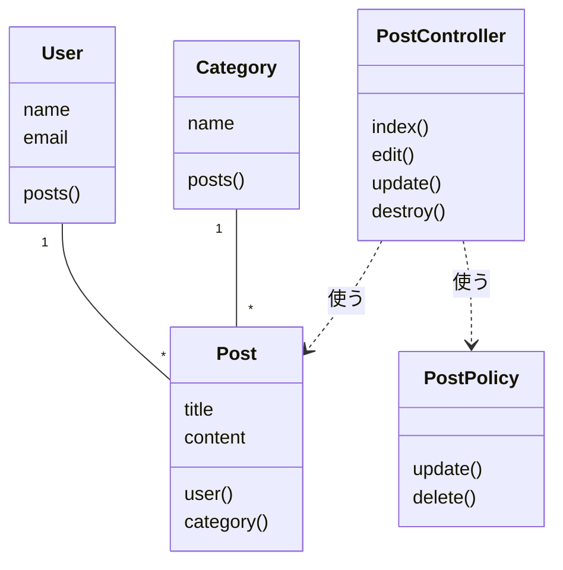
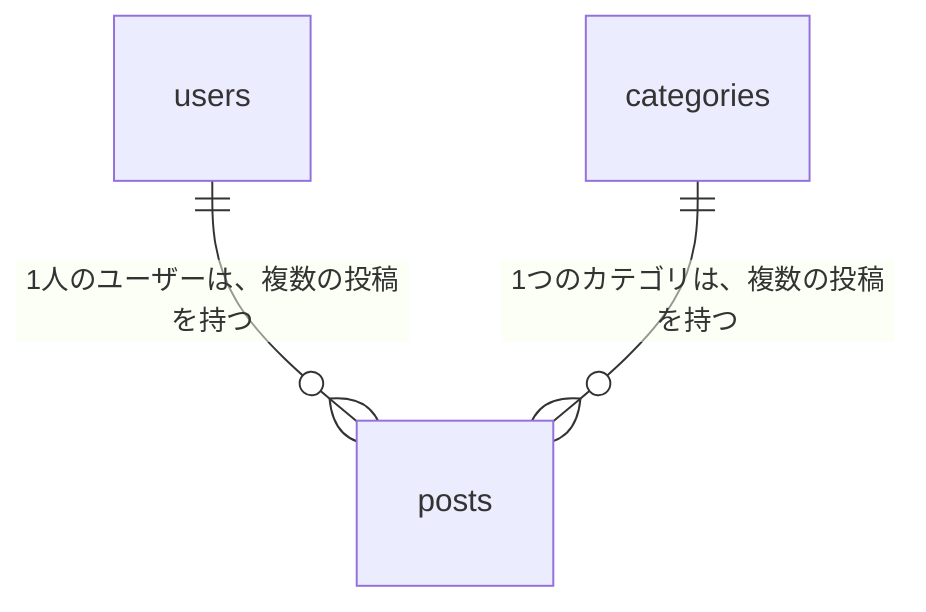
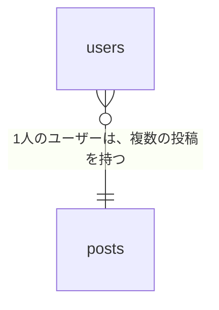

# 14-2-3: 設計書をテキストにする

## 🎯 このセクションで学ぶこと

- 図をテキストで書けるようになる。
- 書いた図が表示されるかを、自分で確かめられるようになる。
- テキストにできない図の扱いが分かるようになる。

---

## 導入：画像の図は、AIが1本の線も直せない

Tutorial 13では、図をdraw.ioで描いて画像に書き出しました。この形だと、AIへ渡せるのは絵としてだけです。矢印を1本足す、言葉を1つ直す、といった作業は頼めません。Gitの差分にも出ません。画像は、中身がどれだけ変わっても「ファイルが1つ差し替わった」としか記録されないからです。

テキストで書いた図なら、どちらもできます。AIが読めて、書けて、書き換えたところが差分に出ます。

---

## Mermaidの読み方

Mermaidは、テキストで書くと図になる書き方です。8-1-5「データベース設計の基礎」で読んだER図も、Tutorial 13の教材に載っていた図も、これで作られています。

Markdownのコードブロックの中に書き、言語の指定を `mermaid` にすると、中身が図として表示されます。決まりは2つです。1行目に図の種類を書くこと。2行目からは、四角や矢印を1行に1つずつ書くことです。

いま動いているアプリのクラス図で見てみます。

**書いたもの**

```text
classDiagram
    User "1" -- "*" Post
    Category "1" -- "*" Post
    PostController ..> Post : 使う
    PostController ..> PostPolicy : 使う
    class User {
        name
        email
        posts()
    }
    class Post {
        title
        content
        user()
        category()
    }
    class Category {
        name
        posts()
    }
    class PostController {
        index()
        edit()
        update()
        destroy()
    }
    class PostPolicy {
        update()
        delete()
    }
```

**表示される図**



13-7-1「クラス図 - 構造を描く」でdraw.ioに描いたものと、次のように対応しています。

| draw.ioで描いたもの | Mermaidの書き方 |
|:--|:--|
| 3つの段に分けた四角 | `class Post { }` の中に書く。`()` の付かない行が属性、付く行が操作 |
| 互いを知っている線（関連） | `--` |
| 線に添えた多重度 | `"1"` と `"*"`（`*` は複数件） |
| 使う関係（矢印の付いた線） | `..>`。根元が使う側、先端が使われる側 |
| 使う関係に添えた文字 | `: 使う` |

クラスの中身だけは、1行に1つずつという決まりから外れます。`{` と `}` で囲んだ中に、属性と操作を何行でも並べられます。

---

## ほかの図の種類

1行目に書く言葉を替えると、別の図になります。

| 図の種類 | 1行目に書くもの |
|:--|:--|
| 画面遷移図 | `flowchart LR`（左から右）／`flowchart TD`（上から下） |
| 状態遷移図 | `stateDiagram-v2` |
| シーケンス図 | `sequenceDiagram` |
| ER図 | `erDiagram` |
| クラス図 | `classDiagram` |

ER図には、つまずきやすいところがあります。

**書いたもの**

```text
erDiagram
    users ||--o{ posts : "1人のユーザーは、複数の投稿を持つ"
    categories ||--o{ posts : "1つのカテゴリは、複数の投稿を持つ"
```

**表示される図**



関係の行から `: "ラベル"` を省くと、図が表示されずにエラーになります。日本語や空白を含むラベルを `" "` で囲むのも必須です。記号の読み方は8-1-5で表を見たとおりで、`|` が1件、`o` が0件でもよい、`{` が複数件を表します。

---

## 表示されることと、合っていることは別

Mermaidは、書き方さえ合っていれば図を出します。中身が正しいかは見ていません。

**書いたもの**

```text
erDiagram
    users }o--|| posts : "1人のユーザーは、複数の投稿を持つ"
```

**表示される図**



記号のほうは「ユーザーが複数件、投稿が1件」と言っているのに、ラベルは逆のことを書いています。それでも図はきれいに表示されます。画面遷移図で矢印の向きを逆にしても、シーケンス図で頼む線と返す線を入れ替えても、同じことが起きます。

確かめる作業は2段階になります。

| 段階 | 何を確かめるか | 誰が確かめるか |
|:--|:--|:--|
| 1段階目 | 図として表示されるか | 機械が教えてくれる。表示されないときは、図の代わりにエラーの文言が出る |
| 2段階目 | 元になったものと同じことを言っているか | 人が読み比べる |

2段階目の「元になったもの」は、これから作る図では実際のコードです。クラス図なら `app/` の中のファイル、ER図ならマイグレーションのファイルが、突き合わせる相手になります。

---

## 図が出るか確かめる

1段階目は、VS Codeのプレビューでできます。13-2-1でMarkdownの表を確かめたときと同じもので、Mermaidの図もここに表示されます。拡張機能を入れる必要はありません。新しめのVS Codeには、Mermaidを図にする機能が最初から入っています（2026年8月時点）。

`.md` ファイルを開いた状態で `Ctrl+Shift+V`（Macは `Cmd+Shift+V`）を押すか、エディタ右上のプレビューのボタンを押してください。書き方が間違っていると、図の代わりにエラーの文言が出ます。`Parse error on line 2:` のように何行目が悪いのかが書かれていることが多いので、その行をAIに伝えて直させます。行番号が見当たらないときは、Mermaidのコードとエラーの文言をそのまま貼って渡してください。

図もエラーも出ないときは、VS Codeが古い可能性があります。「ヘルプ」→「バージョン情報」（Macは「Code」→「Visual Studio Code について」）で確認し、古ければ更新してください（2026年8月時点）。更新しても表示されないときは、GitHubへpushして、GitHub上のファイルで確かめる手もあります。

---

## Mermaidで書けない図

ユースケース図とワイヤーフレームには、Mermaidの決まった書き方がありません。フローチャートで似せて描くと、Tutorial 13で描いた図とは別物になります。この2つは画像のまま持ち、渡すときは14-2-1のやり方で画像として渡します。

ユースケース図のほうには、もう1つの渡し方があります。誰が何をできるのかは、文章で書けるからです。13-2-2で書いたユースケース記述がそれで、AIに渡す材料としては、図よりこちらのほうがよく効きます。

---

## 🏃 いまのアプリの構造図を作る

アプリの構造をMermaidで1枚起こして、`docs/` に置きます。設計書を置くフォルダとして `docs/` を使うのは、多くのプロジェクトでそうなっているためです。

```bash
# アプリのフォルダへ移動して起動する
cd ~/laravel-practice/post-app-practice
claude
```

### Step 1: クラス図を書かせる

```text
このアプリのクラス図を Mermaid の classDiagram で書いて、docs/structure.md に書き込んでください。
app/Models と app/Http/Controllers と app/Policies を読んで、
いま実際にあるものだけを描いてください。色やスタイルの指定は付けないでください。
```

> 💡 この依頼のポイントは3つです。①図の種類を `classDiagram` と名指ししている（指定しないと、どの図種で書くかをAIが決めます）②読ませる場所を3つに絞っている ③「いま実際にあるものだけ」と書いて、これから作るコメントの分を描かせないようにしている。

> 💡 **出力例について**: AIの応答は毎回変わります。以下はあくまで一例です。文言が違っても、チェックリストの項目を満たしていれば問題ありません。

```text
あなた: （上の依頼を送る）
Claude Code: （app/ の中のファイルを読み、docs/structure.md を作って、書いた中身を示す）
```

`docs/` フォルダは、Claude Codeが書き込むときに一緒に作ります。先に自分で作っておく必要はありません。

### Step 2: 図が表示されるかを見る

VS Codeで `docs/structure.md` を開き、`Ctrl+Shift+V`（Macは `Cmd+Shift+V`）でプレビューを出します。図が出れば1段階目は合格です。エラーの文言が出たときは、その行をAIに伝えて直させてから、もう一度プレビューを見てください。

### Step 3: コードと読み比べる

2段階目にあたる作業です。見るところを順に挙げます。

**クラスの数**。`app/Models`・`app/Http/Controllers`・`app/Policies` にあるのは、`User`・`Post`・`Category`・`PostController`・`PostPolicy` の5つです（`Controller.php` は、ほかのコントローラーの土台になる親のクラスなので、数に入れなくて構いません）。図のクラスが多いなら、まだ無いものが描かれています。少ないなら、読み落としがあります。

**線の向き**。`Post` から `User` と `Category` へ、それぞれ線が引かれているはずです。`app/Models/Post.php` の `user()` と `category()` に対応します。`PostController` と `PostPolicy` の間は、使う側から使われる側への `..>` です。

違っていたら、どこがどう違うのかを書いて直させます。

```text
PostPolicy と Post の間の線が、関連（--）になっています。
PostPolicy は Post を使う側なので、そこだけ ..> に直してください。
```

「やり直して」とだけ伝えると、同じところが同じように間違います。

### Step 4: コミットする

この図は、いまのアプリに何があるかを1枚で見せるものです。あとから来た人が最初に開く場所になるので、リポジトリに入れておきます。

```bash
# アプリのフォルダで実行する
git add docs/structure.md
git commit -m "アプリの構造図を追加"
```

書き終えたら、次の4つを確かめてください。

- [ ] `docs/structure.md` をプレビューで開くと、図として表示される
- [ ] 図に出ているクラスが、`app/` にある5つと一致する
- [ ] `Post` から `User` と `Category` へ、それぞれ線が引かれている
- [ ] `docs/structure.md` をコミットした

<details>
<summary>📖 書き終えたら開く（一例）</summary>

1文字も同じである必要はありません。属性をどこまで書くか、並び順をどうするかは、書くたびに変わります。確かめるのは、上のチェックリストを満たしているかどうかです。

```text
classDiagram
    User "1" -- "*" Post
    Category "1" -- "*" Post
    PostController ..> Post : 使う
    PostController ..> Category : 使う
    PostController ..> PostPolicy : 使う
    class User {
        name
        email
        password
        posts()
    }
    class Post {
        user_id
        category_id
        title
        content
        user()
        category()
    }
    class Category {
        name
        posts()
    }
    class PostController {
        index()
        edit()
        update()
        destroy()
    }
    class PostPolicy {
        update()
        delete()
    }
```

`User` と `Post`、`Category` と `Post` の間だけが関連（`--`）で、`PostController` から出ている3本は使う関係（`..>`）です。ここが入れ替わっていたら直してください。

`PostController ..> PostPolicy` は、`app/Http/Controllers/PostController.php` の `$this->authorize('update', $post)` に対応します。この1行が、`PostPolicy` の `update` を呼び出しています。

</details>

---

## ✨ まとめ

- Mermaidは、テキストで書くと図になる書き方です。AIが読めて、書けて、書き換えたところが差分に出ます。
- 決まりは2つです。1行目に図の種類を書き、2行目からは四角や矢印を1行に1つずつ書きます。
- ER図の関係の行は `: "ラベル"` を省けません。日本語や空白を含むラベルは `" "` で囲みます。
- 図として表示されるかはVS Codeのプレビューで分かります。書いてあることが合っているかは、元になったコードと読み比べます。
- ユースケース図とワイヤーフレームには、Mermaidの書き方がありません。画像のまま持ち、必要なときに画像として渡します。

---
