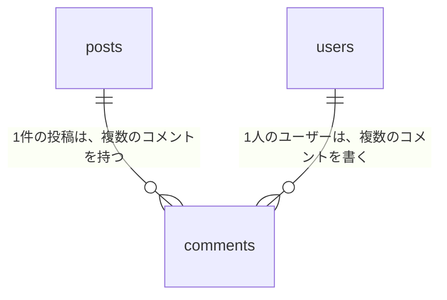

# 14-2-4: AIと設計書を作る

## 🎯 このセクションで学ぶこと

- 決め落としている判断を、AIに質問させて洗い出せるようになる。
- 譲れないところだけを指定して、設計をAIに任せられるようになる。
- 機能イシューを `gh` で立てさせられるようになる。
- できあがった設計書の、どこを読むのかが分かるようになる。

---

## 導入：決めていないことは、AIが決める

設計を進めると、細かい判断が次々に出てきます。コメントは編集できるのか。他人のコメントは消せるのか。返信は付けられるのか。決めていないまま渡せば、AIが答えを埋めます。

埋まったものは、それらしく読めます。読めてしまうので、自分が決めなかったことに気づけません。気づくのは、できあがったものを見て「そういう話ではなかった」となったときです。

先に決めるものと、任せるものを分けます。分けたら、決めたほうをイシューに書いて、動かないところへ置きます。

---

## 今回作る機能

14-2-1で前提を書いたコメント機能を、ここで確定させます。要件の文は次のとおりです。

> 投稿の一覧からは、誰がどんな投稿をしたかしか分かりません。読んだ人が投稿に一言返せるようにします。投稿を1件だけ開いて読める画面を用意し、その画面でコメントを書き込めるようにします。自分が書いたコメントは自分で消せますが、他人のコメントは消せません。

あなたが発注者であり、実装を任せる側でもあります。決めきれないところは、あなたが決めます。ここでは、作らないものを先に2つ決めておきました。

| 作らないもの | 理由 |
|:--|:--|
| コメントの編集 | 消して書き直せば足りるため |
| コメントへの返信 | 画面とデータの作りが一段複雑になるため |

---

## 決めていない分かれ道を、AIに聞き出させる

上の2つは、どこからか湧いて出たものではありません。コメント機能を作ると決めた時点で、決めなければならない分かれ道が何本かあり、その2本を先に塞いだだけです。

やっかいなのは、分かれ道が何本あるのかが、作ったことのない機能では分からないことです。数えられないものは、決め落とします。

ここはAIに聞き出させます。要件の文だけを渡して、**足りない判断を質問させます**。自分から「何を決めればいいですか」と尋ねると一般論が返りますが、いまのアプリを読んだうえで質問させると、このアプリで実際に分かれるところが出てきます。

聞き出すだけで、決めるのはあなたです。返ってきた問いに答えないまま進めれば、導入で見たとおり、AIが答えを埋めます。

---

## 決めて渡すものと、任せるもの

| 決めて渡す | 任せる |
|:--|:--|
| 何ができるようになるか（上の要件の文） | テーブルの名前とカラムの名前 |
| 変えないもの（投稿まわりの4本のルート・`PostPolicy` の判定・カテゴリの表示） | ルートのURLの付け方 |
| 受け入れ条件（下の4つ） | 入力チェックの書き方 |
| 手本にするもの（コメントの削除は `PostPolicy` と同じやり方） | 画面の組み立て方 |
| 設計書の置き場所と見出し | - |

左の列は、14-2-1で書いたものに、設計書の形が1つ足されたものです。見出しを指定するのは、あとで突き合わせるときに要るからです。どこに何が書いてあるかが決まっていれば、Chapter 4で受け入れ条件を探すところから始めずに済みます。書き方まで指定はしません。

### 受け入れ条件

- [ ] ログインした状態で投稿を1件開くと、その投稿の本文と、その投稿に付いたコメントの一覧が表示される
- [ ] 本文を入れてコメントを送ると、その投稿のコメント一覧に自分のコメントが増える
- [ ] 本文を空のままコメントを送ると、エラーが表示され、コメントは増えない
- [ ] 自分が書いたコメントは自分で消せて、他人のコメントは消せない

13-2-2で書いた「〜すると、〜になる」の形で、14-2-1の折りたたみに載せたものと同じです。この4つは、Chapter 4で、できあがったものを受け取ってよいかの判定にそのまま使います。

どの文にも、ボタンの名前が出てきません。「詳細ボタンを押すと」と書いてしまうと、ボタンの名前が変わっただけで判定できなくなります。押す場所も呼び名も、これから決まるところです。

---

## 設計書は1ファイル

`docs/comment.md` に、次の7つの見出しで書かせます。

```text
## 概要
## 受け入れ条件
## 変えないもの
## 増えるテーブル
## 増える画面
## 入力チェックとメッセージ一覧
## テスト観点
```

Tutorial 13では、機能一覧・ユースケース記述・画面設計と、種類ごとにファイルを分けました。ここで1ファイルに寄せるのは、この機能が小さいためです。分けたところで、どのファイルにも数行ずつしか入りません。**設計書の粒度は、機能の大きさに合わせます。**

「増えるテーブル」には図が要るので、14-2-3で見たMermaidの `erDiagram` で書かせます。「入力チェックとメッセージ一覧」は、13-3-4「画面入力設計 - バリデーションとエラーメッセージ」で書いた入力チェック表とメッセージ一覧を、表2つに縮めたものです。ここに画面へ出す日本語が書かれていると、Chapter 4で見比べる相手になります。

---

## プランモードで設計する

プランモードは、14-1-3で見た3つのモードのうちの1つです。読むだけで、書き換えはしません。`Shift+Tab` を何回か押して `⏸ plan mode on` に合わせます。

このモードで設計を頼むと、AIは先にコードを読み、何をどう作るつもりかをまとめて示して、進めてよいかを尋ねてきます（2026年8月時点）。あなたが答えるまで、ファイルは1つも書き換わりません。

人が手を出すのは、この承認と、できあがった設計書を受け入れ条件と突き合わせるところの2箇所です。

計画を読むときに見るのは、次の3点です。

- 受け入れ条件の4つが、どれも作られる形になっているか（とくに4つ目）
- 「変えない」と伝えたものに、手が入っていないか
- 決めて渡したことが、別の内容に置き換わっていないか

足りないところがあれば、承認せずに、どこがどう足りないのかを文章で伝えます。この段階ではまだ1行も書かれていないので、直すのは文章のやり取りだけで済みます。

---

## 🏃 コメント機能の設計書を作る

```bash
# アプリのフォルダへ移動して起動する
cd ~/laravel-practice/post-app-practice
claude
```

### Step 1: 決めていない分かれ道を聞き出す

`Shift+Tab` を何回か押して `⏸ plan mode on` に合わせてから投げます。読むだけなので、ファイルは書き換わりません。

```text
このアプリに、投稿へのコメント機能を足そうとしています。
投稿の一覧からは、誰がどんな投稿をしたかしか分かりません。読んだ人が投稿に一言返せる
ようにします。投稿を1件だけ開いて読める画面を用意し、その画面でコメントを書き込める
ようにします。

作り始める前に、私がまだ決めていないことを質問してください。
決め方によって作りが変わるところだけを、答えやすい形で聞いてください。
設計書もコードも、まだ書かないでください。
```

> 💡 この依頼のポイントは、質問をAIの側にさせているところです。何を決めるべきかを知らない人は、決めるべきことを自分で一覧にはできません。いまのアプリを読める相手に、分かれ道のほうを出させます。

> 💡 **出力例について**: AIの応答は毎回変わります。以下はあくまで一例です。文言が違っても、チェックリストの項目を満たしていれば問題ありません。

```text
あなた: （上の依頼を送る）
Claude Code: （routes/web.php や PostPolicy を読んだうえで、コメントは編集できるのか、
              返信は付けられるのか、消せるのは誰か、といった問いを並べてくる）
```

返ってきた問いには、この節で決めたとおりに答えます。編集と返信は「今回は作りません」、消せるのは「書いた本人だけ」です。それ以外を聞かれたら、あなたが決めて答えてください。ただし、上の受け入れ条件4つは変えないでください。Chapter 4まで、この4つを判定に使います。

見るのは、**返ってきた問いのほう**です。自分で書いた要件の文が、どれだけ決め落としていたか。そこが分かれば、このStepの目的は果たせています。

### Step 2: 機能イシューを立てさせる

要件と受け入れ条件を、GitHubのイシューへ置きます。この作業もAIに渡します。

`Shift+Tab` を何回か押して `⏵⏵ auto mode on` に戻してから投げてください。イシューを立てるのは書き込みなので、プランモードのままでは実行されません。

```text
gh issue create を使って、この機能のイシューを立ててください。
タイトルは「投稿にコメントできるようにする」です。
本文は「## 概要」「## 受け入れ条件」「## 設計書」の3つの見出しで作ってください。

「## 概要」には、次の内容を入れてください。
投稿の一覧からは、誰がどんな投稿をしたかしか分かりません。読んだ人が投稿に一言返せる
ようにします。投稿を1件だけ開いて読める画面を用意し、その画面でコメントを書き込める
ようにします。自分が書いたコメントは自分で消せますが、他人のコメントは消せません。

「## 受け入れ条件」には、次の4つをチェックリストの形で、言い換えずにそのまま入れてください。
- ログインした状態で投稿を1件開くと、その投稿の本文と、その投稿に付いたコメントの一覧が表示される
- 本文を入れてコメントを送ると、その投稿のコメント一覧に自分のコメントが増える
- 本文を空のままコメントを送ると、エラーが表示され、コメントは増えない
- 自分が書いたコメントは自分で消せて、他人のコメントは消せない

「## 設計書」には docs/comment.md とだけ書いてください。
```

> 💡 この依頼のポイントは2点です。①使うコマンド（`gh issue create`）を名指ししている ②受け入れ条件だけ「言い換えずにそのまま」と縛っている。Chapter 4でこの4行と突き合わせるので、ここで言い換えられると突き合わせる相手が消えます。

> 💡 **出力例について**: AIの応答は毎回変わります。以下はあくまで一例です。文言が違っても、チェックリストの項目を満たしていれば問題ありません。

```text
あなた: （上の依頼を送る）
Claude Code: （gh issue create を実行してよいか尋ねてくる）
あなた: （承認する）
Claude Code: （立てたイシューのURLを返す）
```

返ってきたURLをブラウザで開き、受け入れ条件の4行が送った文のまま入っていることを確かめてください。URLの末尾の数字がイシューの番号です。この教材では `#1` として進めます。

> 💡 **TIP**: `gh` は、いまいるフォルダのGitの送り先を見て、どのリポジトリに立てるかを決めます。うまくいかないときは、Claude Codeとは別のターミナルで `gh repo view` を実行し、自分のリポジトリが表示されるかを確かめてください。

### Step 3: プランモードで設計させる

`Shift+Tab` を何回か押して `⏸ plan mode on` に合わせてから、次を投げます。

```text
イシュー #1 の内容をもとに、この機能の設計を docs/comment.md にまとめてください。
イシューの本文は gh issue view 1 で読めます。

見出しは次の7つを、この順で使ってください。
概要／受け入れ条件／変えないもの／増えるテーブル／増える画面／入力チェックとメッセージ一覧／テスト観点

受け入れ条件は、イシューに書いた4つを言い換えずにそのまま写してください。
変えないものには、いまある投稿の一覧・編集・更新・削除の動きと、
app/Policies/PostPolicy.php の判定と、投稿一覧のカテゴリ表示を入れてください。
コメントを消せる人の判定は、この PostPolicy と同じやり方に揃えてください。
増えるテーブルには、Mermaid の erDiagram と、カラムの表を入れてください。
入力チェックとメッセージ一覧には、画面に出す日本語の文言まで書いてください。
テーブル名・カラム名・ルートのURL・入力チェックのかけ方は、
このアプリに合う形でそちらが決めてください。
```

> 💡 この依頼のポイントは3点です。①イシューの読み方（`gh issue view 1`）まで渡しているので、内容を貼り直さずに済む ②指定しているのは、あとで突き合わせるのに要るものと、いまのアプリに前例があるものだけ ③名前の付け方は、まとめて手放している。`gh issue view` は読むだけのコマンドですが、GitHubへ通信するので、承認を求められることがあります。求められたら通してください。

### Step 4: 計画を読んで承認する

上に挙げた3点を見ます。とくに4つ目の受け入れ条件（他人のコメントは消せない）が、計画のどこかに現れているかを確かめてください。ここが抜けたまま進むと、削除の判定が1行も作られません。

足りなければ、承認せずに伝えます。

```text
他人のコメントを消せないようにする話が入っていません。
受け入れ条件の4つ目にあるので、そこも含めて計画を出し直してください。
```

問題がなければ承認します。承認すると、`docs/comment.md` が書かれます。

### Step 5: 設計書を読んで、突き合わせる

VS Codeで `docs/comment.md` を開きます。プレビュー（`Ctrl+Shift+V`、Macは `Cmd+Shift+V`）も開いて、ER図が図として表示されるところまで見てください。

読むところは、次のとおりです。よく起きるずれと、その直し方を並べます。

| よく起きるずれ | 直し方 |
|:--|:--|
| 受け入れ条件が「コメントを投稿できること」の形に書き直されている | 「〜すると、〜になる」に戻す。イシューの4行をそのまま写させる |
| 「変えないもの」が「既存機能を壊さない」のような一般論だけになっている | ファイル名と画面の項目名で書き直させる |
| テスト観点が、うまくいく場合だけになっている | 空のまま送った場合と、他人のコメントを消そうとした場合を足させる |
| 実装のコードが設計書の中に書かれている | 外させる。コードを書くのはChapter 3です |
| 頼んでいない画面や機能が増えている | 「今回作らないもの」に当たらないかを見て、当たるなら削らせる |

上から3つ目だけ、性質が違います。ほかは書き方のずれですが、これは中身の抜けです。13-8-1で見たとおり、決めたとおりでない使われ方を確かめる観点は、あとから足すほど抜けます。

### Step 6: 足りないところを直させる

見つかったずれは、1つずつ伝えて直させます。まとめて伝えると、どれが直ってどれが直っていないのかを追えなくなります。

```text
テスト観点に、他人のコメントを消そうとしたときの行がありません。
受け入れ条件の4つ目から起こして、1行足してください。
```

### Step 7: コミットして、GitHubへ送る

```text
docs/comment.md をコミットして、main に push してください。
コミットメッセージの先頭に、イシューの番号を入れてください。
```

動くコードには触っていないので、ブランチを切らずに `main` へ送ります。ブランチを使うのは、コードを書き換えるChapter 3からです。コミットメッセージにイシューの番号を入れておくと、GitHubの画面でイシューとコミットがつながって表示されます。12-2-4で使った書き方です。

ここまで終えたら、次の7つを確かめてください。

- [ ] 要件の文に書いていなかった判断を、AIに問いとして挙げさせた
- [ ] イシューが立っていて、受け入れ条件の4行が送った文のまま入っている
- [ ] `docs/comment.md` に7つの見出しがそろっている
- [ ] 設計書の受け入れ条件が、イシューの4行と同じ文である
- [ ] 「変えないもの」に、ファイル名か画面の項目名が書かれている
- [ ] テスト観点に、他人のコメントを消そうとしたときの行がある
- [ ] `docs/comment.md` をコミットして、GitHubへ送った

<details>
<summary>📖 書き終えたら開く（一例）</summary>

設計に唯一の正解はありません。名前の付け方が違っていても、上のチェックリストを満たしていれば、Chapter 3へ進んで構いません。ここに載せるのは、Chapter 3とChapter 4で使うことになる中心の部分です。

**増えるテーブル**

```text
erDiagram
    posts ||--o{ comments : "1件の投稿は、複数のコメントを持つ"
    users ||--o{ comments : "1人のユーザーは、複数のコメントを書く"
```



| カラム名 | データ型 | 制約 | 説明 |
|:--|:--|:--|:--|
| id | BIGINT | 主キー | コメントを1件ずつ区別する番号 |
| post_id | BIGINT | NOT NULL・外部キー | どの投稿へのコメントか |
| user_id | BIGINT | NOT NULL・外部キー | 誰が書いたか |
| body | TEXT | NOT NULL | コメントの本文 |
| created_at | TIMESTAMP | - | 登録した日時 |
| updated_at | TIMESTAMP | - | 最後に書き換えた日時 |

`user_id` の行が、「消せるのは書いた本人だけ」という決まりを支えます。`app/Policies/PostPolicy.php` が `$user->id === $post->user_id` で判定しているのと、同じ形です。

**増える画面**

投稿を1件だけ開く画面が増えます。この画面に、投稿の本文、その投稿に付いたコメントの一覧、コメントの入力欄が並びます。自分が書いたコメントの横にだけ、消すための操作が出ます。投稿一覧からこの画面へ移る道も要ります。

**入力チェックとメッセージ一覧**

| 項目 | 必須 | 文字数 |
|:--|:--|:--|
| コメントの本文 | 必須 | 上限あり（値はAIが決めたもので構いません） |

| 出る場面 | 区分 | メッセージ |
|:--|:--|:--|
| 本文が空のまま送られた | エラー | コメントを入力してください |
| コメントが登録された | 完了 | コメントを投稿しました |

この2つの表は、13-3-4で書いた入力チェック表とメッセージ一覧を縮めたものです。日本語の文言をここに書いておくと、Chapter 4で画面に出た文と見比べられます。

**テスト観点**

| 何を確かめるか | 元になった受け入れ条件 |
|:--|:--|
| 本文を入れて送ると、コメントが1件増える | 2つ目 |
| 本文が空だと、コメントは増えない | 3つ目 |
| 他人のコメントを消そうとすると、断られる | 4つ目 |
| 投稿を開くと、その投稿に付いたコメントだけが並ぶ | 1つ目 |

右の列が空になる行があれば、その観点はどこにも書かれていない決めごとから来ています。設計書のほうを直してください。

</details>

---

## ✨ まとめ

- 何を決め落としているかは、決めた本人には見えません。要件の文だけを渡して、足りない判断をAIに質問させます。聞き出すのはAIで、決めるのはあなたです。
- 決めて渡すのは、何ができるようになるか・変えないもの・受け入れ条件・手本にするもの・設計書の形です。名前の付け方や作り方は渡しません。
- 受け入れ条件には、ボタンの名前を書きません。呼び名が変わっただけで判定できなくなるためです。
- 設計書の粒度は、機能の大きさに合わせます。この機能では `docs/comment.md` の1ファイルで足ります。
- プランモードで頼むと、書き換える前に計画が示されます。承認するまでファイルは変わりません。
- できあがった設計書は、受け入れ条件と突き合わせて読みます。抜けやすいのは、決めたとおりでない使われ方を確かめる観点です。

---
