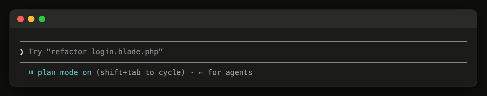
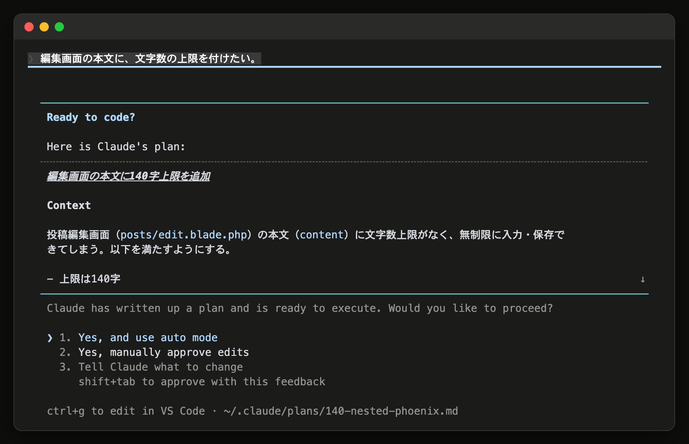
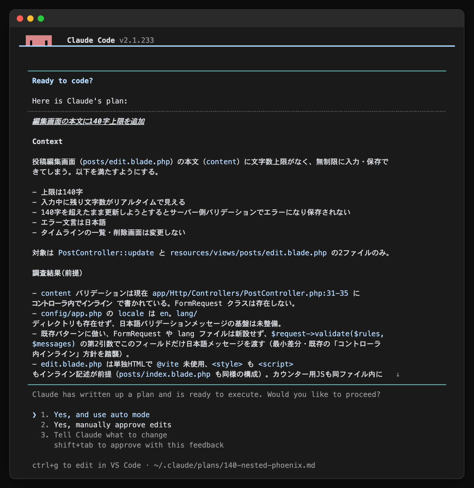
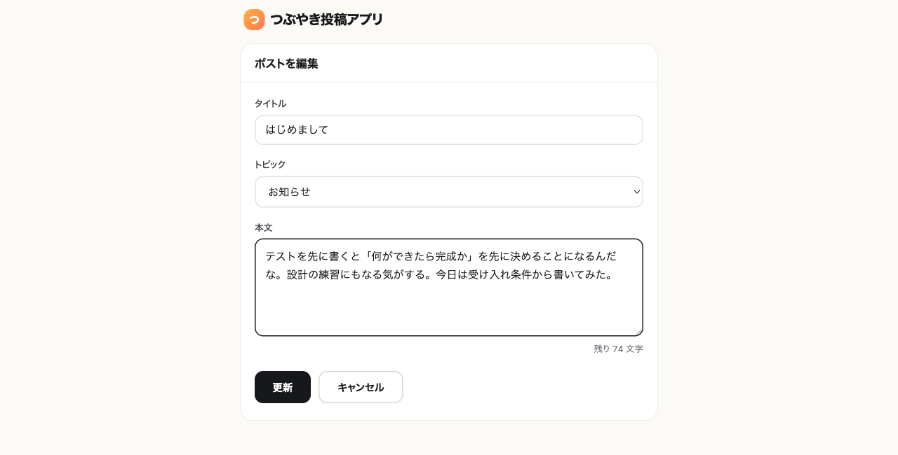
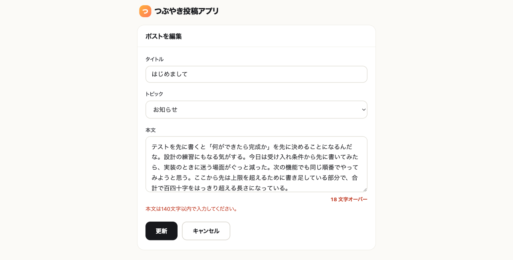

# 14-3-2: planモードで作る

## 🎯 このセクションで学ぶこと

- planモードに入って、ソースコードを書き換えさせずに計画だけを出させられるようになる。
- 返ってきた計画を、触るファイル・依頼に無いもの・順番の3つで読んで、直させられるようになる。
- 承認して走らせ、できたものを画面で確かめて、ブランチをmainへ取り込めるようになる。

---

## 導入

14-3-1で並べた4つのうち、4番の「編集画面の本文に、文字数の上限と残り文字数の表示を足す」を、ここで実際に作ります。持ち方はplanモードです。開発フロー（Issue化 → 計画 → 実装とテスト → レビュー → UAT → PR）の現在地は計画で、この節ではそこから実装までを1本通します。

「文字数の上限を付けて」とそのまま頼んでも、たいていは付きます。困るのはそのあとです。画面と入力チェックが書き換わった状態で渡されるので、思っていたものと外れていたときに、どこが外れているのかを探すところから始まります。planモードは、その手前に読む場所を1つ作ります。

---

## planモードに入る

`Shift+Tab` を押すと、権限モードが順に切り替わります（14-1-5）。入力欄の下の表示が `⏸ plan mode on` になるまで押してください（2026年8月時点）。表示が違うときは、`/help` と公式ドキュメントで確かめてください。

**planモードに合わせたときの入力欄の下の表示**



依頼の頭に `/plan` と書いて送っても、planモードに入れます。承認せずに抜けたくなったら、もう一度 `Shift+Tab` を押します。

planモードのあいだ、AIは読んで計画を書くだけで、承認するまで編集は止まったままです（14-3-1）。

---

## 計画のどこを読むか

**1. 触るファイルの一覧が、思っていたものと合っているか**

一覧が出てこないときは、「触ることになるファイルの一覧も書いてください」と足して頼み直してください。一覧が無いと、読むものがありません。

**2. 依頼に書いていないものが入っていないか**

頼んでいないテーブル、頼んでいないパッケージ、頼んでいない画面。どれも「あったほうが良さそう」という理由で足されることがあります。良さそうかどうかを決めるのは、依頼を書いたあなたです。

**3. 順番が通っているか**

テーブルを作る前に、そのテーブルを使う処理を書く計画になっていないか。順番が逆でも実装は進みますが、途中でエラーが出て、そこから直す作業が増えます。

引っかかったところは、依頼のどこと食い違っているのかを名指しして伝えます。伝えるのは、計画が出たあとに開く選択肢の中です。計画は何度でも出し直させられますし、そのあいだ1行も書き換わらないので、気になるところが無くなるまで直させて構いません。

---

## 計画を出したあとの3つの道

計画ができると、AIはそれを画面に出して、どう進めるかを聞いてきます。選択肢は3つです（2026年8月時点）。

```text
Claude has written up a plan and is ready to execute. Would you like to proceed?

❯ 1. Yes, and use auto mode
  2. Yes, manually approve edits
  3. Tell Claude what to change
     shift+tab to approve with this feedback
                    ctrl+g to edit in VS Code · ~/.claude/plans/xxxx.md
```

| 選ぶもの | そのあと何が起きるか |
|:--|:--|
| 1. 承認して、そのまま進めさせる | autoモードに切り替わって実装が始まり、確認を求められずに進みます（検査役が止めるものとdeny設定は別。14-1-5） |
| 2. 承認して、1つずつ確かめながら進めさせる | 実装は始まりますが、ファイルを書き換えるたびに承認を求められます |
| 3. 直してほしいことを伝える | 実装は始まりません。planモードのまま、伝えた内容で計画を書き直させます |

**承認を求められている画面**



**この教材で選ぶのは1つ目**です。14-1-5でautoモードを標準にしているので、承認したあとは止まらずに走ります。

3つ目を選ぶと、そのまま文章を打てるようになります。ここに書くのが、上の「引っかかったところの名指し」です。

```text
計画にポストを新しく作る画面が入っていますが、今回頼んだのは編集画面の文字数制限だけです。
その画面は外して、計画を立て直してください。
```

打ってから `Enter` を押すと、計画が立て直されて、この3択がもう一度出ます。`Shift+Tab` を押すと、打った内容を反映させたうえでそのまま承認まで進みます。

計画の文章を自分の手で直したいときは `Ctrl+G` です。提案されている計画が既定のテキストエディタで開いて、そのまま書き換えられます。画面の右下に出ているのが、そのファイルの場所です。Claude Codeの設定フォルダの中にあり、プロジェクトには入りません。

計画を承認することは、実装の開始を許可することです。承認した瞬間に、AIはファイルを書き換え始めます。承認すると、そのセッションには計画の中身から取った名前が自動で付きます（自分で名前を付けていない場合。2026年8月時点）。

---

## 記録の単位

コードを触る前に、どこで区切って記録するかを決めておきます。

| 単位 | 何に対応するか |
|:--|:--|
| ブランチ1本 | 作業1つ |
| コミット | 動くところまで進んだひと区切り。AIが区切ります |

作業1つにブランチ1本という区切り方は、12-1-1で読んだGitHub Flowと同じです。違うのは、ブランチを切るのもコミットするのも、依頼の中に入れてAIにやらせる点です。

この変更ではイシューを立てません。起票をAIに任せる話は14-3-3で扱うので、ここはブランチから始めます。プルリクエストも使わず、動くところまで確かめたらmainへ取り込んで閉じます（プルリクエストは14-4-5で扱います）。

---

## 🏃 編集画面に、文字数の上限を足す

いまの編集画面の本文には、長さの制限がありません。何千字を書き込んでも、そのまま保存されます。ここに140字の上限と、入力中に残りの字数が見える表示を足します。

本文を保存している `content` は、長い文章をそのまま入れられる型（`text`）です。上限は画面と入力チェックの側で足すので、テーブルは変わりません。マイグレーションも要らない変更です。

思いどおりに直らない・壊れたと感じたら14-5-1（直らないときの型）へ。応急は `git restore .`（4-3-5）

画面で確かめるので、アプリを動かしておきます。止まっている場合は、Docker Desktop（またはDocker Engine）を起動してから、このあと起動するClaude Codeとは別のターミナルで次を実行してください。

```bash
# 投稿アプリのフォルダで実行する
./vendor/bin/sail up -d
```

ターミナルで投稿アプリのフォルダ（14-1-3でCLAUDE.mdを作ったフォルダ）へ移動して、Claude Codeを起動します。

```bash
# 投稿アプリのフォルダで実行する
claude
```

### Step 1: planモードに合わせる

`Shift+Tab` を押して、入力欄の下の表示が `⏸ plan mode on` になるまで合わせます。

### Step 2: 依頼を送る

そのまま貼り付けて送ってください。

```text
編集画面の本文に、文字数の上限を付けたい。

- 上限は140字
- 入力しているあいだ、残りが何字かが編集画面で見える
- 上限を超えた本文で更新しようとしたら、エラーが出て保存されない
- エラーの文言は日本語で出す
- タイムラインの一覧と削除は変えない
- 作業用のブランチを切ってから進めて
- 区切りごとにコミットして
```

> 💡 **出力例について**: AIの応答は毎回変わります。以下はあくまで一例です。文言が違っても、チェックリストの項目を満たしていれば問題ありません。

```text
あなた: （上の依頼を送る）
Claude Code: （編集画面のビューと、更新のときの入力チェックを読んだうえで、
              触るファイルの一覧と、上限をどこで弾くか、残りの字数をどう出すかを
              書いた計画を出す。そのあとに、どう進めるかを尋ねてくる）
```

**返ってきた計画**



### Step 3: 計画を読む

3択が出ている状態のまま、上の3つの観点で計画を読みます。この題材では、次のようなものが紛れ込みます。

- ポストを新しく作る画面が計画に入っている。作成機能は頼んでいません（この機能は14-5-3で自分で作ります）
- 残りの字数を出すために、npmでパッケージを入れる手順や、JavaScriptをまとめてビルドする仕組みを足す計画になっている。このアプリの画面は、ビューの中に直接書いたCSSだけで組んであり、ビルドしたCSSやJavaScriptを読み込む記述（`@vite`）が、どのビューにもありません

### Step 4: 3択から選ぶ

読んだ結果で、選ぶものが変わります。

**引っかかるところがあった場合は、3つ目**（`3. Tell Claude what to change`）を選びます。そのまま文章を打てるようになるので、食い違いを名指しで伝えます。2つ目の例に当たったなら、こう伝えます。

```text
計画に npm のパッケージを足す手順が入っていますが、この画面はビューの中に直接書いたCSSだけで組んであって、
ビルドしたCSSやJavaScriptは読み込んでいません。そこは足さずに、いまの作りのままでできる形に立て直してください。
```

`Enter` を押すと計画が立て直されて、3択がもう一度出ます。**Step 3に戻って読み直してください。** 気になるところが無くなるまで、何度繰り返しても構いません。ここまでのあいだ、ファイルは1行も書き換わっていません。

**引っかかるところが無ければ、1つ目**（`1. Yes, and use auto mode`）を選びます。AIがブランチを切り、画面と入力チェックを書き換え、コミットを積みます。

> ⚠️ **注意**: 入力欄そのもので141字目を打てなくする形になっていると、上限を超えた本文で更新する確認ができません（打てないので、エラーも出ません）。そうなっていたら、「上限を超えた本文で更新しようとしたときも、エラーを出して保存しない形にして」と伝えて直させてください。

### Step 5: 画面で確かめる

ブラウザで `http://localhost` を開き、`usera@example.com` / `password` でログインして、タイムライン（`http://localhost/posts`）から自分のポストの編集画面を開きます。

**入力しているあいだ、残りの字数が見えます**



本文を140字より長くしてから「更新」を押します。

**上限を超えたまま更新しようとしたときの画面**



エラーが日本語で出て、保存されなければ、依頼に書いた条件が満たされています。英語のメッセージが出たときは、「入力チェックのエラーは日本語で出して」と伝えて直させてください。

### Step 6: mainへ取り込む

確かめ終わったら、作業ブランチをmainへ取り込んで、この変更を閉じます。

```text
いまの作業ブランチを main にマージして、GitHub にも送って。
終わったら作業ブランチは消して。
```

最後に、次を確かめてください。確かめ終えたら `/exit` で閉じます。

- [ ] 編集画面で本文を打つと、残りの字数が画面に出る
- [ ] 140字を超えた本文で「更新」を押すと、日本語のエラーが出て保存されない
- [ ] 140字までの本文なら、これまでどおり保存できる
- [ ] タイムラインの一覧と削除が、これまでと同じように動く
- [ ] この変更がmainに入っていて、作業ブランチは残っていない

---

## ✨ まとめ

- `Shift+Tab` で `⏸ plan mode on` に合わせてから依頼を送ると、ソースコードが書き換わらないまま、計画の文章だけが返ってくる。
- 計画で読むのは、触るファイルの一覧・依頼に書いていないものが入っていないか・順番が通っているか。
- 計画が出ると3択になる。承認してそのまま進めさせる・承認して1つずつ確かめる・直してほしいことを伝える。
- 引っかかったら3つ目を選び、依頼のどこと食い違っているかを名指しして立て直させる。何度出し直させても、コードは1行も変わらない。文章を自分で直すときは `Ctrl+G`。
- 承認は、実装を始めてよいという合図。この教材では1つ目を選んで、そのまま最後まで走らせる。
- planモードの計画は、承認した時点で役目が終わる。プロジェクトのファイルにはならない。できあがったものは、依頼に書いた条件を画面で1つずつ試して確かめる。
- 作業1つにつきブランチ1本。切るのもコミットするのも、依頼に入れて任せる。

---
