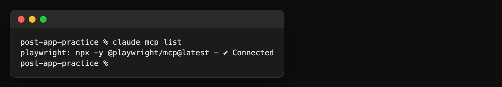
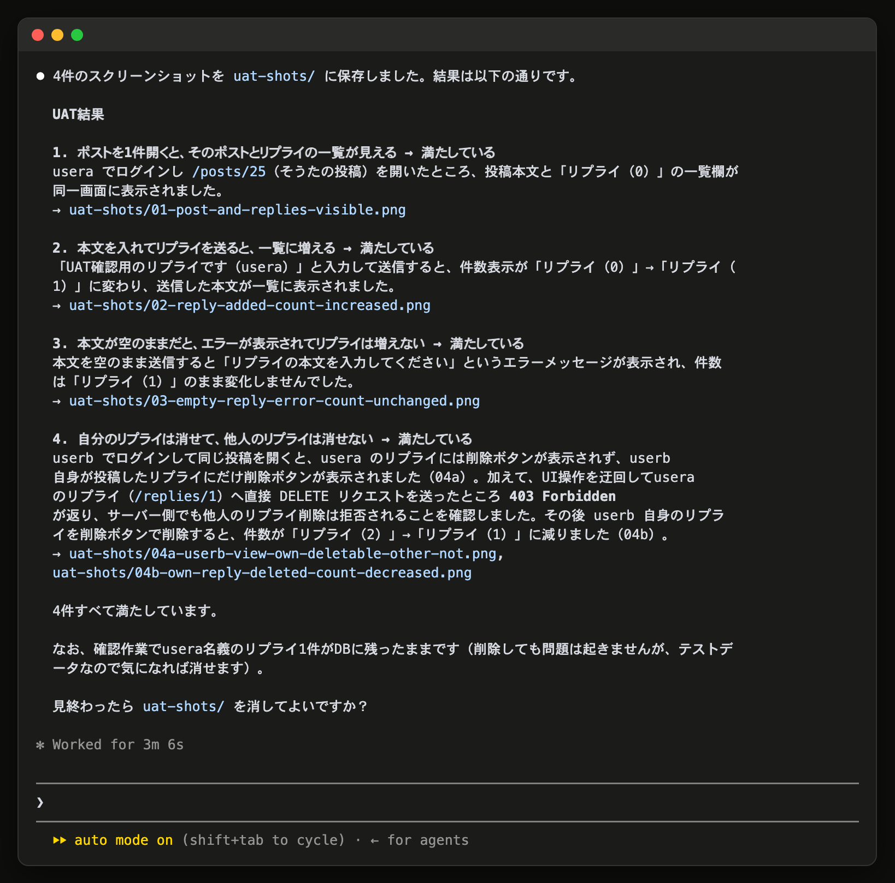

# 14-4-4: UATをAIにも回させる

## 🎯 このセクションで学ぶこと

- MCPが何と何をつなぐ口なのかを理解する。
- Playwright MCPを入れて、Claude Codeからブラウザを操作させられるようになる。
- 受け入れ条件をAIに渡して回させ、返ってきた証拠で判定できるようになる。

---

## 導入

14-4-3では、受け入れ条件の4行を自分の手で1行ずつ潰しました。Claude Codeは文字のやり取りをする道具なので、そのままではブラウザを触れません。触れるようにするための口が、MCPです。前の節と同じ「UAT」を、今度はAIに回させます。

---

## MCPという接続口

MCP（Model Context Protocol）は、AIの道具と、外にある別のプログラムをつなぐための共通の決まりごとです。この決まりに沿って作られたプログラムをMCPサーバと呼び、Claude Codeに足すと、そのプログラムができることをそのまま頼めるようになります。

ここで足すのは Playwright MCP です。Playwrightはブラウザを自動で動かす道具で、それをMCPサーバの形にしたものが公式から配られています。足すと、AIは画面を開き、文字を入れ、ボタンを押し、スクリーンショットを撮れるようになります。自分で作る話はTutorial 15で扱うので、ここでは配られているものを1つ入れて使います。

---

## Playwright MCP を入れる

`npx` を使うので、14-1-2で入れたNode.jsが要ります。ターミナルで次を打ちます（2026年8月時点）。

```bash
# どのフォルダで実行しても構わない
claude mcp add -s user playwright -- npx -y @playwright/mcp@latest
```

`claude mcp add` の後ろは、入れる場所の指定（`-s user`）、付ける名前、`--`、起動するコマンドの順です。`--` から後ろが、Claude Codeが立ち上げるプログラムになります。`-s user` は、自分のマシン全体で使える場所に入れる指定です。付けずに打つと、コマンドを打ったフォルダの中でしか使えない設定になり、別のプロジェクトから起動したときには出てきません。ブラウザを動かす道具はこの先どのプロジェクトでも使うので、全体に入れます。Windows（WSL/Ubuntu）でも同じコマンドで入る想定です（2026年8月時点）。うまく動かないときは、下の「うまく動かないとき」を見てください。

入ったかどうかは一覧で見られます。

```bash
claude mcp list
```

`playwright: npx -y @playwright/mcp@latest - ✔ Connected` のように、名前と起動コマンドの右に `✔ Connected` と出れば使えます。この設定は手元のClaude Codeに入るだけで、リポジトリにファイルは増えません。1回入れれば、次のセッションからも、別のフォルダのプロジェクトからでも使えます。セッションの中からは `/mcp` でも一覧を開けます。

**`claude mcp list` で接続を確かめたところ**



> 💡 **TIP**: コマンドと表示は2026年8月時点のものです。違っていたら、`/help` と公式ドキュメントで確かめてください。

---

## 🏃 受け入れ条件をAIに渡して、回させる

### Step 1: アプリを起動して、Claude Codeを開く

ブラウザから見える状態になっていないと、AIも開けません。投稿アプリのフォルダでSailを立ち上げてから、Claude Codeを起動します。

```bash
# 投稿アプリのフォルダで実行する
./vendor/bin/sail up -d
claude
```

### Step 2: 受け入れ条件とログイン情報を渡す

14-4-3で使ったものと同じ4行を、そのまま渡します。1行目でPlaywright MCPを名指ししているのは、ブラウザを動かせる道具がほかにも入っていることがあるからです。名指ししておけば、いま入れたものが使われます。

```text
Playwright MCP を使って http://localhost を開いて、次の4つを順に確かめて。
ログインは usera@example.com / password と userb@example.com / password を使って。

- ポストを1件開くと、そのポストとリプライの一覧が見える
- 本文を入れてリプライを送ると、一覧に増える
- 本文が空のままだと、エラーが表示されてリプライは増えない
- 自分のリプライは消せて、他人のリプライは消せない

1行ずつ、満たしているかどうかと、そう判断した理由を、証拠のスクリーンショットとあわせて報告して。
スクリーンショットは、このフォルダの uat-shots/ に、どの行のものか分かる名前で置いて。
```

置き場所を指定しているのは、**指定しないと、どこに保存されたのかが分からなくなる**からです。ここでは画像が判定の材料になるので、自分で開ける場所に集めさせます。

> ここで渡す `usera@example.com` と `password` は、教材用に公開している値なのでAIに渡して構いません。実務で使う本物の認証情報は渡しません。

> 💡 **進行例について**: AIとの開発は毎回違う流れになります。ここに示すのは一つの進行例です。あなたの画面と違っていても、チェックリストを満たしていれば正解です。

```text
Claude Code: usera でログインし、タイムラインの1件目を開きました。
             ポストの本文とリプライの一覧が出ています（1つ目: 満たす）。
             本文を入れて送ると、一覧が1件増えました（2つ目: 満たす）。
             空のまま送ると「本文を入力してください」が出て、件数は変わりません
             （3つ目: 満たす）。userb でログインし直すと、usera のリプライには
             削除の操作が出ませんでした（4つ目: 満たす）。
```

**AIがブラウザを操作して、結果を報告しているところ**



### Step 3: 報告とスクリーンショットを読んで判定する

報告の行が、受け入れ条件の4行にそれぞれ対応しているかを見ます。「確認しました」とだけ書かれていて、何を見てそう言っているのかが無い行があれば、その行だけもう一度回させてください。

スクリーンショットは、VS Codeの左のエクスプローラーで `uat-shots` を開くと、ファイル名をクリックしてその場で見られます。見るのは、その行を満たしている画面になっているかです。

`uat-shots` が見あたらないときは、保存先が別の場所になっています。そのまま「スクリーンショットをどこに保存した？ このフォルダの uat-shots/ に移して」と頼めば済みます。

### Step 4: 見終わったら片づける

`uat-shots` は判定のために置いただけのものです。残しておくと、14-4-5で作るプルリクエストに関係のないファイルが混ざります。

```text
uat-shots/ を消して。
```

消えたことを確かめます。

```bash
# 投稿アプリのフォルダで実行する
git status
```

`nothing to commit, working tree clean` と出れば、片づいています。まだ画像のファイルが出ていたら、それも消してから先へ進んでください。

思いどおりに直らない・壊れたと感じたら、14-5-1（直らないときの型）へ進んでください。まだコミットしていない変更は `git restore .`（4-3-5）で元に戻せます。

このセクションが終わった時点で、次の4つを確かめてください。

- [ ] `claude mcp list` で、`playwright` が `✔ Connected` になっていることを見た
- [ ] 受け入れ条件の4行を渡して、ブラウザを操作した結果の報告を受け取った
- [ ] 報告の行が、受け入れ条件の4行にそれぞれ対応していることを見た
- [ ] スクリーンショットをVS Codeで開いて、その行を満たしている画面になっていることを見た
- [ ] `uat-shots` を消して、`git status` にファイルが出てこないことを見た

---

## うまく動かないとき

> 受け入れ条件の確認そのものは、14-4-3で終わっています。ここでうまく動かないときは、14-1-2でやったように、出ているものをそのままClaude Codeへ渡して直させてください。`!claude mcp list` のように `!` を付けて打てば、出力ごと渡ります。それでも解決しなければ、先へ進んで構いません。

- `npx` が見つからないと出るときは、Node.jsが入っていません（14-1-2）。
- 初めて動かすときだけ、ブラウザ本体の取得が走って時間がかかることがあります。しばらく待ってください。
- `claude mcp list` に出ない、または `✔ Connected` にならないときは、`claude mcp add` をもう一度打ってから、Claude Codeを起動し直してください。

---

## 人が回すときと、AIに回させるとき

初めて作った機能は、人が回します。決めたとおりでない道は、画面を触っているうちに気づくもので、渡した4行の中には書かれていないからです（14-4-3）。

2周目からはAIに回させます。同じ手順を毎回最初から踏み直すのは、AIのほうが速く、途中で飽きて飛ばすこともありません。リプライ機能に手を入れて確かめ直すときも、この節と同じ4行を渡すだけで済みます。

---

## ✨ まとめ

- MCPは、Claude Codeと外のプログラムをつなぐ決まりごとです。Playwright MCPを足すと、ブラウザの操作を頼めるようになります。
- 導入は `claude mcp add -s user playwright -- npx -y @playwright/mcp@latest` の1本で、確認は `claude mcp list` の `✔ Connected` です。手元の設定に入るだけで、リポジトリは変わりません。
- 渡すのは、14-4-3と同じ受け入れ条件の4行とログイン情報です。教材用に公開している値だけを渡します。
- 判定に使うのは、行ごとの理由とスクリーンショットです。理由の無い報告は、その行だけ回し直させます。
- スクリーンショットの置き場所は、依頼で指定します。指定しないと、どこに保存されたのか分からなくなります。
- 見終わったら置き場所ごと消して、`git status` にファイルが出てこないことを確かめます。
- 初めての機能は人が回し、2周目からはAIに回させます。

---
