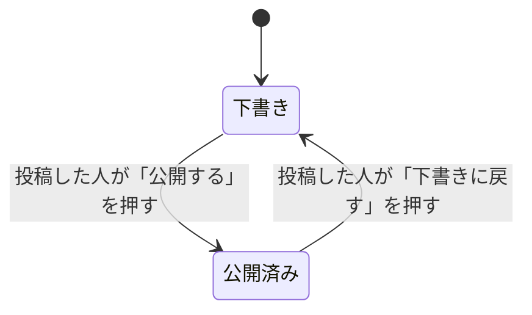

# 14-5-1: もう1周する - 総合演習

## 📌 この演習について

Chapter 1からChapter 4まで、投稿へのコメント機能を1周させました。設計書を書き、実装タスクに割り、計画を承認し、差分を承認し、テストを回し、コードを読み、受け入れ条件と突き合わせて、マージするところまでです。

ここでは、同じ流れを別の機能でもう一度回します。今度は最初から最後まで自分で進めます。新しく覚えることはありません。使うのは、Chapter 2からChapter 4までで一度ずつやったことだけです。

1つだけ、これまでと違うところがあります。今回の機能は**状態を持ちます**。14-2-4では、コメントに状態がないので状態遷移図は作らない、と決めました。今回は要ります。設計書は機能に合わせて取捨する、と書いたことの、反対側です。13-6-2「状態遷移設計 - ステータスの一生を描く」で描いた図と遷移表が、ここで出番になります。

> 🔥 ここからは、AIに実装を任せて構いません。ただし「任せる」と「丸投げ」は違います。何を作るかは設計書で自分が決め、出てきたものはテスト・動作確認・コードレビューで自分が検証します。品質の責任は、AIではなくあなたが握ります。

---

## 🎯 演習課題

### 📋 課題

今回の要件は、次のとおりです。

> いまは、あらかじめ用意された投稿しかありません。ログインした人が自分で投稿を書けるようにします。書きかけのものは下書きとして保存でき、公開すると他の人にも見えるようになります。下書きは書いた本人にしか見えません。

あなたが発注者です。決めきれないところは自分で決めます。ただし今回は、判断が同時に増えすぎないよう、いくつかは先に決めてあります。

| 決めてあること | 中身 |
|:--|:--|
| 状態は2つ | `draft`（下書き）と `published`（公開済み）の2つだけにします |
| 作った直後は下書き | 新しく書いた投稿は、まず下書きとして保存されます。公開するかどうかは、そのあとで切り替えます |
| 列の既定値は `published` | `posts` に `status` の列を足すとき、既定値を `published` にします。理由は下の注意を読んでください |
| 一覧に出す範囲 | 投稿一覧には、公開済みの投稿と、自分が書いた下書きだけを出します |
| 状態を変えられる人 | 自分が書いた投稿だけです。他人の投稿の状態は変えられません |
| 入口 | 投稿一覧に「新規投稿」のボタンを1つ足します |
| 投稿作成画面のURL | `/posts/create` にします |
| 状態を切り替えるボタンの置き場所 | コメント機能で作った投稿詳細画面に置きます |

> ⚠️ **注意**: 既定値を `published` にするのは、いまデータベースに入っている4件の投稿のためです。列を足すと、既にある4件にも値が入ります。ここが `draft` だと、ユーザーAの投稿がユーザーBの一覧から消えて、10-3-5「認可機能 - ハンズオン演習」で確かめた動きが変わってしまいます。新しく作る投稿を下書きにするのは、登録の処理のほうで `draft` を入れて実現します。

今回作らないものも決めておきます。

| 作らないもの | 理由 |
|:--|:--|
| 投稿の削除の作り直し | 10-3-5で作った削除は、そのまま残します |
| 下書きであることの目印 | 一覧に出す範囲さえ合っていれば、この演習の確認はできます。付けたい方は付けて構いません |
| 公開日時の記録 | いつ公開したかを使う機能が、今回はありません |

作るものは、次の4つです。

1. 機能イシュー1件
2. `docs/post-create/` の設計書8ファイル（コメント機能のときと同じ構成です）
3. 実装とテスト
4. マージ済みのプルリクエスト

設計書のIDは機能フォルダごとに `F-01` から振り直すので、これから書く `docs/post-create/` の `F-03` は、コメント機能の `F-03`（コメントの削除）とは別物です。

作業する場所も同じで、`~/laravel-practice/14_hands-on/authorization-app-ai` です。いまは `main` にいて、コメント機能がマージされた状態になっています。

### ✏️ 進め方タスク

1. 【自分】機能イシューを立てる（概要だけ書く）
2. 【自分⇄AI】`docs/post-create/` に設計書を1ファイルずつ書かせて、自分で直す
3. 【自分】機能イシューに、受け入れ条件と設計書の場所を書き足す
4. 【自分⇄AI】設計書を実装タスクに割って、イシューの `## タスク` に並べる
5. 【自分⇄AI】ブランチを切り、タスクごとに計画を立てさせて、読んでから承認する
6. 【AI】タスクを実装させる（テストの作成も一緒に指示する）
7. 【自分】差分を読んで承認し、コミットする
8. 【自分】テストを回して、`failed` が0であることを見る
9. 【自分】`docs/review-checklist.md` を当ててコードを読み、ブラウザで受け入れ条件と突き合わせる
10. 【自分】ブランチをpushして、プルリクエストを開き、マージする

### ✅ 完成チェックリスト

- [ ] `./vendor/bin/sail artisan test` を自分で実行して、`failed` が0であることを自分の目で見た
- [ ] `docs/post-create/test.md` の観点のうち、テストにすると決めた行が `tests/Feature/` に書かれている
- [ ] 機能イシューの `## 受け入れ条件` が、ブラウザで1行ずつ確かめられて `- [x]` になっている
- [ ] ユーザーAとユーザーBの両方でログインして、他人の下書きが一覧に出ないことを確かめた
- [ ] 投稿を登録するときに投稿者のIDを一緒に送っても、他人の名前で投稿されないことを、テストで確かめた
- [ ] `docs/review-checklist.md` の観点を当てて、変更したコードを自分の目で読んだ
- [ ] シードデータの4件が公開のまま残っていて、投稿の編集と削除が10-3-5のとおりに動くことを確かめた
- [ ] `docs/post-create/README.md` に、作らなかった設計書とその理由が書かれている
- [ ] プルリクエストがマージされ、機能イシューが `Closed` になっている

> 🚀 **ここから先は、自分の力で進めてみましょう！**

---

## 💡 ヒント

**進め方の骨**

順番に迷ったら、これを見てください。カッコの中は、そのやり方を扱ったセクションです。

1. 機能イシューを立てる（14-2-4）
2. `docs/post-create/` に設計書を8ファイル書く（14-2-4）。状態遷移図と遷移表は `behavior.md` に、シーケンス図と並べて置きます
3. 実装タスクに割って、イシューに並べる（14-3-2）
4. タスクごとに計画を立てさせ、実装させ、差分を承認する（14-3-3・14-3-4）
5. テスト、レビュー、受け入れ確認の3つを通す（14-4-1・14-4-2・14-4-3）
6. ブランチをpushしてプルリクエストを開き、マージする（14-3-5・14-4-3）

**新規投稿の画面が404になったら、ルートの並び順を見る**

今回いちばん引っかかりやすいところです。コメント機能のときに、`GET /posts/{post}`（投稿詳細画面）を足しました。ここに `GET /posts/create` を後ろから足すと、`/posts/create` を開いたときに、`create` という文字が `{post}` の中身として拾われます。結果、番号が `create` の投稿を探しにいって404になります。

`/posts/create` の行は、`/posts/{post}` の行**より前**に置いてください。

見る場所も間違えないでください。9-1-4「ルーティングの基礎」で使った `route:list`（この演習では `./vendor/bin/sail artisan route:list`）は、ルートをURIの順に並べ替えて表示します。ファイルに書いた順とは別物なので、この一覧を見ても並び順の誤りには気づけません。確かめるのは `routes/web.php` の本文です。この404はログにも残らないので、14-4-4で使った `grep` でも出てきません。

**実装を頼むときに、一緒に書いておくとよいこと**

- エラーメッセージは、設計書のメッセージ一覧に書いた文言どおり、日本語で出してください（14-4-3で突き合わせた相手と同じです）
- `posts` に足した `status` は、`app/Models/Post.php` の `$fillable` にも足してください
- テストで使う投稿とユーザーは、テストの中で用意してください。コメント機能のときに作ったファクトリがあれば、それを使ってください。足りない分は一緒に作ってください
- いまある投稿の編集・更新・削除の動きは変えないでください

**詰まったときは**

14-4-5で持った3つの型に戻ってください。まず巻き戻す、頼む単位を分け直す、2回直らなければ区切って分かったことを書き足す、の順です。設計書に書いていないことをAIが聞いてきたら、それは設計の穴です。その場で決めて、設計書を直してから続けます。

---

## 🏃 実践：一緒に進めてみましょう

### 🧠 先輩エンジニアの思考プロセス

自分で進めてみて詰まったら、ここから先を読んでください。何を渡し、どこで承認し、何で確かめるのかを、場面ごとに並べます。

| 場面 | 何を渡すか | どこで承認するか | 何で確かめるか |
|:--|:--|:--|:--|
| 設計書を書かせる | 要件の文、`@app/Models/Post.php`、`@routes/web.php` | 1ファイルできるたびに | 列名と記号がTutorial 13で自分が書いた形と同じか |
| 状態遷移図を書かせる | 状態の名前と、決めた移り変わり | 図がプレビューに出てから | 矢印の本数と、遷移表の行数が合っているか |
| 実装させる | そのタスクに要る設計書だけ | 計画を読んでから | 触るファイルの一覧に `routes/web.php` が入っているか |
| 差分を読む | 追加で聞かれたことだけ | 差分を読んでから | 投稿の編集・削除に関わる行が消えていないか |
| 受け入れ確認 | なし | 自分 | 2つのアカウントで、一覧に出る投稿が変わるか |

### 📝 ステップバイステップ

#### Step 1: 機能イシューを立てる

GitHubで自分の `authorization-app-practice` のページを開き、「Issues」タブから新しいイシューを立てます。タイトルは動詞で終える形（例: `投稿を作れるようにする`）、ラベルは `enhancement` です。

本文は、14-2-4で使ったのと同じ枠にします。いま埋めるのは `## 概要` だけです。

```markdown
## 概要
（何ができるようになるかを2〜3行で）

## 受け入れ条件
- [ ] 〜すると、〜になる

## 設計書
docs/post-create/

## タスク
- [ ] （設計書を書いてから並べます）
```

立てたら、イシューの番号を控えておいてください。GitHubは、イシューとプルリクエストで同じ番号の列を使います。コメント機能のイシューが1番で、14-3-5で開いたプルリクエストが2番だった方は、今回のイシューは3番になります。

このあとの手順には `#3` やブランチ名の `issue-3` が出てきますが、**自分の画面に表示されている番号に読み替えて**進めてください。

#### Step 2: 設計書を8ファイル書かせる

アプリのフォルダに、今回のフォルダを作ります。

```bash
# アプリのフォルダの中で実行する
cd ~/laravel-practice/14_hands-on/authorization-app-ai
git switch main
git pull origin main
mkdir docs/post-create
```

`git pull` を打つのは、コメント機能をマージしたあとの `main` を、手元にそろえておくためです。14-4-3の最後に済ませていれば、何も起きません。

ファイルの構成は、コメント機能のときと同じ8つです。中身の対応だけが、今回の機能に合わせて変わります。

| ファイル | 今回の中身 |
|:--|:--|
| `feature-list.md` | 機能一覧（`F-01` から）＋今回作らないものの表 |
| `usecase.md` | 「投稿を書く」のユースケース記述1本（`UC-01`）と受け入れ条件 |
| `screen.md` | 画面一覧・画面遷移図・画面項目定義・入力チェック表・メッセージ一覧 |
| `api.md` | API設計書（`API-01` から）＋エラーレスポンス一覧＋権限マトリクス |
| `data.md` | `posts` に足す列の定義＋CRUD表。今回は新しいテーブルを作らず、テーブル同士のつながりも変わらないので、ER図は描きません |
| `behavior.md` | シーケンス図＋**状態遷移図と遷移表**＋例外一覧 |
| `test.md` | テスト観点表（`TC-01` から）＋テストケース2本。投稿者のIDを送りつけたときに、**他人の名前で保存されないこと**を、観点表に1行入れてください |
| `README.md` | 何の設計書一式か・ファイル一覧・作らなかった設計書とその理由 |

頼み方は14-2-4と同じです。1つ頼み、読んで、直してから、次を頼みます。列名・記号・ロール名は、こちらから指定しなければ言い換えられます。

今回だけ増えるのが、状態遷移図と遷移表です。頼むときは、状態の名前と、どこからどこへ移れるかを自分で決めてから渡してください。決めずに渡すと、AIが状態を増やします。

```text
docs/post-create/behavior.md に、投稿の状態遷移図を書き足してください。
Mermaid の stateDiagram-v2 で書きます。

- 状態は「下書き」と「公開済み」の2つだけです
- 投稿を作ると、まず「下書き」から始まります
- 「下書き」から「公開済み」へは、投稿した人が「公開する」を押したときに移ります
- 「公開済み」から「下書き」へは、投稿した人が「下書きに戻す」を押したときに移ります
- 上に書いた以外の移り変わりは、作らないでください
- 図のすぐ下に、遷移表も書いてください。
  列は 今の状態・起きること・次の状態・条件 の4つです
```

> 💡 この依頼のポイントは3つです。①状態の名前と本数をこちらが決めている ②移り変わりを1本ずつ名指ししている ③「上に書いた以外は作らないでください」で線を引いている。③が無いと、削除済みや公開待ちといった状態が親切に足されます。文言をそのまま覚える必要はありません。

書けたら、VS Codeのプレビューで図を出し、13-6-2で確かめたとおりに**矢印の本数と表の行数**を数え合わせてください。

#### Step 3: 受け入れ条件を書き足す

`usecase.md` に書いた受け入れ条件を、機能イシューの `## 受け入れ条件` へそのままコピーします。`## 設計書` には `docs/post-create/` と書きます。手順は14-2-4のStep 6と同じです。

`usecase.md` に書いた受け入れ条件が、そのままStep 7の判定基準になります。言い回しを変えないでください。

書けたら、設計書をコミットして `main` へ送ります。

```bash
# アプリのフォルダの中で実行する
git add docs
git commit -m "Add #3: add design docs for post creation"
git push origin main
```

`#3` は自分のイシューの番号に置き換えます。

#### Step 4: 実装タスクに割る

設計書を3枚ほど渡して、タスクの案を出させます。返ってきた案は、14-3-2の3つの基準（差分を読み切れるか、終わったことを自分で確かめられるか、設計書の行に対応しているか）で決め直してください。

決まったら、タスク名の先頭に設計書のIDを入れて、イシューの `## タスク` に並べます。

#### Step 5: ブランチを切って、実装させる

```bash
# アプリのフォルダの中で実行する
git switch -c feature/issue-3-add-post-creation
```

あとはタスクごとに、14-3-3と同じ手順を回します。`/plan` を付けて計画を立てさせ、計画を読んで承認するか指摘するかを決め、実装させ、差分を読んで承認し、コミットして、イシューのタスクを `- [x]` にします。

差分を読むときは、14-3-4の4段（ファイルの一覧、消えた行、設計書との突き合わせ、説明と実物の突き合わせ）の順です。今回は2段目をとくに見てください。`routes/web.php` は、10-3-5のアプリに最初からある4本と、コメント機能で足した3本が既に並んでいるファイルです。

`status` の列は、既にある `posts` テーブルに足すことになります。差分に出てくるのは、9-3-2「マイグレーションファイルの作成」で読んだ `Schema::table()` の形のはずです。既定値が `published` になっているかを、ここで見てください。あわせて `app/Models/Post.php` を開き、`$fillable` に `status` が足されているかも見ます。ここに無いと、登録のときに渡した `draft` は保存されません。

書き換えたら、データベースへの反映が要ります。アプリが止まっている場合は、Docker Desktop（またはDocker Engine）を起動してから `./vendor/bin/sail up -d` を実行しておいてください。

```bash
# アプリのフォルダの中で実行する
./vendor/bin/sail artisan migrate
```

反映したら、ブラウザで `http://localhost/posts` を開いて、シードデータの4件がそのまま出ていることを見てください。消えていたら、既定値が `published` になっていません。マイグレーションのファイルを直しても、いちど流した変更は元に戻らないので（14-4-5）、既定値を直したうえで、テーブルを作り直してシードデータを入れ直します。

```bash
# アプリのフォルダの中で実行する
./vendor/bin/sail artisan migrate:fresh --seed
```

9-3-5「シーダーの基礎」で使ったコマンドです。全部のテーブルを消してから作り直すので、それまでに自分で書いた投稿やコメントも消えます。この時点で消えて困るものはまだ無いはずですが、打つ前に一度考えてください。

#### Step 6: テストを回す

```bash
# アプリのフォルダの中で実行する
./vendor/bin/sail artisan test
```

見るのは `failed` の有無です。`!` と `Constant PDO::MYSQL_ATTR_SSL_CA is deprecated` が混ざっていても、失敗ではありません（14-4-1）。

`failed` が出たら、その1本の行だけをAIに渡して直させ、もう一度自分で回します。テストのほうを消したり緩めたりはしません。

回し終えたら、`test.md` の観点表と `tests/Feature/` を並べて、テストにすると決めた行がそれぞれ書かれているかを確かめてください。

#### Step 7: コードを読んで、受け入れ条件と突き合わせる

まず `docs/review-checklist.md` を開きます。14-4-2で自分が作った観点表です。今回の変更に当たる行だけを選んで、コードを読んでください。今回とくに効くのは、次の3つです。

- 登録の処理が `Post::create($request->all())` の形になっていないか
- 「自分の投稿だけ状態を変えられる」の判定が、1か所に書かれているか
- 一覧の絞り込みが、画面で隠すだけになっていないか

そのあとブラウザで、受け入れ条件を1行ずつ潰します。手順は14-4-3と同じです。2つのアカウントを行き来するところまでやってください。

下の表は、受け入れ条件そのものではなく、確かめるための手立てです。行数が合っていなくて構いません。判定の基準は、自分が `usecase.md` に書いた受け入れ条件のほうです。

| 試すこと | どうなれば合っているか |
|:--|:--|
| ユーザーAで投稿を書いて、一覧を見る | 自分の下書きが一覧に出る |
| ログアウトして、ユーザーBでログインし直す | ユーザーAの下書きが一覧に出ない |
| ユーザーAに戻って「公開する」を押し、ユーザーBで一覧を見る | ユーザーBの一覧にも出る |
| ユーザーBの画面で、ユーザーAの投稿を見る | 「下書きに戻す」が出ない |
| ユーザーAで `http://localhost/posts/3/edit` を開く | 403になる（10-3-5の動きが残っている） |

確かめた行から順に、イシューの受け入れ条件に `- [x]` を付けていきます。途中で直したところがあれば、ここでコミットまで済ませておいてください。

#### Step 8: pushして、プルリクエストを開く

ブランチに積んだコミットは、まだ手元にしかありません。GitHubへ送ります。

```bash
# アプリのフォルダの中で実行する
git push origin feature/issue-3-add-post-creation
```

GitHubでリポジトリを開くと、「Compare & pull request」ボタンが表示されます。クリックして、プルリクエストを作ります（2026年8月時点）。本文の形は14-3-5で書いたものと同じで、最後の行に `Closes #3` を入れます。

```markdown
## 概要
Issue #3 に対応して、投稿を自分で書けるようにしました。下書きと公開の切り替えも入っています。

## 変更内容
- postsテーブルにstatusの列を追加
- 投稿作成画面と、投稿の登録を追加
- 状態を切り替える処理と、一覧の絞り込みを追加
- test.mdの観点のうち、テストにすると決めた行をtests/Feature/に追加

Closes #3
```

`3` は自分のイシューの番号に置き換えます。この1行があると、マージしたときに機能イシューが自動で閉じます。

#### Step 9: マージする

受け入れ条件の全行が `- [x]` になったら、プルリクエストの「Files changed」を開いて、Step 7で直したところが入っていることを確かめます。出ていなければ、pushがまだ済んでいません。確かめてからマージします。手順は12-3-5「ハンズオン - コードレビュー演習」と14-4-3で通したものと同じです。

そのあと、手元も `main` にそろえます。

```bash
# アプリのフォルダの中で実行する
git switch main
git pull origin main
git branch -d feature/issue-3-add-post-creation
```

機能イシューが `Closed` になっていれば、もう1周は終わりです。

---

## 📖 進行例

> 💡 **進行例について**: AIとの開発は毎回違う流れになります。ここに示すのは一つの進行例です。あなたの画面と違っていても、チェックリストを満たしていれば正解です。

**1. 設計書で1回止まる**

`screen.md` を書かせているときに、質問が返ってきました。

```text
Claude Code: （投稿一覧に出す下書きは、自分のものだけでよいか。
              管理する人がすべての下書きを見られる必要はないか、と尋ねてくる）
```

要件の文には「下書きは書いた本人にしか見えません」と書いてあります。答えは設計書の中にありました。読み方の問題だったので、その1文をもう一度渡して続けさせました。

**2. 状態遷移図の矢印が1本多い**

`behavior.md` の状態遷移図に、「公開済み」から出ていく矢印が2本ありました。1本は「下書きに戻す」で、頼んだとおりです。もう1本は「削除する」で、その先に「削除済み」という状態が増えていました。

```text
状態遷移図に「削除済み」の状態が増えています。
今回の状態は「下書き」と「公開済み」の2つだけです。
削除は10-3-5で作ったものをそのまま使うので、状態としては持ちません。
「削除済み」の状態と、そこへ向かう矢印を消して、遷移表も直してください。
```

> 💡 このお願いのポイントは3つです。①増えた状態を名指ししている ②なぜ要らないのかを、削除は既にあるものを使うという決めごとで説明している ③図と遷移表の両方を直させている。②が無いと、別の理由を付けて残されることがあります。

直したあと、矢印3本と遷移表3行が合いました。

**3. 新規投稿の画面が404になる**

タスク1の実装が終わり、投稿一覧の「新規投稿」を押したところ、404の画面が出ました。ヒントに書いたとおり `routes/web.php` を開くと、`GET /posts/create` が `GET /posts/{post}` の後ろに並んでいました。

```text
/posts/create を開くと404になります。
routes/web.php で、GET /posts/create が GET /posts/{post} より後ろに並んでいます。
create が {post} の値として拾われているので、順番を入れ替えてください。
ほかのルートの並びは変えないでください。
```

> 💡 このお願いのポイントは2点です。①どのファイルの何が原因かを自分で見つけてから渡している ②直す範囲を1つに絞っている。原因まで書けたのは、404を見たあとにファイルを開いたからです。エラーの文だけを貼っていたら、このやり取りは何往復かしていました。

**4. テストが1本落ちる**

テストを回したら、投稿者のIDを送りつけたときの1本が落ちました。登録の処理が `$request->all()` を渡す形になっていて、送られてきた `user_id` がそのまま保存されていたためです。

`docs/post-create/behavior.md` の例外一覧に、この行を先に書いてありました。落ちた1本の行と、その例外一覧の行を渡して直させ、もう一度回して `failed` が0になったことを確かめました。

**5. 受け入れ確認で1つ見つかる**

ユーザーBでログインし直したところ、ユーザーAの下書きは一覧に出ませんでした。ここまでは決めたとおりです。ところが、ユーザーBの画面に出ているユーザーAの公開投稿に、「下書きに戻す」のボタンが出ていました。

コードを開くと、判定は書かれていて、押しても403になる状態でした。止まってはいるので、動きとしては壊れていません。ただし、権限マトリクスの `F-03` は「自分が書いた投稿だけ」なので、ボタンが出ていること自体が設計と違います。名指しで直させて、コミットしました。

**6. プルリクエストを出して、マージする**

受け入れ条件の4行に `- [x]` を付けてから、ブランチをpushしてプルリクエストを開きました。「Files changed」を見ると、進行例3で入れ替えたルートの並びも、進行例5で直したボタンの出し分けも、どちらも入っていました。確かめてからマージし、機能イシューが `Closed` になって、もう1周が終わりました。

<details>
<summary>📖 参考実装（自分の差分を読み終えてから開いてください）</summary>

あなたのAIが書いたコードは、これとは違う形になっているはずです。同じでなければいけないものではありません。見比べるのは、書いてある行が同じかどうかではなく、決めたことがどこで守られているかです。

**状態遷移図と遷移表**



| 今の状態 | 起きること | 次の状態 | 条件 |
|:---------|:-----------|:---------|:-----|
| （投稿がまだ無い） | ログイン済みユーザーが投稿を登録する | 下書き | - |
| 下書き | 投稿した人が「公開する」を押す | 公開済み | 自分が書いた投稿だけ |
| 公開済み | 投稿した人が「下書きに戻す」を押す | 下書き | 自分が書いた投稿だけ |

始まりの印から出る矢印は1本です。作った直後は必ず下書きになると決めたからです。終わりの印はありません。どちらの状態からも、もう片方へ戻れるためです。

**ルートの並び**

```php
// routes/web.php（認証が必要なルートのグループの中。抜粋）
Route::get('/posts', [PostController::class, 'index'])->name('posts.index');
Route::get('/posts/create', [PostController::class, 'create'])->name('posts.create');
Route::post('/posts', [PostController::class, 'store'])->name('posts.store');
Route::get('/posts/{post}', [PostController::class, 'show'])->name('posts.show');
Route::patch('/posts/{post}/status', [PostController::class, 'updateStatus'])->name('posts.status');
Route::get('/posts/{post}/edit', [PostController::class, 'edit'])->name('posts.edit');
Route::put('/posts/{post}', [PostController::class, 'update'])->name('posts.update');
Route::delete('/posts/{post}', [PostController::class, 'destroy'])->name('posts.destroy');
```

**投稿を登録するところ**

```php
// app/Http/Controllers/PostController.php
public function store(Request $request)
{
    $validated = $request->validate([
        'title' => 'required|string|max:255',
        'content' => 'required|string',
    ], [
        'title.required' => 'タイトルを入力してください',
        'title.max' => 'タイトルは255文字以内で入力してください',
        'content.required' => '本文を入力してください',
    ]);

    Post::create([
        'user_id' => Auth::id(),
        'title' => $validated['title'],
        'content' => $validated['content'],
        'status' => 'draft',
    ]);

    return redirect()->route('posts.index');
}
```

`status` に `draft` を渡していますが、これだけでは保存されません。モデル側にも足しておきます。

```php
// app/Models/Post.php（抜粋）
protected $fillable = ['user_id', 'title', 'content', 'status'];
```

`$fillable` に無い項目は黙って捨てられ、列の既定値の `published` で保存されます。14-4-4で本文が捨てられたのと同じ形で、エラーも出ません。作った投稿がいきなり公開済みになっていたら、まずここを見てください。

`validate()` の2つ目の引数に、日本語のメッセージを渡しています。これを渡さないと、画面には英語のメッセージが出ます。文言そのものは `screen.md` のメッセージ一覧に書いたものです。

投稿者には、送られてきた値ではなく `Auth::id()` を入れています。`$request->all()` を渡してしまうと、フォームに `user_id` を紛れ込ませた人の投稿が、他人の名前で保存されます。`app/Models/Post.php` の `$fillable` に `user_id` が入っているためです。9-4-8「マスアサインメントと$fillable」で学んだのは、この形のことでした。

**一覧の絞り込み**

```php
// app/Http/Controllers/PostController.php
public function index()
{
    $posts = Post::with('user')
        ->where('status', 'published')
        ->orWhere('user_id', Auth::id())
        ->latest()
        ->get();

    return view('posts.index', compact('posts'));
}
```

足したのは2行です。公開済みの投稿か、自分が書いた投稿のどちらかを出す、という書き方になっています。`with('user')` は10-3-5のときから付いているので、そのまま残します。

**状態を切り替えてよいかの判定**

```php
// app/Policies/PostPolicy.php
public function updateStatus(User $user, Post $post): bool
{
    return $user->id === $post->user_id;
}
```

10-3-5で自分の手で書いた `update` と `delete` の隣に、同じ形で1つ足しました。判定をここに置いたので、コントローラーからは `$this->authorize('updateStatus', $post)` で呼べますし、Bladeでは `@can('updateStatus', $post)` でボタンの出し分けができます。同じ条件を2か所に書かずに済みます。

</details>

---

## 🚀 まとめ

- 要件を決め、設計書を書かせ、タスクに割り、実装させ、3つの手段で検証し、マージするところまでを、もう一度自分で回しました。
- 今回は設計書に状態遷移図と遷移表が増えました。設計書は機能に合わせて取捨します。全部そろえることが目的ではありません。
- 状態を2つに決めておいたので、増やされたときにすぐ気づけました。決めていないことは、AIが代わりに決めます。
- ルートは書いた順に照らし合わせられます。`/posts/create` を `/posts/{post}` より後ろに置くと404になり、一覧を出すコマンドでもログでも気づけません。
- 投稿者のIDは、送られてきた値ではなく、ログイン中の本人から取ります。ここを外すと、他人の名前で投稿できるアプリになります。

次のセクション（14-5-2）では、2周分を振り返ります。人とAIで何をどう分けたのか。そして、書き上げた設計書はこのあとどうなるのかを決めます。

---
