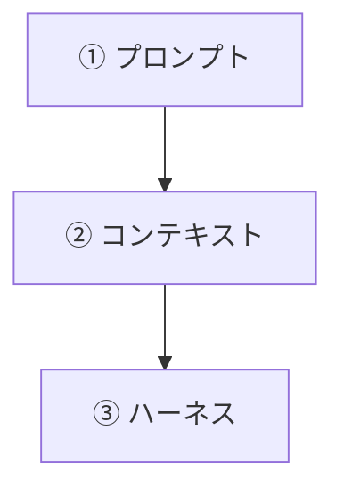
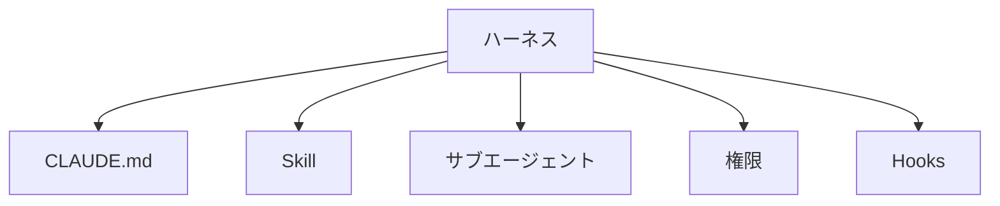

# 15-1-2: プロンプト・コンテキスト・ハーネス - 3つの階層

## 🎯 このセクションで学ぶこと

- 1回の指示・毎回の前提・作業全体の運転という、3つの届く範囲の違いを説明できるようになる。
- ハーネスという言葉が何を指すのかを、自分の言葉で言えるようになる。
- AIに確かめさせると輪が閉じる、ということの意味を説明できるようになる。

---

## 導入：同じ道具を使っていても、進み方は変わる

前のセクションで並べた4つは、どれも毎回あなたが手で運んでいたものでした。では、どこに置けば運ばずに済むのでしょうか。

同じClaude Codeを使っていても、依頼のたびに前提を書き足している人と、前提をセッションの外に置いてある人とでは、1回の依頼で打つ量が違います。違うのは道具ではなく、決めごとをどこに書いてあるかです。

このセクションでは、書く場所を3つに分けます。分ける基準は、そこに書いたものが**どこまで届くか**です。1回の依頼にだけ届くのか、いまのセッションのあいだ届くのか、これから先の作業すべてに届くのか。

---

## 届く範囲で、3つに分かれる

矢印は、やる順番ではありません。上から下へ行くほど、書いたものの届く範囲が広くなる、という向きです。

| 層 | 何を決める層か | Tutorial 14で当たるもの | ここまでで足りないこと |
|:--|:--|:--|:--|
| ① プロンプト | 1回の指示をどう書くか | 14-2-1「指示は仕様書 - 具体的に頼む」 | 毎回書き直します。書いたものは、その回で消えます |
| ② コンテキスト | その1回に、何を渡すか | 14-2-2「コンテキストは資源」／14-2-4で `@` でファイルを指したこと | 渡すものを毎回自分で選び直します。選ぶ手間が毎回かかります |
| ③ ハーネス | 作業全体をどう運転させるか | 該当するものがありません | 呼び出せる形で置く場所がまだ無いので、毎回あなたが手で代わりをすることになります |

3列目が空いている③が、この Tutorial で作っていく層です。上から順に、1つずつ見ていきます。

**① プロンプト - 1回の指示をどう書くか**

1回の依頼文そのものです。14-2-1で、依頼には「何を」「どこまで」「どうなったら終わりか」の3つを書く、と決めました。ここを具体的に書けば、その1回で返ってくるものは変わります。ただし効くのは、その1回だけです。同じ約束を次の依頼でも守ってほしければ、次の依頼にも書きます。

**② コンテキスト - 毎回の前提を、セッションの外に置く**

14-2-2で、コンテキスト（AIが一度に読み取れる情報の範囲）には限りがある、と確かめました。②の層で決めるのは、その限りある範囲に毎回何を載せるかです。依頼のたびに手で載せるのではなく、載せるものをセッションの外にあらかじめ置いておく、という置き方に変えます。

①との違いは、届く範囲です。一度載せたものは、そのセッションのあいだは載ったままで、次の依頼で渡し直さなくても効きます。①のように、その1回で消えるわけではありません。消えるのは、作業の切れ目で `/clear` を打ったときです（14-2-2）。

Tutorial 14では、載せるものを毎回その場で選んでいました。設計書のあるものは、そのファイルを `@` で指して渡していました。ただし、指すのは毎回あなたです。セッションの外に置いておくには、置き場所が要ります。その置き場所を持っているのが、次の③です。

**③ ハーネス - 作業全体をどう運転させるか**

1回の依頼でも、1つのセッションでもなく、これから先の作業全部に効く場所です。Claude Code の公式ドキュメント（2026年8月時点）には、次のように書かれています。

> Claude Code は Claude の周りの agentic ハーネスとして機能します。言語モデルを有能なコーディングエージェントに変えるツール、コンテキスト管理、実行環境を提供します。

`agentic` は、AIが自分で考えて手を動かし、結果を見てまた動く、という進み方のことです。その進み方ができるように、道具・読ませる範囲・動かす場所をひとまとめに用意しているのがClaude Codeだ、と言っています。

ハーネスは、もともと馬に付ける道具（手綱や鞍）を指す言葉です。力は強いけれど、放っておけばどこへ走るか分からない相手を、行かせたい方向へ導くための道具です。

公式がハーネスと呼んでいるのは Claude Code そのものです。あなたがこれから足していくのは、その中身です。この教材では、あわせてハーネス（AIが作業できるように、まわりを整えておく道具と決まりごとの一式）と呼びます。

---

## ハーネスの中身

この教材で扱うハーネスの中身は、5つです。

| ハーネスの中身 | 何を置くところか | 扱う章 |
|:--|:--|:--|
| `CLAUDE.md` | このプロジェクトの前提 | Chapter 2 |
| Skill | 繰り返す手順 | Chapter 3 |
| サブエージェント | 切り離して任せる担当 | Chapter 3 |
| 権限 | どこまで任せるか | Chapter 4 |
| Hooks | 必ず走る確認 | Chapter 4 |

それぞれが何なのかは、Chapter 2から順に、1つずつ手を動かしながら見ていきます。ここでは、名前と、どの章で出てくるかだけを見ておいてください。

前のセクションで並べた4つは、この5つのどこかに収まります。どれをどこに収めるのかは、次のセクションで決めます。

---

## 検証の輪を、AIに閉じさせる

置き場所を3つに分けたところで、もう1つ決めておくことがあります。ハーネスは、何のために整えるのか、です。

Tutorial 14で、テストを回していたのはあなたでした。`./vendor/bin/sail artisan test` を自分で実行して、`failed` が0であることを自分の目で見た、というのが14-4-1の確認事項でした。その状態のことを、Claude Code の公式ドキュメント（2026年8月時点）は、次のように書いています。

> Claude は、作業が完了したように見えるときに停止します。実行できるチェックがないと、「完了したように見える」が唯一の利用可能なシグナルであり、あなたが検証ループになります。すべての間違いはあなたがそれに気付くのを待ちます。Claude が実行できるパスまたはフェイルを生成するものを与えると、ループは自動的に閉じます。Claude は作業を行い、チェックを実行し、結果を読み、チェックが合格するまで反復します。

引用にある「パス」は合格、「フェイル」は不合格のことです。「あなたが検証ループになります」というのは、こういうことです。AIは、できたように見えたところで止まります。合っているかどうかを確かめる手立てがAIの側に無いと、確かめる役はあなた1人になります。14-4-1で、直しましたという返事は結果ではない、と書いたのは、この状態のことでした。

ここで1つ、断っておきます。合否が出るものそのものは、Tutorial 14で書いてあります。テストです。無かったのは、AIが自分でそれを走らせて、結果を読む、という筋道のほうです。

逆に、AIが自分で走らせられて、合格か不合格かが出るものを渡してあれば、AIは書く、走らせる、結果を読む、直す、を自分で繰り返せます。輪が、AIの側で閉じます。

Tutorial 14に足りなかったのは、その筋道を決まりとして置いておく場所です。走らせて、落ちていたら直してから終える。これを依頼のたびにあなたが書き添えるのではなく、あらかじめ書いておける場所が、まだありませんでした。その手立てを実際に用意するのが、Chapter 4です。

輪が閉じても、最後に自分の目で見ることは変わりません。機械が先に落としてくれる分、あなたが読むのは、機械では判定できないところだけになります。

---

## 💡 よくある間違い

**上の層だけやればいい、と読む**

3つは置き換えではなく入れ子です。ハーネスを整えても、1回の指示を具体的に書くこと（14-2-1）は要らなくなりません。何を作るかを決めるのは、これから先もあなたが書く1行です。

**仕組みを整えれば、自分は読まなくてよくなる、と読む**

機械が通したものは、正しいと決まったわけではありません。テストが見ているのは、テストに書いた条件だけです。書いていない条件は、いまも自分で確かめる側にあります。

**コンテキストという言葉が、2つの意味で出てきたと思う**

意味は14-2-2と同じです。変わるのは、そこに何を載せるかを毎回その場で決めるか、あらかじめ決めておくか、です。

---

## ✨ まとめ

- 書いたものがどこまで届くかで、置き場所は3つに分かれます。1回の指示を書く層、その1回に何を渡すかを決める層、作業全体をどう運転させるかを決める層です。
- 3つは上から下へ行くほど届く範囲が広くなるだけで、下の層を足しても、上の層が要らなくなるわけではありません。
- Claude Code の公式ドキュメントは、Claude Code 自身をハーネスと呼んでいます。この教材では、あなたがそこに足していく道具と決まりごとも含めて、ハーネスと呼びます。
- ハーネスの中身として、この教材では5つを扱います。Chapter 2から順に、1つずつ見ていきます。
- 合否が出るものを、AIが自分で走らせられる形で渡していないと、確かめる役はあなた1人になります。渡してあれば、AIが自分で確かめて直すところまで回り、輪が閉じます。

次のセクション（15-1-3）では、手元にある書類を2つに分けます。一度の開発で使い終えるものと、繰り返し効くもの。この線を引いておくと、何をハーネスに置くのかが決まります。

---
