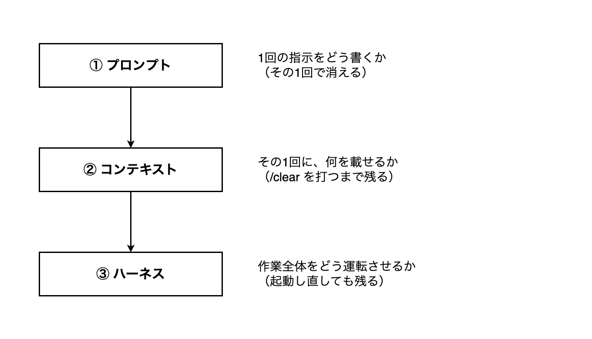
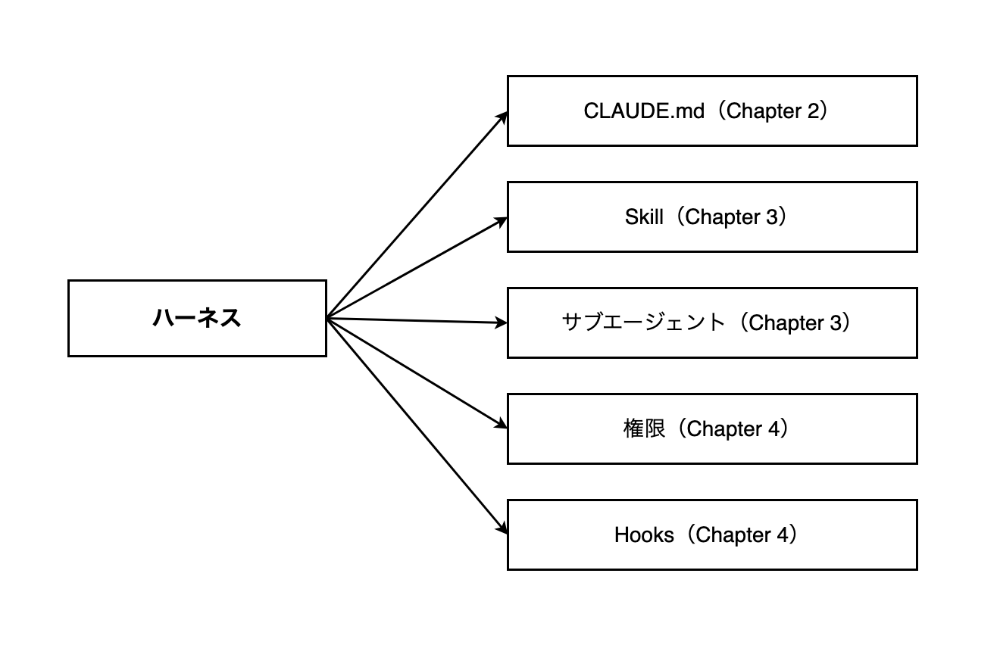

# 15-1-2: プロンプト・コンテキスト・ハーネス

## 🎯 このセクションで学ぶこと

- 書いたものがどこまで届くかで、置き場所が3つに分かれることを説明できるようになる。
- ハーネスという言葉が何を指すのかを、自分の言葉で言えるようになる。
- 合否の出るものをAIに渡すと、確かめる役がどう変わるのかを説明できるようになる。

---

## 導入：同じ1行でも、書く場所で寿命が変わる

「テストは `./vendor/bin/sail artisan test` で回してください」。この1行を依頼文に書くと、その依頼のあいだは効きます。次の依頼では、また書きます。

同じ1行を別の場所に置くと、次の依頼でも、`/clear` を打ったあとでも、明日起動し直したあとでも効きます。中身は同じ1行です。変わるのは、書いた場所のほうです。

場所ごとに、書いたものがどこまで届くかは決まっています。そこを知らないまま書くと、消える場所に書き続けることになります。

---

## 届く範囲で、3つに分かれる

**書いた場所ごとの、届く範囲**

矢印は、やる順番を表していません。下へ行くほど、書いたものの届く範囲が広くなるという向きです。

| 層 | 何を決める層か | Tutorial 14で当たるもの |
|:--|:--|:--|
| ① プロンプト | 1回の指示をどう書くか | 14-2-1「前提を渡し、手段は任せる」で決めた形 |
| ② コンテキスト | その1回に、何を載せるか | `@docs/comment.md` のように、渡すファイルを指したこと（14-2-2・14-2-4） |
| ③ ハーネス | 作業全体をどう運転させるか | `.claude/settings.json` に書いた `deny`（14-1-3） |

**① プロンプト**

1回の依頼文そのものです。14-2-1で、依頼には前提だけを書き、作り方は書かないと決めました。ここを具体的に書けば、その1回で返ってくるものが変わります。効くのは、その1回だけです。

**② コンテキスト**

14-2-2で、AIが一度に読み取れる情報の範囲をコンテキストと呼び、そこには限りがあると確かめました。②の層で決めるのは、その限りある範囲に何を載せるかです。

①との違いは、届く範囲です。一度載せたファイルは、そのセッションのあいだ載ったままで、次の依頼で渡し直さなくても効きます。消えるのは、作業の切れ目で `/clear` を打ったときです。

Tutorial 14では、載せるものを毎回その場で選んでいました。設計書のあるものは `@` で指し、ファイルになっていないものは依頼文に書きました。指すのも書くのも、毎回あなたです。会話の外に置いておくには、置き場所が要ります。それを持っているのが③です。

**③ ハーネス**

1回の依頼でも、1つのセッションでもなく、これから先の作業に効く場所です。Claude Codeの公式ドキュメント（2026年8月時点）には、次のように書かれています。

> Claude Code は Claude の周りの agentic ハーネスとして機能します。言語モデルを有能なコーディングエージェントに変えるツール、コンテキスト管理、実行環境を提供します。

`agentic` は、AIが自分で考えて手を動かし、結果を見てまた動く、という進み方のことです。その進み方ができるように、道具・読ませる範囲・動かす場所をひとまとめに用意しているのがClaude Codeだ、と言っています。

ハーネスは、もともと馬に付ける道具（手綱や鞍）を指す言葉です。力は強いけれど、放っておけばどこへ走るか分からない相手を、行かせたい方向へ導くための道具です。

公式がハーネスと呼んでいるのはClaude Codeそのものです。あなたがこれから足すのは、その中身です。この教材では、あわせてハーネス（AIが作業できるように、まわりを整えておく道具と決まりごとの一式）と呼びます。

14-1-3で `.claude/settings.json` に `.env` を読ませない `deny` を書いたのが、あなたが最初に置いたハーネスです。書いたのは一度きりで、いまも効いています。

---

## ハーネスの中身

**この教材が扱う5つと、扱うChapter**

| ハーネスの中身 | 何を置くところか | 扱うChapter |
|:--|:--|:--|
| `CLAUDE.md` | このプロジェクトの前提 | Chapter 2 |
| Skill | 繰り返す手順 | Chapter 3 |
| サブエージェント | 切り離して任せる担当 | Chapter 3 |
| 権限 | どこまで任せるか | Chapter 4 |
| Hooks | 必ず走る確認 | Chapter 4 |

15-1-1で並べた4つは、この中に収まります。アプリの前提は `CLAUDE.md`、レビュー観点は14-3-2の表から今回の行を選ぶ手順ごとSkill、承認は権限、テストの実行はHooksです。

サブエージェントだけ、Tutorial 14で手で運んでいたものに当たるものがありません。調べもので会話が埋まったときの逃がし先として、Chapter 3で足します。

---

## 検証の輪を、AIに閉じさせる

置き場所を分けたところで、もう1つ決めておくことがあります。ハーネスは何のために整えるのか、です。

Tutorial 14でテストを回していたのは、あなたでした。この状態のことを、Claude Codeの公式ドキュメント（2026年8月時点）は次のように書いています。

> Claude は、作業が完了したように見えるときに停止します。実行できるチェックがないと、「完了したように見える」が唯一の利用可能なシグナルであり、あなたが検証ループになります。すべての間違いはあなたがそれに気付くのを待ちます。Claude が実行できるパスまたはフェイルを生成するものを与えると、ループは自動的に閉じます。Claude は作業を行い、チェックを実行し、結果を読み、チェックが合格するまで反復します。

引用にある「パス」は合格、「フェイル」は不合格のことです。合っているかどうかを確かめる手立てがAIの側に無いと、確かめる役はあなた1人になります。14-4-1で `failed` を探していたときが、その状態です。

合否の出るものそのものは、Tutorial 14で書いてあります。テストです。無かったのは、AIが自分でそれを走らせて、結果を読むという筋道のほうでした。

走らせられて、合格か不合格かが出るものを渡してあれば、AIは書く、走らせる、結果を読む、直す、を自分で繰り返せます。輪が、AIの側で閉じます。その手立てを実際に用意するのがChapter 4です。

---

## 💡 よくある間違い

**下の層だけやればいい、と読む**

3つは入れ子です。ハーネスを整えても、1回の指示を具体的に書くこと（14-2-1）は要らなくなりません。何を作るかを決める1行は、これから先もあなたが書きます。

**コンテキストという言葉が、2つの意味で出てきたと思う**

意味は14-2-2と同じです。変わるのは、そこに何を載せるかを毎回その場で決めるか、あらかじめ決めておくかです。

---

## ✨ まとめ

- 書いたものがどこまで届くかで、置き場所は3つに分かれます。1回の指示・その1回に載せるもの・作業全体の運転です。
- ①は依頼のたびに消え、②は `/clear` で消え、③は置いたまま残ります。下を足しても、上が要らなくなるわけではありません。
- 公式ドキュメントはClaude Code自身をハーネスと呼んでいます。この教材では、あなたがそこへ足す道具と決まりごとも含めてハーネスと呼びます。
- ハーネスの中身は `CLAUDE.md`・Skill・サブエージェント・権限・Hooksの5つで、Chapter 2から順に1つずつ手を動かします。
- 合否の出るものをAIが自分で走らせられる形にしておくと、書いて、走らせて、結果を読んで直すところまでAIの側で回ります。

---
