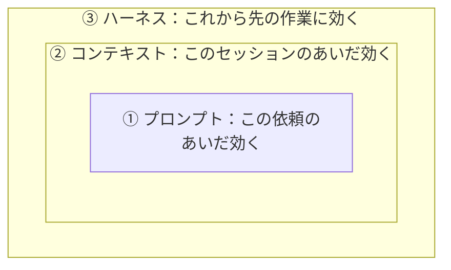

# 15-1-2: プロンプト・コンテキスト・ハーネス

## 🎯 このセクションで学ぶこと

- プロンプト・コンテキスト・ハーネスの3つの層が、それぞれ何を決める場所なのかを理解する。
- Tutorial 14で自分が書いた1行が、どの層に置かれていたのかを見分けられるようになる。
- 書いたものをどこまで効かせたいかで、置き場所を選べるようになる。

---

## 導入

「テストも書いて、`./vendor/bin/sail test` で回して、通るまで直して、最後に結果を報告して」。この1行を依頼文に書くと、その依頼のあいだは効きます。次の依頼では、また書きます。

同じ1行を別の場所に置くと、次の依頼でも、`/clear` を打ったあとでも、明日起動し直したあとでも効きます。中身は同じ1行です。変わるのは、書いた場所のほうです。

場所ごとに、書いたものがどこまで届くかは決まっています。そこを知らないまま書くと、消える場所に書き続けることになります。

---

## 届く範囲で分かれる3つの層

囲みで描いてあるのは、やる順番ではありません。外側の枠ほど、書いたものの届く範囲が広いという向きです。

---

## ① プロンプト

1回の依頼文そのものです。ここに書いたことが効くのは、その1回だけです。

14-2-1で、依頼で固める要素を目的・制約・スコープ外（変えないもの）・参照・受け入れ条件・検証手段の6つに分けました。どれもこの層の道具で、ここを具体的に書くほど、その1回で返ってくるものが変わります。

同じ層に、形を整えずに投げる使い方もあります。14-2-2で扱った案出し・調べもの・コードの読み解きは、作らせない用事なので、思いついた文のまま投げて構いません。①は、その1回で欲しいものに合わせて書き方を選ぶ場所です。

---

## ② コンテキスト

AIが一度に読み取れる情報の範囲を、コンテキストと呼びます（14-5-2）。②の層で決めるのは、その範囲に何を載せるかです。

載るのは、やり取りした文章・読んだファイルの中身・実行したコマンドの結果です。載せるには、依頼文に書くか、`@` でファイルを指します（14-2-3）。

①との違いは、届く範囲です。一度載せたファイルは、そのセッションのあいだ積まれたままで（14-5-2）、次の依頼で渡し直さなくても効きます。消えるのは、作業の切れ目で `/clear` を打ったときです。打ったあとのAIは、前の話を何も知りません。

Tutorial 14では、載せるものを毎回その場で選んでいました。読ませたいファイルは `@resources/views/posts/index.blade.php` と名指しし（14-2-3）、設計書は依頼文に `docs/reply.md` とパスを書いて渡しました（14-3-3）。指すのも書くのも、毎回あなたです。会話の外に置いておくには、置き場所が要ります。それを持っているのが③です。

---

## ③ ハーネス

1回の依頼でも、1つのセッションでもなく、これから先の作業に効く場所です。Claude Codeの公式ドキュメント（2026年8月時点）には、次のように書かれています。

> Claude Code は Claude の周りの agentic ハーネスとして機能します。言語モデルを有能なコーディングエージェントに変えるツール、コンテキスト管理、実行環境を提供します。

`agentic` は、AIが自分で考えて手を動かし、結果を見てまた動く、という進み方のことです。その進み方ができるように、道具・読ませる範囲・動かす場所をひとまとめに用意しているのがClaude Codeだ、と言っています。

ハーネスは、もともと馬に付ける道具（手綱や鞍）を指す言葉です。

公式がハーネスと呼んでいるのはClaude Codeそのものです。あなたがこれから足すのは、その中身です。この教材では、あわせてハーネス（AIが作業できるように、まわりを整えておく道具と決まりごとの一式）と呼びます。

14-1-5で `.claude/settings.json` に `.env` を読ませない `deny` を書いたのが、あなたが最初に置いたハーネスです。書いたのは一度きりで、いまも効いています。

15-1-1で並べた3つのうち、`CLAUDE.md` と `deny` はリポジトリの中にあります。Playwright MCPの設定だけは手元のClaude Codeに入っていて、リポジトリにファイルは増えていません（14-4-4）。入っている場所は違いますが、セッションを超えて残る点は同じです。

---

## 層・寿命・実物の対応

| 層 | 何を決めるか | いつまで効くか | Tutorial 14の実物 |
|:--|:--|:--|:--|
| ① プロンプト | 1回の依頼をどう書くか | その依頼のあいだ | 14-2-1で書いた依頼文。14-2-2の案出し |
| ② コンテキスト | その1回に何を載せるか | そのセッションのあいだ（`/clear` で消える） | `@resources/views/posts/index.blade.php` と指したこと（14-2-3） |
| ③ ハーネス | これから先の作業をどう運転させるか | 置いたまま残る | `.claude/settings.json` の `deny`（14-1-5） |

15-1-1で並べた5行のうち、書いて渡していたものは、全部①に置いていました。移し先はどれも③です。

---

## 💡 よくある間違い

**外側の層だけやればいい、と読む**

3つは入れ子です。ハーネスを整えても、1回の指示を具体的に書くこと（14-2-1）は要らなくなりません。何を作るかを決める1行は、これから先もあなたが書きます。

**コンテキストという言葉が、2つの意味で出てきたと思う**

意味は14-5-2と同じです。変わるのは、そこに何を載せるかを毎回その場で決めるか、あらかじめ決めておくかです。

---

## ✨ まとめ

- 同じ1行でも、置いた場所で効く範囲が変わります。①は1回の依頼、②は1つのセッション、③は置いたまま残ります。
- ①では、作らせる依頼は6つの要素を固めて書き、案出し・調べもの・コードの読み解きは形を整えずに投げます。
- ②に何を載せるかは、毎回その場で選びます。次のセッションにも残したいものは、③へ移します。
- 公式ドキュメントはClaude Code自身をハーネスと呼んでいます。この教材では、あなたがそこへ足す道具と決まりごとも含めてハーネスと呼びます。③に何を置けるのかは、15-1-3で並べます。

---
