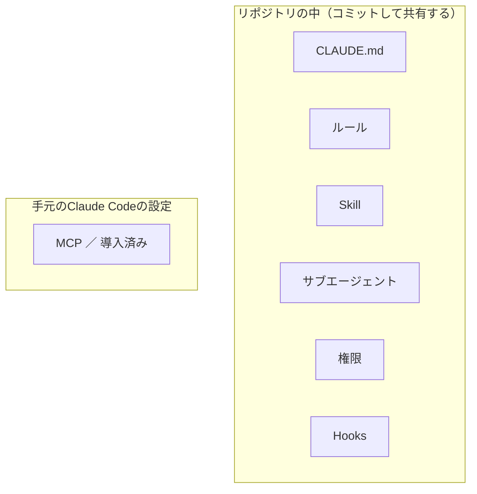

# 15-1-3: 何を、どこに固めるか

## 🎯 このセクションで学ぶこと

- ハーネスの中身7つが、それぞれ何をするものなのかを理解する。
- 「こうなったら、ここに固める」を引き金から選べるようになる。
- 事実として書いておくものと、手順として部品にするものを見分けられるようになる。

---

## 導入

置いたまま残る場所があると分かっても、書き込む先は1か所ではありません。同じ「テストの句」でも、毎回読ませたい決まりとして置くのか、呼んだときだけ動く手順として置くのかで、ファイルも書き方も変わります。どこに何が置けるのかを知らないまま書き始めると、読まれない場所に書いたことに、しばらく気づけません。

---

## ハーネスの中身

| 中身 | 何をするものか | 置き場所 | 扱う章 |
|:--|:--|:--|:--|
| `CLAUDE.md` | このプロジェクトの前提を書いておく1枚。セッションの開始時に読まれます | `./CLAUDE.md` または `./.claude/CLAUDE.md` | Chapter 2 |
| ルール | 話題ごとに分けた決まりのファイル。1つのファイルに1つの話題を書きます | `.claude/rules/` | Chapter 2 |
| Skill | 手順に名前を付けて、呼んだときだけ動かす部品 | `.claude/skills/<名前>/SKILL.md` | Chapter 3 |
| サブエージェント | 決めた仕事を、別のコンテキストで進める担当 | `.claude/agents/<名前>.md` | Chapter 3 |
| 権限 | 止めるもの・必ず聞くもの・聞かずに通すものの指定 | `.claude/settings.json` の `permissions` | Chapter 4 |
| Hooks | 決まった場面で必ず走らせるコマンド | `.claude/settings.json` の `hooks` | Chapter 4 |
| MCP | Claude Codeと、外にある別のプログラムをつなぐ口 | 手元のClaude Codeの設定 | 導入済み（14-4-4） |

残る6つを、Chapter 2から順に置いていきます。

`CLAUDE.md` とルールに書いたことは、判断の材料として渡るだけで、強制ではありません（14-1-3）。Claudeの判断によらず必ず止めたいことは、公式ドキュメントもフックを使うよう書いています。お願いとして書く場所と、機械が執行する場所は別だということです。

---

## 引き金と、固める先

置き場所の選び方を、公式ドキュメントは3つに分けています。毎セッション持っていてほしい**事実**は `CLAUDE.md` へ。コードの**一部分にだけ効く**決まりは、場所を指定したルールへ。**複数のステップからなる手順**はSkillへ。場所を指定したルールは、その場所のファイルを触るときだけ読まれます（書き方はChapter 2）。

この3つに、権限とHooksとサブエージェントを足すと、手元の作業から置き場所を引ける形になります。

| こうなったら | ここに固める | 扱う節 |
|:--|:--|:--|
| 同じ間違いを2回された | `CLAUDE.md` | 15-2-1 |
| 決まったフォルダの中だけで効く決まりが増えた | 場所を指定したルール | 15-2-3 |
| 3ステップを超える手順を2回貼った | Skill | 15-3-1 |
| 調べもので会話が埋まる | サブエージェント | 15-3-3 |
| 同じ承認を何度も押している | 聞かずに通す指定 | 15-4-1 |
| 毎回必ず起きてほしい確認がある | Hooks | 15-4-2 |

同じ間違い・同じ手順・同じ承認の3行は、15-1-1で決めた「2回」を場面ごとに言い直したものです。

---

## 既にあるもの

作る前に、同じものが既に無いかを見ます。14-4-2で送った `/code-review` は、Claude Codeに最初から入っているレビュー用のコマンドです。自分では1行も書いていないのに、名前を打てば呼べます。同じ働きのものを自分で作ると、これから先の手入れだけが自分の側に増えます。何を自作して何を公式に任せるかの決め方は、15-3-1で扱います。

---

## 検証の輪

Tutorial 14では、実装を頼むたびに「テストも書いて、`./vendor/bin/sail test` で回して、通るまで直して、最後に結果を報告して」と書き添えていました。この1行が、書く・回す・直す・報告する、という輪をAIの側に作っていました（14-4-1）。

輪そのものは毎回できていました。毎回作り直していたのは、輪を作る1行のほうです。合否の出るものをAIが自分で走らせられる形にして置いておけば、依頼文に書かなくても同じ輪が回ります。その仕掛けを用意するのがChapter 4です。

---

## 5行の置き場所

15-1-1で開いた `docs/manual-work.md` の5行を、この地図に載せ直すと、こうなります。

| `docs/manual-work.md` の行 | 固める先 | 扱う節 |
|:--|:--|:--|
| ① アプリの前提を書き直した | `CLAUDE.md`・ルール | 15-2-1・15-2-3 |
| ② テストの句を書き添えた | 決まり＋Hooks | 15-2-1・15-4-3 |
| ③ 差分と設計書を突き合わせる順番を組み立てた | Skill | 15-3-2 |
| ④ 受け入れ条件を2回貼り直した | Skill | 15-3-4 |
| ⑤ `gh` と計画の承認のたびに確認を押した | 許可の指定 | 15-4-1 |

いちばん上の①、依頼のたびに書き直していたこのアプリの前提が、Chapter 2の入口です。

---

## ✨ まとめ

- ハーネスの中身は、`CLAUDE.md`・ルール・Skill・サブエージェント・権限・Hooks・MCPです。前の6つはリポジトリの中に置き、MCPだけは手元のClaude Codeの設定に入ります。
- 固める先は、毎セッション持っていてほしい事実なら `CLAUDE.md`、一部分にだけ効く決まりなら場所を指定したルール、複数ステップの手順ならSkillです。
- 引き金は「2回」です。同じ間違い、同じ手順、同じ承認が2回目に来たら、その時点で置き場所を決めます。
- 書いて渡す決まりは、判断の材料です。必ず走らせたいものは、機械の側に持たせます。
- 作る前に、公式や同梱のものが無いかを見ます。`/code-review` は既に使っています。

---
