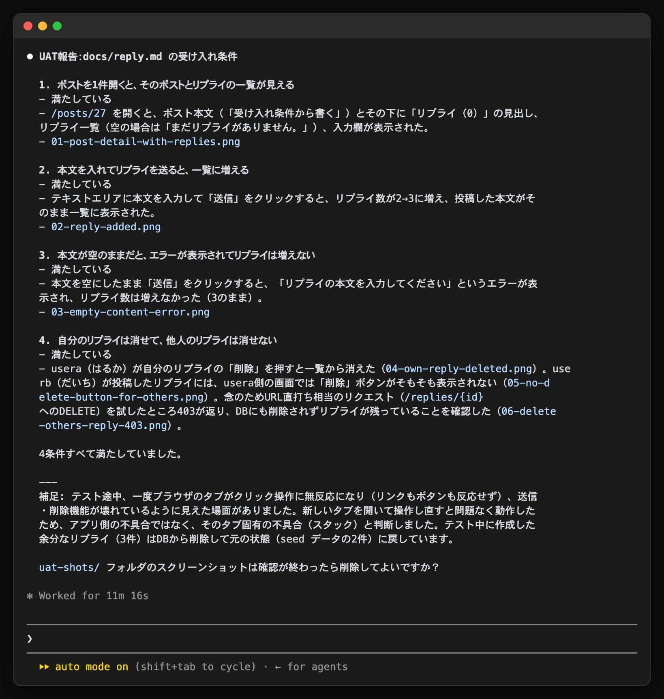

# 15-3-4: UATをSkillにする - AI演習

## 📌 この演習について

棚卸しのイシューの4項目め、「同じ受け入れ条件を、自分で確かめるときとAIに回させるときの2回、貼り直した」を部品にします。UAT（User Acceptance Test＝受け入れテスト）は、使う人と同じように画面を触って、決めた条件どおりかを見る確認です（14-4-3）。

14-4-4でAIに回させたとき、依頼文には受け入れ条件のほかに、使う道具・ログイン情報・開くURL・報告のしかた・スクリーンショットの置き場所が入っていました。毎回変わるのは受け入れ条件だけで、残りは固定です。固定の部分をSkillに移し、変わる部分だけを渡す形にします。

作り方は15-3-2と同じで、1回やってから書き起こさせます。今回は手順を自分で進めてください。

### 始める前に

3つそろっていないと進められません。

| 確かめるもの | 確かめ方 | 入っていないとき |
|:--|:--|:--|
| Playwright MCP | `claude mcp list` に `playwright` が `✔ Connected` で出る | 14-4-4の `claude mcp add` を打つ |
| アプリが動いていること | ブラウザで `http://localhost` が開く | 投稿アプリのフォルダで `./vendor/bin/sail up -d` |
| skill-creator | 15-3-2で入れたものがそのまま使える | 別のパソコンで始めたときは、15-3-2の2行を先に打つ |

Playwright MCPとskill-creatorは手元のClaude Codeに入るもので、リポジトリには残りません。別のパソコンで始めた場合は、どちらも入れ直しになります。

---

## 🎯 演習課題

### 📋 課題

**目的**

`.claude/skills/uat/SKILL.md` を作り、`/uat` に確かめたい受け入れ条件を渡すと、ブラウザを回して**行ごとの判定とスクリーンショット**が返ってくる状態にします。

Skillの側に固定するのは、次のものです。

- ブラウザを動かすのにPlaywright MCPを使うこと
- ログイン情報（`usera@example.com` と `userb@example.com`、どちらも `password`）
- 開くURL（`http://localhost`）
- 1行ずつ、満たしているかどうかと、そう判断した理由を、スクリーンショットと一緒に報告すること
- スクリーンショットは `uat-shots/` に、どの行のものか分かる名前で置くこと（14-4-4）
- 報告のあと、`uat-shots/` を消してよいかを聞くこと（見終わったら消して、リポジトリの中にファイルを残さない）

受け入れ条件は固定しません。機能ごとに変わるので、呼ぶときに渡します。

**変えないもの**

アプリのコードです。この部品は画面を触って報告するところまでで、直しません。

**受け入れ条件**

下の完成チェックリストが全部埋まった状態です。

> 💡 **TIP**: `.claude/skills/` は15-3-2で作ってあります。今回は起動し直さずに、作った直後のセッションからそのまま呼べます。

### ✏️ 進め方タスク

1. 【自分】上の3つの前提を確かめる
2. 【自分⇄AI】14-4-4の依頼文で、リプライ機能のUATをもう1回回す
3. 【自分⇄AI】「いまこの会話でやった手順をSkillにして」と送り、聞き返しが出たら答える
4. 【自分】できた `SKILL.md` を全文読み、固定するはずのものが入っているかを確かめる
5. 【自分】受け入れ条件の受け取り口を、自分の手で書き足す
6. 【自分⇄AI】`/uat` に `docs/reply.md` の受け入れ条件を渡して回し、2の結果と見比べる
7. 【自分⇄AI】`uat-shots` のスクリーンショットを見終わったら消してもらい、`git status` を見てから、`main` へコミットしてpushする

### ✅ 完成チェックリスト

- [ ] `/uat` を呼ぶと、渡した受け入れ条件の行ごとに判定が返る（リプライなら4行）
- [ ] 判定の行に、そう判断した理由と、`uat-shots` に置かれたスクリーンショットが対応している
- [ ] タスク2で回したときと同じ4行に、同じ判定が返っている
- [ ] `SKILL.md` を読むと、渡した受け入れ条件がどこで使われるのかが分かる
- [ ] `SKILL.md` にログイン情報・URL・報告のしかた・`uat-shots/` への保存と片づけが書かれている
- [ ] `uat-shots` を消したあと、`git status` に出るのが `.claude/` の下だけで、画像のファイルが増えていない
- [ ] GitHubのページで `.claude/skills/uat/SKILL.md` の中身が読める

> 🚀 **ここから先は、自分の力で進めてみましょう！**

---

## 💡 ヒント

**渡した受け入れ条件が使われていないとき**

`SKILL.md` の本文に `$ARGUMENTS` と書くと、呼ぶときに後ろへ続けた文がそこに入ります。書いていないと、渡した文は末尾に `ARGUMENTS: <値>` として付くだけになり、それが何なのかは決まりません。本文の中で「これが確かめる受け入れ条件です」と分かる位置に置いてください。

**ログイン情報が `SKILL.md` に入っていないとき**

会話で渡した値が、書き起こしたときに落ちることがあります。自分の手で書き足してください。`usera@example.com` と `password` は教材用に公開している値なので、書いて構いません（14-4-4）。実務で使う本物の認証情報は書きません。

**`uat-shots` が見あたらないとき**

保存先が別の場所になっています。そのまま「スクリーンショットをどこに保存した？ このフォルダの uat-shots/ に移して」と頼めば済みます（14-4-4）。置き場所の行が `SKILL.md` から落ちていたら、足しておいてください。

---

## 🏃 実践：一緒に進めてみましょう

### 📝 ステップバイステップ

#### Step 1: アプリを起動して、Claude Codeを開く

```bash
# 投稿アプリのフォルダで実行する
./vendor/bin/sail up -d
claude
```

#### Step 2: UATを1回回す

14-4-4で使ったものと同じ依頼文です。1行目でPlaywright MCPを名指ししてあります。ここを書かないと、ブラウザを動かせる別の道具が入っている場合にそちらが動くことがあります。

```text
Playwright MCP を使って http://localhost を開いて、次の4つを順に確かめて。
ログインは usera@example.com / password と userb@example.com / password を使って。

- ポストを1件開くと、そのポストとリプライの一覧が見える
- 本文を入れてリプライを送ると、一覧に増える
- 本文が空のままだと、エラーが表示されてリプライは増えない
- 自分のリプライは消せて、他人のリプライは消せない

1行ずつ、満たしているかどうかと、そう判断した理由を、証拠のスクリーンショットとあわせて報告して。
スクリーンショットは、このフォルダの uat-shots/ に、どの行のものか分かる名前で置いて。
```

#### Step 3: いまの会話をSkillにさせる

```text
いまこの会話でやった手順をSkillにして
```

聞き返しが出たら、置き場所は**このリポジトリ内**を選びます。名前が `uat` 以外になったときは、以下をその名前に読み替えてください。

#### Step 4: 全文読んで、足りないものを書き足す

`.claude/skills/uat/SKILL.md` をVS Codeで開き、固定するはずのものが入っているかを確かめます。落ちているものは、自分で書き足します。

続けて、受け入れ条件の受け取り口を本文に書きます。

```markdown
確かめる受け入れ条件は、次のとおりです。

$ARGUMENTS

受け入れ条件そのものではなく、それが書いてあるファイルの場所を渡されたときは、
そのファイルを開いて、書かれている受け入れ条件を読んでから始めてください。
```

#### Step 5: 部品として呼ぶ

```text
/uat docs/reply.md に書いたリプライ機能の受け入れ条件
```

> 💡 **出力例について**: AIの応答は毎回変わります。以下はあくまで一例です。文言が違っても、チェックリストの項目を満たしていれば問題ありません。

```text
Claude Code: （書いた手順がそのまま読み込まれ、docs/reply.md を読み、ブラウザで
              http://localhost を開いて2つのアカウントを行き来しながら、
              受け入れ条件の行ごとに、満たしているかどうか・そう判断した理由・
              uat-shots/ に置いたスクリーンショットのファイル名、の順で
              報告してくる）
```

**`/uat` を呼んだ結果**



Step 2の報告と見比べます。同じ4行に、同じ判定が返っていれば、依頼文を貼り直す作業が部品に移っています。画面の見え方は2026年8月時点のものです。

#### Step 6: 片づけて、記録する

スクリーンショットは、VS Codeの左のエクスプローラーで `uat-shots` を開くと、その場で見られます（14-4-4）。見終われば `uat-shots` は用済みです。消してよいかを聞かれたら答え、聞かれなければ自分で頼みます。

```text
uat-shots/ を消して。
```

```bash
# 投稿アプリのフォルダで実行する
git status
```

出ているのが `.claude/` の下のファイルだけなら、スクリーンショットは残っていません。画像のファイルが並んでいたら、消してから進めてください。

```text
.claude/skills をコミットして、main に push してください。
そのあと、棚卸しのイシューの4つ目「受け入れ条件を2回貼り直した」にチェックを付けて。
```

思いどおりに直らない・壊れたと感じたら、14-5-1（直らないときの型）へ進んでください。まだコミットしていない変更は `git restore .`（4-3-5）で元に戻せます。

---

## 📖 進行例

> 💡 **進行例について**: AIとの開発は毎回違う流れになります。ここに示すのは一つの進行例です。あなたの画面と違っていても、チェックリストを満たしていれば正解です。

Step 1〜3はそのまま進めて、`.claude/skills/uat/SKILL.md` ができたところからです。

**4. 読んで、足す**

開いて読むと、URLと報告のしかたと `uat-shots/` への保存は入っていましたが、見終わったあとに消す話は落ちていました。受け入れ条件もリプライの4行のまま埋め込まれていたので、この部品はほかの機能でも呼ぶことを考えて、その4行を消して `$ARGUMENTS` に置き換え、「ファイルの場所を渡されたら開いて読む」の2行と、片づけの1行を足しました。

**5. 呼んでみる**

`/uat docs/reply.md に書いたリプライ機能の受け入れ条件` と打つと、書いた手順がそのまま読み込まれて、ブラウザが動き始めました。返ってきた報告は4行で、Step 2と同じ判定でした。`uat-shots` を開くと、どの行のものか分かる名前の画像が4枚並んでいました。

---

## 🚀 まとめ

- 毎回変わらない部分はSkillに固定し、機能ごとに変わる受け入れ条件だけを、呼ぶときに渡す。
- 受け取り口は、`SKILL.md` の本文に `$ARGUMENTS` を置いて作る。
- 書き起こさせたものは、そのまま使わない。落ちている決めごとは自分の手で足す。
- 判定は、1回目に手で回した結果と見比べれば済む。
- Chapter 5では、機能を1本受け取るたびにこの部品を呼びます。

---
