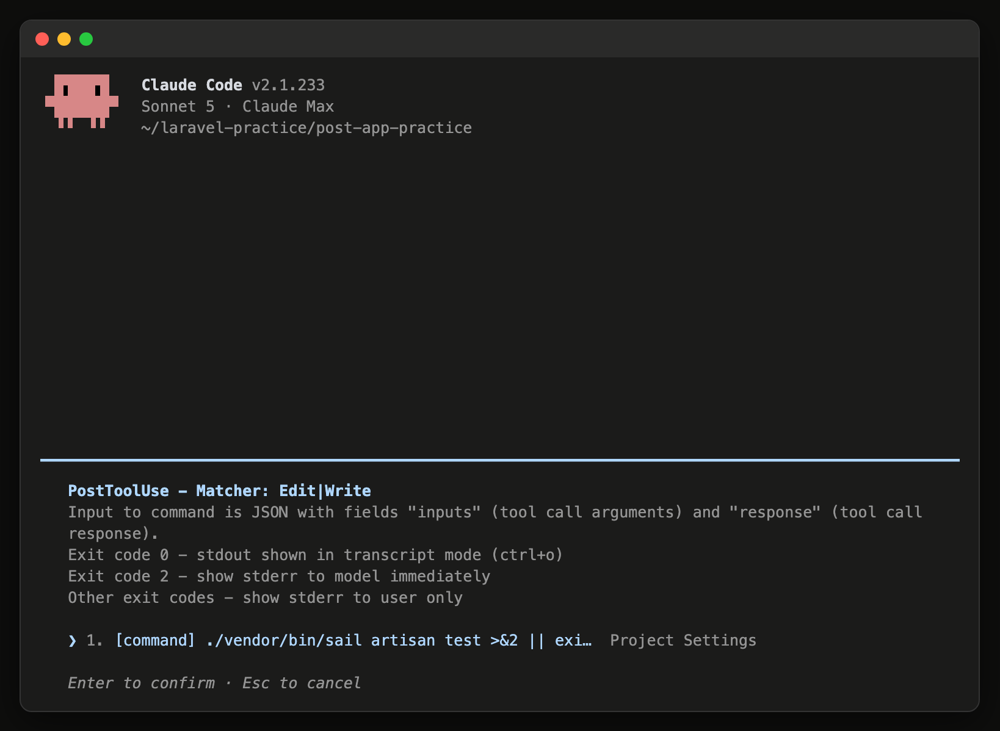

# 15-4-2: Hooks - 決まった場面で必ず走らせる

## 🎯 このセクションで学ぶこと

- 決まった場面が来たときにClaude Codeが自動で実行するコマンドを、どこにどう仕掛けるのかを理解する。
- `>&2`・`||`・`exit 2` の3つが何をしているのかを読めるようになる。
- 落ちたときにAIへ何が届き、通ったときに画面がどうなるのかを判断できるようになる。

---

## 導入

`CLAUDE.md` やルールに「コードを変えたら、最後にテストを実行してください」と書いたとします。読まれますが、読んで動くのはAIです。書いたことは判断の材料として渡るだけで、強制的な設定ではありません（14-1-3）。1回の依頼で多くのファイルが書き換わる場面では、抜けます。

公式ドキュメントも、決まった時点で必ず起きてほしいこと（ファイルを1つ編集するたび、コミットの前、など）は、書いて頼むかわりにフックにするよう案内しています。フックは決まった場面でシェルのコマンドとして走り、AIが何をすると決めたかに関わらず動くからです。

---

## Hooksとは

Hooks は、決まった場面が来たときにClaude Codeが自動で実行するコマンドです。書く場所は `.claude/settings.json` で、15-4-1 で `permissions` を書いたのと同じファイルです。この章で扱う2つは、道具としては別のものですが、置き場所は1つです。

2-1-4「VSCodeの基本設定と拡張機能」で、ファイルを保存したときに自動で整える設定を入れました。考え方は同じで、決まった場面が来たら機械が決まったことをします。違うのは、走る場面も走らせる中身も自分で決められるところです。

15-4-1 の `deny` は、させたくないことをAIが始めた瞬間に止めました。Hooks は、やってほしいことを、決まった場面が来るたびに走らせます。止めるほうはAIが手を伸ばした瞬間に効き、走らせるほうはAIが動いたあとに効きます。どちらも、覚えている人がいなくても成立するところが同じです。

Chapter 2 と Chapter 3 で置いたものとの違いは、もう1つあります。フックはClaude Codeの外でコマンドとして走るので、仕掛けておくだけではやり取りに1文字も載りません。載るのは、走った結果をAIに知らせたときだけです。`CLAUDE.md` は毎回載り、Skillは呼ばれたときに載り、フックは知らせたときだけ載ります。

この章で仕掛けるのは1つです。**AIがファイルを書き換えた直後に、テストを走らせます。** 落ちたら、落ちた中身をAIに知らせます。

---

## 場面と絞り込み

「決まった場面」として選べるものは、いくつも用意されています。ここでいう場面は、AIがファイルを読み書きしたり、コマンドを打ったりする操作のことで、Chapter 3 で自分が置いた道具のことではありません。この教材で覚えておくのは2つです。

| 場面 | いつ走るか |
|:--|:--|
| 操作の前 | AIがファイルを書き換えたり、コマンドを実行したりする、その直前 |
| 操作のあと | 書き換えや実行が終わった、その直後 |

いま要るのは下の1つで、設定ファイルの中では `PostToolUse` という名前で書きます。前に走るほうは、実行してよいかを判定させたいときに使うもので、この教材では扱いません。ほかにも場面はありますが、この2つで足ります。

絞り込みは、もう一段あります。AIがした操作の種類です。名前の付け方は 15-4-1 の許可の指定と同じで、今回選ぶのは、ファイルを書き換えたとき（`Edit`）と、ファイルを新しく作ったとき（`Write`）の2つです。設定では `Edit|Write` と書きます。

> ⚠️ **注意**: ここでの `|` は「または」という意味の区切りです。14-5-1 で使った、左のコマンドが出したものを右へ渡す `|` とは、別の場所の話です。

---

## 1行の中身を読む

書く場所と場面が決まったので、走らせる中身を見ます。次は **`.claude/settings.json`** に足すことになる部分だけを取り出したものです。ここで読んで形を押さえ、自分のアプリに書き足して動かすのは 15-4-3 でやります。Chapter 3 で置いたものは、呼ばれたときに動きました。この形は、呼ばなくても走ります。

```json
{
  "hooks": {
    "PostToolUse": [
      {
        "matcher": "Edit|Write",
        "hooks": [
          {
            "type": "command",
            "command": "./vendor/bin/sail artisan test >&2 || exit 2"
          }
        ]
      }
    ]
  }
}
```

`hooks` の中に場面の名前（`PostToolUse`）、その中に条件（`matcher`）と実行するコマンド、という2段の入れ子です。`hooks` という名前が内側にもう一度出てきますが、内側は「走らせるものの一覧」という意味で、外側とは別のまとまりです。中身のあるのは最後の `command` の1行だけで、あとはその1行をどこに差し込むかを表しています。

その1行は、3つに分かれます。

| 書き方 | 何をしているか |
|:--|:--|
| `./vendor/bin/sail artisan test` | 10-5-3「単体テストの基礎」から打ってきた、テストを回すコマンドです |
| `>&2` | このコマンドが出した文字を、エラー用の出口へ流します |
| `\|\| exit 2` | 左が失敗したときだけ、`exit 2` を実行します |

コマンドが出す文字には、ふつうの出力と、エラー用の出力の2つの出口があります。フックが落ちたときにAIへ送り返されるのは、エラー用のほうです。`>&2` は、ふつうの出力をエラー用の出口へ付け替える書き方で、`2` はエラー用の出口に付いた番号です。

`||` は `&&` の反対だと思ってください。`&&` は左がうまくいったときに右へ進み、`||` は左が失敗したときだけ右へ進みます。

`exit 2` の `2` は、終了コード（コマンドが終わるときに返す、うまくいったかどうかを表す数字）です。コマンドは終わるときに数字を1つ返していて、0はうまくいった、0以外は失敗、という決まりになっています。ふだんは目に見えませんが、`exit` と書くと自分で決めて返せます。`>&2` にも `2` が付いていますが、こちらは上で見た出口の番号です。並んでいるだけで、別のものです。

Claude Codeは、この数字を見ています。`2` を受け取ると、失敗の中身をAIへ送り返します。書き換えたファイルが元に戻るわけではありませんが、AIはそのまま先へ進まずに、落ちた中身を読むことになります。`exit 2` は、Claude Codeへの「やり直して」の合図です。

> 💡 **TIP**: いま何が仕掛かっているかは、Claude Codeで `/hooks` と打つと読めます。最初に出るのは場面ごとの件数だけです。場面を選ぶと絞り込みが出て、それを選ぶと、コマンドの全文と、どの設定ファイルから読まれたかが出ます（2026年8月時点）。読むだけの画面なので、足すのも消すのも設定ファイルの側でします。

**場面を選んだ先に出るフックの中身**



### 落ちたときだけ、AIに届く

テストが落ちると、編集の直後に、落ちたことを知らせる行が画面に出ます。同じ内容がAIにも届くので、AIは原因を読んで直そうとします。

書き方を2か所まちがえると、届き方が変わります。

`2` の代わりに `1` を返すと、Claude Codeは「知らせるだけの失敗」として扱い、そのまま先へ進みます。落ちたことに気づいて直しにいく役が、あなたのまま残ります。決まりを執行させたいときの終了コードは `2` です。

`>&2` を付けないと、AIには「何かが失敗した」ことしか伝わりません。テストの出力は、付け替えないままだとふつうの出力の側へ出ます。落ちたテストの名前も、落ちた理由も、AIの手元には残りません。

そして、**通ったときは、画面に何も表示されません。** 無反応が合格です。終了コードが0のときは、コマンドが出したエラー用の出力もデバッグの記録にだけ回るので、人にもAIにも見えません。何も出ないので動いていないように見えますが、走ったうえで通っている状態です。

ただし、何も出ないと分かるまでには間があります。テストはDocker越しに動くので、時間がかかります。編集のあとに返事が止まったように見えても、そこで待ってください。

> ⚠️ **注意**: 仕掛けたコマンドがそもそも起動できないときも、フックは黙ります。たとえば設定に書いたパスを打ち間違えると、`Failed with non-blocking status code:` を含む知らせが1行出るだけで、そのまま作業は進みます。ゲートを仕掛けたあとは、**わざと落として知らせが出ることを確かめる**までを1組にしてください。手順は 15-4-3 で組みます。

### 走る範囲

回るのは、**AIがファイルを書き換えた直後だけ**です。あなたがVS Codeでファイルを直したときには走りません。Claude Codeが自分の操作のあとに走らせる仕掛けなので、Claude Codeを通らない編集は場面に当たりません。

もう1つ、範囲を決めているものがあります。**AIがどの道具を使ったか**です。このあと `matcher` に `Edit|Write` と書きますが、これはファイルを書き換える道具の名前です。同じファイルの書き換えでも、AIがターミナルの側（`Bash`）で `printf` や `sed` を使って書き込めば、この場面には当たらず、ゲートは黙って素通りします。ふだんの編集は `Edit` か `Write` を通るので効きますが、**回らない道はある**、と知っておいてください。名前を足して塞ぐこともできますが、増やすほど回る場面が広がって遅くなります。ここでは `Edit|Write` の2つだけにして、抜けたものは受け入れ条件と自分の目で拾います。

15-1-3 で、検証をAIの側で回せるようになると輪が閉じる、という話をしました。ここがその実物です。テストを実行するのも、結果を読むのも、直してもう一度回すのも、AIの側で完結します。

---

## 仕掛ける前に、中身を読む

`.claude/settings.json` に書いたコマンドは、Claude Codeが自動で実行します。誰の権限で実行されるのかを、公式ドキュメント（2026年8月時点）は次のように書いています。

> コマンドフックは、あなたのユーザーアカウントの権限をそのまま使ってシェルコマンドを実行します。あなたのアカウントがアクセスできるファイルは、変更も削除も参照もできます。フックのコマンドは、設定に追加する前にすべて確認してテストしてください。

自分で書いたものなら、中身は自分が知っています。問題になるのは、他人が書いた設定を持ってきたときです。

新しいフォルダで初めてClaude Codeを起動すると、このフォルダを信頼してよいかを聞かれます。この画面が並べて見せるのは、そのフォルダで先に許可されている操作のほうで、Hooks のことは出てきません。知らないリポジトリを手元に持ってきたときは、起動する前に `.claude/settings.json` を開いて、中を自分の目で見てください。

---

## ✨ まとめ

- Hooks は、決まった場面が来たときにClaude Codeが自動で実行するコマンド。書く場所は `.claude/settings.json` で、15-4-1 の `permissions` と同じファイル。
- 使うのは、AIが操作をしたあとに走るもの。ファイルを書き換えたとき（`Edit`）と、新しく作ったとき（`Write`）に絞る。
- 走らせる中身は1行。`>&2` で出力をエラー用の出口へ流し、`|| exit 2` で、落ちたときだけ「やり直して」を返す。`exit 1` にすると素通りする。
- 落ちるとAIに中身が届き、AIは原因を読んで直そうとする。通ったときは、画面に何も表示されない。
- 動かないコマンドを仕掛けても黙って進むので、仕掛けたら、わざと落として知らせが出ることまで確かめる。
- 回るのはAIが編集した直後だけで、自分でファイルを直したときには走らない。
- 仕掛けておくだけならやり取りに載らない。載るのは、走った結果をAIに知らせたときだけ。
- フックは自分のアカウントの権限で動く。他人が書いた設定を持ってきたときは、起動する前に中身を読む。

---
