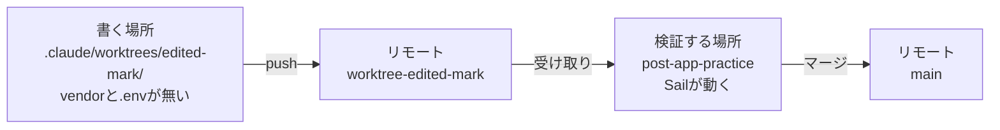

# 15-5-1: worktree - 書く場所を増やす

## 🎯 このセクションで学ぶこと

- worktreeが何かと、ブランチの切り替えやもう1回cloneするのと何が違うのかを説明できる。
- `claude -w` で書く場所をもう1つ作れるようになる。
- 書く場所と検証する場所の分担を理解し、どちらで何をするかを判断できるようになる。
- 書いたものを検証する場所へ受け取り、マージして片づけるまでの順序をたどれるようになる。

---

## 導入

いま1本の作業を通すあいだ、AIが実装している時間は、あなたは出てくるものを待っています。その待ち時間に2本目を進めたくても、同じフォルダでセッションをもう1つ開くと、両方が同じファイルを書き換えます。作業を分けるには、書く場所を分ける必要があります。

---

## 1つのフォルダでは、1本しか開けない

12-1-5で見たとおり、ブランチを切り替えるのは一瞬です。高くつくのは、その前後のほうです。

いまリプライ機能を直している途中で、別の修正を始めたいとします。切り替える前に、書きかけのファイルをコミットするか、いったん退避させます。切り替えたあと、そのブランチに合わせて環境を整え直します。用が済んだら戻して、退避させたものを取り出します。1回ずつは数分でも、行き来のたびに挟まります。

もっと困るのは、**2つを同時に開けない**ことです。片方でテストを回しながらもう片方を直す、直す前と直したあとを画面に並べて見比べる、といったことは、フォルダが1つだと成立しません。1つのフォルダで開けるブランチは、いつでも1本だけだからです。

---

## worktreeとは

worktreeは、同じリポジトリの作業フォルダを、もう1つ増やす仕組みです（14-1-7）。それぞれのフォルダが自分のファイルと自分のブランチを持ち、**履歴だけを元のフォルダと共有します**。

共有の実物は、フォルダの中を見ると分かります。

```text
post-app-practice/
├── .git/                       ← 履歴・ブランチ・リモート。実体はここに1つだけ
└── .claude/worktrees/
    └── edited-mark/
        ├── .git                ← フォルダではなく、上の .git を指す1行のテキスト
        ├── app/
        └── ...
```

増えるのは作業中のファイルだけで、履歴は増えません。片方でコミットすれば、もう片方の `git log` にすぐ出ます。

### もう1回 clone するのと、どこが違うのか

作業フォルダをもう1つ欲しいだけなら、`git clone` をもう一度打っても足ります。目的は果たせます。違うのは、そのあとに起きることです。

|  | もう1回 clone する | worktree |
|:--|:--|:--|
| 片方で切ったブランチ・コミット | もう片方からは見えない。push と fetch で運ぶ | 履歴が同じなので、その場で見える |
| `git fetch` | フォルダごとに打つ | 1回でどちらにも効く |
| ディスク | 履歴をまるごともう1つ持つ | 履歴は増えない。増えるのは作業ファイルだけ |
| 同じブランチを2か所で開く | できる | **できない**（下で扱います） |

この教材でやるのは、同じ流れの作業を並行させることです。書く場所でコミットしたものを、検証する場所ですぐ受け取ります。行き来する前提なら、履歴がつながっているworktreeのほうが速く済みます。

反対に、切り離しておきたいとき（危ない操作を試す、他人のリポジトリを丸ごと持ってくる）は、cloneのほうが向いています。片方が壊れても巻き込まれません。

> ⚠️ **注意**: worktreeが分けるのは**ファイルだけ**です。`.git` の中身は共有なので、隔離しているわけではありません。それを承知のうえで、Claude Codeは道具の側で塞いでいます。書く場所のセッションから元のフォルダのファイルを編集したり、元のフォルダでコマンドを動かしたりしようとすると、その操作が止まります。

---

## claude -w で作る

Claude Codeには、worktreeを作ってそこでセッションを開くところまでを一度にやるフラグがあります。

```bash
# 投稿アプリのフォルダで実行する
claude -w edited-mark
```

リポジトリのルートの下に `.claude/worktrees/edited-mark/` というフォルダができ、`worktree-edited-mark` という名前のブランチが作られ、そのフォルダでセッションが開きます（2026年8月時点）。`-w` は `--worktree` の短い形です。名前を省くと、Claude Codeが `bright-running-fox` のような名前を自分で作ります。名前はフォルダ名とブランチ名になるので、半角英字で付けてください。もう1つ増やしたいときは、別のターミナルで、違う名前を渡して同じコマンドを打ちます。

**書く場所が開いたところ**


新しい書く場所の元になるのは、**リモートの既定ブランチ**です。手元にあるだけでまだpushしていないコミットは、そこには入りません。

> ⚠️ **注意**: `-w` を使う前に、そのフォルダで一度 `claude` を起動して、信頼の確認を通しておく必要があります。通っていないと `-w` はエラーになります。投稿アプリのフォルダでは何度も起動しているので、そのまま使えます。

---

## 書く場所と検証する場所

worktreeは新しくチェックアウトしたフォルダなので、入っているのは**Gitで管理しているファイルだけ**です。このアプリで管理していないものは `.gitignore` に書いてあり、その中に `/vendor` と `.env` の2つがあります。

`.env` のほうは、運んでくる仕掛けが用意されています。リポジトリのいちばん上に `.worktreeinclude` というファイルを置いて、運びたいものを並べておくと、worktreeを作るときに自動でコピーされます（2026年8月時点）。書き方は `.gitignore` と同じで、コピーされるのは**そこに書いてあって、なおかつGitで管理していないもの**だけです。管理しているファイルが二重になることはありません。

```text
.env
```

残るのが `vendor/` です。これは200MBを超えるフォルダで、書く場所を作るたびにコピーするのは現実的ではありません。`vendor/bin/sail` が無いということは、書く場所では**アプリもテストも動かない**、ということです。

反対に、Chapter 2からChapter 4で置いてきた `CLAUDE.md`・`.claude/rules/`・`.claude/skills/`・`.claude/agents/`・`.claude/settings.json` は、どれも `main` へコミットしてきたので、そのまま付いてきます。仕組みを先にリポジトリへ入れておくと、あとから作った場所にも同じ決まりが効く、というのがここで効いています。

そこで、場所ごとに役割を分けます。

| 場所 | すること |
|:--|:--|
| 書く場所（worktree） | コードとテストを書く。コミットして、pushする |
| 検証する場所（元のフォルダ `~/laravel-practice/post-app-practice`） | ブランチを受け取り、テストを回し、`/review-diff` と `/uat` を当て、受け入れ条件で判定し、マージする |



Sailが動くのは元のフォルダの1つだけです。書く場所はいくつでも増やせますが、**並行になるのは書くほうだけで、検証は1か所で順番に回します**。

書く場所ではテストを実行できないので、実装を頼むときに1行添えます。

```text
テストは書くだけにして、実行はしないで。実行はこのあと別の場所でやります。
```

---

## フックのガード句

15-4-3で `.claude/settings.json` に入れたのは、この1行でした。

```text
./vendor/bin/sail artisan test >&2 || exit 2
```

この1行は、`.claude/settings.json` をコミットしたぶん、書く場所にも付いてきます。ところが書く場所には `vendor/bin/sail` がありません。このまま書く場所を開くと、編集のたびにこの行が失敗して、**全部の編集が止まります**。先頭に1句足して、sailの無い場所では何もしない形にします。

```text
test -x vendor/bin/sail || exit 0; ./vendor/bin/sail artisan test >&2 || exit 2
```

`test -x vendor/bin/sail` は、そのパスに実行できるファイルがあるかどうかを調べます。無ければ `exit 0` でフックはそこで終わり、編集は素通りします。`exit 0` のときに出したものは人にもAIにも届かないので、書く場所では表示も出ません。在れば、これまでどおりテストが走り、落ちれば `exit 2` で止まって、失敗の中身がAIに渡ります。

> ⚠️ **注意**: この行のパスを打ち間違えると、フックが動かなくなったという知らせだけが出て、ゲートは黙って効かなくなります。書き換えたあとは、必ず効きを確かめてください。

書き換えたら、`main` へコミットして、**originへpushします**。書く場所はリモートの既定ブランチから作られるので、pushしていないと、ガード句の無い古い1行が付いてきます。

---

## 片づけと受け取りの順序

同じブランチを、元のフォルダと書く場所の両方で同時に開くことはできません。書く場所が `worktree-edited-mark` を開いているあいだ、検証する場所で同じ名前のブランチに切り替えようとしても、gitが断ります。

そこで、受け取るときは別の名前を付けます。リモートに届いているブランチから、手元に受け取り用のブランチを作る形です。

```bash
# 投稿アプリのフォルダで実行する
git fetch origin
git switch -c receive-edited-mark origin/worktree-edited-mark
```

`git switch -c` は12-1-5で使った、新しいブランチを作って切り替えるコマンドです。うしろに `origin/worktree-edited-mark` と足すと、いまの `main` からではなく、リモートに届いているそのブランチと同じところから始まります。名前が違うだけで、中身は書く場所がpushしたものと同じです。

書く場所のセッションを `/exit` で閉じると、片づけるかどうかを聞かれます。次は、`kaku` という名前で1コミット積んだときの一例です（2026年8月時点。表示が違うときは `/help` と公式ドキュメントで確かめてください）。

```text
Exiting worktree session
You have 1 commit on worktree-kaku. The branch will be deleted if you remove the worktree.
❯ 1. Keep worktree    Stays at <パス>
  2. Remove worktree  All changes and commits will be lost.
```

あなたの画面には、自分が付けた名前と、自分が積んだコミットの数が出ます。選ぶのは 1 の Keep です。2 を選ぶと、書く場所のフォルダと手元のブランチが消えます。pushしてあっても「All changes and commits will be lost」と出ますが、消えるのは手元の写しだけで、リモートの `origin/worktree-edited-mark` は残ります。それでも Keep を選ぶのは、判定に落ちたときに直す場所がここだからです。Removeしたあとに同じ名前でもう一度 `claude -w` すると、`main` から作り直しになり、前にpushした作業は入っていません。

書く場所を消すのは、プルリクエストがマージされて用が済んでからです。片づけるときは、フォルダを消してから、ブランチを消します。worktreeが開いているブランチは、開いたままでは消せないからです。ブランチを消すのに使う `git branch -d`（12-3-5）はマージ済みのブランチだけを消すので、まだマージされていないものを間違えて消す心配はありません。打つコマンドは、このあとの Step 7 にまとめてあります。

---

## 並行と使用枠

書く場所を増やすと、動かしたぶんだけ使用枠は早く減ります。残りは `/usage` で見られます（14-1-6）。大きな依頼を並べる前に一度見ておくと、途中で止まる場面を減らせます。

---

## 🏃 「編集済み」の目印を、書く場所で作る

作るのは小さな1件です。タイムラインで、一度でも編集されたポストに「編集済み」と出します。テーブルは増えません。

**受け入れ条件**

- [ ] 一度も編集していないポストには「編集済み」が出ない
- [ ] 自分のポストを編集して保存すると、タイムラインのそのポストに「編集済み」が出る

**変えないもの**

タイムラインの一覧・編集・削除、リプライ機能、ポスト作成、編集画面の文字数制限は、いまの動きのままです。`database/migrations` にファイルは増えません。

差分は1文で言えるので、計画は持ちません（14-3-1）。イシューも立てません。締めはプルリクエストを出してマージするところまでです（14-4-5）。

思いどおりに直らない・壊れたと感じたら14-5-1（直らないときの型）へ。まだコミットしていない変更は `git restore .`（4-3-5）で戻せます。

### Step 1: 検証する場所を整える

```bash
# 投稿アプリのフォルダで実行する
git switch main
git pull origin main
./vendor/bin/sail up -d
```

### Step 2: ガード句を足して、pushする

このフォルダで `claude` を起動して、2か所を直させます。

```text
.claude/settings.json のフックのコマンドを、この1行に書き換えて。

test -x vendor/bin/sail || exit 0; ./vendor/bin/sail artisan test >&2 || exit 2

あわせて2つ。.gitignore に .claude/worktrees/ を1行足して。
リポジトリのいちばん上に .worktreeinclude を作って、中身は .env の1行だけにして。
3つともコミットして、main に push して。
```

`.claude/settings.json` を直させるときは、自分の設定を書き換えてよいかを確かめる専用の画面が出ます。出たら許可してください。

`.claude/worktrees/` を無視するのは、公式が勧めている書き方です。足しておかないと、これから作る書く場所の中身が、元のフォルダ側で未追跡ファイルとして並び、`git status` が読めなくなります。

`.worktreeinclude` のほうは無視しません。コミットして共有するファイルです。ここに書いた `.env` が、このあと作る書く場所へコピーされます。

ファイルを直すとフックが動いて、そのたびにテストが流れます。返事が来るまで少し間が空きますが、止まったわけではありません。

### Step 3: 書く場所を作って、中を見る

いまのターミナルを閉じずに、**別のターミナル（またはタブ）** を開いて、投稿アプリのフォルダで打ちます。

```bash
# 投稿アプリのフォルダで実行する
claude -w edited-mark
```

起動したら、いる場所を確かめます。

```text
いまいるフォルダはどこですか。vendor と .env はありますか。
CLAUDE.md と .claude/rules/ と .claude/skills/ はありますか。
```

`.claude/worktrees/edited-mark/` にいて、`vendor` は無く、`.env` はあり、決まりとSkillもある、という答えが返れば、分担のとおりです。`.env` が来ているのは `.worktreeinclude` が効いたからで、それでも `vendor` が無いのでテストは動きません。

### Step 4: 「編集済み」を作らせて、pushする

```text
タイムラインで、一度でも編集されたポストに「編集済み」と出したい。

- 完成の条件（ブラウザの操作で確かめる）:
  - 一度も編集していないポストには「編集済み」が出ない
  - 自分のポストを編集して保存すると、タイムラインのそのポストに「編集済み」が出る
- タイムラインの今の動き（一覧・編集・削除）とリプライは変えない
- 列は足さない。database/migrations にファイルを増やさない

テストは書くだけにして、実行はしないで。実行はこのあと別の場所でやります。
できたらコミットして、このブランチを push して。
```

判定に使う日時をどこから取るかは書いていません。`posts` テーブルが元から持っている値で足りるので、そこはAIに任せます。

### Step 5: 書く場所を閉じる

`/exit` で閉じて、**1 の Keep** を選びます。フォルダはそのまま残ります。

### Step 6: 検証する場所で受け取って、確かめる

最初のターミナルへ戻ります。

```bash
# 投稿アプリのフォルダで実行する
git fetch origin
git switch -c receive-edited-mark origin/worktree-edited-mark
./vendor/bin/sail artisan test
```

テストが通ったら、ブラウザで受け入れ条件の2行を潰します（14-4-3）。2行目は、**本文を実際に書き換えてから**保存してください。何も変えずに更新を押すと、保存した記録が動かないことがあります。

**「編集済み」が出たタイムライン**


落ちた行があれば、直すのは書く場所です。Keepしてある書く場所を `claude -w edited-mark` で開き直し、直させて、もう一度pushします。検証する場所へ戻ったら、受け取り用のブランチのまま `git pull origin worktree-edited-mark` で続きを取り込みます。

### Step 7: プルリクエストを出して、マージして、片づける

プルリクエストを作るのは検証する場所です。テストの結果を持っているのがこちらだからです。送り出すブランチは、書く場所がpushした `worktree-edited-mark` を名指しします。

```text
worktree-edited-mark から main へのプルリクエストを出して。
本文には、テストの結果と、受け入れ条件2行の判定を入れて。
```

本文を読んでからマージしたら、片づけます。

```bash
# 投稿アプリのフォルダで実行する
git switch main
git pull origin main
git worktree remove .claude/worktrees/edited-mark
git branch -d worktree-edited-mark receive-edited-mark
```

### ✅ 完成チェックリスト

- [ ] `.claude/settings.json` のフックがガード句つきの1行になっていて、`main` にpushされている
- [ ] `.gitignore` に `.claude/worktrees/` が入っている
- [ ] `.worktreeinclude` に `.env` が入っていて、書く場所に `.env` がコピーされている
- [ ] 書く場所では、フックの表示が一度も出なかった
- [ ] `./vendor/bin/sail artisan test` を検証する場所で実行して、`failed` が0になっている
- [ ] 受け入れ条件の2行を、ブラウザで確かめた
- [ ] `database/migrations` にファイルが増えていない
- [ ] プルリクエストがマージされ、`.claude/worktrees/` の中が空になっている

---

## ✨ まとめ

- `claude -w <名前>` で、`.claude/worktrees/<名前>/` に書く場所を作り、`worktree-<名前>` のブランチでそこからセッションが開く。名前は半角英字で付ける。
- worktreeは、履歴を共有したまま作業フォルダだけを増やす仕組み。コミットもブランチもその場で行き来するので、並行させた作業を受け渡すのに向く。
- 書く場所にはGitで管理しているファイルだけが入る。`.env` は `.worktreeinclude` で運べるが、`vendor/` は大きすぎるので運ばない。そこではテストが動かないので、実装の依頼に「テストは書くだけ」の1行を足す。
- コミットしてきた `CLAUDE.md`・ルール・Skill・設定は、書く場所にも付いてくる。決まりを直したら、書く場所を作る前に `main` へpushする。
- 判定はSailが動く場所でしかできないので、書く場所は増やせても、検証は1か所で順番に回す。
- 書く場所は `/exit` で Keep して残す。受け取りは `git switch -c receive-<名前> origin/worktree-<名前>`。落ちたら直すのは書く場所で、片づけるのはマージが済んでから。

---
