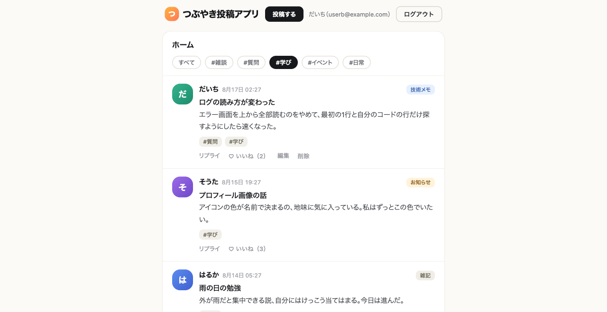

# 15-5-3: バックログを消化する - 総合演習

## 📌 この演習について

このアプリに残っている機能を、まとめて片づけます。あとでやると決めた作業を積んでおく一覧を、バックログと呼びます。ここで消化するのは、その残りの3件です。

新しい道具はほとんど増えません。増やすのは1つだけで、それも量産を始める直前に作ります。同じ形のイシューを続けて何件も立てることになるので、その手順が仕組みに移す条件を満たすからです。

進め方は並べません。渡すのは前提だけです（14-5-3）。

---

## 🎯 演習課題

### 📋 課題

**1件目: ハッシュタグ**

> いまのタイムラインは、新しい順に全部のポストが並ぶだけです。ポストが増えると、読みたいものを探せません。ポストにハッシュタグを付けられるようにして、タイムラインをタグで絞り込めるようにします。

ここだけは決まっています。それ以外の作り方は指定しません。

| 決めごと | 中身 |
|:--|:--|
| 選べるタグ | あらかじめ用意されたものから選びます。タグを新しく作る画面は作りません |
| タグの用意のしかた | シーダーで5件程度入れておきます |
| タグの名前 | 自分とAIで決めて構いません。ただし、トピック（お知らせ・技術メモ・雑記）とは別のものだと分かる名前にします |
| 付け替えてよい人 | そのポストを書いた本人だけです |

**受け入れ条件**

- [ ] ポストの作成画面と編集画面で、あらかじめ用意されたタグから選んで保存できる
- [ ] タイムラインのポストそれぞれに、そのポストに付いているタグが出る（1つも付いていないポストには何も出ない）
- [ ] タイムラインでタグを1つ選ぶと、そのタグが付いたポストだけが並ぶ
- [ ] 他人のポストの編集画面をURLで直接開くと403になり、他人のポストのタグは変えられない

3行目まで通ると、次のような画面になります。タグの名前も、タグをどう並べるかも自由です。同じ見た目にする必要はありません。

**タグで絞り込んだタイムライン**



**2件目・3件目: 自分で選ぶ**

下書き・ブックマーク・検索から2件を選びます。実現したいことと受け入れ条件は、自分で書き切らなくて構いません。14-2-2でやったように、やりたいことの1文を渡して、決めていないところをAIに質問させ、答えながら条件の形にまとめさせます。

```text
下書き機能が欲しい。@docs/ と app/ を読んだうえで、
このアプリで作るなら決めておかないといけないことを質問して。
決まったら、受け入れ条件を「〜すると、〜になる」の形にまとめて。
```

決めるのはあなたです。出てきた条件を読んで、要らないものを消し、足りないものを足してから、イシューへ入れます。上の1件目の4行が、そろっていてほしい粒度の見本です（13-2-2）。

**変えないもの（3件とも共通）**

タイムラインの一覧・編集・削除、リプライ、ポスト作成、編集画面の文字数制限、「編集済み」の目印、いいねは、いまの動きのままです。

### ✏️ 進め方タスク

作業を始める場所は、検証する場所です。

```bash
# 投稿アプリのフォルダで実行する
git switch main
git pull origin main
./vendor/bin/sail up -d
claude
```

思いどおりに直らない・壊れたと感じたら14-5-1（直らないときの型）へ。まだコミットしていない変更は `git restore .`（4-3-5）で戻せます。

**前半: イシューを立てる手順を仕組みに移す**

1. 【自分⇄AI】ハッシュタグのイシューを1件、対話で起票する。要望を渡し、決めていないところを聞き返させ、受け入れ条件を固めてから立てさせる（14-3-3）
2. 【自分】3つの問いを通す（15-3-1）。これから3件続けて同じことをするか。同梱のSkillにこれと同じものが無いか。受け入れ条件の書き方と日本語で出すことは、このプロジェクトで決めたことか
3. 【AI】`いまこの会話でやった手順をSkillにして` と送って、`/issue` を作らせる
4. 【自分】生成された `SKILL.md` を全文読む。とくに、渡した引数を何として扱うかが本文に書いてあるかを見る
5. 【AI】`.claude/skills/issue/SKILL.md` を `main` へコミットして、originへpushする
6. 【AI】残り2件を `/issue` で起票する

**後半: 3件を回す**

7. 【自分】件ごとに、計画の持ち方を選ぶ。なし・planモード・設計書のどれかです（14-3-1）。選んだ理由を1行残す
8. 【自分】並行させる2本を選ぶ。触る場所が重なる2本は並べない
9. 【AI】件ごとに `claude -w <名前>` で書く場所を作り、実装させてpushする。書く場所ではテストを実行させない（15-5-1）
10. 【自分⇄AI】検証する場所で1件ずつ受け取る。テーブルが増えた件は `migrate` を打ってから、テスト・`/code-review`・`/review-diff`・`/uat`・受け入れ条件の順に当てる。落ちた行は書く場所へ差し戻して直させる（15-5-2）
11. 【自分⇄AI】プルリクエストを出し、本文を読んでマージし、書く場所を片づける。マージでぶつかったらAIに解消させ、出てきた差分は自分が読む。次の書く場所を作る前に、検証する場所で `git switch main` と `git pull origin main` を済ませる
12. 【自分】効き目を数えて、棚卸しのイシューに書き足し、そのイシューを閉じる（下の 🏃）

手を止めるのは、2・4・7・8・10・12です。ほかは渡して構いません。

11の `git pull` を先に済ませるのは、次の書く場所がリモートの `main` から作られるためです（15-5-1）。取り込まずに次を作ると、いま入れたばかりの機能が入っていない場所から始まります。

イシューの番号は、画面に出ているものに読み替えてください。

### ✅ 完成チェックリスト

- [ ] `.claude/skills/issue/SKILL.md` が `main` に入っている
- [ ] 3件それぞれで、`./vendor/bin/sail artisan test` の `failed` が0になっている
- [ ] 3件それぞれの受け入れ条件が、全行そろっている
- [ ] タイムラインの一覧・編集・削除、リプライ、ポスト作成、文字数制限、「編集済み」の目印、いいねが、前と同じに動く
- [ ] 計画の持ち方を選んだ理由が、件ごとにイシューか設計書かプルリクエストの本文に1行残っている
- [ ] すべてのプルリクエストがマージされ、イシューが `Closed` になっている
- [ ] `.claude/worktrees/` の中が空になっている
- [ ] 棚卸しのイシューに効き目のコメントが付き、5項目のチェックが全部埋まって `Closed` になっている

---

## 💡 ヒント

**Skillを作ったあと、開き直す必要はあるか**

要りません。`.claude/skills/` はセッションを始めた時点でもうあるので、新しく作ったSkillは数秒後に補完に出て、そのまま呼べます。開き直しが要ったのは、`.claude/skills/` そのものが無かった1本目（15-3-2）だけです。

**`/issue` に渡すもの**

引数は、SKILL.mdの本文が何と書いてあるかで扱いが変わります。本文に `$ARGUMENTS` が出てこないと、渡した文字列は末尾に付くだけで、AIがそれを何として読めばよいか迷って聞き返してきます。読んだときに `$ARGUMENTS` が見当たらなければ、「`$ARGUMENTS` は起票したい機能の要望です」と本文に書き足させてください。

**テーブルを作る順**

ハッシュタグでは、タグそのものを入れるテーブルと、ポストとタグをつなぐテーブルの2つが増えます。つなぐほうは、両方ができてからでないと作れません。9-5-5「リレーション - ハンズオン演習」でも、同じ理由で作る順が決まっていました。つなぐテーブルの名前の付け方（2つのテーブル名を単数形にして、アルファベット順につなぐ）は9-5-2のとおりです。

**もとのデータを消さない**

タグのデータは `database/seeders/DatabaseSeeder.php` に直接書かせず、シーダーのクラスを1つ作らせて、そこへ入れさせてください。流すときも、そのクラスだけを名指しします。

```bash
# 投稿アプリのフォルダで実行する
./vendor/bin/sail artisan db:seed --class=TagSeeder
```

クラス名は、自分が作ったものに読み替えます。`./vendor/bin/sail artisan db:seed` とだけ打つと `DatabaseSeeder` が丸ごと動きます（9-3-5）。すると、トピック（お知らせ・技術メモ・雑記）が二重に入ったところで、同じメールアドレスのユーザーをもう一度作ろうとしてエラーになり、途中で止まります。トピックだけが増えた中途半端な状態が残ります。

**ER図の範囲を切る**

設計書を選んだ件でER図を描かせるときは、出す範囲を自分で指定します。指定しないと、アプリ全体の図が返ってきて、今回どこが増えたのかを読み取れません。

```text
ER図はMermaidの erDiagram で、posts と、今回足す2つのテーブルだけを描いてください。
いまあるほかのテーブルは、今回の図に出さないでください。
```

**設計書を書かせているあいだ、返事が遅い**

検証する場所でMarkdownを書かせると、1ファイル保存するたびにフックが動いてテストが流れます。止まったように見えても、待ってください。

**使用枠が減ってきた**

`/usage` で残りを見てください（14-1-6）。ぶつかりそうなら、並行を畳んで1件ずつ直列で進めて構いません。回し方を変えるだけで、渡すものも判定の仕方も変わりません。

**AIから質問が返ってきたとき**

まだ決めていないことです。その場で全部を自分で言い切れなくても構いません。選択肢を出させて、比べる軸を渡して選びます（14-5-3）。決まったら、イシューか設計書に書き足してから、続きを頼みます。

---

## 🏃 効き目を数える

3件のマージまで終わったら、14-5-4で立てた棚卸しのイシューを開きます。あそこに並んでいるのは、毎回手でやっていたことでした。それぞれがどこへ移って、今回どう効いたのかを数えます。

| 数えるもの | どこを見るか |
|:--|:--|
| 書かずに済んだ前提 | `CLAUDE.md` とルールに書いた行と、今回自分が打った依頼文 |
| 押さずに済んだ承認 | テストの実行やコミットで、確認が出なかったところ（15-4-1の許可の指定） |
| 機械が先に知らせたテストの失敗 | 自分でテストを打つ前に知らされた回数（15-4-3のフック） |
| 守られなかった決まり | `CLAUDE.md` とルールの行ごとに、出てきたコードと見比べる |

書き出す先は、そのイシューのコメントです。5項目それぞれについて、移した先と、今回どう効いたのかを1行ずつ書きます。

効かなかったものが、次に直す場所です。うまくいかなかった場面が出てきたときに、毎回の依頼へ言葉を足しても、次の機能でまた同じことを言うことになります。直すのは、書いてあるほうです。`CLAUDE.md` かルールを直した場合は、その1行もここに一緒に書きます。

数え終えたら、イシューを閉じます。5つとも仕組みに移り終えたので、この作業はここで終わりです。

```text
このイシューに効き目のコメントを付けて、チェックリストを全部チェックしてから閉じて。
```

`CLAUDE.md` かルールを直していた場合は、機能のマージがもう済んでいるので `main` に直接記録します。

```text
CLAUDE.md をコミットして、main に push してください。
```

---

## 🚀 まとめ

- 同じ形の作業を何件も続ける直前が、それを仕組みに移す引き金です。イシューを1件だけ立てるなら、Skillは要りませんでした。3件続くと分かった時点で、作る価値が出ます。
- 計画の持ち方は、件ごとに選び直します。3件を同じやり方で通す理由はありません。
- 並行させるのは書くところだけです。判定は1か所で1件ずつ通します。触る場所が重なる2本は並べません。
- 使用枠にぶつかったら、並行を畳んで直列に戻して構いません。速さは進め方の都合で、受け取りの基準は変わりません。
- 効かなかった決まりは、数えてみて初めて見つかります。見つかったら、直す先は依頼文ではなく、書いてあるほうです。

---
