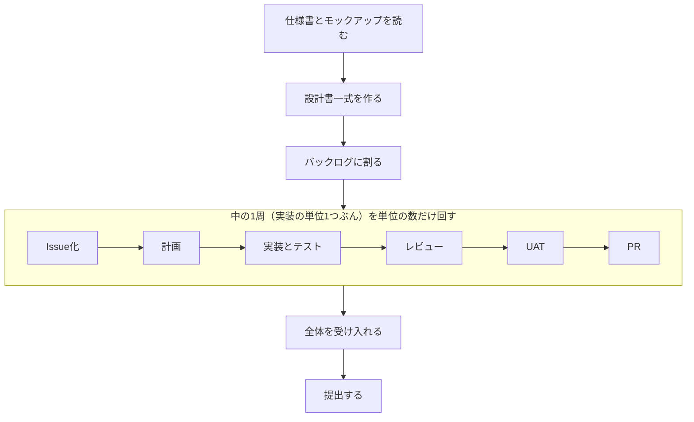

# 16-1-1: 総仕上げの全体像

> 💡 **TIP**: 教材一覧の「tutorial-13(旧): 総仕上げ！学んだ技術をフル活用してアプリケーションを作ってみよう🔥」は以前の総仕上げ課題です。このTutorial 16とは別の教材なので、両方に取り組む必要はありません。

## 🎯 このセクションで学ぶこと

- Tutorial 16で何が与えられ、何を自分が作るのかを言えるようになる。
- 設計から提出までの流れを、アプリ1本ぶんの1周と、機能1つぶんの1周の入れ子として読めるようになる。
- 出発点のリポジトリから自分のリポジトリを作り、中に何が入っているかを確かめられるようになる。

---

## 導入

Tutorial 15の最後に、置いた道具は次に自分が触るプロジェクトでも同じ手順で作れる、と書きました。ここからは、その道具と回し方を持ち寄って、アプリを1本、最初から最後まで作り切ります。作るのは、社内の連絡に使うチームチャットアプリです。Slackを思い浮かべてください。話題ごとに「チャンネル」という部屋を作り、その中で会話して、返信はスレッドにまとめ、あとから検索する。あの形のものを、小さく1本作ります。渡されるのは仕様書と画面の見本だけで、設計も、足場も、実装の采配も自分の側にあります。

---

## 総仕上げで確かめる5つ

Tutorial 14とTutorial 15で身につけたものを、ここで一度に使います。このTutorialのゴールは、次の2行です。

```text
与えられた仕様を、AIと対話しながら設計に落とし、AIを率いて実装・検証・PRまで一人で回し切れる。
繰り返しは仕組みに落とし、複数の作業を並行で回せる。
```

できているかどうかは、次の5つの行動で見ます。

| # | 行動 | 身につけたところ |
|:--|:--|:--|
| 1 | 作るものをイシューにして、受け入れ条件を書ける | 14-1-1・14-2-2 |
| 2 | 計画の持ち方を選び、その理由を言える | 14-3-1 |
| 3 | 検証をAIに渡し、受け入れを自分で判定できる | 14-4-1〜14-4-4 |
| 4 | コンテキストを自分で区切って渡せる | 14-2-3・14-5-2 |
| 5 | 繰り返しを仕組みにして、複数の作業を並行で回せる | 15-3-1・15-5-1〜15-5-3 |

一つひとつは、すでに手を動かしたものです。今回違うのは、複数の機能が1つのデータと権限を共有する1本のアプリで、この5つを全部自分の采配で回すところです。最後の節（16-4-3）で、できあがった自分の実物を指しながら、この5行を見直します。

---

## 与えられるものと、作るもの

出発点になるリポジトリが1本用意してあります。中身は次の3つです。

| 与えられるもの | 中身 |
|:--|:--|
| 仕様書（`docs/spec.md`） | クライアントの要求を文章にしたもの。設計ではありません |
| モックアップ（`mockup/`） | 画面の完成見本。静的なHTMLが10枚入っています |
| 環境の足場 | 素のLaravelと、Dockerで動かすためのSailの設定 |

**機能のコードは1行も入っていません。** ログイン画面もチャンネルの一覧も、テーブルの1つもありません。素のLaravelが起動するところまでが用意されていて、その先はゼロからAIと立ち上げます。

仕様書とデザインは、自分で決めるものではなく、**受け取るもの**です。現場では、仕様書はクライアントや社内の依頼元から、デザインはデザイナーから届きます。届き方は案件ごとに違って、文書が添付で送られてくることも、Figma（画面デザインを作るツール）のURLを共有されることもあります。今回はその2つをリポジトリの中に最初から入れてあり、モックアップも静的なHTMLにしてあります。1か所にまとまっているのも、HTMLで渡しているのも今回の形です。受け取ったあとにやることは変わりません。読んで、足りないところを聞いて、設計に落とします。

自分が作るものは、章ごとに1つずつ積み上がります。

| 作るもの | どこで |
|:--|:--|
| 設計書一式 | Chapter 1 |
| 開発の足場（`CLAUDE.md`・許可の指定・ルール・フック・Skill） | Chapter 2 |
| 機能ごとのプルリクエスト | Chapter 3 |
| 受け入れの記録 | Chapter 4 |

このうち、いちばん長く使うのが設計書一式です。実装中に決めが変わったら書き直し、最後まで実物と一致させたまま提出します。

---

## 外の1周と、中の1周

Tutorial 14とTutorial 15で回してきたのは、機能1つぶんの1周でした。イシューを立て、計画し、実装とテストをして、レビューとUATを通してPRを出す。今回作るのはアプリ1本で、機能は1つではありません。同じ6段を、機能を束ねた実装の単位の数だけ繰り返します。そして、その繰り返しの前後に、機能1つでは要らなかった段が付きます。前に付くのは、仕様書を読んで設計に落とし、作業の単位に割るところ。後ろに付くのは、作った機能を全部そろえてから、機能をまたいで確かめて提出するところです。



外側の大きい1周が、アプリ1本ぶん。内側の小さい1周が、機能1つぶんです。以下では、この2つを**外の1周**・**中の1周**と呼びます。13-1-1で見た4つの工程（リサーチ・企画 → 要件定義・設計 → 実装 → テスト・検証）でいうと、外の1周は2番から4番までを、アプリ1本の大きさで通したものにあたります。

中の6段は、14-1-1で見たものと同じで、変わりません。UAT（User Acceptance Test、受け入れテスト）の駅で、使う人の側の操作で頼んだとおりに動くかを確かめるところも同じです。中の1周を何周することになるかは、仕様書に並んだ機能を実装の単位にどう束ねるかで決まります（16-1-6）。

章はこの図の順に進みます。Chapter 1が図の左上の2つ、Chapter 2が足場を組んでバックログに割るところ、Chapter 3が中の1周の繰り返し、Chapter 4が右下の2つです。この外の1周の形は、仕様書とデザインを受け取って納品する、この先の課題でもそのまま繰り返します。

---

## このTutorialの進め方

コードはAIに書かせるのが標準です。自分の手で書く場面を作っても構いません。どちらで作っても、受け取るときの物差しは同じで、受け入れ条件とテストと差分で判定します。

### セッションの構え

Tutorial 14とTutorial 15は、モデルを `sonnet`、エフォートを `high` に固定したまま進めました（14-1-6）。ここからは、作業の種類で構えを変えます。判断が重いところは上げ、手順が決まっているところは戻す。上げっぱなしにしないのは、枠が有限だからです。仕様書の機能をアプリ1本ぶん作り切るので、消費はこれまでより大きくなります。

| 場面 | やること |
|:--|:--|
| 節に入る前 | `/usage` で枠の残りを見る（14-1-6） |
| 起動したら | `/rename` でセッションに名前を付ける（14-5-2）。あとで `/resume` から選ぶとき、名前が唯一の手がかりになります |
| 設計や全体の受け入れのように、判断が重いとき | `/model` で選択画面を開き、`opus` を `s` キーで選ぶ（14-1-6）。選択画面に `opus` が無ければ `sonnet` のままで構いません |
| 決めが1つに絞れない山場 | `/effort xhigh` に上げる。済んだら `/effort high` に戻す |
| 1つの節を書き終えたら | そこが作業の切れ目です。`/context` を1回見てから、次の節は新しいセッションで始めます（14-5-2）。決めたことは設計書に書いてあるので、切っても言い直しは要りません |

戻し方が2つで違います。`s` で選んだモデルはそのセッション限りなので、開き直せば元に戻ります。`/model opus` と直に打つと、次に起動したときの既定まで書き換わります（14-1-6）。エフォートは `low` から `xhigh` までがセッションをまたいで残るので、**上げたら自分で戻します**。

---

## 🏃 自分のリポジトリを作って、中を歩く

出発点のリポジトリは、GitHubのテンプレートリポジトリです。投稿アプリを用意したとき（13-1-3・14-1-2）と同じ経路で、自分のものを1本作ります。

### Step 1: 自分のリポジトリを作る

`https://github.com/coachtech-material/laravel-teamchat-starter` を開き、「Use this template」から「Create a new repository」を選びます。リポジトリ名は `teamchat-app` にしてください。

**テンプレートから自分のリポジトリを作る**


### Step 2: 手元に持ってくる

作ったリポジトリを、これまでと同じ `~/laravel-practice` の下にcloneします。

```bash
cd ~/laravel-practice
git clone <自分のリポジトリのURL> teamchat-app
cd teamchat-app
```

### Step 3: 中を歩く

先にモックアップを見ます。開くのは `mockup/index.html` の1枚だけで、サーバーの起動は要りません。cloneしたフォルダの中で、次のコマンドを使います。

```bash
# Mac: 既定のブラウザで開く
open mockup/index.html

# Windows（WSL）: エクスプローラーでこのフォルダを開き、mockup/index.html をダブルクリックする
explorer.exe .
```

Windowsの方の `teamchat-app` はWSLの中にあるので、Windowsのエクスプローラーから開きます。`explorer.exe .` を実行すると、いま居るフォルダがエクスプローラーで開くので、`mockup` に入って `index.html` をダブルクリックしてください。いつものブラウザで表示されます。どちらもうまくいかないときは、ブラウザを先に起動して、`index.html` のファイルをブラウザのウィンドウにドラッグしても開きます。

開くと、画面のカタログが出ます。カタログを含めてHTMLは10枚あり、そこから残りの9枚すべてに移れるので、どんなアプリを作るのかを目で見てください。

**モックアップの画面カタログ**


`mockup/` には、画面のHTMLのほかに説明のファイルが2枚入っています。`mockup/README.md` は見本の読み方（どのファイルがどの画面か、ボタンは押しても動かないこと）、`mockup/design-guide.md` は色・字・余白・状態の決まりを書いたデザイン指定書です。この2枚も設計の根拠になるので、ここで目を通しておいてください。

見終えたら、`docs/spec.md`（仕様書）を通しで読みます。読み込みはこのあとの16-1-2でAIと一緒にやるので、ここでは全体を眺めるだけで構いません。

次に `README.md` を開きます。初回起動の手順と、止め方が書いてあります。起動するのはChapter 2なので、ここでも読むだけです。

```text
teamchat-app/
├── docs/
│   ├── spec.md          仕様書（変えない。疑問は確認事項へ）
│   └── design/
│       └── README.md    設計書の置き場の決まり
├── mockup/
│   ├── index.html       ここから残りの9枚を見る
│   ├── README.md        見本の読み方
│   └── design-guide.md  デザイン指定書（色・字・余白・状態の決まり）
└── （素のLaravel一式）
```

最後に `docs/design/README.md` を開いて、通しで読んでください。`docs/design/` に入っているのはこの1枚だけで、設計書はまだ1つもありません。置くファイルの一覧、それぞれに何を書くか、どこまで書くかが、この1枚にまとまっています。Chapter 1で作る設計書は、この決まりのとおりに置いていきます。これから何度も「READMEのとおりに」と書きますが、そのたびに指しているのはこの1枚です。

Claude Codeはまだ起動しません。起動するのは、設計を始める16-1-2の冒頭です。

- [ ] 自分のGitHubアカウントに `teamchat-app` ができている
- [ ] `~/laravel-practice/teamchat-app` にcloneできている
- [ ] `mockup/index.html` から9枚の画面を見た
- [ ] `mockup/README.md` と `mockup/design-guide.md` に目を通した
- [ ] `docs/spec.md` を通しで読んだ
- [ ] `docs/design/README.md` に目を通して、置くファイルと書く量の決まりを確かめた

---

## ✨ まとめ

- 与えられるのは仕様書・モックアップ・環境の足場の3つで、機能のコードは1行も入っていない。設計書一式・足場・プルリクエスト・受け入れの記録は自分で作る。
- 総仕上げで確かめるのは5つの行動。イシューと受け入れ条件、計画の選択、検証と受け取り、コンテキストの区切り、仕組み化と並行。
- 進み方は、アプリ1本ぶんの外の1周が、14-1-1の6段の1周（中の1周）を実装の単位の数だけ包む形。中の6段は変わらない。
- 設計書一式は提出物の中心で、最後まで実物と一致させ続ける。
- アプリ1本ぶんを作り切るので使用枠の消費は大きい。節に入る前に `/usage` を見て、起動したら `/rename` で名前を付ける。
- 構えは作業の種類で変える。判断が重いところは `opus` と `xhigh` に上げ、済んだら戻す。1つの節を書き終えたら区切って、次は新しいセッションで始める。

---
