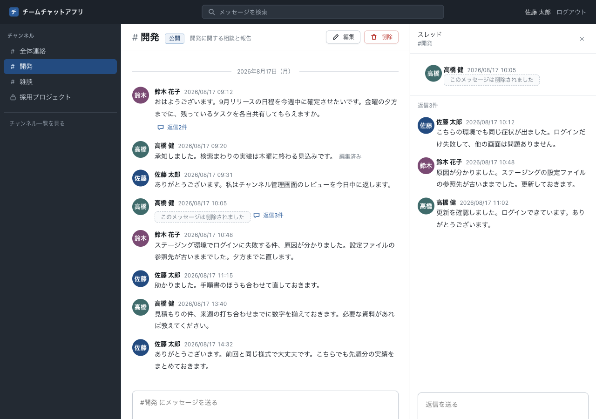

# 16-1-4: データを設計する

## 🎯 このセクションで学ぶこと

- ER図・テーブル定義書・CRUD表をAIと起こし、既習の物差しで検証できるようになる。
- 消したメッセージをどう持つかを、案を並べさせたうえで自分で決められるようになる。
- 決めたことと、その決めが背負うリスクを、設計書に書き残せるようになる。

---

## 導入

データの持ち方は、あとから変えるのがいちばん高くつきます。画面は書き直せば済みますが、テーブルは中に入ったデータごと動かすことになります。今回は判断の分かれ目が1つあり、そこを飛ばすと、実装の途中で作り直しになります。

---

## この節の山場

仕様書の3-4に、こう書かれています。

> 消したメッセージは、その場所に「このメッセージは削除されました」と残るようにしてください。跡形もなく消えてしまうと、その前後のやり取りが何の話だったのか分からなくなってしまうためです

書かれているのは画面の見え方だけです。データとしてどう持つかは決まっていません。

もう1つ、消したメッセージには使われ方があります。モックアップのスレッド画面では、削除された元メッセージに返信がぶら下がったままになっていて、デザイン指定書も返信件数の表示を消さないと決めています。クライアントも、削除されたメッセージに返信を続けられなくなるほうが困る、と答えています。

**削除されたメッセージが返信の器として残っているスレッド**



行ごと消してしまうと、この返信のぶら下がる先が無くなります。器は残す、というところまでは決まります。**残したうえで本文をどう持つか**が、16-1-2で保留にした1本です。

ここが、決めるのは人・並べるのはAI、を実際にやる場面です。「`deleted_at` を持って」と書いて渡せば1往復で終わりますが、それだと自分が何を選んだのかが残りません。案を並べさせて、比べて、選びます。

「最良案を出して」で足りる場面のほうが、実際には多くあります。分かれ目は、**あとから変えられるか**です。画面の見せ方なら1案で足りますが、テーブルの持ち方は、変えるときに中のデータごと動かすことになります。戻すのが高くつく決めだけ、案を並べさせてから選びます。

---

## 🏃 データまわりを起こす

思いどおりに直らない・壊れたと感じたら、14-5-1（直らないときの型）へ。応急は `git restore .` です。

### Step 1: 持ち方の候補を並べさせる

この節には、Chapter 1でいちばん決めにくい1つがあります。ここだけ、エフォートを一段上げて臨みます（16-1-1）。

```text
/effort xhigh
```

書かせる前に、比較だけを先に出させます。

```text
次はデータの設計。docs/design/ の機能一覧・確認事項・画面まわりを先に読んで。

先に1つ相談したい。仕様書 3-4 の「このメッセージは削除されました」を、データとしてどう持つか。
案を並べて、良し悪しを比べて。返信が付いたメッセージを消したときと、検索や公開APIから漏らさない手当ての重さは、必ず比較に入れて。
決めるのはこちらでやるので、まだ書かないで。
```

> 💡 **進行例について**: AIとの開発は毎回違う流れになります。ここに示すのは一つの進行例です。あなたの画面と違っていても、チェックリストを満たしていれば正解です。

返ってきたのは4つの案です。

| 持ち方 | 返信が付いたメッセージを消したとき | 検索・公開APIの手当て | 弱点 |
|:--|:--|:--|:--|
| 行を残し、消した日時を持つ。本文も残す | 行が残るので、スレッドも返信件数もそのまま | 出口を3つ塞ぐ | 塞ぎ忘れると本文が見えてしまう |
| 行を残し、本文だけを消す | 同上 | 塞ぎ忘れても漏れない | あとで戻せない |
| 行を残し、本文を別のテーブルへ退避する | 同上 | 塞ぎ忘れても漏れない | チャンネルごと消すときに退避先も消す必要があり、出口が4つに増える |
| 行ごと消して、痕跡だけ別のテーブルに残す | 返信のぶら下がる先が無くなる | 漏れない | 痕跡側に投稿者・日時・並びの位置を持ち直すことになり、結局「行を残す」のと同じになる |

こちらが挙げた2つのほかに、塞ぎ忘れると何が起きるか・塞ぐ場所の数・戻せるか・作りの重さ、といった観点も自分で立ててきました。

このとき、こちらが持っていなかった論点が2つ出ました。

- **論理削除の既定に任せない**。9-4-7で使った `SoftDeletes` は、削除済みの行を既定で除外します。任せると、チャンネルの一覧から削除済みの行が丸ごと消えて「このメッセージは削除されました」が出なくなり、返信件数からも削除済みが抜けます
- **本文に「このメッセージは削除されました」を入れない**。入れると、「削除」というキーワードで検索したときに、消したメッセージが全件並びます

もう1つ、設計書どうしの整合についての指摘も返ってきました。確認事項に書いた理由は最初の案を前提にしているので、別の案を選ぶならそちらも直さないと食い違う、という内容です。設計書が増えるほど、1つの決めが何枚にも波及します。

### Step 2: 決めて、理由とリスクを残す

選ぶのはここです。今回は1つ目の案（行を残し、消した日時を持ち、本文も残す）にしました。決め手は消去法です。本文を消す案と行ごと消す案は、あとで戻せません。仕様書にも回答にも「戻せなくてよい」とは書かれていないので、戻せる余地は残す側に倒します。退避する案は戻せて漏れませんが、出口が4つに増えます。20人で使う社内の道具に、テーブル1つと書き込み3か所を足すのは重すぎます。

決めたら、**その決めが背負うリスクも一緒に書きます**。本文が残る以上、外に出る経路を1つでも塞ぎ忘れると、消したはずの本文が見えます。出口は3つ（画面・検索・公開API）で、この3つは1か所でまとめて確かめず、別々の行として受け入れ条件に置く、と決めておきます。16-1-6で効いてきます。

AIが挙げた2つの論点も、設計書に残します。とくに1つ目は、経路ごとに取り出す向きが逆になるという決めになります。

決め終わったら、エフォートを戻します。`low` から `xhigh` までは、一度決めるとセッションをまたいで残ります（14-1-6）。戻し忘れると、このあとの節も全部この深さで動いて、枠だけが減ります。

```text
/effort high
```

| 経路 | 削除済みの行 |
|:--|:--|
| チャンネルのメッセージ一覧 | 取り出す（本文の代わりに「このメッセージは削除されました」を出す） |
| スレッドの返信元・返信の一覧 | 取り出す |
| 返信件数の集計 | 数に入れる |
| 検索 | 除く |
| 公開API | 除く |

既定でどちらかに寄せると、寄せなかったほうが黙って壊れます。**取り出す場所ごとに書く**、が結論です。

### Step 3: 3つの成果物を書かせる

決めを伝えて、ER図・テーブル定義書・CRUD表を書かせます。13-5-1から13-5-4でやったものと同じ形です。

```text
案は1つ目でいく（行を残して消した日時を持ち、本文はそのまま残す）。理由と、そちらが挙げてくれた2点は、
こちらで確認事項に書き足す。その決めに合わせて、ER図・テーブル定義書・CRUD表を書いて。

置き場とファイル名は docs/design/README.md のとおり、図はMermaidでMarkdownの中に。
CRUD表は機能の F-xx を行、テーブルを列にして。根拠は spec.md・mockup/・docs/design/ にあるものだけで、
無いことを想像で足さないで。

埋まらない列や行が出たら、そのまま黙って埋めずに指摘して。ほかに決めておくことがあれば、先に聞いて。
```

返ってきたエンティティは4つで、返信はメッセージと同じ入れ物に入り、返信元を指す列を自分自身に向ける形になりました。

**返信を別のテーブルにしない理由**を、ここで押さえておきます。返信が持つものは、メッセージと同じです。投稿者・本文・日時・編集済み・削除済み。できることも同じで、本人が編集も削除もでき、消したら「このメッセージは削除されました」が残ります。分けると、この同じ決まりを2か所に書くことになり、検索も公開APIも2つの表を混ぜて取り出すことになります。**「返信は1段まで」とクライアントが答えた**ことで、この形が固まりました。もし返信が何段も入れ子になるなら、あるいは返信にだけ別の項目や別の権限が付くなら、分ける判断もあり得ます。

ほかにも、細かいところでこちらが指定していない判断が入っています。

- 編集された日時を専用の列で持ち、Laravelが自動で入れる更新日時では代用しない。**消す操作でも更新日時は動く**ので、代用すると消したメッセージが「編集済み」として扱われます
- 消した人の列を持たない。消せるのは書いた本人だけなので、投稿者の列と必ず同じ値になります

CRUD表では、依頼に書いた「埋まらないところは指摘して」がそのまま効きました。ログアウトの行が4列とも空欄で、その理由（ログインしている状態はセッションとしてファイルに保存されるので、このアプリのテーブルには何も書かない）が添えてあります。そのうえで、行を消さずに残した理由まで書かれていました。**テーブルに触れないことと、機能が無いことは違います。** 空欄の行を消すと、この表だけを見た人が「作らなくてよい」と読みます。

### Step 4: 名前を直す

チャンネルのメンバーを持つ中間テーブルの名前が `channel_members` になっていました。仕様書もモックアップも「メンバー」と呼んでいるので、その言葉に引かれた名前が出てきます。これを `channel_user` に直します。

名前を直しても動きは変わりません。それでも直すのは、**Laravelが中間テーブルを探しに行く既定の名前**が `channel_user` だからです。2つのテーブル名を単数形にして、アルファベット順につなぐ（9-5-2）。この形から外れた名前を使うと、モデル側で毎回名前を指定することになります。9-5-5でポストとタグをつないだ `post_tag` と同じ形で、今回はチャンネルと社員をつなぎます。15-5-3でハッシュタグを作ったときも、同じ決まりに従いました。

動くけれど、あとで効いてくる。この種類の直しは、AIの出力を機械的に受け取っていると素通りします。

直させるときは、**言い切らずに聞きます**。16-1-3で足りない行を足させたのとは違って、名前の付け方には相手の側に理由があるかもしれないからです。

```text
中間テーブルの名前が channel_members になっているけれど、channel_user に直すべきではないですか。
Laravelが既定で探すのは、2つのテーブル名を単数形にしてアルファベット順につないだ名前のはず。
意図があってこの名前にしているなら、直す前に相談してほしい。
```

「`channel_user` に直して」でも直ります。ただそれだと、自分の思い違いだったときに、そのまま通ってしまいます。理由を添えて聞けば、根拠があるなら返ってきますし、無ければそのまま直ります。抜けや線からのはみ出しは**言い切って直させ**、決め方が分かれるところは**聞く**。この2つを使い分けます。

直し終えたら、`main` にコミットします。

- [ ] ER図・テーブル定義書・CRUD表が `docs/design/` に入っている
- [ ] 消したメッセージの持ち方が、比較したうえで決められている
- [ ] 決めた理由と、その決めが背負うリスクが設計書に書かれている
- [ ] 削除済みの行を、経路ごとに取り出すか除くかが決まっている
- [ ] 中間テーブルの名前がLaravelの既定の形になっている
- [ ] CRUD表の空欄に、埋まらない理由が書かれている

---

## ✨ まとめ

- データの持ち方に分かれ目があるときは、案を並べさせてから選ぶ。並べるのはAI、選ぶのは自分。
- 決めたことと同じ場所に、その決めが背負うリスクを書く。今回は、本文が残るぶん出口を3つ塞ぐ必要がある。
- 論理削除の既定に任せると、削除済みが一覧から消えて仕様と食い違う。取り出す向きは経路ごとに決める。
- CRUD表の空欄は、消さずに理由を添えて残す。空欄の行を消すと、作らなくてよい機能として読まれる。
- 中間テーブルの名前は、フレームワークが探しに行く既定の形に揃える。

---
