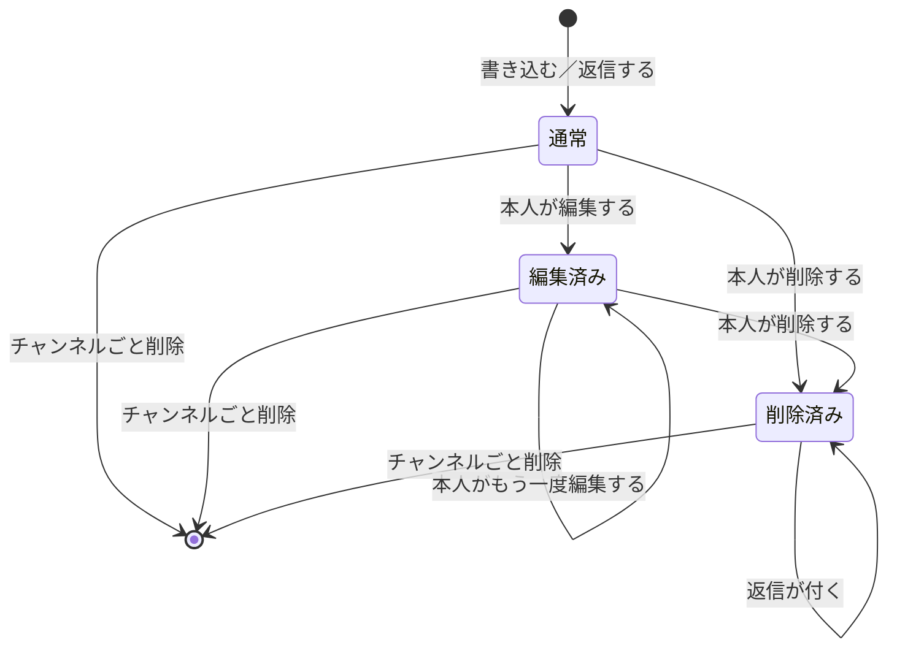
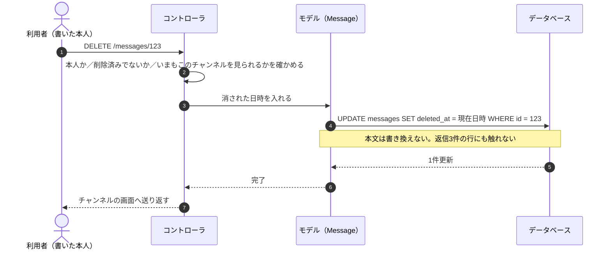

# 16-1-5: 裏側を設計する - 権限・API・振る舞い

## 🎯 このセクションで学ぶこと

- 権限マトリクス・ルーティング一覧・公開APIの設計・状態遷移図・代表シーケンス・例外方針をAIと確定できるようになる。
- 権限マトリクスの形に入らない機能を見つけて、別の守り方を書けるようになる。
- 図と表をどこまで書くかを決められるようになる。

---

## 導入

画面とデータが決まっても、誰が何をしてよいのか、思ったとおりに進まなかったときにどう返すのかは、まだ決まっていません。どちらもモックアップには描かれません。ここを空けたまま実装に入ると、AIが自分で決めて、決めた側で最後まで進みます。プライベートチャンネルの中身が誰に見えるかのような、いちばん外せないところが、そうやって黙って決まります。

---

## この節で作るもの

Tutorial 13で1章ずつ扱った型を、5つ続けて1周します。

| 作るもの | 使う型 |
|:--|:--|
| 権限マトリクス | 13-4-2 |
| ルーティング一覧と公開APIの設計 | 13-4-1 |
| 状態遷移図 | 13-6-2 |
| 代表的な処理のシーケンス図 | 13-6-1 |
| 例外方針 | 13-6-3 |

シーケンス図は代表を1本だけ描きます。全機能ぶんを描くと、ほとんどが「ルート → コントローラ → モデル → ビュー」の繰り返しになり、増える情報がありません。

クラス図は作りません。13-7-3で、詳細設計のクラスの分け方は使う言語とフレームワークが決まってから詰める、と書きました。今回はLaravelのMVCの標準の作りにそのまま乗せるので、決めることがありません。**作らないと決めたことも、1行だけ設計書に残します。** 空欄と、検討したうえでの「なし」は違います。

---

## 権限マトリクスが答えないもの

権限マトリクスは、行に機能、列に利用者の区分を並べて、誰が何をしてよいかを1枚にする表です。ただし、この表の形には入らないものがあります。

表が答えるのは「**対象1つに対して**、その操作をしてよいか」です。他人のメッセージを消せるか、というような問いの形をしています。ところが検索と公開APIは、対象が1つに決まっていません。どちらも「たくさんある中から、出してよいものを絞る」操作です。

| 機能 | 表の形に入らない理由 | 守り方 |
|:--|:--|:--|
| 検索 | 対象は一致したメッセージ全部。1件ずつ可否を聞く形にならない | 取り出すときの絞り込みそのものが権限になる。自分が見られるチャンネルのメッセージだけを取り出す |
| 公開API | 呼ぶ相手が決まっていない（ログインなし）。誰かを判定する形にならない | 出す範囲を先に絞る。公開チャンネルだけを返し、プライベートは名前も含めて返さない |

この2つは、**表の記号が全部そろっていても抜けます**。表は「誰が・何を」で並んでいて、「一覧に何が混ざるか」は表に現れないからです。仕様書がこの2か所だけわざわざ念を押しているのも、ここが表から漏れるところだからだと読めます。抜けを防ぐために、この2つは受け入れ条件にも独立した行として置きます（16-1-6）。

もう1つ、この表で決めないものがあります。ログインをどうやって実現するかです。13-4-2でも、権限マトリクスが扱うのは認可（あなたはそれをしてよいか）で、認証の方式は決めない、と書きました。今回も同じで、ログインの仕組みを何で作るかは実装に入るときに決めます（16-3-1）。

---

## 🏃 裏側を起こして、突き合わせる

思いどおりに直らない・壊れたと感じたら、14-5-1（直らないときの型）へ。応急は `git restore .` です。

### Step 1: 5つをまとめて起こさせる

```text
次は裏側の設計。権限・ルーティングとAPI・状態遷移・シーケンス・例外方針を作りたい。
docs/design/ にあるものを先に全部読んで。置き場とファイル名は README のとおり、図はMermaidでMarkdownの中に。

権限マトリクスは機能の F-xx を行、利用者の区分を列にして ○△× で。△の条件は表の下に。
公開APIは、エンドポイントと入出力とエラーの返し方まで、返す中身の例も付けて。状態遷移はメッセージだけ。
シーケンス図は代表を1本だけで、「スレッドの返信が付いたメッセージを、書いた本人が削除したとき」の流れ。
クラス図は作らない。LaravelのMVCの標準の作りに乗せるので、その1行だけ残して。

根拠は spec.md・mockup/・docs/design/ にあるものだけ。spec.md と mockup/ は変えないで。
書いたら、設計書どうしの食い違いと、決めておいたほうがいいことがあれば教えて。
```

> 💡 **進行例について**: AIとの開発は毎回違う流れになります。ここに示すのは一つの進行例です。あなたの画面と違っていても、チェックリストを満たしていれば正解です。

1往復で5つとも返ってきました。成果物がいちばん多い節ですが、1周で足りたのは、機能・画面・データ・確認事項がもう紙になっているからです。

権限マトリクスの列の切り方が、こちらの想定と違っていました。「ログインしていない人・メンバー・作成者」の3つで並べるつもりでしたが、返ってきたのは4つです。

| 列 |
|:--|
| ログインしていない人 |
| 社員（そのチャンネルを見られない人） |
| 社員（そのチャンネルを見られる人） |
| チャンネルを作った人 |

そのうえで「チャンネルに紐づく行は、対象のチャンネル1つについて読む」という読み方が添えてありました。同じ社員でも、見られるチャンネルでは ○、見られないチャンネルでは × になります。プライベートチャンネルを見られるかどうかが主役の題材なので、この切り方のほうが素直です。**列は3つと決まっているわけではありません。** そのアプリで判定が分かれるところに合わせます。

### Step 2: 自分から挙がってきたものを読む

依頼していないのに、実装で踏むところが4つ添えられていました。どれも設計書に残す価値があります。

- 素のLaravelは、**ログインしたあとの行き先が `/home`** に設定されている。チャンネル一覧に変えないと、ログイン直後に存在しないURLへ送られます
- 公開チャンネルでも、作った人のメンバーの行は作られる。この行を「見られるか」の判定に使うと、**公開チャンネルを作った人以外は誰も中を見られなくなります**。判定は「公開なら全員 → プライベートならメンバー行」の順にします
- **404の見え方を、理由によらず1つに揃える。**「見られないチャンネル」「存在しない番号」「削除済み」が返しの違いで見分けられると、404にした意味がなくなります
- 同じ名前のチャンネルがほぼ同時に作られたときのような、データベース側で弾かれるものを、入力エラーと同じ見せ方に戻す

404と403の使い分けの理由も書かれていました。すべてを404にすると、実装のときに「隠すべきもの」と「断るだけのもの」の区別が消えます。他人のメッセージを消そうとした人には、そのメッセージが見えているので、隠す理由がありません。見られないチャンネルは404、見えているけれど立場にない人には403、という線です。

モックアップに404や403の画面が1枚も無いことにも触れ、**見本の無いものは作り込まない**、と書いてありました。Laravelが用意している画面に短い1文を出すところまでにします。

### Step 3: 図の読み方を確かめる

図はMermaidで返ってきます。ER図の書き方は8-1-5で、四角と矢印でつなぐ図は14-1-1の開発フローで見ました。画面遷移図は、16-1-3で自分が起こしたばかりです。状態遷移図とシーケンス図をMermaidで読むのは今回が初めてなので、読み方を先に置いておきます。

状態遷移図では、`[*]` が始まりと終わりを表します。左上の `[*]` から出る矢印が「まだ無い」から生まれるところ、`[*]` へ向かう矢印が行そのものが消えるところです。



「削除済み」から自分自身に戻る矢印は、返信が付いても状態が変わらないことを表しています。16-1-4で決めた「器として残す」が、図の上ではこの1本になります。

シーケンス図は、縦の線が登場するもの、横の矢印がやり取りです。`->>` が送る側、`-->>` が返す側で、`Note` は図に添える注記です。頼む矢印には、頼んだ側へ返る矢印が対になります（13-6-1）。代表の1本は、返信が付いたメッセージを本人が削除したときの流れにしました。削除まわりで決めた3つ（行を消さずに日時を入れる・本文を書き換えない・返信と件数を残す）が、この操作だけで一度に通るからです。



これは、登場するものを4つに絞った抜粋です。実際の図にはブラウザとビューも並び、このあとチャンネル画面を出し直すところ（削除済みも含めて取り出し、返信件数は3件のまま）まで入ります。

### Step 4: 足りないところを足す

返ってきた5つは、個別にはどれも正しく書けていました。検索の絞り込みも、公開APIの返さないものも、書いてあります。それでも1つ足しました。

**なぜ検索と公開APIだけが表の形から外れるのか**、という一段上の説明です。これが無いと、表を1行ずつ潰す読み方をしたときに「全部○×が埋まっているから大丈夫」と読めてしまいます。この節の前半で書いた内容を、権限マトリクスの下に節として足します。

もう1つ、例外方針の中で、ログインの有効期限が切れた場合とフォームの合言葉（CSRFトークン。10-6-1）が古くなった場合が1行にまとめられていたので、2行に割りました。片方はログイン画面へ送り直す話、もう片方は送信そのものが弾かれる話で、起きることが違います。

どちらも足りないものを足す直しなので、16-1-3と同じで言い切って頼みます。

```text
権限まわりを2か所直して。

- 権限マトリクスの下に、検索と公開APIがこの表の形に入らない理由と、その2つをどう守るかを節として足して。
  表の○×だけを見て「全部埋まっているから大丈夫」と読めてしまうのを防ぎたい
- 例外方針の、ログインの有効期限切れとCSRFトークンの期限切れが1行になっているので、2行に割って。
  片方はログイン画面へ送り直す話、もう片方は送信そのものが弾かれる話
```

直し終えたら、`main` にコミットします。

- [ ] 権限マトリクスの △ に、条件が書かれている
- [ ] 検索と公開APIについて、表の形に入らない理由と守り方が書かれている
- [ ] ルーティング一覧に、画面のルートと公開APIの両方がある
- [ ] 公開APIに、返す中身の例とエラーの返し方がある
- [ ] 状態遷移図とシーケンス図が、Markdownの中にMermaidで書かれている
- [ ] シーケンス図が1本だけで、クラス図を作らない決めが1行残っている

---

## ✨ まとめ

- 権限マトリクスが答えるのは「対象1つに対して、その操作をしてよいか」。検索と公開APIはこの形に入らないので、絞り込みそのものを権限として別に書く。
- ログインをどう実現するかは、この表では決めない。決めるのは実装に入るとき。
- 断り方は2つ。見られない相手には404、見えているが立場にない相手には403。404の見え方は理由によらず揃える。
- シーケンス図は代表1本、クラス図は作らない。作らないと決めたことも1行残す。
- 見本の無い画面は作り込まない。あとで見本が出てきたときに作り直しになる。

---
