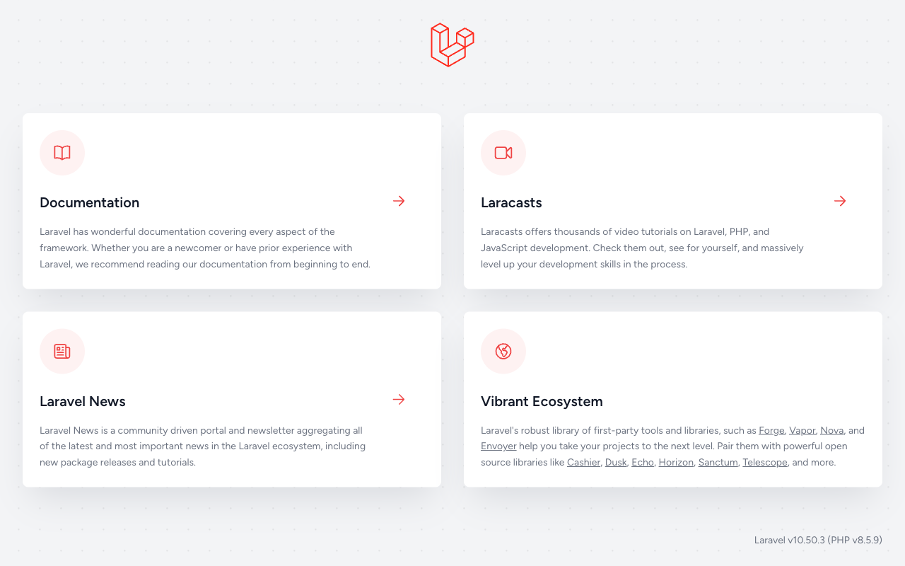

# 16-2-1: 動く土台を作る

## 🎯 このセクションで学ぶこと

- 自分のリポジトリでSailを起動し、素のLaravelがブラウザに出るところまで持っていけるようになる。
- 2つ目のSailのアプリを動かすときに出るポートの取り合いと、データベースの起動待ちを切り分けられるようになる。
- 設計書の在りかを書いた `CLAUDE.md` を、このリポジトリに置けるようになる。

---

## 導入

`docs/design/` に設計は揃いましたが、このフォルダはまだ一度も動かしていません。テストを回す先も、画面を開く先もない状態です。この節では、コンテナを立ち上げてLaravelの初期画面を出し、そのうえで、次に起動したセッションから毎回読まれる1枚を置きます。

---

## 🏃 コンテナを起動する

コマンドの並びは、14-1-2で投稿アプリを立ち上げたときと同じです。違うのは最後の1手だけで、そこは Step 5 で説明します。同じ手順はリポジトリの `README.md` にも載っているので、あとで見返すときはそちらを開いてください。

> ⚠️ **注意**: 先に、いま動いている別のアプリを止めてください。80番と3306番のポート（通信の出入口の番号）を掴んだままだと、Step 3 で `Bind for 0.0.0.0:80 failed: port is already allocated` と言われて起動しません。

```bash
# 前のアプリのフォルダで実行する
cd ~/laravel-practice/post-app-practice
./vendor/bin/sail stop
```

Sailのアプリはどちらも80番と3306番を使う設定なので、2つを同時には動かせません。前のアプリに戻りたくなったら、今度はこのアプリを `sail stop` してから起動します。

> 💡 **TIP**: 手元に `post-app-practice` のフォルダが残っていないときは、自分のGitHubのリポジトリから `~/laravel-practice/` の下へ clone し直してください。止める作業は要りませんが、16-2-2でこのフォルダから道具を運ぶので、そこまでに戻しておきます。

### Step 1: ライブラリを取ってくる

clone した直後の状態には `vendor/` がありません。`./vendor/bin/sail` もまだ無いので、最初の1回だけはDockerを直接使って取ってきます。

```bash
# 自分のリポジトリのフォルダで実行する
docker run --rm \
    -u "$(id -u):$(id -g)" \
    -v "$(pwd):/var/www/html" \
    -w /var/www/html \
    -e COMPOSER_CACHE_DIR=/tmp/composer_cache \
    laravelsail/php82-composer:latest \
    composer install
```

### Step 2: 環境変数のファイルを作る

```bash
cp .env.example .env
```

### Step 3: コンテナを起動する

```bash
./vendor/bin/sail up -d
```

**そのあと30秒ほど待ってください。** コンテナが `Up` になっても、データベースはまだ中で立ち上がっている途中です。待たずに次へ進むと、Step 5 でこうなります。

```text
SQLSTATE[HY000] [2002] Connection refused (Connection: mysql, ...)
```

待ちきれたかどうかは、コンテナの一覧で確かめられます。

```bash
./vendor/bin/sail ps
```

`mysql` の欄が `Up (healthy)` に変われば、確実に繋がります。上のエラーが出たときも、少し待って同じコマンドをもう一度打てば通ります。

> 💡 **TIP**: Apple Siliconのマシンでは、起動の途中に `The requested image's platform (linux/amd64) does not match the detected host platform` という警告が出ます。MySQLのイメージのもので、起動そのものは成功します（2026年8月時点）。

### Step 4: アプリケーションキーを作る

```bash
./vendor/bin/sail artisan key:generate
```

### Step 5: テーブルを作る

```bash
./vendor/bin/sail artisan migrate
```

14-1-2との違いはここだけで、`--seed` を付けません。初期データは、機能を1本仕上げるたびに、その機能のぶんを積んでいきます。いま流せるものはまだ1つもないので、素のLaravelが持っているテーブルだけが作られます。

ブラウザで `http://localhost` を開いて、Laravelの初期画面が出れば土台は完成です。

**素のLaravelの初期画面**



### 止める・片づける

```bash
./vendor/bin/sail stop      # 止めるだけ（データは残ります）
./vendor/bin/sail down -v   # 止めて、データベースの中身ごと消す
```

`down -v` のあとは、Step 3 からやり直します。

---

## 🏃 CLAUDE.md を置く

`CLAUDE.md` の作り方は14-1-3と同じです。`/init` に叩き台を書かせて、刈ってから、このアプリならではの中身を足します。

思いどおりに直らない・壊れたと感じたら、14-5-1（直らないときの型）へ。応急は `git restore .` です。

### Step 1: 叩き台を作る

Claude Codeを起動して、`/init` と打ちます。

```bash
# 自分のリポジトリのフォルダで実行する
claude
```

```text
/init
```

読み終えると、フォルダのいちばん上に `CLAUDE.md` ができます。出てきたものを全部読んで、14-1-3の物差しで落とします。消してもミスが増えない行は消し、`php artisan` で書かれたコマンドは `./vendor/bin/sail artisan` に直します。

### Step 2: このリポジトリが何かと、決めごとの在りかを書く

刈ったあとの1枚に、まず、このリポジトリが何なのかを2〜3行で置きます。次にClaude Codeを起動した人が、いちばん最初に読む行です。

```markdown
## このリポジトリの位置づけ

チームチャットアプリ（Laravel 10 / MySQL / Sail）。仕様書（`docs/spec.md`）とモックアップ（`mockup/`）から設計書一式を作ったところで、**機能のコードはまだ1行も無い**。これから設計書のとおりに実装していく。
```

その下に、決めごとがどこにあるかの表を足します。**中身は写しません。** 受け入れ条件も権限の一覧も、大元は `docs/design/` にあって、そこを直せば1か所で済みます。両方に書くと、片方だけが古くなります（15-2-1）。表の見出しは、その決めごとがいちばん元になる1か所を指しています。

```markdown
## 正本の在りか

中身はここに写さない。必要になったら開くこと。

| 何が書いてあるか | どこにあるか |
|:--|:--|
| 仕様書（クライアントの要求） | `docs/spec.md`。**変えない** |
| 設計書一式（このアプリの決めごとの正本） | `docs/design/`（構成は `docs/design/README.md`） |
| 画面の見本 | `mockup/`（`index.html` から全画面） |
| 受け入れ条件とテスト観点 | `docs/design/acceptance.md` |

実装と設計書が食い違ったら、**コードではなく `docs/design/` を先に直す**。設計書は提出物の中心で、最後まで実物と一致させる。
```

最後の1行が、この先いちばん効きます。実装を進めるとAIから「設計書にこう書いてありますが、こうしますか」という聞き返しが来ます。そのときにコードだけ直すと、設計書は古いまま残ります。16-1-6で決めた「ズレたら設計書側を直す」を、AIにも読ませておく形です。

### Step 3: 前のアプリから運べる行を持ってくる

`post-app-practice` の `CLAUDE.md` を開いて、このアプリでもそのまま通じる行を持ってきます。運べるのは、**実際にそこに書いてある行だけ**です。Sail経由でコマンドを打つこと、テスト用のデータベースの注意、`.env` を読まない決めが、それに当たります。

````markdown
## コマンド

すべて Sail（Docker）経由。素の `php artisan` は DB に繋がらない。

```bash
./vendor/bin/sail up -d
./vendor/bin/sail artisan migrate
./vendor/bin/sail artisan test
./vendor/bin/sail down
```

テストは `phpunit.xml` で `DB_DATABASE=testing` に切り替わる。この `testing` DB は MySQL コンテナ初回起動時の init スクリプトが作るので、DB が無いと言われたら `sail down -v` からやり直す。

## 注意

`.env` の中身は読まない。設定値を確認したいときは `.env.example` を見る。
````

`migrate --seed` と `migrate:fresh --seed` は落としました。シードがまだ無いからです。`.env` の行は、前のアプリでは許可の指定で止めてあることまで書いてありました。このリポジトリにはその指定がまだ無いので、読まない決めだけを写しています。16-2-2で止めたあとも、この文のままで通ります。

プルリクエストの本文の型は、前のアプリの `CLAUDE.md` には入っていません。あれは14-4-5で自分が毎回書いていたものです。今回は7本ぶん繰り返すので、ここに書いておきます。

```markdown
## プルリクエスト

イシュー1件に1本のブランチを切り、プルリクエストで受け取る。

本文には、テストの実行結果と、受け入れ条件それぞれの判定を載せ、最後に `Closes #<イシュー番号>` を入れる。
```

### Step 4: コミットする

```text
CLAUDE.md をコミットしてください。
```

設計書と同じで、この1枚もどのイシューにも属していません。Chapter 2 までは足場を組んでいる段階なので、設計書も、これから置く道具も、ブランチを切らず `main` に直接記録します。ブランチを切り始めるのは、イシューを回す16-3-1からです。

ここまでで、次を確かめてください。

- [ ] `http://localhost` にLaravelの初期画面が出た
- [ ] `./vendor/bin/sail ps` の `mysql` が `Up (healthy)` になっている
- [ ] `CLAUDE.md` の先頭に、このリポジトリが何かが書いてある
- [ ] `CLAUDE.md` に、設計書の在りかの表がある（中身は写っていない）
- [ ] `CLAUDE.md` に、自分が打ったことのないコマンドが残っていない
- [ ] `git log` に `CLAUDE.md` を追加したコミットがある

---

## ✨ まとめ

- Sailのアプリを2つ持つと、80番と3306番のポートを取り合います。使うほうだけを起動し、もう片方は `sail stop` で止めます。
- `sail up -d` の直後はデータベースがまだ立ち上がっていません。`Connection refused` が出たら、`sail ps` が `Up (healthy)` になるのを待って打ち直します。
- `migrate` に `--seed` は付けません。流すものは、機能を作りながら自分で足していきます。
- `CLAUDE.md` に設計書の中身は写しません。書くのは在りかと、食い違ったときにどちらを直すかです。
- 前のアプリから運べるのは、そこに実際に書いてある行だけです。書いていなかったものは、教材のどこで決めたかをたどって書き起こします。

---
