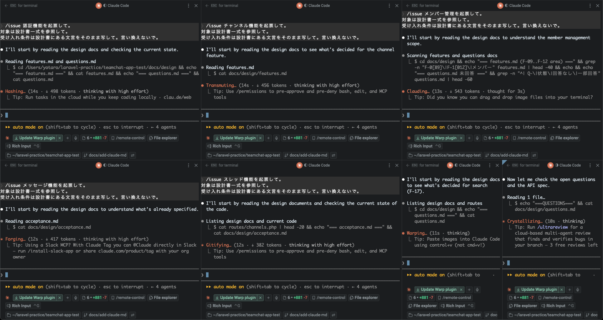
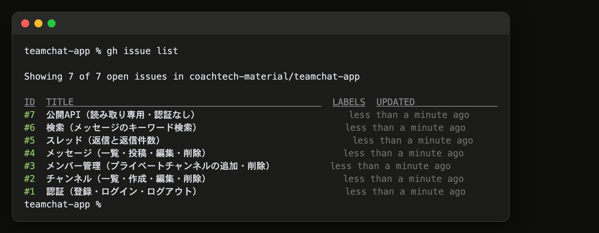
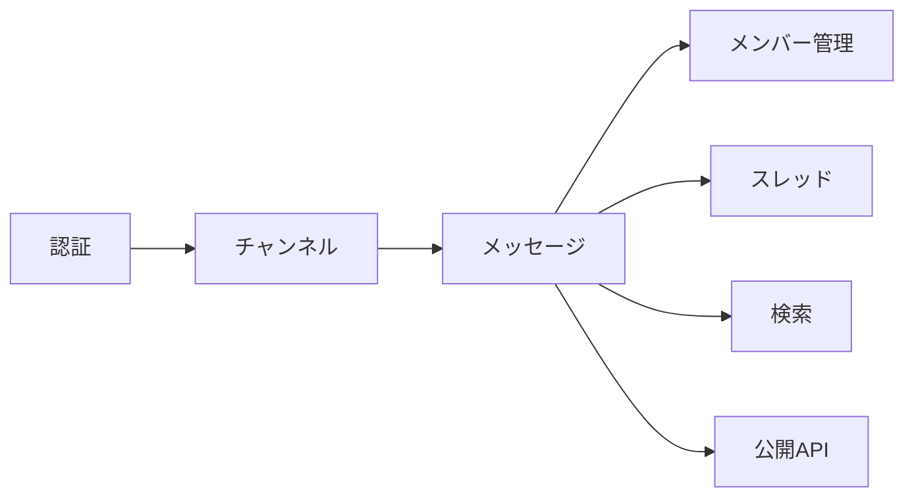

# 16-2-4: バックログを積む

## 🎯 このセクションで学ぶこと

- 設計書一式から、実装の単位になるイシューを切り出せるようになる。
- 依存を根拠に、実装順と並行させてよい組を決められるようになる。
- 初期データとテーブルを、どのイシューが持つかを割り付けられるようになる。

---

## 導入

設計も足場も揃いましたが、AIに渡せる形にはまだなっていません。「このアプリを作って」と1回で頼めば、7機能ぶんの差分が一度に返ってきて、受け取る手立てがありません。1回で受け取れる大きさに割って、順番を決めるところまでが、この節です。

あとでやると決めた作業を積んでおく一覧を、バックログと呼びます（15-5-3）。ここで積むのが、このアプリのバックログです。

---

## イシューへの切り出し

イシューへの切り出しは、設計書に書いた全体を、1回で受け取れる大きさの作業の票に割ることです。実務では、要件をチケットに割る作業がこれに当たります。

Tutorial 14では、この順番が逆でした。作るものがリプライ機能の1つだけだったので、イシューを立てるところから始めて、票そのものが「何を作るか」を書いた紙を兼ねていました（14-1-1）。今回は7つの機能が、1つのデータと、そこから何を見せてよいかの決めごとを共有します。チャンネルのメンバーの持ち方はメッセージが使い、同じ条件を検索も使います。公開APIは人を判定しませんが、公開チャンネルだけを返すという線は、やはり同じデータの持ち方の上で引きます。票を1枚ずつ書きながら決めていくと、次の票を書くたびに前の票の前提が動きます。だから、先に一式で全体を決めて、票はそこから切り出します。

イシュー化の仕事そのものは変わりません。作るものを票にして、受け入れ条件を書く。変わったのは、その材料がどこから来るかだけです。

---

## 🏃 7本を起票する

### Step 1: 初期データの持ち主を決める

仕様書は、アカウント3つ・チャンネル4つ・メッセージ一式が入った状態を求めています。これを1本のイシューにまとめると、認証しかできていない時点でチャンネルのデータを作ることになります。そこで、機能ごとに分けて持たせます。

| 何を入れるか | どのイシューが持つか |
|:--|:--|
| アカウント3つ | 認証 |
| チャンネル4つと、メンバーの割り当て | チャンネル |
| メッセージ一式（編集済み1件・削除済み1件を含む） | メッセージ |
| 返信が付いたメッセージ | スレッド |

16-2-1で `migrate` に `--seed` を付けなかったのは、このためです。初期データは、イシューを1本仕上げるたびに積み上がります。受け入れ条件を確かめるときも、そのときまでに積んだ分だけが対象です。

### Step 2: 機能ごとに1本ずつ立てる

立てるのは、認証・チャンネル・メンバー管理・メッセージ・スレッド・検索・公開APIの7本です。機能一覧の並びのまま立てると、設計書とイシューで番号がずれません。実装する順番はこのあと Step 3 で別に決めるので、ここでは並びを揃えることだけを考えます。

`/issue` を使います（16-2-2で移した1本です）。差し替えのときに「受け入れ条件が設計書にあるならそこから写す」の1行を足したので、設計書の在りかを毎回書かなくても、そこを読みに行きます。

```text
/issue {機能名}機能を起票して。
対象は設計書一式を参照して。
受け入れ条件は設計書にある文言をそのまま写して。言い換えないで。
```

`{機能名}` のところを入れ替えて、7本を1本ずつ頼みます。Step 1 で割り付けた初期データがあるイシューには、その機能が積む分を自分の言葉で1行足してください。

> 💡 **TIP: 7本を同時に走らせることもできます**
>
> この7本は互いに独立しています。`/issue` がやるのは、設計書を読んでGitHubに票を立てることだけで、リポジトリのファイルは書き換えません。ターミナルの画面を分割して、それぞれで `claude` を起動し、1枚に1機能ずつ投げれば、7本が同時に進みます（画面を分割できるターミナルなら何でも構いません。VS Codeのターミナル、iTerm2、Warpなど）。
>
> ただし、イシューの番号は**立った順**に付きます。同時に走らせると、機能一覧の並びと一致しないことがあります。このあとの節は「#1が認証、#7が公開API」で書いてあるので、ずれたときは自分の番号に読み替えてください。並びを揃えたいなら、1本ずつのほうが確実です。
>
> `/issue` は決まっていないことがあると聞き返してきます。7枚同時だと、7か所で聞かれます。枠も同時に減るので、始める前に `/usage` を見ておいてください（14-1-6）。

**画面を7枚に分けて、7本を同時に走らせたところ**



**受け入れ条件は写します。書き直しません。** 実装のあと、同じ条件を受け取りの判定・UAT・全体の突き合わせで何度も使います。そのたびに少しずつ違う言い方が並んでいると、どれが正しいのかを毎回考えることになります。粒度は16-1-6で締めたときのままで足ります。

イシューの本文に入るのは、概要・受け入れ条件（チェックボックス）・変えないもの、です。Step 1 で初期データを割り付けた4本には、積む分の1行が加わります。**計画の持ち方は書きません。** 選ぶのは走り出す直前だからです。

7本立て終わったら、数を確かめます。

```bash
gh issue list
```

7本が `OPEN` で並んでいれば、起票は終わりです。

**イシューが7本並んだところ**



### Step 3: 実装順と並行の組を決める

順番は好みで決めません。設計書のCRUD表とER図が、そのまま依存の地図になります。



先頭の3本は直列でしか進みません。すべての画面がログインに乗り、メッセージはチャンネルが無いと置き場所がなく、返信・検索・公開APIはメッセージが無いと対象そのものがありません。残りの4本はお互いを必要としないので、並行させられます。実際にどう回すかはChapter 3で決めます。並行は手が増えるので、4本のうち2本は直列で回して形を固めてから、最後の2本を並行にします。

#### 割り付けの答え合わせ

切り出しの答え合わせをしておきます。チャンネルのメンバーを持つ中間テーブルと、作った人がそのままメンバーになる動きは、**チャンネルのイシュー**に入ります。メンバー管理のイシューが持つのは、追加と削除の画面と権限だけです。

メンバー管理のほうに寄せたくなりますが、それだと直列の2本目でメッセージが作れません。プライベートチャンネルを見てよい人かの判定は、メッセージの一覧を出す時点でもう要ります。

設計書を読み返すと、この割り付けはすでに成立しているはずです。機能一覧のチャンネルを作る行に「作った人はそのままメンバーになる」と書いてあり、テーブルの設計にも同じことが書いてあり、メンバー管理の行にはテーブルを増やす話が出てきません。設計を先に済ませてあると、票の切り出しで迷う場面が減ります。

> 💡 **TIP**: メンバー管理は、作るだけならチャンネルの直後に着手できます。テーブルはもうあるからです。それでも後ろに置くのは、**受け入れ条件がメッセージを要求している**ためです。追加したメンバーが「開いて書き込める」ことを確かめる行があるので、メッセージが無いと合否を出せません。依存はコードの依存だけでなく、受け入れ条件が何を要求しているかでも決まります。

同じ理由で、**先へ進んでから戻って確かめる行**がいくつかあります。チャンネルを消したあとに検索で0件になること、削除したメッセージが検索に出ないこと。どれも検索ができるまで確かめられません。イシュー単体でチェックが全部埋まらない行は、16-4-1の全体の受け入れで拾います。設計書の抜けではありません。

---

## 計画の持ち方

計画の3つの持ち方（14-3-1）のうち、設計書は16-1-6で選び終えています。`docs/design/` の一式が、7本ぶんの「何ができあがるか」を持っているからです。

残りの2つ、なしとplanモードは、票を取って走り出す直前に、件ごとに選びます。7本を同じやり方で通す理由はありません（15-5-3）。ここで全部まとめて決めてしまうと、実際に手を付けたときに「この件は決まっていないことが残っている」と気づいても、選び直すきっかけがなくなります。

発展的な機能を足したくなったら、別のラベルを付けたイシューをあとから積んで構いません。順番は1つで、**先に設計を一式へ足してから、票にします**。設計を置く場所は `docs/design/` の1つだけで、票の材料はそこからしか出てきません。

---

## 走り出す前に、`main` を上げる

Chapter 1とChapter 2で作ったものは、全部 `main` に直接コミットしてきました。設計書一式、`CLAUDE.md`、許可の指定とルールとフックとSkill。16-1-2で一度 push したあとに積んだぶんは、**まだGitHubに上がっていません**。

ここから先は、イシュー1件につき1本のブランチを切って、プルリクエストで受け取ります。プルリクエストが見せるのは、`main` との差です。`main` が古いままだと、最初の1本に、Chapter 1とChapter 2で積んだもの全部が差分として混ざります。

```text
ここまでの変更を、origin の main へ push して。
```

上げ終わると `git status` が `Your branch is up to date with 'origin/main'.` を返します。報告にその行があれば、手元とGitHubがそろっています。

---

## ✅ ここまでの確認

- [ ] イシューが7本 `OPEN` で並んでいる
- [ ] それぞれの受け入れ条件が、設計書と同じ文言になっている
- [ ] 割り付けの表にある4本のイシューに、その機能が積む初期データが書いてある
- [ ] チャンネルのイシューに、中間テーブルと作成者の自動メンバー化が入っている
- [ ] メンバー管理のイシューに、テーブルを増やす話が入っていない
- [ ] 実装順と、並行させてよい4本が自分で言える
- [ ] `main` がGitHubに上がっている（`git status` が `up to date` になっている）

仕様書・設計書一式・動く土台・ハーネス・バックログ。走り出すのに要るものは、これで揃いました。

---

## ✨ まとめ

- 票の大きさは、1回で受け取れる単位に揃えます。イシュー化の仕事はTutorial 14と同じで、材料の出どころが設計書に変わりました。
- 受け入れ条件は設計書から写します。言い換えて書いてしまうと、あとの突き合わせで毎回どちらが正しいかを考えることになります。
- 実装順の根拠はCRUD表とER図です。設計が順番を教えてくれます。
- テーブルは、それを最初に必要とする機能のイシューが持ちます。使う側の機能に寄せると、直列の順番が崩れます。
- 依存はコードだけの話ではありません。受け入れ条件が何を要求しているかも、順番を決めます。
- 計画の持ち方は、件ごとに走り出す直前に選びます。

---
