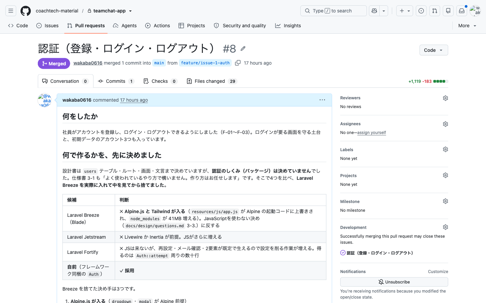
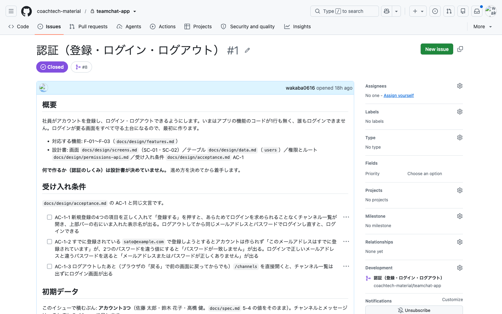
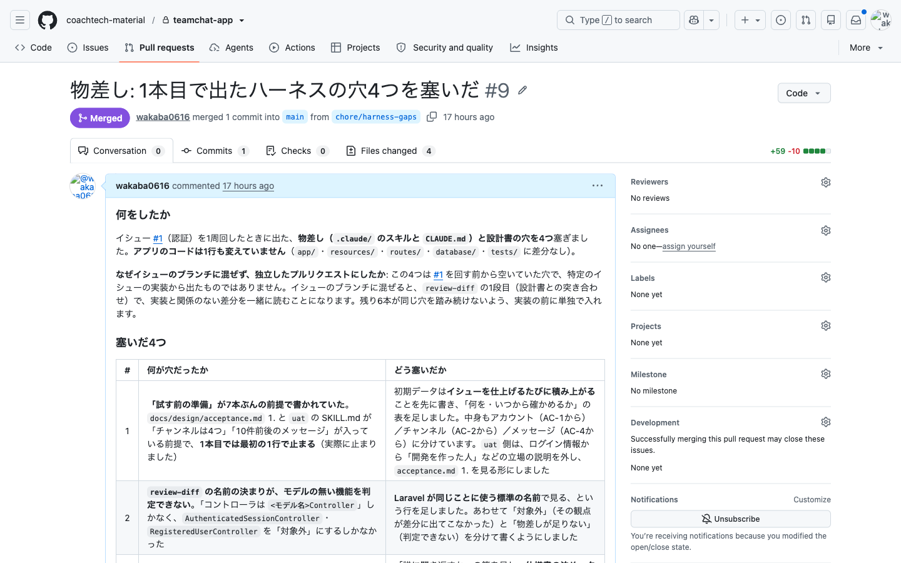

# 16-3-1: 最初のイシューを通しで回す

## 🎯 このセクションで学ぶこと

- 件ごとに計画の持ち方を選び、選んだ理由を1行で残せるようになる。
- 設計書が決めていない技術の選定を、材料をそろえてから自分で決められるようになる。
- テストが全部通っていても残る穴を、人の側の確認で見つけられるようになる。

---

## 導入

イシューは7本 `OPEN` で並んでいて、アプリのコードはまだ1行もありません。ここから1本を取って、計画・実装・検証・受け取り・プルリクエストまでを1周します。教材が一緒に回すのは、この1本だけです。

---

## 認証から始める

実装順の先頭が認証なのは、16-2-4で見たとおり、すべての画面がログインに乗るからです。もう1つ、この件には他の6本と違うところがあります。**何で作るかが決まっていません。**

仕様書は、ログインの挙動だけを決めています。

```text
ログインの仕組みそのものは、よく使われているやり方で構いません。作り方はお任せします。
```

設計書一式も、`users` のテーブル・ルート・画面・入力チェックの文言までは決めていますが、どのパッケージを使うかは1つも指定していません。権限の表でログインの仕組みを決めないままにしたのは、ここで決めるからです（16-1-5）。決めるところが1つ残ったまま、イシューが立っている状態です。

---

## 計画の持ち方を選ぶ

計画の3つの持ち方のうち、設計書は16-1-6で選び終えています。件ごとに選ぶのは、残りの2つ、なしとplanモードです（14-3-1）。

選ぶ物差しは1つで、**空いている決めが残っているか**です。設計書が「何ができあがるか」を全部持っている件では、計画に書けることが設計書の写しにしかなりません。この件は、何で作るかが空いています。進め方に不確かなところがあるので、planモードで先に固めてから作らせます。

planに出させるのは、**一式が決めていないところだけ**です。入力チェックの規則も、エラーメッセージの文言も、URLの決めも、設計書にあります。計画に写すと、設計書とプルリクエストの2か所に同じ文字列が並び、直すときに両方直すことになります。計画に書くのは、どの順で手を動かすかと、どこを見ればよいかです。

選んだ持ち方と理由は、イシューかプルリクエストの本文に1行残します。書式は決めません。選んだものと、そう決めた理由が読み取れれば足ります。7本ぶんたまると、あとで自分の判断を並べて見返せます。

---

## 🏃 認証のイシューを1周する

思いどおりに直らない・壊れたと感じたら、14-5-1（直らないときの型）へ。応急は `git restore .` です。

> ⚠️ **注意**: Chapter 3では、イシューの番号を「認証が `#1`、チャンネルが `#2`、公開APIが `#7`」として書きます。16-2-4で機能一覧の並びどおりに1本ずつ立てていれば、そのとおりになります。**違う番号になっていたら、自分の番号に読み替えて**進めてください。同時に立てると、番号は立った順に付きます。ブランチ名も同じで、`feature/issue-<自分の番号>-<英字の短い名前>` になります。

### Step 1: 着手する

ここからは、イシュー1本が1セッションです。`main` に立ったまま起動して、名前を付けます。番号を入れておくと、あとで `/resume` の一覧を開いたときに、どの件のセッションかが分かります（14-5-2）。

```bash
# 自分のリポジトリのフォルダで実行する
claude
```

```text
/rename #1 認証
```

`main` は16-2-4の最後にGitHubへ上げてあります。まだなら、先に上げておいてください。

あとは、着手したいと伝えるだけです。

```text
Issue #1 に着手したいです。main に切り替えて origin から pull してから、Issueに対応するブランチを切ってください。
```

> 💡 **進行例について**: AIとの開発は毎回違う流れになります。ここに示すのは一つの進行例です。あなたの画面と違っていても、チェックリストを満たしていれば正解です。

ここをplanモードで送らないのは、**ブランチを切らせているから**です。planモードのあいだ、AIは読むことしかできません（14-3-2）。ブランチを切るのも書き換えの一種なので、そこで止まります。切り替えるのは、計画を頼むStep 2からです。

ここで1つ、見ておくものがあります。**切られたブランチの名前**です。`CLAUDE.md` に書いてあるのは「イシュー1件に1本のブランチを切り、プルリクエストで受け取る」までで、**名前の付け方はどこにも書いていません**。決まりが無いので、AIがその場で決めます。いまはそのまま進んで、この節の最後で決まりにします。

### Step 2: 計画を頼んで、何で作るかを決める

`Shift+Tab` を押して、入力欄の下が `⏸ plan mode on` になるまで合わせます（14-3-2）。そのうえで頼みます。頼み方によっては、AIのほうから「planモードに入ってよいか」と聞いてくることもあります。そのときは許可すれば同じところに来ます。

```text
計画を立ててから実装に着手してください。決めないといけないことがあれば、先にこちらへ質問してください。
```

読むのも、決まっていないことを見つけるのも、ここから先は向こうがやります。この件で空いているのは、**何で作るか**です。認証のしくみをどう用意するかは、設計書のどこにも書いてありません。

聞き返しが来たら、そこで一緒に決めます。聞かずに計画が出てきて、想定と違っていたら、3択の場で直したいことを打って立て直させます（14-3-2）。ここで並んだ候補は4つでした。

| 候補 | 何をくれるか | このアプリの条件に当てると |
|:--|:--|:--|
| Laravel Breeze | ルート・コントローラ・入力チェック・画面・テスト一式 | 画面が最大の価値。Alpine.jsとTailwind CSSが入る |
| Laravel Jetstream | Breezeに加えてチーム・2要素認証・プロフィール | JavaScriptがさらに増え、作らないと決めた機能が大量に付く |
| Laravel Fortify | 画面を持たない認証のしくみだけ | JavaScriptは来ない。画面は自前で作るので、モックアップをそのまま形にできる。要らない機能は `config/fortify.php` から外す |
| 同梱の `Auth` を直に使う | 何も足さない | ログイン・登録・ログアウトの処理を、自分で書くことになる |

いちばん迷うのはBreezeです。**画面が付いてくる**ことが最大の価値なので、そこを掘って聞きます。

```text
Breeze を入れると、具体的に何が増えますか。
生成されるログイン画面は mockup/login.html とどこが違いますか。
```

返ってきたのは、次の3点でした（ファイルの数はバージョンで前後します）。

1. `resources/js/app.js` がAlpine.jsの起動コードに置き換わり、Tailwind CSSの部品も一緒に入る。JavaScriptを使わないという決め（16-1-3）と正面からぶつかる
2. 生成される `auth/login.blade.php` は、ラベルが英語で、ボタンが右寄せの小さいボタン、`Remember me` のチェックボックスと `Forgot your password?` のリンク付き。**モックアップと一致する項目が1つもない**
3. 作らないと決めたパスワード再設定・メール確認・プロフィール編集・退会が、46ファイル分ついてくる

Breezeの価値は生成される画面です。その画面を全部捨てて、捨てたぶんのJavaScriptの部品だけが常設される形になります。JetstreamはBreezeの上乗せなので、同じ理由でさらに合いません。

残るのはFortifyと、同梱の `Auth` を直に使う形です。この件で採ったのは、**Fortify** です。決め手は3つあります。

1. **画面を持っていない**。ログイン・登録・ログアウトの処理だけを引き受けて、画面は `Fortify::loginView()` などで自分のBladeを指す形なので、モックアップをそのまま画面にできます。JavaScriptも入ってきません（16-1-3の決め）
2. **認証そのものを自作しない**。10-1-1で見たとおり、認証を自分で書くと、パスワードの扱いやセッションのところにリスクを持ち込みやすくなります
3. **すでに入れて設定したことがある**。Tutorial 10のChapter 1で学び、10-1-6のハンズオンで `composer require laravel/fortify` から `config/fortify.php` の設定まで通しています

要らない機能（パスワード再設定・メール確認）は、`config/fortify.php` の `features` から外します。これも10-1-6でやった作業です。足すパッケージは `laravel/fortify` の1つだけで、JavaScriptの道具は1つも足しません。

> 💡 **TIP**: これは「Breezeを使うな」ではありません。画面をそのまま活かせる案件では、判断は逆になります。今回の決め手は、モックアップが画面の正解を持っていること、JavaScriptを使わないと決めてあること、作らない機能が並んでいること。**このアプリの条件に当てた結果**です。

CSSも同じ場面で決まります。モックアップのスタイルシートは、外部の道具を使わない素のCSS1枚です。`public/css/app.css` へ写して読み込めば、ビルドの手順が要りません。この選び方をすると、このアプリでは `sail npm` を一度も打たずに済みます。

決めたことを伝えて、計画を立て直させます。

```text
Fortify を使って、画面は自前の Blade で作る形で計画を立て直して。
要らない機能は config/fortify.php の features から外して。
設計書に書いてあることは写さずに、参照で指して。
```

### Step 3: 承認する前に、この件の範囲を決める

出てきた計画で、自分が判断するのは**この件の範囲**です。受け入れ条件から逆算します。

受け入れ条件には16-1-6で番号を振ってあります。認証のまとまりが `AC-1` で、その中の行が上から `AC-1-1`・`AC-1-2` です。行を番号で指せると、イシューにもプルリクエストにも短く書けます。

AC-1-1 は、登録したあとチャンネル一覧が開いて、上部バーの右にいま入れた表示名が出るところまでを求めています。この件だけで `/channels` が開けないと、合否を出せません。ログアウトのボタンの置き場所も、共通の上部バーしかありません。

| この件で作る | 次のイシューへ回す |
|:--|:--|
| 共通レイアウトの上部バーのうち、アプリ名・ログイン中の表示名・ログアウト | 上部バーの検索の入力欄（検索のイシュー） |
| ログインが要る `GET /channels`（見出しだけ） | 左のサイドバーとチャンネルの行（チャンネルのイシュー） |

検索欄を先に置くと、押した先の無い画面ができます。**無いほうが、あるのに動かないより正しい**という線で切りました。この線引きは、あとでプルリクエストの本文にも書きます。

### Step 4: 実装させて、証拠を読む

計画を承認して実装に入らせます。初期データは、この件のぶんだけ積みます（16-2-4）。アカウント3つです。

編集のたびにフックが整形とテストを回すので、途中の失敗はその場でAIに戻ります（15-4-3）。人が読むのは、最後に残った結果です。

```text
$ ./vendor/bin/sail artisan test
  Tests:    2 deprecated, 24 passed (99 assertions)
  Duration: 1.10s
```

途中で、AIから聞き返しが来ます。`/review-diff` には「コードと設計書のどちらが正かを人に聞き返す」と書いてありますが（16-2-2）、ここでいう人は**設計書を書いた自分**です。この1周で来たのは、どちらも設計書の側を直すことになる聞き返しでした。

| 聞き返された内容 | 決めたこと |
|:--|:--|
| メールアドレスの文字数が「指定なし」だが、テーブルは255文字まで | 設計書に「255文字まで」と文言を足す。決めずに受け取ると、長いメールアドレスがデータベースで弾かれてエラー画面になる |
| パスワードの上限を72文字にした理由が、実際の挙動と合っているか | 手元で確かめてから、理由の文だけを書き直す。上限の値は動かさないので、文言と受け入れ条件はそのまま |

どちらも、直すのは**設計書のほう**です。そしてこの直しは、いま回しているブランチに一緒に乗せて、プルリクエストで受け取ります（この形は16-3-2でもう一度使います）。

### Step 5: 受け取りの物差しを当てる

15-5-2で組んだ順で当てます。`/code-review` で一般的な間違いを見て、`/review-diff` でこのアプリの読み方をします。

`/review-diff` の3段目で、3か所直しました。ログイン後・登録後・トップからの着地先が3か所に散っていたのを1か所に寄せたこと、モックアップに無い文字数の目安を消したこと、中身が空なのに検索欄のクラス名が付いた要素を素の要素に変えたことです。どれも、テストは通ったままの差分です。

1本目なので、**物差しの半分は当たりません**。一覧を出す画面がまだ無いので問い合わせの回数を見る観点は当たらず、ポリシーも1つも無いので認可の置き場所の観点も当たりません。順番の問題なので、チャンネルの件から効き始めます。

当たらなかったのとは別に、**判定できなかった**ものが1つ出ました。

```text
観点: 名前 / 判定: 対象外 / app/Http/Controllers/Auth/AuthenticatedSessionController.php
```

物差しにある名前の見方は、モデルの名前から引く形です（コントローラは `ChannelController`、ポリシーは `ChannelPolicy`）。認証にはモデルがありません。名前そのものはLaravelが同じ用途に使う標準の名前なので問題ないのですが、**手元の物差しでは判定できない**という状態です。この節の最後で塞ぎます。

### Step 6: 人の側で確かめる

受け入れ条件の `AC-1` の各行を、`/uat`（15-3-4）に回させて報告を読み、自分でもブラウザで触ります。

ここで、テストが24本とも通っている状態のまま、**設計書どおりに動いていない箇所**が見つかりました。設計書には「フォームの合言葉（CSRFトークン。10-6-1）が古くなっていたら、ログイン画面へ送り直す」と決めてあります。そのとおりに実装してあるのに、古い合言葉を送ると419の画面が出たまま止まりました。

原因はLaravelの中の順番でした。合言葉の食い違いの例外は、こちらの始末が呼ばれる手前で419の別の例外に置き換わるので、例外の種類で受け取ろうとすると永久に当たりません。状態コードで拾う形に直すと、設計書のとおりログイン画面へ送られます。

この穴は、**テストからは出てきません**。Laravelはテストの実行中、合言葉の確認そのものを飛ばします。テストで419を起こせないので、何本書いても緑のままです。ブラウザか `curl` で本物の要求を送って、初めて分かります。

14-4-3から14-4-4で、テストとは別に人が画面で潰す段を置いた理由が、ここに出ています。テストが見ているのは、書いたテストが通るかどうかだけです。設計書に振る舞いを書いたのに**テストでは起こせない場面**は、実物で1回触ってください。

もう1つ、合否ではないものが報告に上がりました。ログアウトしたあとにブラウザの「戻る」を押すと、直前のチャンネル一覧がブラウザの控えから出ます。AC-1-3 が確かめているのは、そのあと `/channels` を直接開いたときにログイン画面が出るかなので、**この行は満たしています**。いまは表示名しか出ていないので実害もありません。

ただ、この画面にメッセージが並ぶようになると、ログアウトしたあとに会話が読める状態になります。設計書にはこのことが1行も書かれていないので、**直さずに、プルリクエストで相談として上げます**。受け入れの判定と、見つけた気になる点の報告は、分けて扱います。

### Step 7: プルリクエストを出して、マージする

出すところも頼みます。本文の型は16-2-1で `CLAUDE.md` に書いてあるので、指すだけで足ります。

```text
このイシューのプルリクエストを出して。本文の型は CLAUDE.md のとおりで。
この件では、計画の持ち方と選んだ理由、何で作るかを決めた材料と結論、
設計書を直した2か所とその理由、作らなかったものも本文に入れて。
```

型に無い4つを足しているのは、この件で自分が決めたことだからです。次の人が履歴を読んだときに、**なぜそう作ったのか**が本文だけで分かります。

**認証のプルリクエスト**



返ってきたURLを開いて、**本文を自分で読みます**。ここは渡せません。マージは戻しにくい操作なので、読んでから頼みます。

```text
本文を読んだ。マージして、ブランチも消して。
```

`Closes` を書いてあるので、イシューはマージと同時に閉じます。手元の枝が残ることもありますが、そちらは16-4-2の掃除でまとめて片づけます。

**イシューが閉じたところ**



---

## 物差しの穴を、アプリのコードを1行も含まないプルリクエストで塞ぐ

1周してみると、**差し替えただけの物差しには穴が空いている**ことが分かります。この1周で2つ出ました。

| 穴 | どこで出たか |
|:--|:--|
| `/review-diff` の名前の物差しが、モデルを持たない機能を判定できない | Step 5 |
| ブランチ名の決まりが、`CLAUDE.md` にも `.claude/` にも無い | Step 1 |

この2つを、次のイシューのブランチには混ぜません。認証の実装から出たものではなく、**回す前から空いていた穴**です。混ぜると、`/review-diff` の1段目で設計書と突き合わせるときに、実装と関係のない差分を一緒に読むことになります。

イシューに紐づかない直しなので、別のブランチを1本切ります。手元はまだ認証のブランチに立っているので、`main` に戻して最新にしてから切ります。マージした認証のぶんは、そのときに `main` へ降りてきます。

```text
この直しはどのイシューにも紐づかないので、chore/harness-gaps というブランチで進めたい。
main に切り替えて origin から pull してから、そのブランチを切って。
```

### `/review-diff` の名前の物差しに2行足す

```markdown
  - **モデルを持たない機能**（認証・検索など）は、`<モデル名>Controller` では判定できない。この場合は **Laravel が同じことに使う標準の名前**に揃っているかで見る（ログインは `AuthenticatedSessionController`、登録は `RegisteredUserController`、`store`／`update`／`destroy` の動詞、`routes/web.php` の名前付きルート）。何をする1本かがコントローラ名から読めれば通し、読めなければ「要確認」にする
  - **「対象外」は、その差分にその観点が出てこなかったときにだけ使う。**判定の物差しが足りないときは「対象外」にせず、**何に照らせば判定できるのかが分からない**と書いて残す（物差しのほうを直す材料になる）
```

効くのは2行目です。Step 5 では、判定できなかったものを「対象外」と書いてしまいました。この報告のしかたでは、**物差しに穴が空いていること自体が報告の中で消えます**。当たらなかった観点と、判定できなかった観点を、別の言葉で書かせます。

### `CLAUDE.md` にブランチの決まりを足す

16-2-1で書いた「プルリクエスト」の節を「ブランチとプルリクエスト」に広げて、Step 1 で切られた名前をそのまま決まりにします。

```text
CLAUDE.md の「プルリクエスト」を「ブランチとプルリクエスト」に広げて。
イシュー1件に1本のブランチを切る決まりに、Step 1 で切ったブランチの名前の形を足して。
イシューに紐づかない直し（.claude/ の物差しや設計書だけの修正）にも名前が要るので、そちらも決めて。
マージしたらブランチを消すことも書いて。
```

このようなものが返ってくれば、狙いどおりです。

```markdown
`main` に直接コミットしない。イシュー1件に1本のブランチを切り、プルリクエストで受け取る。

| 何の作業か | ブランチ名 | 例 |
|:--|:--|:--|
| イシュー1件 | `feature/issue-<番号>-<英字の短い名前>` | `feature/issue-1-auth` |
| イシューに紐づかない直し（`.claude/` の物差し・設計書だけの修正） | `chore/<英字の短い名前>` | `chore/harness-gaps` |
```

あわせて「マージしたらブランチは消す」の1行も足しておきます。Chapter 2 では設計書もハーネスも `main` に直接記録していましたが、それは足場を組んでいるあいだの扱いでした。ここから先は、`.claude/` と設計書だけの直しも、`chore/` のブランチを切ってプルリクエストで受け取ります。

ここからの2つは、穴ではありません。1周してみて**繰り返すと分かった手順**を、部品にします。同じ `chore/` のブランチに載せます。

### 着手の手順をSkillにする

Step 1でやったのは、`main` を最新にして、イシューに対応するブランチを切って、イシューと設計書を読ませて、進め方を出させることでした。残り6本でも、**そっくり同じことを繰り返します**。手順を部品にします。

```text
/skill-creator 本セッションで行った実装着手までの内容をSkill化してほしい。
```

15-3-2で使ったskill-creatorです。名前は自分で決めます（15-3-1）。この教材では `/start` と書くので、別の名前を付けた人は読み替えてください。

作っている途中で、置き場所や名前を選択式で聞かれることがあります。答えるのはこちらです。材料がそろっていると判断されると、何も聞かずに書き上がることもあります（15-3-2）。

できあがったら全文を読みます。元になるのは**このセッションでやったこと**なので、この1周で通らなかった道は入りません。とくに、計画を出すほどでもない小さい件をどう扱うかは、ここでは一度も出てきていません。書かれていなければ、足します。

```text
読み終えたら planモードに入って、計画を立てて、承認をもらってから実装に入る。
計画を出すほどでもない小さい件のときは、planモードに入らずに、何をするかだけ伝えて、
承認をもらってから着手する。この分岐も足して。
```

planモードには、**Skillの中から入れます**。入るときに「planモードに入ってよいか」と聞かれるので、勝手に切り替わることはありません。ここで人が1回、関門を通します。

順番だけは動かせません。**ブランチを切るのは、planモードに入る前**です。入ってしまうと読むことしかできなくなるので、切れません（Step 1）。

14-3-1で選んだ「なし」と「planモード」が、ここでSkillの中の分岐になります。3つ目の設計書は、16-1-6でアプリ1本ぶんの計画として選び終えているので、Skillが持つのは残りの2つだけです。選ぶ物差しは**変わりません**。空いている決めが残っているならplanモード、残っていないなら承認だけ取って着手です。

次のイシューからは、この1行で着手できます。渡すのはイシューの番号です。

```text
/start 2
```

`2` はチャンネルのイシューの番号です。同時に起票して番号が入れ替わっている人は、**チャンネルのイシューの番号**に読み替えてください。

### プルリクエストの手順もSkillにする

Step 7でやったことも、7本ぶん繰り返します。15-3-1の3つの問いに当ててみます。

| 問い | この場合 |
|:--|:--|
| また繰り返すか | 残り6本ぶん、毎回 |
| 同梱にあるか | この依頼の中で調べさせます |
| このプロジェクトの決めごとを含むか | テストの結果・受け入れ条件ごとの判定・`Closes #<番号>`・持ち越した条件の書き方 |

2つ目は自分で調べるところですが、それも一緒に頼みます。**自作の前に、同じことをするものが公式に無いかを見る**（15-5-4）を、ここで実際にやります。

```text
/skill-creator 加えて、プルリクエストを出す手順をSkillにしたい。
その前に、同じことをする公式のものがないか調べて、自作するのが適切かを提案してほしい。
CLAUDE.md に同じ内容が書いてあるので、必要なら消してほしい。
```

このときは、Anthropicが配っている公式のプラグイン集に `commit-commands` が見つかりました。コミット・push・`gh pr create` までを1本でやるものです（2026年8月時点）。ただし、**本文に何を書くかは持っていません**。どのプロジェクトでも使えるように作られているので、当然です。自作する側に残るのは本文のほうだ、という提案が返ってきます。

`CLAUDE.md` の扱いも一緒に返ってきます。線は、**同じことを2か所に書かない**（15-2-1）だけです。型をSkillへ移して `CLAUDE.md` から消しても、`CLAUDE.md` に残してSkillからは指しても構いません。同じ文字列が2つ並んでいないことだけ、自分で確かめます。

> 💡 **TIP**: GitHubには `.github/PULL_REQUEST_TEMPLATE.md` という仕掛けもあります（12-2-3）。GitHubの画面から出すときは、これが最初から入った状態で編集画面が開きます。ただし `gh pr create` に本文を渡して出すときは効きません。AIに出させる前提なら、型は `CLAUDE.md` とSkillの側で持つほうが確実です。

ここまでの4つは `.claude/` と `CLAUDE.md` だけの変更で、**アプリのコードは1行も入りません**。それでもプルリクエストにするのは、物差しをいつ・なぜ変えたのかが履歴に残るからです。

本文の型には、受け入れ条件それぞれの判定と `Closes #<イシュー番号>` が入ります。この1本には、受け入れ条件も、閉じるイシューもありません。`CLAUDE.md` の型は直さずに、この1本だけ、どの穴を、どこで見つけて、どう塞いだかを書きます。

**アプリのコードを含まないプルリクエスト**



出したら本文を読んでマージし、次の1本へ持っていきます。

---

## 1周の各駅と、使った道具

15-5-4で並べたフローと道具の対応を、いま回した1本に当てるとこうなります。

| 駅 | 使ったもの | 自分がやったこと |
|:--|:--|:--|
| Issue化 | 16-2-4で `/issue` が起票済み | 受け入れ条件が設計書と同じ文言かを確かめた |
| 計画 | planモード | 空いている決めがあるかで選び、理由を1行残した |
| 実装とテスト | AIとフック（整形・テスト） | 聞き返しに答えた。設計書を2か所直した |
| レビュー | `/code-review`・`/review-diff` | 3段目の指摘を読んで、直させるものを決めた |
| UAT | `/uat` と自分の目 | 受け入れ条件の各行を判定し、条件の外の穴を1つ見つけた |
| PR | `gh` コマンド | 本文を読んでマージした |

計画の駅だけ、少し形が違います。設計書という持ち方は、Chapter 1で7本ぶんまとめて先に通してあるからです（16-1-6）。ここで選んだのは、その上に件ごとに乗せるかどうかでした。

残りの6本も、この形で回します。伴走はここまでです。

---

## ✅ ここまでの確認

- [ ] 認証のプルリクエストがマージされ、イシューが `Closed` になっている
- [ ] `./vendor/bin/sail artisan test` の `failed` が0
- [ ] 受け入れ条件 `AC-1` の各行に、実際に画面で確かめた判定が書いてある
- [ ] 計画の持ち方と、そう選んだ理由が1行残っている
- [ ] 設計書を直した箇所が、このイシューのブランチに入っている
- [ ] `CLAUDE.md` にブランチ名の決まりがある
- [ ] 着手の手順がSkillになっていて、番号を渡すだけで呼べる
- [ ] プルリクエストの手順がSkillになっていて、本文の型が2か所に書かれていない
- [ ] `/review-diff` の物差しに、モデルを持たない機能の見方がある
- [ ] 足したパッケージが `laravel/fortify` の1つだけで、`package.json` が変わっていない

---

## ✨ まとめ

- 計画を持つかどうかは好みで決めません。空いている決めが残っている件だけ、planモードで先に固めます。
- 計画には、設計書が決めていることを写しません。写すと、同じ文字列が2か所に並びます。
- 技術の選定は、表を並べただけでは決まりません。いちばん迷う候補を1つ選んで掘り下げると、決め手が出てきます。
- テストが緑でも、設計書に書いた振る舞いが動いていないことがあります。テストで起こせない場面は、実物で触るまで分かりません。
- 差し替えただけの物差しは、最初の1本で穴が出ます。塞ぐ差分にアプリのコードが1行も無くても、プルリクエストで受け取ります。

---
