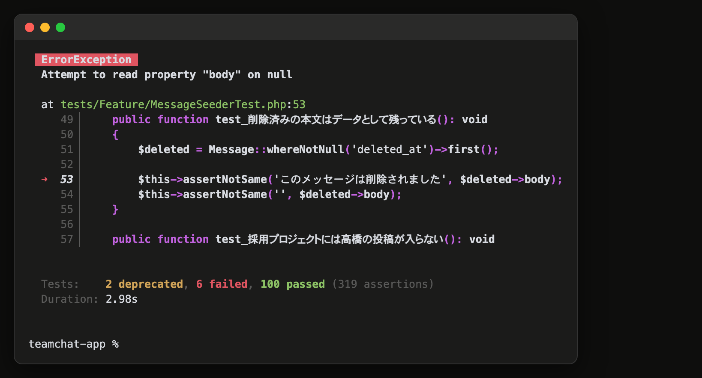

# 16-3-2: チャンネルとメッセージを作る

## 🎯 このセクションで学ぶこと

- 2本を回した経験から、実装を任せるサブエージェントを作れるようになる。
- 実装中に見つけた設計のズレを、設計書側から先に直して実装に戻せるようになる。
- 設計の机上の判断が実装で覆ることがある、と分かる。

---

## 導入

1周の形は16-3-1で通しました。ここからは自分の采配です。まずは直列で回す2本、チャンネルとメッセージを続けて回します。手順は前の節と同じなので、この節に置くのは、判断が要る場所と、この2本でしか出てこないものだけです。

---

## この2本も、計画から入る

16-3-1で作った `/start` は、読み終えたところでplanモードに入り、計画を出してから実装に進みます。この2本も同じ形で回します。

物差しは16-3-1と同じで、**空いている決めが残っているか**でした。認証は「何で作るか」が空いていました。この2本は、画面もテーブルも権限も文言も設計書が持っているので、そこは空いていません。それでも計画を立てるのは、計画に書くものが**設計書の写しではない**からです。書くのは、どの順で手を動かすかと、どこを見ればよいか。この2本はどちらも、モデル・マイグレーション・ポリシー・コントローラ・Blade・テストに跨ります。順番を先に決めておくと、途中で行ったり来たりしません。

計画を省くのは、`/start` に入れた分岐のとおり、**それを出すほどでもない小さい件**のときです。7本のイシューには、そういう件はありません。

---

## 設計に戻る型

実装を進めると、設計書の穴やズレがAIの聞き返しや実物の挙動から出てきます。ここで手を止めるかどうかが、この節でいちばん大きい判断です。

**コードだけ直して先に進みません**。先に直すのは設計書のほうです（16-1-6）。順番はこうなります。

1. 出てきたズレが、仕様書の決めか、設計書だけの決めかを見分ける。仕様書が決めていることなら、自分では決めずに確認事項として積む。設計書だけで決めたことなら、決めるのは自分
2. 決めたら `docs/design/` を直す
3. **そのイシューの受け入れ条件も、同じ文言に揃える**
4. 実装に戻る

3を飛ばすと、設計書と受け入れ条件が別のことを言い始めます。16-4-1で全体を突き合わせるときに、どちらが正しいのかを毎回考えることになります。

直した設計書は、**いま回しているイシューのブランチ**に一緒に乗せて、プルリクエストで受け取ります。設計をこう直したから実装がこうなった、という対応が1本の差分の中で読めるからです。16-3-1でも同じ形で2か所直しました。

どのイシューにも属さない直し（ハーネスの物差しや、全体に関わる設計書の修正）は、`chore/` のブランチを1本切って、そちらで受け取ります。16-3-1で `CLAUDE.md` に書いた決まりのとおりです。

---

## ✏️ 2本を回す

思いどおりに直らない・壊れたと感じたら、14-5-1（直らないときの型）へ。応急は `git restore .` です。

チャンネルから始めます。**メッセージに入るのは、チャンネルを完全に閉じてから**です。プルリクエストがマージされ、ブランチが消え、イシューが `Closed` になっているところまでを確かめてから次へ進みます。

イシュー1本が1セッションです（16-1-1）。フォルダでClaude Codeを起動し、名前を付けてから着手します。

```bash
# 自分のリポジトリのフォルダで実行する
claude
```

```text
/rename #2 チャンネル
```

メッセージへ移るときも、同じように開き直して `/rename #4 メッセージ` を打ちます。理由はこの節の最後に書きます。

1. 【自分】`/start` で着手する（16-3-1で作ったSkill。`main` を最新にしてブランチを切り、読んで、計画の持ち方まで提案してきます）
2. 【自分】提案された計画の持ち方を承認する。選んだ理由を1行、イシューかプルリクエストの本文に残す
3. 【AI】実装させる。この件で積む初期データも一緒に（16-2-4の割り付け）
4. 【自分⇄AI】聞き返しに答える。設計のズレなら、設計書と受け入れ条件を先に直させてから実装に戻す
5. 【自分】フックが回したテストと整形の結果と、`git diff` を読む
6. 【自分⇄AI】`/code-review` と `/review-diff` を当て、直させるものを決める（15-5-2）
7. 【自分⇄AI】`/uat` に受け入れ条件を回させ、自分でもブラウザで潰す
8. 【自分⇄AI】`/pr` でプルリクエストを出し、本文を読んでからマージさせる（16-3-1）
9. 【自分】セッションを区切ってから、メッセージへ移る

手を止めるのは、2・4・5・6・7・8です。

1は、どちらの周も同じ1行です。渡すのはイシューの番号なので、**チャンネルのイシューの番号**を入れます。

```text
/start 2
```

メッセージへ移るときは、**メッセージのイシューの番号**で `/start 4` です。この教材は「チャンネルが `#2`、メッセージが `#4`」として書いていますが、番号が違う人は自分のものに読み替えてください（16-3-1）。Skillが `main` を最新にしてから切るので、前のイシューのブランチに立ったままでも、そこのコミットを土台にした枝にはなりません。チャンネルをマージしたぶんは、このときに `main` へ降りてきます。

受け入れ条件のうち、**この件だけでは確かめられない行**が出てきます。チャンネルの「開いて書き込める」はメッセージができるまで確かめられず、「消したチャンネルの言葉で検索して0件」は検索ができるまで待ちます。16-2-4で見たとおり、これは設計書の抜けではありません。持ち越すと決めて、**プルリクエストの本文にそう書いてください**。あとで確かめ直したときも、同じように書き残します。

---

## チャンネル: 見てよい人かの判定

この件で作るのは一覧・作成・編集・削除ですが、いちばん効くのは**そのチャンネルを見てよい人かの判定**です。メッセージも検索も公開APIも、この判定の上に乗ります。

設計書は、ここで踏みやすい落とし穴を名指ししていました。**メンバーかどうかだけで判定しません**。チャンネルを作った人は、公開チャンネルでもメンバーの行を持ちます（16-2-4の割り付け）。メンバーかどうかだけを見ると、**公開チャンネルが作った人にしか見えなくなります**。公開なら社員は全員、プライベートならメンバーだけ、という順で見ます。

差し替えた `/review-diff` の物差しは、この件から本気で当たり始めます。16-3-1では半分が空振りしましたが、ここではモデルとポリシーが出てくるので、名前・重複・読みやすさ・認可の置き場所が全部当たります。

---

## メッセージ: 削除の決めが効いているかを測る

16-1-4で、メッセージの削除は行を消さずに「このメッセージは削除されました」を残す形に決めました。そのときに、Laravelが持っている論理削除の既定に任せない、というところまで決めています。実装では、その決めのとおりに書かせます。

**決めが効いていることは、外して測ると分かります**。テストが全部緑になったところで、`app/Models/Message.php` を開いて、クラスの外の取り込みに `use Illuminate\Database\Eloquent\SoftDeletes;` を、クラスの中に `use SoftDeletes;` を足します。この2行は**自分の手で**書いて、`./vendor/bin/sail artisan test` も自分で打ってください。AIに頼むと、16-2-3で組んだフックが編集の直後にテストを回して落ち、AIがその場で直しに入ります。

足して回すと、削除済みが残ることを確かめている行がまとめて落ちます。

> 💡 **出力例について**: AIの応答は毎回変わります。以下はあくまで一例です。文言が違っても、チェックリストの項目を満たしていれば問題ありません。

```text
$ ./vendor/bin/sail artisan test
  ⨯ 削除しても一覧から行が消えない
  ⨯ 削除済みは本文を出さずに置き換わり投稿者名と日時は残る
  ⨯ 画面では本文が置き換わり投稿者名と日時は残る
  ⨯ 確認の画面の件数に削除済みの行も入る
  ⨯ 編集済みと削除済みが1件以上ある
  ⨯ 削除済みの本文はデータとして残っている

  Tests:    2 deprecated, 6 failed, 100 passed (319 assertions)
```

落ち方の中身が、決めの理由をそのまま説明しています。一覧から行ごと消えるので「削除されました」が出なくなり、削除の確認画面の件数からも抜けます。列を名指しで数えても0が返ります。既定の論理削除は、消したものを問い合わせから黙って外すからです。

**読み終えたら、足した2行を消します**。この確かめ方は、このあと検索でもう一度使います（16-3-4）。

大事なのは順番です。この6本のテストが書けたのは、**設計書が先に決めていたから**です。設計が無ければ、削除済みが一覧に残ることを確かめるテストを思いつく理由がありません。

**削除の決めを外して回したテスト結果**



---

## 設計書の理由が、実装で覆るとき

もう1つ、この件で設計書のほうが間違っていた例が出ます。

返信元を指す列に連鎖削除（親が消えたら子も消す設定）を張るかどうかを、設計では「張っても動く場面がないので張らない」と決めていました。行が消えるのはチャンネルごと消すときだけで、そちらはチャンネルの列の連鎖削除で足りる、という読みです。

返信が付いたチャンネルを消そうとすると、こうなります。

```text
SQLSTATE[23000]: Integrity constraint violation: 1451 Cannot delete or update a parent row:
a foreign key constraint fails (`laravel`.`messages`,
CONSTRAINT `messages_parent_message_id_foreign` FOREIGN KEY (`parent_message_id`) ...)
```

チャンネルの連鎖削除は、そのチャンネルの行を1行ずつ消していきます。返信元の行が、その返信より先に消される順番になったところで、**同じテーブルの中の外部キーに引っかかります**。返信も同じチャンネルの行だから一緒に消える、という読みは合っていますが、**消える順番までは面倒を見てくれません**。

設計書の理由の段落を、測った結果に合わせて書き直し、受け入れ条件の確かめ方も「返信の付いたメッセージがあるチャンネルを、最後まで消せること」に変えます。

16-3-1のパスワードの上限と同じ形です。設計書は、決めそのものは正しくても、**理由や範囲を外していることがあります**。読んで見つかるものではなく、実装で踏んで初めて分かります。

> 💡 **TIP**: 返信を作るのはスレッドのイシューなので、この不具合は本来なら先のイシューで出るはずのものでした。「返信はチャンネルの一覧に混ざらない」を確かめるテストで返信の行を1件作ったので、ここで先に出ています。テストが先の機能のデータに手を伸ばすと、こういう順番になります。

---

## 実装を、別の担当に出す

2本回すと、セッションの中身が変わっているのが分かります。設計書の読み込み、実装、テストの直し、レビューの指摘。受け取ってよいかを判断するために空けておきたいところが、**実装のやり取りで埋まります**。`/context` を見ると、そのぶんが積まれています（14-5-2）。

15-3-3で調査役を作ったときと同じやり方で、実装も別の担当に出せます。開いたファイルも、直しの往復も、向こうのコンテキストに積まれ、こちらに返るのは報告だけです。

釣り合いが**1つあります**。サブエージェントは、走っているあいだ聞き返してきません。決まっていないことが残ったまま出すと、向こうが勝手に決めます。だから出すのは、**計画を承認したあと**です。範囲が固定されているので、聞き返すことがありません。16-3-1で「空いている決めが残っているならplanモード」と決めたことが、ここで効いてきます。

いま回した2本の実装を思い出しながら、担当を1人作ります。書き方は15-3-3と同じで、何が要るかを伝えて書かせます。

```text
このリポジトリに実装担当のサブエージェントを作って。
.claude/agents/implementer.md に置いて。

- 承認済みの計画に沿って、実装とテストを書く担当
- 設計書は docs/design/ にある。この件に関わるところを読んでから書く
- 使ってよい道具は、読むもの・書くもの・コマンドを打つもの
- テストが通るまで直す
- 報告には、何を作ったか・どのファイルを触ったか・テストの結果、の3つを必ず入れる
- 決まっていないことが出てきたら、勝手に決めない。「決めきれなかったこと」として報告に書いて止まる
```

最後の1行が効きます。**報告に書かれていないことは、こちらには何も残りません**（15-3-3）。向こうで勝手に決められると、決めたこと自体が見えないまま差分だけが返ってきます。止まって報告させれば、そこが判断の場所になります。

`.claude/agents/` は、このリポジトリではいま初めてできたフォルダです。Skillのときと同じで、フォルダが無い状態で始めたセッションからは呼べません（15-3-3）。`/exit` で閉じて、`claude -c` で開き直してください。

### 次のイシューから、出して受け取る

使うのは16-3-3からです。計画を承認したところで、実装をこの担当に出します。

```text
@agent-implementer 承認した計画のとおりに実装して。
```

返ってくるのは報告だけです。だからといって、**受け取り方は何も変わりません**。差分は `git diff` とレビューで自分が読み、受け入れ条件は自分で判定します。誰の手で書かれたかは、受け取りの物差しを動かしません。

報告にテストの結果を入れさせているのは、それが緑だったという**向こうの言い分**を、こちらの判定の入口にするためです。信じて終わりにはしません。手元でもう一度回します。

この担当も、`.claude/` だけの変更です。16-3-1と同じで、`chore/` のブランチに載せてプルリクエストで受け取ります。

---

---

## 出てきた穴の片づけ方

16-3-1で2つ塞ぎましたが、この2本を回すあいだにも、同じくらいの数の穴がまた出ます。物差しが判定できないところ、報告の形が決まっていないところが、使ってみて初めて分かります。

**1回直して終わりにはなりません**。片づけ方は16-3-1と同じで、イシューに紐づかない直しなので、アプリのコードを含まないプルリクエストを1本立てて塞ぎます。物差しは、使いながら育ちます。

---

## コンテキストを区切る

イシューを閉じたら、`/clear` でコンテキストを消すか、セッションそのものを分けます（14-5-2）。分けるほうを選んだときは、次のセッションにも `/rename #4 メッセージ` のように番号を入れた名前を付けておきます。

チャンネルを回したセッションには、その件で決めたことと、そのとき置いた前提が積み上がっています。そのままメッセージに入ると、前の件の判断が今の件の材料に混ざります。次の件が要るものは設計書とイシューに全部あるので、**空の状態から始めても困りません**。Chapter 1で節ごとに新しいセッションを開けたのと同じ理由です。

---

## ✅ ここまでの確認

- [ ] チャンネルとメッセージのプルリクエストがマージされ、イシューが2本とも `Closed` になっている
- [ ] `./vendor/bin/sail artisan test` の `failed` が0
- [ ] 件ごとに、計画の持ち方を選んだ理由が1行残っている
- [ ] `.claude/agents/implementer.md` があり、報告に3つ（作ったもの・触ったファイル・テストの結果）が入る決まりになっている
- [ ] メッセージの実装を実装役に出し、返ってきた差分を自分で読んだ
- [ ] 設計書を直した箇所が、そのイシューのブランチに入っている
- [ ] 直した設計書と、そのイシューの受け入れ条件が同じ文言になっている
- [ ] この件だけでは確かめられない行が、持ち越しとして本文に書いてある
- [ ] 削除したメッセージが、一覧から行ごと消えずに「このメッセージは削除されました」で残る

---

## ✨ まとめ

- 計画は、設計書の写しにしません。書くのは、どの順で手を動かすかと、どこを見ればよいかです。
- 実装は、計画を承認したあとなら別の担当に出せます。走っているあいだは聞き返してこないので、決めきってから出します。
- 実装中に設計のズレが出たら、設計書と受け入れ条件を先に直してから実装へ戻ります。
- 直した設計書は、そのイシューのブランチに乗せます。設計と実装の対応が、1本の差分の中で読めます。
- 決めが効いているかは、その決めを外して回すと分かります。落ち方が理由を説明します。
- 設計書は、決めが正しくても理由や範囲を外していることがあります。机上の判断は、実装で踏むまで確かめられません。
- ハーネスの穴は、使うたびに出ます。出たら、アプリのコードを含まないプルリクエストで塞ぎます。

---
