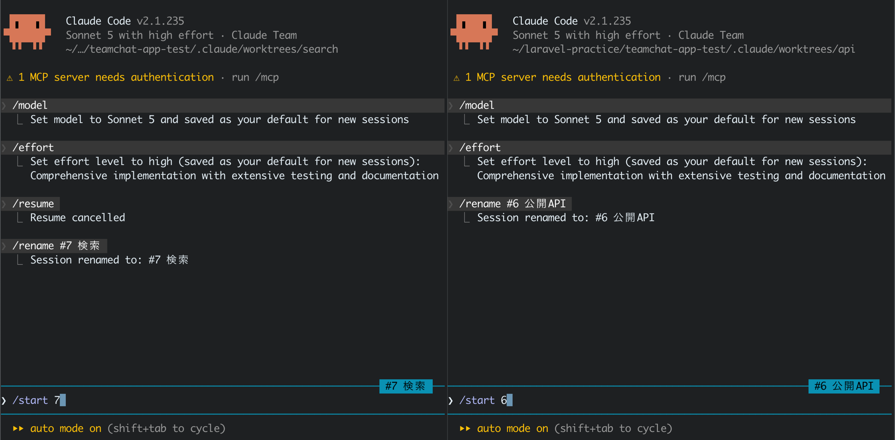
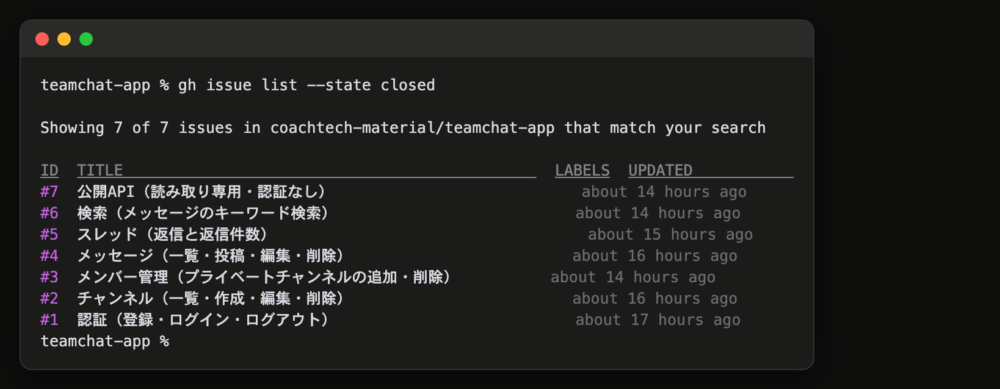

# 16-3-4: 残りを並行で消化する - 総合演習

## 📌 この演習について

残っているのは、検索と公開APIの2本です。この2本はお互いを必要としないので、並行させられます（16-2-4）。

回し方は16-3-1から16-3-3で通したものと同じです。新しく増えるのは、書く場所を2つに分けることと、その2つを1か所の検証に持ち込む手だけです。教材が渡すのは、課題と、この2本でしか出てこない受け取りの形です。

---

## 書く場所と、検証する場所をつなぐ

worktreeで書いた行は、**そのままでは1行も検証されません**。

Sailのコンテナは、`sail up -d` を打ったフォルダを中へ映しています。コンテナの中で動くPHPが読むのは、いつでも元のフォルダのファイルです。加えて、worktreeにはgitが管理しているファイルしか来ないので、`vendor/` がありません（15-5-1）。書く場所では、そもそも `./vendor/bin/sail` が存在しません。このリポジトリには `.worktreeinclude`（15-5-1）を置いていないので、`.env` も来ません。

そこで、**検証するあいだだけ**、元のフォルダの向きをそのブランチに合わせます。

```text
書く場所で書く → コミットする
→ 検証する場所で git checkout --detach <ブランチ> して持ち込む
→ 整形・テスト・ブラウザで確かめる
→ git switch main で戻す
```

同じブランチを2か所で開くことは、gitが止めます。`--detach` は枝を動かさずにコミットを直に指す形なので、こちらなら通ります。

この形には値段があります。書く場所で書いただけでは動かせないので、**コミットしないと検証できません**。

---

## 🎯 演習課題

### 📋 課題

必須は2本です。受け入れ条件は設計書一式にあるので、ここには写しません。イシューの本文にも同じ文言が入っています（16-2-4）。

| イシュー | 作るもの | この件の見どころ |
|:--|:--|:--|
| 検索 | 本文のキーワード検索 | 権限をポリシーに置けない唯一の機能 |
| 公開API | 公開チャンネルの一覧と、そのメッセージの一覧 | 画面が無いので、受け取りの証拠を自分で作る |

どちらの見どころも、実装中に知っていないと詰まります。この節の後半にまとめてあるので、その件に手を付ける前に読んでください。

**変えないもの**

これまでに作った5本の動きは、いまのままです。仕様書の「今回作らないもの」に挙がっているものも、この2本のついでに足しません。

**（任意）発展課題**

必須の2本を終えたあとに、余力があれば足せるものを挙げておきます。

| 発展課題 | 受け入れ条件の型 |
|:--|:--|
| メンション | 本文に社員の名前を書いた形が、メッセージの中で見分けが付く見た目になる |
| 新着の自動反映 | チャンネルを開いたまま別の人が書き込むと、画面を自分で操作しなくても増える |
| 公開APIを使う外部ページ | このアプリの外に置いた小さなページから、公開チャンネルの一覧が読める |

3本とも、**設計書がまだ何も決めていません**。作るなら、先に設計を一式へ足して、そこからイシューを切り出します（16-2-4）。順番を飛ばすと、受け入れ条件の出どころが無いまま実装だけが進みます。手順はここには書きません。ここまでの5本で通した形を、そのまま自分で当ててください。

### ⚠️ 1組しかない資源の取り合い

コードの衝突は、gitが教えてくれます。教えてくれないのは、**1組しかないもの**のほうです。

| 1組しかないもの | 何に使うか |
|:--|:--|
| Sailのコンテナ | アプリを動かす |
| 開発用のデータベース | 初期データを入れて画面で確かめる |
| ブラウザと、スクリーンショットの置き場 | UATの証拠を残す |

2本ぶんの検証を同じフォルダで行き来させると、片方の `migrate:fresh --seed` が、もう片方の確認の最中に走ります。テーブルが落ちている一瞬に当たった要求は500を返し、サイドバーが空の画面が出ます。**症状がアプリの不具合とそっくり**なので、原因にたどり着くまでに時間を取られます。2本を並行させたとき、実際にこれで1時間ほど失った落とし穴です。

だから、15-5-1の線をそのまま守ります。**並行させるのは書く場所だけで、受け取りは1か所で1件ずつ**です。そのうえで、次の3つを決めておきます。

- 元のフォルダの向きを変えるのは、確かめているあいだだけにする。終わったら `main` に戻す
- `migrate:fresh --seed` を打つ前に、もう1本の確認が途中でないかを見る
- スクリーンショットの名前を、イシューごとに分ける（片づけるときも自分の分だけ消す）

### ✏️ 進め方タスク

思いどおりに直らない・壊れたと感じたら、14-5-1（直らないときの型）へ。応急は `git restore .` です。

**Step 0: フックに1句足す**

書く場所には `vendor/` が来ません（15-5-1）。いまのフックはそこに `sail` があることを前提にしているので、このまま書く場所を開くと、**編集のたびに失敗して全部の編集が止まります**。15-5-1で足したのと同じ1句を、整形とテストの両方に足します。**`.claude/settings.json`** のフックの部分です。

フックの2本ぶんだけを抜き出すと、こうなります。

```json
      {
        "type": "command",
        "command": "test -x vendor/bin/sail || exit 0; ./vendor/bin/sail pint >&2"
      },
      {
        "type": "command",
        "command": "test -x vendor/bin/sail || exit 0; ./vendor/bin/sail artisan test >&2 || exit 2"
      }
```

この直しはどのイシューにも属さないので、`chore/` のブランチを1本切って進めます（16-3-1）。ここでも `main` を最新にしてから切ります（`chore/hook-guard` というブランチで進めたい、と頼めば足ります）。書き換えた設定はその場で読み直されます（15-4-1）。効きを確かめたらプルリクエストを出し、**書く場所を作る前に** `main` へマージしておいてください。書く場所は `main` から枝分かれするので、あとから入れると2つの書く場所のどちらにも届きません。

**Step 1: 並行の1組目を決めて、書く場所を作る**

1. 【自分】並行させる2本を確かめる。この2本は互いに依存しないので、そのまま並べられる
2. 【自分】検証する場所（元のフォルダ）を `main` の最新にしてから、書く場所を2つ作る

```text
検索と公開APIを並行で進めたい。main を最新にしてから、この2本ぶんの worktree を
../teamchat-search と ../teamchat-api に作って。ブランチ名は CLAUDE.md の決まりのとおりで。
```

15-5-1では `claude -w` に作らせましたが、ここでは `git worktree add` で作ります。ブランチ名を、16-3-1で `CLAUDE.md` に書いた決まりに合わせるためです。番号は自分のイシューのものに読み替えてください（16-3-1）。`git worktree list` の結果に3つ（元のフォルダと、書く場所2つ）並んでいるかを見てください。

**書く場所が2つ並んだところ**



> 💡 **TIP**: 書き換える場所が重なりにくいのは、画面のある機能と、画面を持たない公開APIの組です。検索が触るのは `routes/web.php` とモデル、公開APIが触るのは `routes/api.php` と `app/Http/Controllers/Api/` で、ほとんど重なりません。

**Step 2: 書く場所で作らせる**

書く場所ごとにターミナルを1枚開いて、そのフォルダへ移動してからセッションを起動します。検証する場所のぶんと合わせて、ターミナルは3枚になります。

```bash
# 書く場所のフォルダで実行する
cd ../teamchat-search
claude
```

15-5-1では `claude -w` が、フォルダ作りとセッションの起動をまとめて引き受けていました。gitに作らせた書く場所へは、自分で移動します。初めて開くフォルダなので、起動するとこのフォルダを信頼してよいかを聞かれます（15-4-2）。

3枚のターミナルで別々のセッションが動くので、どれがどの件かは名前で見分けます。起動したらすぐ付けてください。検索の場所なら、こうです。

```text
/rename #6 検索
```

公開APIの場所は `#7 公開API`、元のフォルダは `#6#7 検証` のように付けます。名前を付けておくと、閉じてしまっても `/resume` の一覧から選び直せます（14-5-2）。付けないと、一覧には会話の中身から自動で付いた似た名前が3つ並びます。

3. 【AI】書く場所ごとに実装させる（計画を承認すると `@agent-implement` に渡ります）。テストは書くだけで、実行はさせない（15-5-1）
4. 【AI】ひと区切りついたらコミットさせる。直しを重ねるあいだは `git commit --amend`（直前のコミットを置き換える形）で1つにまとめてよい

**Step 3: 検証する場所へ持ち込んで、1件ずつ受け取る**

5. 【自分】`main` の最新を見る。もう1本が先に入っていたら、**書く場所のセッションで**積み直させる（`rebase`）。コンフリクトもそこで解消させ、出てきた差分は自分が読む（15-5-3）
6. 【自分】元のフォルダの向きを、そのブランチのコミットに合わせる
7. 【自分⇄AI】整形・テスト・ブラウザで確かめ、`/review-diff` と `/uat` を当てる（15-5-2）
8. 【自分】終わったら `main` へ戻す

15-5-1では、受け取り用のブランチを作って受け取りました（`git switch -c receive-… origin/…`）。ここで枝を作らないのは、pushする前に測るからです。リモートにはまだ何も届いていないので、受け取る先がありません。打つ前に、元のフォルダの `git status` が空であることを確かめてください。書きかけが残っていると、持ち込んだコミットに自分の変更が混ざったまま測ることになります。

```text
検索のブランチのコミットに、このフォルダの向きを合わせて（枝は作らないで）。そのうえでテストを回して。
```

積み直しを、測るより前に置いています。先に入ったぶんが自分のコミットの下に積まれるので、**ここで初めて2本ぶんのテストが同じところで回ります**。pushしたあとで積み直すと、手元と送った先で履歴が食い違い、次のpushが通りません（12-1-4）。

**Step 4: 落ちたら書く場所へ戻す**

9. 【自分⇄AI】落ちた行と、画面で何が起きたかを書いて、書く場所のセッションに直させる。検証する場所では直しません（15-5-2）

直させてコミットしたら、6へ戻って向きを合わせ直させ、7をもう一度通します。元のフォルダは前のコミットを指したままなので、合わせ直さないと直したぶんが入りません。緑になるまで、6と7を回します。

**Step 5: 受け取ったらプルリクエストへ**

10. 【AI】書く場所からブランチをpushする
11. 【自分⇄AI】`/pr` でプルリクエストを出し、本文と「Files changed」を読んでからマージさせる（16-3-1）
12. 【自分】書く場所を片づける

```text
検索のぶんは受け取り終わったので、片づけて。main を最新にしてから、書く場所とブランチを消して。
```

ブランチを消すときに、「まだHEADに入っていない」という警告が出ることがあります。プルリクエストを積み直す形やまとめる形で受け取ると、`main` に載るのは別のコミットになるので、gitからはそう見えます。中身は同じなので、消して構いません。


手を止めるのは、1・2・5・6・7・8・9・11・12です。

**イシューが7本とも閉じたところ**



### ✅ 完成チェックリスト

- [ ] 7本のイシューが全部 `Closed` になっている
- [ ] `./vendor/bin/sail artisan test` の `failed` が0
- [ ] 2本それぞれの受け入れ条件が、全行そろっている（持ち越した行は、どこで確かめ直したかが書いてある）
- [ ] 計画の持ち方を選んだ理由が、件ごとにイシューかプルリクエストの本文に1行残っている
- [ ] 少なくとも2本を、書く場所を分けて並行で進めた
- [ ] `git worktree list` に、元のフォルダだけが残っている
- [ ] 元のフォルダが `main` に戻っている
- [ ] モックアップとの見た目の違いを、自分の言葉で説明できる範囲に収まっている

---

## 検索: 権限をポリシーに置けない1本

> 💡 **進行例について**: AIとの開発は毎回違う流れになります。ここに示すのは一つの進行例です。あなたの画面と違っていても、チェックリストを満たしていれば正解です。

検索が権限マトリクスの形に入らないことは、16-1-5で見たとおりです。実装でも判定をポリシーに置けず、その帰結が取り出すときの絞り込み2行になって出てきます。**見られるチャンネルに限ること**と、**削除済みを外すこと**です。チャンネルを見てよいかの判定は16-3-2で1か所に置いてあるので、それを呼ぶだけで済みます。

この2つを書き忘れても、**テストは緑のまま通ります**。書かなかったことを知らせてくれるものが無いからです。16-1-6で、検索と公開APIに「プライベートチャンネルの内容が漏れない」の行を独立して置かせたのは、この形の穴を人が確かめる窓口を作るためでした。

もう1つ、キーワードの記号をどう扱うかが、16-1-6の穴出しで挙がっていました。そこで決めたエスケープが効いているかは、16-3-2と同じやり方で測れます。テストが全部緑になったところでエスケープを外して回すと、`%` の1文字だけで当たる件数が増えます。ここでは1件が6件になりました。初期データの入ったデータベースで数えると、削除済みを除いた全部が並びます。外すのは、`git checkout --detach` で持ち込んだ元のフォルダです。書く場所には `vendor/` が来ないので、そちらでは測れません。外すのも戻すのも自分の手でやり、`./vendor/bin/sail artisan test` も自分で打ってください。理由は16-3-2と同じで、AIに頼むとフックのテストが落ちて、AIが直しに入ります。測ったらその場で戻し、`git status` を空にしてから次へ進みます（この直しはコミットしません）。

---

## 公開API: 画面が無い機能の受け取り

`/uat` のSKILL.mdには、ブラウザを動かす道具・開くURL・ログイン情報・スクリーンショットの置き場が書いてあります。**この4つとも、公開APIには当てはまりません**。画面が無く、ログインしないのが正で、撮るものがありません。

残るのは「受け入れ条件を1行ずつ、満たしているかと、そう判断した理由を証拠つきで報告する」という芯だけです。証拠の作り方は、自分で決めることになります。

| 確かめたいこと | 証拠の作り方 |
|:--|:--|
| 求めた形で返っているか | `curl`（11-1-4）で叩く。ブラウザのアドレス欄と同じ経路になる |
| 見えてはいけないものが出ていないか | 応答の中にその言葉が1回も出てこないことを数える（`grep -c` が0） |
| 存在しない番号と、見えない番号の見分けが付かないか | 2つの応答を突き合わせて、差が無いことを見る（`diff`） |

コマンドを自分で組み立てる必要はありません。何を確かめたいかを渡してAIに叩かせ、返ってきた応答を自分が読みます。

画面のときは「ページの中にその文字が出ていない」で確かめていました。APIでは応答そのものが手に入るので、**1バイトも違わないところまで見られます**。

この件では、素直に書くと受け入れ条件を満たせない場所が1つあります。見つからなかったときに `abort(404, '…')` で返すと、Laravelは**HTMLのエラー画面**を返します。

```text
$ curl -i http://localhost/api/channels/4/messages
HTTP/1.1 404 Not Found
Content-Type: text/html; charset=UTF-8
...
<!DOCTYPE html>
```

LaravelがJSONを返すのは、JSONを期待している要求のときだけです。ブラウザのアドレス欄も `curl` も、そうは名乗りません。受け入れ条件は「アドレス欄にURLを入れて確かめる」と書いてあるので、この経路で文言が入っていないと合格しません。**返す形をコントローラで組み立てる**ようにすると、求めた文言がそのまま返ります。

削除済みを外す1行は、ここでも要ります。書き忘れると、消したはずの本文が**ログインしていない相手にも**出ます。同じデータで、画面側には「このメッセージは削除されました」が残り、APIには何も出ないのが正しい形です。取り出す向きを経路ごとに書く、という16-1-4の決めが、いちばん外側の出口で効いています。

---

## コンフリクトの解消

並行させた2本を積み直すと、ぶつかるのは**2本が同じ1行を書き換えたところ**だけです。片方が足した行と、もう片方が足した行が別の場所にあれば、gitが自動でつなぎます。

実際にぶつかったのは2か所で、どちらも意外な場所でした。1つは、ルートを並べたファイルの先頭に置いた**説明のコメント1行**です。ルートの定義そのものは自動でつながり、「このファイルには何の分が入っているか」を書いた1行だけが残りました。解消は、どちらかを選ぶのではなく**両方を足す**ことです。

もう1つは、2本が同じ回に、同じ場所へ、それぞれ別の共通処理を切り出していた例です。どちらも `/review-diff` の重複の観点から出てきた直しで、置き場所まで一致していました。ここでも取るのは両方です。あわせて、**使われなくなった取り込みの行は、両方消すのが正解**になります。整形の道具は消してくれないので、印だけ外して通すと、使っていない行が残ります。

解消はAIにさせて構いません。出てきた差分は自分が読みます（15-5-3）。

---

## 💡 ヒント

**使用枠が減ってきた**

`/usage` で残りを見てください（14-1-6）。ぶつかりそうなら、15-5-3と同じで、並行を畳んで1件ずつ直列に戻して構いません。速さは進め方の都合で、受け取りの基準は動きません。

**手が止まったとき**

同梱の道具の一覧を、15-3-5にまとめてあります。自分で作った物差しの前に、公式のものが同じことをしていないかを見てください。

**受け入れ条件が、この件だけでは埋まらない**

16-3-2と同じ扱いです。持ち越すと決めて本文に書き、あとで確かめ直したときにも書き残します。どこまで進めても埋まらない行は、16-4-1の全体の受け入れで拾います。

---

## 🚀 まとめ

- 並行で困るのはコードの衝突ではありません。1組しかないコンテナとデータベースを、2本ぶんの検証で取り合うほうです。受け取りは1か所で1件ずつ通します。
- 書く場所と検証する場所は、コミットしてから向きを合わせてつなぎます。worktreeには `vendor` も `.env` も来ません。
- 検索の権限は、取り出すときの絞り込みに乗ります。ポリシーには置けません。書き忘れてもテストは緑のままなので、受け入れ条件の側に確かめる行を置いてあります。
- 画面が無い機能では、証拠の作り方を自分で決めます。応答そのものを数える・突き合わせるところまでできます。
- コンフリクトは、2本が同じ1行を書き換えたところにだけ出ます。片方を選ぶとは限らず、両方残すことも、両方消すこともあります。

7本を作り切りました。ここから先は、1本ずつでは見えないものを見ます。

---
