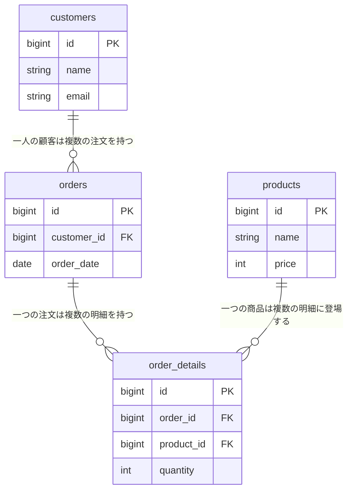

# Tutorial 8-1-5: データベース設計の基礎（正規化とER図）

## 🎯 このセクションで学ぶこと

*   正規化が「データの重複をなくし、効率的なデータ管理を目指すための手順」であることを理解する。
*   第1正規形から第3正規形までの基本的な考え方を説明できるようになる。
*   ER図（エンティティ・リレーションシップ図）が「データベースの設計図」であり、テーブル間の関係を視覚的に表現するものであることを理解する。
*   ER図の基本的な記法（エンティティ、アトリビュート、リレーションシップ）を読み取れるようになる。

---

## 導入

これまでのセクションで、データベースの基本的な考え方として「テーブルを適切に分割し、キーで関係付ける」ことの重要性を学んできました。では、具体的に**「どのように分割すれば適切なのか？」**という疑問が湧いてくるはずです。

その設計指針となるのが、正規化（Normalization）という理論です。また、その設計結果を視覚的に分かりやすく表現するための図が、ER図（Entity-Relationship Diagram）です。

このセクションでは、データベース設計の入り口として、正規化の基本的な考え方とER図の読み方について学びます。これらは少し理論的な内容になりますが、良いデータベースを設計するための揺るぎない土台となります。「今は完全に理解できなくても大丈夫」という気持ちで、まずは全体像を掴んでいきましょう。

---

## 詳細解説

### 🧼 正規化 (Normalization): テーブルを「お掃除」する手順

**正規化**とは、一言で言えば、**データの重複（冗長性）を排除し、データの一貫性を保ちやすくするためにテーブルを分割していく一連のルールのこと**です。散らかった部屋をルールに従って整理整頓していく作業に似ています。

正規化にはいくつかの段階があり、それぞれ**第1正規形、第2正規形、第3正規形...** と呼ばれます。実務では、多くの場合、第3正規形まで満たされていれば十分に良い設計と見なされます。

#### 第1正規形: 「一つのマスには、一つの値」

**第1正規形**のルールは非常にシンプルです。

> **ルール: テーブルの一つのセル（マス）には、一つの値しか含めてはならない。**

**悪い例（非正規形）**

| 注文ID | 顧客名 | 購入商品 |
| :--- | :--- | :--- |
| 101 | 山田 太郎 | りんご, みかん |
| 102 | 鈴木 花子 | ぶどう |

この表では、「購入商品」カラムに「りんご, みかん」という**複数の値がカンマ区切りで入ってしまっています**。これは第1正規形のルールに違反しています。なぜなら、これでは「りんご」だけで検索したり、商品の個数を集計したりすることが非常に困難になるからです。

**良い例（第1正規形）**

この問題を解決するには、レコードを分割します。

| 注文ID | 顧客名 | 購入商品 |
| :--- | :--- | :--- |
| 101 | 山田 太郎 | りんご |
| 101 | 山田 太郎 | みかん |
| 102 | 鈴木 花子 | ぶどう |

これで、一つのセルには一つの値しか入っていない状態になりました。これが第1正規形です。

#### 第2正規形: 「部分的な依存をなくす」

第2正規形は、**複合主キー**（複数のカラムを組み合わせて主キーとする場合）に関連するルールです。少し複雑ですが、考え方は「**主キーの一部だけに依存しているカラムを別のテーブルに切り出す**」というものです。

**悪い例（第1正規形だが、第2正規形ではない）**

主キーが `(注文ID, 商品ID)` の複合主キーであるテーブルを考えます。

| `注文ID` | `商品ID` | 注文日 | 商品名 | 単価 | 数量 |
| :--- | :--- | :--- | :--- | :--- | :--- |
| 101 | P01 | 2023-10-26 | りんご | 150 | 3 |
| 101 | P02 | 2023-10-26 | みかん | 100 | 5 |
| 102 | P03 | 2023-10-27 | ぶどう | 500 | 1 |

このテーブルでは、
*   `注文日`は`注文ID`だけで決まります。（`商品ID`には依存しない）
*   `商品名`と`単価`は`商品ID`だけで決まります。（`注文ID`には依存しない）
*   `数量`は`注文ID`と`商品ID`の両方があって初めて決まります。

このように、`注文日`や`商品名`などが主キーの**一部にしか依存していない**状態を、部分関数従属（用語として覚える必要はない）と呼びます。これを解消するためにテーブルを分割します。

**良い例（第2正規形）**

1.  **注文テーブル**: `注文ID`に依存する情報
    | `注文ID` | 注文日 |
    | :--- | :--- |
    | 101 | 2023-10-26 |
    | 102 | 2023-10-27 |
2.  **商品テーブル**: `商品ID`に依存する情報
    | `商品ID` | 商品名 | 単価 |
    | :--- | :--- | :--- |
    | P01 | りんご | 150 |
    | P02 | みかん | 100 |
    | P03 | ぶどう | 500 |
3.  **注文明細テーブル**: `注文ID`と`商品ID`の両方に依存する情報
    | `注文ID` | `商品ID` | 数量 |
    | :--- | :--- | :--- |
    | 101 | P01 | 3 |
    | 101 | P02 | 5 |
    | 102 | P03 | 1 |

これで、部分関数従属が解消され、第2正規形を満たしたことになります。

#### 第3正規形: 「主キー以外への依存をなくす」

第3正規形のルールは、「**主キー以外のカラムに依存しているカラムを別のテーブルに切り出す**」というものです。これを推移的関数従属（用語として覚える必要はない）の解消と呼びます。

**悪い例（第2正規形だが、第3正規形ではない）**

社員情報を管理するテーブルを考えます。主キーは `社員ID` です。

| `社員ID` | 氏名 | 所属部署ID | 所属部署名 |
| :--- | :--- | :--- | :--- |
| E01 | 山田 太郎 | D01 | 営業部 |
| E02 | 鈴木 花子 | D02 | 開発部 |
| E03 | 佐藤 次郎 | D01 | 営業部 |

このテーブルでは、`所属部署名`は主キーである `社員ID` に直接依存しているわけではありません。`所属部署名`は`所属部署ID`によって決まります。つまり、`社員ID` → `所属部署ID` → `所属部署名` という**推移的な依存関係**が存在します。

これでは、「営業部」が「第一営業部」に名称変更された場合、`所属部署ID`が`D01`の全てのレコードを修正する必要があり、更新異常の原因となります。

**良い例（第3正規形）**

この推移的依存を解消するために、部署情報を別のテーブルに切り出します。

1.  **社員テーブル**
    | `社員ID` | 氏名 | 所属部署ID |
    | :--- | :--- | :--- |
    | E01 | 山田 太郎 | D01 |
    | E02 | 鈴木 花子 | D02 |
    | E03 | 佐藤 次郎 | D01 |
2.  **部署テーブル**
    | `部署ID` | 部署名 |
    | :--- | :--- |
    | D01 | 営業部 |
    | D02 | 開発部 |

これで、部署名が変更されても、部署テーブルの1行を修正するだけで済みます。これが第3正規形です。

### 🗺️ ER図 (Entity-Relationship Diagram): データベースの設計図

**ER図**とは、データベースのテーブル（エンティティ）とそのカラム（アトリビュート）、そしてテーブル間の関係（リレーションシップ）を視覚的に表現した設計図のことです。

家を建てる前に設計図が必要なように、複雑なシステムを作る際にはデータベースの設計図であるER図が不可欠です。

#### ER図の基本記法 (IE記法)

ER図にはいくつかの記法がありますが、ここでは最も一般的な**IE記法（鳥の足記法）**を紹介します。

以下は、顧客、注文、注文明細、商品の4つのテーブルからなるER図の例です。

> 💡 **TIP**: ER図のテーブル名やカラム名は、**英語で記述するのが一般的**です。実務では、チームに外国人メンバーがいることも多く、SQLのキーワードとの統一性の観点からも、英語名が標準となっています。

#### Mermaid記法の読み方

上記の図は、**Mermaid**というテキストから図を生成するツールの記法で書かれています。GitHubや多くのMarkdownエディタでそのまま表示できます。

リレーションシップの記号の意味は以下の通りです。

| 記号 | 意味 | 説明 |
| :--- | :--- | :--- |
| `\|\|` | 「1」（必須） | 必ず1つ存在する |
| `o{` | 「多」（任意） | 0以上存在する可能性がある |
| `\|{` | 「多」（必須） | 1つ以上必ず存在する |
| `o\|` | 「1」（任意） | 0または1つ存在する |

#### カーディナリティとオプショナリティ

リレーションシップの記号は、2つの情報を表しています。

1. **カーディナリティ（多重度）**：「1」か「多」か
2. **オプショナリティ（任意性）**：「必須」か「任意」か

| 記号 | カーディナリティ | オプショナリティ | 意味 |
| :--- | :--- | :--- | :--- |
| `\|` | 1 | 必須 | 必ず1つ存在する |
| `o` | - | 任意 | 存在しなくても良い（0でも良い） |
| `{` または `<` | 多 | - | 複数存在する可能性がある |

**例：ユーザーと投稿の関係**

`customers ||--o{ orders` を読み解くと：

- **customers側 `||`**：注文は、**必ず1人**の顧客に紐付く必要がある（必須・1）
- **orders側 `o{`**：顧客は、注文を**持っていなくても良い（0件でも良い）**し、**複数持っても良い**（任意・多）

この記法を理解すれば、ER図を見るだけで、テーブル間の詳細なルールを読み解くことができます。

例えば、`customers ||--o{ orders` は、「一人の顧客は、0件以上の注文を持つことができる（1対多）」と読み取れます。

*   **エンティティ (Entity)**: 四角形で表現され、データベースの**テーブル**に相当します。（例: `customers`, `orders`）
*   **アトリビュート (Attribute)**: エンティティの中に記述され、テーブルの**カラム**に相当します。主キーには `(PK)`、外部キーには `(FK)` と印を付けます。
*   **リレーションシップ (Relationship)**: エンティティ間を結ぶ線で表現されます。線の両端の記号（**カーディナリティ**）が、テーブル間の関係（1対1、1対多、多対多）を示します。
    *   `---` (一本線): 「1」を表す。
    *   `---<` (鳥の足): 「多」を表す。

上の図は、以下のような関係を示しています。

*   `customers` と `orders` の関係: `customers` の一本線と`orders` の鳥の足が繋がっているので、「**一人の顧客は複数の注文を持つことができる（1対多）**」と読み取れます。
*   `orders` と `order_details` の関係: 「**一つの注文は複数の注文明細を持つことができる（1対多）**」
*   `products` と `order_details` の関係: 「**一つの商品は複数の注文明細に登場することができる（1対多）**」

ER図を描くことで、データベースの全体像を俯瞰し、チームメンバーと設計について議論したり、実装時の参照資料として使ったりすることができます。

---

## ✨ まとめ

このセクションでは、データベース設計の基礎となる正規化とER図について学びました。

*   **正規化**: データの重複をなくし、一貫性を保つためにテーブルを分割していく設計手順。
    *   **第1正規形**: 1つのセルに1つの値。
    *   **第2正規形**: 主キーの一部だけに依存するカラムを分離。
    *   **第3正規形**: 主キー以外のカラムに依存するカラムを分離。
*   **ER図**: データベースの設計図。テーブル（**エンティティ**）、カラム（**アトリビュート**）、テーブル間の関係（**リレーションシップ**）を視覚的に表現する。
*   IE記法では、線の端の記号（カーディナリティ）で**1対多**などの関係を示す。

正規化やER図は奥が深く、専門的に学ぶと非常に高度な内容になります。しかし、初学者の段階では、「**なぜ正規化が必要なのか**」という根本的な理由と、「**ER図が何を表しているのか**」を大まかに読み取れるレベルであれば十分です。これらの知識は、今後のLaravelでの開発においてモデル間の関係を定義する際に必ず役立ちます。

---
