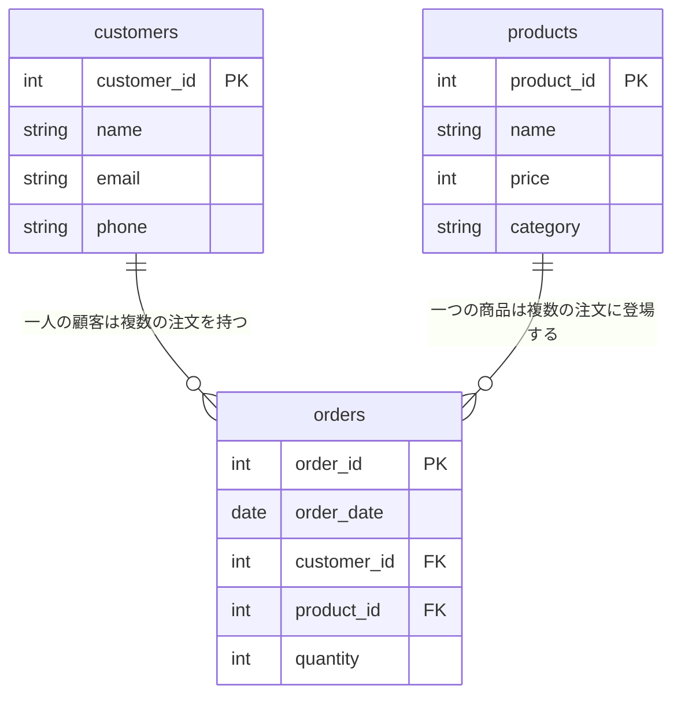

# Tutorial 8-1-6: データベースの基礎 - ハンズオン演習

## 📝 このセクションの目的

Chapter 1で学んだデータベースの基礎知識を、紙とペンを使って確認します。正規化されていないテーブルを正規化する演習を通じて、データベース設計の考え方を身につけましょう。

> 💡 **ポイント**: この演習は、実際にデータベースを操作するのではなく、**紙に書いて設計を考える**演習です。データベース設計は、コードを書く前に「どのようなテーブル構造にするか」を考えることが重要です。

**学習のポイント**：
- 正規化されていないテーブルの問題点を理解できるか
- 第1正規形、第2正規形、第3正規形の違いを理解できるか
- テーブルを適切に分割できるか
- 主キーと外部キーの関係を設計できるか

---

## 🎯 演習課題：注文管理テーブルの正規化

### 課題の概要

以下の「正規化されていない注文管理テーブル」を見て、問題点を洗い出し、正規化されたテーブル構造に分割してください。

**紙とペンを用意して、実際に書きながら考えてみましょう。**

---

### 📋 正規化されていないテーブル

以下は、ある通販サイトの注文管理テーブルです。1つのテーブルにすべての情報が詰め込まれています。

**orders（注文）テーブル**

| order_id | order_date | customer_name | customer_email | customer_phone | product_name | product_price | quantity | category |
|----------|------------|---------------|----------------|----------------|--------------|---------------|----------|----------|
| 1 | 2024-12-01 | 田中太郎 | tanaka@example.com | 090-1234-5678 | ノートPC | 120000 | 1 | 電化製品 |
| 2 | 2024-12-01 | 田中太郎 | tanaka@example.com | 090-1234-5678 | マウス | 3000 | 2 | 電化製品 |
| 3 | 2024-12-02 | 佐藤花子 | sato@example.com | 080-2345-6789 | ノートPC | 120000 | 1 | 電化製品 |
| 4 | 2024-12-03 | 田中太郎 | tanaka@example.com | 090-1234-5678 | キーボード | 8000 | 1 | 電化製品 |
| 5 | 2024-12-03 | 鈴木一郎 | suzuki@example.com | 070-3456-7890 | デスク | 25000 | 1 | 家具 |

---

### 📝 演習1: 問題点を見つける

上のテーブルを見て、以下の問題点を紙に書き出してください。

**考えるヒント**：
- 同じ情報が何度も繰り返し登場していませんか？
- 顧客の電話番号を変更したい場合、何行を更新する必要がありますか？
- 商品の価格を変更したい場合、何行を更新する必要がありますか？

---

### 📝 演習2: テーブルを分割する

問題点を踏まえて、このテーブルを複数のテーブルに分割してください。

**考えるヒント**：
- 「顧客」に関する情報をまとめると？
- 「商品」に関する情報をまとめると？
- 「注文」に関する情報をまとめると？
- テーブル間をどうやって関連付けますか？

---

### 📝 演習3: ER図を描く

分割したテーブル間の関係を、ER図として紙に描いてください。

**描くべき内容**：
- 各テーブルの名前とカラム
- 主キー（PK）と外部キー（FK）
- テーブル間のリレーション（1対多など）

---

## 💡 ヒント

詰まったときは、以下のヒントを参考にしてください。

> 💡 **ヒントの見方**：以下のヒントは**段階的に答えに近づく**ものです。まずは自分で考えてから、順番に見てください。

### ヒント1: 問題点のリスト

このテーブルには、以下のような問題点があります：

1. **データの重複**：田中太郎さんの情報（名前、メール、電話番号）が3回登場している
2. **更新の困難さ**：田中太郎さんの電話番号を変更するには、3行を更新する必要がある
3. **データの不整合リスク**：3行のうち1行だけ電話番号を変更し忘れると、データが矛盾する
4. **商品情報の重複**：ノートPCの情報（名前、価格、カテゴリ）が2回登場している

### ヒント2: 分割するテーブルの候補

以下の3つのテーブルに分割することを考えてみましょう：

1. **customers（顧客）テーブル**：顧客に関する情報
2. **products（商品）テーブル**：商品に関する情報
3. **orders（注文）テーブル**：注文に関する情報（顧客と商品を外部キーで参照）

### ヒント3: 各テーブルのカラム

**customers（顧客）テーブル**：
- customer_id（主キー）
- name
- email
- phone

**products（商品）テーブル**：
- product_id（主キー）
- name
- price
- category

**orders（注文）テーブル**：
- order_id（主キー）
- order_date
- customer_id（外部キー → customers）
- product_id（外部キー → products）
- quantity

---

## 🏃 実践: 一緒に考えてみましょう！

ちゃんとできましたか？正規化は、データベース設計の基本中の基本です。一緒に考え方を確認していきましょう。

### 💭 正規化の思考プロセス

正規化を行う際は、以下の順番で考えると効率的です：

1. **繰り返しを見つける**：同じ情報が複数行に登場していないか？
2. **グループ化する**：関連する情報をまとめて、独立したテーブルにできないか？
3. **主キーを決める**：各テーブルで、レコードを一意に識別できるカラムは何か？
4. **外部キーで関連付ける**：分割したテーブル同士を、どうやって関連付けるか？

---

### 📝 ステップバイステップで考える

#### ステップ1: 問題点を整理する【演習1に対応】

元のテーブルを見ると、以下の問題点があります：

**問題1: 顧客情報の重複**

田中太郎さんの情報が3行に登場しています：

| order_id | customer_name | customer_email | customer_phone |
|----------|---------------|----------------|----------------|
| 1 | 田中太郎 | tanaka@example.com | 090-1234-5678 |
| 2 | 田中太郎 | tanaka@example.com | 090-1234-5678 |
| 4 | 田中太郎 | tanaka@example.com | 090-1234-5678 |

→ 電話番号を変更するには、3行すべてを更新する必要があります。

**問題2: 商品情報の重複**

ノートPCの情報が2行に登場しています：

| order_id | product_name | product_price | category |
|----------|--------------|---------------|----------|
| 1 | ノートPC | 120000 | 電化製品 |
| 3 | ノートPC | 120000 | 電化製品 |

→ 価格を変更するには、2行を更新する必要があります。

---

#### ステップ2: テーブルを分割する【演習2に対応】

問題点を踏まえて、以下の3つのテーブルに分割します。

**テーブル1: customers（顧客）**

| カラム名 | 説明 | 制約 |
|---------|------|------|
| customer_id | 顧客ID | 主キー |
| name | 顧客名 | NOT NULL |
| email | メールアドレス | UNIQUE, NOT NULL |
| phone | 電話番号 | |

**テーブル2: products（商品）**

| カラム名 | 説明 | 制約 |
|---------|------|------|
| product_id | 商品ID | 主キー |
| name | 商品名 | NOT NULL |
| price | 価格 | NOT NULL |
| category | カテゴリ | |

**テーブル3: orders（注文）**

| カラム名 | 説明 | 制約 |
|---------|------|------|
| order_id | 注文ID | 主キー |
| order_date | 注文日 | NOT NULL |
| customer_id | 顧客ID | 外部キー → customers |
| product_id | 商品ID | 外部キー → products |
| quantity | 数量 | NOT NULL |

---

#### ステップ3: 分割後のデータを確認する

分割後、各テーブルのデータは以下のようになります。

**customers（顧客）テーブル**：

| customer_id | name | email | phone |
|-------------|------|-------|-------|
| 1 | 田中太郎 | tanaka@example.com | 090-1234-5678 |
| 2 | 佐藤花子 | sato@example.com | 080-2345-6789 |
| 3 | 鈴木一郎 | suzuki@example.com | 070-3456-7890 |

→ 田中太郎さんの情報は**1行だけ**になりました！

**products（商品）テーブル**：

| product_id | name | price | category |
|------------|------|-------|----------|
| 1 | ノートPC | 120000 | 電化製品 |
| 2 | マウス | 3000 | 電化製品 |
| 3 | キーボード | 8000 | 電化製品 |
| 4 | デスク | 25000 | 家具 |

→ ノートPCの情報は**1行だけ**になりました！

**orders（注文）テーブル**：

| order_id | order_date | customer_id | product_id | quantity |
|----------|------------|-------------|------------|----------|
| 1 | 2024-12-01 | 1 | 1 | 1 |
| 2 | 2024-12-01 | 1 | 2 | 2 |
| 3 | 2024-12-02 | 2 | 1 | 1 |
| 4 | 2024-12-03 | 1 | 3 | 1 |
| 5 | 2024-12-03 | 3 | 4 | 1 |

→ 顧客と商品は**IDで参照**するようになりました！

---

#### ステップ4: ER図を描く【演習3に対応】

分割したテーブル間の関係をER図で表します。



**リレーションシップの説明**：
- **customers ← orders**：1対多（1人の顧客は複数の注文を持つ）
- **products ← orders**：1対多（1つの商品は複数の注文に登場する）

---

### ✨ 正規化のメリット

正規化によって、以下のメリットが得られました：

| 問題 | 正規化前 | 正規化後 |
|------|---------|---------|
| 田中太郎さんの電話番号を変更 | 3行を更新 | 1行を更新 |
| ノートPCの価格を変更 | 2行を更新 | 1行を更新 |
| データの不整合リスク | 高い | 低い |
| ストレージ使用量 | 多い（重複データ） | 少ない |

---

## ✅ 完成イメージ

### 正規化後のテーブル構造

**customers（顧客）**

| カラム名 | データ型 | 制約 |
|---------|---------|------|
| customer_id | INT | PRIMARY KEY |
| name | VARCHAR(100) | NOT NULL |
| email | VARCHAR(150) | UNIQUE, NOT NULL |
| phone | VARCHAR(20) | |

**products（商品）**

| カラム名 | データ型 | 制約 |
|---------|---------|------|
| product_id | INT | PRIMARY KEY |
| name | VARCHAR(200) | NOT NULL |
| price | INT | NOT NULL |
| category | VARCHAR(50) | |

**orders（注文）**

| カラム名 | データ型 | 制約 |
|---------|---------|------|
| order_id | INT | PRIMARY KEY |
| order_date | DATE | NOT NULL |
| customer_id | INT | FOREIGN KEY → customers |
| product_id | INT | FOREIGN KEY → products |
| quantity | INT | NOT NULL |

---

## 🔍 よくある間違い

### 間違い1: 分割しすぎる

```
❌ 間違い：
- customers_names テーブル（名前だけ）
- customers_emails テーブル（メールだけ）
- customers_phones テーブル（電話番号だけ）

✅ 正しい：
- customers テーブル（顧客に関する情報をまとめる）
```

→ 関連する情報は、1つのテーブルにまとめましょう。

### 間違い2: 外部キーを忘れる

```
❌ 間違い：
orders テーブルに customer_id がない
→ どの顧客の注文か分からない

✅ 正しい：
orders テーブルに customer_id（外部キー）を持つ
→ customers テーブルと関連付けられる
```

### 間違い3: 主キーを設定しない

```
❌ 間違い：
customers テーブルに主キーがない
→ 同じ名前の顧客を区別できない

✅ 正しい：
customer_id を主キーとして設定
→ 各顧客を一意に識別できる
```

---

## 📚 まとめ

このハンズオンでは、正規化されていないテーブルを正規化する演習を行いました。

**学んだこと**：

1. **正規化の目的**：データの重複を排除し、更新の困難さやデータの不整合を防ぐ
2. **テーブル分割の考え方**：関連する情報をグループ化し、独立したテーブルにする
3. **主キーと外部キー**：テーブルを分割した後、外部キーで関連付ける
4. **ER図の描き方**：テーブル間の関係を視覚的に表現する

次のセクションでは、実際にMySQLを使ってデータベースを操作していきます。
