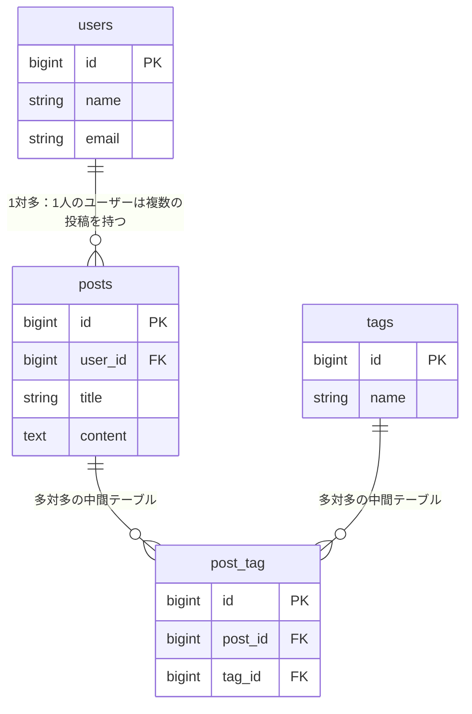

# Tutorial 8-3-1: リレーションシップの実装準備

## 🎯 このセクションで学ぶこと

- Chapter 1で学んだリレーションシップの概念を復習する
- このチャプターで実装するテーブル構成を確認する

---

## 📝 復習：リレーションシップとは

Chapter 1で学んだ内容を簡単に振り返りましょう。

### なぜテーブルを分けるのか？

1つのテーブルにすべての情報を詰め込むと、**データの重複**や**更新の困難さ**が発生します。

**悪い例（1つのテーブルにすべてを詰め込む）**：

| user_id | user_name | user_email | post_id | post_content |
|---------|-----------|------------|---------|--------------|
| 1 | 田中太郎 | tanaka@example.com | 101 | 今日は良い天気！ |
| 1 | 田中太郎 | tanaka@example.com | 102 | 昼食はパスタ。 |
| 2 | 佐藤花子 | sato@example.com | 103 | プログラミング楽しい！ |

→ 田中太郎さんのメールアドレスを変更するには、2行を更新する必要があります。

**良い例（テーブルを分割する）**：

テーブルを分割し、**外部キー**で関連付けることで、この問題を解決できます。

> 💡 **詳しくは**：Tutorial 8-1-4（主キーと外部キー）、Tutorial 8-1-5（正規化とER図）を参照してください。

### リレーションシップの3パターン

| パターン | 説明 | 例 |
|:---|:---|:---|
| **1対多** | 1つのレコードが複数のレコードと関連 | 1人のユーザー → 複数の投稿 |
| **多対多** | 両方のレコードが互いに複数と関連 | 投稿 ↔ タグ |
| **1対1** | 1つのレコードが1つのレコードと関連 | ユーザー → プロフィール |

このチャプターでは、**1対多**と**多対多**の実装方法を学びます。

---

## 🎯 このチャプターで作るもの

このチャプターでは、以下のテーブル構成を実際にSQLで実装します。

### 全体像



> 💡 **注意**：このER図は、リレーションシップを理解するために主要なカラムのみを表示しています。実際に作成するテーブルには、`password`、`created_at`、`updated_at`などのカラムも含まれます。詳細は各セクションの`CREATE TABLE`文を参照してください。

### 学習の流れ

| セクション | 内容 | 作成するテーブル |
|:---|:---|:---|
| **8-3-2** | 1対多のリレーションシップ | users, posts |
| **8-3-3** | 多対多のリレーションシップ | tags, post_tag |
| **8-3-4** | JOINによるデータ結合 | （テーブル作成なし） |
| **8-3-5** | ハンズオン演習 | 総合演習 |

---

## 🛠️ 事前準備：practice_dbを使用する

このチャプターでは、Tutorial 8-2-1で作成した`practice_db`データベースを使用します。

### Docker環境の起動確認

ターミナルで以下のコマンドを実行し、Docker環境が起動していることを確認してください。

```bash
cd ~/mysql-practice
docker-compose ps
```

`mysql`と`phpmyadmin`が`Up`状態であれば準備完了です。

もし起動していない場合は、以下のコマンドで起動してください。

```bash
docker-compose up -d
```

### phpMyAdminへのアクセス

ブラウザで [http://localhost:8080](http://localhost:8080) にアクセスし、phpMyAdminを開いてください。

左ペインから`practice_db`を選択し、このデータベースに対してSQLを実行していきます。

---

## ✨ まとめ

このセクションでは、Chapter 1で学んだリレーションシップの概念を復習し、このチャプターで実装する内容の全体像を確認しました。

次のセクションから、実際にSQLを書いてリレーションシップを実装していきます。まずは最も基本的な「1対多」のリレーションシップから始めましょう。

---
